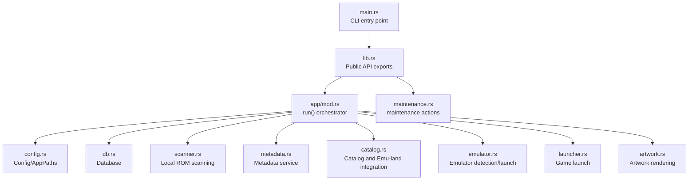
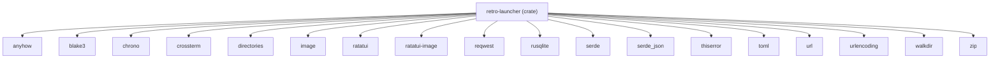

# API Reference

<cite>
**Referenced Files in This Document**
- [lib.rs](file://src/lib.rs)
- [main.rs](file://src/main.rs)
- [config.rs](file://src/config.rs)
- [error.rs](file://src/error.rs)
- [models.rs](file://src/models.rs)
- [maintenance.rs](file://src/maintenance.rs)
- [app/mod.rs](file://src/app/mod.rs)
- [db.rs](file://src/db.rs)
- [emulator.rs](file://src/emulator.rs)
- [launcher.rs](file://src/launcher.rs)
- [scanner.rs](file://src/scanner.rs)
- [catalog.rs](file://src/catalog.rs)
- [metadata.rs](file://src/metadata.rs)
- [artwork.rs](file://src/artwork.rs)
- [Cargo.toml](file://Cargo.toml)
</cite>

## Table of Contents
1. [Introduction](#introduction)
2. [Project Structure](#project-structure)
3. [Core Components](#core-components)
4. [Architecture Overview](#architecture-overview)
5. [Detailed Component Analysis](#detailed-component-analysis)
6. [Dependency Analysis](#dependency-analysis)
7. [Performance Considerations](#performance-considerations)
8. [Troubleshooting Guide](#troubleshooting-guide)
9. [Conclusion](#conclusion)
10. [Appendices](#appendices)

## Introduction
This document describes the public APIs and CLI interface of Retro Launcher. It covers:
- Public library functions and entry points
- CLI commands and operational modes
- Configuration schema and defaults
- Error types and handling strategies
- Data models and enums used across the system
- Integration patterns and practical usage examples
- Versioning, compatibility, and migration guidance
- Performance tips and best practices

## Project Structure
Retro Launcher exposes a small public surface via a library crate with two primary entry points:
- Programmatic API: run() and run_cli()
- CLI entry point: main() that delegates to run_cli()



**Diagram sources**
- [main.rs:1-9](file://src/main.rs#L1-L9)
- [lib.rs:1-39](file://src/lib.rs#L1-L39)
- [app/mod.rs:553-573](file://src/app/mod.rs#L553-L573)
- [config.rs:25-64](file://src/config.rs#L25-L64)
- [db.rs:35-46](file://src/db.rs#L35-L46)
- [scanner.rs:158-191](file://src/scanner.rs#L158-L191)
- [metadata.rs:237-277](file://src/metadata.rs#L237-L277)
- [catalog.rs:75-94](file://src/catalog.rs#L75-L94)
- [emulator.rs:27-43](file://src/emulator.rs#L27-L43)
- [launcher.rs:9-27](file://src/launcher.rs#L9-L27)
- [artwork.rs:35-63](file://src/artwork.rs#L35-L63)

**Section sources**
- [lib.rs:18-38](file://src/lib.rs#L18-L38)
- [main.rs:3-8](file://src/main.rs#L3-L8)

## Core Components
This section documents the public API surface and key configuration.

- Public library API
  - run(): Starts the interactive terminal UI
  - run_cli(args): CLI entry point supporting maintenance subcommands
- CLI operational modes
  - run(): Full interactive mode
  - run_cli(["maintenance", "<action>"]): Maintenance mode with repair/clear/reset actions
- Configuration
  - Config: TOML-backed configuration with defaults and environment-aware paths
  - AppPaths: Paths for config, data, downloads, and database
- Error types
  - LauncherError: Structured error types with user and technical messages
  - Result<T>: Type alias for Result<T, LauncherError>
  - IntoLauncherError: Trait to convert arbitrary errors into LauncherError with context

**Section sources**
- [lib.rs:18-38](file://src/lib.rs#L18-L38)
- [config.rs:25-113](file://src/config.rs#L25-L113)
- [error.rs:10-101](file://src/error.rs#L10-L101)

## Architecture Overview
High-level runtime flow for the interactive UI and maintenance actions.

```mermaid
sequenceDiagram
participant CLI as "CLI (main.rs)"
participant Lib as "Library (lib.rs)"
participant App as "App (app/mod.rs)"
participant DB as "Database (db.rs)"
participant CFG as "Config (config.rs)"
participant CAT as "Catalog (catalog.rs)"
participant META as "Metadata (metadata.rs)"
participant SCN as "Scanner (scanner.rs)"
participantEMU as "Emulator (emulator.rs)"
participant LCH as "Launcher (launcher.rs)"
CLI->>Lib : run_cli(args)
alt maintenance subcommand
Lib->>Lib : parse maintenance action
Lib->>DB : Database : : new(db_path)
Lib->>DB : run maintenance action
DB-->>Lib : status message
Lib-->>CLI : print message
else run interactive
Lib->>CFG : Config : : load_or_create()
CFG-->>Lib : (config, paths)
Lib->>DB : Database : : new(db_path)
Lib->>App : App : : new(config, paths, db)
App->>DB : load_games_and_metadata()
App->>SCN : spawn startup jobs (scan, metadata)
App->>CAT : browse/search previews
App->>META : enrich metadata
App-->>CLI : run loop until quit
end
```

**Diagram sources**
- [main.rs:3-8](file://src/main.rs#L3-L8)
- [lib.rs:20-38](file://src/lib.rs#L20-L38)
- [app/mod.rs:125-170](file://src/app/mod.rs#L125-L170)
- [db.rs:425-438](file://src/db.rs#L425-L438)
- [scanner.rs:386-400](file://src/scanner.rs#L386-L400)
- [catalog.rs:277-303](file://src/catalog.rs#L277-L303)
- [metadata.rs:265-321](file://src/metadata.rs#L265-L321)

## Detailed Component Analysis

### Public Library API
- run()
  - Purpose: Initialize configuration, database, and start the interactive terminal UI
  - Parameters: None
  - Returns: Result<(), anyhow::Error>
  - Behavior: Loads config and paths, initializes database, constructs App, runs the terminal loop
- run_cli(args)
  - Purpose: Dispatch CLI commands
  - Parameters: args: Vec<String> (command-line arguments)
  - Returns: Result<(), anyhow::Error>
  - Behavior:
    - If args indicates maintenance subcommand, parse action and run maintenance, printing a summary
    - Otherwise, delegate to run()
  - Notes: Exits with non-zero status on error

**Section sources**
- [lib.rs:20-38](file://src/lib.rs#L20-L38)
- [main.rs:3-8](file://src/main.rs#L3-L8)

### CLI Operational Modes
- Interactive mode
  - Invoked by run() or run_cli([]) when no maintenance action is provided
  - Initializes terminal UI, loads library state, and enters event loop
- Maintenance mode
  - Invoked by run_cli(["maintenance", "<action>"])
  - Supported actions:
    - repair or repair-state: Repair and migrate database state
    - clear-metadata: Clear resolved metadata and artwork caches
    - reset-downloads: Remove launcher-managed downloads and related DB rows
    - reset-all: Remove database, downloads, and artwork caches
  - Returns: Human-readable status message printed to stdout

**Section sources**
- [lib.rs:24-38](file://src/lib.rs#L24-L38)
- [maintenance.rs:8-26](file://src/maintenance.rs#L8-L26)
- [maintenance.rs:28-88](file://src/maintenance.rs#L28-L88)

### Configuration Schema and Defaults
- Config fields
  - rom_roots: List of directories to scan for ROMs
  - managed_download_dir: Directory for launcher-managed downloads
  - scan_on_startup: Whether to auto-scan on startup
  - show_hidden_files: Whether to include hidden files during scans
  - preferred_emulators: Preferred emulator per platform
- AppPaths fields
  - config_dir, data_dir, downloads_dir, db_path, config_path
- Default behavior
  - If config file does not exist, defaults are written to a platform-specific config path
  - managed_download_dir defaults to a subdirectory under data_dir if unspecified
  - Preferred emulators include defaults for several platforms

**Section sources**
- [config.rs:25-113](file://src/config.rs#L25-L113)

### Data Models and Enums
- Platform: ROM platform identifiers (e.g., GameBoy, Nes, Ps1, etc.)
- EmulatorKind: Available emulators (e.g., Mgba, Mednafen, Fceux, RetroArch)
- InstallState: State of a game entry (Ready, DownloadAvailable, Downloading, etc.)
- MetadataMatchState: Resolution state of metadata (Resolved, Ambiguous, Unmatched, etc.)
- SourceKind: Origin of a game entry (LocalScan, Catalog, UserUrl)
- GameEntry: Complete game record persisted in the database
- ResolvedMetadata: Enriched metadata for a game
- CatalogEntry: Entry from a catalog manifest

**Section sources**
- [models.rs:8-23](file://src/models.rs#L8-L23)
- [models.rs:150-156](file://src/models.rs#L150-L156)
- [models.rs:193-201](file://src/models.rs#L193-L201)
- [models.rs:204-224](file://src/models.rs#L204-L224)
- [models.rs:248-280](file://src/models.rs#L248-L280)
- [models.rs:306-329](file://src/models.rs#L306-L329)
- [models.rs:338-351](file://src/models.rs#L338-L351)

### Error Types and Handling
- LauncherError variants
  - ScanError, DownloadError, EmulatorNotFound, MetadataError, DatabaseError, ConfigError, CatalogError, IoError, Context
- Methods
  - user_message(): Friendly message for UI
  - technical_message(): Full diagnostic string
- Result<T> and IntoLauncherError<T>
  - Standardize error propagation and context wrapping

**Section sources**
- [error.rs:10-98](file://src/error.rs#L10-L98)
- [error.rs:100-116](file://src/error.rs#L100-L116)

### Database API
- Initialization and schema
  - CURRENT_SCHEMA_VERSION constant
  - Tables: games, schema_meta, resolved_metadata, metadata_cache
- Key operations
  - repair_and_migrate_state(paths): Normalize URLs, fix broken payloads, reset emulator assignments
  - all_games(), all_games_with_metadata(), load_games_and_metadata()
  - upsert_game(), remove_game(), transfer_resolved_metadata()
  - find_by_hash(), find_by_id(), record_launch(), set_game_emulator_kind()
  - clear_metadata_cache()
  - upsert_resolved_metadata(), find_resolved_metadata()
  - upsert_metadata_cache(), find_cached_metadata()
  - merge_catalog_entries(entries)

**Section sources**
- [db.rs:18](file://src/db.rs#L18)
- [db.rs:48-117](file://src/db.rs#L48-L117)
- [db.rs:129-267](file://src/db.rs#L129-L267)
- [db.rs:269-325](file://src/db.rs#L269-L325)
- [db.rs:327-438](file://src/db.rs#L327-L438)
- [db.rs:506-541](file://src/db.rs#L506-L541)
- [db.rs:543-623](file://src/db.rs#L543-L623)
- [db.rs:768-800](file://src/db.rs#L768-L800)

### Emulator Integration
- Detection and availability
  - detect(kind): Resolve emulator executable path
  - availability(kind): Installed, Downloadable, or Unavailable
  - emulators_for_platform(platform): Supported emulators per platform
- Launch preparation
  - ensure_installed(kind): Ensure emulator is installed and available
  - build_command(kind, emulator_path, rom_path): Construct process command
- Launcher
  - launch_game(db, game, emulator_kind): Launch ROM with selected emulator, update stats

**Section sources**
- [emulator.rs:27-100](file://src/emulator.rs#L27-L100)
- [emulator.rs:110-127](file://src/emulator.rs#L110-L127)
- [launcher.rs:9-27](file://src/launcher.rs#L9-L27)

### Scanner and Import
- scan_rom_roots(db, roots, show_hidden): Discover ROMs and import into DB
- import_file(db, path, source_kind, origin_url, origin_label): Create or update GameEntry
- resolve_install_state(platform): Compute initial install state
- ZIP handling helpers: download_filename_for_url, resolve_downloaded_rom_path, path_looks_like_zip

**Section sources**
- [scanner.rs:158-191](file://src/scanner.rs#L158-L191)
- [scanner.rs:193-265](file://src/scanner.rs#L193-L265)
- [scanner.rs:20](file://src/scanner.rs#L20-L34)
- [scanner.rs:52-108](file://src/scanner.rs#L52-L108)

### Metadata Service
- Providers
  - StarterPackProvider, EmuLandProvider, CatalogTitleProvider, FilenameHeuristicProvider
- Service
  - MetadataService::new(db, paths)
  - enrich_game(game): Resolve best metadata, cache, and materialize ResolvedMetadata
  - preview_metadata_match(raw_title, platform, origin_url): Preview match for UI
- Utilities
  - normalize_title(), merge_best_match(), sanitize_stem()

**Section sources**
- [metadata.rs:55-112](file://src/metadata.rs#L55-L112)
- [metadata.rs:147-168](file://src/metadata.rs#L147-L168)
- [metadata.rs:170-235](file://src/metadata.rs#L170-L235)
- [metadata.rs:237-321](file://src/metadata.rs#L237-L321)
- [metadata.rs:428-473](file://src/metadata.rs#L428-L473)

### Catalog and Emu-land Integration
- load_catalog(manifest_paths): Load entries from JSON/TOML manifests
- parse_user_url(input): Parse user-provided URL with optional hints
- preview_user_url(input, paths): Resolve and preview metadata for a URL
- search_emu_land(query): Search Emu-land for games
- preview_emu_land_search_result(result, paths): Resolve preview for a search result
- load_emu_land_top(page): Fetch top listings
- Utilities: normalize_download_url, infer_* helpers, cache_* functions

**Section sources**
- [catalog.rs:75-94](file://src/catalog.rs#L75-L94)
- [catalog.rs:96-140](file://src/catalog.rs#L96-L140)
- [catalog.rs:142-275](file://src/catalog.rs#L142-L275)
- [catalog.rs:277-303](file://src/catalog.rs#L277-L303)
- [catalog.rs:305-325](file://src/catalog.rs#L305-L325)
- [catalog.rs:327-351](file://src/catalog.rs#L327-L351)

### Artwork Rendering
- ArtworkController
  - new(capabilities), unsupported()
  - sync_to_game(paths, game, metadata), sync_to_path(key, path)
  - render(frame, area, block, fallback_lines, style)
  - source_label(), path_label()
- Resolution order
  - Cached metadata artwork, companion files near ROM, cache fallback

**Section sources**
- [artwork.rs:35-208](file://src/artwork.rs#L35-L208)
- [artwork.rs:215-246](file://src/artwork.rs#L215-L246)

### App Orchestration
- App struct and lifecycle
  - new(config, paths, db): Initialize state, load data, repair/migrate
  - initialize_terminal_ui(), set_viewport_mode(viewport_mode)
  - selection(), selected_game(), selected_browse_item()
  - metadata_for_game(), display_title_for(game)
  - recompute_filtered_games(), sort_games
  - spawn_startup_jobs(), run_launch_choice(), launch_with_terminal_suspend()
  - open_emulator_picker(), activate_selected()
  - toast_* helpers
- Worker and UI loop
  - run_app(): Event loop, render, handle key events

**Section sources**
- [app/mod.rs:94-123](file://src/app/mod.rs#L94-L123)
- [app/mod.rs:125-170](file://src/app/mod.rs#L125-L170)
- [app/mod.rs:260-292](file://src/app/mod.rs#L260-L292)
- [app/mod.rs:386-400](file://src/app/mod.rs#L386-L400)
- [app/mod.rs:402-551](file://src/app/mod.rs#L402-L551)
- [app/mod.rs:553-621](file://src/app/mod.rs#L553-L621)

## Dependency Analysis
External dependencies and crates used by the library.



**Diagram sources**
- [Cargo.toml:6-24](file://Cargo.toml#L6-L24)

**Section sources**
- [Cargo.toml:1-28](file://Cargo.toml#L1-L28)

## Performance Considerations
- Database queries
  - all_games_with_metadata() performs a single JOIN to avoid N+1 metadata queries
  - load_games_and_metadata() returns both vectors and a HashMap for fast lookups
- Sorting and filtering
  - sort_games() buckets by install state and sorts by title for consistent ordering
  - recompute_filtered_games() filters by canonical title or resolved metadata title
- Metadata enrichment
  - MetadataService caches resolved metadata and provider results to reduce network calls
- Artwork
  - ArtworkController defers loading until needed and falls back to text when images are unsupported
- Scanning
  - scan_rom_roots() respects hidden file visibility and uses WalkDir for recursive traversal

[No sources needed since this section provides general guidance]

## Troubleshooting Guide
- Error classification
  - ScanError: Directory scanning failures; check permissions and paths
  - DownloadError: Network or payload issues; verify URL and connectivity
  - EmulatorNotFound: Emulator not installed; install via system package manager
  - MetadataError: Provider resolution failures; retry later or adjust URL
  - DatabaseError: Operation failures; inspect logs and consider maintenance reset
  - ConfigError: Invalid configuration; review config file
  - CatalogError: Catalog URL/file issues; verify URL or file path
  - IoError: General I/O problems; check disk space and permissions
  - Context: Wrapped errors with contextual messages
- User vs technical messages
  - Use user_message() for UI prompts and technical_message() for logs
- Maintenance actions
  - Use maintenance reset actions to recover from corrupted state or cache issues

**Section sources**
- [error.rs:61-98](file://src/error.rs#L61-L98)
- [maintenance.rs:28-88](file://src/maintenance.rs#L28-L88)

## Conclusion
Retro Launcher provides a concise public API for launching and managing classic ROMs with a robust configuration system, structured error handling, and a rich metadata pipeline. The CLI supports both interactive usage and maintenance operations. The database schema and caching layers are designed for reliability and performance.

[No sources needed since this section summarizes without analyzing specific files]

## Appendices

### CLI Specification
- Commands
  - retro-launcher
    - Starts interactive mode
  - retro-launcher maintenance <repair|clear-metadata|reset-downloads|reset-all>
    - Executes maintenance action and prints a summary message

**Section sources**
- [lib.rs:24-38](file://src/lib.rs#L24-L38)

### Configuration Options
- Config fields
  - rom_roots: Vec<PathBuf>
  - managed_download_dir: PathBuf
  - scan_on_startup: bool
  - show_hidden_files: bool
  - preferred_emulators: Vec<EmulatorPreference(platform, emulator)>
- AppPaths fields
  - config_dir, data_dir, downloads_dir, db_path, config_path

**Section sources**
- [config.rs:25-32](file://src/config.rs#L25-L32)
- [config.rs:10-17](file://src/config.rs#L10-L17)

### Environment Variables and Runtime Parameters
- HOME environment variable influences default ROM roots when generating defaults
- No explicit environment variables are parsed by the configuration loader; paths are derived from directories crate

**Section sources**
- [config.rs:67-69](file://src/config.rs#L67-L69)

### Versioning and Compatibility
- Package version: 0.1.0
- Edition: 2024
- Migration guidance
  - Database schema version is tracked; repair_and_migrate_state() normalizes URLs, removes legacy rows, resets broken downloads, and resets emulator assignments as needed
  - Use maintenance reset-all to wipe database, downloads, and artwork caches if schema changes cause issues

**Section sources**
- [Cargo.toml:2-4](file://Cargo.toml#L2-L4)
- [db.rs:18](file://src/db.rs#L18)
- [db.rs:129-267](file://src/db.rs#L129-L267)
- [maintenance.rs:63-85](file://src/maintenance.rs#L63-L85)

### Practical Usage Examples
- Programmatic usage
  - Start interactive UI: call run()
  - Run maintenance: call run_cli(["maintenance", "repair"]) and print the returned message
- Integration patterns
  - Use Config::load_or_create() to obtain configuration and paths
  - Use Database::new() to open or initialize the SQLite database
  - Use MetadataService::new() to enrich GameEntry records
  - Use EmulatorKind and availability helpers to decide launch strategy
- Common use cases
  - Auto-scan ROM roots on startup using scan_rom_roots()
  - Preview user URLs before importing using preview_user_url()
  - Render artwork in terminal UI using ArtworkController

**Section sources**
- [lib.rs:20-38](file://src/lib.rs#L20-L38)
- [config.rs:35-64](file://src/config.rs#L35-L64)
- [db.rs:35-46](file://src/db.rs#L35-L46)
- [metadata.rs:265-321](file://src/metadata.rs#L265-L321)
- [emulator.rs:83-91](file://src/emulator.rs#L83-L91)
- [scanner.rs:158-191](file://src/scanner.rs#L158-L191)
- [catalog.rs:142-275](file://src/catalog.rs#L142-L275)
- [artwork.rs:65-144](file://src/artwork.rs#L65-L144)