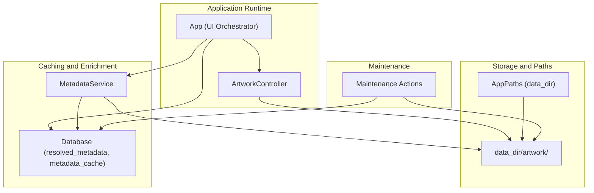
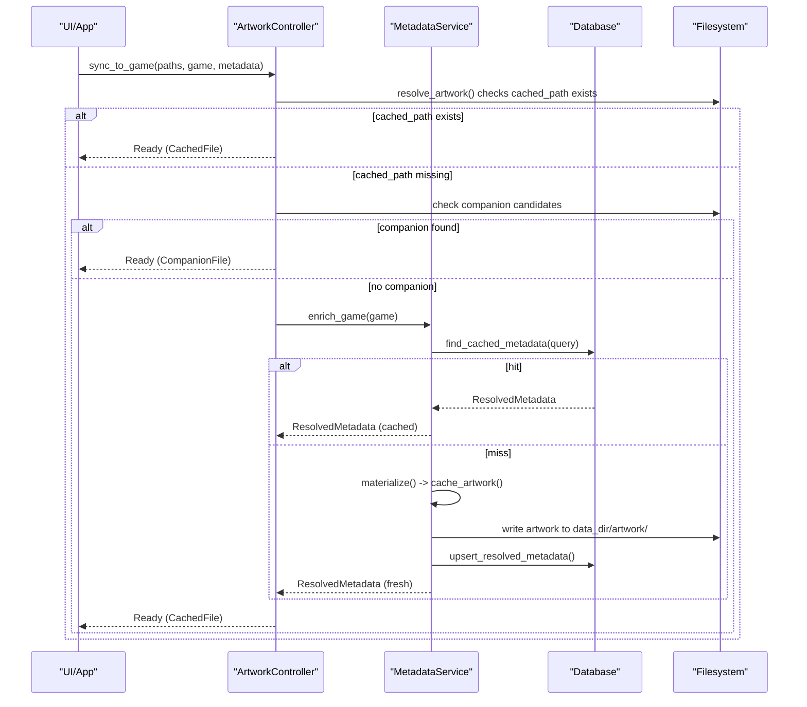
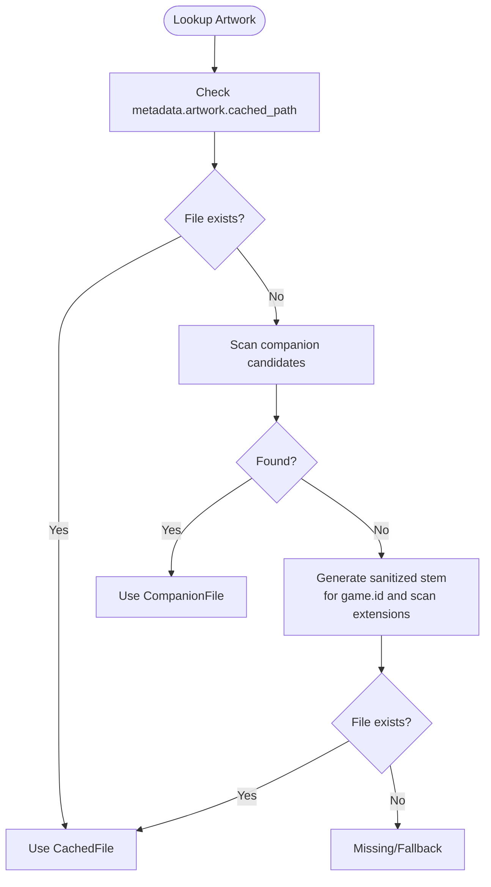
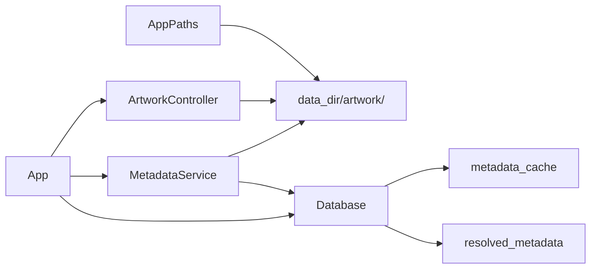

# Artwork Caching and Storage

<cite>
**Referenced Files in This Document**
- [artwork.rs](file://src/artwork.rs)
- [metadata.rs](file://src/metadata.rs)
- [db.rs](file://src/db.rs)
- [config.rs](file://src/config.rs)
- [maintenance.rs](file://src/maintenance.rs)
- [lib.rs](file://src/lib.rs)
- [app/mod.rs](file://src/app/mod.rs)
- [catalog.rs](file://src/catalog.rs)
</cite>

## Table of Contents
1. [Introduction](#introduction)
2. [Project Structure](#project-structure)
3. [Core Components](#core-components)
4. [Architecture Overview](#architecture-overview)
5. [Detailed Component Analysis](#detailed-component-analysis)
6. [Dependency Analysis](#dependency-analysis)
7. [Performance Considerations](#performance-considerations)
8. [Troubleshooting Guide](#troubleshooting-guide)
9. [Conclusion](#conclusion)

## Introduction
This document explains the artwork caching and storage system used by the application. It covers the cache directory structure under the data directory, filename sanitization strategies, cache lookup algorithms, file existence verification, fallback mechanisms, cache size management, cleanup procedures, and optimization techniques. It also includes practical examples for configuration, manual cache management commands, troubleshooting cache-related issues, and performance considerations for large artwork collections.

## Project Structure
The artwork caching system spans several modules:
- Artwork rendering and selection logic
- Metadata enrichment and artwork materialization
- Database-backed metadata cache and resolved metadata storage
- CLI maintenance actions for cache cleanup
- Application initialization and runtime artwork synchronization

**Diagram sources**
- [app/mod.rs:125-177](file://src/app/mod.rs#L125-L177)
- [artwork.rs:35-208](file://src/artwork.rs#L35-L208)
- [metadata.rs:237-369](file://src/metadata.rs#L237-L369)
- [db.rs:20-117](file://src/db.rs#L20-L117)
- [config.rs:10-44](file://src/config.rs#L10-L44)
- [maintenance.rs:28-88](file://src/maintenance.rs#L28-L88)

**Section sources**
- [app/mod.rs:125-177](file://src/app/mod.rs#L125-L177)
- [config.rs:10-44](file://src/config.rs#L10-L44)

## Core Components
- ArtworkController: Selects and renders artwork from companion files, cached files, or text fallbacks. It determines the source (local companion vs. cached) and exposes state for rendering.
- MetadataService: Resolves metadata for games and materializes artwork by downloading and storing images in the cache directory.
- Database: Stores resolved metadata and a separate metadata cache with composite keys for fast retrieval.
- App: Initializes the artwork subsystem, creates the cache directory, and synchronizes artwork for the selected item.
- Maintenance: Provides commands to clear metadata cache and artwork cache.

**Section sources**
- [artwork.rs:35-208](file://src/artwork.rs#L35-L208)
- [metadata.rs:237-369](file://src/metadata.rs#L237-L369)
- [db.rs:20-117](file://src/db.rs#L20-L117)
- [app/mod.rs:125-177](file://src/app/mod.rs#L125-L177)
- [maintenance.rs:28-88](file://src/maintenance.rs#L28-L88)

## Architecture Overview
The artwork pipeline integrates with metadata resolution and UI rendering:

**Diagram sources**
- [artwork.rs:65-118](file://src/artwork.rs#L65-L118)
- [artwork.rs:215-246](file://src/artwork.rs#L215-L246)
- [metadata.rs:279-321](file://src/metadata.rs#L279-L321)
- [metadata.rs:349-368](file://src/metadata.rs#L349-L368)
- [db.rs:587-623](file://src/db.rs#L587-L623)

## Detailed Component Analysis

### Cache Directory Structure
- Location: Under the application data directory, the artwork cache resides in a dedicated folder named artwork.
- Purpose: Stores downloaded artwork images and preview artwork for browse/search results.
- Creation: The directory is created during startup and maintenance operations.

Key locations:
- Artwork cache directory: data_dir/artwork/
- Used by:
  - MetadataService.cache_artwork()
  - catalog.cache_search_result_artwork()/cache_preview_artwork()

**Section sources**
- [app/mod.rs:161-161](file://src/app/mod.rs#L161-L161)
- [metadata.rs:349-368](file://src/metadata.rs#L349-L368)
- [catalog.rs:353-359](file://src/catalog.rs#L353-L359)
- [catalog.rs:852-871](file://src/catalog.rs#L852-L871)

### Filename Sanitization and Stem Generation
- Sanitized stems are generated by replacing non-alphanumeric characters with underscores, ensuring filesystem-safe filenames.
- Two sanitization functions are used:
  - sanitize_stem(): Used for regular artwork cache filenames derived from normalized titles.
  - sanitize_preview_stem(): Used for preview artwork cache filenames, prefixed with a constant to avoid collisions.

Examples of generated cache filenames:
- Regular artwork: <sanitized-stem>.<ext>
- Preview artwork: preview_<sanitized-stem>.<ext>

Note: The codebase does not use BLAKE3 hashing for stem generation. Instead, it relies on sanitized textual stems.

**Section sources**
- [artwork.rs:265-270](file://src/artwork.rs#L265-L270)
- [metadata.rs:468-473](file://src/metadata.rs#L468-L473)
- [catalog.rs:873-878](file://src/catalog.rs#L873-L878)

### Cache Lookup Algorithms
The system follows a prioritized lookup order:

1. Cached artwork path from resolved metadata:
   - If metadata.artwork.cached_path exists and the file is present, use it as CachedFile.
2. Companion artwork alongside ROM:
   - Scan common companion filenames around the ROM path for PNG/JPG/JPEG/BMP/GIF.
   - If found, use it as CompanionFile.
3. Cache directory lookup:
   - Generate sanitized stems from the game ID and iterate common image extensions.
   - If a file exists, use it as CachedFile.
4. Fallback:
   - If none of the above succeed, state becomes Missing or Failed depending on terminal capability.

**Diagram sources**
- [artwork.rs:215-246](file://src/artwork.rs#L215-L246)
- [artwork.rs:248-263](file://src/artwork.rs#L248-L263)

**Section sources**
- [artwork.rs:65-118](file://src/artwork.rs#L65-L118)
- [artwork.rs:215-246](file://src/artwork.rs#L215-L246)

### File Existence Verification and Fallback Mechanisms
- Existence checks are performed via direct filesystem probing before selecting artwork sources.
- Fallback behavior:
  - Unsupported terminal: renders text fallback.
  - Missing artwork: renders text fallback.
  - Failed decoding: renders error message with details.

**Section sources**
- [artwork.rs:210-213](file://src/artwork.rs#L210-L213)
- [artwork.rs:156-178](file://src/artwork.rs#L156-L178)

### Cache Materialization and Storage
- When metadata resolution yields artwork URLs, the service downloads and writes images to the cache directory using sanitized stems and original extensions.
- The artwork path is recorded in resolved metadata for future lookups.

**Section sources**
- [metadata.rs:323-347](file://src/metadata.rs#L323-L347)
- [metadata.rs:349-368](file://src/metadata.rs#L349-L368)

### Metadata Cache Keys and Resolution
- The metadata cache uses composite keys:
  - hash:<hash>
  - title:<platform>:<normalized_title>
- Lookups test these keys in order; the first hit returns the cached metadata.

**Section sources**
- [db.rs:820-831](file://src/db.rs#L820-L831)
- [db.rs:587-623](file://src/db.rs#L587-L623)

### Cache Size Management and Cleanup Procedures
- Clear metadata cache and artwork cache:
  - Deletes all files under data_dir/artwork and clears resolved_metadata and metadata_cache tables.
- Reset all:
  - Removes the database file, clears downloads directory, and purges artwork cache.
- These actions are exposed via the maintenance CLI.

Manual maintenance commands:
- Clear metadata cache and artwork cache: retro-launcher maintenance clear-metadata
- Reset downloads and related DB rows: retro-launcher maintenance reset-downloads
- Reset all (DB, artwork cache, downloads): retro-launcher maintenance reset-all

**Section sources**
- [maintenance.rs:28-88](file://src/maintenance.rs#L28-L88)
- [lib.rs:24-38](file://src/lib.rs#L24-L38)

### Storage Optimization Techniques
- Prefer companion artwork when available to avoid network fetches.
- Reuse cached artwork by stem-based naming to minimize redundant downloads.
- Use sanitized stems to prevent filesystem errors and ensure predictable filenames.
- Maintain a single cache directory per installation to centralize management.

**Section sources**
- [artwork.rs:248-263](file://src/artwork.rs#L248-L263)
- [metadata.rs:468-473](file://src/metadata.rs#L468-L473)

### Examples of Cache Configuration and Manual Management
- Configuration location and defaults:
  - AppPaths defines data_dir, which contains the artwork cache subdirectory.
  - On first run, directories are created automatically.
- Manual cache management:
  - Use maintenance commands to clear caches or reset the entire state.

**Section sources**
- [config.rs:34-64](file://src/config.rs#L34-L64)
- [app/mod.rs:161-161](file://src/app/mod.rs#L161-L161)
- [lib.rs:24-38](file://src/lib.rs#L24-L38)

## Dependency Analysis
The artwork caching system depends on:
- AppPaths for locating the data directory
- Database for metadata cache and resolved metadata
- MetadataService for downloading and storing artwork
- Filesystem for cache directory creation and file operations

**Diagram sources**
- [config.rs:10-44](file://src/config.rs#L10-L44)
- [db.rs:20-117](file://src/db.rs#L20-L117)
- [metadata.rs:237-369](file://src/metadata.rs#L237-L369)
- [artwork.rs:35-208](file://src/artwork.rs#L35-L208)
- [app/mod.rs:125-177](file://src/app/mod.rs#L125-L177)

**Section sources**
- [config.rs:10-44](file://src/config.rs#L10-L44)
- [db.rs:20-117](file://src/db.rs#L20-L117)
- [metadata.rs:237-369](file://src/metadata.rs#L237-L369)
- [artwork.rs:35-208](file://src/artwork.rs#L35-L208)
- [app/mod.rs:125-177](file://src/app/mod.rs#L125-L177)

## Performance Considerations
- Prefer companion artwork to avoid network I/O.
- Cache artwork locally to reduce repeated downloads.
- Use sanitized stems to avoid expensive filesystem operations and collisions.
- Keep artwork cache organized in a single directory for efficient scanning.
- For large collections, rely on metadata cache keys to avoid recomputation.

[No sources needed since this section provides general guidance]

## Troubleshooting Guide
Common issues and resolutions:
- Artwork not displaying:
  - Verify artwork cache directory exists under data_dir/artwork/.
  - Confirm the artwork file exists and is readable.
  - Check terminal capabilities; unsupported terminals fall back to text.
- Corrupted or invalid artwork:
  - Clear the artwork cache using maintenance clear-metadata to force regeneration.
  - Re-run metadata enrichment to re-download artwork.
- Duplicate artwork handling:
  - The cache uses sanitized stems; duplicates are prevented by filename uniqueness.
- Large collection performance:
  - Use maintenance reset-all to rebuild caches if corrupted.
  - Ensure metadata cache is populated to avoid repeated network requests.

**Section sources**
- [maintenance.rs:28-88](file://src/maintenance.rs#L28-L88)
- [artwork.rs:156-178](file://src/artwork.rs#L156-L178)

## Conclusion
The artwork caching system combines companion file detection, local cache storage, and metadata-driven enrichment to deliver reliable artwork rendering. Filenames are sanitized for safety, and the cache is organized under a dedicated directory. Maintenance actions provide straightforward cleanup and reset capabilities. By leveraging metadata cache keys and preferring local assets, the system scales efficiently for large collections.