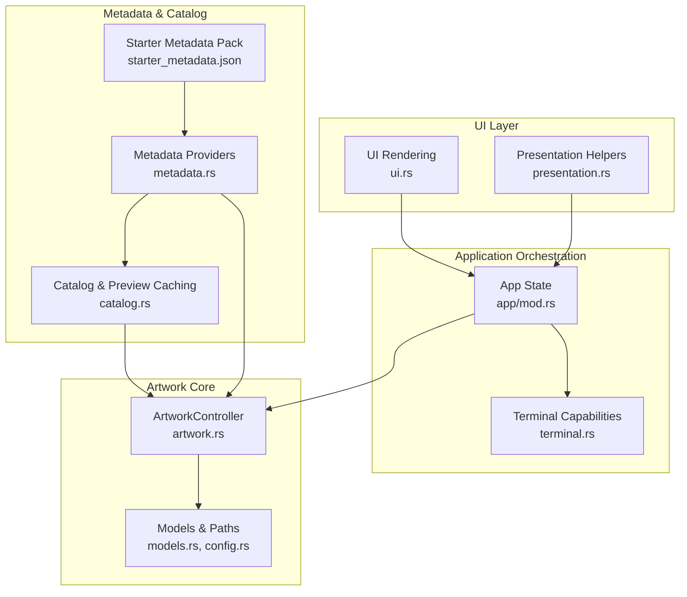
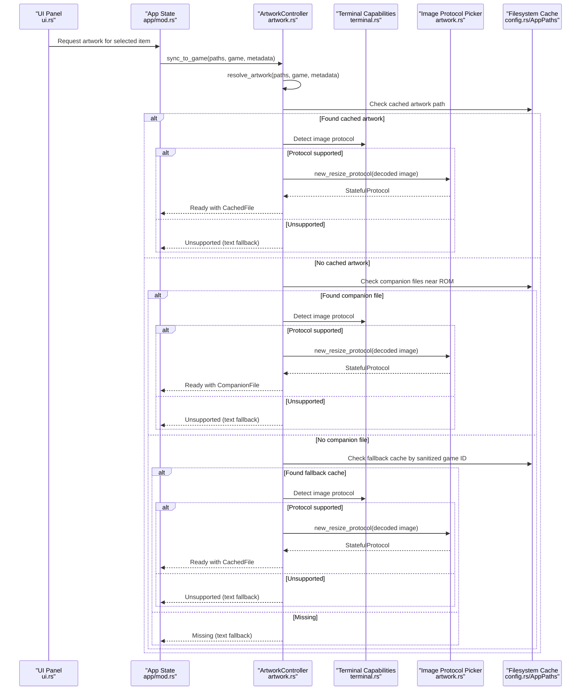
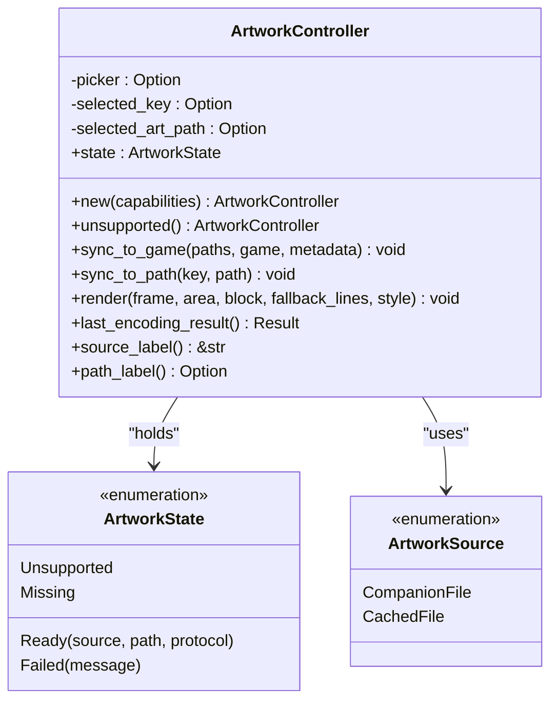
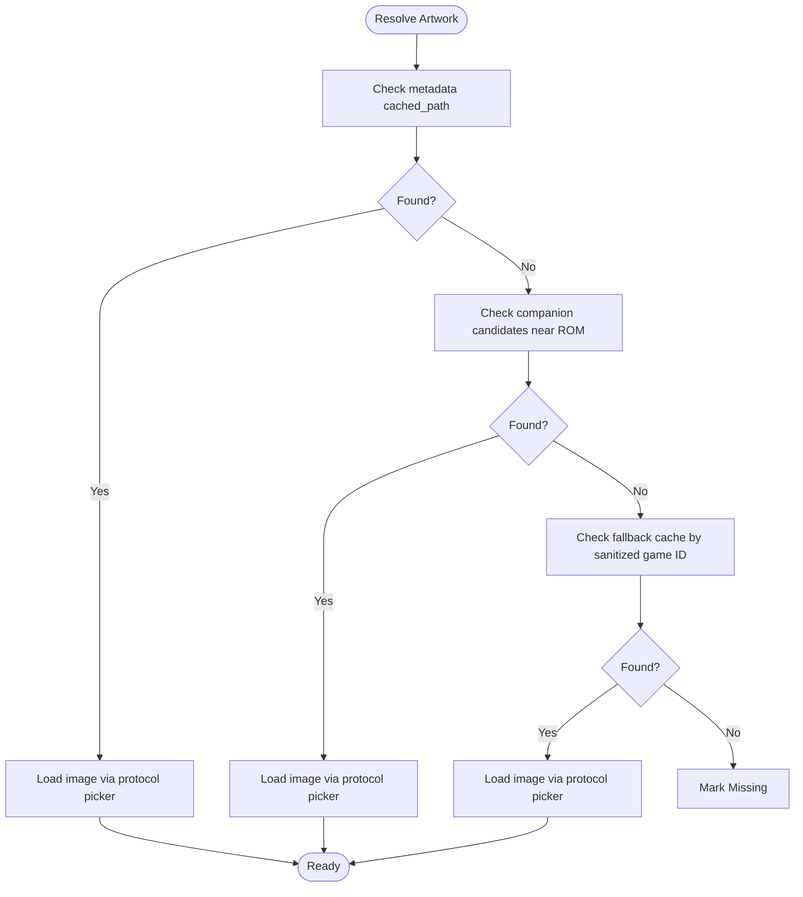
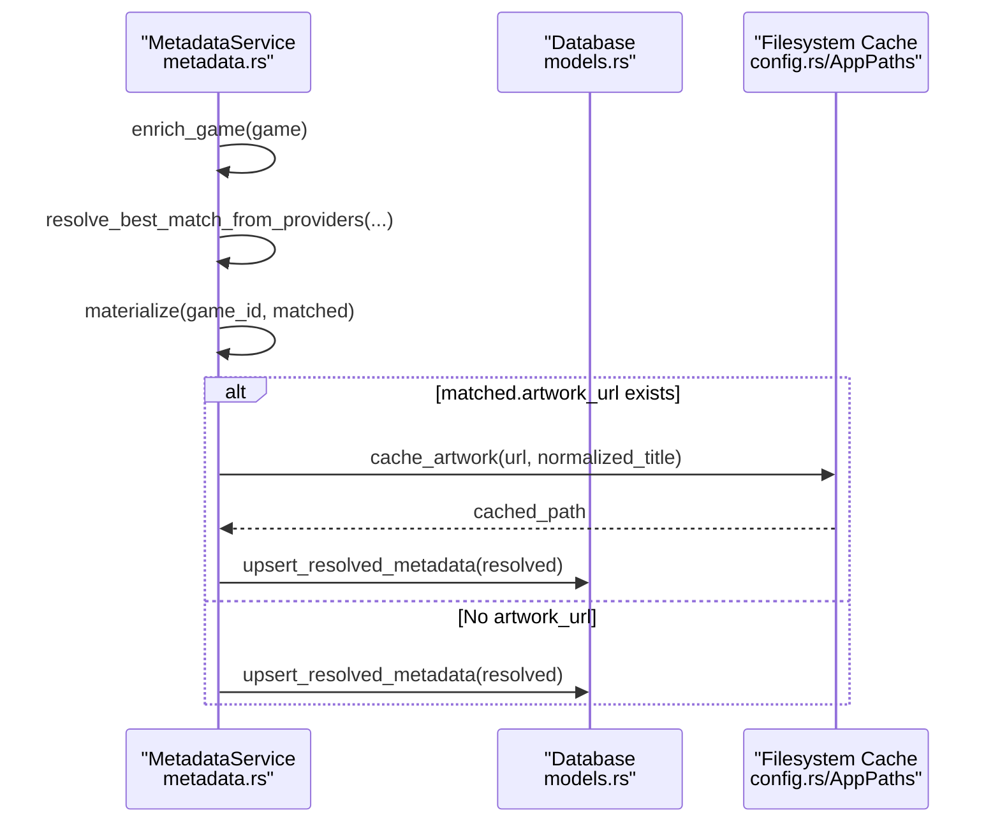
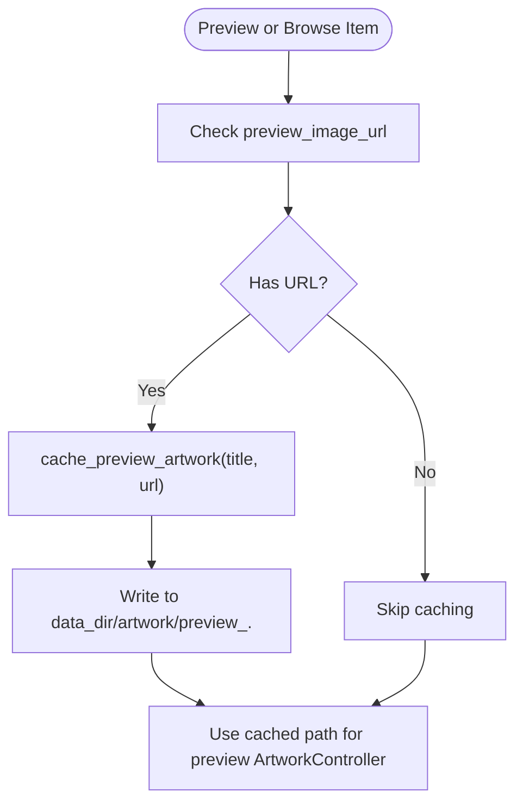
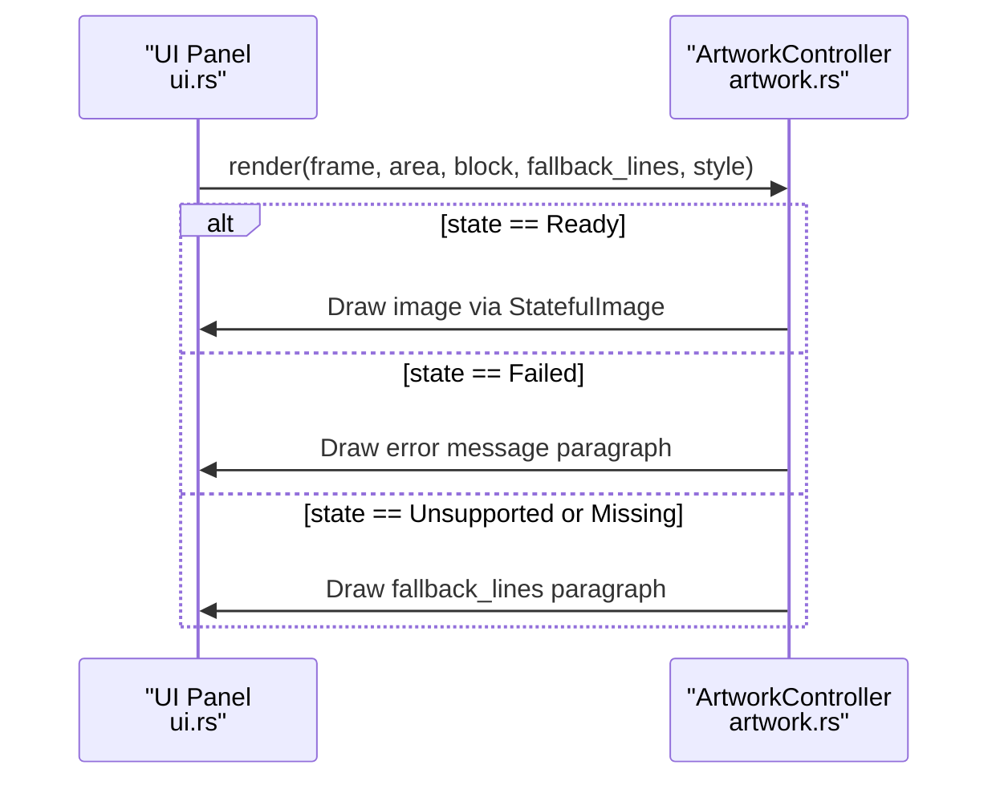
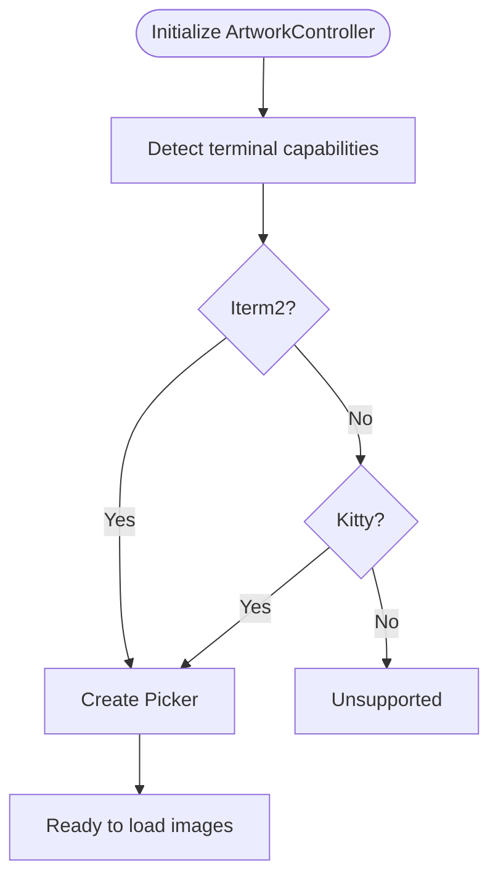
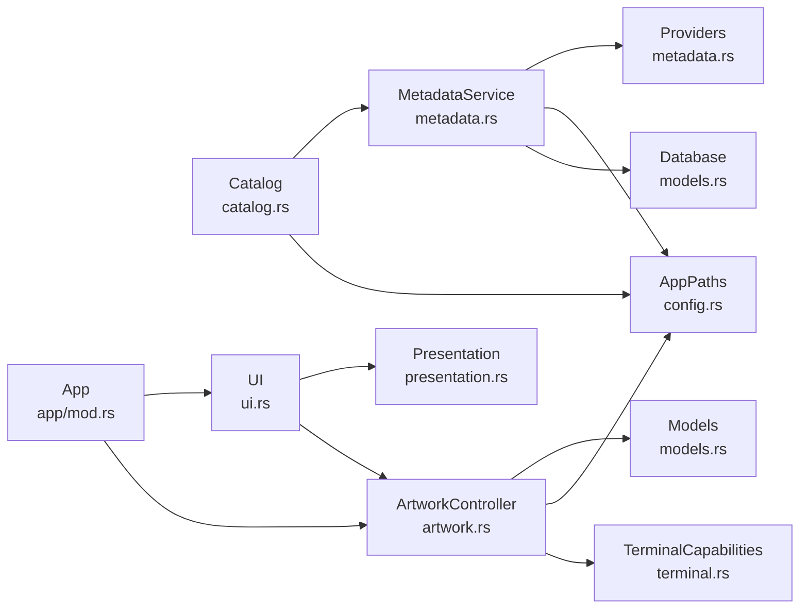

# Artwork Integration

<cite>
**Referenced Files in This Document**
- [artwork.rs](file://src/artwork.rs)
- [metadata.rs](file://src/metadata.rs)
- [catalog.rs](file://src/catalog.rs)
- [models.rs](file://src/models.rs)
- [config.rs](file://src/config.rs)
- [terminal.rs](file://src/terminal.rs)
- [ui.rs](file://src/ui.rs)
- [app/mod.rs](file://src/app/mod.rs)
- [presentation.rs](file://src/presentation.rs)
- [starter_metadata.json](file://support/starter_metadata.json)
</cite>

## Table of Contents
1. [Introduction](#introduction)
2. [Project Structure](#project-structure)
3. [Core Components](#core-components)
4. [Architecture Overview](#architecture-overview)
5. [Detailed Component Analysis](#detailed-component-analysis)
6. [Dependency Analysis](#dependency-analysis)
7. [Performance Considerations](#performance-considerations)
8. [Troubleshooting Guide](#troubleshooting-guide)
9. [Conclusion](#conclusion)
10. [Appendices](#appendices)

## Introduction
This document explains the artwork management system that powers image display in the terminal UI. It covers how artwork is sourced from multiple providers, dynamically loaded, and cached locally; how companion files are detected; and how fallback mechanisms operate. It also documents configuration options, cache management, performance optimization techniques, and troubleshooting strategies for common issues such as missing artwork, corrupted images, and cache performance problems.

## Project Structure
The artwork system spans several modules:
- Artwork controller and rendering pipeline
- Metadata enrichment and artwork caching
- Catalog browsing and artwork caching for browse previews
- UI integration and fallback rendering
- Terminal capability detection for image protocols
- Configuration and paths for cache storage

**Diagram sources**
- [ui.rs:23-68](file://src/ui.rs#L23-L68)
- [app/mod.rs:94-123](file://src/app/mod.rs#L94-L123)
- [terminal.rs:87-132](file://src/terminal.rs#L87-L132)
- [artwork.rs:35-40](file://src/artwork.rs#L35-L40)
- [models.rs:10-17](file://src/models.rs#L10-L17)
- [metadata.rs:237-369](file://src/metadata.rs#L237-L369)
- [catalog.rs:353-871](file://src/catalog.rs#L353-L871)
- [starter_metadata.json:1-89](file://support/starter_metadata.json#L1-L89)

**Section sources**
- [ui.rs:23-68](file://src/ui.rs#L23-L68)
- [app/mod.rs:94-123](file://src/app/mod.rs#L94-L123)
- [terminal.rs:87-132](file://src/terminal.rs#L87-L132)
- [artwork.rs:35-40](file://src/artwork.rs#L35-L40)
- [models.rs:10-17](file://src/models.rs#L10-L17)
- [metadata.rs:237-369](file://src/metadata.rs#L237-L369)
- [catalog.rs:353-871](file://src/catalog.rs#L353-L871)
- [starter_metadata.json:1-89](file://support/starter_metadata.json#L1-L89)

## Core Components
- ArtworkController: central orchestrator for artwork discovery, loading, and rendering. It determines the source (local companion file or cached artwork), loads the image, and renders fallbacks when unavailable or unsupported.
- MetadataService: enriches games with metadata and caches artwork remotely when available, storing the cached path for later use.
- Catalog: caches artwork for browse previews and search results, enabling fast rendering in the UI.
- TerminalCapabilities: detects terminal image protocol support (Iterm2/Kitty/Fallback) to decide whether to render images or text fallbacks.
- UI integration: renders artwork panels and falls back to text when needed, displaying source labels and paths.

**Section sources**
- [artwork.rs:35-208](file://src/artwork.rs#L35-L208)
- [metadata.rs:237-369](file://src/metadata.rs#L237-L369)
- [catalog.rs:353-871](file://src/catalog.rs#L353-L871)
- [terminal.rs:87-132](file://src/terminal.rs#L87-L132)
- [ui.rs:294-337](file://src/ui.rs#L294-L337)

## Architecture Overview
Artwork sourcing follows a layered approach:
- Source resolution: Prefer cached artwork, then companion files alongside ROMs, then fallback cache filenames derived from game IDs.
- Dynamic loading: Uses a terminal image protocol picker to decode and resize images for the terminal.
- Caching: Remote artwork is downloaded and stored under the data directory’s artwork folder; browse previews are cached separately.
- Fallback rendering: When unsupported or missing, the UI displays a text fallback with source labels.

**Diagram sources**
- [ui.rs:294-337](file://src/ui.rs#L294-L337)
- [app/mod.rs:331-347](file://src/app/mod.rs#L331-L347)
- [artwork.rs:65-118](file://src/artwork.rs#L65-L118)
- [artwork.rs:215-246](file://src/artwork.rs#L215-L246)
- [artwork.rs:210-213](file://src/artwork.rs#L210-L213)
- [terminal.rs:87-132](file://src/terminal.rs#L87-L132)
- [config.rs:10-17](file://src/config.rs#L10-L17)

## Detailed Component Analysis

### ArtworkController
Responsibilities:
- Determine artwork source: cached artwork, companion file, or fallback cache.
- Load and encode images using terminal image protocol pickers.
- Render artwork or fallback text depending on availability and terminal support.
- Expose source labels and path labels for UI.

Key behaviors:
- Supports two sources: CompanionFile and CachedFile.
- State transitions: Unsupported, Missing, Ready, Failed.
- Rendering: Draws image when ready; otherwise draws fallback text or “no art” placeholder.

**Diagram sources**
- [artwork.rs:35-208](file://src/artwork.rs#L35-L208)

**Section sources**
- [artwork.rs:35-208](file://src/artwork.rs#L35-L208)

### Artwork Resolution and Loading
Resolution order:
1. Cached artwork path from resolved metadata.
2. Companion files adjacent to ROMs or managed paths.
3. Fallback cache using sanitized game ID stem and common extensions.

Loading:
- Uses image decoding to create a protocol compatible with the terminal’s image protocol.
- Falls back to Unsupported or Missing when protocol is not available or no artwork is found.

**Diagram sources**
- [artwork.rs:215-246](file://src/artwork.rs#L215-L246)
- [artwork.rs:248-263](file://src/artwork.rs#L248-L263)
- [artwork.rs:265-270](file://src/artwork.rs#L265-L270)

**Section sources**
- [artwork.rs:215-246](file://src/artwork.rs#L215-L246)
- [artwork.rs:248-263](file://src/artwork.rs#L248-L263)
- [artwork.rs:265-270](file://src/artwork.rs#L265-L270)

### Metadata Enrichment and Remote Artwork Caching
- MetadataService enriches games by querying multiple providers and materializing a ResolvedMetadata record.
- When artwork_url is present, it downloads and stores the artwork in the cache directory under artwork/.
- The cached path is stored in ResolvedMetadata.artwork.cached_path for later use by ArtworkController.

**Diagram sources**
- [metadata.rs:279-321](file://src/metadata.rs#L279-L321)
- [metadata.rs:323-347](file://src/metadata.rs#L323-L347)
- [metadata.rs:349-368](file://src/metadata.rs#L349-L368)

**Section sources**
- [metadata.rs:279-321](file://src/metadata.rs#L279-L321)
- [metadata.rs:323-347](file://src/metadata.rs#L323-L347)
- [metadata.rs:349-368](file://src/metadata.rs#L349-L368)

### Catalog Preview Artwork Caching
- For browse previews and search results, artwork is cached under the artwork directory with a distinct naming scheme to avoid conflicts.
- The cache is reused by the preview ArtworkController during browse and preview flows.

**Diagram sources**
- [catalog.rs:305-325](file://src/catalog.rs#L305-L325)
- [catalog.rs:353-359](file://src/catalog.rs#L353-L359)
- [catalog.rs:852-871](file://src/catalog.rs#L852-L871)

**Section sources**
- [catalog.rs:305-325](file://src/catalog.rs#L305-L325)
- [catalog.rs:353-359](file://src/catalog.rs#L353-L359)
- [catalog.rs:852-871](file://src/catalog.rs#L852-L871)

### UI Integration and Fallback Rendering
- The UI renders an artwork panel and delegates to ArtworkController.render().
- When artwork is Ready, the image is drawn; otherwise, fallback text is shown with contextual labels indicating source or status.
- The UI also displays source labels and path labels for debugging and transparency.

**Diagram sources**
- [ui.rs:294-337](file://src/ui.rs#L294-L337)
- [artwork.rs:146-178](file://src/artwork.rs#L146-L178)

**Section sources**
- [ui.rs:294-337](file://src/ui.rs#L294-L337)
- [artwork.rs:146-178](file://src/artwork.rs#L146-L178)

### Terminal Capability Detection
- ArtworkController initializes a Picker only when the terminal supports an image protocol (Iterm2 or Kitty).
- If unsupported, the controller remains in Unsupported state and UI falls back to text.

**Diagram sources**
- [terminal.rs:87-132](file://src/terminal.rs#L87-L132)
- [artwork.rs:52-63](file://src/artwork.rs#L52-L63)

**Section sources**
- [terminal.rs:87-132](file://src/terminal.rs#L87-L132)
- [artwork.rs:52-63](file://src/artwork.rs#L52-L63)

## Dependency Analysis
- ArtworkController depends on:
  - TerminalCapabilities for protocol detection
  - AppPaths for cache directory resolution
  - Ratatui image widgets for rendering
- MetadataService depends on:
  - Database for persisted metadata
  - AppPaths for cache directory
  - Metadata providers (starter pack, EmuLand, filename heuristic, catalog title)
- Catalog depends on:
  - AppPaths for cache directory
  - Network client for fetching artwork URLs

**Diagram sources**
- [artwork.rs:14-16](file://src/artwork.rs#L14-L16)
- [metadata.rs:9-11](file://src/metadata.rs#L9-L11)
- [catalog.rs:9-11](file://src/catalog.rs#L9-L11)
- [ui.rs:14-18](file://src/ui.rs#L14-L18)
- [app/mod.rs:30-44](file://src/app/mod.rs#L30-L44)

**Section sources**
- [artwork.rs:14-16](file://src/artwork.rs#L14-L16)
- [metadata.rs:9-11](file://src/metadata.rs#L9-L11)
- [catalog.rs:9-11](file://src/catalog.rs#L9-L11)
- [ui.rs:14-18](file://src/ui.rs#L14-L18)
- [app/mod.rs:30-44](file://src/app/mod.rs#L30-L44)

## Performance Considerations
- Image decoding and resizing: The protocol picker decodes and resizes images; avoid unnecessary reloads by reusing the same key/path comparison in sync_to_game and sync_to_path.
- Cache locality: Place cache directory under the data directory to keep artwork close to the database and avoid cross-device IO.
- Extension scanning: Limit extension checks to common image formats to reduce filesystem overhead.
- Terminal protocol: Prefer Kitty or Iterm2 for native image rendering; fallback to text reduces CPU usage on unsupported terminals.
- Batch operations: When enriching many games, consider batching metadata requests and caching artwork in parallel where safe.

[No sources needed since this section provides general guidance]

## Troubleshooting Guide
Common issues and resolutions:
- Missing artwork
  - Cause: No cached artwork, no companion file, and no fallback cache.
  - Resolution: Ensure metadata enrichment ran and artwork_url is present; confirm cache directory exists and is writable.
  - Verification: Use path_label() to inspect the resolved path and source_label() to confirm source.
- Corrupted images
  - Cause: Downloaded or local image is invalid.
  - Resolution: Delete the cached file; re-run enrichment to re-download; verify terminal supports the image protocol.
  - Verification: Check ArtworkState::Failed for error messages.
- Cache performance problems
  - Cause: Large cache directory or frequent re-downloads.
  - Resolution: Periodically prune unused artwork; limit concurrent downloads; ensure cache directory is on fast storage.
- Terminal unsupported
  - Cause: Terminal lacks image protocol support.
  - Resolution: Use a compatible terminal (Iterm2 or Kitty) or rely on text fallback.
  - Verification: Check ArtworkState::Unsupported and terminal capabilities.

Operational tips:
- Use source_label() and path_label() to diagnose source and path.
- Monitor UI fallback lines to quickly identify missing artwork scenarios.
- Re-run enrichment to refresh cached artwork when metadata changes.

**Section sources**
- [artwork.rs:184-208](file://src/artwork.rs#L184-L208)
- [artwork.rs:146-178](file://src/artwork.rs#L146-L178)
- [terminal.rs:87-132](file://src/terminal.rs#L87-L132)

## Conclusion
The artwork integration combines robust source resolution, dynamic loading, and efficient caching to deliver a responsive UI experience. By leveraging metadata providers, companion file detection, and terminal-aware rendering, it balances flexibility and performance. Proper configuration and cache management ensure reliable artwork display across diverse environments.

[No sources needed since this section summarizes without analyzing specific files]

## Appendices

### Configuration Options for Artwork Sources and Cache
- Cache directory
  - Location: data_dir/artwork
  - Purpose: Stores cached artwork from metadata providers and browse previews.
  - Access: Managed via AppPaths and used by MetadataService and Catalog.
- Cache naming
  - Metadata artwork: Uses sanitized normalized title stem and inferred extension.
  - Browse previews: Uses sanitized title stem prefixed with preview_.
- Supported image formats
  - PNG, JPEG, GIF, BMP are scanned for companion files and used for caching.
- Quality settings
  - Controlled implicitly by the terminal image protocol and decoder; no explicit quality parameter is exposed.
- Fallback mechanisms
  - Text fallback displayed when artwork is Missing or Unsupported.
  - Source labels indicate COMPANION ART, CACHED ART, TEXT FALLBACK, NO ART, or ART ERROR.

**Section sources**
- [config.rs:10-17](file://src/config.rs#L10-L17)
- [metadata.rs:349-368](file://src/metadata.rs#L349-L368)
- [catalog.rs:852-871](file://src/catalog.rs#L852-L871)
- [artwork.rs:239-244](file://src/artwork.rs#L239-L244)
- [artwork.rs:184-208](file://src/artwork.rs#L184-L208)

### Example Workflows
- Enrich a game and cache artwork
  - Call MetadataService.enrich_game(game) to resolve metadata and cache artwork if available.
  - ArtworkController.sync_to_game(...) will then pick the cached path automatically.
- Preview a browse result
  - Use Catalog.cache_search_result_artwork(...) to cache preview artwork.
  - ArtworkController.sync_to_path(...) renders the cached preview image.
- Local companion artwork
  - Place PNG/JPEG/GIF/BMP files next to ROMs with standardized naming patterns; ArtworkController.resolve_artwork(...) will detect them.

**Section sources**
- [metadata.rs:279-321](file://src/metadata.rs#L279-L321)
- [catalog.rs:353-359](file://src/catalog.rs#L353-L359)
- [artwork.rs:215-246](file://src/artwork.rs#L215-L246)