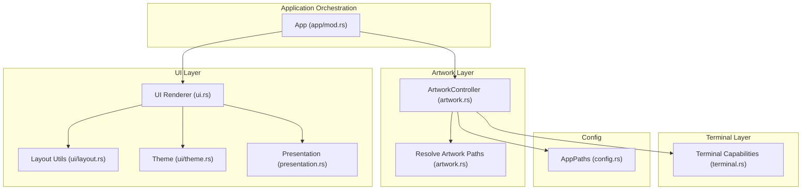
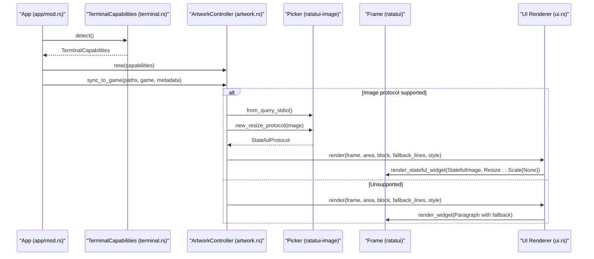
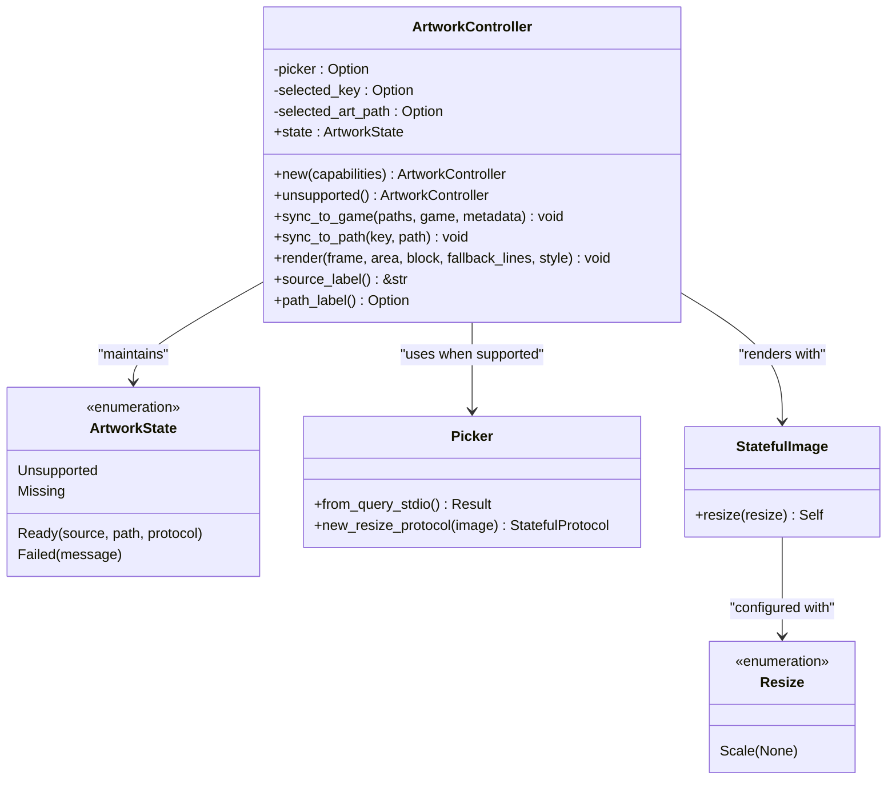
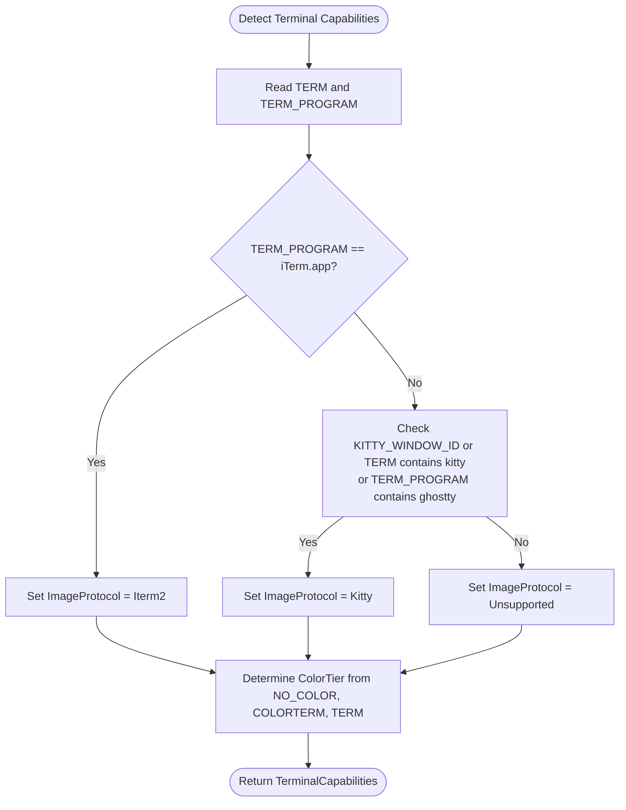
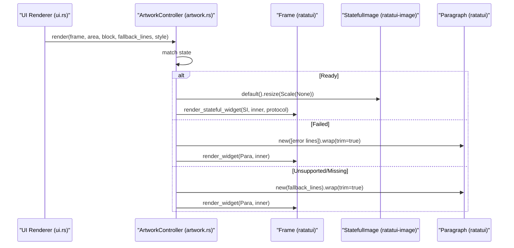
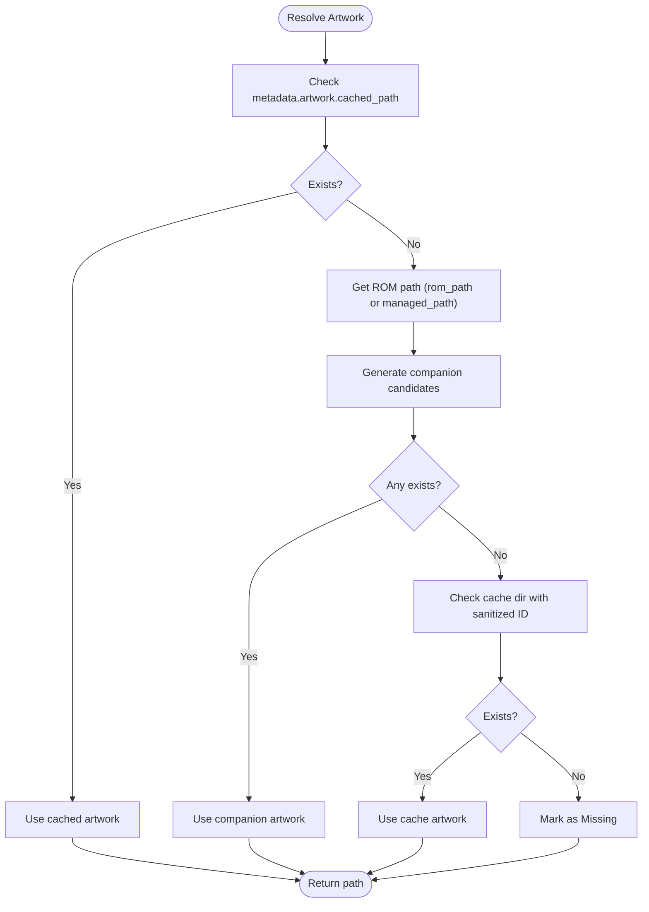
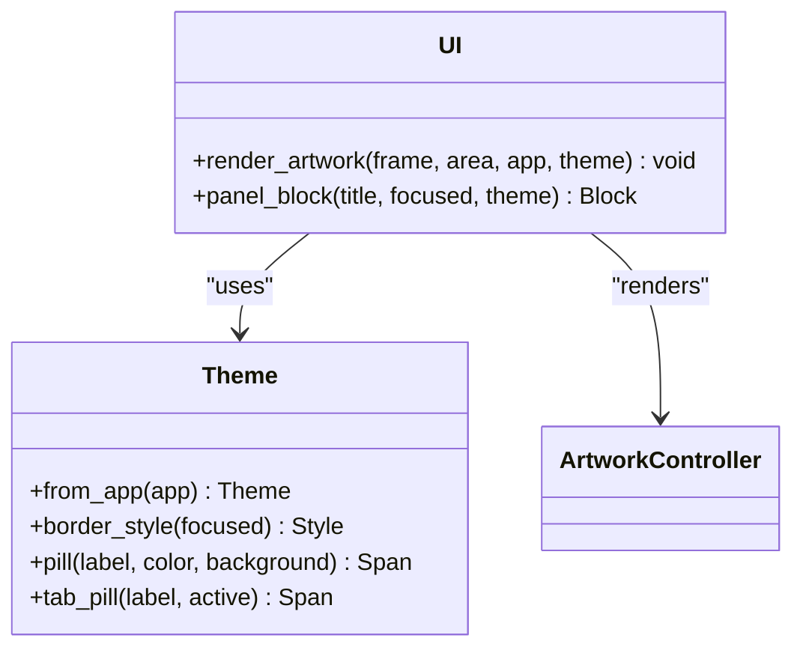
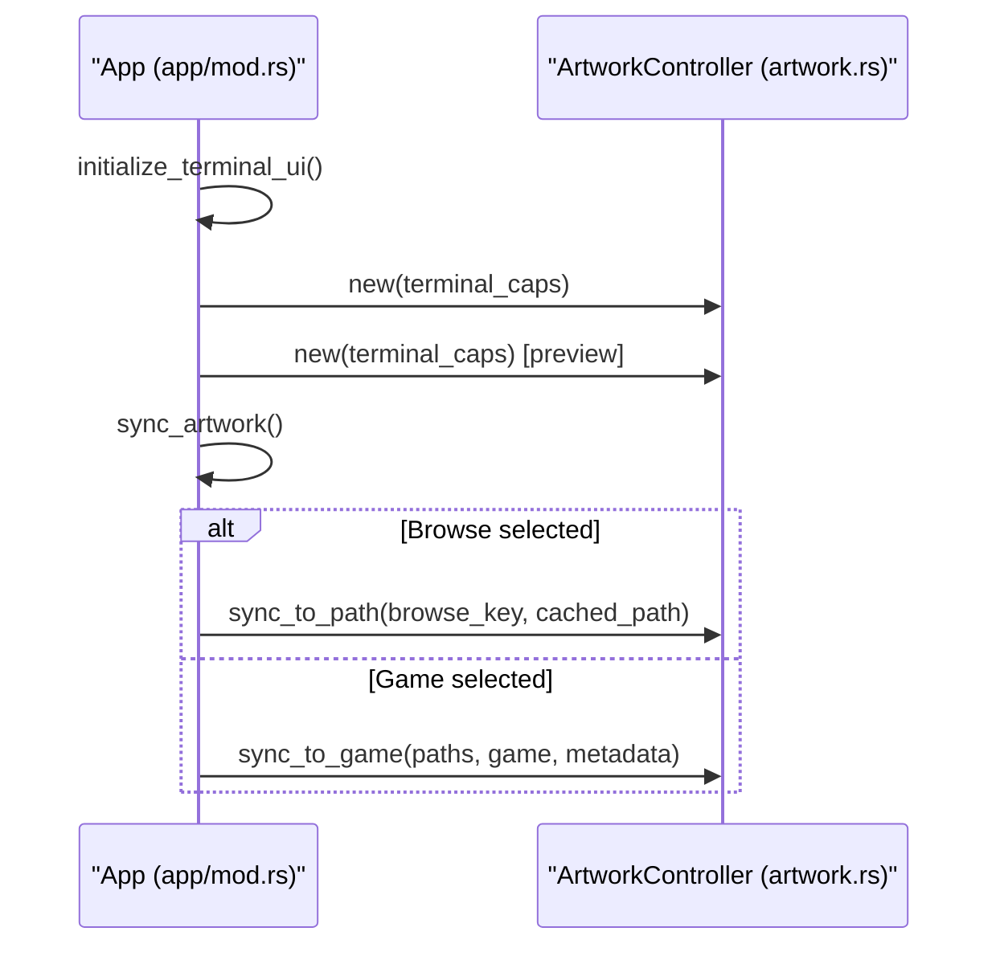
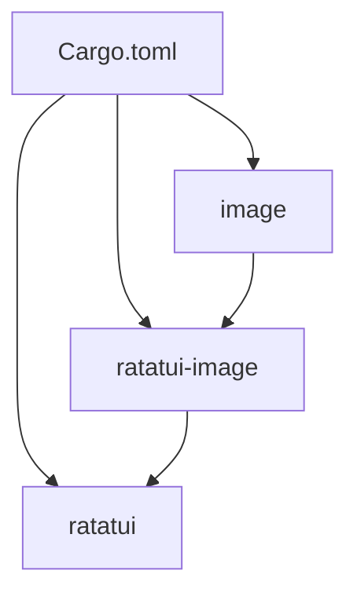

# Artwork Rendering and Display

<cite>
**Referenced Files in This Document**
- [artwork.rs](file://src/artwork.rs)
- [ui.rs](file://src/ui.rs)
- [terminal.rs](file://src/terminal.rs)
- [presentation.rs](file://src/presentation.rs)
- [models.rs](file://src/models.rs)
- [ui/layout.rs](file://src/ui/layout.rs)
- [ui/theme.rs](file://src/ui/theme.rs)
- [app/mod.rs](file://src/app/mod.rs)
- [config.rs](file://src/config.rs)
- [Cargo.toml](file://Cargo.toml)
</cite>

## Table of Contents
1. [Introduction](#introduction)
2. [Project Structure](#project-structure)
3. [Core Components](#core-components)
4. [Architecture Overview](#architecture-overview)
5. [Detailed Component Analysis](#detailed-component-analysis)
6. [Dependency Analysis](#dependency-analysis)
7. [Performance Considerations](#performance-considerations)
8. [Troubleshooting Guide](#troubleshooting-guide)
9. [Conclusion](#conclusion)
10. [Appendices](#appendices)

## Introduction
This document explains the artwork rendering and display system used in the terminal-based application. It covers how artwork is detected, loaded, scaled, and rendered to the terminal using ratatui-image’s StatefulImage widget and Resize protocol. It documents the rendering pipeline from artwork discovery to terminal display, including error handling and fallback rendering with text alternatives. It also details terminal capability detection for image protocol support, scaling algorithms, aspect ratio preservation, configuration options, styling customization, and performance optimization strategies.

## Project Structure
The artwork rendering system is composed of:
- Artwork discovery and protocol creation in the artwork module
- UI integration and fallback rendering in the UI module
- Terminal capability detection and protocol identification in the terminal module
- Presentation helpers and theme integration in the presentation and UI theme modules
- Application orchestration and artwork synchronization in the app module
- Configuration and paths in the config module

**Diagram sources**
- [app/mod.rs:172-177](file://src/app/mod.rs#L172-L177)
- [artwork.rs:35-208](file://src/artwork.rs#L35-L208)
- [ui.rs:294-337](file://src/ui.rs#L294-L337)
- [terminal.rs:86-133](file://src/terminal.rs#L86-L133)
- [config.rs:10-17](file://src/config.rs#L10-L17)

**Section sources**
- [Cargo.toml:6-24](file://Cargo.toml#L6-L24)

## Core Components
- ArtworkController: Manages artwork state, protocol creation, and rendering with ratatui-image fallbacks.
- TerminalCapabilities: Detects terminal image protocol support and color tier.
- UI rendering: Renders artwork panels with fallback text blocks and integrates with theme and layout.
- Presentation helpers: Provide contextual labels and status lines for artwork state.
- App orchestration: Synchronizes artwork selection with the active game or browse item and initializes controllers.

**Section sources**
- [artwork.rs:35-208](file://src/artwork.rs#L35-L208)
- [terminal.rs:86-133](file://src/terminal.rs#L86-L133)
- [ui.rs:294-337](file://src/ui.rs#L294-L337)
- [presentation.rs:161-170](file://src/presentation.rs#L161-L170)
- [app/mod.rs:172-177](file://src/app/mod.rs#L172-L177)

## Architecture Overview
The artwork rendering pipeline integrates terminal capability detection, artwork resolution, protocol creation, and UI rendering with graceful fallbacks.

**Diagram sources**
- [app/mod.rs:172-177](file://src/app/mod.rs#L172-L177)
- [terminal.rs:111-126](file://src/terminal.rs#L111-L126)
- [artwork.rs:52-63](file://src/artwork.rs#L52-L63)
- [artwork.rs:100-112](file://src/artwork.rs#L100-L112)
- [artwork.rs:146-178](file://src/artwork.rs#L146-L178)
- [ui.rs:294-337](file://src/ui.rs#L294-L337)

## Detailed Component Analysis

### ArtworkController
ArtworkController encapsulates artwork discovery, protocol creation, and rendering. It maintains state indicating whether rendering is supported, missing, ready, or failed. It uses ratatui-image’s Picker to create a resize protocol and renders via StatefulImage with Resize::Scale(None) for automatic scaling.

Key behaviors:
- Initialization depends on terminal capabilities; if unsupported, a Picker is not created.
- sync_to_game resolves artwork from cached metadata, companion files, or cache directory.
- sync_to_path allows direct path-based artwork rendering.
- render dispatches to StatefulImage when ready, otherwise falls back to text paragraphs or shows “no art” placeholders.

**Diagram sources**
- [artwork.rs:35-208](file://src/artwork.rs#L35-L208)
- [artwork.rs:12](file://src/artwork.rs#L12)
- [artwork.rs:146-178](file://src/artwork.rs#L146-L178)

**Section sources**
- [artwork.rs:35-208](file://src/artwork.rs#L35-L208)
- [artwork.rs:210-213](file://src/artwork.rs#L210-L213)

### Terminal Capability Detection
TerminalCapabilities detects image protocol support and color tier. The image protocol detection checks environment variables for iTerm.app and Kitty/Ghostty compatibility, defaulting to Unsupported otherwise. Color tier detection respects NO_COLOR and COLORTERM/TERM heuristics.

**Diagram sources**
- [terminal.rs:111-126](file://src/terminal.rs#L111-L126)
- [terminal.rs:94-109](file://src/terminal.rs#L94-L109)

**Section sources**
- [terminal.rs:86-133](file://src/terminal.rs#L86-L133)

### Rendering Pipeline and Fallbacks
The rendering pipeline follows a deterministic flow:
- UI constructs a panel block and calculates inner area.
- ArtworkController.render decides the rendering path:
  - Ready: renders StatefulImage with Resize::Scale(None).
  - Failed: renders a paragraph with an error message.
  - Unsupported/Missing: renders fallback lines (e.g., “NO ART” placeholders).
- Fallback lines are built in the UI renderer and styled via the current theme.

**Diagram sources**
- [ui.rs:294-337](file://src/ui.rs#L294-L337)
- [artwork.rs:146-178](file://src/artwork.rs#L146-L178)

**Section sources**
- [ui.rs:294-337](file://src/ui.rs#L294-L337)
- [artwork.rs:146-178](file://src/artwork.rs#L146-L178)

### Artwork Resolution and Scaling
Artwork resolution prioritizes:
- Cached metadata artwork path if present and exists.
- Companion artwork files adjacent to the ROM path (common variants).
- Cache directory artwork named by sanitized game ID.

Scaling uses Resize::Scale(None) which delegates to the terminal image protocol’s scaling algorithm. Aspect ratio is preserved by the protocol; the widget does not alter proportions.

**Diagram sources**
- [artwork.rs:215-246](file://src/artwork.rs#L215-L246)
- [artwork.rs:248-263](file://src/artwork.rs#L248-L263)
- [artwork.rs:265-270](file://src/artwork.rs#L265-L270)

**Section sources**
- [artwork.rs:215-246](file://src/artwork.rs#L215-L246)
- [artwork.rs:248-263](file://src/artwork.rs#L248-L263)
- [artwork.rs:265-270](file://src/artwork.rs#L265-L270)

### UI Integration and Styling
The UI builds a panel block with focus-aware borders and background, computes inner area, and renders either the artwork or fallback text. Styling is derived from the current theme, including focus indicators and color tiers.

**Diagram sources**
- [ui.rs:294-337](file://src/ui.rs#L294-L337)
- [ui/layout.rs:46-61](file://src/ui/layout.rs#L46-L61)
- [ui/theme.rs:28-75](file://src/ui/theme.rs#L28-L75)

**Section sources**
- [ui.rs:294-337](file://src/ui.rs#L294-L337)
- [ui/layout.rs:46-61](file://src/ui/layout.rs#L46-L61)
- [ui/theme.rs:28-75](file://src/ui/theme.rs#L28-L75)

### Application Orchestration
The App initializes terminal capabilities and creates two ArtworkControllers: one for the main view and one for previews. It synchronizes artwork whenever selection or tabs change.

**Diagram sources**
- [app/mod.rs:172-177](file://src/app/mod.rs#L172-L177)
- [app/mod.rs:331-347](file://src/app/mod.rs#L331-L347)

**Section sources**
- [app/mod.rs:172-177](file://src/app/mod.rs#L172-L177)
- [app/mod.rs:331-347](file://src/app/mod.rs#L331-L347)

## Dependency Analysis
External dependencies relevant to artwork rendering:
- ratatui-image: Provides StatefulImage, Picker, and StatefulProtocol for terminal image rendering.
- image: Decodes images for protocol creation.
- ratatui: Provides widgets, frames, and layout primitives.

**Diagram sources**
- [Cargo.toml:6-24](file://Cargo.toml#L6-L24)

**Section sources**
- [Cargo.toml:6-24](file://Cargo.toml#L6-L24)

## Performance Considerations
- Protocol creation cost: Creating a StatefulProtocol involves decoding the image and preparing terminal-specific commands. Minimizing redundant loads by caching paths and avoiding repeated decode operations improves responsiveness.
- Resize algorithm: Using Resize::Scale(None) defers scaling to the terminal’s protocol implementation, which is typically optimized. Avoid manual scaling in application code to reduce CPU overhead.
- Fallback rendering: Text fallbacks are lightweight and suitable for unsupported terminals. They prevent heavy image rendering attempts and keep the UI responsive.
- Drawing cadence: The UI draws at a fixed tick rate; ensure artwork synchronization occurs only when selection or state changes to avoid unnecessary redraws.

[No sources needed since this section provides general guidance]

## Troubleshooting Guide
Common issues and resolutions:
- Unsupported terminal: If the terminal does not support the image protocol, artwork falls back to text placeholders. Verify terminal environment variables and consider switching to iTerm.app or Kitty-compatible terminals.
- Artwork load errors: When protocol creation fails, the controller reports a Failed state with an error message. Check file permissions, image format support, and path correctness.
- Missing artwork: If no artwork is found, the controller marks Missing and displays “NO ART” placeholders. Ensure companion artwork filenames match expected patterns or that cached artwork exists under the data directory.
- Aspect ratio distortion: If images appear stretched, confirm the terminal image protocol preserves aspect ratio. Avoid manual scaling in application code; rely on the protocol’s scaling.
- Terminal compatibility: Some terminals may not fully support ratatui-image. Use terminals known to support the protocols (e.g., iTerm.app, Kitty, Ghostty) for optimal results.

**Section sources**
- [artwork.rs:146-178](file://src/artwork.rs#L146-L178)
- [terminal.rs:111-126](file://src/terminal.rs#L111-L126)

## Conclusion
The artwork rendering system integrates terminal capability detection, robust artwork resolution, and ratatui-image’s StatefulImage with graceful fallbacks. It balances performance with visual fidelity by delegating scaling to the terminal protocol and providing text alternatives for unsupported environments. Proper configuration of paths and terminal settings ensures smooth, responsive artwork display.

[No sources needed since this section summarizes without analyzing specific files]

## Appendices

### Rendering Configuration and Custom Styling
- Terminal protocol selection: Controlled by environment variables; see terminal capability detection for supported protocols.
- Theme integration: UI styling derives from the current theme, including focus indicators and color tiers.
- Panel customization: Panels use panel_block with dynamic focus styling and background colors.

**Section sources**
- [terminal.rs:111-126](file://src/terminal.rs#L111-L126)
- [ui/theme.rs:28-75](file://src/ui/theme.rs#L28-L75)
- [ui/layout.rs:46-61](file://src/ui/layout.rs#L46-L61)

### Example Workflows
- Selecting a game: App.sync_artwork resolves artwork and updates the controller state; UI renders either the image or fallback.
- Previewing browse entries: App.sync_emu_land_search_artwork caches and renders preview artwork with a dedicated controller.

**Section sources**
- [app/mod.rs:331-347](file://src/app/mod.rs#L331-L347)
- [app/mod.rs:314-329](file://src/app/mod.rs#L314-L329)