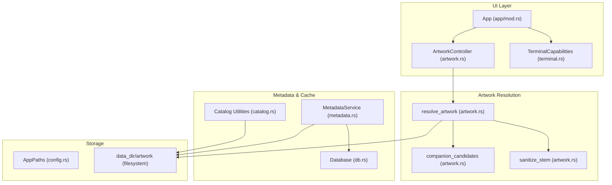
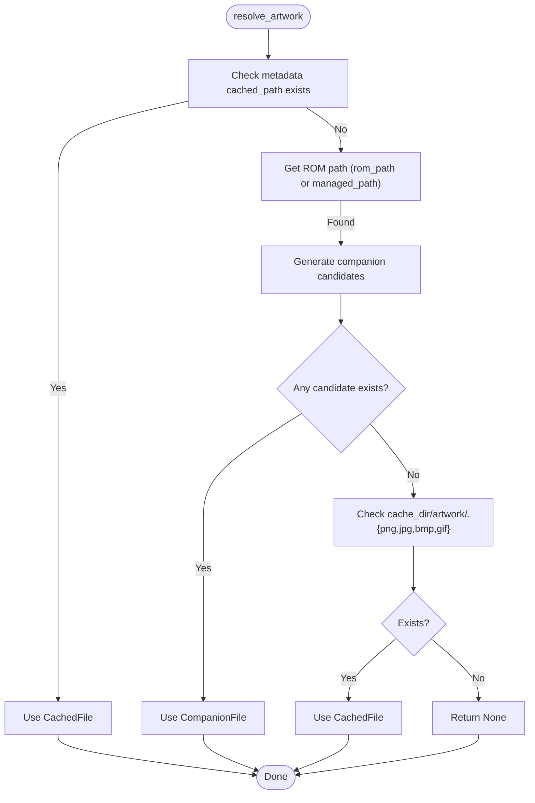
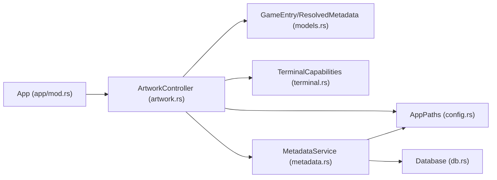

# Artwork Sourcing and Resolution

<cite>
**Referenced Files in This Document**
- [artwork.rs](file://src/artwork.rs)
- [metadata.rs](file://src/metadata.rs)
- [db.rs](file://src/db.rs)
- [models.rs](file://src/models.rs)
- [config.rs](file://src/config.rs)
- [app/mod.rs](file://src/app/mod.rs)
- [terminal.rs](file://src/terminal.rs)
- [catalog.rs](file://src/catalog.rs)
</cite>

## Table of Contents
1. [Introduction](#introduction)
2. [Project Structure](#project-structure)
3. [Core Components](#core-components)
4. [Architecture Overview](#architecture-overview)
5. [Detailed Component Analysis](#detailed-component-analysis)
6. [Dependency Analysis](#dependency-analysis)
7. [Performance Considerations](#performance-considerations)
8. [Troubleshooting Guide](#troubleshooting-guide)
9. [Conclusion](#conclusion)

## Introduction
This document explains the artwork sourcing and resolution system used to display game artwork in the terminal UI. It covers the multi-source resolution algorithm that prioritizes cached artwork, companion files, and generated cache files. The system supports PNG, JPEG, GIF, and BMP images, sanitizes cache filenames, and provides robust fallbacks when artwork is missing. Concrete scenarios illustrate how artwork is resolved for local ROMs and browse previews, along with error handling and performance optimization strategies for large collections.

## Project Structure
Artwork functionality spans several modules:
- Artwork controller and resolver: determines which artwork to display and loads it into the terminal UI
- Metadata service: fetches and caches artwork URLs, generates cache files, and records artwork metadata
- Database: persists resolved metadata and artwork cache references
- Terminal integration: detects terminal capabilities and renders artwork or text fallbacks
- Catalog utilities: cache artwork for browse/search previews



**Diagram sources**
- [app/mod.rs:331-347](file://src/app/mod.rs#L331-L347)
- [artwork.rs:215-246](file://src/artwork.rs#L215-L246)
- [artwork.rs:248-263](file://src/artwork.rs#L248-L263)
- [artwork.rs:265-270](file://src/artwork.rs#L265-L270)
- [metadata.rs:323-369](file://src/metadata.rs#L323-L369)
- [db.rs:506-541](file://src/db.rs#L506-L541)
- [catalog.rs:852-871](file://src/catalog.rs#L852-L871)
- [config.rs:10-17](file://src/config.rs#L10-L17)

**Section sources**
- [app/mod.rs:331-347](file://src/app/mod.rs#L331-L347)
- [artwork.rs:215-246](file://src/artwork.rs#L215-L246)
- [metadata.rs:323-369](file://src/metadata.rs#L323-L369)
- [db.rs:506-541](file://src/db.rs#L506-L541)
- [config.rs:10-17](file://src/config.rs#L10-L17)

## Core Components
- ArtworkController: orchestrates artwork state, loads images, and renders either artwork or text fallbacks depending on terminal capabilities and availability.
- resolve_artwork: the core resolution algorithm that checks cached artwork, companion files, and generated cache files in that order.
- companion_candidates: generates candidate paths for companion artwork files using common naming conventions.
- sanitize_stem: transforms titles and IDs into safe filesystem-friendly cache filenames.
- MetadataService.cache_artwork: downloads and stores artwork from remote URLs into the cache directory.
- Database: persists resolved metadata including artwork cache paths and remote URLs.

**Section sources**
- [artwork.rs:35-208](file://src/artwork.rs#L35-L208)
- [artwork.rs:215-246](file://src/artwork.rs#L215-L246)
- [artwork.rs:248-263](file://src/artwork.rs#L248-L263)
- [artwork.rs:265-270](file://src/artwork.rs#L265-L270)
- [metadata.rs:323-369](file://src/metadata.rs#L323-L369)
- [db.rs:506-541](file://src/db.rs#L506-L541)

## Architecture Overview
The artwork resolution pipeline integrates UI, metadata, and storage layers:

```mermaid
sequenceDiagram
participant UI as "App (app/mod.rs)"
participant AC as "ArtworkController (artwork.rs)"
participant RS as "resolve_artwork (artwork.rs)"
participant FS as "Filesystem"
participant MS as "MetadataService (metadata.rs)"
participant DB as "Database (db.rs)"
UI->>AC : sync_to_game(paths, game, metadata)
AC->>RS : resolve_artwork(paths, game, metadata)
alt metadata has cached_path and exists
RS-->>AC : CachedFile path
else no cached_path or not exists
alt ROM directory has companion artwork
RS-->>AC : CompanionFile path
else no companion artwork
alt cache_dir/<sanitized>.png|jpg|jpeg|bmp|gif exists
RS-->>AC : CachedFile path
else no cache file
RS-->>AC : None
end
end
AC->>FS : load_protocol(path) if supported
FS-->>AC : StatefulProtocol or error
AC-->>UI : ArtworkState (Ready/Unsupported/Missing/Failed)
```

**Diagram sources**
- [app/mod.rs:331-347](file://src/app/mod.rs#L331-L347)
- [artwork.rs:65-118](file://src/artwork.rs#L65-L118)
- [artwork.rs:215-246](file://src/artwork.rs#L215-L246)
- [artwork.rs:210-213](file://src/artwork.rs#L210-L213)

## Detailed Component Analysis

### ArtworkController and Resolution Algorithm
ArtworkController manages the current artwork state and delegates resolution to resolve_artwork. The algorithm proceeds in strict order:
1. Cached artwork from metadata: if metadata contains a cached_path that exists, use it.
2. Companion artwork in ROM directory: scan the ROM’s directory for common naming patterns and use the first existing file.
3. Generated cache files: check the cache directory for sanitized stems with supported extensions.

Supported extensions: PNG, JPEG, GIF, BMP.



**Diagram sources**
- [artwork.rs:215-246](file://src/artwork.rs#L215-L246)
- [artwork.rs:248-263](file://src/artwork.rs#L248-L263)
- [artwork.rs:265-270](file://src/artwork.rs#L265-L270)

**Section sources**
- [artwork.rs:35-208](file://src/artwork.rs#L35-L208)
- [artwork.rs:215-246](file://src/artwork.rs#L215-L246)
- [artwork.rs:248-263](file://src/artwork.rs#L248-L263)
- [artwork.rs:265-270](file://src/artwork.rs#L265-L270)

### Companion File Detection Patterns
The system generates candidate paths for companion artwork using the ROM’s file stem and common naming conventions. For each supported extension, it tries:
- game.png
- game-cover.png
- game_cover.png
- cover.png
- boxart.png

These patterns are derived from the ROM’s filename stem and checked in the ROM directory.

**Section sources**
- [artwork.rs:248-263](file://src/artwork.rs#L248-L263)

### Sanitization and Cache Filenames
Cache filenames are sanitized to ensure filesystem safety:
- Non-alphanumeric characters are replaced with underscores.
- The sanitizer is applied to both the game ID (for generated cache files) and titles (for preview artwork).

This prevents invalid characters and ensures predictable cache paths.

**Section sources**
- [artwork.rs:265-270](file://src/artwork.rs#L265-L270)
- [metadata.rs:468-473](file://src/metadata.rs#L468-L473)
- [catalog.rs:873-878](file://src/catalog.rs#L873-L878)

### Supported Image Formats
Artwork is loaded from files with the following extensions:
- PNG
- JPEG
- GIF
- BMP

The loader decodes images using a standard image library and resizes them for terminal rendering.

**Section sources**
- [artwork.rs:239](file://src/artwork.rs#L239)
- [artwork.rs:210-213](file://src/artwork.rs#L210-L213)

### Metadata-Driven Artwork Caching
When metadata providers resolve artwork URLs, the system caches them locally:
- Downloads the remote artwork to the cache directory under a sanitized filename.
- Stores the cached path in resolved metadata for fast reuse.
- Uses the cached path during subsequent artwork resolution.

**Section sources**
- [metadata.rs:323-369](file://src/metadata.rs#L323-L369)
- [db.rs:506-541](file://src/db.rs#L506-L541)

### Terminal Rendering and Fallbacks
ArtworkController renders either:
- The artwork image if supported by the terminal and the file is valid
- Text fallback lines if artwork is missing or unsupported
- An error message if decoding fails

TerminalCapabilities detect whether the terminal supports image protocols (e.g., iTerm2/Kitty) and adjust behavior accordingly.

**Section sources**
- [artwork.rs:146-178](file://src/artwork.rs#L146-L178)
- [terminal.rs:70-133](file://src/terminal.rs#L70-L133)
- [app/mod.rs:331-347](file://src/app/mod.rs#L331-L347)

### Concrete Resolution Scenarios

- Scenario A: Cached artwork from metadata
  - If metadata.artwork.cached_path exists, use it as CachedFile.
  - Example path: data_dir/artwork/<sanitized>.png

- Scenario B: Companion artwork in ROM directory
  - For a ROM at /path/to/game.gba, check:
    - /path/to/game.png
    - /path/to/game-cover.png
    - /path/to/game_cover.png
    - /path/to/cover.png
    - /path/to/boxart.png
  - Use the first existing file as CompanionFile.

- Scenario C: Generated cache file fallback
  - If no metadata cached path and no companion file, check:
    - data_dir/artwork/<sanitized>.png
    - data_dir/artwork/<sanitized>.jpg
    - data_dir/artwork/<sanitized>.jpeg
    - data_dir/artwork/<sanitized>.bmp
    - data_dir/artwork/<sanitized>.gif
  - Use the first existing file as CachedFile.

- Scenario D: Missing artwork
  - If none of the above exist, the controller reports Missing and renders text fallback.

- Scenario E: Terminal unsupported
  - If the terminal does not support images, the controller reports Unsupported and renders text fallback.

**Section sources**
- [artwork.rs:215-246](file://src/artwork.rs#L215-L246)
- [artwork.rs:248-263](file://src/artwork.rs#L248-L263)
- [artwork.rs:146-178](file://src/artwork.rs#L146-L178)

### Error Handling
- Decoding errors: If the image cannot be decoded, the controller transitions to Failed with an error message.
- Missing artwork: The controller transitions to Missing and displays text fallback.
- Terminal unsupported: The controller transitions to Unsupported and displays text fallback.

**Section sources**
- [artwork.rs:146-178](file://src/artwork.rs#L146-L178)
- [artwork.rs:210-213](file://src/artwork.rs#L210-L213)

## Dependency Analysis
Artwork resolution depends on:
- AppPaths for locating the cache directory
- GameEntry ROM paths for companion file discovery
- ResolvedMetadata for cached artwork paths
- TerminalCapabilities for rendering decisions



**Diagram sources**
- [app/mod.rs:331-347](file://src/app/mod.rs#L331-L347)
- [artwork.rs:35-208](file://src/artwork.rs#L35-L208)
- [models.rs:256-351](file://src/models.rs#L256-L351)
- [config.rs:10-17](file://src/config.rs#L10-L17)
- [terminal.rs:70-133](file://src/terminal.rs#L70-L133)
- [metadata.rs:323-369](file://src/metadata.rs#L323-L369)
- [db.rs:506-541](file://src/db.rs#L506-L541)

**Section sources**
- [app/mod.rs:331-347](file://src/app/mod.rs#L331-L347)
- [artwork.rs:35-208](file://src/artwork.rs#L35-L208)
- [models.rs:256-351](file://src/models.rs#L256-L351)
- [config.rs:10-17](file://src/config.rs#L10-L17)
- [terminal.rs:70-133](file://src/terminal.rs#L70-L133)
- [metadata.rs:323-369](file://src/metadata.rs#L323-L369)
- [db.rs:506-541](file://src/db.rs#L506-L541)

## Performance Considerations
- Single-pass metadata join: The database loads games and metadata together to minimize N+1 queries and speed up artwork resolution across large libraries.
- Early exits: resolve_artwork short-circuits upon finding the first valid candidate, reducing IO.
- Minimal filesystem scanning: companion_candidates enumerates a fixed set of patterns per ROM, avoiding expensive recursive scans.
- Cache-first strategy: Using cached artwork avoids network and IO overhead when available.
- Terminal capability detection: Avoids unnecessary image protocol initialization when unsupported.

**Section sources**
- [db.rs:327-421](file://src/db.rs#L327-L421)
- [artwork.rs:215-246](file://src/artwork.rs#L215-L246)
- [terminal.rs:70-133](file://src/terminal.rs#L70-L133)

## Troubleshooting Guide
- No artwork appears:
  - Verify the ROM directory contains companion artwork files with supported extensions.
  - Confirm metadata cached_path exists and is readable.
  - Check that the cache directory exists and is writable.
- Artwork appears distorted or too large:
  - Ensure the image is a supported format (PNG, JPEG, GIF, BMP).
  - The system automatically resizes images for terminal rendering.
- Terminal shows text fallback:
  - The terminal may not support inline images; switch to a compatible terminal (e.g., iTerm2 or Kitty) or rely on text fallback.
- Frequent network fetches:
  - Ensure metadata caching is enabled and functioning; resolved metadata should persist cached artwork paths.

**Section sources**
- [artwork.rs:146-178](file://src/artwork.rs#L146-L178)
- [metadata.rs:323-369](file://src/metadata.rs#L323-L369)
- [db.rs:506-541](file://src/db.rs#L506-L541)
- [terminal.rs:70-133](file://src/terminal.rs#L70-L133)

## Conclusion
The artwork system provides a robust, layered resolution strategy that prioritizes local cache, companion files, and generated cache files. It sanitizes filenames, supports common naming conventions, and gracefully falls back to text when necessary. By leveraging metadata caching and efficient database queries, it scales to large collections while maintaining responsive UI rendering.