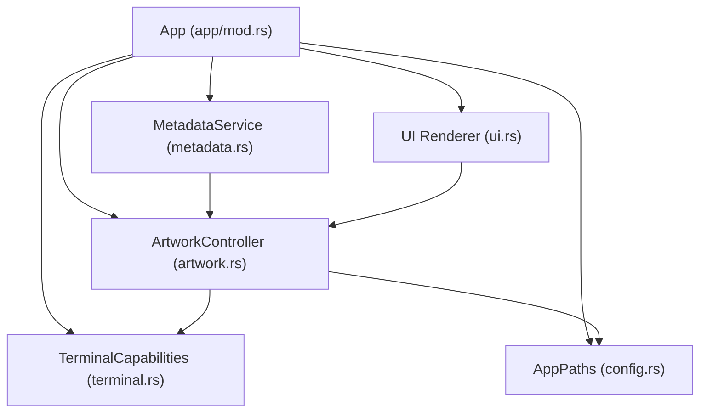
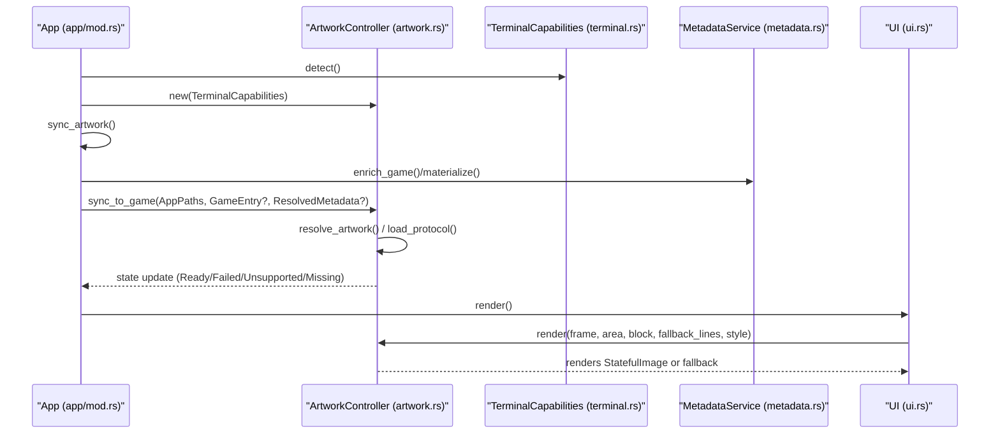
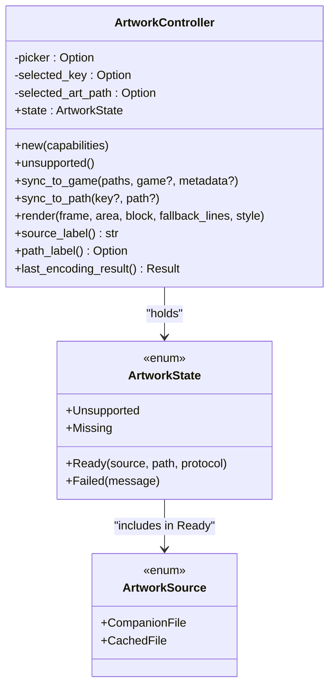
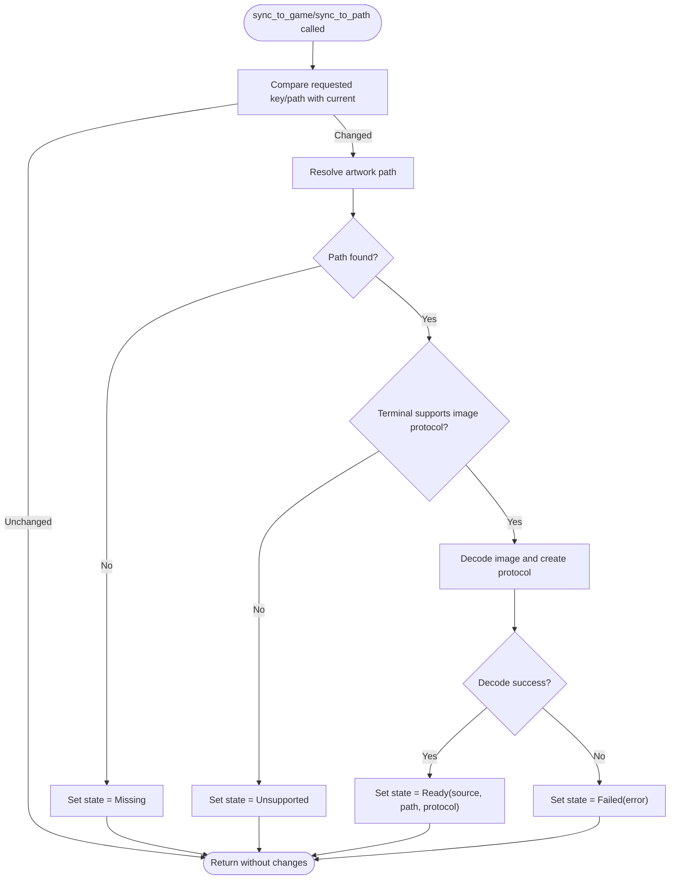
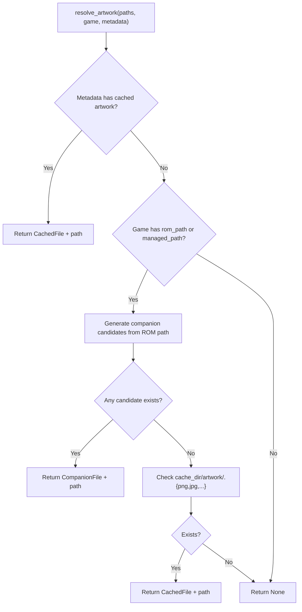
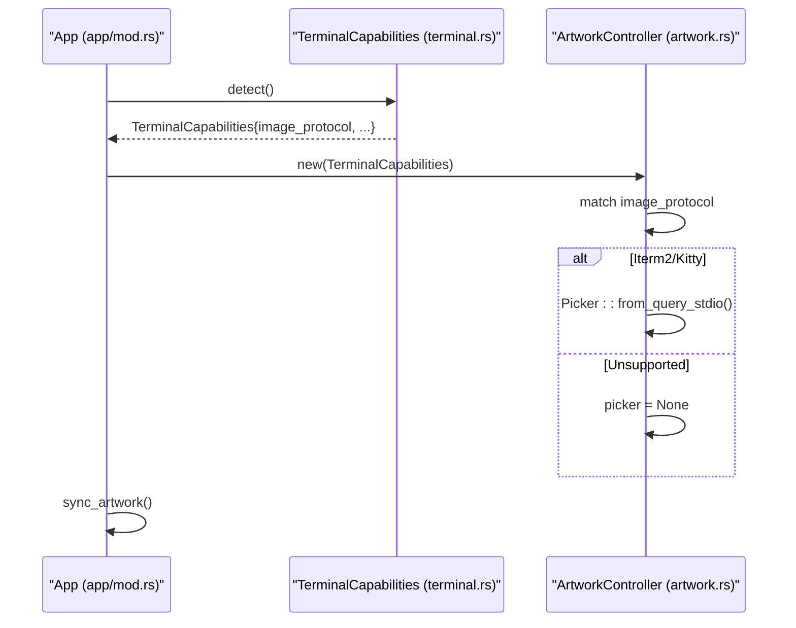
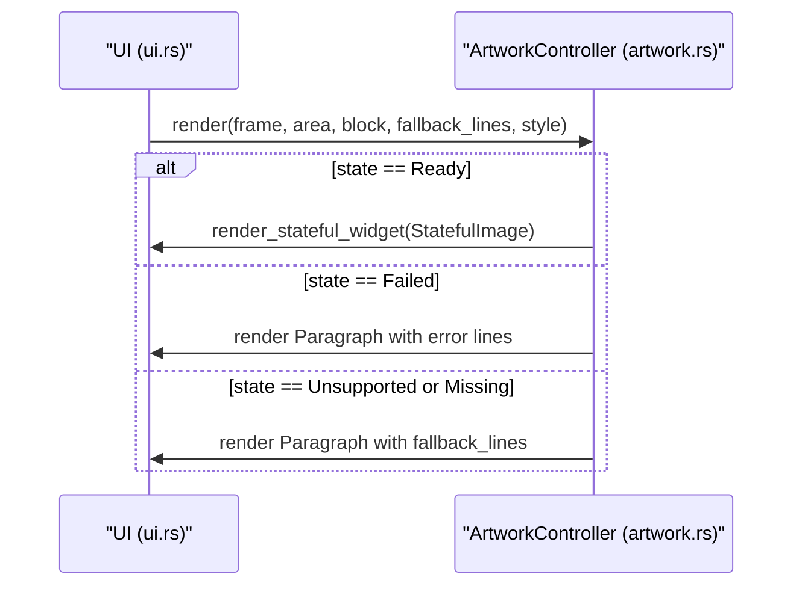
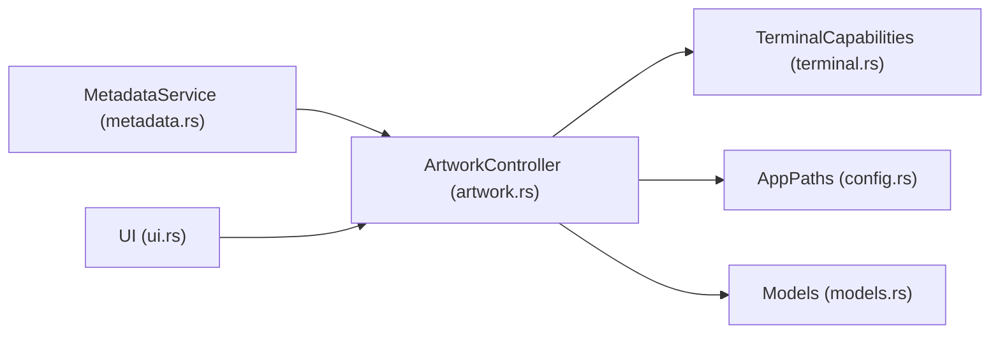

# Artwork State Management

<cite>
**Referenced Files in This Document**
- [artwork.rs](file://src/artwork.rs)
- [terminal.rs](file://src/terminal.rs)
- [models.rs](file://src/models.rs)
- [metadata.rs](file://src/metadata.rs)
- [config.rs](file://src/config.rs)
- [ui.rs](file://src/ui.rs)
- [app/mod.rs](file://src/app/mod.rs)
- [lib.rs](file://src/lib.rs)
- [main.rs](file://src/main.rs)
</cite>

## Table of Contents
1. [Introduction](#introduction)
2. [Project Structure](#project-structure)
3. [Core Components](#core-components)
4. [Architecture Overview](#architecture-overview)
5. [Detailed Component Analysis](#detailed-component-analysis)
6. [Dependency Analysis](#dependency-analysis)
7. [Performance Considerations](#performance-considerations)
8. [Troubleshooting Guide](#troubleshooting-guide)
9. [Conclusion](#conclusion)

## Introduction
This document explains the artwork state management system used to render game box art in the terminal UI. It covers the ArtworkState enum variants and their behaviors, the state transition logic during artwork loading, error conditions and recovery mechanisms, the ArtworkController lifecycle (initialization with terminal capabilities, synchronization with game metadata, and state updates), examples of state monitoring and debugging, and guidance for implementing custom artwork state handlers. It also addresses state persistence, memory management for loaded artwork, and performance optimization for frequent state changes.

## Project Structure
The artwork system is implemented as a cohesive unit with clear boundaries:
- ArtworkController encapsulates state and rendering logic for artwork.
- Terminal capability detection determines whether image protocols are supported.
- Metadata service resolves artwork paths and caches remote images.
- UI integrates the controller into the dashboard layout.
- App orchestrates initialization, synchronization, and rendering.

**Diagram sources**
- [app/mod.rs:118-177](file://src/app/mod.rs#L118-L177)
- [artwork.rs:35-63](file://src/artwork.rs#L35-L63)
- [terminal.rs:87-133](file://src/terminal.rs#L87-L133)
- [config.rs:11-17](file://src/config.rs#L11-L17)
- [metadata.rs:237-369](file://src/metadata.rs#L237-L369)
- [ui.rs:294-337](file://src/ui.rs#L294-L337)

**Section sources**
- [artwork.rs:1-323](file://src/artwork.rs#L1-L323)
- [terminal.rs:1-161](file://src/terminal.rs#L1-L161)
- [models.rs:331-351](file://src/models.rs#L331-L351)
- [metadata.rs:237-369](file://src/metadata.rs#L237-L369)
- [config.rs:1-114](file://src/config.rs#L1-L114)
- [ui.rs:294-337](file://src/ui.rs#L294-L337)
- [app/mod.rs:118-177](file://src/app/mod.rs#L118-L177)

## Core Components
- ArtworkState: Enum representing the current state of artwork rendering.
- ArtworkController: Manages artwork selection, resolution, encoding, and rendering.
- TerminalCapabilities: Detects terminal image protocol support.
- AppPaths: Provides filesystem locations for caching artwork.
- ResolvedMetadata: Supplies cached artwork paths derived from metadata.
- UI integration: Renders artwork panels and fallback text.

Key behaviors:
- Unsupported: Rendering falls back to text when terminal does not support images.
- Missing: No artwork is available for the current selection.
- Ready: Artwork is loaded and ready for rendering via the terminal’s image protocol.
- Failed: Artwork loading encountered an error; the controller surfaces a human-readable message.

**Section sources**
- [artwork.rs:24-33](file://src/artwork.rs#L24-L33)
- [artwork.rs:35-208](file://src/artwork.rs#L35-L208)
- [terminal.rs:69-84](file://src/terminal.rs#L69-L84)
- [config.rs:11-17](file://src/config.rs#L11-L17)
- [models.rs:331-351](file://src/models.rs#L331-L351)

## Architecture Overview
Artwork state management is orchestrated by the application and rendered by the UI. The flow below maps the actual code paths.

**Diagram sources**
- [app/mod.rs:172-177](file://src/app/mod.rs#L172-L177)
- [app/mod.rs:331-347](file://src/app/mod.rs#L331-L347)
- [artwork.rs:52-63](file://src/artwork.rs#L52-L63)
- [artwork.rs:65-118](file://src/artwork.rs#L65-L118)
- [artwork.rs:146-178](file://src/artwork.rs#L146-L178)
- [terminal.rs:92-133](file://src/terminal.rs#L92-L133)
- [metadata.rs:279-347](file://src/metadata.rs#L279-L347)
- [ui.rs:294-337](file://src/ui.rs#L294-L337)

## Detailed Component Analysis

### ArtworkState Enum and Behaviors
- Unsupported: Terminal lacks image protocol support; rendering falls back to text.
- Missing: No artwork path could be resolved for the current selection.
- Ready: Artwork is successfully loaded and encoded for the terminal’s image protocol; includes source type and path.
- Failed: Artwork loading failed; error message is stored and displayed.

**Diagram sources**
- [artwork.rs:24-33](file://src/artwork.rs#L24-L33)
- [artwork.rs:18-22](file://src/artwork.rs#L18-L22)
- [artwork.rs:35-208](file://src/artwork.rs#L35-L208)

**Section sources**
- [artwork.rs:24-33](file://src/artwork.rs#L24-L33)
- [artwork.rs:18-22](file://src/artwork.rs#L18-L22)
- [artwork.rs:35-208](file://src/artwork.rs#L35-L208)

### State Transition Logic During Loading
Transitions occur when synchronizing to a game or a specific path. The controller compares the requested selection with the current selection and recomputes state accordingly.

**Diagram sources**
- [artwork.rs:65-118](file://src/artwork.rs#L65-L118)
- [artwork.rs:120-144](file://src/artwork.rs#L120-L144)
- [artwork.rs:210-213](file://src/artwork.rs#L210-L213)

**Section sources**
- [artwork.rs:65-118](file://src/artwork.rs#L65-L118)
- [artwork.rs:120-144](file://src/artwork.rs#L120-L144)
- [artwork.rs:210-213](file://src/artwork.rs#L210-L213)

### Resolution and Caching of Artwork Paths
Artwork resolution follows a prioritized order:
- Cached artwork from metadata.
- Companion artwork located alongside the ROM file.
- Cached artwork in the application’s data directory.

**Diagram sources**
- [artwork.rs:215-246](file://src/artwork.rs#L215-L246)
- [artwork.rs:248-263](file://src/artwork.rs#L248-L263)
- [artwork.rs:265-270](file://src/artwork.rs#L265-L270)
- [metadata.rs:323-347](file://src/metadata.rs#L323-L347)
- [config.rs:11-17](file://src/config.rs#L11-L17)

**Section sources**
- [artwork.rs:215-246](file://src/artwork.rs#L215-L246)
- [artwork.rs:248-263](file://src/artwork.rs#L248-L263)
- [artwork.rs:265-270](file://src/artwork.rs#L265-L270)
- [metadata.rs:323-347](file://src/metadata.rs#L323-L347)
- [config.rs:11-17](file://src/config.rs#L11-L17)

### Terminal Capabilities and Initialization
ArtworkController creation depends on terminal capabilities:
- If the terminal supports an image protocol, a Picker is initialized to encode images.
- If unsupported, the controller remains in a fallback mode.

**Diagram sources**
- [app/mod.rs:172-177](file://src/app/mod.rs#L172-L177)
- [terminal.rs:92-133](file://src/terminal.rs#L92-L133)
- [artwork.rs:52-63](file://src/artwork.rs#L52-L63)

**Section sources**
- [app/mod.rs:172-177](file://src/app/mod.rs#L172-L177)
- [terminal.rs:92-133](file://src/terminal.rs#L92-L133)
- [artwork.rs:52-63](file://src/artwork.rs#L52-L63)

### Rendering and Fallback Behavior
Rendering logic:
- Ready: Renders the image via the terminal’s image protocol.
- Failed: Displays an error message with styled lines.
- Unsupported/Missing: Renders fallback text lines.

**Diagram sources**
- [ui.rs:294-337](file://src/ui.rs#L294-L337)
- [artwork.rs:146-178](file://src/artwork.rs#L146-L178)

**Section sources**
- [ui.rs:294-337](file://src/ui.rs#L294-L337)
- [artwork.rs:146-178](file://src/artwork.rs#L146-L178)

### State Monitoring and Debugging
- Use source_label to display the current source category in the UI.
- Use path_label to show the resolved path for Ready states.
- Inspect state transitions by tracing sync_to_game/sync_to_path calls and their outcomes.

Practical checks:
- Verify that the terminal supports an image protocol; otherwise, state remains Unsupported or Missing.
- Confirm that artwork paths exist on disk for the resolved candidates.
- Review error messages when state becomes Failed.

**Section sources**
- [artwork.rs:184-207](file://src/artwork.rs#L184-L207)
- [artwork.rs:65-118](file://src/artwork.rs#L65-L118)
- [artwork.rs:120-144](file://src/artwork.rs#L120-L144)

### Implementing Custom Artwork State Handlers
To extend behavior:
- Add new variants to ArtworkState if needed (e.g., Pending).
- Extend ArtworkController with new sync methods and update render to handle new states.
- Integrate additional resolution strategies in resolve_artwork or pre-process artwork via metadata enrichment.

Guidelines:
- Keep state transitions deterministic and idempotent.
- Ensure render handles all variants gracefully.
- Preserve backward compatibility by adding new variants rather than changing existing ones.

**Section sources**
- [artwork.rs:24-33](file://src/artwork.rs#L24-L33)
- [artwork.rs:35-208](file://src/artwork.rs#L35-L208)

## Dependency Analysis
ArtworkController depends on:
- TerminalCapabilities to decide image protocol support.
- AppPaths for cache directory location.
- Metadata service for cached artwork paths.
- Ratatui-image for encoding and rendering.

**Diagram sources**
- [artwork.rs:14-16](file://src/artwork.rs#L14-L16)
- [terminal.rs:87-90](file://src/terminal.rs#L87-L90)
- [config.rs:11-17](file://src/config.rs#L11-L17)
- [models.rs:331-351](file://src/models.rs#L331-L351)
- [metadata.rs:237-369](file://src/metadata.rs#L237-L369)
- [ui.rs:294-337](file://src/ui.rs#L294-L337)

**Section sources**
- [artwork.rs:14-16](file://src/artwork.rs#L14-L16)
- [terminal.rs:87-90](file://src/terminal.rs#L87-L90)
- [config.rs:11-17](file://src/config.rs#L11-L17)
- [models.rs:331-351](file://src/models.rs#L331-L351)
- [metadata.rs:237-369](file://src/metadata.rs#L237-L369)
- [ui.rs:294-337](file://src/ui.rs#L294-L337)

## Performance Considerations
- Minimize redundant loads: The controller avoids re-loading when the selection and path are unchanged.
- Efficient resolution: Prefer cached artwork from metadata to avoid disk scans.
- Lazy encoding: Encoding occurs only when an image is present and the terminal supports it.
- UI refresh cadence: The terminal redraw loop runs at a fixed tick rate; keep artwork updates synchronized to avoid excessive re-renders.

Recommendations:
- Cache artwork aggressively using the metadata service to reduce disk I/O.
- Avoid frequent resync calls; batch UI updates when possible.
- Use compact fallbacks on small terminals to reduce rendering overhead.

[No sources needed since this section provides general guidance]

## Troubleshooting Guide
Common issues and resolutions:
- Artwork remains Missing:
  - Verify that either metadata cached artwork exists or companion artwork is colocated with the ROM.
  - Confirm that the cache directory exists and is writable.
- Artwork shows Unsupported:
  - The terminal does not support the image protocol; switch to a compatible terminal or expect text fallback.
- Artwork shows Failed:
  - Inspect the error message surfaced by the controller.
  - Validate that the resolved path points to a valid image file.
- Rendering anomalies:
  - Ensure the Picker is initialized (only when image protocol is supported).
  - Confirm that the Ratatui image widget receives a valid protocol.

Operational checks:
- Use source_label and path_label to confirm the current source and path.
- Trigger sync_artwork after changing selections or metadata to refresh state.

**Section sources**
- [artwork.rs:184-207](file://src/artwork.rs#L184-L207)
- [artwork.rs:146-178](file://src/artwork.rs#L146-L178)
- [app/mod.rs:331-347](file://src/app/mod.rs#L331-L347)
- [terminal.rs:111-126](file://src/terminal.rs#L111-L126)

## Conclusion
The artwork state management system cleanly separates concerns between resolution, encoding, and rendering. ArtworkController encapsulates state transitions and UI integration, while TerminalCapabilities and MetadataService provide the runtime context and data. The design supports graceful degradation to text fallback, robust error reporting, and efficient caching. By following the patterns documented here, developers can extend the system with additional sources, handlers, and optimizations tailored to their environments.