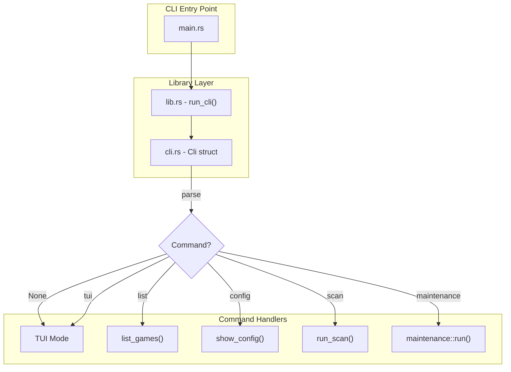

# CLI Reference

<cite>
**Referenced Files in This Document**
- [src/cli.rs](file://src/cli.rs)
- [src/lib.rs](file://src/lib.rs)
- [src/main.rs](file://src/main.rs)
- [src/maintenance.rs](file://src/maintenance.rs)
- [src/config.rs](file://src/config.rs)
- [src/db.rs](file://src/db.rs)
- [src/scanner.rs](file://src/scanner.rs)
- [Cargo.toml](file://Cargo.toml)
</cite>

## Table of Contents
1. [Introduction](#introduction)
2. [CLI Architecture](#cli-architecture)
3. [Command Reference](#command-reference)
4. [Global Options](#global-options)
5. [Subcommands](#subcommands)
6. [Exit Codes](#exit-codes)
7. [Error Handling](#error-handling)
8. [Examples](#examples)

## Introduction
Retro Launcher provides a comprehensive command-line interface built with the `clap` crate. The CLI supports both interactive TUI mode and various command-line operations for library management, configuration, and maintenance.

## CLI Architecture



**Diagram sources**
- [src/main.rs:1-12](file://src/main.rs#L1-L12)
- [src/lib.rs:24-45](file://src/lib.rs#L24-L45)
- [src/cli.rs:9-69](file://src/cli.rs#L9-L69)

## Command Reference

### Command Structure
```
retro-launcher [OPTIONS] [COMMAND]
```

### Command Overview

| Command | Description | Default |
|---------|-------------|---------|
| (none) | Launch interactive TUI | Yes |
| `tui` | Launch interactive TUI explicitly | No |
| `list` | List games in library | No |
| `config` | Show configuration | No |
| `scan` | Scan ROM directories | No |
| `maintenance` | Maintenance operations | No |

**Section sources**
- [src/cli.rs:19-43](file://src/cli.rs#L19-L43)

## Global Options

### `--help` / `-h`
Display help information for the CLI or any subcommand.

```bash
retro-launcher --help
retro-launcher list --help
retro-launcher maintenance --help
```

### `--version` / `-V`
Display version information.

```bash
retro-launcher --version
```

Output format: `retro-launcher 0.1.0`

**Section sources**
- [src/cli.rs:9-17](file://src/cli.rs#L9-L17)
- [Cargo.toml:1-3](file://Cargo.toml#L1-L3)

## Subcommands

### `tui` - Interactive TUI Mode

Launch the terminal user interface. This is the default behavior when no subcommand is provided.

```bash
retro-launcher
retro-launcher tui
```

**Behavior:**
- Initializes terminal UI with Ratatui
- Loads configuration and database
- Starts background workers
- Enters event loop for user interaction

**Section sources**
- [src/cli.rs:22-23](file://src/cli.rs#L22-L23)
- [src/lib.rs:35](file://src/lib.rs#L35)

### `list` - List Games

Display games from the library in various formats.

```bash
retro-launcher list [OPTIONS]
```

#### Options

| Option | Short | Description | Default |
|--------|-------|-------------|---------|
| `--platform` | `-p` | Filter by platform | (none) |
| `--format` | `-f` | Output format (table, json) | `table` |

#### Platform Filters
Accepted platform values (case-insensitive):
- `GB` / `GameBoy` - Game Boy
- `GBC` / `GameBoyColor` - Game Boy Color
- `GBA` / `GameBoyAdvance` - Game Boy Advance
- `NES` - Nintendo Entertainment System
- `SNES` - Super Nintendo
- `GEN` / `Genesis` / `SegaGenesis` - SEGA Genesis
- `N64` / `Nintendo64` - Nintendo 64
- `PS1` / `PlayStation` - PlayStation 1
- `NDS` / `NintendoDs` - Nintendo DS

#### Examples

```bash
# List all games in table format
retro-launcher list

# List Game Boy Advance games
retro-launcher list --platform GBA
retro-launcher list -p GBA

# List NES games as JSON
retro-launcher list --platform NES --format json
retro-launcher list -p nes -f json

# List all games as JSON
retro-launcher list --format json
```

#### Output Formats

**Table Format (default):**
```
ID       Title                               Platform   Status
------------------------------------------------------------------------
game:c   Battle City                         NES        READY
game:a   Disney's The Jungle Book            NES        READY
game:3   Super Mario Bros.                   NES        READY
```

**JSON Format:**
```json
[
  {
    "id": "game:abc123",
    "title": "Super Mario Bros.",
    "platform": "Nes",
    "install_state": "Ready",
    ...
  }
]
```

**Section sources**
- [src/cli.rs:32-34](file://src/cli.rs#L32-L34)
- [src/cli.rs:61-69](file://src/cli.rs#L61-L69)
- [src/cli.rs:71-112](file://src/cli.rs#L71-L112)

### `config` - Show Configuration

Display current configuration paths and settings.

```bash
retro-launcher config
```

#### Output
```
Configuration Paths:
  Config directory: /Users/<user>/Library/Application Support/dev.OpenAI.retro-launcher
  Data directory:   /Users/<user>/Library/Application Support/dev.OpenAI.retro-launcher
  Database:         /Users/<user>/Library/Application Support/dev.OpenAI.retro-launcher/library.sqlite3
  Downloads:        /Users/<user>/Library/Application Support/dev.OpenAI.retro-launcher/downloads

Settings:
  Scan on startup:  true
  Show hidden:      false
  ROM roots:
    - /Users/<user>/ROMs
    - /Users/<user>/Games/ROMs
    - /Users/<user>/Downloads/ROMs

Preferred emulators:
  Game Boy -> mGBA
  Game Boy Color -> mGBA
  Game Boy Advance -> mGBA
  PlayStation 1 -> Mednafen
```

**Section sources**
- [src/cli.rs:36-38](file://src/cli.rs#L36-L38)
- [src/cli.rs:114-138](file://src/cli.rs#L114-L138)
- [src/config.rs:10-17](file://src/config.rs#L10-L17)

### `scan` - Scan ROM Directories

Manually trigger a scan of configured ROM roots to discover new games.

```bash
retro-launcher scan
```

#### Behavior
- Scans all directories in `rom_roots` configuration
- Respects `show_hidden_files` setting
- Imports discovered ROMs into database
- Outputs scan summary

#### Output Example
```
Scanning ROM directories...
Scan complete. 5 game(s) discovered.
```

**Section sources**
- [src/cli.rs:40-43](file://src/cli.rs#L40-L43)
- [src/cli.rs:140-155](file://src/cli.rs#L140-L155)
- [src/scanner.rs:158-191](file://src/scanner.rs#L158-L191)

### `maintenance` - Maintenance Operations

Perform maintenance tasks on the database and caches.

```bash
retro-launcher maintenance <COMMAND>
```

#### Subcommands

| Subcommand | Description |
|------------|-------------|
| `repair` | Repair database and normalize state |
| `clear-metadata` | Clear metadata and artwork cache |
| `reset-downloads` | Reset launcher-managed downloads |
| `reset-all` | Complete system reset |

#### `maintenance repair`

Repair and migrate database state:
- Normalize origin URLs
- Remove missing payloads for local scans
- Reset broken downloads
- Reset emulator assignments

```bash
retro-launcher maintenance repair
```

Output format:
```
repair complete: removed_missing_payloads=0 normalized_urls=0 removed_legacy_demo_rows=0 reset_broken_downloads=0 reset_emulator_assignments=0
```

#### `maintenance clear-metadata`

Clear metadata cache and artwork:
- Remove all resolved metadata entries
- Clear metadata cache table
- Delete artwork cache files

```bash
retro-launcher maintenance clear-metadata
```

Output:
```
Cleared metadata cache and artwork cache.
```

#### `maintenance reset-downloads`

Remove launcher-managed downloads:
- Delete games with managed paths
- Remove files from downloads directory

```bash
retro-launcher maintenance reset-downloads
```

Output:
```
Cleared launcher-managed downloads and related DB rows.
```

#### `maintenance reset-all`

Complete system reset (use with caution):
- Delete database file
- Clear downloads directory
- Clear artwork cache

```bash
retro-launcher maintenance reset-all
```

Output:
```
Reset launcher database, artwork cache, and managed downloads.
```

**Warning:** This action cannot be undone. All library data will be lost.

**Section sources**
- [src/cli.rs:25-30](file://src/cli.rs#L25-L30)
- [src/cli.rs:45-59](file://src/cli.rs#L45-L59)
- [src/maintenance.rs:8-101](file://src/maintenance.rs#L8-L101)

## Exit Codes

Retro Launcher uses standard exit codes:

| Exit Code | Meaning |
|-----------|---------|
| `0` | Success |
| `1` | General error |

**Section sources**
- [src/main.rs:5-12](file://src/main.rs#L5-L12)

## Error Handling

### CLI Error Format
Errors are printed to stderr with the format:
```
retro-launcher: error: <error message>
```

### Common Errors

**Invalid Command:**
```bash
$ retro-launcher invalid-command
error: unrecognized subcommand 'invalid-command'
```

**Missing Maintenance Action:**
```bash
$ retro-launcher maintenance
error: 'maintenance' requires a subcommand
```

**Database Errors:**
```bash
$ retro-launcher list
retro-launcher: error: database error: <details>
```

**Section sources**
- [src/main.rs:5-12](file://src/main.rs#L5-L12)
- [src/error.rs:1-154](file://src/error.rs#L1-L154)

## Examples

### Daily Usage

```bash
# Start the TUI
retro-launcher

# Quick check of library size
retro-launcher list | wc -l

# Find all GBA games
retro-launcher list --platform GBA

# Export library to JSON for backup
retro-launcher list --format json > library_backup.json
```

### Maintenance Workflow

```bash
# Weekly maintenance
retro-launcher maintenance repair

# Monthly cleanup
retro-launcher maintenance clear-metadata

# When moving ROMs to new location
retro-launcher maintenance reset-downloads
retro-launcher scan

# Complete fresh start (WARNING: destroys all data)
retro-launcher maintenance reset-all
```

### Scripting Examples

```bash
# Check if specific game exists
if retro-launcher list --format json | jq -e '.[] | select(.title | contains("Mario"))' > /dev/null; then
    echo "Mario game found!"
fi

# Count games by platform
retro-launcher list --format json | jq -r '.[].platform' | sort | uniq -c

# Backup game list
date=$(date +%Y%m%d)
retro-launcher list --format json > "library_backup_${date}.json"
```

**Section sources**
- [src/cli.rs:71-112](file://src/cli.rs#L71-L112)

## Implementation Details

### Clap Configuration
The CLI uses clap's derive macro for declarative command definition:

```rust
#[derive(Parser)]
#[command(name = "retro-launcher")]
#[command(about = "A TUI-based retro game launcher and library manager")]
#[command(version = env!("CARGO_PKG_VERSION"))]
pub struct Cli {
    #[command(subcommand)]
    pub command: Option<Commands>,
}
```

### Argument Parsing Flow
1. `main.rs` collects command-line arguments
2. `lib.rs::run_cli()` delegates to clap parser
3. Clap validates and parses into `Cli` struct
4. Match on `command` field to dispatch to appropriate handler
5. Handler executes and returns `anyhow::Result<()>`

**Section sources**
- [src/cli.rs:1-69](file://src/cli.rs#L1-L69)
- [src/lib.rs:24-45](file://src/lib.rs#L24-L45)

## See Also

- [Getting Started](Getting%20Started.md) - User guide for getting started
- [Maintenance and Operations](Maintenance%20and%20Operations/Maintenance%20and%20Operations.md) - Detailed maintenance documentation
- [Development Guide](Development%20Guide.md) - Development and contribution guide
