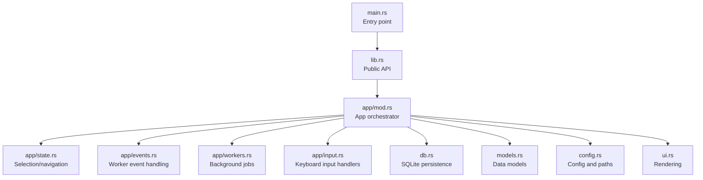
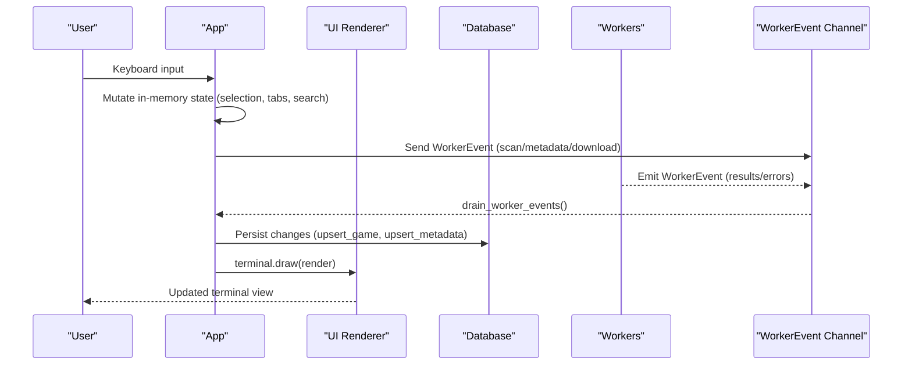
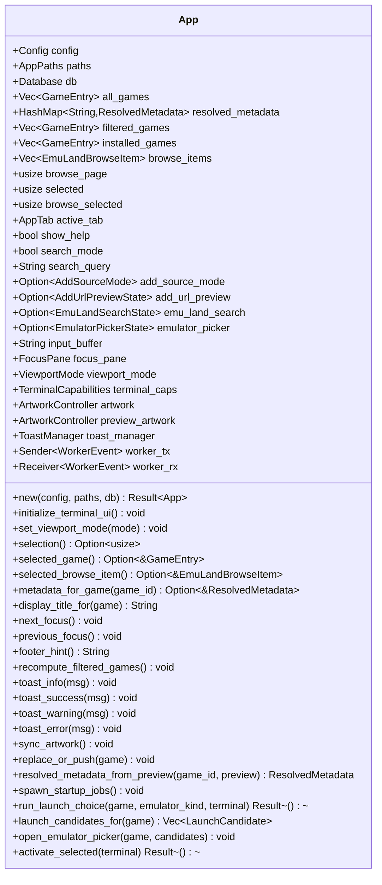
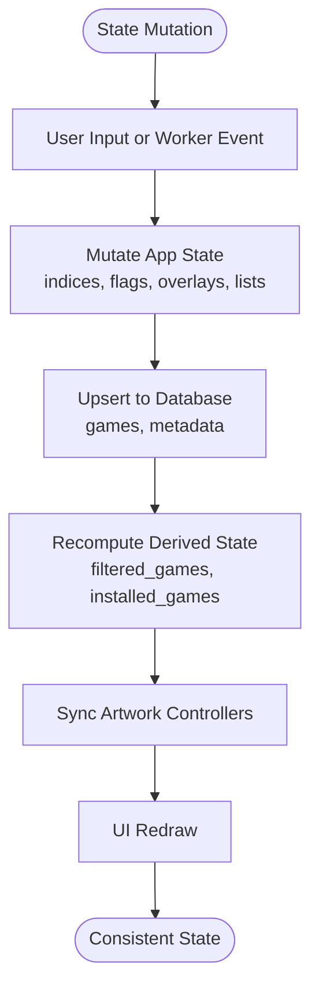
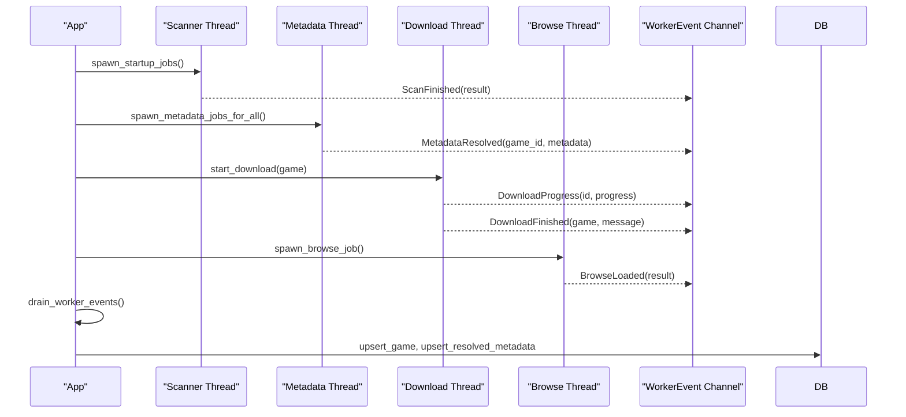
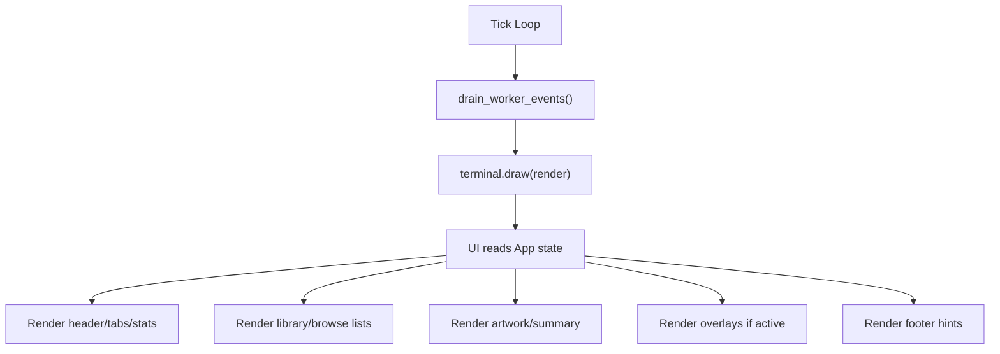
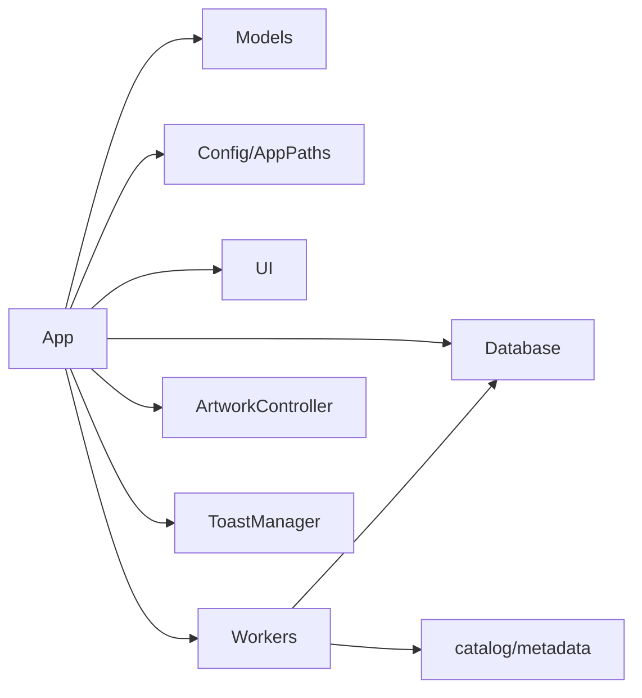

# Application State Management

<cite>
**Referenced Files in This Document**
- [lib.rs](file://src/lib.rs)
- [main.rs](file://src/main.rs)
- [app/mod.rs](file://src/app/mod.rs)
- [app/state.rs](file://src/app/state.rs)
- [app/events.rs](file://src/app/events.rs)
- [app/workers.rs](file://src/app/workers.rs)
- [app/input.rs](file://src/app/input.rs)
- [db.rs](file://src/db.rs)
- [models.rs](file://src/models.rs)
- [config.rs](file://src/config.rs)
- [ui.rs](file://src/ui.rs)
</cite>

## Table of Contents
1. [Introduction](#introduction)
2. [Project Structure](#project-structure)
3. [Core Components](#core-components)
4. [Architecture Overview](#architecture-overview)
5. [Detailed Component Analysis](#detailed-component-analysis)
6. [Dependency Analysis](#dependency-analysis)
7. [Performance Considerations](#performance-considerations)
8. [Troubleshooting Guide](#troubleshooting-guide)
9. [Conclusion](#conclusion)

## Introduction
This document explains Retro Launcher’s centralized state management system. It focuses on the App struct and its orchestration of application state, including game collections, metadata, UI state, and configuration. It documents the state lifecycle from initialization through runtime updates, how state changes trigger UI refreshes and worker notifications, and the separation between persistent state (stored in SQLite) and transient state (in-memory UI state). It also covers state mutation patterns, validation, synchronization, thread-safety considerations, and consistency guarantees.

## Project Structure
The state management is primarily implemented in the app module, with supporting modules for database persistence, models, configuration, and UI rendering. The main entry point delegates to the app runner, which initializes the App and runs the terminal loop.

**Diagram sources**
- [lib.rs:20-38](file://src/lib.rs#L20-L38)
- [main.rs:1-9](file://src/main.rs#L1-L9)
- [app/mod.rs:125-551](file://src/app/mod.rs#L125-L551)
- [app/state.rs:8-83](file://src/app/state.rs#L8-L83)
- [app/events.rs:24-98](file://src/app/events.rs#L24-L98)
- [app/workers.rs:21-163](file://src/app/workers.rs#L21-L163)
- [app/input.rs:14-346](file://src/app/input.rs#L14-L346)
- [db.rs:35-766](file://src/db.rs#L35-L766)
- [models.rs:256-414](file://src/models.rs#L256-L414)
- [config.rs:34-113](file://src/config.rs#L34-L113)
- [ui.rs:23-68](file://src/ui.rs#L23-L68)

**Section sources**
- [lib.rs:20-38](file://src/lib.rs#L20-L38)
- [main.rs:1-9](file://src/main.rs#L1-L9)
- [app/mod.rs:125-551](file://src/app/mod.rs#L125-L551)

## Core Components
- App: Central state container holding configuration, database connection, game collections, metadata, UI state, worker channels, and controllers for artwork and toasts. It orchestrates initialization, startup jobs, UI rendering, input handling, and worker event processing.
- WorkerEvent: Enumerated events from background threads (scanning, metadata enrichment, downloads, browsing) delivered via a channel to the main App.
- Database: Persistent storage for games and resolved metadata, with repair/migration routines and optimized queries.
- Models: Data structures for games, metadata, install states, platforms, and enums used across the app.
- Config/AppPaths: Application configuration and filesystem paths.
- UI: Rendering logic that reads App state to draw the terminal interface.

Key responsibilities:
- Initialization: Load persisted state, spawn startup jobs, initialize terminal UI and artwork controllers.
- Runtime updates: Mutate in-memory state based on user input and worker events; propagate changes to UI and database.
- Persistence: Upsert games and metadata; migrate and repair schema; manage caches.
- Synchronization: Sync artwork and metadata views; compute derived UI lists; update toast manager.

**Section sources**
- [app/mod.rs:94-123](file://src/app/mod.rs#L94-L123)
- [app/mod.rs:125-170](file://src/app/mod.rs#L125-L170)
- [app/events.rs:10-22](file://src/app/events.rs#L10-L22)
- [db.rs:35-766](file://src/db.rs#L35-L766)
- [models.rs:256-414](file://src/models.rs#L256-L414)
- [config.rs:10-32](file://src/config.rs#L10-L32)
- [ui.rs:23-68](file://src/ui.rs#L23-L68)

## Architecture Overview
The App struct coordinates a unidirectional data flow: user input and worker events mutate in-memory state, which triggers UI redraws and database writes. Background workers communicate via a channel to deliver asynchronous results.

**Diagram sources**
- [app/input.rs:14-58](file://src/app/input.rs#L14-L58)
- [app/mod.rs:575-621](file://src/app/mod.rs#L575-L621)
- [app/events.rs:24-98](file://src/app/events.rs#L24-L98)
- [app/workers.rs:21-163](file://src/app/workers.rs#L21-L163)
- [ui.rs:23-68](file://src/ui.rs#L23-L68)
- [db.rs:625-689](file://src/db.rs#L625-L689)

## Detailed Component Analysis

### App Struct and Lifecycle
The App struct encapsulates all application state and behavior:
- Persistent state: loaded from and written to the Database (games, resolved metadata).
- Transient state: UI selections, focus panes, search buffers, overlays, and worker channels.
- Initialization: Repairs and migrates database state, loads initial game and metadata sets, creates artwork controllers, spawns startup jobs, and computes filtered/installed lists.
- Runtime: Processes input, drains worker events, recomputes derived state, and renders UI.

**Diagram sources**
- [app/mod.rs:94-123](file://src/app/mod.rs#L94-L123)
- [app/mod.rs:125-551](file://src/app/mod.rs#L125-L551)

**Section sources**
- [app/mod.rs:125-170](file://src/app/mod.rs#L125-L170)
- [app/mod.rs:260-292](file://src/app/mod.rs#L260-L292)
- [app/mod.rs:331-347](file://src/app/mod.rs#L331-L347)
- [app/mod.rs:386-400](file://src/app/mod.rs#L386-L400)
- [app/mod.rs:402-432](file://src/app/mod.rs#L402-L432)
- [app/mod.rs:467-491](file://src/app/mod.rs#L467-L491)
- [app/mod.rs:493-550](file://src/app/mod.rs#L493-L550)

### State Mutations and Validation
- Selection and navigation: next/previous move selection indices within bounds; browse pagination updates page and triggers new browse job; artwork sync updates based on selection.
- Tab switching: switch_tab updates active_tab and triggers artwork sync; if Browse tab is empty, spawns browse job.
- Search filtering: recompute_filtered_games rebuilds filtered_games and installed_games from all_games using resolved metadata; sorts and clamps indices.
- Metadata resolution: WorkerEvent::MetadataResolved inserts resolved metadata into memory map and triggers artwork sync.
- Downloads: WorkerEvent::DownloadProgress updates install_state and progress; WorkerEvent::DownloadFinished persists imported game, replaces/merges records, recomputes state, and spawns metadata job for the resolved target.
- Validation: Ensures downloaded payloads are not HTML; validates checksums when present; repairs broken rows and resets emulator assignments during migration.

**Diagram sources**
- [app/state.rs:8-83](file://src/app/state.rs#L8-L83)
- [app/events.rs:24-98](file://src/app/events.rs#L24-L98)
- [app/workers.rs:60-162](file://src/app/workers.rs#L60-L162)
- [db.rs:625-689](file://src/db.rs#L625-L689)

**Section sources**
- [app/state.rs:8-83](file://src/app/state.rs#L8-L83)
- [app/events.rs:24-98](file://src/app/events.rs#L24-L98)
- [app/workers.rs:60-162](file://src/app/workers.rs#L60-L162)
- [db.rs:625-689](file://src/db.rs#L625-L689)

### Worker Threads and Event Driven Updates
Workers spawn background tasks for scanning ROM roots, metadata enrichment, downloads, and browsing. They send WorkerEvent messages to the main App via a channel. The App drains the channel each tick, applying results to state and persisting changes.

**Diagram sources**
- [app/mod.rs:386-400](file://src/app/mod.rs#L386-L400)
- [app/workers.rs:21-163](file://src/app/workers.rs#L21-L163)
- [app/events.rs:24-98](file://src/app/events.rs#L24-L98)
- [db.rs:625-689](file://src/db.rs#L625-L689)

**Section sources**
- [app/mod.rs:386-400](file://src/app/mod.rs#L386-L400)
- [app/workers.rs:21-163](file://src/app/workers.rs#L21-L163)
- [app/events.rs:24-98](file://src/app/events.rs#L24-L98)

### UI State and Rendering
UI reads App state to render:
- Header: tabs, stats, system status.
- Library pane: filtered/installed/browse lists with selection highlighting.
- Hero pane: artwork and summary cards.
- Overlays: search, add-source, emulator picker, URL preview.
- Footer: dynamic hints based on focus and active overlays.

The renderer is invoked each tick after draining worker events, ensuring UI reflects the latest state.

**Diagram sources**
- [app/mod.rs:575-621](file://src/app/mod.rs#L575-L621)
- [ui.rs:23-68](file://src/ui.rs#L23-L68)
- [ui.rs:178-274](file://src/ui.rs#L178-L274)
- [ui.rs:276-561](file://src/ui.rs#L276-L561)

**Section sources**
- [ui.rs:23-68](file://src/ui.rs#L23-L68)
- [ui.rs:178-274](file://src/ui.rs#L178-L274)
- [ui.rs:276-561](file://src/ui.rs#L276-L561)

### Persistent vs Transient State
- Persistent state (stored in SQLite):
  - Games: GameEntry rows with serialized fields and metadata associations.
  - Resolved metadata: Canonical titles, match confidence, artwork, tags, genres, timestamps.
  - Schema migrations and repair: Normalizes URLs, removes missing payloads, resets emulator assignments.
- Transient state (in-memory UI state):
  - Selection indices (selected, browse_selected), active tab, search buffers, overlays, focus panes, viewport mode, artwork controller states, toast manager state.

Separation ensures durability and fast UI responsiveness. Database operations are explicit and idempotent (ON CONFLICT upserts).

**Section sources**
- [db.rs:35-766](file://src/db.rs#L35-L766)
- [app/mod.rs:94-123](file://src/app/mod.rs#L94-L123)
- [app/mod.rs:125-170](file://src/app/mod.rs#L125-L170)

### Thread Safety and Consistency Guarantees
- Single-threaded UI loop: The terminal loop runs in one thread, preventing concurrent access to App state from UI code.
- Worker communication: WorkerEvent messages are sent via a channel to the main thread, avoiding shared mutable state across threads.
- Atomic operations: Database upserts use ON CONFLICT semantics to ensure idempotency and consistency.
- Derived state recomputation: After mutations, App recomputes filtered_games and installed_games, clamps indices, and syncs artwork to maintain UI consistency.
- Artwork synchronization: sync_artwork and sync_emu_land_search_artwork ensure artwork controllers reflect the current selection or preview.

Potential risks mitigated:
- Race conditions: No direct shared mutable state between UI and workers; all state mutations are serialized through App.
- Inconsistent UI: Re-render occurs after draining events and recomputing derived state.
- Data loss: Database operations are explicit and persisted before UI updates.

**Section sources**
- [app/mod.rs:575-621](file://src/app/mod.rs#L575-L621)
- [app/events.rs:24-98](file://src/app/events.rs#L24-L98)
- [db.rs:625-689](file://src/db.rs#L625-L689)

## Dependency Analysis
The App depends on Database for persistence, models for data structures, config for paths and preferences, and UI for rendering. Workers depend on Database and catalog/metadata services. Input handlers mutate App state and trigger database writes.

**Diagram sources**
- [app/mod.rs:34-44](file://src/app/mod.rs#L34-L44)
- [app/workers.rs:13-19](file://src/app/workers.rs#L13-L19)
- [db.rs:13-16](file://src/db.rs#L13-L16)
- [models.rs:256-414](file://src/models.rs#L256-L414)
- [config.rs:10-32](file://src/config.rs#L10-L32)
- [ui.rs:12-18](file://src/ui.rs#L12-L18)

**Section sources**
- [app/mod.rs:34-44](file://src/app/mod.rs#L34-L44)
- [app/workers.rs:13-19](file://src/app/workers.rs#L13-L19)
- [db.rs:13-16](file://src/db.rs#L13-L16)
- [models.rs:256-414](file://src/models.rs#L256-L414)
- [config.rs:10-32](file://src/config.rs#L10-L32)
- [ui.rs:12-18](file://src/ui.rs#L12-L18)

## Performance Considerations
- Efficient queries: Database.load_games_and_metadata uses a single JOIN to avoid N+1 queries for metadata.
- Sorting: sort_games orders by install_state buckets and title to optimize perceived ordering.
- Artwork caching: sync_artwork and preview_artwork minimize redundant artwork operations.
- Batch metadata enrichment: spawn_metadata_jobs_for_all dispatches jobs per game ID to parallelize enrichment.
- Minimal UI redraw: UI reads App state and only re-renders when state changes occur.

[No sources needed since this section provides general guidance]

## Troubleshooting Guide
Common issues and diagnostics:
- Scan failures: WorkerEvent::ScanFinished reports errors via toast; check logs and filesystem permissions.
- Metadata resolution failures: WorkerEvent::MetadataResolved with error messages; verify network connectivity and provider availability.
- Download failures: WorkerEvent::DownloadFailed updates install_state to Error and stores error_message; validate URL normalization and checksum expectations.
- HTML payloads: ensure_valid_download_payload rejects HTML content; verify download URLs resolve to ROM data.
- Broken artwork: sync_artwork and preview_artwork sync paths; verify artwork cache directories exist and are writable.
- Migration/repair: Database.repair_and_migrate_state cleans legacy rows, normalizes URLs, and resets emulator assignments; review RepairReport counts.

**Section sources**
- [app/events.rs:32-42](file://src/app/events.rs#L32-L42)
- [app/events.rs:43-51](file://src/app/events.rs#L43-L51)
- [app/events.rs:84-91](file://src/app/events.rs#L84-L91)
- [workers.rs:165-235](file://src/app/workers.rs#L165-L235)
- [db.rs:129-267](file://src/db.rs#L129-L267)

## Conclusion
Retro Launcher’s App struct centralizes state management with a clean separation between persistent and transient state. The event-driven worker model keeps the UI responsive while ensuring data consistency through explicit database upserts and derived state recomputation. The architecture balances simplicity, performance, and reliability, with robust validation and repair mechanisms.