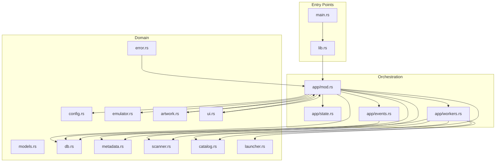
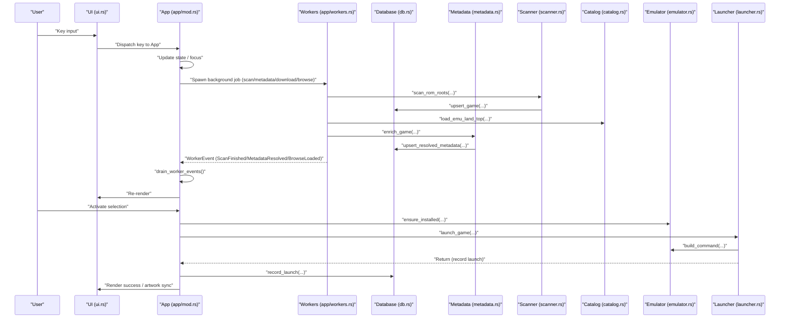
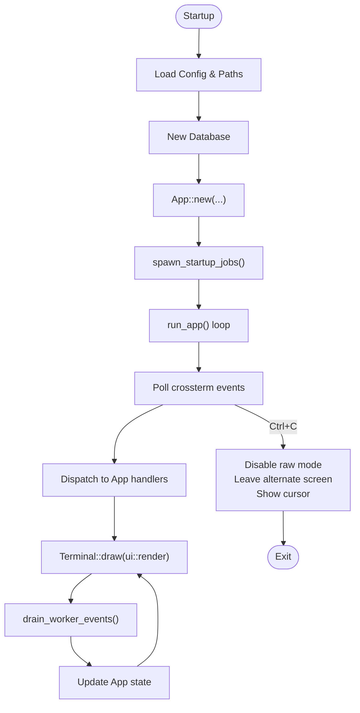
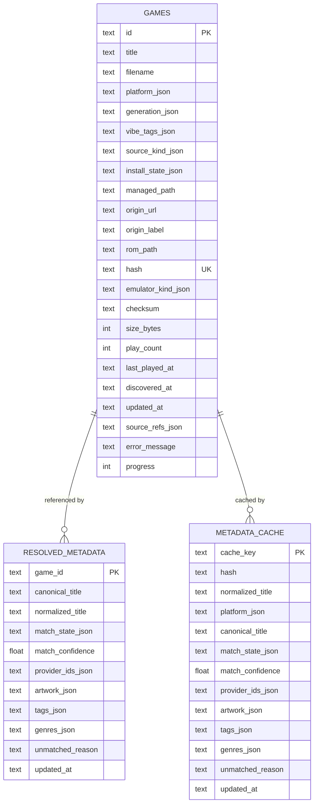
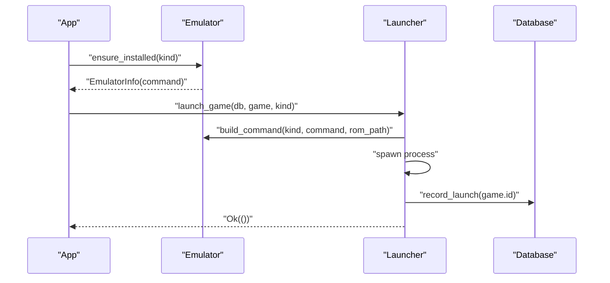
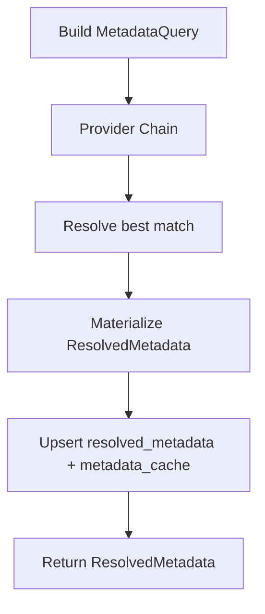
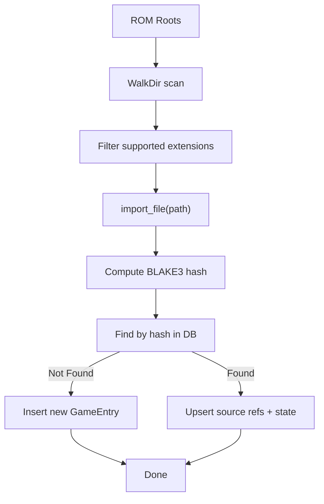
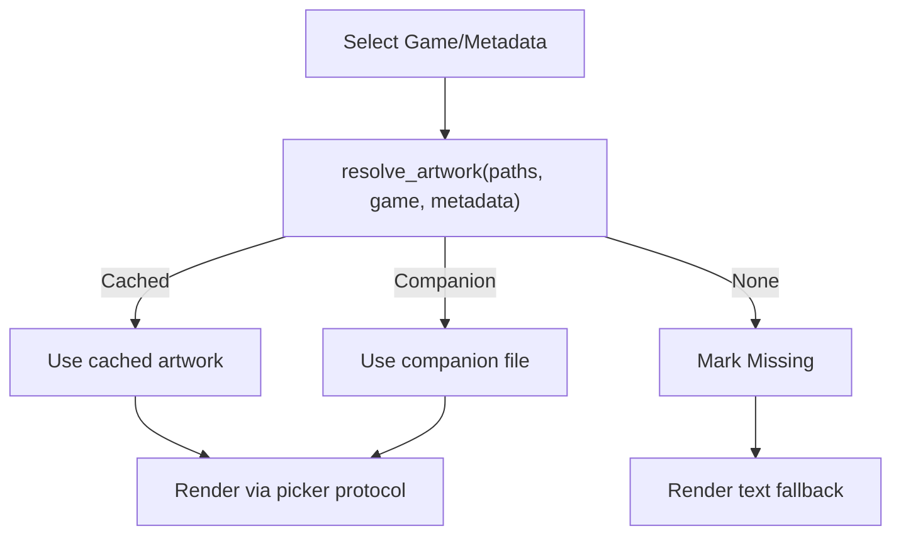
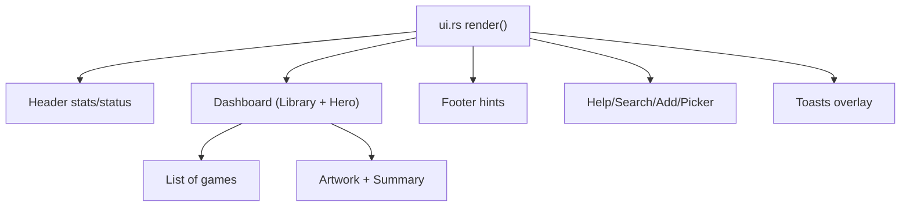
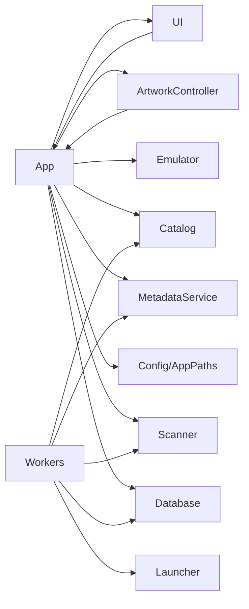

# Core Architecture

<cite>
**Referenced Files in This Document**
- [main.rs](file://src/main.rs)
- [lib.rs](file://src/lib.rs)
- [app/mod.rs](file://src/app/mod.rs)
- [app/events.rs](file://src/app/events.rs)
- [app/state.rs](file://src/app/state.rs)
- [app/workers.rs](file://src/app/workers.rs)
- [config.rs](file://src/config.rs)
- [db.rs](file://src/db.rs)
- [models.rs](file://src/models.rs)
- [emulator.rs](file://src/emulator.rs)
- [metadata.rs](file://src/metadata.rs)
- [scanner.rs](file://src/scanner.rs)
- [artwork.rs](file://src/artwork.rs)
- [catalog.rs](file://src/catalog.rs)
- [launcher.rs](file://src/launcher.rs)
- [ui.rs](file://src/ui.rs)
- [error.rs](file://src/error.rs)
</cite>

## Table of Contents
1. [Introduction](#introduction)
2. [Project Structure](#project-structure)
3. [Core Components](#core-components)
4. [Architecture Overview](#architecture-overview)
5. [Detailed Component Analysis](#detailed-component-analysis)
6. [Dependency Analysis](#dependency-analysis)
7. [Performance Considerations](#performance-considerations)
8. [Troubleshooting Guide](#troubleshooting-guide)
9. [Conclusion](#conclusion)

## Introduction
This document describes the core system design of Retro Launcher, focusing on its event-driven architecture, centralized state management through the App orchestrator, and a worker-thread system for background operations. It explains how UI, database, workers, emulators, and artwork systems collaborate, and documents cross-cutting concerns such as error handling, configuration management, and thread safety. The document also outlines the application lifecycle, startup sequence, and shutdown procedures.

## Project Structure
Retro Launcher is organized around a modular Rust architecture:
- Entry points: a CLI entry in main.rs and a library facade in lib.rs
- Orchestrator: App module manages state, UI, and worker coordination
- Persistence: Database module encapsulates SQLite schema and migrations
- Emulation: Emulator detection and launch orchestration
- Metadata: Provider-based enrichment pipeline
- Discovery: Scanner for local ROMs and catalog loaders
- Artwork: Terminal-rendered artwork with fallbacks
- UI: Ratatui-based rendering with overlays and themes
- Cross-cutting: Error types, configuration, and toast notifications



**Diagram sources**
- [main.rs:1-9](file://src/main.rs#L1-L9)
- [lib.rs:1-39](file://src/lib.rs#L1-L39)
- [app/mod.rs:1-815](file://src/app/mod.rs#L1-L815)
- [app/state.rs:1-84](file://src/app/state.rs#L1-L84)
- [app/events.rs:1-99](file://src/app/events.rs#L1-L99)
- [app/workers.rs:1-236](file://src/app/workers.rs#L1-L236)
- [config.rs:1-114](file://src/config.rs#L1-L114)
- [db.rs:1-974](file://src/db.rs#L1-L974)
- [models.rs:1-415](file://src/models.rs#L1-L415)
- [emulator.rs:1-182](file://src/emulator.rs#L1-L182)
- [metadata.rs:1-766](file://src/metadata.rs#L1-L766)
- [scanner.rs:1-358](file://src/scanner.rs#L1-L358)
- [catalog.rs:1-1078](file://src/catalog.rs#L1-L1078)
- [artwork.rs:1-323](file://src/artwork.rs#L1-L323)
- [launcher.rs:1-32](file://src/launcher.rs#L1-L32)
- [ui.rs:1-1127](file://src/ui.rs#L1-L1127)
- [error.rs:1-154](file://src/error.rs#L1-L154)

**Section sources**
- [main.rs:1-9](file://src/main.rs#L1-L9)
- [lib.rs:1-39](file://src/lib.rs#L1-L39)

## Core Components
- App orchestrator: Central state container holding configuration, database handle, game lists, metadata cache, UI focus, artwork controllers, and worker channels. It drives the UI loop, processes keyboard events, and coordinates background tasks.
- Worker thread system: Dedicated threads emit WorkerEvent messages through a channel to update App state safely. Jobs include ROM scanning, metadata enrichment, downloads, and browse loading.
- Database: Encapsulates SQLite schema, migrations, and queries. Provides repair/migration routines and efficient joins for initial load.
- Emulator subsystem: Detects installed emulators, computes availability, builds launch commands, and records launches.
- Metadata pipeline: Provider chain (starter pack, Emu-Land, catalog title, filename heuristic) resolves canonical titles, artwork, and tags.
- Discovery and catalog: Local ROM scanning and Emu-Land integration for browsing and previewing.
- Artwork rendering: Terminal-backed artwork controller with fallbacks and caching.
- UI: Modular rendering with overlays, stats, and theme-aware widgets.

**Section sources**
- [app/mod.rs:94-123](file://src/app/mod.rs#L94-L123)
- [app/mod.rs:125-170](file://src/app/mod.rs#L125-L170)
- [app/events.rs:9-22](file://src/app/events.rs#L9-L22)
- [app/events.rs:24-98](file://src/app/events.rs#L24-L98)
- [db.rs:18-42](file://src/db.rs#L18-L42)
- [db.rs:129-267](file://src/db.rs#L129-L267)
- [emulator.rs:8-108](file://src/emulator.rs#L8-L108)
- [metadata.rs:237-369](file://src/metadata.rs#L237-L369)
- [scanner.rs:158-191](file://src/scanner.rs#L158-L191)
- [catalog.rs:327-351](file://src/catalog.rs#L327-L351)
- [artwork.rs:35-208](file://src/artwork.rs#L35-L208)
- [ui.rs:23-68](file://src/ui.rs#L23-L68)

## Architecture Overview
Retro Launcher follows an event-driven, orchestrator-centric design:
- App is the central hub for state and control flow.
- Worker threads perform long-running tasks and post WorkerEvent updates.
- UI renders state and reacts to user input; input handlers delegate to App for actions.
- Database persists state and metadata; metadata and artwork caches accelerate rendering.
- Emulator subsystem integrates with external processes for launching.



**Diagram sources**
- [app/mod.rs:553-573](file://src/app/mod.rs#L553-L573)
- [app/events.rs:24-98](file://src/app/events.rs#L24-L98)
- [app/workers.rs:21-162](file://src/app/workers.rs#L21-L162)
- [scanner.rs:158-191](file://src/scanner.rs#L158-L191)
- [catalog.rs:327-351](file://src/catalog.rs#L327-L351)
- [metadata.rs:265-321](file://src/metadata.rs#L265-L321)
- [emulator.rs:102-127](file://src/emulator.rs#L102-L127)
- [launcher.rs:9-27](file://src/launcher.rs#L9-L27)
- [db.rs:739-746](file://src/db.rs#L739-L746)

## Detailed Component Analysis

### App Orchestrator and Event Loop
- Responsibilities:
  - Initialize configuration, database, artwork controllers, and worker channels.
  - Drive the terminal UI loop, polling for input and rendering frames.
  - Coordinate keyboard input, overlays, and focus panes.
  - Spawn startup jobs (scan, browse, metadata) and manage their lifecycle.
  - React to WorkerEvent updates to refresh state and trigger UI updates.
- Thread safety:
  - Uses a channel to receive WorkerEvent messages; drains and applies updates atomically per tick.
  - Artwork synchronization and toast animations are coordinated within the main loop.



**Diagram sources**
- [app/mod.rs:553-573](file://src/app/mod.rs#L553-L573)
- [app/mod.rs:125-170](file://src/app/mod.rs#L125-L170)
- [app/events.rs:24-98](file://src/app/events.rs#L24-L98)

**Section sources**
- [app/mod.rs:94-123](file://src/app/mod.rs#L94-L123)
- [app/mod.rs:125-170](file://src/app/mod.rs#L125-L170)
- [app/mod.rs:553-573](file://src/app/mod.rs#L553-L573)

### Worker Thread System
- WorkerEvent model defines asynchronous updates for scan completion, metadata resolution, download progress/finish/failure, and browse loading.
- App spawns dedicated threads for:
  - ROM scanning: scans configured roots and imports into DB.
  - Metadata enrichment: resolves canonical titles and artwork for all games.
  - Downloads: validates payloads, resolves archives, imports files, and updates state.
  - Browse: loads Emu-Land top titles for browsing.
- Thread safety:
  - Worker threads send WorkerEvent messages via a channel; the main thread drains and applies updates.

```mermaid
classDiagram
class WorkerEvent {
<<enum>>
+Status(String)
+ScanFinished(Result<Vec~GameEntry~, String>)
+MetadataResolved { game_id : String, metadata : Result~ResolvedMetadata, String~ }
+DownloadProgress { id : String, progress : u8 }
+DownloadFinished { game : GameEntry, message : String }
+BrowseLoaded(Result~Vec~EmuLandBrowseItem~, String~)
+DownloadFailed { id : String, message : String }
}
class App {
+worker_tx : Sender~WorkerEvent~
+worker_rx : Receiver~WorkerEvent~
+spawn_startup_jobs()
+spawn_browse_job()
+spawn_metadata_jobs_for_all()
+spawn_metadata_job(game)
+start_download(game)
+drain_worker_events()
}
App --> WorkerEvent : "sends"
```

**Diagram sources**
- [app/events.rs:9-22](file://src/app/events.rs#L9-L22)
- [app/events.rs:24-98](file://src/app/events.rs#L24-L98)
- [app/workers.rs:21-162](file://src/app/workers.rs#L21-L162)

**Section sources**
- [app/events.rs:9-22](file://src/app/events.rs#L9-L22)
- [app/events.rs:24-98](file://src/app/events.rs#L24-L98)
- [app/workers.rs:21-162](file://src/app/workers.rs#L21-L162)

### Database and Schema Management
- Initializes SQLite schema and enforces migration/versioning.
- Provides repair/migration routines to normalize URLs, remove missing payloads, reset emulator assignments, and clear legacy rows.
- Efficiently loads games and metadata in a single join to avoid N+1 queries.
- Upserts games, resolved metadata, and metadata cache; supports transfer and removal operations.



**Diagram sources**
- [db.rs:48-117](file://src/db.rs#L48-L117)
- [db.rs:129-267](file://src/db.rs#L129-L267)
- [db.rs:327-438](file://src/db.rs#L327-L438)
- [db.rs:543-585](file://src/db.rs#L543-L585)
- [db.rs:587-623](file://src/db.rs#L587-L623)

**Section sources**
- [db.rs:18-42](file://src/db.rs#L18-L42)
- [db.rs:129-267](file://src/db.rs#L129-L267)
- [db.rs:327-438](file://src/db.rs#L327-L438)
- [db.rs:543-585](file://src/db.rs#L543-L585)
- [db.rs:587-623](file://src/db.rs#L587-L623)

### Emulator Integration and Launch Flow
- Detects installed emulators and computes availability (installed, downloadable, unavailable).
- Builds appropriate command-line arguments per emulator kind.
- Launches the emulator process and records the launch in the database.



**Diagram sources**
- [emulator.rs:102-127](file://src/emulator.rs#L102-L127)
- [launcher.rs:9-27](file://src/launcher.rs#L9-L27)
- [db.rs:739-746](file://src/db.rs#L739-L746)

**Section sources**
- [emulator.rs:8-108](file://src/emulator.rs#L8-L108)
- [launcher.rs:9-27](file://src/launcher.rs#L9-L27)

### Metadata Resolution Pipeline
- Provider chain: Starter pack, Emu-Land, catalog title, filename heuristic.
- Merges best match across providers, augments artwork URLs, and caches resolved metadata.
- Supports previewing metadata matches for user-added URLs.



**Diagram sources**
- [metadata.rs:237-369](file://src/metadata.rs#L237-L369)
- [metadata.rs:371-408](file://src/metadata.rs#L371-L408)
- [metadata.rs:510-547](file://src/metadata.rs#L510-L547)

**Section sources**
- [metadata.rs:237-369](file://src/metadata.rs#L237-L369)
- [metadata.rs:371-408](file://src/metadata.rs#L371-L408)
- [metadata.rs:510-547](file://src/metadata.rs#L510-L547)

### ROM Discovery and Import
- Scans configured roots recursively, filtering by supported extensions.
- Imports files into the database, computing hashes and default emulator assignments.
- Handles ZIP extraction and filename resolution for archives.



**Diagram sources**
- [scanner.rs:158-191](file://src/scanner.rs#L158-L191)
- [scanner.rs:193-265](file://src/scanner.rs#L193-L265)
- [scanner.rs:52-108](file://src/scanner.rs#L52-L108)

**Section sources**
- [scanner.rs:158-191](file://src/scanner.rs#L158-L191)
- [scanner.rs:193-265](file://src/scanner.rs#L193-L265)
- [scanner.rs:52-108](file://src/scanner.rs#L52-L108)

### Artwork Rendering and Caching
- Resolves artwork from companion files, cached files, or metadata-provided URLs.
- Renders artwork via terminal image protocols with graceful fallbacks.
- Sanitizes stems and caches artwork under the data directory.



**Diagram sources**
- [artwork.rs:215-246](file://src/artwork.rs#L215-L246)
- [artwork.rs:65-118](file://src/artwork.rs#L65-L118)
- [artwork.rs:146-178](file://src/artwork.rs#L146-L178)

**Section sources**
- [artwork.rs:215-246](file://src/artwork.rs#L215-L246)
- [artwork.rs:65-118](file://src/artwork.rs#L65-L118)
- [artwork.rs:146-178](file://src/artwork.rs#L146-L178)

### UI and Overlays
- Modular rendering with header, dashboard (library + hero), and footer.
- Overlays for help, search, add-source modes, Emu-Land search, and emulator picker.
- Theme-aware rendering and dynamic stats building.



**Diagram sources**
- [ui.rs:23-68](file://src/ui.rs#L23-L68)
- [ui.rs:178-292](file://src/ui.rs#L178-L292)
- [ui.rs:563-575](file://src/ui.rs#L563-L575)

**Section sources**
- [ui.rs:23-68](file://src/ui.rs#L23-L68)
- [ui.rs:178-292](file://src/ui.rs#L178-L292)
- [ui.rs:563-575](file://src/ui.rs#L563-L575)

### Configuration Management
- Loads or creates configuration and paths using platform directories.
- Provides defaults for ROM roots, managed download directory, and preferred emulators per platform.

**Section sources**
- [config.rs:34-113](file://src/config.rs#L34-L113)

### Error Handling and Observability
- Structured LauncherError with user-friendly and technical messages.
- Toast manager displays transient notifications for successes, warnings, and errors.
- WorkerEvent::DownloadFailed and related events propagate errors to the UI.

**Section sources**
- [error.rs:10-98](file://src/error.rs#L10-L98)
- [app/events.rs:84-91](file://src/app/events.rs#L84-L91)
- [app/mod.rs:294-312](file://src/app/mod.rs#L294-L312)

## Dependency Analysis
- App depends on:
  - Config and AppPaths for runtime configuration
  - Database for persistence and repair/migration
  - Emulator subsystem for availability and launch
  - Metadata service for enrichment
  - Scanner and Catalog for discovery and browse
  - Artwork controller for rendering
  - UI for rendering and overlays
- Workers depend on Scanner, Catalog, Metadata, and Launcher to perform background tasks.
- UI depends on App state and theme utilities.



**Diagram sources**
- [app/mod.rs:33-44](file://src/app/mod.rs#L33-L44)
- [app/workers.rs:13-19](file://src/app/workers.rs#L13-L19)
- [ui.rs:12-18](file://src/ui.rs#L12-L18)
- [artwork.rs:14-16](file://src/artwork.rs#L14-L16)

**Section sources**
- [app/mod.rs:33-44](file://src/app/mod.rs#L33-L44)
- [app/workers.rs:13-19](file://src/app/workers.rs#L13-L19)
- [ui.rs:12-18](file://src/ui.rs#L12-L18)
- [artwork.rs:14-16](file://src/artwork.rs#L14-L16)

## Performance Considerations
- Single-pass JOIN for initial load to reduce round-trips and improve startup responsiveness.
- Background worker threads prevent blocking the UI; channel-based updates decouple producers and consumers.
- Metadata caching avoids repeated network calls and provider computations.
- ZIP extraction and hashing are performed once per download/import; subsequent lookups use cached metadata and artwork.

[No sources needed since this section provides general guidance]

## Troubleshooting Guide
- Startup failures:
  - Verify configuration and paths initialization; check repair reports for normalization/removal actions.
- Download issues:
  - Validate URLs, checksums, and HTML/text payloads; ensure file extraction and archive handling succeed.
- Emulator launch failures:
  - Confirm emulator availability and installation; review unavailability reasons and ensure correct command construction.
- UI rendering problems:
  - Check terminal capabilities and image protocol support; verify artwork paths and cache presence.

**Section sources**
- [app/mod.rs:126-170](file://src/app/mod.rs#L126-L170)
- [app/workers.rs:165-236](file://src/app/workers.rs#L165-L236)
- [emulator.rs:83-100](file://src/emulator.rs#L83-L100)
- [artwork.rs:210-213](file://src/artwork.rs#L210-L213)

## Conclusion
Retro Launcher’s architecture centers on a robust App orchestrator coordinating an event-driven worker system, a resilient database layer, and a rich UI. The design emphasizes separation of concerns, loose coupling via channels, and modular components for emulation, metadata, discovery, and artwork. Cross-cutting concerns like error handling and configuration management are integrated thoughtfully, ensuring a reliable and user-friendly experience.