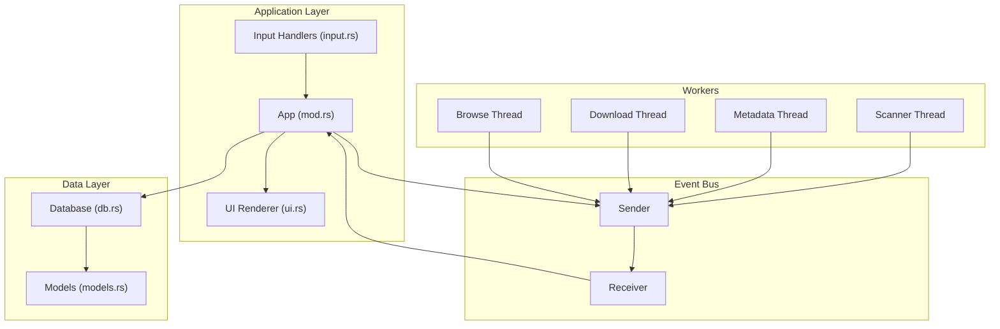
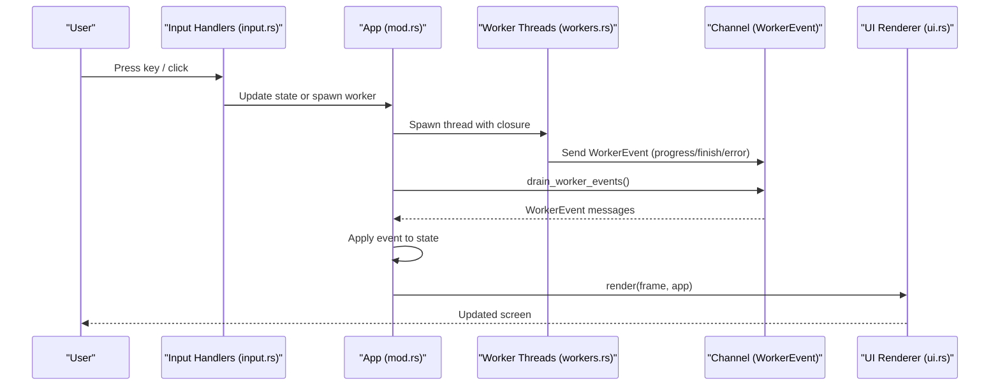
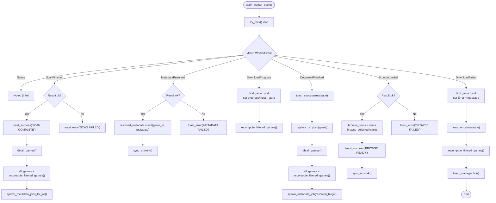
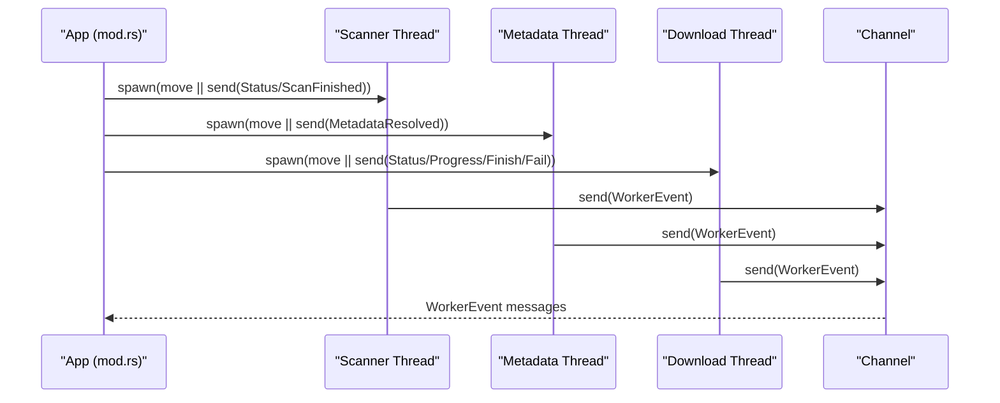
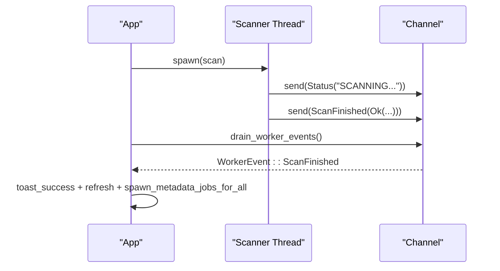
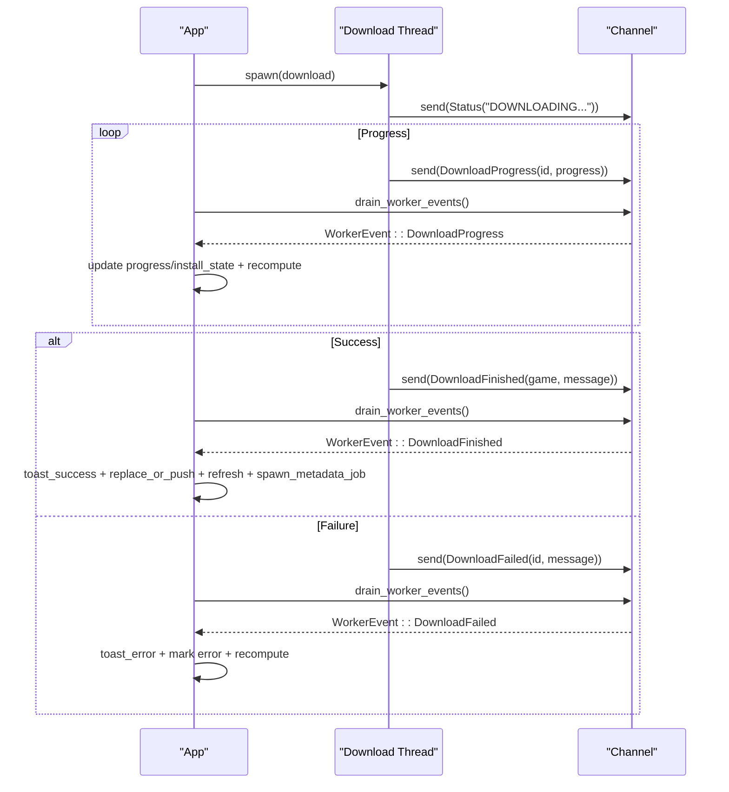
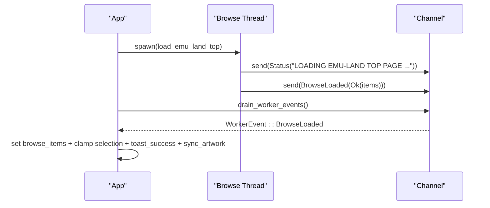
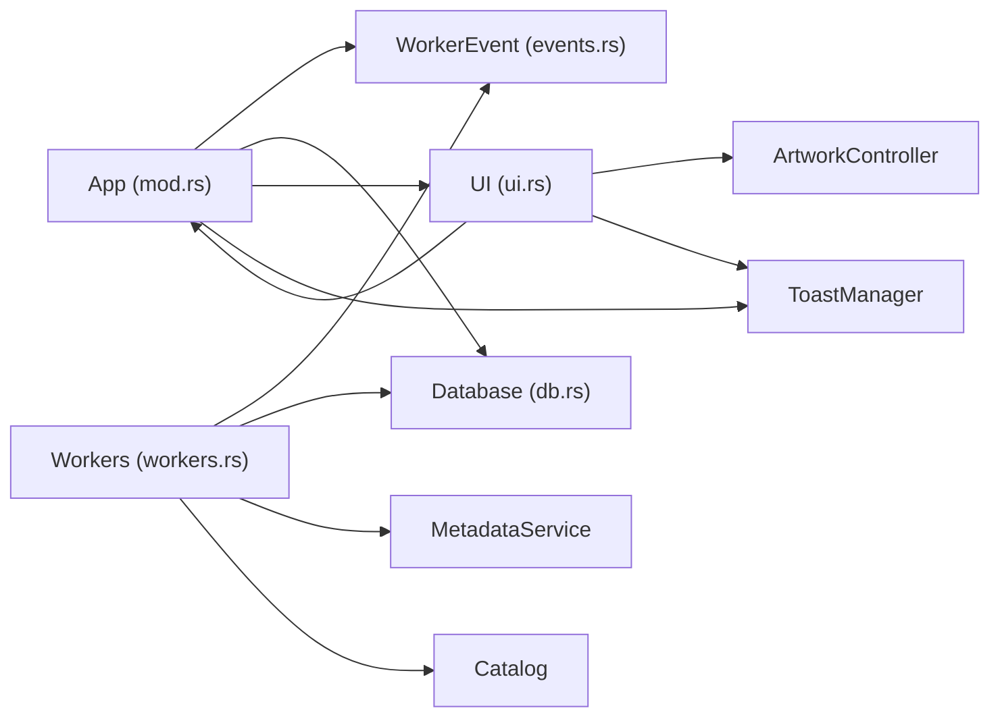

# Event-Driven Architecture

<cite>
**Referenced Files in This Document**
- [events.rs](file://src/app/events.rs)
- [workers.rs](file://src/app/workers.rs)
- [input.rs](file://src/app/input.rs)
- [state.rs](file://src/app/state.rs)
- [mod.rs](file://src/app/mod.rs)
- [ui.rs](file://src/ui.rs)
- [lib.rs](file://src/lib.rs)
- [main.rs](file://src/main.rs)
- [models.rs](file://src/models.rs)
- [db.rs](file://src/db.rs)
</cite>

## Table of Contents
1. [Introduction](#introduction)
2. [Project Structure](#project-structure)
3. [Core Components](#core-components)
4. [Architecture Overview](#architecture-overview)
5. [Detailed Component Analysis](#detailed-component-analysis)
6. [Dependency Analysis](#dependency-analysis)
7. [Performance Considerations](#performance-considerations)
8. [Troubleshooting Guide](#troubleshooting-guide)
9. [Conclusion](#conclusion)

## Introduction
This document explains Retro Launcher’s event-driven communication system. It focuses on how the WorkerEvent enum decouples UI, database operations, and background workers, enabling asynchronous workflows without blocking the main terminal UI. The system uses a unidirectional message bus pattern: background workers send WorkerEvent instances into a channel, and the main application drains and applies these events during each UI tick. This design ensures smooth UI responsiveness, predictable state transitions, and robust error propagation.

## Project Structure
The event system spans several modules:
- Application orchestration and state live in the app module.
- WorkerEvent and event routing are defined in the events submodule.
- Worker thread spawning and background tasks are in the workers submodule.
- UI rendering and overlays are handled in the ui module.
- Input handling routes user actions to worker spawns or UI updates.
- Data models and database operations underpin state mutations.

**Diagram sources**
- [mod.rs:94-123](file://src/app/mod.rs#L94-L123)
- [events.rs:10-22](file://src/app/events.rs#L10-L22)
- [workers.rs:21-162](file://src/app/workers.rs#L21-L162)
- [input.rs:14-58](file://src/app/input.rs#L14-L58)
- [ui.rs:23-68](file://src/ui.rs#L23-L68)
- [db.rs:20-46](file://src/db.rs#L20-L46)
- [models.rs:8-200](file://src/models.rs#L8-L200)

**Section sources**
- [mod.rs:1-815](file://src/app/mod.rs#L1-L815)
- [events.rs:1-99](file://src/app/events.rs#L1-L99)
- [workers.rs:1-236](file://src/app/workers.rs#L1-L236)
- [input.rs:1-347](file://src/app/input.rs#L1-L347)
- [ui.rs:1-1127](file://src/ui.rs#L1-L1127)
- [db.rs:1-974](file://src/db.rs#L1-L974)
- [models.rs:1-415](file://src/models.rs#L1-L415)

## Core Components
- WorkerEvent enum: Defines all asynchronous events produced by workers (scan completion, metadata resolution, download progress/finish/failure, browse load).
- App: Holds application state, channels, and orchestrates draining and applying events each tick.
- Worker thread management: Spawns background tasks and sends WorkerEvent messages.
- UI: Renders state and overlays; reacts to events via re-render cycles.
- Input handlers: Translate user actions into worker spawns or UI state changes.

Key implementation references:
- WorkerEvent definition and routing: [events.rs:10-98](file://src/app/events.rs#L10-L98)
- App state and channels: [mod.rs:94-123](file://src/app/mod.rs#L94-L123)
- Worker spawning and event emission: [workers.rs:21-162](file://src/app/workers.rs#L21-L162)
- UI rendering and overlays: [ui.rs:23-68](file://src/ui.rs#L23-L68)
- Input-to-action mapping: [input.rs:14-58](file://src/app/input.rs#L14-L58)

**Section sources**
- [events.rs:10-98](file://src/app/events.rs#L10-L98)
- [mod.rs:94-123](file://src/app/mod.rs#L94-L123)
- [workers.rs:21-162](file://src/app/workers.rs#L21-L162)
- [ui.rs:23-68](file://src/ui.rs#L23-L68)
- [input.rs:14-58](file://src/app/input.rs#L14-L58)

## Architecture Overview
The event-driven pipeline:
1. User input triggers actions in input.rs.
2. Actions either update UI state immediately or spawn background workers.
3. Workers perform long-running tasks and emit WorkerEvent messages via the channel.
4. Each UI tick, App drains the channel and applies events to update state.
5. UI re-renders based on the updated state.

**Diagram sources**
- [input.rs:14-58](file://src/app/input.rs#L14-L58)
- [mod.rs:575-621](file://src/app/mod.rs#L575-L621)
- [workers.rs:21-162](file://src/app/workers.rs#L21-L162)
- [events.rs:24-98](file://src/app/events.rs#L24-L98)
- [ui.rs:23-68](file://src/ui.rs#L23-L68)

## Detailed Component Analysis

### WorkerEvent Enum and Routing
WorkerEvent encapsulates all asynchronous outcomes from background tasks:
- Status: informational messages.
- ScanFinished: success or failure of local ROM scan.
- MetadataResolved: resolved metadata for a game or error.
- DownloadProgress: incremental progress updates.
- DownloadFinished: successful download/import with message.
- BrowseLoaded: loaded browse items or error.
- DownloadFailed: error during download with message.

Routing behavior in App::drain_worker_events:
- ScanFinished: updates toast, refreshes library, recomputes filters, spawns metadata jobs.
- MetadataResolved: stores resolved metadata, triggers artwork sync.
- DownloadProgress: updates per-game progress/install state, recomputes filters.
- DownloadFinished: shows success toast, replaces/inserts game, refreshes library, recomputes filters, spawns metadata job.
- BrowseLoaded: sets browse items, selects first item, shows success toast, triggers artwork sync.
- DownloadFailed: marks game as error with message, shows toast, recomputes filters.

**Diagram sources**
- [events.rs:24-98](file://src/app/events.rs#L24-L98)

**Section sources**
- [events.rs:10-98](file://src/app/events.rs#L10-L98)

### Worker Thread Management
Workers are spawned from App methods:
- Startup scan: emits status, runs scanner, emits ScanFinished.
- Browse loading: emits status, loads Emu-Land top page, emits BrowseLoaded.
- Metadata enrichment: clones game ID and spawns per-game thread; emits MetadataResolved.
- Downloads: updates install state and progress, streams DownloadProgress, emits DownloadFinished or DownloadFailed.

Concurrency model:
- Each worker is a separate thread with a scoped Sender cloned from App’s channel.
- WorkerEvent is a small, owned message type suitable for cross-thread transport.
- The channel is unbounded (mpsc::channel) allowing bursts of events without backpressure.

**Diagram sources**
- [mod.rs:386-400](file://src/app/mod.rs#L386-L400)
- [workers.rs:21-162](file://src/app/workers.rs#L21-L162)
- [events.rs:10-22](file://src/app/events.rs#L10-L22)

**Section sources**
- [mod.rs:386-400](file://src/app/mod.rs#L386-L400)
- [workers.rs:21-162](file://src/app/workers.rs#L21-L162)

### Message Passing Patterns and Event Routing
- Unidirectional flow: workers push events; App pulls and applies.
- Immediate vs deferred: input handlers may update UI state immediately; long-running tasks push events asynchronously.
- Event batching: App drains the channel each tick, processing all pending events before rendering, preventing interleaving of unrelated UI updates.

References:
- Channel creation and fields: [mod.rs:130-160](file://src/app/mod.rs#L130-L160)
- Draining loop: [events.rs:26-97](file://src/app/events.rs#L26-L97)
- Tick loop and render cycle: [mod.rs:575-621](file://src/app/mod.rs#L575-L621)

**Section sources**
- [mod.rs:130-160](file://src/app/mod.rs#L130-L160)
- [events.rs:26-97](file://src/app/events.rs#L26-L97)
- [mod.rs:575-621](file://src/app/mod.rs#L575-L621)

### State Update Mechanisms
State updates are pure functions of received events:
- Game lists and filters: refreshed after scans and downloads.
- Per-game metadata: stored in resolved_metadata map.
- Progress and install state: updated per DownloadProgress.
- Browse items: replaced on BrowseLoaded.
- Error state: set on DownloadFailed.

Recompute and sync helpers:
- recompute_filtered_games: rebuilds filtered/installed lists and sorts.
- sync_artwork: updates artwork controller based on selection.

References:
- State updates: [events.rs:32-91](file://src/app/events.rs#L32-L91)
- Filter recomputation: [mod.rs:260-292](file://src/app/mod.rs#L260-L292)
- Artwork sync: [mod.rs:331-347](file://src/app/mod.rs#L331-L347)

**Section sources**
- [events.rs:32-91](file://src/app/events.rs#L32-L91)
- [mod.rs:260-292](file://src/app/mod.rs#L260-L292)
- [mod.rs:331-347](file://src/app/mod.rs#L331-L347)

### Event Lifecycle, Ordering, and Error Propagation
Lifecycle:
- Emit Status early to inform the user.
- Emit intermediate DownloadProgress updates.
- Emit final DownloadFinished or DownloadFailed.
- Emit BrowseLoaded or ScanFinished.

Ordering guarantees:
- The channel is FIFO; events are processed in arrival order.
- App drains the channel each tick, ensuring deterministic application of events before rendering.

Error propagation:
- Results are converted to strings and propagated via WorkerEvent variants.
- UI surfaces errors via toasts; state is updated to reflect error conditions.

References:
- Status emission: [workers.rs:27](file://src/app/workers.rs#L27), [workers.rs:392](file://src/app/workers.rs#L392)
- Progress emission: [workers.rs:81-86](file://src/app/workers.rs#L81-L86)
- Finalization: [workers.rs:150-160](file://src/app/workers.rs#L150-L160)
- Error handling: [events.rs:48-50](file://src/app/events.rs#L48-L50), [events.rs:84-90](file://src/app/events.rs#L84-L90)

**Section sources**
- [workers.rs:27](file://src/app/workers.rs#L27)
- [workers.rs:392](file://src/app/workers.rs#L392)
- [workers.rs:81-86](file://src/app/workers.rs#L81-L86)
- [workers.rs:150-160](file://src/app/workers.rs#L150-L160)
- [events.rs:48-50](file://src/app/events.rs#L48-L50)
- [events.rs:84-90](file://src/app/events.rs#L84-L90)

### Concurrent Events and Race Conditions
Concurrency model:
- Single-threaded UI loop: the terminal UI runs in one thread.
- Background workers are separate threads emitting WorkerEvent messages.
- App drains the channel each tick, applying events atomically before rendering.

Race prevention:
- No shared mutable state is accessed concurrently by workers and UI except the channel.
- State mutations are idempotent and derived from WorkerEvent payloads.
- UI reads state after applying events, avoiding stale reads.

References:
- Tick loop: [mod.rs:575-621](file://src/app/mod.rs#L575-L621)
- Channel usage: [mod.rs:130-160](file://src/app/mod.rs#L130-L160)

**Section sources**
- [mod.rs:575-621](file://src/app/mod.rs#L575-L621)
- [mod.rs:130-160](file://src/app/mod.rs#L130-L160)

### Example Event Flows

#### Scan Completion Flow
- User triggers startup scan.
- Worker emits Status, then ScanFinished.
- App updates library, filters, spawns metadata jobs, shows success toast.

**Diagram sources**
- [mod.rs:386-400](file://src/app/mod.rs#L386-L400)
- [events.rs:32-42](file://src/app/events.rs#L32-L42)

#### Download Flow
- User selects a game to download.
- UI updates install state and progress.
- Worker emits Status, periodic DownloadProgress, then DownloadFinished or DownloadFailed.
- App updates library, metadata, and shows toast.

**Diagram sources**
- [workers.rs:60-162](file://src/app/workers.rs#L60-L162)
- [events.rs:52-91](file://src/app/events.rs#L52-L91)

#### Browse Load Flow
- User switches to Browse tab or navigates pages.
- Worker emits Status, then BrowseLoaded.
- App updates browse items, clamps selection, shows success toast, syncs artwork.

**Diagram sources**
- [workers.rs:21-31](file://src/app/workers.rs#L21-L31)
- [events.rs:71-83](file://src/app/events.rs#L71-L83)

## Dependency Analysis
- App depends on:
  - WorkerEvent for routing.
  - Database for persistence and queries.
  - Artwork controller for rendering.
  - Toast manager for notifications.
- Workers depend on:
  - Database and filesystem for IO.
  - Metadata service for enrichment.
  - Catalog service for browse/search.
- UI depends on:
  - App state for rendering.
  - Artwork controller for images.
  - Toast manager for overlays.

**Diagram sources**
- [mod.rs:94-123](file://src/app/mod.rs#L94-L123)
- [events.rs:10-22](file://src/app/events.rs#L10-L22)
- [workers.rs:13-20](file://src/app/workers.rs#L13-L20)
- [ui.rs:12-18](file://src/ui.rs#L12-L18)
- [db.rs:20-46](file://src/db.rs#L20-L46)

**Section sources**
- [mod.rs:94-123](file://src/app/mod.rs#L94-L123)
- [events.rs:10-22](file://src/app/events.rs#L10-L22)
- [workers.rs:13-20](file://src/app/workers.rs#L13-L20)
- [ui.rs:12-18](file://src/ui.rs#L12-L18)
- [db.rs:20-46](file://src/db.rs#L20-L46)

## Performance Considerations
- Channel throughput: mpsc::channel allows bursty event production without blocking workers.
- Event batching: draining the channel each tick reduces UI redraw overhead.
- Minimal state mutation: events apply small, targeted updates to state.
- Artwork sync: triggered only when selection or browse items change.
- Database queries: batched on scan completion and after downloads.

[No sources needed since this section provides general guidance]

## Troubleshooting Guide
Common issues and diagnostics:
- No UI updates after worker completes:
  - Ensure drain_worker_events is called each tick.
  - Verify WorkerEvent variants are handled in the match arm.
- Download stuck at 0%:
  - Check DownloadProgress emissions and UI progress updates.
  - Confirm recompute_filtered_games is invoked after progress updates.
- Browse tab empty:
  - Verify BrowseLoaded sets browse_items and clamps selection.
  - Ensure spawn_browse_job is called when switching tabs or changing pages.
- Errors not shown:
  - Confirm DownloadFailed sets error state and toast_error is called.
  - Check that toast_manager.tick() is invoked after event processing.

Operational references:
- Draining and applying events: [events.rs:26-97](file://src/app/events.rs#L26-L97)
- Tick loop: [mod.rs:575-621](file://src/app/mod.rs#L575-L621)
- Toast helpers: [mod.rs:294-312](file://src/app/mod.rs#L294-L312)

**Section sources**
- [events.rs:26-97](file://src/app/events.rs#L26-L97)
- [mod.rs:575-621](file://src/app/mod.rs#L575-L621)
- [mod.rs:294-312](file://src/app/mod.rs#L294-L312)

## Conclusion
Retro Launcher’s event-driven architecture cleanly separates concerns:
- UI remains responsive by deferring heavy work to background threads.
- WorkerEvent provides a compact contract for asynchronous outcomes.
- App::drain_worker_events ensures deterministic, ordered application of events.
- State updates are pure and idempotent, minimizing race conditions.
This design scales to new background tasks by adding new WorkerEvent variants and corresponding routing logic.