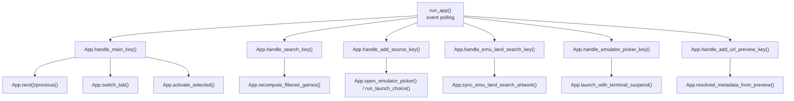
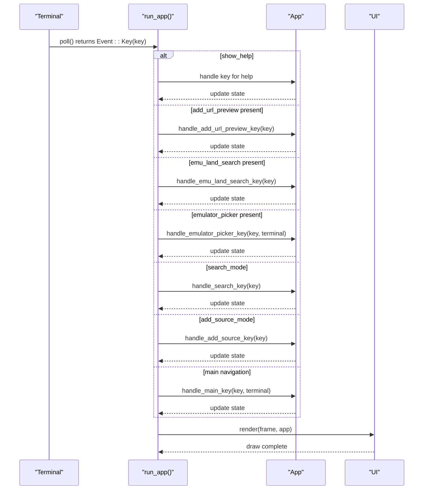
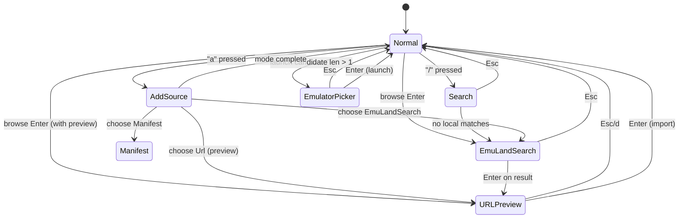
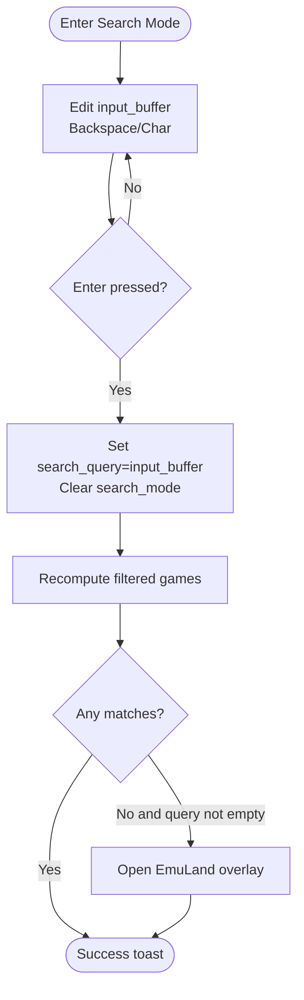
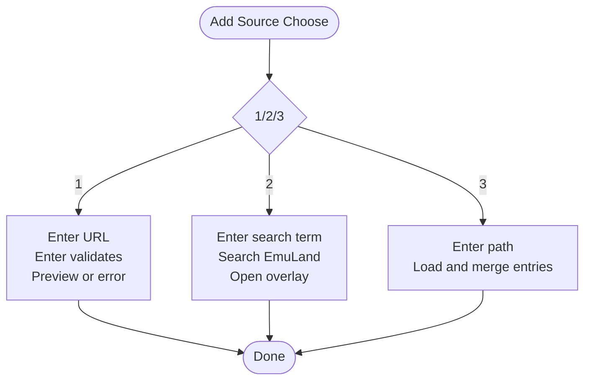
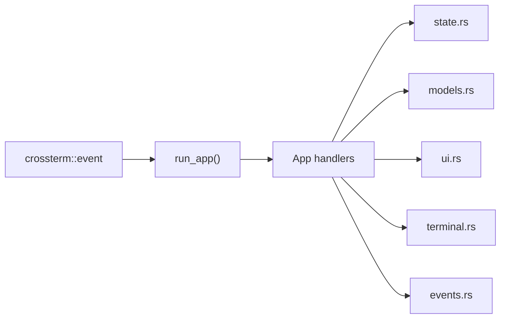

# Input Handling System

<cite>
**Referenced Files in This Document**
- [input.rs](file://src/app/input.rs)
- [mod.rs](file://src/app/mod.rs)
- [state.rs](file://src/app/state.rs)
- [events.rs](file://src/app/events.rs)
- [terminal.rs](file://src/terminal.rs)
- [ui.rs](file://src/ui.rs)
- [models.rs](file://src/models.rs)
</cite>

## Table of Contents
1. [Introduction](#introduction)
2. [Project Structure](#project-structure)
3. [Core Components](#core-components)
4. [Architecture Overview](#architecture-overview)
5. [Detailed Component Analysis](#detailed-component-analysis)
6. [Dependency Analysis](#dependency-analysis)
7. [Performance Considerations](#performance-considerations)
8. [Troubleshooting Guide](#troubleshooting-guide)
9. [Conclusion](#conclusion)

## Introduction
This document explains Retro Launcher’s keyboard input handling system. It covers the event processing pipeline, input mode management (normal, search, add source, overlays), context-sensitive command routing, the input state machine, modifier key handling, and special key combinations. It also documents how input events trigger state changes and UI updates, along with examples of input validation, input buffering, and mode transitions. Accessibility considerations and customization options are addressed to support diverse terminal environments.

## Project Structure
The input handling system is implemented across several modules:
- Application orchestration and state: [mod.rs](file://src/app/mod.rs)
- Keyboard event handlers: [input.rs](file://src/app/input.rs)
- Navigation and selection state: [state.rs](file://src/app/state.rs)
- Worker event integration: [events.rs](file://src/app/events.rs)
- Focus pane and terminal capabilities: [terminal.rs](file://src/terminal.rs)
- UI rendering of overlays and hints: [ui.rs](file://src/ui.rs)
- Data models and enums: [models.rs](file://src/models.rs)

**Diagram sources**
- [mod.rs:575-621](file://src/app/mod.rs#L575-L621)
- [input.rs:14-347](file://src/app/input.rs#L14-L347)
- [state.rs:8-84](file://src/app/state.rs#L8-L84)
- [ui.rs:28-725](file://src/ui.rs#L28-L725)

**Section sources**
- [mod.rs:575-621](file://src/app/mod.rs#L575-L621)
- [input.rs:14-347](file://src/app/input.rs#L14-L347)
- [state.rs:8-84](file://src/app/state.rs#L8-L84)
- [ui.rs:28-725](file://src/ui.rs#L28-L725)

## Core Components
- App state and mode flags:
  - Active input modes: search_mode, add_source_mode, emu_land_search, add_url_preview, emulator_picker
  - Input buffer: input_buffer used for text input across modes
  - Selection and focus: selected, browse_selected, active_tab, focus_pane
- Mode enums:
  - AddSourceMode: Choose, Url, EmuLandSearch, Manifest
  - AppTab: Library, Installed, Browse
- Event routing:
  - run_app polls terminal events and dispatches to mode-specific handlers based on active overlays/modes
- Rendering overlays:
  - UI renders input overlays and hints depending on active modes and focus pane

**Section sources**
- [mod.rs:48-123](file://src/app/mod.rs#L48-L123)
- [mod.rs:575-621](file://src/app/mod.rs#L575-L621)
- [ui.rs:28-725](file://src/ui.rs#L28-L725)

## Architecture Overview
The input pipeline follows a strict precedence order to ensure deterministic behavior:
1. Global overlays (help, add-source wizard, search, emu-land results, emulator picker, URL preview)
2. Search mode
3. Add-source mode
4. Main navigation

Modifier keys are handled globally (e.g., Ctrl+C to quit), while character keys route to the appropriate handler based on active mode.

**Diagram sources**
- [mod.rs:575-621](file://src/app/mod.rs#L575-L621)
- [input.rs:14-347](file://src/app/input.rs#L14-L347)
- [ui.rs:28-725](file://src/ui.rs#L28-L725)

## Detailed Component Analysis

### Input State Machine
The system maintains a small state machine driven by mode flags and buffers:
- Normal mode: primary navigation and actions
- Search mode: incremental filtering with input_buffer
- Add source wizard: multi-step modal with input_buffer
- Overlays: EmuLand search results, emulator picker, URL preview

**Diagram sources**
- [mod.rs:48-123](file://src/app/mod.rs#L48-L123)
- [input.rs:14-347](file://src/app/input.rs#L14-L347)

**Section sources**
- [mod.rs:48-123](file://src/app/mod.rs#L48-L123)
- [input.rs:14-347](file://src/app/input.rs#L14-L347)

### Main Navigation Keys
- Movement: j/k or arrow keys move selection; h/l or Tab/Shift+Tab cycle focus panes
- Tabs: 1/2/3 switch between Library, Installed, Browse
- Pages (Browse): p/n toggle pages
- Help: ? toggles help overlay
- Quit: q exits
- Action: Enter triggers activation logic (launch/download/import)

Behavior is implemented in handle_main_key and selection helpers in state.rs.

**Section sources**
- [input.rs:16-58](file://src/app/input.rs#L16-L58)
- [state.rs:8-84](file://src/app/state.rs#L8-L84)

### Search Mode
- Activation: “/” sets search_mode and preloads input_buffer with current search_query
- Editing: Backspace removes characters; character keys append to input_buffer
- Commit: Enter applies input_buffer to search_query, clears search_mode, recomputes filtered games
- Empty results: falls back to EmuLand search and opens EmuLand overlay
- Clearing: empty query yields success toast

**Diagram sources**
- [input.rs:61-102](file://src/app/input.rs#L61-L102)
- [mod.rs:260-292](file://src/app/mod.rs#L260-L292)

**Section sources**
- [input.rs:61-102](file://src/app/input.rs#L61-L102)
- [mod.rs:260-292](file://src/app/mod.rs#L260-L292)

### Add Source Wizard
The add-source flow supports three paths, each using input_buffer for text entry:
- Choose: 1 (direct URL), 2 (EmuLand search), 3 (manifest)
- Direct URL: Enter validates format and previews; Esc cancels
- EmuLand search: Enter triggers catalog search and opens overlay
- Manifest: Enter loads and merges catalog entries

**Diagram sources**
- [input.rs:104-210](file://src/app/input.rs#L104-L210)
- [mod.rs:467-491](file://src/app/mod.rs#L467-L491)

**Section sources**
- [input.rs:104-210](file://src/app/input.rs#L104-L210)
- [mod.rs:467-491](file://src/app/mod.rs#L467-L491)

### EmuLand Search Overlay
- Navigation: j/k or arrow keys select results; Enter previews selected result
- Preview: opens URL preview overlay with warning handling
- Esc closes overlay and resets preview artwork

**Section sources**
- [input.rs:212-256](file://src/app/input.rs#L212-L256)
- [mod.rs:314-329](file://src/app/mod.rs#L314-L329)

### Emulator Picker Overlay
- Navigation: j/k or arrow keys select emulator; Enter launches or installs
- Esc cancels and returns to normal mode
- Launch path: run_launch_choice orchestrates availability checks and terminal suspend/resume

**Section sources**
- [input.rs:258-295](file://src/app/input.rs#L258-L295)
- [mod.rs:402-450](file://src/app/mod.rs#L402-L450)

### URL Preview Overlay
- Navigation: j/k or arrow keys toggle between “Discard” and “Add to Library”
- Enter adds the previewed entry to the catalog and metadata, then clears overlay
- d/Esc discards and clears overlay

**Section sources**
- [input.rs:297-345](file://src/app/input.rs#L297-L345)
- [mod.rs:362-384](file://src/app/mod.rs#L362-L384)

### Modifier Key Handling
- Ctrl+C quits the application regardless of mode
- Help overlay respects Esc and ?/q to dismiss

**Section sources**
- [mod.rs:580-616](file://src/app/mod.rs#L580-L616)

### Context-Sensitive Command Routing
- run_app routes keys to handlers based on active overlays/mode flags
- UI overlays render based on active modes and input_buffer content
- Footer hints reflect current mode and active input buffer

**Section sources**
- [mod.rs:575-621](file://src/app/mod.rs#L575-L621)
- [ui.rs:28-725](file://src/ui.rs#L28-L725)
- [mod.rs:229-258](file://src/app/mod.rs#L229-L258)

### Input Validation and Buffering
- Search and add-source modes use input_buffer to collect typed text
- Validation occurs during commit or mode-specific actions:
  - EmuLand search: triggered on Enter after typing
  - URL preview: validated on Enter with structured input format
  - Manifest import: path-based loading and merging
- Buffer clearing:
  - On mode exit (Esc) or successful commit
  - On activation of alternate overlays

**Section sources**
- [input.rs:61-102](file://src/app/input.rs#L61-L102)
- [input.rs:104-210](file://src/app/input.rs#L104-L210)
- [input.rs:212-256](file://src/app/input.rs#L212-L256)
- [input.rs:297-345](file://src/app/input.rs#L297-L345)

### State Changes and UI Updates
- State mutations:
  - search_mode, search_query, add_source_mode, emu_land_search, add_url_preview, emulator_picker
  - input_buffer updates during typing
  - selection indices and active_tab changes via navigation helpers
- UI updates:
  - recompute_filtered_games updates filtered and installed lists
  - sync_artwork/sync_emu_land_search_artwork refresh artwork previews
  - toasts provide feedback for user actions
  - overlays render based on active flags

**Section sources**
- [mod.rs:260-347](file://src/app/mod.rs#L260-L347)
- [state.rs:8-84](file://src/app/state.rs#L8-L84)
- [ui.rs:28-725](file://src/ui.rs#L28-L725)

### Accessibility Considerations
- Focus pane cycling: h/l moves focus between Library, Artwork, Summary panes
- Help overlay: contextual hints for current mode
- Terminal capability detection: color tier and image protocol selection
- Minimum viewport thresholds: compact/standard/wide layouts adapt to terminal size

Recommendations:
- Prefer j/k for vertical navigation and h/l for horizontal/focus movement
- Use Tab/Shift+Tab to cycle focus zones
- Keep overlays concise; Esc to cancel quickly

**Section sources**
- [terminal.rs:1-161](file://src/terminal.rs#L1-L161)
- [mod.rs:229-258](file://src/app/mod.rs#L229-L258)
- [ui.rs:577-600](file://src/ui.rs#L577-L600)

### Input Customization Options
- Preferred emulators per platform influence emulator picker ordering
- Terminal capabilities (color, image protocols) affect rendering fidelity
- Viewport mode adjusts layout density for smaller terminals

**Section sources**
- [models.rs:353-369](file://src/models.rs#L353-L369)
- [terminal.rs:86-133](file://src/terminal.rs#L86-L133)
- [terminal.rs:38-59](file://src/terminal.rs#L38-L59)

## Dependency Analysis
The input system depends on:
- crossterm for event polling and key codes
- ratatui for rendering overlays and UI
- App state and models for data structures and enums
- Worker events for asynchronous updates

**Diagram sources**
- [mod.rs:21-27](file://src/app/mod.rs#L21-L27)
- [input.rs:6-12](file://src/app/input.rs#L6-L12)
- [ui.rs:28-725](file://src/ui.rs#L28-L725)

**Section sources**
- [mod.rs:21-27](file://src/app/mod.rs#L21-L27)
- [input.rs:6-12](file://src/app/input.rs#L6-L12)
- [ui.rs:28-725](file://src/ui.rs#L28-L725)

## Performance Considerations
- Event polling rate: constant tick interval controls redraw frequency
- Filtering: recompute_filtered_games performs linear scans; keep queries concise
- Overlay rendering: overlays are rendered conditionally based on active flags
- Artwork caching: artwork synchronization uses cached paths to avoid repeated network calls

## Troubleshooting Guide
Common issues and resolutions:
- Help overlay not dismissing: ensure Esc or ?/q are pressed when show_help is true
- Search not applying: verify Enter is pressed after editing input_buffer; check for empty query behavior
- Add-source wizard stuck: confirm Esc clears mode and input_buffer; ensure Enter triggers intended action
- Emulator picker not launching: verify candidate list is non-empty; check availability and platform defaults
- URL preview import failing: confirm input format and path validity; check warnings and error toasts

Operational tips:
- Use Ctrl+C to exit cleanly
- Use Tab/Shift+Tab to navigate focus zones
- Use h/l to move focus panes; j/k for selection

**Section sources**
- [mod.rs:580-616](file://src/app/mod.rs#L580-L616)
- [input.rs:61-102](file://src/app/input.rs#L61-L102)
- [input.rs:104-210](file://src/app/input.rs#L104-L210)
- [input.rs:212-256](file://src/app/input.rs#L212-L256)
- [input.rs:258-295](file://src/app/input.rs#L258-L295)
- [input.rs:297-345](file://src/app/input.rs#L297-L345)

## Conclusion
Retro Launcher’s input handling system provides a robust, layered keyboard interface supporting normal navigation, search, add-source workflows, and multiple overlays. The strict precedence of mode dispatch, combined with explicit input buffering and state transitions, ensures predictable behavior. The UI integrates feedback through toasts and overlays, while terminal capability detection and viewport modes improve accessibility across diverse environments. Extending the system involves adding new modes with dedicated handlers, updating the dispatcher, and integrating UI overlays.