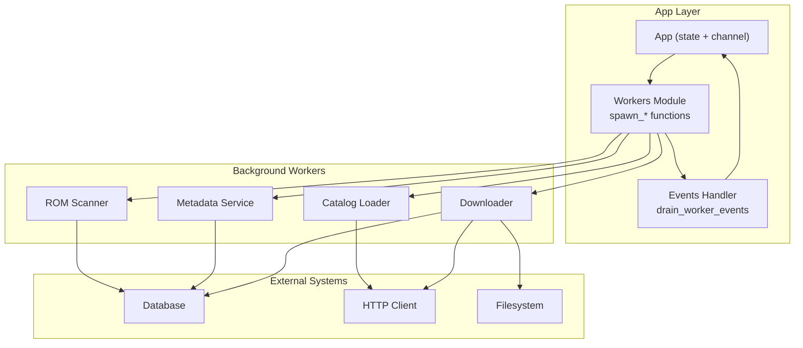
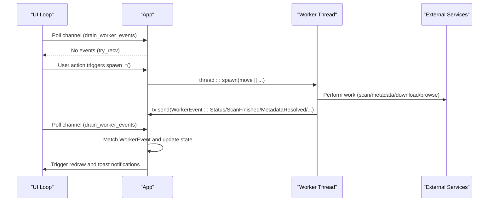
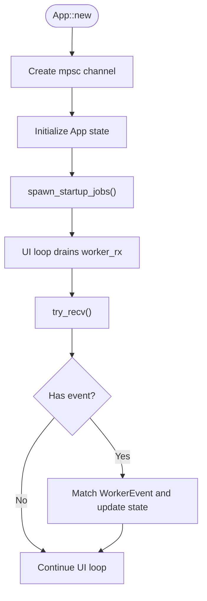
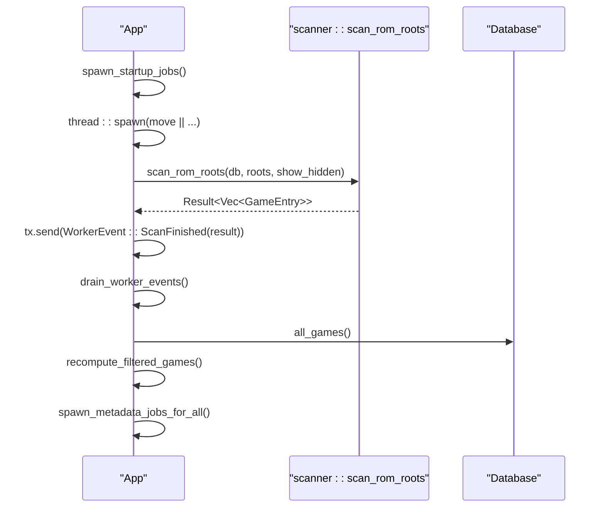
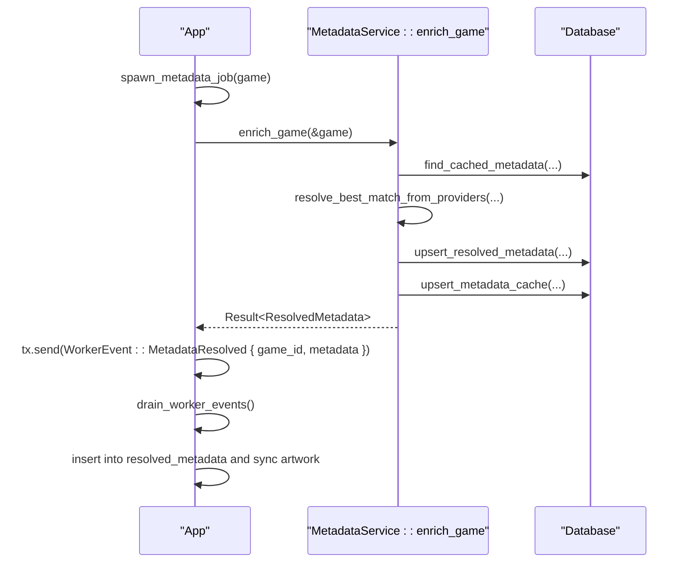
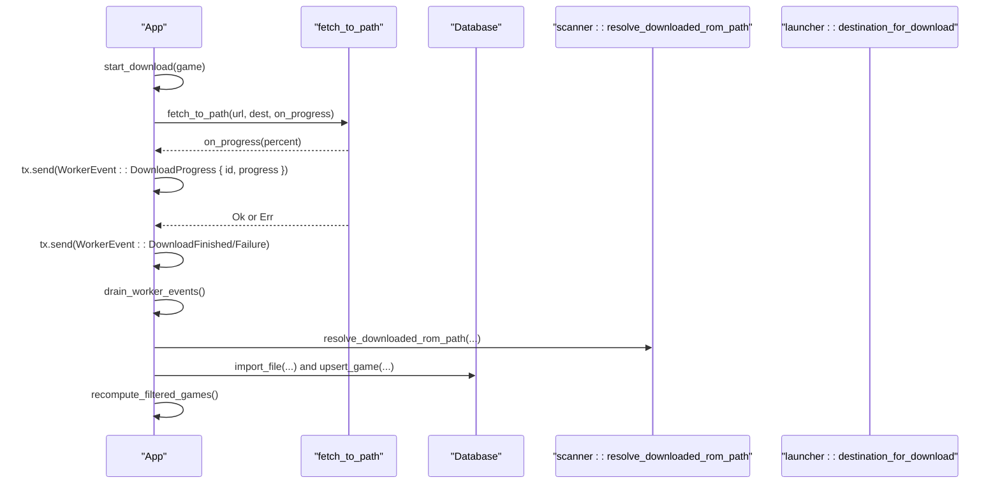
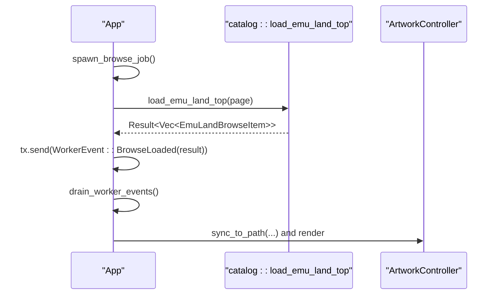
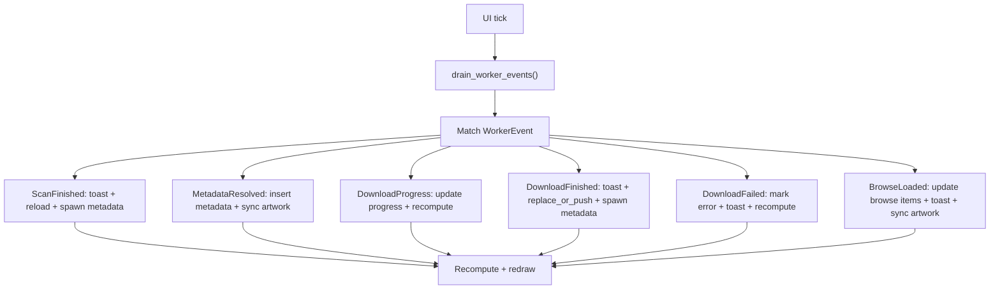
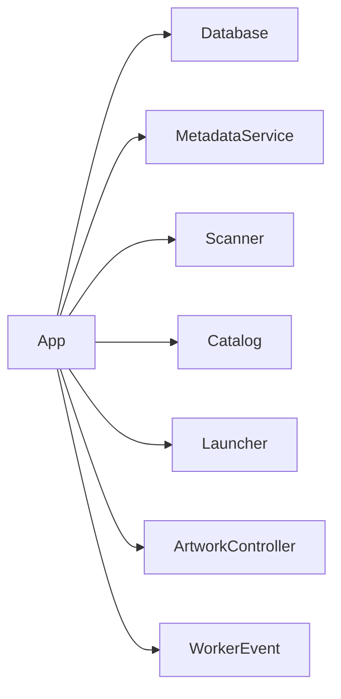

# Worker Thread System

<cite>
**Referenced Files in This Document**
- [workers.rs](file://src/app/workers.rs)
- [events.rs](file://src/app/events.rs)
- [mod.rs](file://src/app/mod.rs)
- [lib.rs](file://src/lib.rs)
- [main.rs](file://src/main.rs)
- [scanner.rs](file://src/scanner.rs)
- [metadata.rs](file://src/metadata.rs)
- [catalog.rs](file://src/catalog.rs)
- [db.rs](file://src/db.rs)
- [launcher.rs](file://src/launcher.rs)
- [artwork.rs](file://src/artwork.rs)
- [models.rs](file://src/models.rs)
</cite>

## Table of Contents
1. [Introduction](#introduction)
2. [Project Structure](#project-structure)
3. [Core Components](#core-components)
4. [Architecture Overview](#architecture-overview)
5. [Detailed Component Analysis](#detailed-component-analysis)
6. [Dependency Analysis](#dependency-analysis)
7. [Performance Considerations](#performance-considerations)
8. [Troubleshooting Guide](#troubleshooting-guide)
9. [Conclusion](#conclusion)

## Introduction
This document explains Retro Launcher’s background worker system: how long-running tasks are executed off the main UI thread, how worker threads communicate back to the UI, and how the application manages lifecycle, prioritization, and resource usage. The worker system covers:
- ROM scanning
- Metadata resolution
- Artwork downloading
- Catalog browsing
- Non-blocking UI updates via channels
- Error handling and graceful shutdown patterns

## Project Structure
The worker system is centered around the application state and event channel:
- Application state holds a channel sender/receiver pair for worker events.
- Worker spawning functions live in the app module and delegate to dedicated modules for scanning, metadata, and catalog.
- UI drains worker events periodically to update state and render progress.

**Diagram sources**
- [mod.rs:125-170](file://src/app/mod.rs#L125-L170)
- [workers.rs:21-163](file://src/app/workers.rs#L21-L163)
- [events.rs:24-98](file://src/app/events.rs#L24-L98)

**Section sources**
- [mod.rs:125-170](file://src/app/mod.rs#L125-L170)
- [lib.rs:20-22](file://src/lib.rs#L20-L22)
- [main.rs:3-8](file://src/main.rs#L3-L8)

## Core Components
- App state maintains a bounded channel for worker events and a periodic drain loop in the UI.
- Worker spawning functions create threads and send structured events back to the UI.
- Event handler updates application state and triggers UI refreshes.

Key responsibilities:
- Channel creation and draining
- ROM scanning thread
- Metadata enrichment thread
- Download thread with progress callbacks
- Catalog browsing thread
- Error propagation and UI notifications

**Section sources**
- [mod.rs:125-170](file://src/app/mod.rs#L125-L170)
- [events.rs:24-98](file://src/app/events.rs#L24-L98)
- [workers.rs:21-163](file://src/app/workers.rs#L21-L163)

## Architecture Overview
The worker architecture follows a producer-consumer model:
- Producer: Background threads spawned by the app.
- Consumer: UI loop that drains the channel and updates state.
- Communication: Strongly typed events via an enum.

**Diagram sources**
- [mod.rs:575-621](file://src/app/mod.rs#L575-L621)
- [events.rs:24-98](file://src/app/events.rs#L24-L98)
- [workers.rs:21-163](file://src/app/workers.rs#L21-L163)

## Detailed Component Analysis

### Worker Thread Lifecycle and Channels
- Channel creation occurs during App initialization.
- The UI loop periodically drains the channel using a non-blocking receive.
- Worker threads send events and terminate after completing their task.

**Diagram sources**
- [mod.rs:125-170](file://src/app/mod.rs#L125-L170)
- [mod.rs:575-621](file://src/app/mod.rs#L575-L621)
- [events.rs:24-98](file://src/app/events.rs#L24-L98)

**Section sources**
- [mod.rs:125-170](file://src/app/mod.rs#L125-L170)
- [mod.rs:575-621](file://src/app/mod.rs#L575-L621)
- [events.rs:24-98](file://src/app/events.rs#L24-L98)

### ROM Scanning Worker
- Spawns a thread to scan configured ROM roots.
- Sends status updates and final results.
- On completion, refreshes library and triggers metadata enrichment.

**Diagram sources**
- [mod.rs:386-400](file://src/app/mod.rs#L386-L400)
- [workers.rs:386-396](file://src/app/workers.rs#L386-L396)
- [scanner.rs:158-191](file://src/scanner.rs#L158-L191)
- [db.rs:269-325](file://src/db.rs#L269-L325)

**Section sources**
- [mod.rs:386-400](file://src/app/mod.rs#L386-L400)
- [workers.rs:386-396](file://src/app/workers.rs#L386-L396)
- [scanner.rs:158-191](file://src/scanner.rs#L158-L191)
- [db.rs:269-325](file://src/db.rs#L269-L325)

### Metadata Resolution Worker
- Enriches a single game by invoking a metadata service.
- Supports multiple providers and caches results.
- Updates resolved metadata and artwork cache.

**Diagram sources**
- [workers.rs:42-57](file://src/app/workers.rs#L42-L57)
- [metadata.rs:265-321](file://src/metadata.rs#L265-L321)
- [metadata.rs:371-408](file://src/metadata.rs#L371-L408)
- [db.rs:506-541](file://src/db.rs#L506-L541)
- [db.rs:543-585](file://src/db.rs#L543-L585)

**Section sources**
- [workers.rs:42-57](file://src/app/workers.rs#L42-L57)
- [metadata.rs:265-321](file://src/metadata.rs#L265-L321)
- [metadata.rs:371-408](file://src/metadata.rs#L371-L408)
- [db.rs:506-541](file://src/db.rs#L506-L541)
- [db.rs:543-585](file://src/db.rs#L543-L585)

### Artwork Downloading Worker
- Handles download progress callbacks and checksum verification.
- Imports downloaded ROMs, resolves archives, and updates database.
- Sends progress and completion/failure events.

**Diagram sources**
- [workers.rs:60-162](file://src/app/workers.rs#L60-L162)
- [workers.rs:166-214](file://src/app/workers.rs#L166-L214)
- [scanner.rs:52-108](file://src/scanner.rs#L52-L108)
- [launcher.rs:29-31](file://src/launcher.rs#L29-L31)
- [db.rs:625-689](file://src/db.rs#L625-L689)

**Section sources**
- [workers.rs:60-162](file://src/app/workers.rs#L60-L162)
- [workers.rs:166-214](file://src/app/workers.rs#L166-L214)
- [scanner.rs:52-108](file://src/scanner.rs#L52-L108)
- [launcher.rs:29-31](file://src/launcher.rs#L29-L31)
- [db.rs:625-689](file://src/db.rs#L625-L689)

### Catalog Browsing Worker
- Loads top titles from a catalog source.
- Caches artwork previews and updates browse UI.

**Diagram sources**
- [workers.rs:23-31](file://src/app/workers.rs#L23-L31)
- [catalog.rs:327-351](file://src/catalog.rs#L327-L351)
- [artwork.rs:65-118](file://src/artwork.rs#L65-L118)

**Section sources**
- [workers.rs:23-31](file://src/app/workers.rs#L23-L31)
- [catalog.rs:327-351](file://src/catalog.rs#L327-L351)
- [artwork.rs:65-118](file://src/artwork.rs#L65-L118)

### Event Handling and UI Updates
- The UI drains the channel each tick and applies updates atomically.
- Toast notifications summarize worker outcomes.
- State recomputation ensures UI reflects latest changes.

**Diagram sources**
- [events.rs:24-98](file://src/app/events.rs#L24-L98)
- [mod.rs:260-292](file://src/app/mod.rs#L260-L292)
- [mod.rs:349-360](file://src/app/mod.rs#L349-L360)

**Section sources**
- [events.rs:24-98](file://src/app/events.rs#L24-L98)
- [mod.rs:260-292](file://src/app/mod.rs#L260-L292)
- [mod.rs:349-360](file://src/app/mod.rs#L349-L360)

## Dependency Analysis
- App depends on:
  - mpsc channel for worker events
  - Database for persistence
  - Metadata service for enrichment
  - Scanner for filesystem operations
  - Catalog for network browsing
  - Launcher for emulator invocation
  - Artwork controller for rendering

**Diagram sources**
- [mod.rs:94-123](file://src/app/mod.rs#L94-L123)
- [db.rs:21-23](file://src/db.rs#L21-L23)
- [metadata.rs:237-241](file://src/metadata.rs#L237-L241)
- [scanner.rs:10-13](file://src/scanner.rs#L10-L13)
- [catalog.rs:9-11](file://src/catalog.rs#L9-L11)
- [launcher.rs:1-7](file://src/launcher.rs#L1-L7)
- [artwork.rs:14-16](file://src/artwork.rs#L14-L16)

**Section sources**
- [mod.rs:94-123](file://src/app/mod.rs#L94-L123)
- [db.rs:21-23](file://src/db.rs#L21-L23)
- [metadata.rs:237-241](file://src/metadata.rs#L237-L241)
- [scanner.rs:10-13](file://src/scanner.rs#L10-L13)
- [catalog.rs:9-11](file://src/catalog.rs#L9-L11)
- [launcher.rs:1-7](file://src/launcher.rs#L1-L7)
- [artwork.rs:14-16](file://src/artwork.rs#L14-L16)

## Performance Considerations
- Non-blocking channel usage: The UI polls the channel using non-blocking receive to keep the interface responsive.
- Minimal cloning: Worker spawns clone only identifiers or small data, avoiding heavy copies.
- Batch operations: Metadata enrichment is triggered after scan completion to reduce redundant work.
- Resource checks: Downloads validate content type and checksum to prevent wasted IO and invalid payloads.
- UI updates: State recomputation and filtering occur after batched updates to minimize redraw overhead.

[No sources needed since this section provides general guidance]

## Troubleshooting Guide
Common issues and resolutions:
- Scan failures: Toast displays failure message; check ROM roots and permissions.
- Metadata resolution errors: Toast shows error; verify network connectivity and provider availability.
- Download failures: Toast shows error; verify URL validity and checksum expectations.
- Progress not updating: Ensure progress callbacks are invoked and the UI loop drains the channel.

Operational tips:
- Use the maintenance CLI to repair database inconsistencies.
- Verify emulator availability before launching.
- Monitor artwork caching and fallbacks.

**Section sources**
- [events.rs:32-42](file://src/app/events.rs#L32-L42)
- [events.rs:43-51](file://src/app/events.rs#L43-L51)
- [events.rs:84-91](file://src/app/events.rs#L84-L91)
- [lib.rs:24-38](file://src/lib.rs#L24-L38)
- [launcher.rs:9-27](file://src/launcher.rs#L9-L27)

## Conclusion
Retro Launcher’s worker system cleanly separates UI responsiveness from long-running tasks. By using a channel-based event model, the app achieves:
- Non-blocking UI updates
- Clear separation of concerns
- Robust error handling and user feedback
- Efficient resource management

Future enhancements could include configurable worker concurrency, job prioritization queues, and graceful shutdown hooks to ensure in-flight tasks are completed or canceled safely.