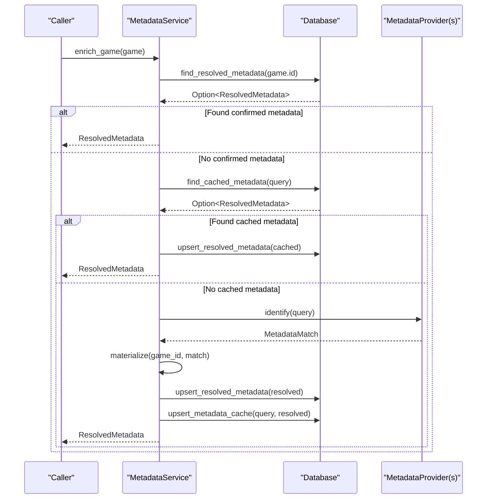
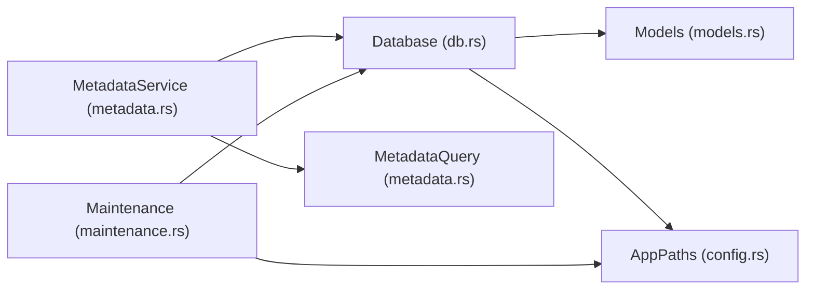

# Data Operations

<cite>
**Referenced Files in This Document**
- [db.rs](file://src/db.rs)
- [models.rs](file://src/models.rs)
- [metadata.rs](file://src/metadata.rs)
- [config.rs](file://src/config.rs)
- [maintenance.rs](file://src/maintenance.rs)
</cite>

## Table of Contents
1. [Introduction](#introduction)
2. [Project Structure](#project-structure)
3. [Core Components](#core-components)
4. [Architecture Overview](#architecture-overview)
5. [Detailed Component Analysis](#detailed-component-analysis)
6. [Dependency Analysis](#dependency-analysis)
7. [Performance Considerations](#performance-considerations)
8. [Troubleshooting Guide](#troubleshooting-guide)
9. [Conclusion](#conclusion)

## Introduction
This document provides comprehensive documentation for all database operation functions in Retro Launcher. It covers CRUD operations for GameEntry, metadata operations, cache operations, bulk operations, transaction handling, error management, performance characteristics, concurrency considerations, and practical usage examples. The goal is to help developers and power users understand how the application persists and retrieves game metadata, resolved metadata, and metadata cache efficiently and safely.

## Project Structure
The database layer is implemented in a dedicated module with supporting models and metadata services. The configuration module defines the database file path and related directories. Maintenance utilities demonstrate how database operations are used for system repair and cleanup.

```mermaid
graph TB
subgraph "Database Layer"
DB["Database (db.rs)"]
Games["games table"]
ResMeta["resolved_metadata table"]
MetaCache["metadata_cache table"]
SchemaMeta["schema_meta table"]
end
subgraph "Models"
GameEntry["GameEntry (models.rs)"]
ResolvedMetadata["ResolvedMetadata (models.rs)"]
MetadataQuery["MetadataQuery (metadata.rs)"]
end
subgraph "Services"
MetadataService["MetadataService (metadata.rs)"]
end
subgraph "Config"
AppPaths["AppPaths (config.rs)"]
end
subgraph "Maintenance"
Maintenance["Maintenance Actions (maintenance.rs)"]
end
DB --> Games
DB --> ResMeta
DB --> MetaCache
DB --> SchemaMeta
MetadataService --> DB
MetadataService --> MetadataQuery
MetadataService --> ResolvedMetadata
DB --> GameEntry
DB --> ResolvedMetadata
Maintenance --> DB
Maintenance --> AppPaths
```

**Diagram sources**
- [db.rs:48-117](file://src/db.rs#L48-L117)
- [models.rs:256-351](file://src/models.rs#L256-L351)
- [metadata.rs:15-36](file://src/metadata.rs#L15-L36)
- [config.rs:10-17](file://src/config.rs#L10-L17)
- [maintenance.rs:28-88](file://src/maintenance.rs#L28-L88)

**Section sources**
- [db.rs:48-117](file://src/db.rs#L48-L117)
- [models.rs:256-351](file://src/models.rs#L256-L351)
- [metadata.rs:15-36](file://src/metadata.rs#L15-L36)
- [config.rs:10-17](file://src/config.rs#L10-L17)
- [maintenance.rs:28-88](file://src/maintenance.rs#L28-L88)

## Core Components
- Database: Central SQLite wrapper managing schema initialization, migrations, and all CRUD operations.
- GameEntry: Core model representing a ROM/game entry persisted in the games table.
- ResolvedMetadata: Model for resolved metadata stored in resolved_metadata table.
- MetadataQuery: Lightweight query model used to build cache keys and drive metadata enrichment.
- MetadataService: Orchestrates metadata enrichment, caching, and artwork downloading.
- AppPaths: Defines filesystem locations including the database file path.

Key responsibilities:
- Persist and retrieve GameEntry records with upsert semantics.
- Store and manage resolved metadata per game.
- Cache metadata lookups keyed by hash/title/platform combinations.
- Bulk load games with or without metadata to avoid N+1 queries.
- Provide transaction-like behavior via atomic statements and repair routines.

**Section sources**
- [db.rs:20-46](file://src/db.rs#L20-L46)
- [models.rs:256-351](file://src/models.rs#L256-L351)
- [metadata.rs:15-36](file://src/metadata.rs#L15-L36)
- [config.rs:10-17](file://src/config.rs#L10-L17)

## Architecture Overview
The database layer encapsulates SQLite connections, maintains schema versioning, and exposes typed operations backed by SQL prepared statements. Metadata enrichment integrates with the database to cache results and avoid repeated network calls.



**Diagram sources**
- [metadata.rs:279-321](file://src/metadata.rs#L279-L321)
- [db.rs:506-541](file://src/db.rs#L506-L541)
- [db.rs:587-623](file://src/db.rs#L587-L623)

## Detailed Component Analysis

### Database Initialization and Schema
- Initializes tables: games, resolved_metadata, metadata_cache, schema_meta.
- Creates indexes on hash and title for fast lookups.
- Sets schema version atomically.

Operational notes:
- Uses a single connection per operation to keep schema operations isolated.
- Ensures idempotent creation of tables and indexes.

**Section sources**
- [db.rs:48-117](file://src/db.rs#L48-L117)

### GameEntry CRUD Operations

#### upsert_game
Purpose: Insert or update a GameEntry record with conflict resolution on id.

Behavior:
- Inserts all fields into games table.
- On conflict by id, updates all fields except hash when excluded.hash is null (preserves existing hash).
- Updates timestamps and counters atomically.

Parameters:
- game: reference to GameEntry to persist.

Return:
- Result<()> indicating success or failure.

Concurrency:
- Single-statement UPSERT with ON CONFLICT ensures atomicity for a single record.

**Section sources**
- [db.rs:625-689](file://src/db.rs#L625-L689)

#### find_by_id
Purpose: Retrieve a GameEntry by its id.

Behavior:
- Loads all games, sorts, and filters by id.
- Sorting uses the same logic as sort_games.

Parameters:
- id: string slice of the game id.

Return:
- Option<GameEntry> if found.

Notes:
- This loads all games into memory; consider find_by_hash for large libraries.

**Section sources**
- [db.rs:734-737](file://src/db.rs#L734-L737)
- [models.rs:371-385](file://src/models.rs#L371-L385)

#### find_by_hash
Purpose: Retrieve a GameEntry by its hash.

Behavior:
- First resolves the id from the hash index, then delegates to find_by_id.
- Uses indexed lookup for O(log n) access.

Parameters:
- hash: string slice of the hash.

Return:
- Option<GameEntry>.

**Section sources**
- [db.rs:719-732](file://src/db.rs#L719-L732)

#### remove_game
Purpose: Delete a GameEntry and its associated resolved metadata.

Behavior:
- Deletes from games by id.
- Deletes from resolved_metadata by game_id.

Parameters:
- id: string slice of the game id.

Return:
- Result<()>.

**Section sources**
- [db.rs:691-699](file://src/db.rs#L691-L699)

#### record_launch
Purpose: Increment play count and update last_played_at and updated_at.

Behavior:
- Atomic UPDATE sets play_count + 1, last_played_at, and updated_at.

Parameters:
- id: string slice of the game id.

Return:
- Result<()>.

**Section sources**
- [db.rs:739-746](file://src/db.rs#L739-L746)

#### set_game_emulator_kind
Purpose: Update emulator preference for a game.

Behavior:
- Atomic UPDATE of emulator_kind_json and updated_at.

Parameters:
- id: string slice of the game id.
- emulator_kind: Option<EmulatorKind>.

Return:
- Result<()>.

**Section sources**
- [db.rs:748-759](file://src/db.rs#L748-L759)

### Metadata Operations

#### upsert_resolved_metadata
Purpose: Persist resolved metadata for a game.

Behavior:
- INSERT INTO resolved_metadata with ON CONFLICT on game_id to update all fields.

Parameters:
- metadata: reference to ResolvedMetadata.

Return:
- Result<()>.

**Section sources**
- [db.rs:510-541](file://src/db.rs#L510-L541)

#### find_resolved_metadata
Purpose: Retrieve resolved metadata by game id.

Behavior:
- Builds a HashMap of all resolved metadata and removes the requested entry.

Parameters:
- game_id: string slice.

Return:
- Option<ResolvedMetadata>.

**Section sources**
- [db.rs:506-508](file://src/db.rs#L506-L508)
- [db.rs:440-504](file://src/db.rs#L440-L504)

#### transfer_resolved_metadata
Purpose: Move resolved metadata from one game id to another.

Behavior:
- Finds existing metadata, updates game_id and timestamp, upserts, then deletes old row.

Parameters:
- from_game_id: source id.
- to_game_id: destination id.

Return:
- Result<()>.

**Section sources**
- [db.rs:701-717](file://src/db.rs#L701-L717)

### Cache Operations

#### upsert_metadata_cache
Purpose: Cache resolved metadata under multiple cache keys.

Behavior:
- Generates cache keys from MetadataQuery (hash and title+platform).
- Upserts each key with all metadata fields.

Parameters:
- query: reference to MetadataQuery.
- metadata: reference to ResolvedMetadata.

Return:
- Result<()>.

**Section sources**
- [db.rs:543-585](file://src/db.rs#L543-L585)
- [db.rs:820-831](file://src/db.rs#L820-L831)

#### find_cached_metadata
Purpose: Retrieve cached metadata using generated cache keys.

Behavior:
- Iterates through cache keys and returns the first match found.
- Parses JSON fields into ResolvedMetadata.

Parameters:
- query: reference to MetadataQuery.

Return:
- Option<ResolvedMetadata>.

**Section sources**
- [db.rs:587-623](file://src/db.rs#L587-L623)
- [db.rs:820-831](file://src/db.rs#L820-L831)

### Bulk Operations

#### all_games
Purpose: Load all GameEntry records.

Behavior:
- SELECTs all fields from games table.
- Deserializes JSON fields into strongly-typed models.
- Sorts by title using sort_games.

Parameters: None.

Return:
- Result<Vec<GameEntry>>.

**Section sources**
- [db.rs:269-325](file://src/db.rs#L269-L325)
- [models.rs:371-385](file://src/models.rs#L371-L385)

#### all_games_with_metadata
Purpose: Load all games with their resolved metadata in a single JOIN.

Behavior:
- LEFT JOIN games with resolved_metadata on id = game_id.
- Returns tuples of (GameEntry, Option<ResolvedMetadata>).
- Sorts by title.

Parameters: None.

Return:
- Result<Vec<(GameEntry, Option<ResolvedMetadata>)>>.

**Section sources**
- [db.rs:329-421](file://src/db.rs#L329-L421)

#### load_games_and_metadata
Purpose: Build an in-memory map of resolved metadata for quick lookup.

Behavior:
- Delegates to all_games_with_metadata.
- Populates a Vec<GameEntry> and a HashMap<String, ResolvedMetadata>.

Parameters: None.

Return:
- Result<(Vec<GameEntry>, HashMap<String, ResolvedMetadata>)>.

**Section sources**
- [db.rs:425-438](file://src/db.rs#L425-L438)

#### all_resolved_metadata
Purpose: Load all resolved metadata into a HashMap.

Behavior:
- SELECTs all rows from resolved_metadata.
- Builds a HashMap keyed by game_id.

Parameters: None.

Return:
- Result<HashMap<String, ResolvedMetadata>>.

**Section sources**
- [db.rs:440-504](file://src/db.rs#L440-L504)

### Transaction Handling and Maintenance
- The Database uses a fresh Connection per operation to ensure isolation.
- repair_and_migrate_state performs multiple DML statements and relies on SQLite’s statement-level atomicity.
- Maintenance actions open separate connections for targeted cleanup.

Practical implications:
- Use Database methods for individual operations to keep transactions small.
- For multi-step maintenance, rely on the provided maintenance commands.

**Section sources**
- [db.rs:129-267](file://src/db.rs#L129-L267)
- [maintenance.rs:28-88](file://src/maintenance.rs#L28-L88)

### Error Management
- Uses anyhow::Result for propagating errors.
- rusqlite conversions wrap serde_json parsing errors into FromSqlConversionFailure for consistent error types.
- Optional queries return Ok(None) when no rows are found.

Common error scenarios:
- JSON deserialization failures during row mapping.
- Missing rows for optional lookups.
- Database connectivity issues.

**Section sources**
- [db.rs:440-504](file://src/db.rs#L440-L504)
- [db.rs:587-623](file://src/db.rs#L587-L623)

### Practical Usage Examples

- Upsert a game:
  - Call upsert_game with a populated GameEntry.
  - Handle Result and propagate errors.

- Find a game by hash:
  - Call find_by_hash with the hash string.
  - Use Option::is_some to branch on presence.

- Record a launch:
  - Call record_launch with the game id.
  - Verify play_count increments and timestamps update.

- Enrich metadata:
  - Use MetadataService.enrich_game(game) to resolve and cache metadata.
  - Subsequent calls will hit cache via find_cached_metadata.

- Bulk loading:
  - Use all_games_with_metadata to render lists with metadata.
  - Use load_games_and_metadata for fast metadata lookups.

Return value handling:
- All methods return Result<T>. Use Ok(value) to unwrap values and handle errors with .map_err or ? operator.

**Section sources**
- [db.rs:625-689](file://src/db.rs#L625-L689)
- [db.rs:719-732](file://src/db.rs#L719-L732)
- [db.rs:739-746](file://src/db.rs#L739-L746)
- [metadata.rs:279-321](file://src/metadata.rs#L279-L321)
- [db.rs:329-421](file://src/db.rs#L329-L421)
- [db.rs:425-438](file://src/db.rs#L425-L438)

### Concurrency Considerations
- Each Database method opens a new Connection and executes a single statement or a small batch.
- No explicit locking mechanisms are present; operations are designed to be atomic per method.
- For multi-threaded environments:
  - Prefer one Database instance per thread or guard access with a mutex if sharing a single connection.
  - Avoid concurrent writes to the same row without external synchronization.
  - Consider WAL mode for improved concurrency if needed.

Thread safety notes:
- rusqlite Connections are not thread-safe; do not share a single Connection across threads.
- The current design mitigates contention by keeping operations small and isolated.

**Section sources**
- [db.rs:44-46](file://src/db.rs#L44-L46)
- [db.rs:625-689](file://src/db.rs#L625-L689)

## Dependency Analysis
The database layer depends on models for data structures and metadata.rs for query construction. Maintenance actions depend on Database for cleanup operations.



**Diagram sources**
- [db.rs:13-16](file://src/db.rs#L13-L16)
- [metadata.rs:9-11](file://src/metadata.rs#L9-L11)
- [config.rs:10-17](file://src/config.rs#L10-L17)
- [maintenance.rs:5-6](file://src/maintenance.rs#L5-L6)

**Section sources**
- [db.rs:13-16](file://src/db.rs#L13-L16)
- [metadata.rs:9-11](file://src/metadata.rs#L9-L11)
- [config.rs:10-17](file://src/config.rs#L10-L17)
- [maintenance.rs:5-6](file://src/maintenance.rs#L5-L6)

## Performance Considerations
- Indexes:
  - games(hash) and games(title) enable fast lookups by hash and title.
  - metadata_cache(hash) and metadata_cache(normalized_title) accelerate cache hits.
- Bulk operations:
  - all_games_with_metadata uses a single JOIN to avoid N+1 queries.
  - load_games_and_metadata precomputes a HashMap for O(1) metadata lookup.
- Serialization:
  - JSON serialization/deserialization occurs in Rust; consider minimizing unnecessary conversions.
- Caching:
  - Metadata cache reduces repeated network calls and database reads.
- Time fields:
  - UTC timestamps are stored as RFC 3339 strings; parsing occurs on demand.

Optimization recommendations:
- Use find_by_hash for deduplication and fast identification.
- Prefer all_games_with_metadata for rendering lists with metadata.
- Leverage cache_keys to maximize cache hit rates.

**Section sources**
- [db.rs:77-78](file://src/db.rs#L77-L78)
- [db.rs:111-112](file://src/db.rs#L111-L112)
- [db.rs:329-421](file://src/db.rs#L329-L421)
- [db.rs:425-438](file://src/db.rs#L425-L438)
- [db.rs:820-831](file://src/db.rs#L820-L831)

## Troubleshooting Guide
Common issues and resolutions:
- JSON conversion errors:
  - Occur when serialized fields do not match expected types.
  - Validate JSON fields and ensure consistent serialization.
- Missing rows:
  - Optional lookups return Ok(None); ensure callers handle Option appropriately.
- Database path:
  - Confirm AppPaths.db_path points to a writable location.
- Repair and migration:
  - Use maintenance::Repair to fix legacy rows and normalize URLs.
  - Use maintenance::ClearMetadata to clear caches and artwork.

Diagnostic tips:
- Use all_resolved_metadata to inspect stored metadata.
- Use find_by_hash to verify hash indexing.
- Use repair_and_migrate_state to normalize inconsistent states.

**Section sources**
- [db.rs:440-504](file://src/db.rs#L440-L504)
- [db.rs:719-732](file://src/db.rs#L719-L732)
- [maintenance.rs:28-88](file://src/maintenance.rs#L28-L88)

## Conclusion
Retro Launcher’s database layer provides a robust, SQLite-backed persistence mechanism for game entries, resolved metadata, and metadata cache. The design emphasizes atomic operations, efficient lookups via indexes, and bulk-loading patterns to minimize overhead. By leveraging the provided APIs and following the usage examples, developers can implement reliable data operations with predictable performance and clear error handling.