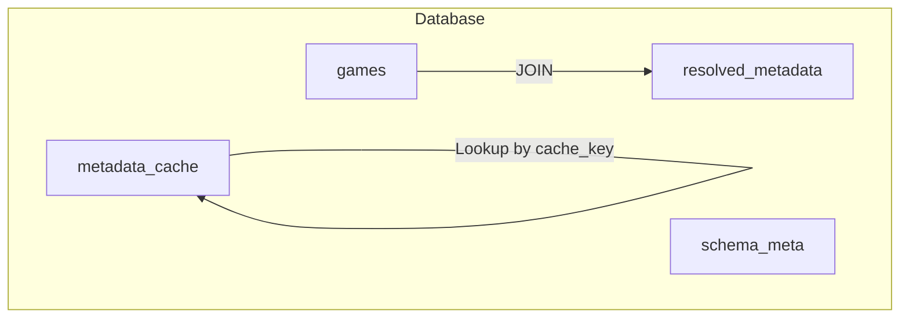
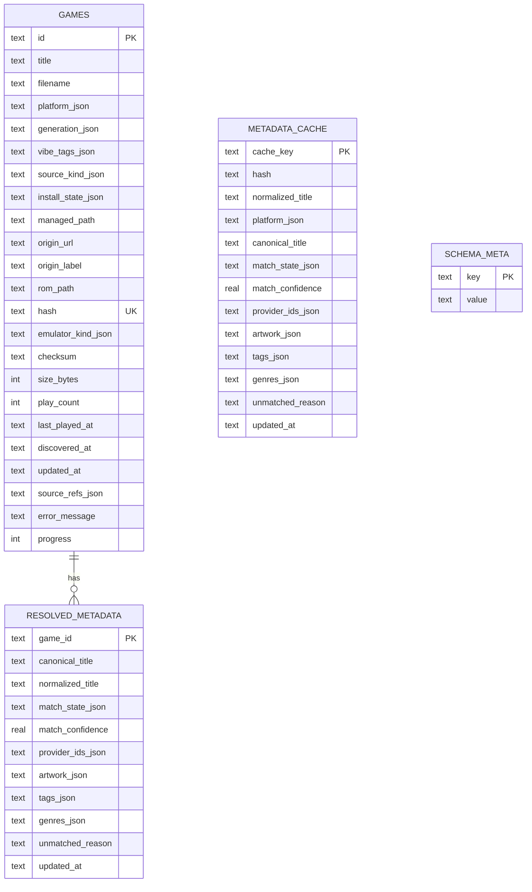
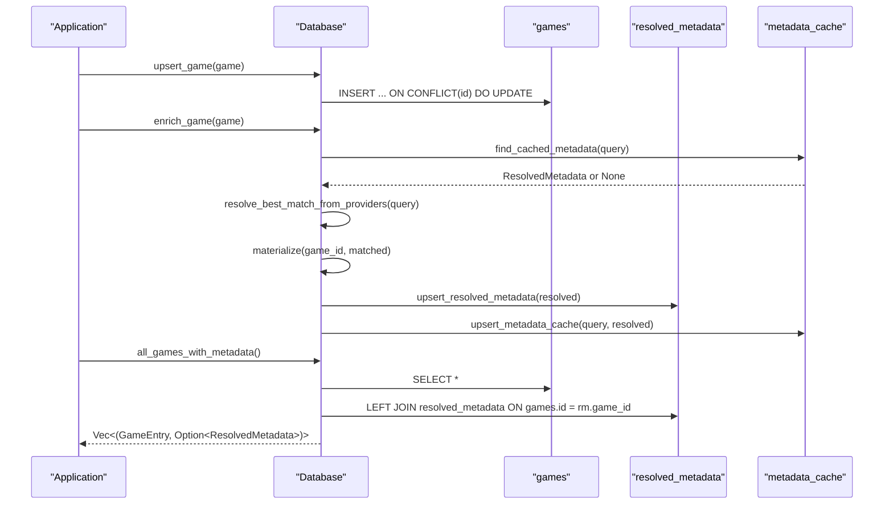
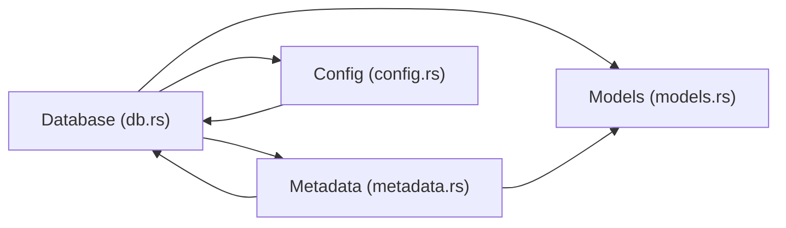

# Database Schema

<cite>
**Referenced Files in This Document**
- [db.rs](file://src/db.rs)
- [models.rs](file://src/models.rs)
- [metadata.rs](file://src/metadata.rs)
- [config.rs](file://src/config.rs)
- [starter_metadata.json](file://support/starter_metadata.json)
</cite>

## Table of Contents
1. [Introduction](#introduction)
2. [Project Structure](#project-structure)
3. [Core Components](#core-components)
4. [Architecture Overview](#architecture-overview)
5. [Detailed Component Analysis](#detailed-component-analysis)
6. [Dependency Analysis](#dependency-analysis)
7. [Performance Considerations](#performance-considerations)
8. [Troubleshooting Guide](#troubleshooting-guide)
9. [Conclusion](#conclusion)

## Introduction
This document describes the SQLite database schema used by Retro Launcher. It focuses on four core tables: games, resolved_metadata, metadata_cache, and schema_meta. For each table, we define fields, data types, constraints, indexes, and relationships. We also explain JSON serialization patterns for complex data types, validation rules, defaults, and lifecycle management. Finally, we provide diagrams that illustrate entity relationships and referential integrity.

## Project Structure
The database schema is initialized and maintained by the Database service. The schema is created on first run and includes:
- games: stores ROM/game records and metadata
- resolved_metadata: stores authoritative metadata for each game
- metadata_cache: stores precomputed metadata keyed by hash/title/platform
- schema_meta: stores schema version and other metadata

**Diagram sources**
- [db.rs:52-112](file://src/db.rs#L52-L112)

**Section sources**
- [db.rs:48-117](file://src/db.rs#L48-L117)

## Core Components

### Games Table
Purpose: Stores ROM/game entries with platform, install state, and runtime stats.

Fields and constraints:
- id: TEXT PRIMARY KEY
- title: TEXT NOT NULL
- filename: TEXT
- platform_json: TEXT NOT NULL (JSON array of Platform enum)
- generation_json: TEXT NOT NULL (JSON array of GenerationTag enum)
- vibe_tags_json: TEXT NOT NULL (JSON array of VibeTag enum)
- source_kind_json: TEXT NOT NULL (JSON enum SourceKind)
- install_state_json: TEXT NOT NULL (JSON enum InstallState)
- managed_path: TEXT
- origin_url: TEXT
- origin_label: TEXT
- rom_path: TEXT
- hash: TEXT UNIQUE
- emulator_kind_json: TEXT (JSON enum EmulatorKind)
- checksum: TEXT
- size_bytes: INTEGER
- play_count: INTEGER NOT NULL DEFAULT 0
- last_played_at: TEXT (RFC 3339)
- discovered_at: TEXT NOT NULL (RFC 3339)
- updated_at: TEXT NOT NULL (RFC 3339)
- source_refs_json: TEXT NOT NULL (JSON array of GameSourceRef)
- error_message: TEXT
- progress: INTEGER

Indexes:
- idx_games_hash on hash
- idx_games_title on title

Notes:
- JSON fields are serialized using serde_json::to_string and parsed back on read.
- play_count defaults to 0.
- discovered_at and updated_at are RFC 3339 timestamps.

**Section sources**
- [db.rs:52-76](file://src/db.rs#L52-L76)
- [db.rs:77-78](file://src/db.rs#L77-L78)
- [models.rs:256-280](file://src/models.rs#L256-L280)
- [models.rs:8-106](file://src/models.rs#L8-L106)

### Resolved Metadata Table
Purpose: Stores authoritative metadata for each game, keyed by game_id.

Fields and constraints:
- game_id: TEXT PRIMARY KEY (references games.id)
- canonical_title: TEXT NOT NULL
- normalized_title: TEXT NOT NULL
- match_state_json: TEXT NOT NULL (JSON enum MetadataMatchState)
- match_confidence: REAL NOT NULL
- provider_ids_json: TEXT NOT NULL (JSON array of strings)
- artwork_json: TEXT NOT NULL (JSON ArtworkRecord)
- tags_json: TEXT NOT NULL (JSON array of strings)
- genres_json: TEXT NOT NULL (JSON array of strings)
- unmatched_reason: TEXT
- updated_at: TEXT NOT NULL (RFC 3339)

Constraints:
- game_id is a primary key and foreign key to games.id (via application-level join in queries).

Indexes:
- Implicit index via PRIMARY KEY on game_id.

Notes:
- JSON fields are serialized using serde_json::to_string and parsed back on read.
- Updated at is RFC 3339 timestamp.

**Section sources**
- [db.rs:83-95](file://src/db.rs#L83-L95)
- [models.rs:339-351](file://src/models.rs#L339-L351)
- [models.rs:332-336](file://src/models.rs#L332-L336)
- [models.rs:204-224](file://src/models.rs#L204-L224)

### Metadata Cache Table
Purpose: Caches resolved metadata keyed by cache_key for fast lookup.

Fields and constraints:
- cache_key: TEXT PRIMARY KEY
- hash: TEXT
- normalized_title: TEXT NOT NULL
- platform_json: TEXT NOT NULL (JSON Platform)
- canonical_title: TEXT NOT NULL
- match_state_json: TEXT NOT NULL (JSON MetadataMatchState)
- match_confidence: REAL NOT NULL
- provider_ids_json: TEXT NOT NULL (JSON array of strings)
- artwork_json: TEXT NOT NULL (JSON ArtworkRecord)
- tags_json: TEXT NOT NULL (JSON array of strings)
- genres_json: TEXT NOT NULL (JSON array of strings)
- unmatched_reason: TEXT
- updated_at: TEXT NOT NULL (RFC 3339)

Indexes:
- idx_metadata_cache_hash on hash
- idx_metadata_cache_title on normalized_title

Notes:
- cache_key is generated from either a hash or a title+platform composite key.
- JSON fields are serialized using serde_json::to_string and parsed back on read.

**Section sources**
- [db.rs:96-112](file://src/db.rs#L96-L112)
- [db.rs:820-831](file://src/db.rs#L820-L831)
- [models.rs:339-351](file://src/models.rs#L339-L351)
- [models.rs:332-336](file://src/models.rs#L332-L336)
- [models.rs:204-224](file://src/models.rs#L204-L224)

### Schema Meta Table
Purpose: Stores schema version and other metadata.

Fields and constraints:
- key: TEXT PRIMARY KEY
- value: TEXT NOT NULL

Notes:
- Used to track schema version via set_schema_version.

**Section sources**
- [db.rs:79-82](file://src/db.rs#L79-L82)
- [db.rs:119-127](file://src/db.rs#L119-L127)

## Architecture Overview
The schema supports a layered approach:
- games holds the base ROM/game records and runtime stats.
- resolved_metadata holds authoritative metadata for each game.
- metadata_cache provides fast lookup of metadata using cache_key.
- schema_meta tracks schema version.

**Diagram sources**
- [db.rs:52-112](file://src/db.rs#L52-L112)

## Detailed Component Analysis

### Games Table Details
- Purpose: Central repository for ROM/game entries with platform, install state, and runtime metrics.
- JSON serialization: platform_json, generation_json, vibe_tags_json, source_kind_json, install_state_json, source_refs_json, emulator_kind_json.
- Constraints: id is PK; hash is UNIQUE; play_count defaults to 0; timestamps are RFC 3339.
- Indexes: idx_games_hash, idx_games_title.

Typical data structures stored:
- Platform enum values serialized as JSON arrays for platform_json, generation_json, vibe_tags_json.
- SourceKind and InstallState enums serialized as JSON.
- Source references serialized as JSON array of GameSourceRef.

Validation and defaults:
- NOT NULL constraints on title, platform_json, generation_json, vibe_tags_json, source_kind_json, install_state_json, discovered_at, updated_at.
- Default value for play_count is 0.
- Timestamps stored as RFC 3339 strings.

Lifecycle management:
- Upsert on conflict by id updates all fields except hash when present.
- Launch tracking increments play_count and updates timestamps.
- Removal deletes from games and resolved_metadata.

**Section sources**
- [db.rs:52-76](file://src/db.rs#L52-L76)
- [db.rs:77-78](file://src/db.rs#L77-L78)
- [db.rs:625-689](file://src/db.rs#L625-L689)
- [db.rs:739-746](file://src/db.rs#L739-L746)
- [db.rs:691-699](file://src/db.rs#L691-L699)

### Resolved Metadata Table Details
- Purpose: Authoritative metadata for each game, keyed by game_id.
- JSON serialization: match_state_json, provider_ids_json, artwork_json, tags_json, genres_json.
- Constraints: game_id is PK; updated_at is RFC 3339.
- Relationship: application-level join with games via game_id.

Typical data structures stored:
- MetadataMatchState enum serialized as JSON.
- Provider IDs serialized as JSON array of strings.
- ArtworkRecord serialized as JSON with cached_path, remote_url, source.
- Tags and genres serialized as JSON arrays of strings.

Validation and defaults:
- NOT NULL constraints on canonical_title, normalized_title, match_state_json, match_confidence, provider_ids_json, artwork_json, tags_json, genres_json, updated_at.

Lifecycle management:
- Upsert on conflict by game_id updates all fields.
- Transfer metadata between games updates game_id and updated_at.

**Section sources**
- [db.rs:83-95](file://src/db.rs#L83-L95)
- [db.rs:506-541](file://src/db.rs#L506-L541)
- [db.rs:701-717](file://src/db.rs#L701-L717)

### Metadata Cache Table Details
- Purpose: Fast lookup cache for resolved metadata using cache_key.
- JSON serialization: platform_json, match_state_json, provider_ids_json, artwork_json, tags_json, genres_json.
- Keys: cache_key is PK; hash and normalized_title indexed.
- Lookup strategy: cache_keys(query) generates keys prioritizing hash then title+platform.

Typical data structures stored:
- Platform enum serialized as JSON.
- MetadataMatchState enum serialized as JSON.
- Provider IDs, tags, genres serialized as JSON arrays.
- ArtworkRecord serialized as JSON.

Validation and defaults:
- NOT NULL constraints on normalized_title, platform_json, canonical_title, match_state_json, match_confidence, provider_ids_json, artwork_json, tags_json, genres_json, updated_at.

Lifecycle management:
- Upsert on conflict by cache_key updates all fields.
- Clear cache removes all rows from both resolved_metadata and metadata_cache.

**Section sources**
- [db.rs:96-112](file://src/db.rs#L96-L112)
- [db.rs:820-831](file://src/db.rs#L820-L831)
- [db.rs:543-585](file://src/db.rs#L543-L585)
- [db.rs:587-623](file://src/db.rs#L587-L623)
- [db.rs:761-766](file://src/db.rs#L761-L766)

### Schema Meta Table Details
- Purpose: Tracks schema version and other metadata.
- Fields: key (PK), value (NOT NULL).
- Versioning: CURRENT_SCHEMA_VERSION constant sets the schema version.

Lifecycle management:
- set_schema_version inserts/upserts schema version into schema_meta.

**Section sources**
- [db.rs:79-82](file://src/db.rs#L79-L82)
- [db.rs:119-127](file://src/db.rs#L119-L127)
- [db.rs:18](file://src/db.rs#L18)

### JSON Serialization Patterns
- Enum serialization: serde_json::to_string converts enums to JSON strings; parsing occurs on read.
- Array serialization: Vec<T> serialized as JSON arrays.
- Example enums and structs:
  - Platform, GenerationTag, VibeTag, EmulatorKind, SourceKind, InstallState, MetadataMatchState
  - GameSourceRef, ArtworkRecord, ResolvedMetadata

**Section sources**
- [models.rs:8-106](file://src/models.rs#L8-L106)
- [models.rs:248-280](file://src/models.rs#L248-L280)
- [models.rs:332-351](file://src/models.rs#L332-L351)

### Typical Data Structures Stored
- Games: id, title, filename, platform_json, generation_json, vibe_tags_json, source_kind_json, install_state_json, managed_path, origin_url, origin_label, rom_path, hash, emulator_kind_json, checksum, size_bytes, play_count, last_played_at, discovered_at, updated_at, source_refs_json, error_message, progress.
- Resolved Metadata: game_id, canonical_title, normalized_title, match_state_json, match_confidence, provider_ids_json, artwork_json, tags_json, genres_json, unmatched_reason, updated_at.
- Metadata Cache: cache_key, hash, normalized_title, platform_json, canonical_title, match_state_json, match_confidence, provider_ids_json, artwork_json, tags_json, genres_json, unmatched_reason, updated_at.

**Section sources**
- [db.rs:52-112](file://src/db.rs#L52-L112)
- [models.rs:256-280](file://src/models.rs#L256-L280)
- [models.rs:339-351](file://src/models.rs#L339-L351)

## Architecture Overview

**Diagram sources**
- [db.rs:625-689](file://src/db.rs#L625-L689)
- [db.rs:279-421](file://src/db.rs#L279-L421)
- [db.rs:543-585](file://src/db.rs#L543-L585)
- [db.rs:587-623](file://src/db.rs#L587-L623)
- [metadata.rs:279-321](file://src/metadata.rs#L279-L321)

## Detailed Component Analysis

### Games to Resolved Metadata Relationship
- Application-level join: games.id = resolved_metadata.game_id.
- Integrity: enforced by application logic; no foreign key constraint is declared.
- Use case: all_games_with_metadata performs a LEFT JOIN to fetch metadata alongside games.

**Section sources**
- [db.rs:329-421](file://src/db.rs#L329-L421)

### Metadata Cache Key Generation
- cache_keys(query) produces a list of cache_key values:
  - hash:{hash} if hash is present
  - title:{platform_json}:{normalized_title}
- Priority: hash-based key is checked first; title+platform fallback is used otherwise.

**Section sources**
- [db.rs:820-831](file://src/db.rs#L820-L831)

### Starter Metadata Integration
- Starter pack provider loads curated metadata from support/starter_metadata.json.
- Uses canonical_title, platform, aliases, tags, genres, artwork_url.
- Enables initial metadata resolution for common titles.

**Section sources**
- [metadata.rs:55-112](file://src/metadata.rs#L55-L112)
- [starter_metadata.json:1-89](file://support/starter_metadata.json#L1-L89)

### Database Initialization and Repair
- init creates tables and indexes, then sets schema version.
- repair_and_migrate_state cleans legacy rows, normalizes URLs, resets broken downloads, and resets emulator assignments when needed.

**Section sources**
- [db.rs:48-117](file://src/db.rs#L48-L117)
- [db.rs:129-267](file://src/db.rs#L129-L267)

## Dependency Analysis

**Diagram sources**
- [db.rs:13-16](file://src/db.rs#L13-L16)
- [metadata.rs:9-11](file://src/metadata.rs#L9-L11)
- [config.rs:10-17](file://src/config.rs#L10-L17)

**Section sources**
- [db.rs:13-16](file://src/db.rs#L13-L16)
- [metadata.rs:9-11](file://src/metadata.rs#L9-L11)
- [config.rs:10-17](file://src/config.rs#L10-L17)

## Performance Considerations
- Indexes:
  - games.hash and games.title improve lookups by hash and title.
  - metadata_cache.hash and metadata_cache.normalized_title optimize cache retrieval.
- JSON fields:
  - Storing complex data as JSON reduces schema complexity but increases storage and parsing overhead.
  - Consider normalization if performance becomes critical.
- Batch operations:
  - all_games_with_metadata uses a single JOIN to avoid N+1 queries.
- Cache hit rate:
  - Using cache_keys prioritizes hash-based keys for faster retrieval.

[No sources needed since this section provides general guidance]

## Troubleshooting Guide
Common issues and resolutions:
- Schema version mismatch:
  - Verify CURRENT_SCHEMA_VERSION and schema_meta.key='schema_version'.
- JSON deserialization errors:
  - Ensure enums and arrays are serialized with serde_json::to_string and parsed with serde_json::from_str.
- Missing metadata:
  - Check metadata_cache for cache_key entries; regenerate cache if needed.
- Legacy rows:
  - repair_and_migrate_state removes legacy demo rows and resets broken downloads/emulator assignments.

**Section sources**
- [db.rs:18](file://src/db.rs#L18)
- [db.rs:119-127](file://src/db.rs#L119-L127)
- [db.rs:129-267](file://src/db.rs#L129-L267)

## Conclusion
The Retro Launcher SQLite schema organizes ROM/game data in games, authoritative metadata in resolved_metadata, and a fast lookup cache in metadata_cache. JSON serialization enables flexible representation of enums and arrays. The schema supports robust lifecycle management, caching, and repair/migration workflows. Proper indexing and careful JSON handling ensure performance and reliability.