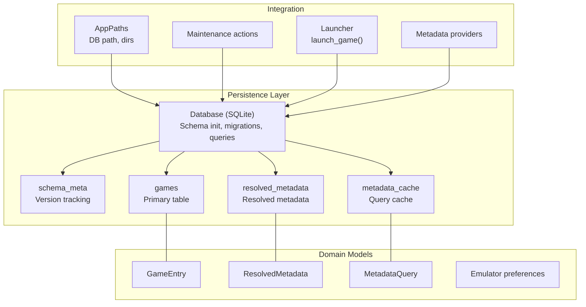
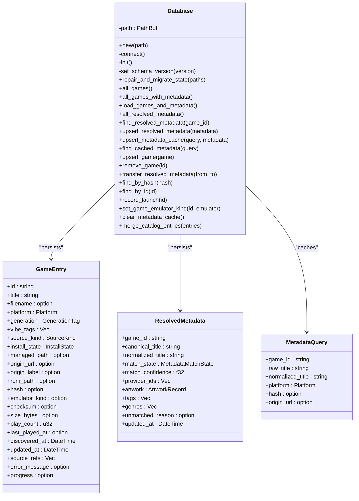
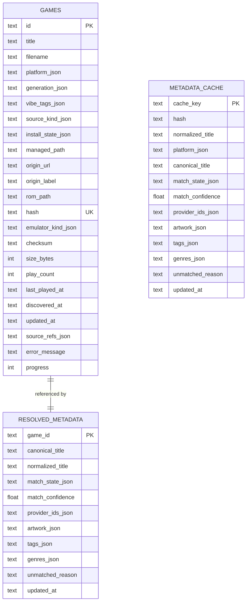
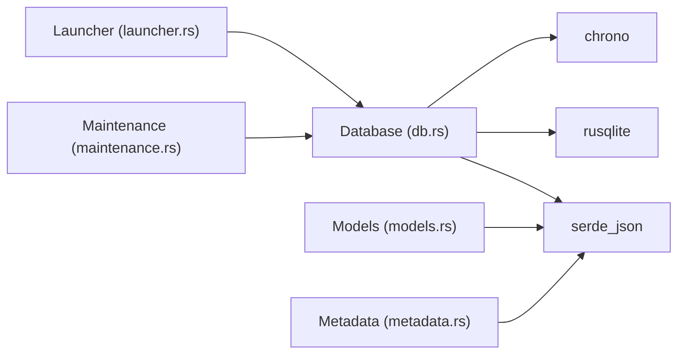
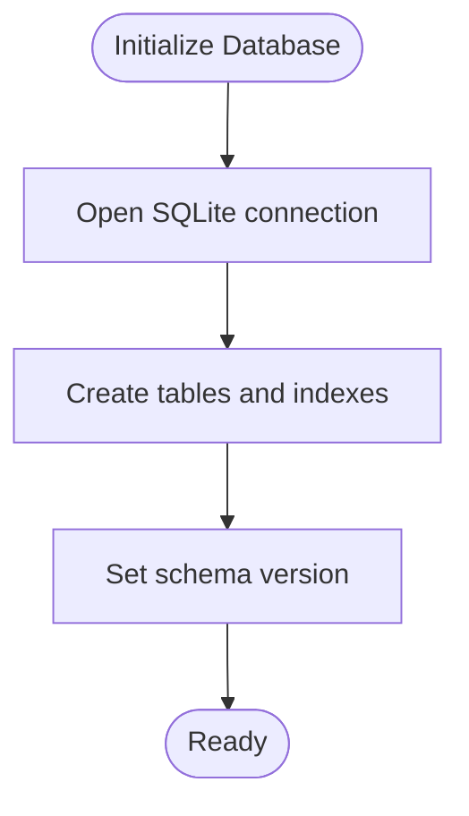
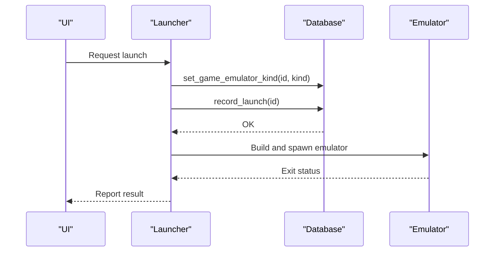

# Database System

<cite>
**Referenced Files in This Document**
- [db.rs](file://src/db.rs)
- [models.rs](file://src/models.rs)
- [config.rs](file://src/config.rs)
- [maintenance.rs](file://src/maintenance.rs)
- [metadata.rs](file://src/metadata.rs)
- [launcher.rs](file://src/launcher.rs)
- [Cargo.toml](file://Cargo.toml)
</cite>

## Table of Contents
1. [Introduction](#introduction)
2. [Project Structure](#project-structure)
3. [Core Components](#core-components)
4. [Architecture Overview](#architecture-overview)
5. [Detailed Component Analysis](#detailed-component-analysis)
6. [Dependency Analysis](#dependency-analysis)
7. [Performance Considerations](#performance-considerations)
8. [Troubleshooting Guide](#troubleshooting-guide)
9. [Conclusion](#conclusion)
10. [Appendices](#appendices)

## Introduction
This document describes the SQLite-based persistence layer used by Retro Launcher. It covers the database schema, entity relationships, indexing and constraints, data access patterns, transaction management, concurrency handling, migration and maintenance, and operational best practices. The goal is to provide a comprehensive guide for developers and operators to understand, maintain, and evolve the data model safely.

## Project Structure
The database system is implemented as a single module responsible for schema initialization, migrations, data access, and maintenance. Supporting modules define domain models, configuration, metadata providers, and launcher integration.

**Diagram sources**
- [db.rs:48-117](file://src/db.rs#L48-L117)
- [models.rs:256-280](file://src/models.rs#L256-L280)
- [models.rs:339-351](file://src/models.rs#L339-L351)
- [metadata.rs:16-23](file://src/metadata.rs#L16-L23)
- [config.rs:10-17](file://src/config.rs#L10-L17)
- [maintenance.rs:8-26](file://src/maintenance.rs#L8-L26)
- [launcher.rs:9-27](file://src/launcher.rs#L9-L27)

**Section sources**
- [db.rs:48-117](file://src/db.rs#L48-L117)
- [config.rs:34-64](file://src/config.rs#L34-L64)

## Core Components
- Database: Initializes schema, manages migrations, exposes CRUD and query APIs, and performs maintenance.
- Models: Define domain entities (GameEntry, ResolvedMetadata, MetadataQuery) and enums used in persistence.
- Maintenance: Provides repair, cache clearing, and reset operations.
- Launcher: Integrates database operations during game launch (record play count and update timestamps).

Key responsibilities:
- Schema initialization and versioning via schema_meta.
- Games table storage with JSON-serialized fields for complex types.
- Resolved metadata table for matched metadata per game.
- Metadata cache table for fast query-based retrieval.
- Indexes on frequently queried columns (hash, title) and cache keys.

**Section sources**
- [db.rs:18-33](file://src/db.rs#L18-L33)
- [db.rs:48-117](file://src/db.rs#L48-L117)
- [models.rs:256-280](file://src/models.rs#L256-L280)
- [models.rs:339-351](file://src/models.rs#L339-L351)
- [metadata.rs:16-23](file://src/metadata.rs#L16-L23)
- [maintenance.rs:28-88](file://src/maintenance.rs#L28-L88)
- [launcher.rs:9-27](file://src/launcher.rs#L9-L27)

## Architecture Overview
The persistence layer uses a single SQLite file located under the application data directory. The Database struct encapsulates connection management and exposes typed methods for data access. Domain models are serialized to JSON for storage in TEXT columns, enabling flexible schema evolution.

**Diagram sources**
- [db.rs:35-818](file://src/db.rs#L35-L818)
- [models.rs:256-280](file://src/models.rs#L256-L280)
- [models.rs:339-351](file://src/models.rs#L339-L351)
- [metadata.rs:16-23](file://src/metadata.rs#L16-L23)

## Detailed Component Analysis

### Schema Definition and Constraints
Tables and indexes:
- games: Primary key id; unique hash; integer defaults for counters; JSON columns for enums/lists; indexes on hash and title.
- resolved_metadata: Primary key game_id; JSON columns for structured data; updated_at stored as text.
- metadata_cache: Primary key cache_key; composite cache keys derived from hash/title/platform; JSON columns; indexes on hash and normalized_title.
- schema_meta: Key-value table for schema versioning.

Constraints and defaults:
- play_count defaults to 0.
- discovered_at and updated_at stored as RFC 3339 text.
- UNIQUE constraint on games.hash.
- ON CONFLICT handling in UPSERT statements.

**Section sources**
- [db.rs:52-76](file://src/db.rs#L52-L76)
- [db.rs:83-95](file://src/db.rs#L83-L95)
- [db.rs:96-112](file://src/db.rs#L96-L112)
- [db.rs:119-127](file://src/db.rs#L119-L127)

### Entity Relationships
- One-to-one relationship between games and resolved_metadata via game_id.
- games may have zero or more source references (stored as JSON array).
- metadata_cache is keyed independently and does not enforce referential integrity.

**Diagram sources**
- [db.rs:52-76](file://src/db.rs#L52-L76)
- [db.rs:83-95](file://src/db.rs#L83-L95)
- [db.rs:96-112](file://src/db.rs#L96-L112)

### Data Access Patterns
- Bulk reads: all_games, all_games_with_metadata (JOIN), all_resolved_metadata.
- Upserts: upsert_game, upsert_resolved_metadata, upsert_metadata_cache.
- Single-row operations: find_by_id, find_by_hash, remove_game, transfer_resolved_metadata.
- Specialized writes: record_launch, set_game_emulator_kind.
- Catalog merge: merge_catalog_entries generates deterministic ids and inserts entries.

Concurrency and transactions:
- Each method opens a connection and executes statements; no explicit BEGIN/COMMIT blocks are used in the module. SQLite handles statement-level atomicity. For multi-statement consistency (e.g., repair_and_migrate_state), wrap operations in a transaction at the caller level if needed.

**Section sources**
- [db.rs:269-325](file://src/db.rs#L269-L325)
- [db.rs:329-421](file://src/db.rs#L329-L421)
- [db.rs:440-504](file://src/db.rs#L440-L504)
- [db.rs:625-689](file://src/db.rs#L625-L689)
- [db.rs:510-541](file://src/db.rs#L510-L541)
- [db.rs:543-585](file://src/db.rs#L543-L585)
- [db.rs:691-717](file://src/db.rs#L691-L717)
- [db.rs:719-732](file://src/db.rs#L719-L732)
- [db.rs:739-759](file://src/db.rs#L739-L759)
- [db.rs:748-759](file://src/db.rs#L748-L759)
- [db.rs:819-817](file://src/db.rs#L819-L817)

### Migration System and Versioning
- CURRENT_SCHEMA_VERSION constant defines the current schema.
- set_schema_version writes/updates schema_meta.key='schema_version' with the current version.
- repair_and_migrate_state performs data repairs and normalization; it also ensures required directories exist.

Operational note: The module sets the schema version after initialization. If future migrations are introduced, add ALTER TABLE statements and increment CURRENT_SCHEMA_VERSION, then update set_schema_version to reflect the new version.

**Section sources**
- [db.rs](file://src/db.rs#L18)
- [db.rs:119-127](file://src/db.rs#L119-L127)
- [db.rs:129-267](file://src/db.rs#L129-L267)

### Maintenance Operations
- Repair: Removes legacy rows, normalizes URLs, resets broken downloads, and resets emulator assignments when needed.
- Clear metadata cache: Deletes all rows from resolved_metadata and metadata_cache; clears artwork directory.
- Reset downloads: Removes launcher-managed downloads and associated DB rows.
- Reset all: Removes database file, downloads, and artwork cache.

These operations are exposed via maintenance actions and executed against the configured database path.

**Section sources**
- [maintenance.rs:8-26](file://src/maintenance.rs#L8-L26)
- [maintenance.rs:28-88](file://src/maintenance.rs#L28-L88)
- [db.rs:129-267](file://src/db.rs#L129-L267)
- [db.rs:761-766](file://src/db.rs#L761-L766)

### Data Validation and Integrity
- JSON serialization/deserialization for enums and lists; errors are surfaced as SQL conversion failures.
- UNIQUE constraint on games.hash prevents duplicates.
- ON CONFLICT clauses in UPSERT statements preserve existing values when appropriate (e.g., COALESCE for hash).
- Timestamps stored as RFC 3339 text; parsed on read.

**Section sources**
- [db.rs:440-504](file://src/db.rs#L440-L504)
- [db.rs:510-541](file://src/db.rs#L510-L541)
- [db.rs:543-585](file://src/db.rs#L543-L585)
- [db.rs:625-689](file://src/db.rs#L625-L689)
- [db.rs:719-732](file://src/db.rs#L719-L732)

### Indexing and Performance
- Games index on hash and title supports fast lookups by hash and sorting by title.
- Metadata cache index on hash and normalized_title accelerates query-based metadata retrieval.
- all_games_with_metadata uses a single LEFT JOIN to avoid N+1 queries.

Recommendations:
- Consider adding indexes on frequently filtered columns (e.g., install_state_json) if query patterns expand.
- Monitor query plans for large libraries; adjust indexes accordingly.

**Section sources**
- [db.rs:77-78](file://src/db.rs#L77-L78)
- [db.rs:111-112](file://src/db.rs#L111-L112)
- [db.rs:329-421](file://src/db.rs#L329-L421)

### Data Lifecycle Management
- Creation: merge_catalog_entries creates entries with default install_state based on platform and emulator availability.
- Updates: upsert_game preserves existing hash; record_launch increments counters and updates timestamps.
- Deletion: remove_game deletes both game and resolved metadata rows.
- Transfer: transfer_resolved_metadata moves metadata between game ids atomically.

**Section sources**
- [db.rs:768-817](file://src/db.rs#L768-L817)
- [db.rs:625-689](file://src/db.rs#L625-L689)
- [db.rs:739-759](file://src/db.rs#L739-L759)
- [db.rs:691-717](file://src/db.rs#L691-L717)

### Practical Examples
- Upsert a game: [upsert_game:625-689](file://src/db.rs#L625-L689)
- Retrieve all games with metadata: [all_games_with_metadata:329-421](file://src/db.rs#L329-L421)
- Cache metadata for a query: [upsert_metadata_cache:543-585](file://src/db.rs#L543-L585)
- Find cached metadata: [find_cached_metadata:587-623](file://src/db.rs#L587-L623)
- Launch a game and record stats: [launch_game:9-27](file://src/launcher.rs#L9-L27)

**Section sources**
- [db.rs:625-689](file://src/db.rs#L625-L689)
- [db.rs:329-421](file://src/db.rs#L329-L421)
- [db.rs:543-585](file://src/db.rs#L543-L585)
- [db.rs:587-623](file://src/db.rs#L587-L623)
- [launcher.rs:9-27](file://src/launcher.rs#L9-L27)

## Dependency Analysis
External dependencies relevant to persistence:
- rusqlite: SQLite binding with optional “bundled” feature.
- serde/serde_json: Serialization of domain models to/from JSON.
- chrono: DateTime serialization/deserialization for timestamps.

**Diagram sources**
- [Cargo.toml:6-24](file://Cargo.toml#L6-L24)
- [db.rs:1-16](file://src/db.rs#L1-L16)
- [models.rs:5-6](file://src/models.rs#L5-L6)
- [metadata.rs:4-11](file://src/metadata.rs#L4-L11)
- [launcher.rs:3-7](file://src/launcher.rs#L3-L7)
- [maintenance.rs:3-6](file://src/maintenance.rs#L3-L6)

**Section sources**
- [Cargo.toml:6-24](file://Cargo.toml#L6-L24)

## Performance Considerations
- Prefer bulk operations (e.g., all_games_with_metadata) to minimize round-trips.
- Use cache keys derived from hash/title/platform to reduce repeated lookups.
- Keep JSON fields concise; avoid storing redundant copies of data.
- For very large libraries, consider partitioning or additional indexes based on observed query patterns.

[No sources needed since this section provides general guidance]

## Troubleshooting Guide
Common issues and resolutions:
- JSON deserialization errors: Occur when stored JSON is malformed; inspect affected rows and re-upsert corrected data.
- Missing artwork cache: Run maintenance clear-metadata to reset cache and artwork directory.
- Broken downloads: Use repair-state to normalize URLs, reset missing payloads, and re-identify metadata.
- Stale emulator assignments: Repair will reset to preferred emulator for the platform.

Operational tips:
- Backup the SQLite file before running destructive maintenance actions.
- Verify schema version via schema_meta if migration issues arise.

**Section sources**
- [db.rs:440-504](file://src/db.rs#L440-L504)
- [maintenance.rs:28-88](file://src/maintenance.rs#L28-L88)
- [db.rs:129-267](file://src/db.rs#L129-L267)

## Conclusion
Retro Launcher’s SQLite persistence layer is designed around simplicity and flexibility. The schema uses JSON-serialized fields to represent complex types, while maintaining strong constraints (e.g., unique hash) and indexes for common queries. Maintenance routines keep the library healthy, and the API provides straightforward CRUD and caching operations. Future enhancements can extend the schema via controlled migrations and targeted indexing.

[No sources needed since this section summarizes without analyzing specific files]

## Appendices

### Appendix A: Database Initialization Flow

**Diagram sources**
- [db.rs:48-117](file://src/db.rs#L48-L117)
- [db.rs:119-127](file://src/db.rs#L119-L127)

### Appendix B: Typical Launch Sequence

**Diagram sources**
- [launcher.rs:9-27](file://src/launcher.rs#L9-L27)
- [db.rs:739-759](file://src/db.rs#L739-L759)
- [db.rs:748-759](file://src/db.rs#L748-L759)