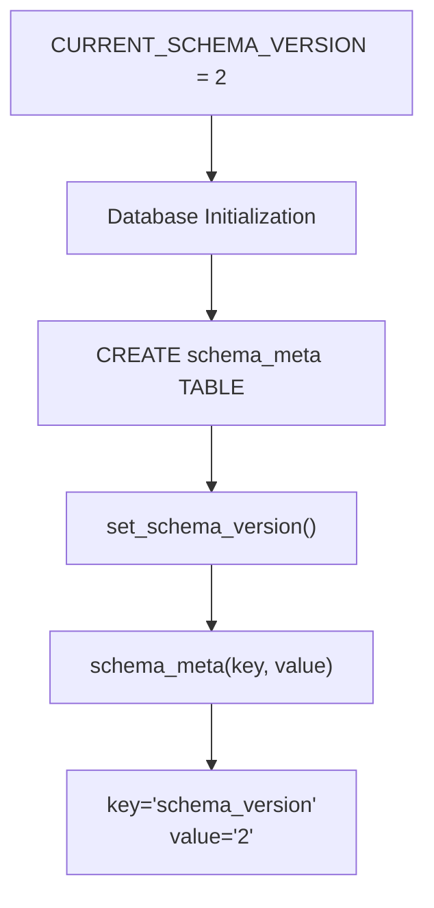
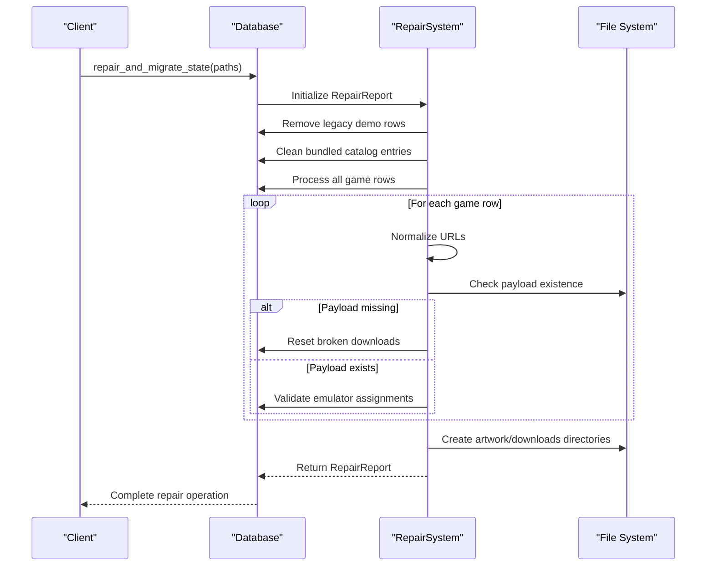
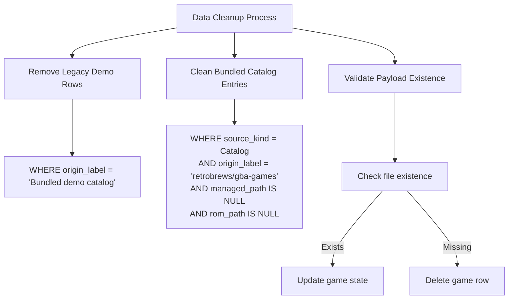
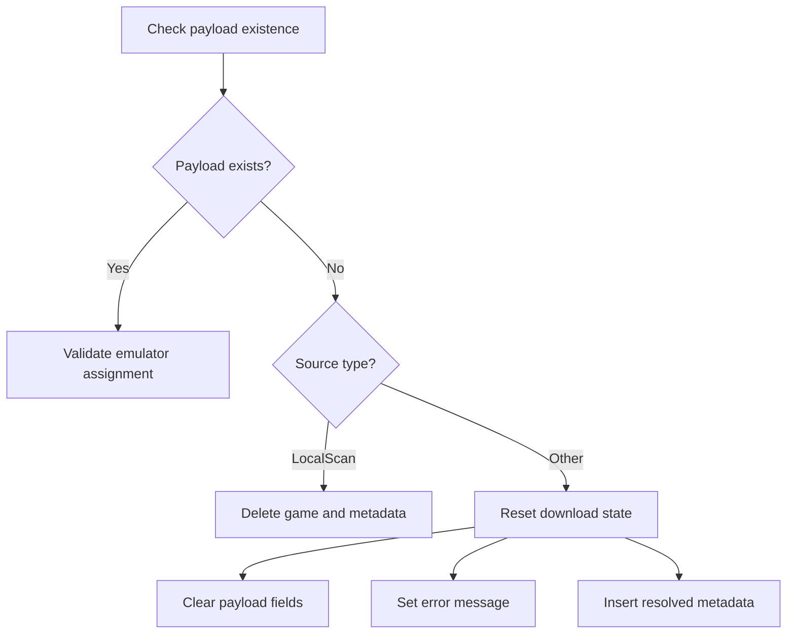

# Migration System

<cite>
**Referenced Files in This Document**
- [db.rs](file://src/db.rs)
- [maintenance.rs](file://src/maintenance.rs)
- [models.rs](file://src/models.rs)
- [config.rs](file://src/config.rs)
- [lib.rs](file://src/lib.rs)
</cite>

## Table of Contents
1. [Introduction](#introduction)
2. [Schema Version Management](#schema-version-management)
3. [Repair and Migration System](#repair-and-migration-system)
4. [Migration Process](#migration-process)
5. [Data Preservation Strategies](#data-preservation-strategies)
6. [Repair Operations](#repair-operations)
7. [Migration Scenarios](#migration-scenarios)
8. [Repair Report Generation](#repair-report-generation)
9. [Troubleshooting and Rollback Procedures](#troubleshooting-and-rollback-procedures)
10. [Manual Intervention Requirements](#manual-intervention-requirements)
11. [Conclusion](#conclusion)

## Introduction

The Retro Launcher's database migration and repair system is designed to maintain data integrity and compatibility across application versions. The system manages schema versioning through a dedicated `schema_meta` table and provides comprehensive repair capabilities to handle legacy data, normalize inconsistencies, and preserve user data during upgrades.

The migration system operates through a structured approach that combines schema version management with targeted repair operations, ensuring backward compatibility while maintaining data preservation strategies.

## Schema Version Management

The system uses a centralized approach to manage database schema versions through the `CURRENT_SCHEMA_VERSION` constant and the `schema_meta` table.

### Schema Version Constant

The current schema version is defined as a constant that serves as the authoritative source for the latest database structure:



**Diagram sources**
- [db.rs:18](file://src/db.rs#L18)
- [db.rs:119-127](file://src/db.rs#L119-L127)

### Schema Metadata Storage

The `schema_meta` table provides persistent storage for schema version information:

| Column | Type | Description |
|--------|------|-------------|
| key | TEXT (PRIMARY KEY) | Identifier for metadata entry |
| value | TEXT NOT NULL | Value associated with the key |

The table supports multiple metadata entries beyond just schema version, allowing for future extensibility.

**Section sources**
- [db.rs:79-82](file://src/db.rs#L79-L82)
- [db.rs:119-127](file://src/db.rs#L119-L127)

## Repair and Migration System

The `repair_and_migrate_state` function serves as the core of the migration system, performing comprehensive data cleanup and normalization operations.

### Function Architecture



**Diagram sources**
- [db.rs:129-267](file://src/db.rs#L129-L267)

### Repair Report Structure

The system generates detailed repair reports tracking all performed operations:

| Metric | Description | Impact |
|--------|-------------|---------|
| removed_missing_payloads | Games deleted due to missing payload files | Data cleanup |
| normalized_urls | URL normalization operations | Data consistency |
| removed_legacy_demo_rows | Legacy demo entries removed | Data cleanup |
| removed_bundled_catalog_rows | Bundled catalog entries cleaned | Data cleanup |
| reset_broken_downloads | Broken download states reset | State restoration |
| reset_emulator_assignments | Emulator assignments corrected | Compatibility |

**Section sources**
- [db.rs:25-33](file://src/db.rs#L25-L33)
- [db.rs:129-267](file://src/db.rs#L129-L267)

## Migration Process

The migration process follows a structured approach to ensure data integrity and backward compatibility.

### Current Migration State

```mermaid
flowchart TD
Start([Application Startup]) --> CheckVersion["Check CURRENT_SCHEMA_VERSION"]
CheckVersion --> CompareVersions{"Compare with stored<br/>schema_meta.version"}
CompareVersions --> |Equal| NormalOperation["Normal Operation"]
CompareVersions --> |Older| PerformMigration["Execute Migration"]
CompareVersions --> |Newer| HandleFuture["Handle Future Schema"}
PerformMigration --> Cleanup["Run repair_and_migrate_state()"]
Cleanup --> UpdateVersion["Update schema_meta.version"]
UpdateVersion --> NormalOperation
HandleFuture --> WarnUpgrade["Warn about newer version"]
WarnUpgrade --> NormalOperation
```

**Diagram sources**
- [db.rs:18](file://src/db.rs#L18)
- [db.rs:119-127](file://src/db.rs#L119-L127)

### Migration Execution Flow

The migration process executes in a specific order to maintain data consistency:

1. **Legacy Data Cleanup**: Remove obsolete entries and outdated data structures
2. **Data Normalization**: Standardize URLs, paths, and metadata formats
3. **State Validation**: Verify and correct game states and metadata
4. **Compatibility Updates**: Ensure emulator assignments match current preferences

**Section sources**
- [db.rs:129-267](file://src/db.rs#L129-L267)

## Data Preservation Strategies

The system implements several strategies to preserve user data while performing repairs and migrations.

### Selective Data Deletion

The repair system targets specific problematic data patterns rather than wholesale database deletion:



**Diagram sources**
- [db.rs:133-147](file://src/db.rs#L133-L147)

### State Preservation During Repairs

The system preserves critical game data while correcting problematic entries:

| Data Field | Preservation Strategy | Repair Action |
|------------|----------------------|---------------|
| Game ID | Always preserved | Never deleted |
| Title | Always preserved | Never modified |
| Platform | Always preserved | Never modified |
| Source References | Preserved with updates | Updated when needed |
| Play Statistics | Preserved | Never affected |
| Metadata | Preserved | Updated with new values |

**Section sources**
- [db.rs:196-240](file://src/db.rs#L196-L240)

## Repair Operations

The repair system performs six distinct categories of operations to maintain database health.

### 1. Legacy Demo Row Removal

Removes obsolete demo entries that were part of early versions:

```sql
DELETE FROM games WHERE origin_label = 'Bundled demo catalog'
```

This operation targets entries specifically labeled as legacy demos to prevent clutter in the library.

### 2. Bundled Catalog Cleanup

Removes outdated bundled catalog entries that lack proper payload associations:

```sql
DELETE FROM games
WHERE source_kind_json = ?1
  AND origin_label = ?2
  AND managed_path IS NULL
  AND rom_path IS NULL
```

Targeting specific catalog identifiers ensures only outdated entries are removed.

### 3. URL Normalization

Standardizes download URLs to ensure consistent formatting and compatibility:

```rust
let normalized = catalog::normalize_download_url(&url);
if normalized != url {
    conn.execute(
        "UPDATE games SET origin_url = ?2 WHERE id = ?1",
        params![id, normalized],
    )?;
}
```

This operation maintains URL functionality while improving consistency.

### 4. Missing Payload Handling

Addresses games with missing physical payload files:



**Diagram sources**
- [db.rs:196-240](file://src/db.rs#L196-L240)

### 5. Emulator Assignment Reset

Corrects incompatible emulator assignments based on platform compatibility:

```rust
let platform = serde_json::from_str(&platform_json)?;
let preferred = crate::models::default_emulator_for(platform);
let supported = emulator::emulators_for_platform(platform);
let should_reset = !supported.contains(&emulator_kind) || 
                  (supported.len() > 1 && Some(emulator_kind) != preferred);
```

This ensures games are assigned to compatible emulators based on platform requirements.

### 6. Directory Creation

Ensures necessary directories exist for proper operation:

```rust
fs::create_dir_all(paths.data_dir.join("artwork"))?;
fs::create_dir_all(&paths.downloads_dir)?;
```

**Section sources**
- [db.rs:129-267](file://src/db.rs#L129-L267)

## Migration Scenarios

The system handles various migration scenarios that commonly occur during application upgrades.

### Scenario 1: Legacy Data Migration

**Problem**: Old demo entries and bundled catalog data
**Solution**: Automated removal of obsolete entries
**Impact**: Reduced database size, improved performance

### Scenario 2: URL Format Changes

**Problem**: Inconsistent URL formats affecting downloads
**Solution**: Automatic URL normalization
**Impact**: Improved download reliability

### Scenario 3: Payload Integrity Issues

**Problem**: Games with missing ROM files or corrupted metadata
**Solution**: Selective cleanup and state reset
**Impact**: Maintained library integrity

### Scenario 4: Emulator Compatibility

**Problem**: Games assigned to incompatible emulators
**Solution**: Automatic emulator assignment correction
**Impact**: Improved launch compatibility

**Section sources**
- [db.rs:129-267](file://src/db.rs#L129-L267)

## Repair Report Generation

The system provides comprehensive reporting of all repair operations performed.

### Report Structure

The `RepairReport` struct tracks all repair activities:

| Field | Purpose | Example Output |
|-------|---------|----------------|
| removed_missing_payloads | Count of deleted games | "removed_missing_payloads=3" |
| normalized_urls | URL normalization count | "normalized_urls=15" |
| removed_legacy_demo_rows | Legacy demo cleanup | "removed_legacy_demo_rows=2" |
| removed_bundled_catalog_rows | Catalog cleanup | "removed_bundled_catalog_rows=1" |
| reset_broken_downloads | State resets | "reset_broken_downloads=8" |
| reset_emulator_assignments | Emulator corrections | "reset_emulator_assignments=5" |

### Report Formatting

The system formats repair reports as human-readable strings:

```rust
format!(
    "repair complete: removed_missing_payloads={} normalized_urls={} removed_legacy_demo_rows={} reset_broken_downloads={} reset_emulator_assignments={}",
    report.removed_missing_payloads,
    report.normalized_urls,
    report.removed_legacy_demo_rows,
    report.reset_broken_downloads,
    report.reset_emulator_assignments
)
```

**Section sources**
- [db.rs:25-33](file://src/db.rs#L25-L33)
- [maintenance.rs:90-100](file://src/maintenance.rs#L90-L100)

## Troubleshooting and Rollback Procedures

### Common Issues and Solutions

| Issue | Symptoms | Solution |
|-------|----------|----------|
| Migration fails | Application crashes on startup | Manual database backup, restore from backup |
| Repair removes wrong data | Important games disappear | Check repair report, restore from backup |
| URL normalization errors | Download failures | Manually update URLs in database |
| Emulator assignment problems | Games won't launch | Reset emulator assignment manually |

### Rollback Procedures

Since the current implementation focuses on data cleanup rather than destructive schema changes, rollback procedures are primarily manual:

1. **Backup Creation**: Create SQLite database backup before running repairs
2. **Selective Restoration**: Restore specific tables or records as needed
3. **Manual Cleanup**: Use SQL commands to revert specific changes

### Prevention Strategies

- Regular database backups before major updates
- Review repair reports before running maintenance operations
- Test repairs on copies of production databases first

**Section sources**
- [maintenance.rs:28-88](file://src/maintenance.rs#L28-L88)

## Manual Intervention Requirements

### When Manual Intervention Is Needed

Several scenarios require manual user intervention:

1. **Critical Data Preservation**: Users may need to decide whether to keep or remove specific game entries
2. **Custom Emulator Configurations**: Advanced users may need to adjust emulator preferences
3. **Network Issues**: Download failures may require manual URL updates
4. **File System Problems**: Disk space or permission issues affecting payload files

### Manual Operations

Common manual interventions include:

- **Database Queries**: Direct SQL operations for specific data corrections
- **File Management**: Manual ROM file organization and verification
- **Configuration Adjustments**: Custom emulator preferences and paths
- **Metadata Updates**: Manual metadata correction for specific games

### Best Practices

- Always backup databases before manual operations
- Document changes made during manual interventions
- Test changes on non-production databases first
- Keep detailed logs of all manual operations

**Section sources**
- [maintenance.rs:28-88](file://src/maintenance.rs#L28-L88)

## Conclusion

The Retro Launcher's database migration and repair system provides a robust foundation for maintaining data integrity across application versions. Through careful schema version management, comprehensive repair operations, and strategic data preservation, the system ensures smooth upgrades while minimizing data loss.

Key strengths of the system include:

- **Comprehensive Coverage**: Addresses multiple types of data issues
- **Data Preservation**: Minimizes accidental data loss through selective operations
- **Transparency**: Provides detailed reporting of all changes made
- **Extensibility**: Designed to accommodate future migration needs

The system successfully balances automated maintenance with user control, providing both convenience and safety for users upgrading their Retro Launcher installations.