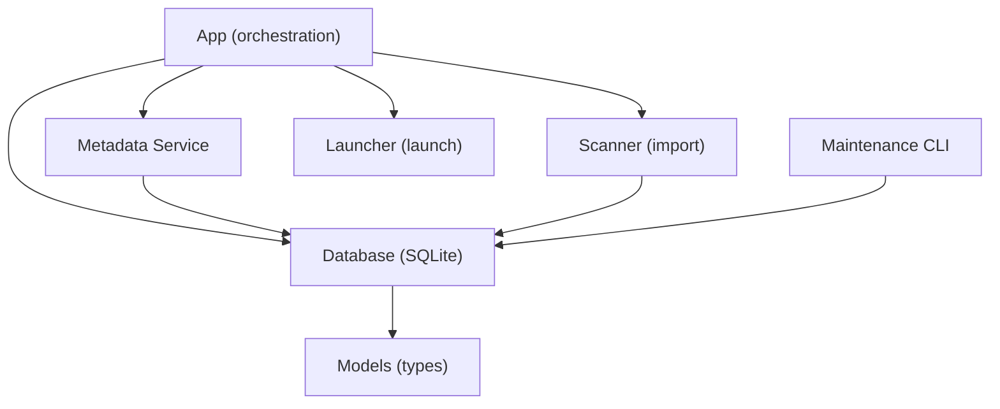
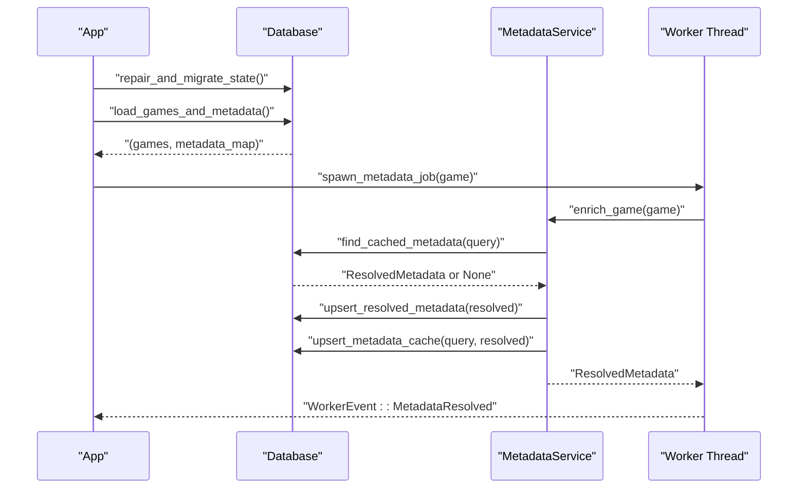
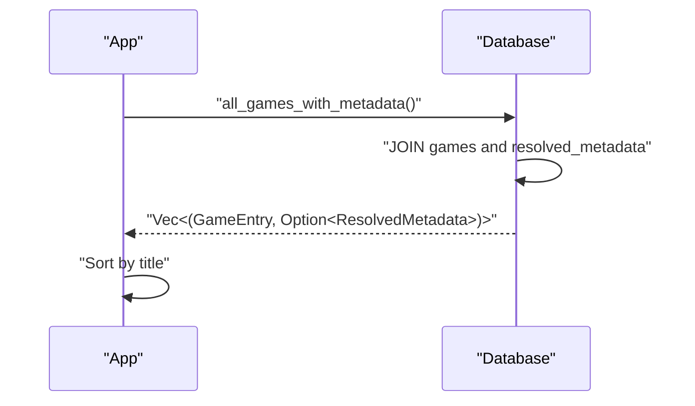
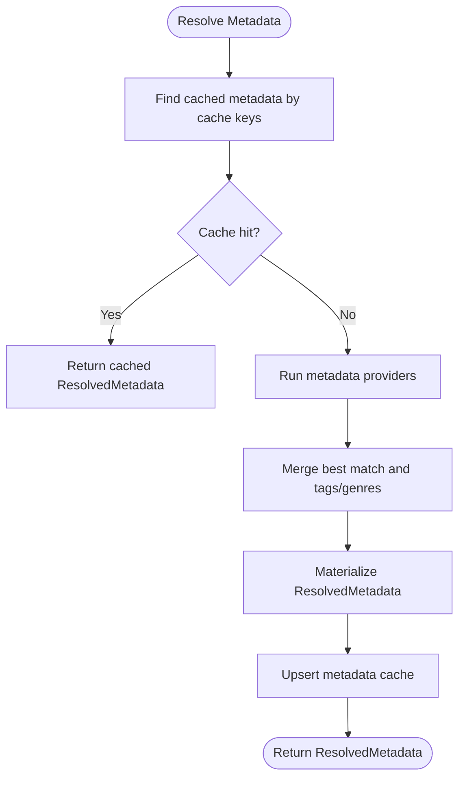
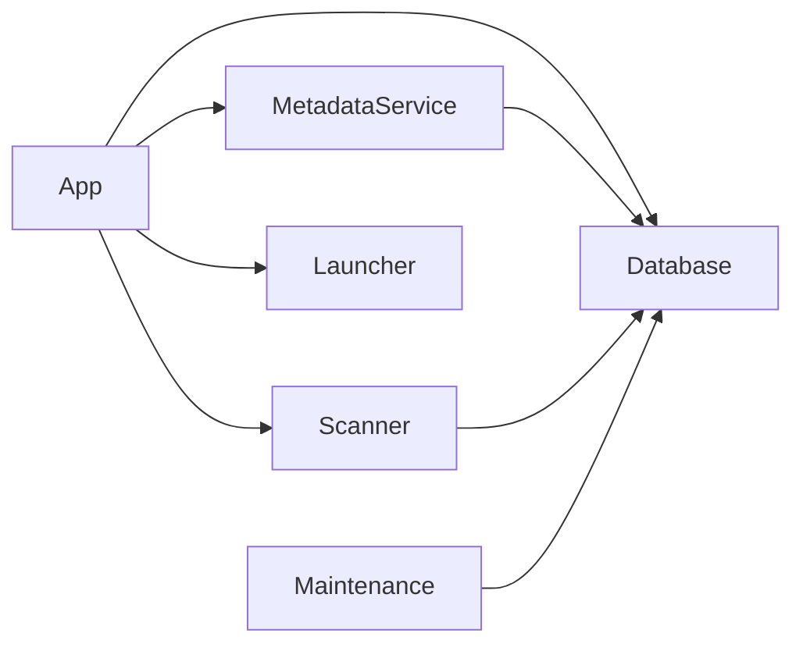

# Performance Optimization

<cite>
**Referenced Files in This Document**
- [db.rs](file://src/db.rs)
- [models.rs](file://src/models.rs)
- [metadata.rs](file://src/metadata.rs)
- [maintenance.rs](file://src/maintenance.rs)
- [scanner.rs](file://src/scanner.rs)
- [launcher.rs](file://src/launcher.rs)
- [app/mod.rs](file://src/app/mod.rs)
- [config.rs](file://src/config.rs)
</cite>

## Table of Contents
1. [Introduction](#introduction)
2. [Project Structure](#project-structure)
3. [Core Components](#core-components)
4. [Architecture Overview](#architecture-overview)
5. [Detailed Component Analysis](#detailed-component-analysis)
6. [Dependency Analysis](#dependency-analysis)
7. [Performance Considerations](#performance-considerations)
8. [Troubleshooting Guide](#troubleshooting-guide)
9. [Conclusion](#conclusion)

## Introduction
This document provides a comprehensive guide to database performance optimization strategies implemented in Retro Launcher. It focuses on indexing strategies, query optimization to avoid N+1 problems, caching mechanisms for metadata, connection and transaction management, batch operations, performance monitoring, maintenance scheduling, storage optimization, and memory usage patterns for large game libraries.

## Project Structure
Retro Launcher organizes database logic in a dedicated module with supporting modules for models, metadata enrichment, scanning, launching, and application orchestration. The database module centralizes SQLite schema creation, indexes, and query patterns. The application module orchestrates startup, loads data efficiently, and coordinates worker threads for metadata enrichment.

**Diagram sources**
- [app/mod.rs:125-170](file://src/app/mod.rs#L125-L170)
- [db.rs:35-46](file://src/db.rs#L35-L46)
- [metadata.rs:265-277](file://src/metadata.rs#L265-L277)
- [scanner.rs:158-191](file://src/scanner.rs#L158-L191)
- [launcher.rs:9-27](file://src/launcher.rs#L9-L27)
- [maintenance.rs:28-88](file://src/maintenance.rs#L28-L88)

**Section sources**
- [app/mod.rs:125-170](file://src/app/mod.rs#L125-L170)
- [db.rs:48-117](file://src/db.rs#L48-L117)
- [config.rs:34-64](file://src/config.rs#L34-L64)

## Core Components
- Database module: Defines schema, indexes, and optimized queries for loading games with metadata in a single JOIN to prevent N+1 queries. Provides upsert operations, cache management, and maintenance routines.
- Models module: Defines core types and enums used across the application, including install states, metadata match states, and platform-specific attributes.
- Metadata module: Implements metadata providers and a service that resolves metadata for games, caches results, and manages artwork.
- Scanner module: Scans local ROM roots, computes hashes, and imports files into the database.
- Launcher module: Launches games and updates play statistics via database operations.
- Maintenance module: Offers commands to repair state, clear caches, reset downloads, and reset all.

**Section sources**
- [db.rs:48-117](file://src/db.rs#L48-L117)
- [models.rs:256-351](file://src/models.rs#L256-L351)
- [metadata.rs:237-369](file://src/metadata.rs#L237-L369)
- [scanner.rs:158-265](file://src/scanner.rs#L158-L265)
- [launcher.rs:9-27](file://src/launcher.rs#L9-L27)
- [maintenance.rs:28-88](file://src/maintenance.rs#L28-L88)

## Architecture Overview
The application initializes the database, repairs/migrates state, and loads all games with metadata in a single optimized query. Metadata enrichment runs asynchronously via worker threads, and artwork is cached locally to reduce network requests. Maintenance tasks keep the database healthy and storage tidy.

**Diagram sources**
- [app/mod.rs:127-129](file://src/app/mod.rs#L127-L129)
- [db.rs:129-267](file://src/db.rs#L129-L267)
- [db.rs:423-438](file://src/db.rs#L423-L438)
- [metadata.rs:279-321](file://src/metadata.rs#L279-L321)
- [app/workers.rs:42-57](file://src/app/workers.rs#L42-L57)

## Detailed Component Analysis

### Indexing Strategies
- Primary keys and uniqueness:
  - Games table uses a text primary key for game identifiers.
  - Hash column is declared unique to enforce uniqueness and enable fast deduplication and lookups.
- Single-column indexes:
  - Index on hash column supports fast lookups by content hash.
  - Index on title column supports fast filtering and sorting by title.
- Composite/indexed columns in cache:
  - Metadata cache table stores normalized title and platform alongside hash, enabling targeted lookups and merges.

These indexes collectively optimize:
- Deduplication during import by hash.
- Fast retrieval of games by hash.
- Efficient joins and filtering by title.
- Rapid metadata cache hits by normalized title and platform.

**Section sources**
- [db.rs:52-78](file://src/db.rs#L52-L78)
- [db.rs:96-112](file://src/db.rs#L96-L112)

### Query Optimization and N+1 Prevention
- Single-query JOIN pattern:
  - The optimized method performs a single SQL query joining games with resolved metadata, eliminating repeated per-game metadata queries.
  - Results are sorted client-side by title to maintain consistent ordering.
- Impact:
  - Prevents N+1 query problem when displaying library with metadata.
  - Reduces round-trips and CPU overhead in Rust parsing.

**Diagram sources**
- [db.rs:329-421](file://src/db.rs#L329-L421)

**Section sources**
- [db.rs:329-421](file://src/db.rs#L329-L421)

### Caching Mechanisms
- Metadata cache table:
  - Stores pre-resolved metadata keyed by cache keys derived from the query (hash, normalized title, platform).
  - Supports fast retrieval of previously resolved metadata to avoid network calls.
- Upsert and find operations:
  - Upsert inserts or updates cache rows with conflict handling.
  - Find iterates through cache keys to locate a matching cached entry.
- Artwork caching:
  - Artwork URLs are fetched and saved to the artwork directory; subsequent requests reuse cached files.

**Diagram sources**
- [metadata.rs:279-321](file://src/metadata.rs#L279-L321)
- [db.rs:543-623](file://src/db.rs#L543-L623)

**Section sources**
- [metadata.rs:237-369](file://src/metadata.rs#L237-L369)
- [db.rs:543-623](file://src/db.rs#L543-L623)

### Database Connection Pooling, Transactions, and Batch Operations
- Connection lifecycle:
  - Connections are opened per operation and closed after use, minimizing long-lived connections.
- Transaction management:
  - No explicit BEGIN/COMMIT blocks are used in the database module; operations rely on individual statements and ON CONFLICT clauses for atomicity.
- Batch operations:
  - Upsert operations for metadata cache and games use INSERT ... ON CONFLICT to perform batch-like updates efficiently without separate existence checks.

Recommendations for future enhancements:
- Wrap bulk operations in explicit transactions to reduce WAL overhead and improve throughput.
- Consider prepared statements for frequently executed queries to reduce compilation cost.

**Section sources**
- [db.rs:44-46](file://src/db.rs#L44-L46)
- [db.rs:625-689](file://src/db.rs#L625-L689)
- [db.rs:543-585](file://src/db.rs#L543-L585)

### Maintenance and Storage Optimization
- Repair and migration:
  - Removes legacy rows, normalizes URLs, resets broken downloads, and recalibrates emulator assignments.
- Clear metadata and artwork:
  - Clears resolved metadata and metadata cache, and purges artwork directory.
- Reset downloads:
  - Removes launcher-managed download rows and files.
- Reset all:
  - Deletes database and clears downloads and artwork directories.

These operations help maintain database size and performance by removing stale or broken data.

**Section sources**
- [db.rs:129-267](file://src/db.rs#L129-L267)
- [maintenance.rs:28-88](file://src/maintenance.rs#L28-L88)

### Memory Usage Patterns and Garbage Collection Considerations
- Data structures:
  - Games and metadata are loaded into memory as vectors and hash maps; sorting occurs client-side.
- Large libraries:
  - For very large libraries, consider streaming or paginating queries to reduce peak memory usage.
  - Reuse parsed JSON structures where possible to minimize allocations.
- Artwork:
  - Artwork is cached to disk; ensure cleanup routines are invoked regularly to prevent unbounded growth.

**Section sources**
- [db.rs:423-438](file://src/db.rs#L423-L438)
- [maintenance.rs:36-46](file://src/maintenance.rs#L36-L46)

## Dependency Analysis
The application exhibits clear separation of concerns:
- App orchestrates initialization, loads data, and manages worker threads.
- Database encapsulates schema, indexes, and queries.
- Metadata service depends on database for cache and resolved metadata persistence.
- Scanner and launcher depend on database for reads/writes.

**Diagram sources**
- [app/mod.rs:125-170](file://src/app/mod.rs#L125-L170)
- [metadata.rs:265-277](file://src/metadata.rs#L265-L277)
- [scanner.rs:158-191](file://src/scanner.rs#L158-L191)
- [launcher.rs:9-27](file://src/launcher.rs#L9-L27)
- [maintenance.rs:28-88](file://src/maintenance.rs#L28-L88)

**Section sources**
- [app/mod.rs:125-170](file://src/app/mod.rs#L125-L170)
- [db.rs:48-117](file://src/db.rs#L48-L117)

## Performance Considerations
- Index utilization:
  - Ensure queries filter/select by indexed columns (hash, title) to leverage indexes effectively.
- Query patterns:
  - Prefer single-query JOINs for loading games with metadata.
  - Avoid repeated per-row queries; batch where possible.
- Caching:
  - Use metadata cache to avoid redundant network calls.
  - Keep artwork cache organized and periodically prune stale entries.
- Maintenance:
  - Schedule periodic maintenance actions to keep the database compact and healthy.
- Storage:
  - Monitor database file size and log file growth; compact and vacuum as needed.
- Memory:
  - For large libraries, consider lazy loading or pagination to reduce memory footprint.

[No sources needed since this section provides general guidance]

## Troubleshooting Guide
Common issues and remedies:
- Slow library load:
  - Verify indexes exist and are being used by the query planner.
  - Confirm that metadata enrichment is performed asynchronously.
- Missing artwork:
  - Run maintenance to clear metadata cache and artwork, then trigger enrichment again.
- Stale metadata:
  - Clear metadata cache and re-run enrichment for affected games.
- Broken downloads:
  - Use reset downloads to remove launcher-managed rows and files, then re-scan or re-import.

**Section sources**
- [maintenance.rs:28-88](file://src/maintenance.rs#L28-L88)
- [metadata.rs:279-321](file://src/metadata.rs#L279-L321)

## Conclusion
Retro Launcher employs strategic indexing, a single-query JOIN pattern to prevent N+1 problems, and robust caching to minimize network requests and database overhead. Maintenance routines keep the database healthy, while clear separation of concerns enables scalable performance tuning. For very large libraries, consider transaction wrapping, streaming/pagination, and periodic compaction to sustain responsiveness.