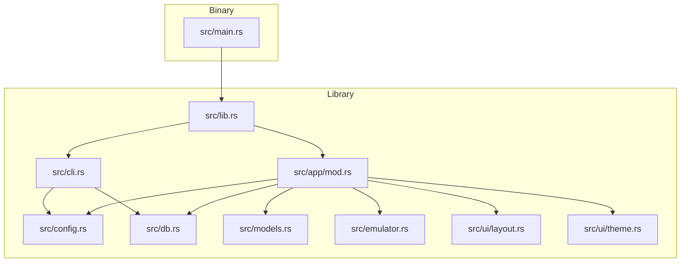
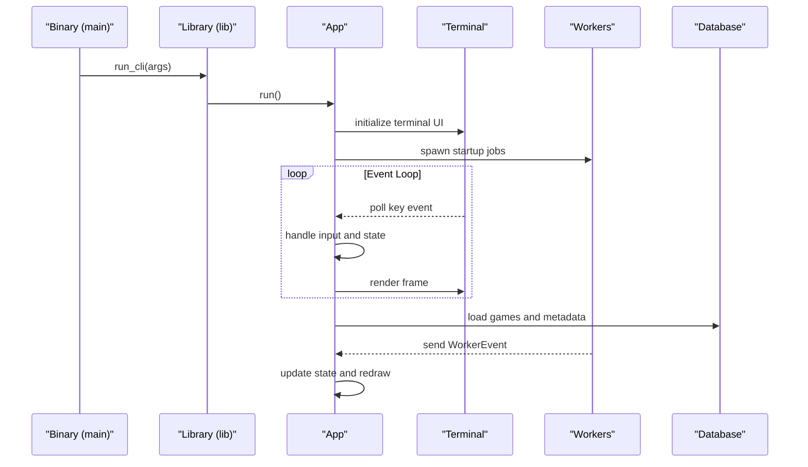
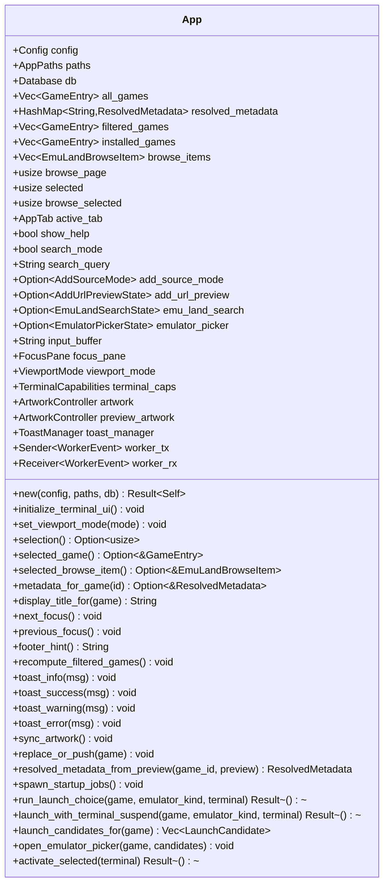
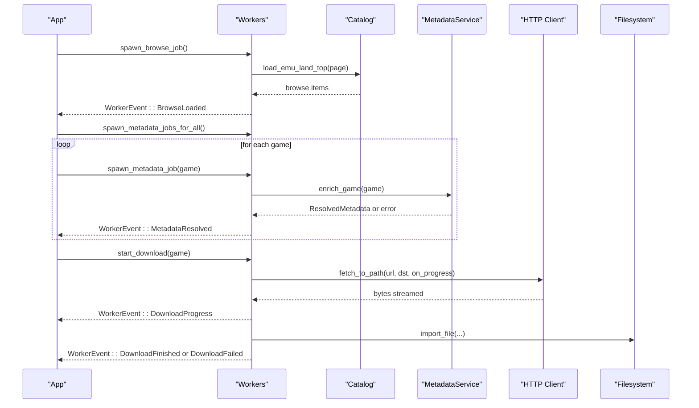
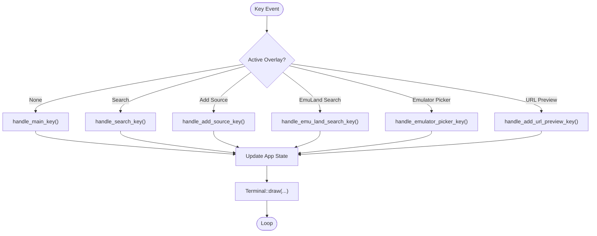
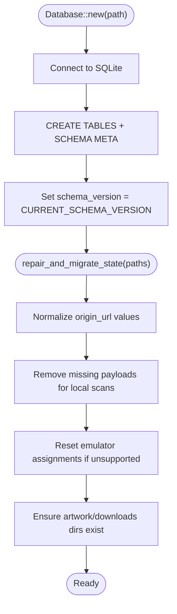
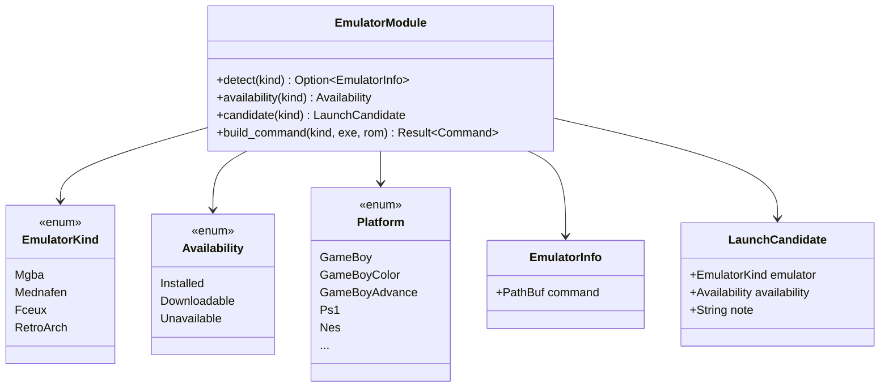
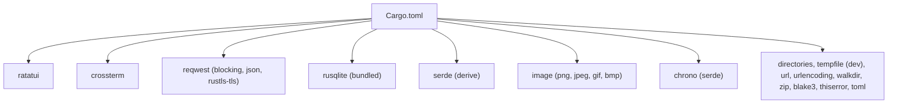

# Development Guide

<cite>
**Referenced Files in This Document**
- [Cargo.toml](file://Cargo.toml)
- [src/lib.rs](file://src/lib.rs)
- [src/main.rs](file://src/main.rs)
- [src/cli.rs](file://src/cli.rs)
- [src/app/mod.rs](file://src/app/mod.rs)
- [src/app/events.rs](file://src/app/events.rs)
- [src/app/input.rs](file://src/app/input.rs)
- [src/app/state.rs](file://src/app/state.rs)
- [src/app/workers.rs](file://src/app/workers.rs)
- [src/config.rs](file://src/config.rs)
- [src/db.rs](file://src/db.rs)
- [src/models.rs](file://src/models.rs)
- [src/emulator.rs](file://src/emulator.rs)
- [src/ui/layout.rs](file://src/ui/layout.rs)
- [src/ui/theme.rs](file://src/ui/theme.rs)
- [README.md](file://README.md)
- [.gitignore](file://.gitignore)
</cite>

## Table of Contents
1. [Introduction](#introduction)
2. [Project Structure](#project-structure)
3. [Core Components](#core-components)
4. [Architecture Overview](#architecture-overview)
5. [Detailed Component Analysis](#detailed-component-analysis)
6. [Dependency Analysis](#dependency-analysis)
7. [Performance Considerations](#performance-considerations)
8. [Testing Strategy](#testing-strategy)
9. [Contribution Guidelines](#contribution-guidelines)
10. [Debugging and Profiling](#debugging-and-profiling)
11. [Continuous Integration and Releases](#continuous-integration-and-releases)
12. [Troubleshooting Guide](#troubleshooting-guide)
13. [Conclusion](#conclusion)

## Introduction
This guide provides comprehensive development documentation for contributors and maintainers working on the retro-launcher Rust project. It covers environment setup, build and test processes, code organization, contribution workflows, debugging and profiling, CI/CD expectations, and release procedures. The project is a terminal-based retro gaming launcher with a TUI built on Ratatui, SQLite-backed persistence, and a modular Rust architecture.

## Project Structure
The repository follows a conventional Rust crate layout with a binary entry point and a library exposing public APIs. Key modules include CLI handling, application orchestration, UI, configuration, database, models, emulators, and scanning/metadata utilities.



**Diagram sources**
- [src/main.rs:1-12](file://src/main.rs#L1-L12)
- [src/lib.rs:1-45](file://src/lib.rs#L1-L45)
- [src/cli.rs:1-185](file://src/cli.rs#L1-L185)
- [src/app/mod.rs:1-120](file://src/app/mod.rs#L1-L120)
- [src/config.rs:1-114](file://src/config.rs#L1-L114)
- [src/db.rs:1-120](file://src/db.rs#L1-L120)
- [src/models.rs:1-120](file://src/models.rs#L1-L120)
- [src/emulator.rs:1-120](file://src/emulator.rs#L1-L120)
- [src/ui/layout.rs:1-109](file://src/ui/layout.rs#L1-L109)
- [src/ui/theme.rs:1-122](file://src/ui/theme.rs#L1-L122)

**Section sources**
- [Cargo.toml:1-35](file://Cargo.toml#L1-L35)
- [src/lib.rs:1-45](file://src/lib.rs#L1-L45)
- [src/main.rs:1-12](file://src/main.rs#L1-L12)

## Core Components
- CLI layer: Command-line interface using clap with derive macros for declarative command definitions. See [src/cli.rs:1-185](file://src/cli.rs#L1-L185).
- Application orchestration: The App struct coordinates state, rendering, events, and worker threads. See [src/app/mod.rs:94-170](file://src/app/mod.rs#L94-L170).
- Configuration and paths: AppPaths and Config manage OS-specific directories and TOML-based configuration. See [src/config.rs:10-114](file://src/config.rs#L10-L114).
- Database: SQLite-backed persistence with migrations, repair routines, and optimized queries. See [src/db.rs:20-120](file://src/db.rs#L20-L120).
- Models: Domain types for platforms, emulators, install states, and entities. See [src/models.rs:8-280](file://src/models.rs#L8-L280).
- Emulators: Detection, availability, and launch command construction. See [src/emulator.rs:8-127](file://src/emulator.rs#L8-L127).
- UI: Layout utilities and theme-aware rendering helpers. See [src/ui/layout.rs:12-109](file://src/ui/layout.rs#L12-L109) and [src/ui/theme.rs:11-122](file://src/ui/theme.rs#L11-L122).
- CLI entry points: Binary entry and command dispatch. See [src/lib.rs:24-45](file://src/lib.rs#L24-L45) and [src/main.rs:1-12](file://src/main.rs#L1-L12).

**Section sources**
- [src/cli.rs:1-185](file://src/cli.rs#L1-L185)
- [src/app/mod.rs:94-170](file://src/app/mod.rs#L94-L170)
- [src/config.rs:10-114](file://src/config.rs#L10-L114)
- [src/db.rs:20-120](file://src/db.rs#L20-L120)
- [src/models.rs:8-280](file://src/models.rs#L8-L280)
- [src/emulator.rs:8-127](file://src/emulator.rs#L8-L127)
- [src/ui/layout.rs:12-109](file://src/ui/layout.rs#L12-L109)
- [src/ui/theme.rs:11-122](file://src/ui/theme.rs#L11-L122)
- [src/lib.rs:24-45](file://src/lib.rs#L24-L45)
- [src/main.rs:1-12](file://src/main.rs#L1-L12)

## Architecture Overview
The application uses a reactive TUI loop driven by Crossterm events, with background worker threads communicating via channels. The App orchestrates rendering, input handling, and state transitions, delegating heavy work to specialized modules.



**Diagram sources**
- [src/main.rs:1-9](file://src/main.rs#L1-L9)
- [src/lib.rs:20-39](file://src/lib.rs#L20-L39)
- [src/app/mod.rs:553-621](file://src/app/mod.rs#L553-L621)
- [src/app/events.rs:24-98](file://src/app/events.rs#L24-L98)
- [src/db.rs:327-345](file://src/db.rs#L327-L345)

## Detailed Component Analysis

### Application Orchestration (App)
The App struct encapsulates configuration, paths, database connection, UI state, artwork controllers, and worker channels. It manages filtering, selection, artwork synchronization, and launch flows.



**Diagram sources**
- [src/app/mod.rs:94-551](file://src/app/mod.rs#L94-L551)

**Section sources**
- [src/app/mod.rs:94-551](file://src/app/mod.rs#L94-L551)

### Worker Thread Management
Background workers handle scanning, metadata enrichment, and downloads. They communicate via a channel to the main App thread.



**Diagram sources**
- [src/app/workers.rs:21-163](file://src/app/workers.rs#L21-L163)
- [src/app/events.rs:24-98](file://src/app/events.rs#L24-L98)
- [src/app/mod.rs:623-686](file://src/app/mod.rs#L623-L686)

**Section sources**
- [src/app/workers.rs:21-163](file://src/app/workers.rs#L21-L163)
- [src/app/events.rs:24-98](file://src/app/events.rs#L24-L98)
- [src/app/mod.rs:623-686](file://src/app/mod.rs#L623-L686)

### Input Handling and Navigation
Keyboard input is routed through distinct handlers depending on active overlays and modes.



**Diagram sources**
- [src/app/input.rs:14-346](file://src/app/input.rs#L14-L346)

**Section sources**
- [src/app/input.rs:14-346](file://src/app/input.rs#L14-L346)

### Database Schema and Repair
The database initializes tables and indices, enforces schema versioning, and runs repair/migration logic on startup.



**Diagram sources**
- [src/db.rs:35-120](file://src/db.rs#L35-L120)
- [src/db.rs:129-267](file://src/db.rs#L129-L267)

**Section sources**
- [src/db.rs:35-120](file://src/db.rs#L35-L120)
- [src/db.rs:129-267](file://src/db.rs#L129-L267)

### Emulator Availability and Launch
Emulator detection and launch candidate computation inform the UI and launch flow.



**Diagram sources**
- [src/emulator.rs:8-127](file://src/emulator.rs#L8-L127)
- [src/models.rs:150-173](file://src/models.rs#L150-L173)

**Section sources**
- [src/emulator.rs:8-127](file://src/emulator.rs#L8-L127)
- [src/models.rs:150-173](file://src/models.rs#L150-L173)

## Dependency Analysis
External dependencies are declared in Cargo.toml. The project integrates terminal UI (Ratatui), cross-platform terminal events (Crossterm), networking (reqwest with rustls), image handling (image), SQL (rusqlite with bundled), serialization (serde), and others.



**Diagram sources**
- [Cargo.toml:6-28](file://Cargo.toml#L6-L28)

**Section sources**
- [Cargo.toml:6-28](file://Cargo.toml#L6-L28)

## Performance Considerations
- Background workers offload blocking operations (network, filesystem) to keep the UI responsive.
- Database queries use JOINs and indexes to minimize latency when loading games and metadata.
- Artwork caching avoids repeated network fetches during browsing and selection.
- Sorting and filtering operate on in-memory collections; consider pagination for very large libraries.

[No sources needed since this section provides general guidance]

## Testing Strategy
- Unit tests are integrated within modules (e.g., [src/app/mod.rs:688-800](file://src/app/mod.rs#L688-L800), [src/models.rs:387-415](file://src/models.rs#L387-L415)).
- Dev dependencies include a temporary directory utility for isolated tests.
- Example tests cover:
  - File URL downloads and HTML rejection.
  - Library filtering by search query.
  - Focus cycling across tabs and panes.
  - Platform-to-emulator defaults and candidate enumeration.

Recommended practices:
- Add tests for new worker flows (download, metadata enrichment).
- Mock external services where appropriate.
- Verify database migration and repair logic with representative datasets.

**Section sources**
- [src/app/mod.rs:688-800](file://src/app/mod.rs#L688-L800)
- [src/models.rs:387-415](file://src/models.rs#L387-L415)
- [Cargo.toml:26-28](file://Cargo.toml#L26-L28)

## Contribution Guidelines
- Branching: Use feature branches and rebase against main before opening PRs.
- Commits: Keep commits small and focused; include rationale in the description.
- Code style: Follow idiomatic Rust conventions; derive traits where appropriate; prefer Result/Error over panics; use anyhow for error propagation.
- Documentation: Update module docs and inline comments for significant changes.
- Tests: Add unit tests for new logic; ensure existing tests pass.
- Dependencies: Limit new dependencies; justify with a brief explanation.

[No sources needed since this section provides general guidance]

## Debugging and Profiling
Common debugging techniques:
- Logging: Use error contexts and structured errors to capture failure points (e.g., download URL resolution, checksum mismatches).
- Terminal UI: Temporarily reduce rendering complexity to isolate input handling issues.
- Database: Inspect schema_meta and table contents to verify migrations and repair steps.
- Network: Validate URLs and content-type checks to prevent HTML payloads from being treated as ROMs.

Profiling ideas:
- CPU: Use perf or similar profilers to identify hot loops in rendering or metadata enrichment.
- Memory: Monitor allocations during large scans and downloads; consider streaming writes.
- I/O: Profile SQLite write patterns and network throughput.

**Section sources**
- [src/app/mod.rs:623-686](file://src/app/mod.rs#L623-L686)
- [src/db.rs:129-267](file://src/db.rs#L129-L267)

## Continuous Integration and Releases

### Build Requirements
- Rust 1.70+ (specified in `rust-version` in Cargo.toml)
- Edition 2021

### Build Commands
```bash
# Development build
cargo build

# Release build (optimized)
cargo build --release

# Run tests
cargo test

# Check code without building
cargo check

# Lint with clippy
cargo clippy

# Format code
cargo fmt
```

### CI Checklist
- Build and test: CI should compile the project and run unit tests across targets.
- Linting: Enforce clippy and rustfmt rules.
- Verify CLI functionality: Test `--help`, `--version`, and subcommands.

### Release Process
1. Update version in `Cargo.toml`
2. Update `CHANGELOG.md` if maintained
3. Tag release: `git tag v0.1.0`
4. Build release binary: `cargo build --release`
5. Binary location: `target/release/retro-launcher`
6. Publish to crates.io (if applicable): `cargo publish`

### Distribution Methods
- **crates.io**: `cargo install retro-launcher`
- **GitHub Releases**: Attach built binaries for macOS, Linux, Windows
- **Homebrew** (macOS): Formula for easy installation
- **Source**: Clone and `cargo install --path .`

**Section sources**
- [Cargo.toml:1-35](file://Cargo.toml#L1-L35)
- [src/main.rs:1-12](file://src/main.rs#L1-L12)

## Troubleshooting Guide
- Terminal UI not rendering:
  - Ensure raw mode and alternate screen are toggled correctly around the loop.
  - Verify terminal capabilities and theme selection.
- Downloads fail or are rejected:
  - Confirm URL normalization and content-type checks.
  - Check checksum verification and payload validity.
- Missing emulators:
  - Verify PATH detection and platform-specific constraints.
- Database errors:
  - Confirm schema version and repair reports; check index usage.

**Section sources**
- [src/app/mod.rs:553-573](file://src/app/mod.rs#L553-L573)
- [src/app/mod.rs:623-686](file://src/app/mod.rs#L623-L686)
- [src/emulator.rs:27-100](file://src/emulator.rs#L27-L100)
- [src/db.rs:129-267](file://src/db.rs#L129-L267)

## Conclusion
This guide outlined the development environment, build/test processes, architecture, and operational practices for the retro-launcher. By following the contribution guidelines, leveraging the modular design, and applying the recommended debugging and performance strategies, contributors can efficiently extend functionality while maintaining reliability and user experience.