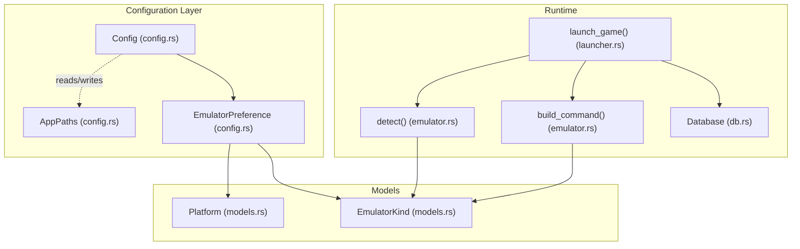
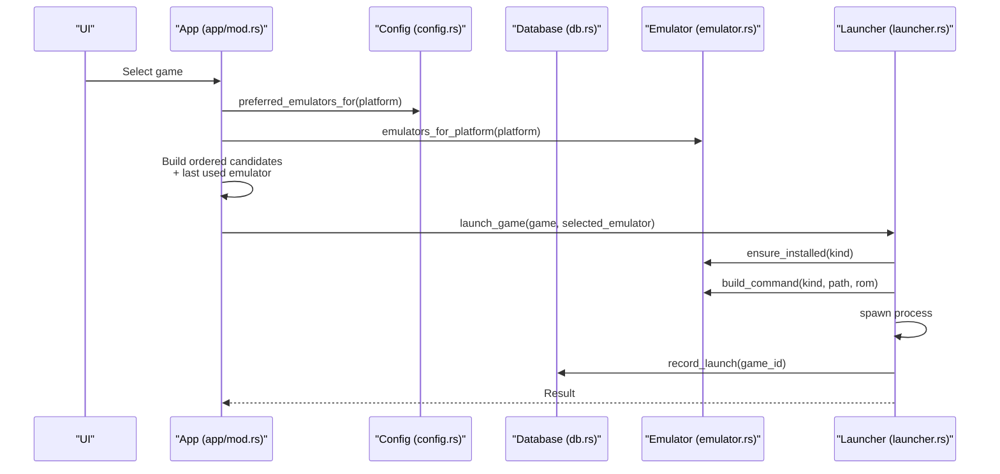
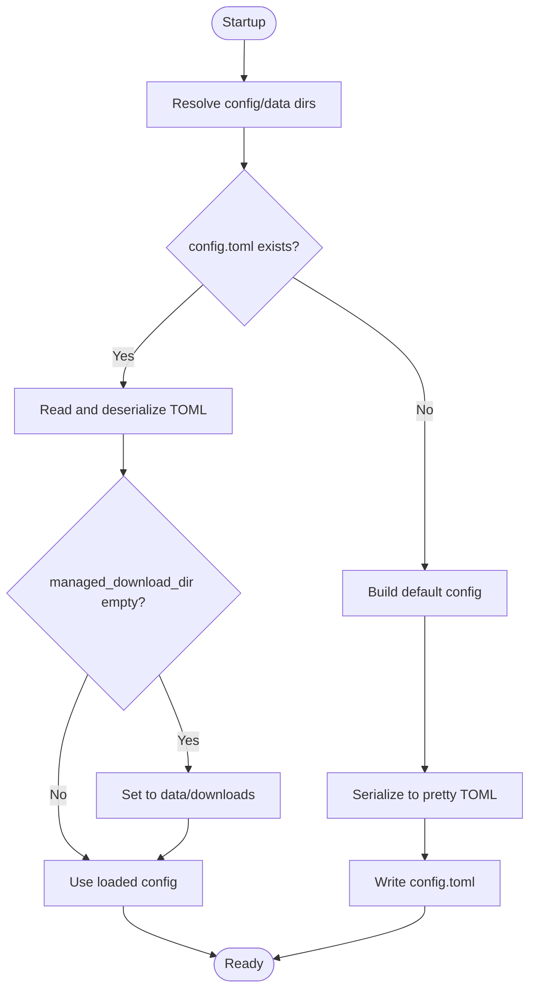
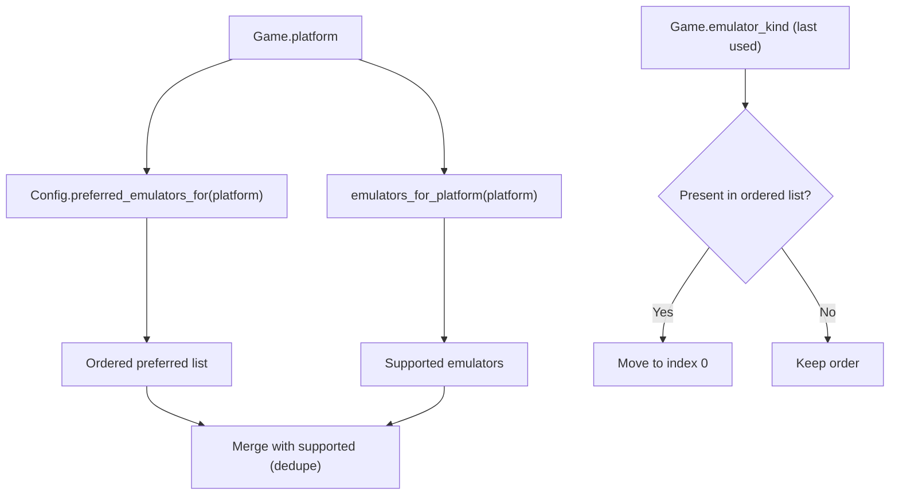
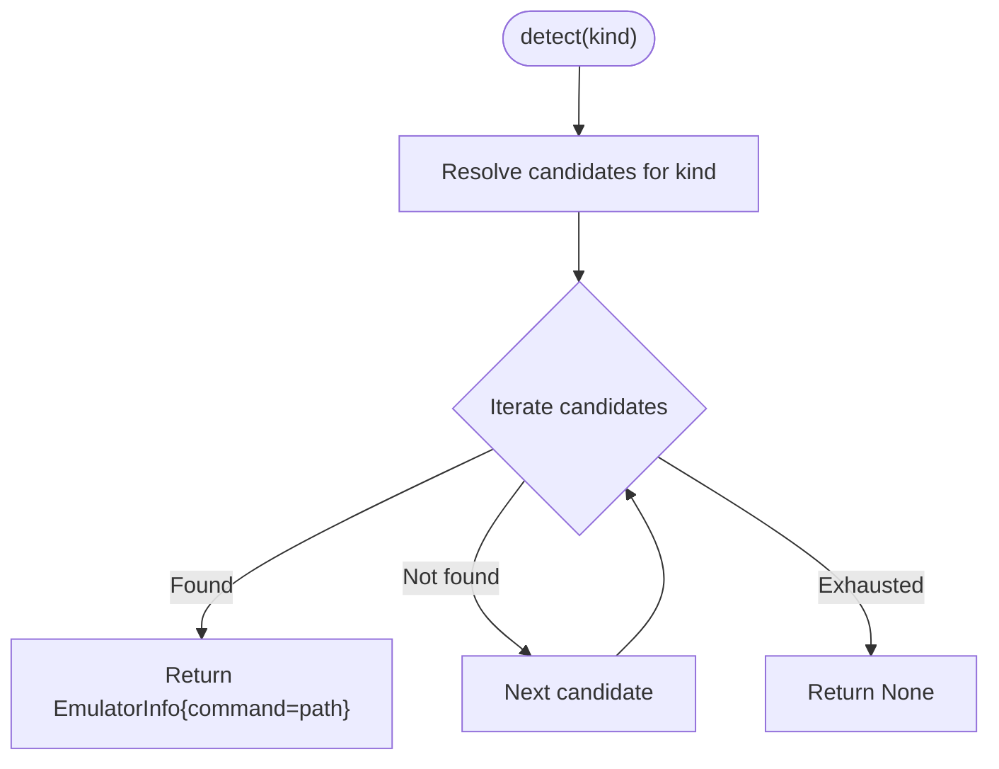
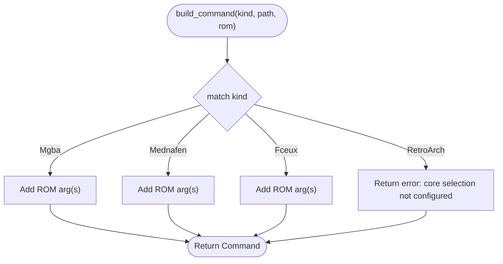
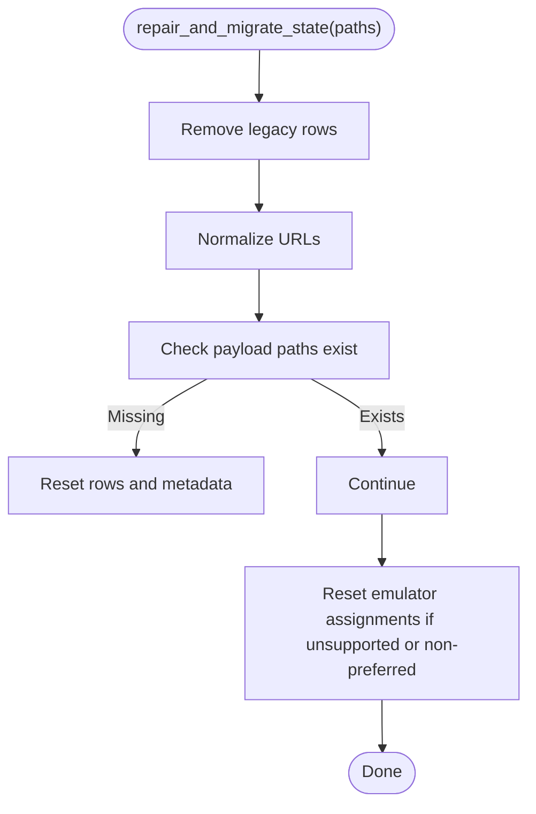
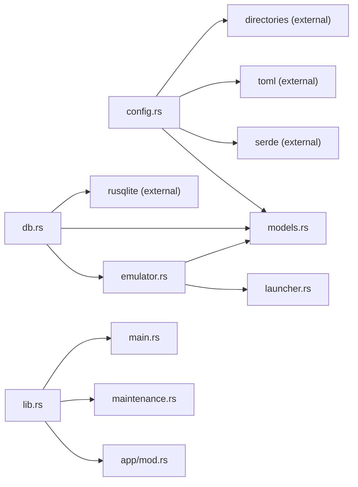

# Configuration Management

<cite>
**Referenced Files in This Document**
- [config.rs](file://src/config.rs)
- [models.rs](file://src/models.rs)
- [emulator.rs](file://src/emulator.rs)
- [launcher.rs](file://src/launcher.rs)
- [db.rs](file://src/db.rs)
- [lib.rs](file://src/lib.rs)
- [main.rs](file://src/main.rs)
- [Cargo.toml](file://Cargo.toml)
- [maintenance.rs](file://src/maintenance.rs)
- [error.rs](file://src/error.rs)
</cite>

## Table of Contents
1. [Introduction](#introduction)
2. [Project Structure](#project-structure)
3. [Core Components](#core-components)
4. [Architecture Overview](#architecture-overview)
5. [Detailed Component Analysis](#detailed-component-analysis)
6. [Dependency Analysis](#dependency-analysis)
7. [Performance Considerations](#performance-considerations)
8. [Troubleshooting Guide](#troubleshooting-guide)
9. [Conclusion](#conclusion)

## Introduction
This document explains the emulator configuration and management system. It covers configuration storage, emulator preferences, and how user-customizable launch parameters are handled. It documents the configuration file format, default settings, runtime configuration updates, emulator priority systems, and how configuration affects emulator detection and availability. It also addresses configuration validation, error handling, and migration between configuration versions, along with troubleshooting and resetting to defaults.

## Project Structure
The configuration system spans several modules:
- Configuration loading and defaults: config.rs
- Data models and platform/emulator enums: models.rs
- Emulator detection and launch command building: emulator.rs
- Game launching orchestration: launcher.rs
- Database-backed state and migrations: db.rs
- CLI entry points and maintenance commands: lib.rs, main.rs, maintenance.rs
- Error handling: error.rs
- Dependencies: Cargo.toml

**Diagram sources**
- [config.rs:25-32](file://src/config.rs#L25-L32)
- [models.rs:8-23](file://src/models.rs#L8-L23)
- [models.rs:150-156](file://src/models.rs#L150-L156)
- [emulator.rs:27-43](file://src/emulator.rs#L27-L43)
- [emulator.rs:110-127](file://src/emulator.rs#L110-L127)
- [launcher.rs:9-27](file://src/launcher.rs#L9-L27)
- [db.rs:20-23](file://src/db.rs#L20-L23)

**Section sources**
- [config.rs:10-32](file://src/config.rs#L10-L32)
- [models.rs:8-23](file://src/models.rs#L8-L23)
- [models.rs:150-156](file://src/models.rs#L150-L156)
- [emulator.rs:27-43](file://src/emulator.rs#L27-L43)
- [emulator.rs:110-127](file://src/emulator.rs#L110-L127)
- [launcher.rs:9-27](file://src/launcher.rs#L9-L27)
- [db.rs:20-23](file://src/db.rs#L20-L23)

## Core Components
- Configuration storage and defaults
  - Stores ROM roots, managed download directory, scan-on-startup flag, hidden file visibility, and preferred emulator mappings per platform.
  - Creates default directories and writes a default config if none exists.
- Emulator preferences
  - A list of platform-to-emulator mappings used to influence launch candidate ordering and initial selection.
- Emulator detection and availability
  - Detects installed emulators via PATH or known locations and determines availability (installed, downloadable, or unavailable).
- Launch command construction
  - Builds process arguments per emulator kind; some emulators require additional configuration (e.g., core selection for RetroArch).
- Database-backed state and migration
  - Maintains and repairs state, including resetting emulator assignments when platform support changes.

**Section sources**
- [config.rs:25-112](file://src/config.rs#L25-L112)
- [emulator.rs:13-91](file://src/emulator.rs#L13-L91)
- [emulator.rs:110-127](file://src/emulator.rs#L110-L127)
- [db.rs:129-267](file://src/db.rs#L129-L267)

## Architecture Overview
The configuration system integrates with emulator detection and launch orchestration. The UI selects a game, computes launch candidates based on configuration and platform support, and launches the emulator with constructed arguments.

**Diagram sources**
- [app/mod.rs:451-465](file://src/app/mod.rs#L451-L465)
- [config.rs:106-112](file://src/config.rs#L106-L112)
- [emulator.rs:45-61](file://src/emulator.rs#L45-L61)
- [launcher.rs:9-27](file://src/launcher.rs#L9-L27)
- [db.rs:739-759](file://src/db.rs#L739-L759)

## Detailed Component Analysis

### Configuration Storage and Defaults
- Configuration file location and directories
  - Uses OS-specific config/data directories and creates downloads and library database directories.
  - On first run, writes a default config file in TOML format.
- Default settings
  - ROM roots include common locations under HOME and the launcher’s downloads directory.
  - Managed download directory defaults to the data/downloads directory.
  - Scan on startup enabled; hidden files visibility disabled.
  - Preferred emulator mappings per platform (e.g., Game Boy series to mGBA, PS1 to Mednafen, NES to FCEUX).
- Runtime updates
  - The configuration is loaded at startup and used to compute launch candidates; there is no in-app mutation shown in the code. Updates would require editing the TOML file or adding a settings UI.

**Diagram sources**
- [config.rs:35-64](file://src/config.rs#L35-L64)

**Section sources**
- [config.rs:35-112](file://src/config.rs#L35-L112)
- [Cargo.toml:6-24](file://Cargo.toml#L6-L24)

### Emulator Preferences and Priority System
- Preference model
  - EmulatorPreference pairs a platform with an emulator kind.
  - Config holds a vector of preferences used to order launch candidates.
- Candidate ordering
  - UI prioritizes preferred emulators for the platform, then adds others based on platform support, and finally promotes the last-used emulator to the front if present.

**Diagram sources**
- [config.rs:106-112](file://src/config.rs#L106-L112)
- [emulator.rs:45-61](file://src/emulator.rs#L45-L61)
- [app/mod.rs:451-465](file://src/app/mod.rs#L451-L465)

**Section sources**
- [config.rs:19-32](file://src/config.rs#L19-L32)
- [config.rs:106-112](file://src/config.rs#L106-L112)
- [app/mod.rs:451-465](file://src/app/mod.rs#L451-L465)

### Emulator Detection and Availability
- Detection
  - Searches PATH and known absolute paths for emulator executables.
- Availability
  - Installed if detected; Downloadable otherwise; Unavailable in special cases (e.g., RetroArch on Apple Silicon requiring Rosetta).
- Candidate creation
  - Provides a human-readable note for each candidate based on availability.

**Diagram sources**
- [emulator.rs:27-43](file://src/emulator.rs#L27-L43)
- [emulator.rs:83-100](file://src/emulator.rs#L83-L100)

**Section sources**
- [emulator.rs:27-100](file://src/emulator.rs#L27-L100)

### Launch Command Construction and Parameter Customization
- Command building
  - Constructs process arguments per emulator kind.
  - mGBA, Mednafen, and FCEUX accept the ROM path as an argument.
  - RetroArch currently throws an error indicating core selection is not configured; this is where custom launch parameters would be introduced.
- Custom launch command overrides
  - Not implemented in the current code; the build_command function does not accept external overrides.

**Diagram sources**
- [emulator.rs:110-127](file://src/emulator.rs#L110-L127)

**Section sources**
- [emulator.rs:110-127](file://src/emulator.rs#L110-L127)

### Relationship Between Configuration and Emulator Detection
- Configuration influences which emulators are considered for a platform and in what order.
- Detection and availability determine whether a chosen emulator can actually be launched.
- The UI composes these two inputs to present actionable candidates.

**Section sources**
- [config.rs:106-112](file://src/config.rs#L106-L112)
- [emulator.rs:45-91](file://src/emulator.rs#L45-L91)
- [app/mod.rs:451-465](file://src/app/mod.rs#L451-L465)

### Configuration Validation, Error Handling, and Migration
- Validation and defaults
  - On load, the managed download directory is normalized to the data/downloads path if empty.
- Migration and repair
  - Database repair resets emulator assignments when platform support changes or when the configured emulator is no longer supported.
  - Removes legacy rows and normalizes URLs.
- Error handling
  - Structured errors provide user-friendly messages and technical details.
  - Maintenance actions expose repair, metadata clearing, and reset operations.

**Diagram sources**
- [db.rs:129-267](file://src/db.rs#L129-L267)

**Section sources**
- [config.rs:50-57](file://src/config.rs#L50-L57)
- [db.rs:129-267](file://src/db.rs#L129-L267)
- [error.rs:10-98](file://src/error.rs#L10-L98)
- [maintenance.rs:28-88](file://src/maintenance.rs#L28-L88)

### Examples of Configuration Scenarios
- Custom mGBA arguments
  - Not currently supported in build_command; would require extending the emulator command builder to accept additional arguments.
- RetroArch core selection
  - Currently unimplemented; build_command returns an error indicating core selection is not configured.
- Platform-specific optimizations
  - The platform-to-emulator mapping is fixed in defaults and preferences; optimization would require adding per-platform argument lists and exposing them in the UI.

**Section sources**
- [emulator.rs:110-127](file://src/emulator.rs#L110-L127)
- [config.rs:66-104](file://src/config.rs#L66-L104)

## Dependency Analysis
- External crates
  - directories: resolves OS-specific config/data directories.
  - toml: reads/writes configuration in TOML format.
  - serde: serializes/deserializes configuration and models.
  - rusqlite: persists state and runs migrations.
- Internal dependencies
  - Config depends on models for platform/emulator enums.
  - Emulator detection and launch depend on models and launcher.
  - Database repair depends on models and emulator support mapping.

**Diagram sources**
- [Cargo.toml:6-24](file://Cargo.toml#L6-L24)
- [config.rs:1-8](file://src/config.rs#L1-L8)
- [models.rs:1-6](file://src/models.rs#L1-L6)
- [emulator.rs:1-6](file://src/emulator.rs#L1-L6)
- [launcher.rs:1-7](file://src/launcher.rs#L1-L7)
- [db.rs:1-16](file://src/db.rs#L1-L16)
- [lib.rs:1-18](file://src/lib.rs#L1-L18)
- [main.rs:1-8](file://src/main.rs#L1-L8)
- [maintenance.rs:1-6](file://src/maintenance.rs#L1-L6)

**Section sources**
- [Cargo.toml:6-24](file://Cargo.toml#L6-L24)

## Performance Considerations
- Configuration I/O occurs at startup; subsequent reads are in-memory.
- Emulator detection uses PATH scanning; caching could reduce repeated filesystem queries.
- Database repair scans all rows; batching and indexing help mitigate cost.

## Troubleshooting Guide
- Configuration file issues
  - Verify the config file exists in the OS-specific config directory and is valid TOML.
  - If the managed download directory is empty, it is automatically set to the data/downloads directory.
- Emulator not found
  - The UI indicates “Enter installs” for downloadable emulators; ensure the package manager is available and retry installation.
  - On Apple Silicon, RetroArch is marked unavailable due to Rosetta requirements; install via Rosetta or choose another emulator.
- Launch failures
  - If a launch command fails, check that the ROM path is valid and the emulator executable is accessible.
- Repair and reset
  - Use maintenance commands to repair state, clear metadata caches, reset downloads, or reset all data.

**Section sources**
- [config.rs:50-57](file://src/config.rs#L50-L57)
- [emulator.rs:83-100](file://src/emulator.rs#L83-L100)
- [maintenance.rs:28-88](file://src/maintenance.rs#L28-L88)
- [error.rs:61-98](file://src/error.rs#L61-L98)

## Conclusion
The configuration system centers on a TOML-backed Config with platform-to-emulator preferences, default directories, and scan behavior. Emulator detection and availability gate launch readiness, while the database maintains state and enforces compatibility through migrations. Launch command construction is straightforward for most emulators but requires enhancement for configurable parameters (e.g., RetroArch core selection). Maintenance tools provide robust recovery paths for common configuration and state issues.