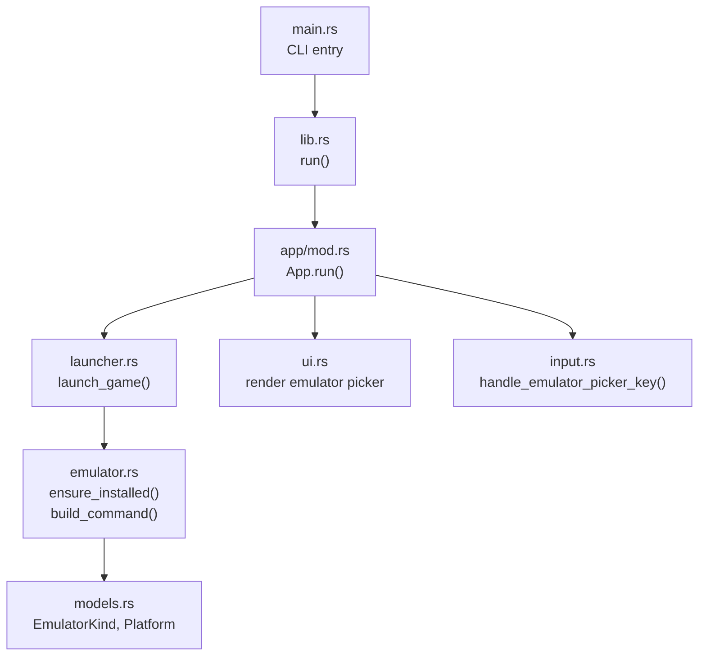
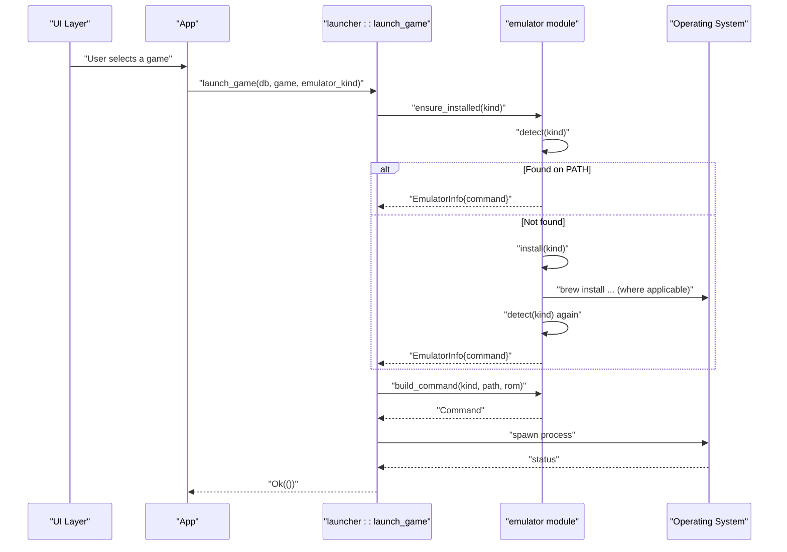
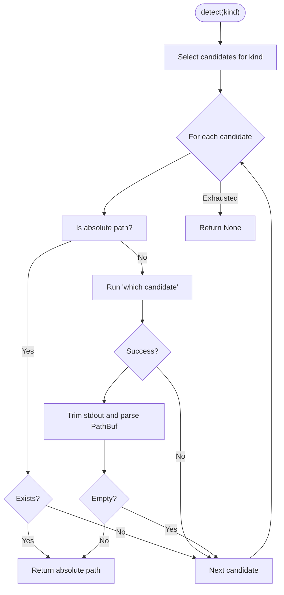
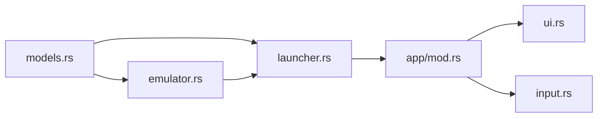
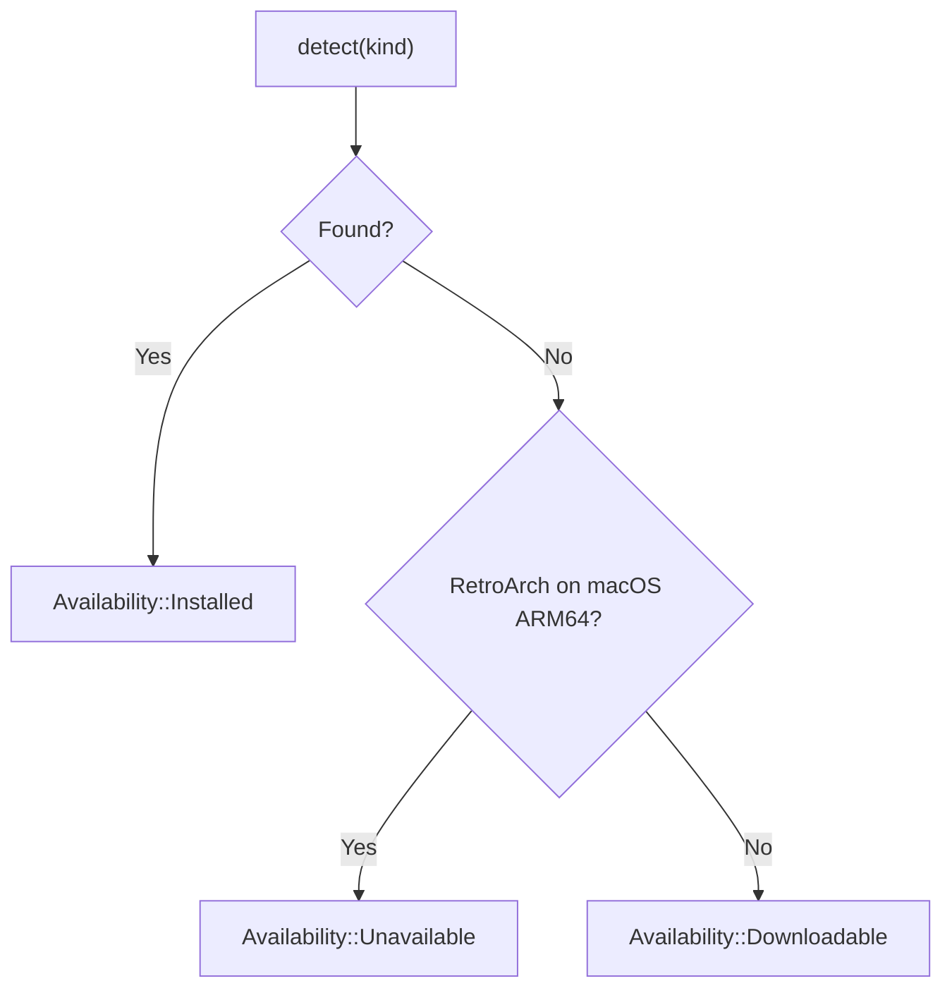

# Emulator Detection

<cite>
**Referenced Files in This Document**
- [emulator.rs](file://src/emulator.rs)
- [launcher.rs](file://src/launcher.rs)
- [models.rs](file://src/models.rs)
- [lib.rs](file://src/lib.rs)
- [main.rs](file://src/main.rs)
- [app/mod.rs](file://src/app/mod.rs)
- [input.rs](file://src/app/input.rs)
- [ui.rs](file://src/ui.rs)
- [error.rs](file://src/error.rs)
</cite>

## Table of Contents
1. [Introduction](#introduction)
2. [Project Structure](#project-structure)
3. [Core Components](#core-components)
4. [Architecture Overview](#architecture-overview)
5. [Detailed Component Analysis](#detailed-component-analysis)
6. [Dependency Analysis](#dependency-analysis)
7. [Performance Considerations](#performance-considerations)
8. [Troubleshooting Guide](#troubleshooting-guide)
9. [Conclusion](#conclusion)

## Introduction
This document explains the emulator detection system used to locate installed emulators, determine their availability, and prepare launch commands. It covers the detection algorithm, PATH searching, executable validation, platform-specific considerations, and the Availability states. It also documents how emulators_for_platform() maps platforms to emulators, and how detection failures and PATH issues are handled.

## Project Structure
The emulator detection logic is implemented in a dedicated module and integrated with the launcher and UI layers. The main pieces are:
- Emulator detection and availability: src/emulator.rs
- Game launch orchestration: src/launcher.rs
- Data model definitions (platforms, emulators): src/models.rs
- Application orchestration and UI integration: src/app/mod.rs and related UI/input modules
- Error types and messages: src/error.rs
- Module entry points: src/lib.rs and src/main.rs

**Diagram sources**
- [main.rs:1-9](file://src/main.rs#L1-L9)
- [lib.rs:18-22](file://src/lib.rs#L18-L22)
- [app/mod.rs:553-573](file://src/app/mod.rs#L553-L573)
- [launcher.rs:9-27](file://src/launcher.rs#L9-L27)
- [emulator.rs:102-127](file://src/emulator.rs#L102-L127)
- [models.rs:150-173](file://src/models.rs#L150-L173)
- [ui.rs:644-689](file://src/ui.rs#L644-L689)
- [input.rs:258-295](file://src/app/input.rs#L258-L295)

**Section sources**
- [main.rs:1-9](file://src/main.rs#L1-L9)
- [lib.rs:18-22](file://src/lib.rs#L18-L22)
- [app/mod.rs:553-573](file://src/app/mod.rs#L553-L573)

## Core Components
- EmulatorInfo: Holds the detected executable path for a given emulator.
- Availability: Enumerates three states:
  - Installed: Emulator is present on PATH or via platform-specific absolute path.
  - Downloadable: Emulator is not installed but can be installed automatically.
  - Unavailable: Emulator is not available on the current host (e.g., Apple Silicon macOS RetroArch).
- LaunchCandidate: Encapsulates an emulator choice with its availability and a user-facing note.
- EmulatorKind and Platform: Strongly typed enums used to drive detection and mapping.

**Section sources**
- [emulator.rs:8-25](file://src/emulator.rs#L8-L25)
- [models.rs:150-173](file://src/models.rs#L150-L173)

## Architecture Overview
The detection and launch pipeline:
- Detect whether an emulator is installed.
- If not installed, offer installation (where supported).
- Build the appropriate command-line invocation for the emulator.
- Launch the emulator process and record the launch.

**Diagram sources**
- [app/mod.rs:434-449](file://src/app/mod.rs#L434-L449)
- [launcher.rs:9-27](file://src/launcher.rs#L9-L27)
- [emulator.rs:102-127](file://src/emulator.rs#L102-L127)

## Detailed Component Analysis

### Detection Algorithm and PATH Searching
- Candidate selection per emulator:
  - mGBA: searches for "mgba".
  - Mednafen: searches for "mednafen".
  - FCEUX: searches for "fceux".
  - RetroArch: tries "retroarch" on PATH, and on macOS also checks a specific absolute path under /Applications.
- PATH search and validation:
  - Absolute path handling: If the candidate is an absolute path, existence is verified and returned immediately.
  - Relative path handling: Uses an external "which" command to resolve the executable on PATH.
  - Output parsing: Captures stdout from "which", trims whitespace, and converts to a PathBuf. Empty output is treated as not found.

**Diagram sources**
- [emulator.rs:27-43](file://src/emulator.rs#L27-L43)
- [emulator.rs:153-168](file://src/emulator.rs#L153-L168)

**Section sources**
- [emulator.rs:27-43](file://src/emulator.rs#L27-L43)
- [emulator.rs:153-168](file://src/emulator.rs#L153-L168)

### which() Function Behavior
- Accepts a candidate string (either a PATH token or an absolute path).
- If absolute and exists, returns it immediately.
- Otherwise runs "which" and parses the output to a PathBuf.
- Treats empty output as not found.

Cross-platform compatibility:
- Relies on the external "which" utility, which is standard on Unix-like systems (Linux, macOS).
- On Windows, "which" is typically not available; however, the code uses a standard library process runner and does not guard against Windows environments. This may require platform-specific handling if Windows support is desired.

**Section sources**
- [emulator.rs:153-168](file://src/emulator.rs#L153-L168)

### Availability States and Determination Criteria
States:
- Installed: An executable path was detected.
- Downloadable: Not installed, but installable via package manager (where supported).
- Unavailable: Not available on the current host (e.g., Apple Silicon macOS RetroArch is optional and requires Rosetta 2).

Determination logic:
- If detect(kind) succeeds → Installed.
- Else if kind is RetroArch on macOS ARM64 → Unavailable.
- Otherwise → Downloadable.

Notes:
- The function does not currently check for a package manager presence; it assumes availability for installation when Downloadable.

**Section sources**
- [emulator.rs:83-91](file://src/emulator.rs#L83-L91)
- [emulator.rs:93-100](file://src/emulator.rs#L93-L100)

### Platform-Specific Considerations
- macOS RetroArch absolute path: The detection includes a hardcoded macOS app bundle path for the RetroArch binary, improving reliability on that platform.
- Apple Silicon macOS RetroArch: Explicitly marked Unavailable due to Rosetta 2 requirement for the Homebrew cask.

**Section sources**
- [emulator.rs:32-35](file://src/emulator.rs#L32-L35)
- [emulator.rs:86-87](file://src/emulator.rs#L86-L87)
- [emulator.rs:95-96](file://src/emulator.rs#L95-L96)

### emulators_for_platform() Mapping System
- Maps a Platform to a list of EmulatorKind candidates for that platform.
- Examples:
  - Game Boy family platforms → mGBA.
  - PS1 → Mednafen.
  - NES → FCEUX and RetroArch.
  - SNES, Genesis/Megadrive, N64, NDS, PS2, Wii, Xbox 360 → RetroArch.
  - Unknown → none.

Integration:
- The UI composes the final candidate list by merging preferred emulators (from configuration) with platform-mapped emulators, ensuring preferred ones appear first and last-used emulator bubbles to the top.

**Section sources**
- [emulator.rs:45-61](file://src/emulator.rs#L45-L61)
- [app/mod.rs:451-465](file://src/app/mod.rs#L451-L465)

### Launch Command Construction and Execution
- Command building:
  - mGBA: passes ROM path with a flag.
  - Mednafen/FCEUX: passes ROM path directly.
  - RetroArch: currently raises an error indicating core selection is not configured.
- Execution:
  - The launcher spawns the process and records success/failure, updating database state accordingly.

**Section sources**
- [emulator.rs:110-127](file://src/emulator.rs#L110-L127)
- [launcher.rs:9-27](file://src/launcher.rs#L9-L27)

### UI Integration and User Experience
- The UI presents an emulator picker when multiple candidates are available for a game.
- The picker shows a note per candidate derived from availability and reasons.
- Users can confirm to launch or cancel.

**Section sources**
- [app/mod.rs:467-491](file://src/app/mod.rs#L467-L491)
- [input.rs:258-295](file://src/app/input.rs#L258-L295)
- [ui.rs:644-689](file://src/ui.rs#L644-L689)

## Dependency Analysis
- emulator.rs depends on:
  - models.rs for EmulatorKind and Platform.
  - std::process::Command for invoking "which" and "brew".
  - anyhow for error handling.
- launcher.rs depends on:
  - emulator.rs for detection, installation, and command building.
  - models.rs for EmulatorKind and GameEntry.
- app/mod.rs orchestrates:
  - Collects candidates via emulator::emulators_for_platform() and emulator::candidate().
  - Opens the emulator picker and delegates launch to launcher::launch_game().

**Diagram sources**
- [models.rs:150-173](file://src/models.rs#L150-L173)
- [emulator.rs:1-6](file://src/emulator.rs#L1-L6)
- [launcher.rs:5-7](file://src/launcher.rs#L5-L7)
- [app/mod.rs:35-44](file://src/app/mod.rs#L35-L44)

**Section sources**
- [models.rs:150-173](file://src/models.rs#L150-L173)
- [emulator.rs:1-6](file://src/emulator.rs#L1-L6)
- [launcher.rs:5-7](file://src/launcher.rs#L5-L7)
- [app/mod.rs:35-44](file://src/app/mod.rs#L35-L44)

## Performance Considerations
- PATH lookup cost: Each detect() iterates a small fixed number of candidates and invokes "which" once per candidate. This is efficient for typical use cases.
- Cross-platform note: Using "which" on Windows may fail or behave differently; consider platform-aware fallbacks if Windows support is added.
- Command construction: Minimal overhead; mostly argument assembly per emulator.

## Troubleshooting Guide
Common detection problems and resolutions:
- Emulator not found on PATH:
  - Symptom: Availability::Downloadable shown; install prompt appears.
  - Resolution: Ensure the emulator is installed and on PATH, or install via the built-in flow where supported.
- macOS RetroArch Unavailable:
  - Symptom: Availability::Unavailable on Apple Silicon; note indicates Rosetta requirement.
  - Resolution: Install RetroArch manually or use an alternate emulator.
- Absolute path not detected:
  - Symptom: RetroArch detection fails despite a valid app bundle path.
  - Resolution: Verify the absolute path exists and is executable; the code checks existence for absolute candidates.
- Cross-platform PATH issues:
  - Symptom: "which" not available on Windows.
  - Resolution: Add platform-specific handling to avoid relying on "which" on unsupported platforms.
- Launch failures:
  - Symptom: Emulator exits with non-zero status.
  - Resolution: Confirm ROM path validity and emulator compatibility; review logs for process spawn errors.

Detection failure flow:

**Diagram sources**
- [emulator.rs:83-91](file://src/emulator.rs#L83-L91)

**Section sources**
- [emulator.rs:83-100](file://src/emulator.rs#L83-L100)
- [error.rs:24-26](file://src/error.rs#L24-L26)

## Conclusion
The emulator detection system provides a robust, platform-aware mechanism to discover installed emulators, determine availability, and construct launch commands. It integrates cleanly with the UI to present actionable choices and handles platform-specific nuances, particularly for macOS RetroArch. Extending support to Windows would require replacing or supplementing the "which" dependency with a platform-appropriate solution.