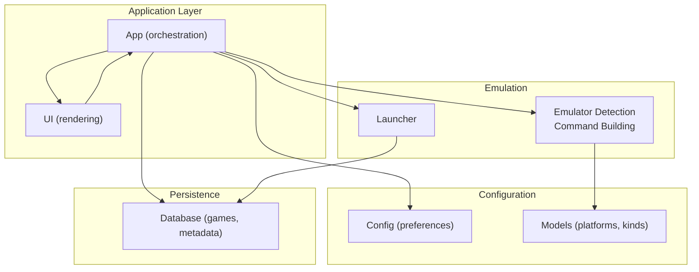
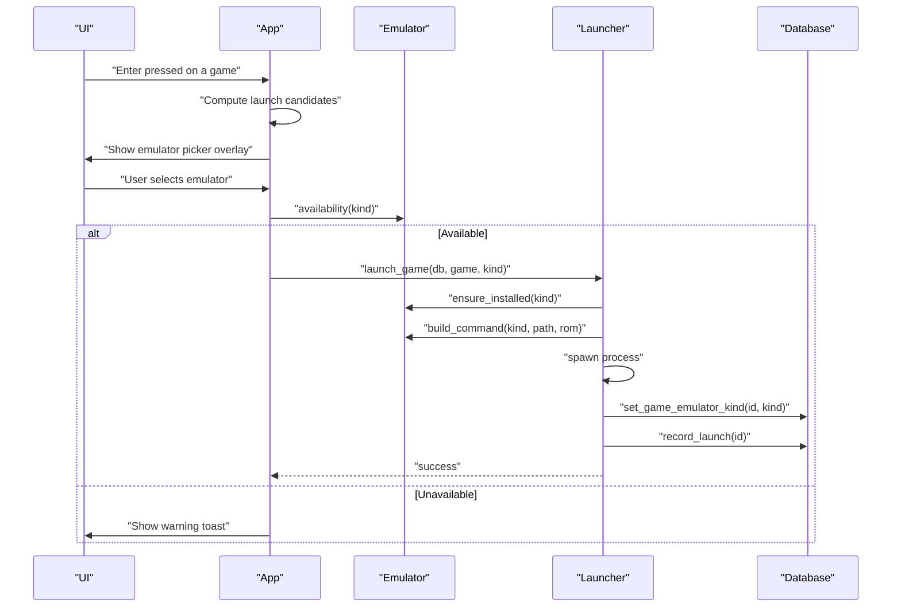
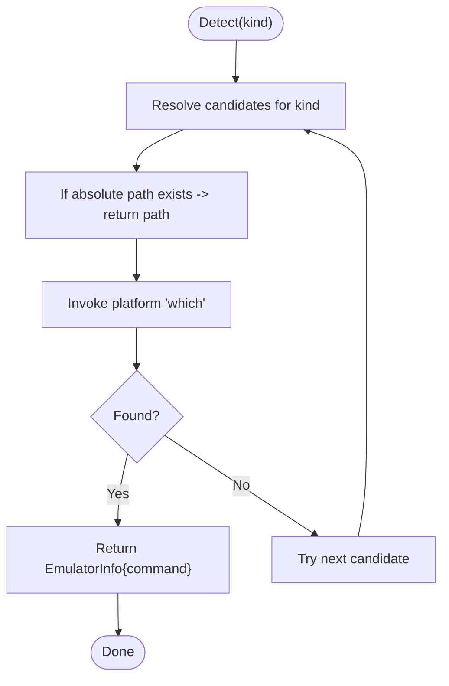
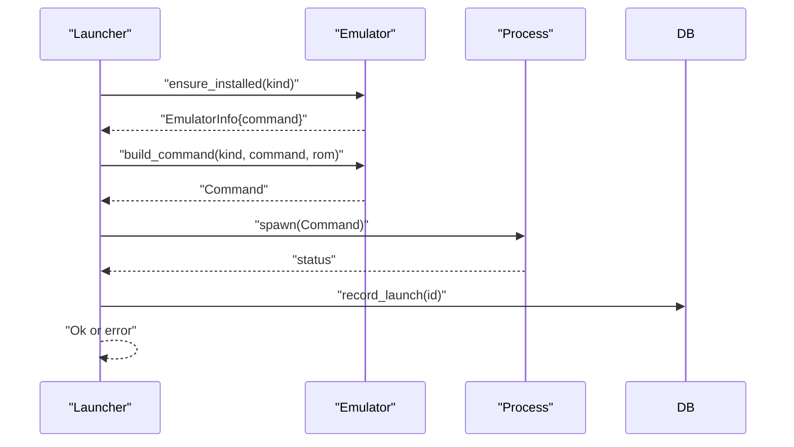
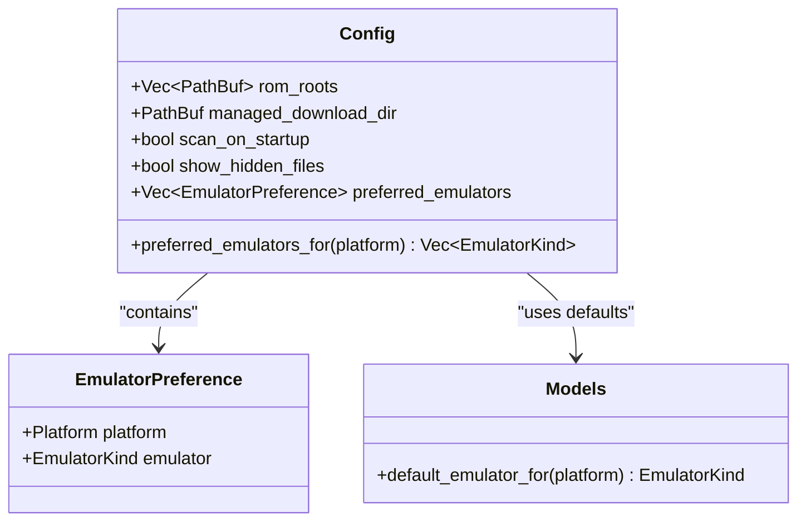
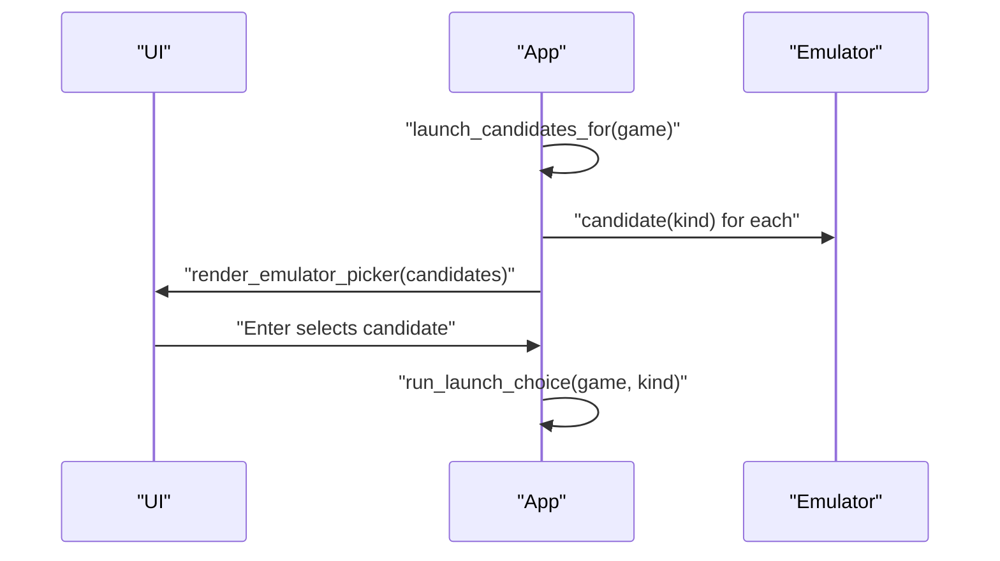
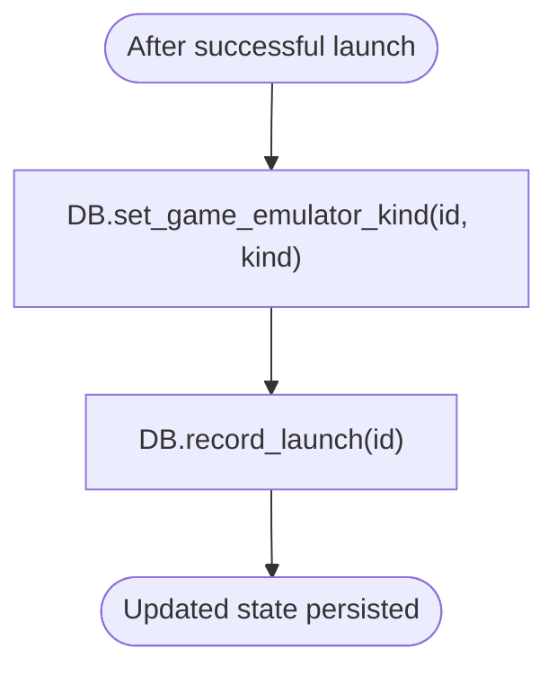
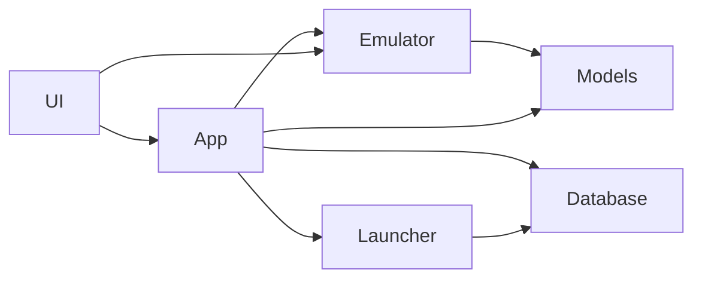

# Emulator Integration

<cite>
**Referenced Files in This Document**
- [lib.rs](file://src/lib.rs)
- [main.rs](file://src/main.rs)
- [emulator.rs](file://src/emulator.rs)
- [launcher.rs](file://src/launcher.rs)
- [config.rs](file://src/config.rs)
- [models.rs](file://src/models.rs)
- [db.rs](file://src/db.rs)
- [ui.rs](file://src/ui.rs)
- [app/mod.rs](file://src/app/mod.rs)
- [error.rs](file://src/error.rs)
</cite>

## Table of Contents
1. [Introduction](#introduction)
2. [Project Structure](#project-structure)
3. [Core Components](#core-components)
4. [Architecture Overview](#architecture-overview)
5. [Detailed Component Analysis](#detailed-component-analysis)
6. [Dependency Analysis](#dependency-analysis)
7. [Performance Considerations](#performance-considerations)
8. [Troubleshooting Guide](#troubleshooting-guide)
9. [Conclusion](#conclusion)

## Introduction
This document explains the emulator detection and launching system used by the application. It covers how emulators are detected across platforms, how executable paths are resolved, how launch commands are constructed, and how configuration influences emulator selection. It also documents the relationships with the ROM management system and the UI layer, along with error handling strategies, troubleshooting guidance, and optimization tips.

## Project Structure
The emulator integration spans several modules:
- Emulator detection and command building live in the emulator module.
- The launcher orchestrates launching a selected ROM with a chosen emulator.
- Configuration defines preferences and defaults for emulator selection.
- Models define platforms, emulator kinds, and game metadata.
- Database persists game state and emulator assignments.
- UI renders the emulator picker and communicates with the app layer.
- App coordinates user actions, including launching and showing overlays.

**Diagram sources**
- [lib.rs:20-38](file://src/lib.rs#L20-L38)
- [app/mod.rs:94-123](file://src/app/mod.rs#L94-L123)
- [emulator.rs:27-127](file://src/emulator.rs#L27-L127)
- [launcher.rs:9-27](file://src/launcher.rs#L9-L27)
- [config.rs:26-112](file://src/config.rs#L26-L112)
- [models.rs:8-173](file://src/models.rs#L8-L173)
- [db.rs:21-42](file://src/db.rs#L21-L42)

**Section sources**
- [lib.rs:1-39](file://src/lib.rs#L1-L39)
- [main.rs:1-9](file://src/main.rs#L1-L9)

## Core Components
- Emulator detection and availability: Determines whether an emulator is installed, downloadable, or unavailable, and resolves the executable path.
- Launch command construction: Builds the appropriate command-line arguments for each emulator.
- Emulator preference configuration: Defines platform-to-emulator mappings and default choices.
- Launcher orchestration: Validates ROM availability, ensures the emulator is installed, constructs the command, spawns the process, and updates the database.
- UI integration: Presents an emulator picker overlay and displays availability notes.

Key responsibilities:
- Detect and resolve emulator executables.
- Enforce platform-specific emulator support.
- Construct and execute launch commands.
- Persist emulator choice and launch metrics.
- Surface availability and installation prompts in the UI.

**Section sources**
- [emulator.rs:27-127](file://src/emulator.rs#L27-L127)
- [launcher.rs:9-27](file://src/launcher.rs#L9-L27)
- [config.rs:26-112](file://src/config.rs#L26-L112)
- [models.rs:8-173](file://src/models.rs#L8-L173)
- [db.rs:739-759](file://src/db.rs#L739-L759)
- [ui.rs:602-689](file://src/ui.rs#L602-L689)
- [app/mod.rs:402-465](file://src/app/mod.rs#L402-L465)

## Architecture Overview
The emulator integration follows a layered design:
- UI layer triggers actions and renders overlays.
- App layer coordinates state, user input, and persistence.
- Emulator layer detects and prepares launch commands.
- Launcher executes the process and updates the database.
- Models and configuration inform platform-specific decisions.

**Diagram sources**
- [app/mod.rs:402-465](file://src/app/mod.rs#L402-L465)
- [emulator.rs:83-127](file://src/emulator.rs#L83-L127)
- [launcher.rs:9-27](file://src/launcher.rs#L9-L27)
- [db.rs:739-759](file://src/db.rs#L739-L759)

## Detailed Component Analysis

### Emulator Detection and Availability
- Detection algorithm:
  - For each emulator kind, a list of candidates is checked. Absolute paths are validated immediately; otherwise, the system checks PATH via a platform invocation.
  - On macOS, RetroArch includes a known bundle path as a candidate.
- Availability classification:
  - Installed: Found on PATH or absolute path.
  - Downloadable: Not installed but installable via package manager.
  - Unavailable: Not installed and not available on the host (e.g., RetroArch on Apple Silicon due to Rosetta requirement).
- Platform-specific support:
  - Each platform maps to a set of supported emulators. For example, Game Boy family prefers a dedicated emulator, while others default to a general-purpose emulator.

**Diagram sources**
- [emulator.rs:27-43](file://src/emulator.rs#L27-L43)
- [emulator.rs:153-168](file://src/emulator.rs#L153-L168)

**Section sources**
- [emulator.rs:27-100](file://src/emulator.rs#L27-L100)
- [models.rs:46-61](file://src/models.rs#L46-L61)

### Launch Command Construction
- Command building depends on emulator kind:
  - mGBA: Uses a flag to force fullscreen and passes the ROM path.
  - Mednafen and FCEUX: Pass the ROM path directly.
  - RetroArch: Currently not configured; attempting to launch raises an error indicating core selection is pending.
- Process spawning:
  - The launcher validates ROM availability, ensures the emulator is installed, builds the command, spawns the process, and records success/failure.

**Diagram sources**
- [launcher.rs:9-27](file://src/launcher.rs#L9-L27)
- [emulator.rs:110-127](file://src/emulator.rs#L110-L127)

**Section sources**
- [launcher.rs:9-27](file://src/launcher.rs#L9-L27)
- [emulator.rs:110-127](file://src/emulator.rs#L110-L127)

### Configuration Management and Preferences
- Preferred emulators:
  - The configuration maps platform to preferred emulator kinds. Defaults include platform-specific choices (e.g., Game Boy family to a dedicated emulator, PlayStation to another).
- Preferred emulators for a platform:
  - The configuration exposes a method to retrieve preferred emulators for a given platform, enabling prioritization in the UI.
- Default mappings:
  - Models provide a default mapping for each platform to a single emulator kind, used when no explicit preference exists.

**Diagram sources**
- [config.rs:26-112](file://src/config.rs#L26-L112)
- [models.rs:353-369](file://src/models.rs#L353-L369)

**Section sources**
- [config.rs:26-112](file://src/config.rs#L26-L112)
- [models.rs:353-369](file://src/models.rs#L353-L369)

### UI Integration and Emulator Picker
- Candidate computation:
  - The app computes an ordered list of launch candidates by combining user preferences, platform support, and last-used emulator.
- Overlay rendering:
  - The UI renders an emulator picker overlay with availability badges and contextual notes.
- User interaction:
  - The app handles key events to navigate and confirm the emulator selection, then triggers the launch flow.

**Diagram sources**
- [app/mod.rs:451-465](file://src/app/mod.rs#L451-L465)
- [ui.rs:602-689](file://src/ui.rs#L602-L689)
- [emulator.rs:63-81](file://src/emulator.rs#L63-L81)

**Section sources**
- [app/mod.rs:451-491](file://src/app/mod.rs#L451-L491)
- [ui.rs:602-689](file://src/ui.rs#L602-L689)

### Database Integration
- Persistence of emulator assignment:
  - After a successful launch, the database stores the chosen emulator kind for the game.
- Launch metrics:
  - The database increments play count and updates timestamps upon successful launch.
- Migration and repair:
  - During startup, the database repairs legacy rows and resets emulator assignments when they are unsupported or inconsistent with platform defaults.

**Diagram sources**
- [db.rs:739-759](file://src/db.rs#L739-L759)
- [launcher.rs:24-25](file://src/launcher.rs#L24-L25)

**Section sources**
- [db.rs:739-759](file://src/db.rs#L739-L759)
- [launcher.rs:24-25](file://src/launcher.rs#L24-L25)

## Dependency Analysis
- Emulator module depends on models for platform and emulator kind definitions.
- Launcher depends on emulator for detection and command building, and on database for persistence.
- App depends on emulator for availability and candidate computation, on launcher for execution, and on UI for overlays.
- UI depends on emulator availability for rendering notes and badges.
- Database integrates with models and launcher for state updates.

**Diagram sources**
- [app/mod.rs:34-44](file://src/app/mod.rs#L34-L44)
- [emulator.rs:6-6](file://src/emulator.rs#L6-L6)
- [launcher.rs:5-7](file://src/launcher.rs#L5-L7)
- [db.rs:13-16](file://src/db.rs#L13-L16)

**Section sources**
- [app/mod.rs:34-44](file://src/app/mod.rs#L34-L44)
- [emulator.rs:6-6](file://src/emulator.rs#L6-L6)
- [launcher.rs:5-7](file://src/launcher.rs#L5-L7)
- [db.rs:13-16](file://src/db.rs#L13-L16)

## Performance Considerations
- Detection efficiency:
  - The detection algorithm short-circuits on the first successful candidate, minimizing overhead.
- Command construction:
  - Command building is lightweight and avoids unnecessary allocations.
- Process spawning:
  - The launcher suspends the terminal UI around process spawn to ensure clean handoff to the emulator.
- Database writes:
  - Updates are minimal and occur only after successful launch.

[No sources needed since this section provides general guidance]

## Troubleshooting Guide
Common issues and resolutions:
- Missing emulators:
  - The system reports “missing” emulators and can install them automatically when available. If an emulator is marked as unavailable on the host (e.g., a specific platform requirement), the UI shows a contextual note.
- Incorrect paths:
  - Detection checks both PATH and absolute paths; ensure the emulator binary is executable and located on PATH or use an absolute path.
- Launch failures:
  - If the emulator exits with a non-zero status, the launcher records the failure and the database does not update launch metrics.
- RetroArch core selection:
  - RetroArch is intentionally not auto-configured; the system raises an error until core selection is implemented.
- Apple Silicon and RetroArch:
  - On Apple Silicon, RetroArch is marked unavailable due to Rosetta requirements; the UI informs users accordingly.

Error handling and messaging:
- Structured error types provide user-friendly messages and technical details for logging.
- The UI surfaces warnings and success notifications for launch outcomes.

**Section sources**
- [emulator.rs:83-100](file://src/emulator.rs#L83-L100)
- [emulator.rs:129-138](file://src/emulator.rs#L129-L138)
- [launcher.rs:18-23](file://src/launcher.rs#L18-L23)
- [error.rs:61-98](file://src/error.rs#L61-L98)

## Conclusion
The emulator integration provides a robust, platform-aware mechanism for detecting emulators, resolving executable paths, constructing launch commands, and persisting user choices. It integrates tightly with configuration, database state, and the UI to deliver a smooth user experience. While RetroArch remains partially unconfigured, the system is designed to accommodate future enhancements, including configurable core selection and custom launch parameters.