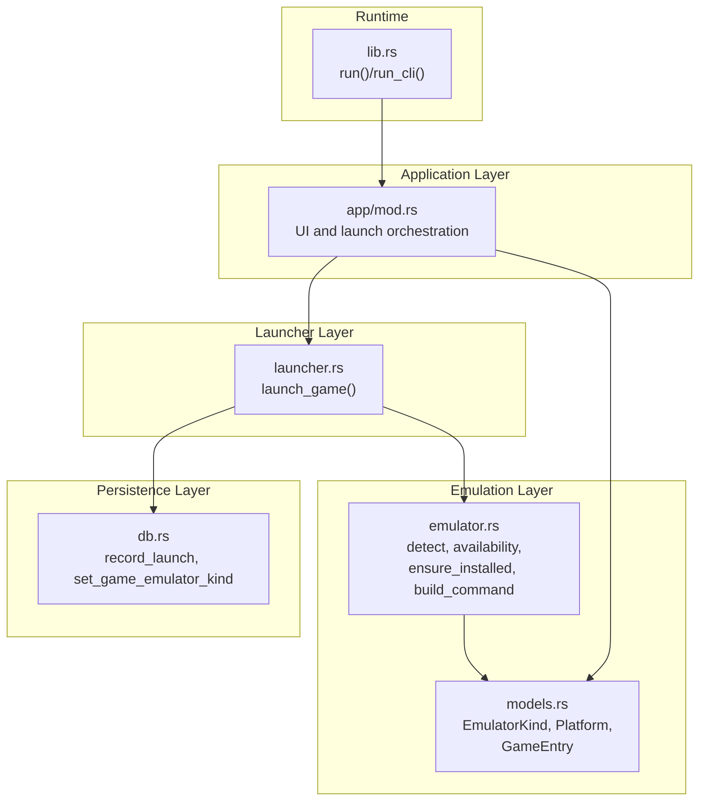
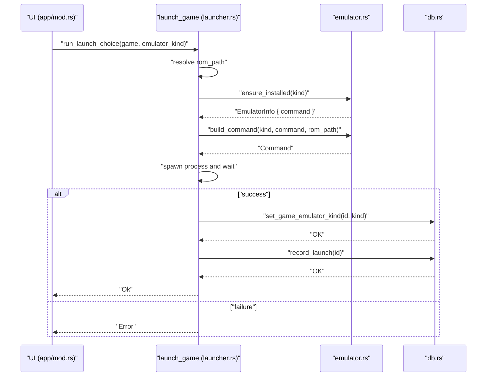
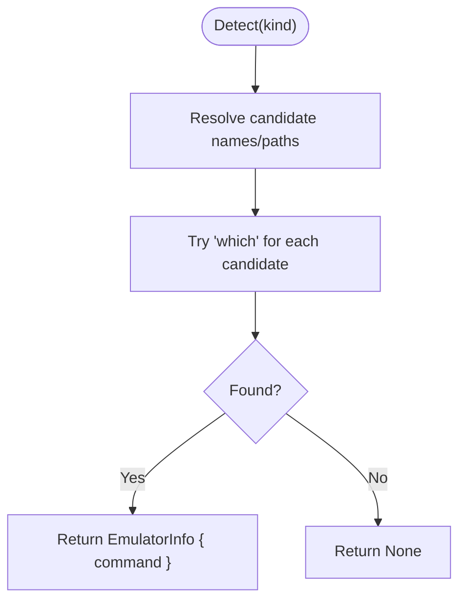
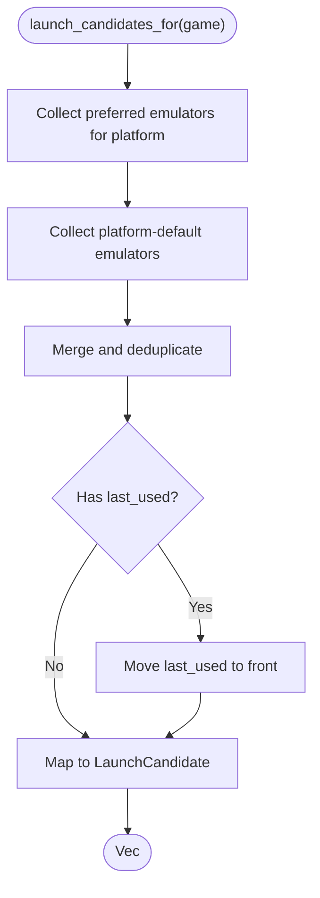
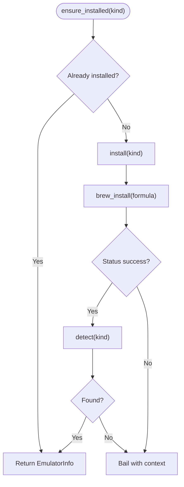
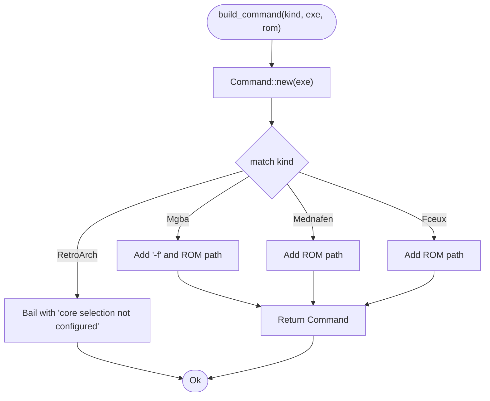
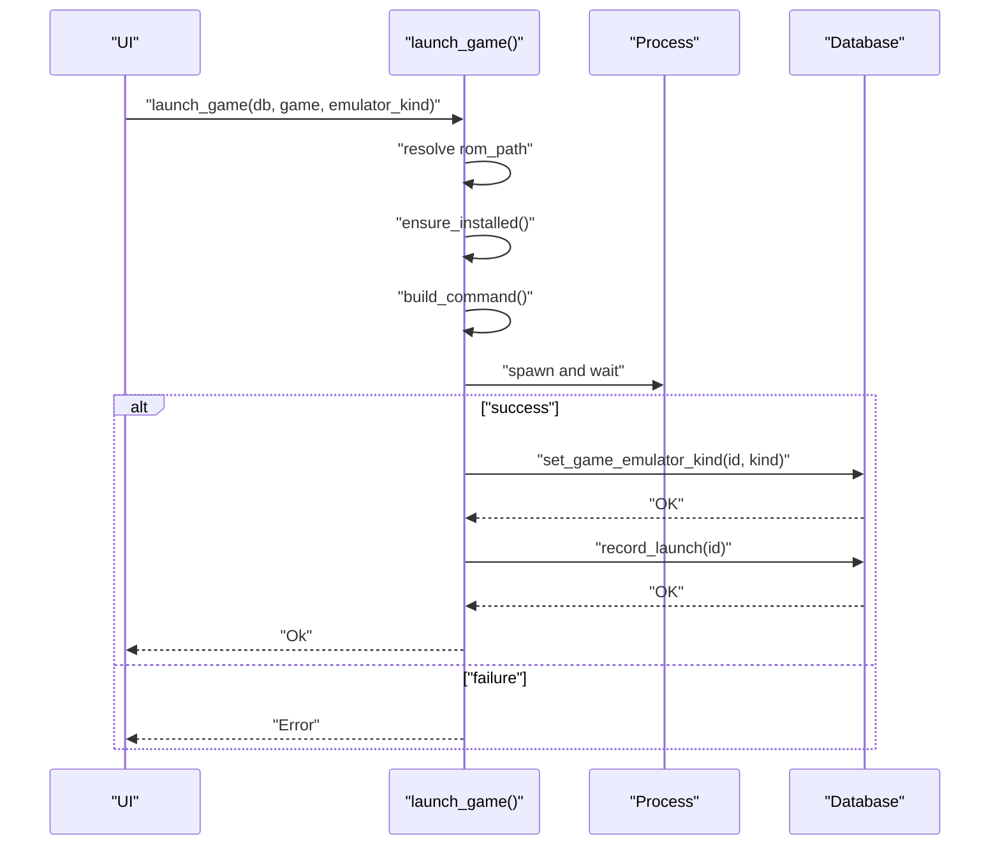
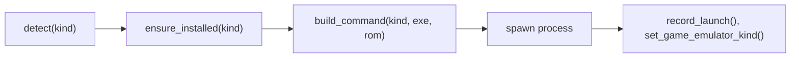
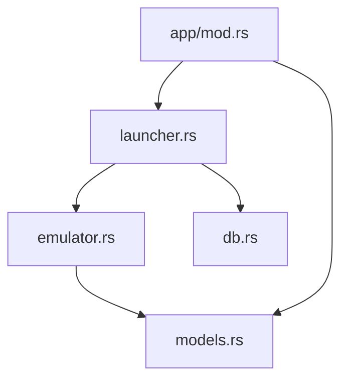
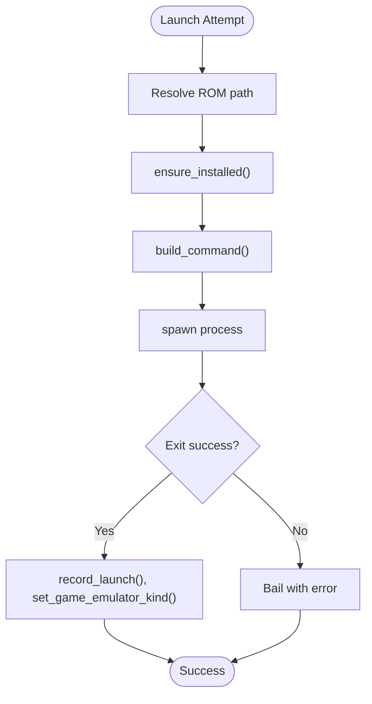

# Launch Mechanisms

<cite>
**Referenced Files in This Document**
- [emulator.rs](file://src/emulator.rs)
- [launcher.rs](file://src/launcher.rs)
- [models.rs](file://src/models.rs)
- [db.rs](file://src/db.rs)
- [app/mod.rs](file://src/app/mod.rs)
- [lib.rs](file://src/lib.rs)
- [error.rs](file://src/error.rs)
</cite>

## Table of Contents
1. [Introduction](#introduction)
2. [Project Structure](#project-structure)
3. [Core Components](#core-components)
4. [Architecture Overview](#architecture-overview)
5. [Detailed Component Analysis](#detailed-component-analysis)
6. [Dependency Analysis](#dependency-analysis)
7. [Performance Considerations](#performance-considerations)
8. [Troubleshooting Guide](#troubleshooting-guide)
9. [Conclusion](#conclusion)

## Introduction
This document explains how the emulator launch pipeline works in the application. It covers how launch commands are constructed per emulator type, how launch candidates are prepared and presented, how emulators are detected and installed automatically, and how the launcher executes processes and records outcomes. It also documents the relationship between emulator detection and launch execution, and provides guidance for diagnosing failures.

## Project Structure
The launch mechanism spans several modules:
- Emulator detection, availability, and command building live in the emulator module.
- The high-level launch orchestration resides in the launcher module.
- Game metadata and platform/emulator mappings are defined in the models module.
- Database updates for launch tracking and emulator assignment occur in the db module.
- The UI integrates launch decisions and invokes the launcher in the app module.
- The library entry points expose the application runtime.

**Diagram sources**
- [app/mod.rs:434-465](file://src/app/mod.rs#L434-L465)
- [launcher.rs:9-27](file://src/launcher.rs#L9-L27)
- [emulator.rs:27-127](file://src/emulator.rs#L27-L127)
- [models.rs:150-173](file://src/models.rs#L150-L173)
- [db.rs:739-759](file://src/db.rs#L739-L759)
- [lib.rs:20-38](file://src/lib.rs#L20-L38)

**Section sources**
- [lib.rs:1-39](file://src/lib.rs#L1-L39)
- [app/mod.rs:434-465](file://src/app/mod.rs#L434-L465)
- [launcher.rs:9-27](file://src/launcher.rs#L9-L27)
- [emulator.rs:27-127](file://src/emulator.rs#L27-L127)
- [models.rs:150-173](file://src/models.rs#L150-L173)
- [db.rs:739-759](file://src/db.rs#L739-L759)

## Core Components
- Emulator detection and availability:
  - Detects installed emulators by name or known paths.
  - Determines whether an emulator is installed, downloadable, or unavailable.
- Launch candidate preparation:
  - Builds a list of candidates per game, considering preferences and platform defaults.
- Automatic installation:
  - Installs missing emulators via a package manager when applicable.
- Command construction:
  - Builds the correct command-line arguments for each emulator type.
- Process execution:
  - Spawns the emulator process and validates exit status.
- Post-launch persistence:
  - Records the launch and assigns the emulator kind to the game.

**Section sources**
- [emulator.rs:27-127](file://src/emulator.rs#L27-L127)
- [launcher.rs:9-27](file://src/launcher.rs#L9-L27)
- [db.rs:739-759](file://src/db.rs#L739-L759)
- [app/mod.rs:451-465](file://src/app/mod.rs#L451-L465)

## Architecture Overview
The launch flow connects UI choices to emulator detection, installation, command construction, process execution, and database updates.

**Diagram sources**
- [app/mod.rs:402-431](file://src/app/mod.rs#L402-L431)
- [launcher.rs:9-27](file://src/launcher.rs#L9-L27)
- [emulator.rs:102-127](file://src/emulator.rs#L102-L127)
- [db.rs:739-759](file://src/db.rs#L739-L759)

## Detailed Component Analysis

### Emulator Detection and Availability
- Detection:
  - Searches for executables by name or known absolute paths.
  - Uses a platform-aware fallback for a specific emulator.
- Availability:
  - Installed if detected.
  - Downloadable if not installed but supported on the host.
  - Unavailable if not supported (e.g., specific OS/arch combinations).
- Unavailable reasons:
  - Provides a user-facing reason string for unsupported configurations.

**Diagram sources**
- [emulator.rs:27-43](file://src/emulator.rs#L27-L43)
- [emulator.rs:153-168](file://src/emulator.rs#L153-L168)

**Section sources**
- [emulator.rs:27-43](file://src/emulator.rs#L27-L43)
- [emulator.rs:83-100](file://src/emulator.rs#L83-L100)

### Launch Candidate Preparation
- Candidate composition:
  - Combines preferred emulators with platform-defaults.
  - Inserts the last-used emulator first if present.
  - Wraps each into a LaunchCandidate with availability and a note.
- Presentation:
  - The UI uses these candidates to render choices and toasts.

**Diagram sources**
- [app/mod.rs:451-465](file://src/app/mod.rs#L451-L465)
- [emulator.rs:63-81](file://src/emulator.rs#L63-L81)

**Section sources**
- [app/mod.rs:451-465](file://src/app/mod.rs#L451-L465)
- [emulator.rs:63-81](file://src/emulator.rs#L63-L81)

### Automatic Installation Workflow
- ensure_installed():
  - If already installed, returns immediately.
  - Otherwise, installs via a package manager and re-detects.
- install():
  - Delegates to a brew formula per emulator.
  - RetroArch is intentionally unavailable on specific platforms.
- brew_install():
  - Executes brew install and checks the exit status.

**Diagram sources**
- [emulator.rs:102-108](file://src/emulator.rs#L102-L108)
- [emulator.rs:129-151](file://src/emulator.rs#L129-L151)

**Section sources**
- [emulator.rs:102-108](file://src/emulator.rs#L102-L108)
- [emulator.rs:129-151](file://src/emulator.rs#L129-L151)

### Command Construction and Argument Formatting
- build_command():
  - Creates a Command with the emulator executable path.
  - Adds arguments per emulator:
    - mGBA: a flag plus the ROM path.
    - Mednafen: ROM path as a positional argument.
    - FCEUX: ROM path as a positional argument.
    - RetroArch: currently not supported (bails with a message).
- Platform-specific notes:
  - mGBA uses a dedicated flag for fullscreen mode in the command.
  - Mednafen and FCEUX accept the ROM path directly.

**Diagram sources**
- [emulator.rs:110-127](file://src/emulator.rs#L110-L127)

**Section sources**
- [emulator.rs:110-127](file://src/emulator.rs#L110-L127)

### Process Execution and Post-Launch Management
- launch_game():
  - Resolves the ROM path from either a direct path or a managed download path.
  - Ensures the emulator is installed and builds the command.
  - Spawns the process and waits for completion.
  - On success, persists the emulator kind and increments the launch count.
- Terminal suspension:
  - The UI temporarily suspends the terminal during launch to allow the emulator to take over.

**Diagram sources**
- [launcher.rs:9-27](file://src/launcher.rs#L9-L27)
- [db.rs:739-759](file://src/db.rs#L739-L759)
- [app/mod.rs:434-449](file://src/app/mod.rs#L434-L449)

**Section sources**
- [launcher.rs:9-27](file://src/launcher.rs#L9-L27)
- [db.rs:739-759](file://src/db.rs#L739-L759)
- [app/mod.rs:434-449](file://src/app/mod.rs#L434-L449)

### Relationship Between Emulator Detection and Launch Execution
- Detection precedes launch:
  - ensure_installed() relies on detect() to confirm presence.
- Availability gates UI actions:
  - Unavailable emulators are filtered out of candidate lists.
- Consistency:
  - After installation, detection is re-run to ensure the newly installed binary is discoverable.

**Diagram sources**
- [emulator.rs:27-43](file://src/emulator.rs#L27-L43)
- [emulator.rs:102-108](file://src/emulator.rs#L102-L108)
- [emulator.rs:110-127](file://src/emulator.rs#L110-L127)
- [db.rs:739-759](file://src/db.rs#L739-L759)

**Section sources**
- [emulator.rs:27-43](file://src/emulator.rs#L27-L43)
- [emulator.rs:102-108](file://src/emulator.rs#L102-L108)
- [emulator.rs:110-127](file://src/emulator.rs#L110-L127)
- [db.rs:739-759](file://src/db.rs#L739-L759)

## Dependency Analysis
- Module coupling:
  - launcher.rs depends on emulator.rs for detection/installation/command building and on db.rs for persistence.
  - app/mod.rs orchestrates UI and delegates to launcher.rs.
  - models.rs defines enums and types used across modules.
- External dependencies:
  - Process spawning via std::process::Command.
  - Package manager invocation via brew (assumes macOS/Homebrew).
- Potential circular dependencies:
  - None observed among the analyzed modules.

**Diagram sources**
- [app/mod.rs:402-431](file://src/app/mod.rs#L402-L431)
- [launcher.rs:9-27](file://src/launcher.rs#L9-L27)
- [emulator.rs:27-127](file://src/emulator.rs#L27-L127)
- [db.rs:739-759](file://src/db.rs#L739-L759)
- [models.rs:150-173](file://src/models.rs#L150-L173)

**Section sources**
- [app/mod.rs:402-431](file://src/app/mod.rs#L402-L431)
- [launcher.rs:9-27](file://src/launcher.rs#L9-L27)
- [emulator.rs:27-127](file://src/emulator.rs#L27-L127)
- [db.rs:739-759](file://src/db.rs#L739-L759)
- [models.rs:150-173](file://src/models.rs#L150-L173)

## Performance Considerations
- Process spawning overhead:
  - Launching an emulator is inherently lightweight compared to emulation itself; the cost is dominated by process creation and waiting.
- Command construction:
  - Minimal allocations; arguments are appended directly to the Command builder.
- Database writes:
  - Two small writes per successful launch; negligible overhead.
- Recommendations:
  - Avoid frequent repeated detection calls by caching results at the call site if needed.
  - Keep the UI responsive by deferring heavy operations off the main thread (already handled by the UI’s terminal suspend/resume pattern).

[No sources needed since this section provides general guidance]

## Troubleshooting Guide
Common issues and diagnostics:
- Emulator not found:
  - The UI displays a friendly message indicating the missing emulator; pressing Enter triggers installation when available.
- Installation failure:
  - ensure_installed() will fail if the package manager fails or if the installed binary is not found on PATH afterward.
- Command validation:
  - build_command() bails for unsupported emulators (e.g., RetroArch) until core selection is configured.
- Process execution failure:
  - launch_game() checks the process exit status and surfaces it as an error.
- Database errors:
  - Errors during persistence are surfaced as structured errors with context.

**Diagram sources**
- [launcher.rs:9-27](file://src/launcher.rs#L9-L27)
- [emulator.rs:102-127](file://src/emulator.rs#L102-L127)
- [db.rs:739-759](file://src/db.rs#L739-L759)

**Section sources**
- [error.rs:61-98](file://src/error.rs#L61-L98)
- [launcher.rs:9-27](file://src/launcher.rs#L9-L27)
- [emulator.rs:102-127](file://src/emulator.rs#L102-L127)
- [db.rs:739-759](file://src/db.rs#L739-L759)

## Conclusion
The launch mechanism is modular and robust:
- Emulator detection and availability gate launch readiness.
- Automatic installation streamlines setup for missing emulators.
- Command construction is explicit and platform-appropriate.
- Process execution is straightforward with clear error propagation.
- Post-launch persistence ensures accurate tracking of emulator usage and play counts.

[No sources needed since this section summarizes without analyzing specific files]