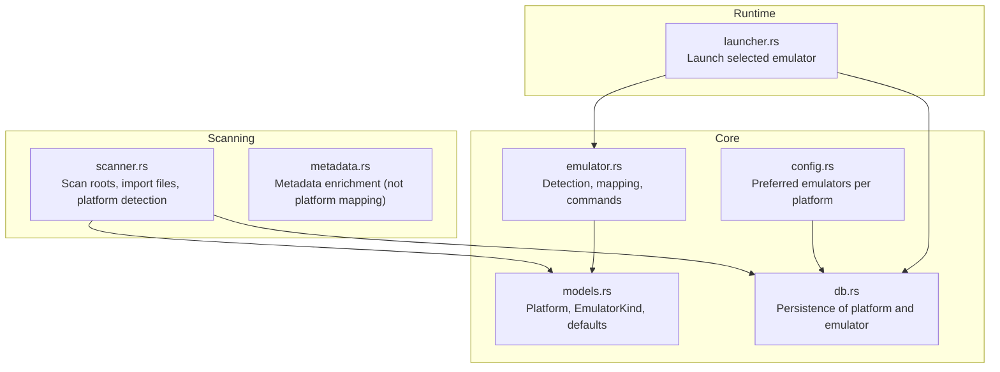
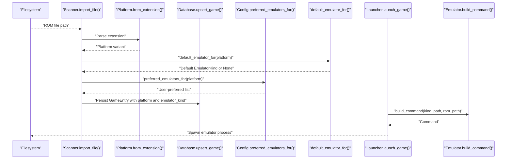
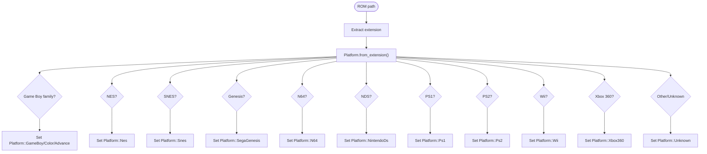
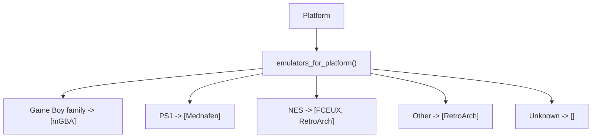
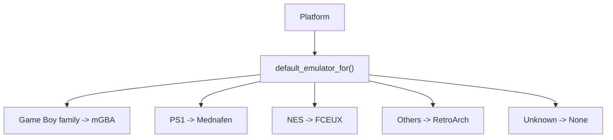
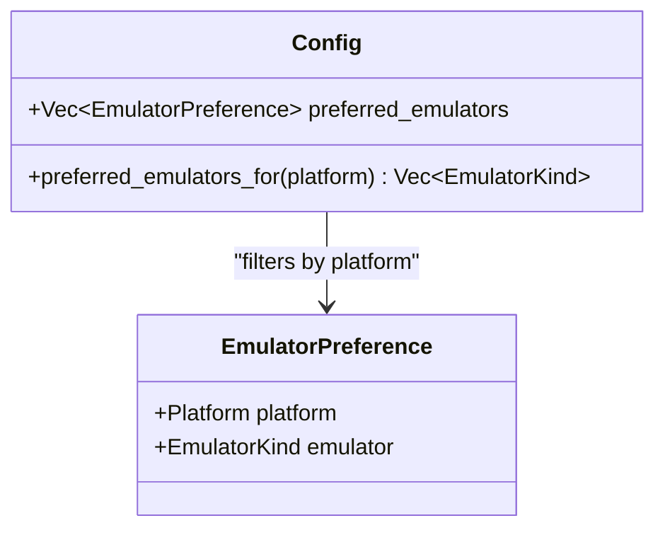
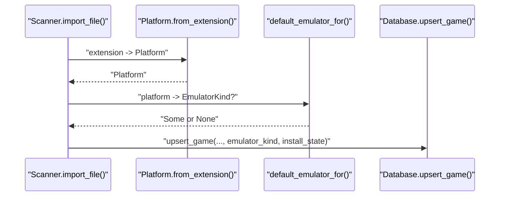
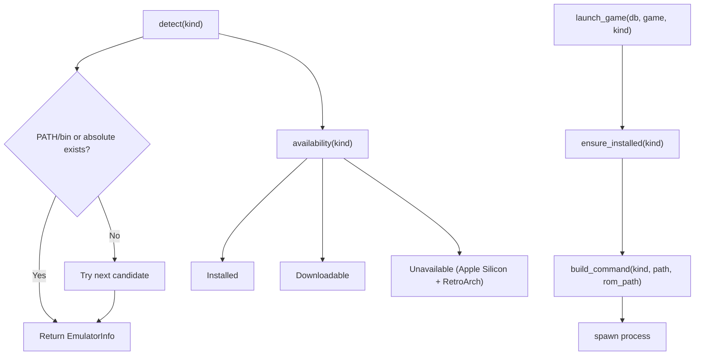
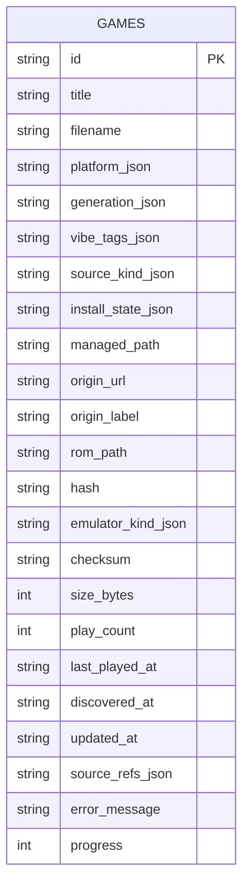
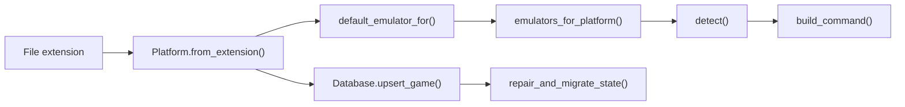

# Platform Support

<cite>
**Referenced Files in This Document**
- [emulator.rs](file://src/emulator.rs)
- [models.rs](file://src/models.rs)
- [scanner.rs](file://src/scanner.rs)
- [config.rs](file://src/config.rs)
- [db.rs](file://src/db.rs)
- [launcher.rs](file://src/launcher.rs)
- [metadata.rs](file://src/metadata.rs)
- [Cargo.toml](file://Cargo.toml)
</cite>

## Table of Contents
1. [Introduction](#introduction)
2. [Project Structure](#project-structure)
3. [Core Components](#core-components)
4. [Architecture Overview](#architecture-overview)
5. [Detailed Component Analysis](#detailed-component-analysis)
6. [Dependency Analysis](#dependency-analysis)
7. [Performance Considerations](#performance-considerations)
8. [Troubleshooting Guide](#troubleshooting-guide)
9. [Conclusion](#conclusion)

## Introduction
This document explains how the project supports multiple gaming platforms and maps them to appropriate emulators. It covers:
- The platform detection mechanism based on ROM file extensions
- The emulators_for_platform() mapping system and rationale for each platform
- How ROM platform identification influences emulator selection
- Platform-specific limitations, feature differences, and optimization considerations
- Unknown platform handling and fallback strategies
- Preferred emulator configuration and runtime selection

## Project Structure
The platform and emulator support spans several modules:
- Platform and emulator enums, and platform-to-emulator defaults
- ROM scanning and platform detection from file extensions
- Emulator detection, availability, and launch command building
- User preferences for preferred emulators per platform
- Database persistence of platform and emulator assignments
- Launcher integration for invoking emulators

**Diagram sources**
- [models.rs:8-106](file://src/models.rs#L8-L106)
- [emulator.rs:45-61](file://src/emulator.rs#L45-L61)
- [config.rs:106-113](file://src/config.rs#L106-L113)
- [db.rs:52-76](file://src/db.rs#L52-L76)
- [scanner.rs:158-273](file://src/scanner.rs#L158-L273)
- [metadata.rs:237-369](file://src/metadata.rs#L237-L369)
- [launcher.rs:9-27](file://src/launcher.rs#L9-L27)

**Section sources**
- [models.rs:8-106](file://src/models.rs#L8-L106)
- [emulator.rs:45-61](file://src/emulator.rs#L45-L61)
- [config.rs:106-113](file://src/config.rs#L106-L113)
- [db.rs:52-76](file://src/db.rs#L52-L76)
- [scanner.rs:158-273](file://src/scanner.rs#L158-L273)
- [metadata.rs:237-369](file://src/metadata.rs#L237-L369)
- [launcher.rs:9-27](file://src/launcher.rs#L9-L27)

## Core Components
- Platform enumeration and extension-to-platform mapping
- Emulator kinds and default mapping per platform
- Scanner that detects platform from ROM extension and sets install state
- Emulator detection, availability, and command construction
- User preferences for preferred emulators per platform
- Database persistence of platform, emulator assignment, and install state

**Section sources**
- [models.rs:8-106](file://src/models.rs#L8-L106)
- [scanner.rs:158-273](file://src/scanner.rs#L158-L273)
- [emulator.rs:27-127](file://src/emulator.rs#L27-L127)
- [config.rs:106-113](file://src/config.rs#L106-L113)
- [db.rs:52-76](file://src/db.rs#L52-L76)

## Architecture Overview
The platform-to-emulator mapping is centralized and used across scanning, configuration, and launching.

**Diagram sources**
- [scanner.rs:193-265](file://src/scanner.rs#L193-L265)
- [models.rs:62-76](file://src/models.rs#L62-L76)
- [models.rs:353-369](file://src/models.rs#L353-L369)
- [config.rs:106-112](file://src/config.rs#L106-L112)
- [db.rs:625-689](file://src/db.rs#L625-L689)
- [launcher.rs:9-27](file://src/launcher.rs#L9-L27)
- [emulator.rs:110-127](file://src/emulator.rs#L110-L127)

## Detailed Component Analysis

### Platform Detection and ROM Identification
- Platforms are represented as an enum with display labels and short labels.
- Platform detection is performed by mapping ROM file extensions to platform variants.
- Supported extensions include Game Boy (.gb, .gbc, .gba), NES (.nes), SNES (.sfc/.smc), Genesis (.gen/.md/.smd), N64 (.n64/.z64/.v64), PS1 (.cue/.chd/.m3u/.bin/.img/.iso), NDS (.nds), PS2 (.iso.ps2), Wii, and Xbox 360.
- Unknown extensions map to Unknown platform.

**Diagram sources**
- [models.rs:62-76](file://src/models.rs#L62-L76)

**Section sources**
- [models.rs:8-106](file://src/models.rs#L8-L106)

### Emulator Mapping System (emulators_for_platform)
The mapping determines which emulators are available for a given platform. The function returns a vector of EmulatorKind values.

- Game Boy family (Game Boy, Game Boy Color, Game Boy Advance): mGBA
- PlayStation 1: Mednafen
- NES: FCEUX, RetroArch
- SNES, Genesis, N64, Nintendo DS, PS2, Wii, Xbox 360: RetroArch
- Unknown: empty list

**Diagram sources**
- [emulator.rs:45-61](file://src/emulator.rs#L45-L61)

**Section sources**
- [emulator.rs:45-61](file://src/emulator.rs#L45-L61)

### Default Emulator Selection (default_emulator_for)
A convenience function returns a single preferred emulator for a platform, used during import and initial assignment.

- Game Boy family: mGBA
- PS1: Mednafen
- NES: FCEUX
- Others: RetroArch
- Unknown: None

**Diagram sources**
- [models.rs:353-369](file://src/models.rs#L353-L369)

**Section sources**
- [models.rs:353-369](file://src/models.rs#L353-L369)

### User Preferences for Preferred Emulators
Users can configure preferred emulators per platform. The configuration loader initializes defaults for Game Boy family and PS1/NES, and exposes a method to query preferred emulators for a given platform.

- Defaults include mGBA for Game Boy family and Mednafen/FCEUX for PS1/NES.
- The method preferred_emulators_for(platform) filters the configured list.

**Diagram sources**
- [config.rs:19-32](file://src/config.rs#L19-L32)
- [config.rs:106-112](file://src/config.rs#L106-L112)

**Section sources**
- [config.rs:106-113](file://src/config.rs#L106-L113)

### Scanner and Install State Resolution
During import, the scanner:
- Detects platform from ROM extension
- Assigns default emulator via default_emulator_for
- Sets install state to Ready if a default emulator exists, otherwise Unsupported
- Persists the GameEntry to the database

**Diagram sources**
- [scanner.rs:193-265](file://src/scanner.rs#L193-L265)
- [models.rs:353-369](file://src/models.rs#L353-L369)
- [db.rs:625-689](file://src/db.rs#L625-L689)

**Section sources**
- [scanner.rs:193-273](file://src/scanner.rs#L193-L273)
- [db.rs:625-689](file://src/db.rs#L625-L689)

### Emulator Detection, Availability, and Launch Commands
- Emulator detection attempts multiple candidate names and macOS-specific paths for RetroArch.
- Availability checks whether an emulator is installed, downloadable, or unavailable (e.g., RetroArch on Apple Silicon requires Rosetta).
- Launch command building passes ROM path arguments depending on emulator kind.
- RetroArch currently throws an error indicating core selection is not configured.

**Diagram sources**
- [emulator.rs:27-127](file://src/emulator.rs#L27-L127)

**Section sources**
- [emulator.rs:27-127](file://src/emulator.rs#L27-L127)
- [launcher.rs:9-27](file://src/launcher.rs#L9-L27)

### Database Persistence of Platform and Emulator Assignments
- Games table stores platform_json, emulator_kind_json, and install_state_json.
- Repair and migration logic resets emulator_kind to the default if it is unsupported or differs from the preferred default.
- Launcher updates the emulator_kind upon successful launch.

**Diagram sources**
- [db.rs:52-76](file://src/db.rs#L52-L76)

**Section sources**
- [db.rs:242-261](file://src/db.rs#L242-L261)
- [db.rs:748-759](file://src/db.rs#L748-L759)

## Dependency Analysis
- Platform detection depends on file extension parsing.
- Emulator mapping depends on Platform enum variants.
- Scanner depends on Platform and default_emulator_for to set install state and emulator_kind.
- Emulator detection and command building depend on EmulatorKind and platform mapping.
- Database persists platform and emulator_kind, and repair logic ensures consistency.

**Diagram sources**
- [models.rs:62-76](file://src/models.rs#L62-L76)
- [models.rs:353-369](file://src/models.rs#L353-L369)
- [emulator.rs:45-61](file://src/emulator.rs#L45-L61)
- [emulator.rs:27-127](file://src/emulator.rs#L27-L127)
- [db.rs:625-689](file://src/db.rs#L625-L689)
- [db.rs:242-261](file://src/db.rs#L242-L261)

**Section sources**
- [models.rs:62-76](file://src/models.rs#L62-L76)
- [models.rs:353-369](file://src/models.rs#L353-L369)
- [emulator.rs:45-61](file://src/emulator.rs#L45-L61)
- [emulator.rs:27-127](file://src/emulator.rs#L27-L127)
- [db.rs:625-689](file://src/db.rs#L625-L689)
- [db.rs:242-261](file://src/db.rs#L242-L261)

## Performance Considerations
- Platform detection is O(1) per file via extension mapping.
- Emulator mapping is O(1) via a single match arm.
- Database writes occur in bulk during import and repair; ensure indexing on hash/title for fast lookups.
- RetroArch command construction currently fails; avoid selecting RetroArch until core selection is implemented.

## Troubleshooting Guide
- Unknown platform mapping: When an extension does not match any supported platform, the platform resolves to Unknown, and default_emulator_for returns None. Install state becomes Unsupported. Users should verify ROM file extensions or add support for new platforms.
- RetroArch on Apple Silicon: Availability is marked Unavailable due to Rosetta requirement. The project intentionally avoids auto-installing RetroArch on Apple Silicon to prevent dependency issues.
- Unsupported emulators: If a previously selected emulator is no longer supported for a platform, the repair routine resets it to the default. After repair, the emulator_kind aligns with emulators_for_platform().
- Launch failures: If build_command returns an error (e.g., RetroArch core selection not configured), ensure the emulator is properly installed and configured. For RetroArch, select a core before launching.

**Section sources**
- [models.rs:62-76](file://src/models.rs#L62-L76)
- [models.rs:353-369](file://src/models.rs#L353-L369)
- [emulator.rs:83-100](file://src/emulator.rs#L83-L100)
- [emulator.rs:110-127](file://src/emulator.rs#L110-L127)
- [db.rs:242-261](file://src/db.rs#L242-L261)
- [db.rs:920-972](file://src/db.rs#L920-L972)

## Conclusion
The platform support system centers on robust ROM extension-to-platform detection and a clear mapping to emulators. The design:
- Uses explicit platform variants and extension mapping for reliability
- Provides sensible defaults per platform
- Allows user preferences to override defaults
- Persists platform and emulator assignments with repair logic to maintain consistency
- Handles Unknown platforms gracefully with Unsupported install state
- Documents limitations (e.g., RetroArch on Apple Silicon) and provides fallback strategies