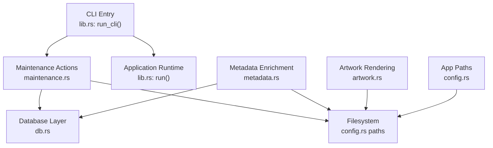
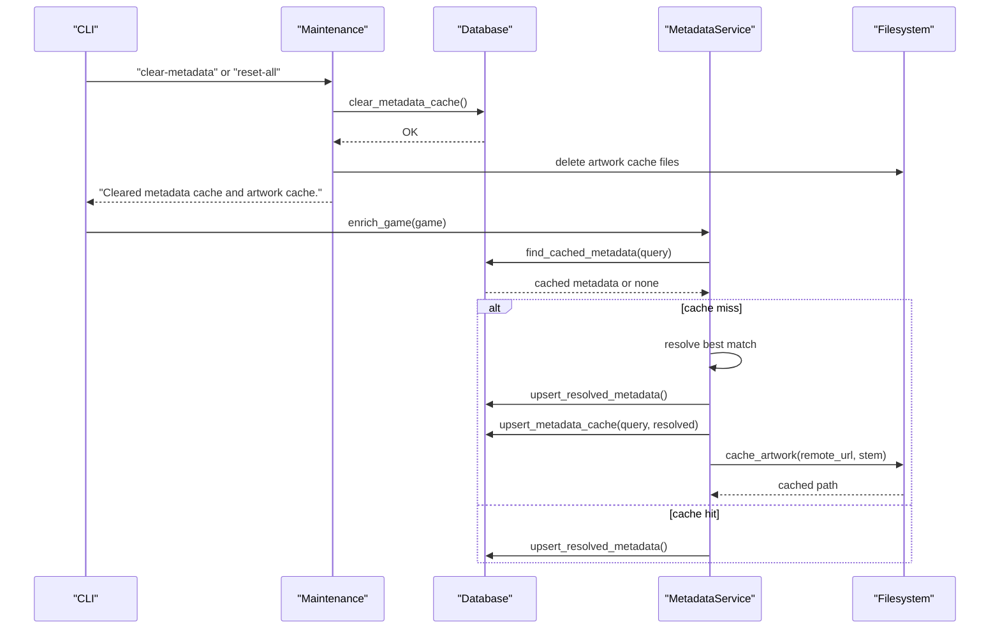
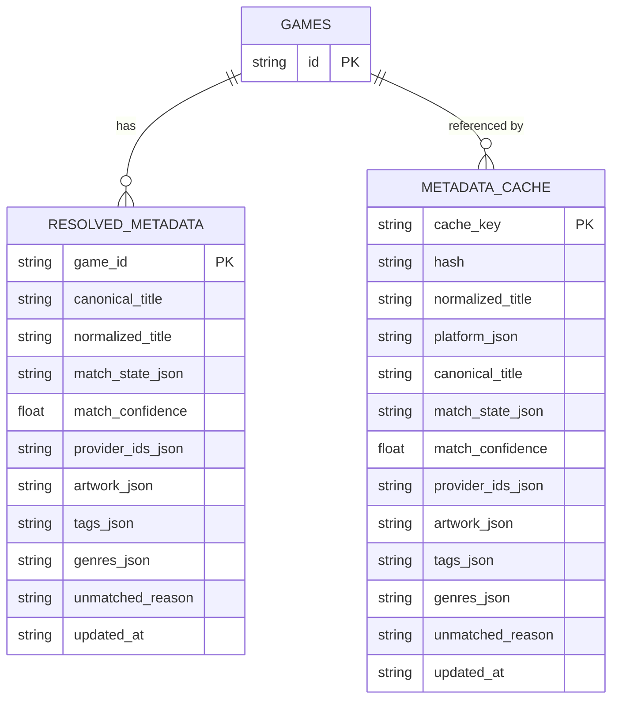
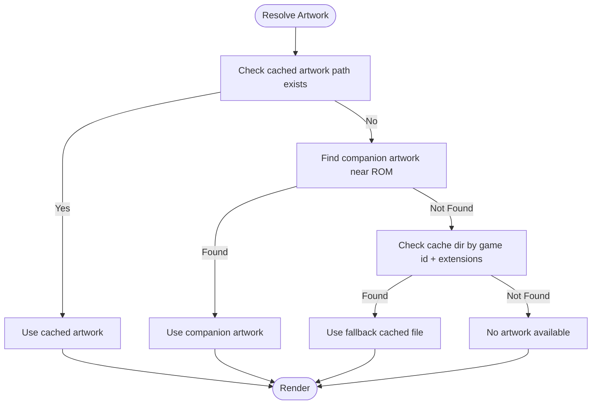
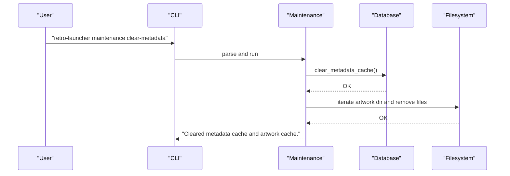
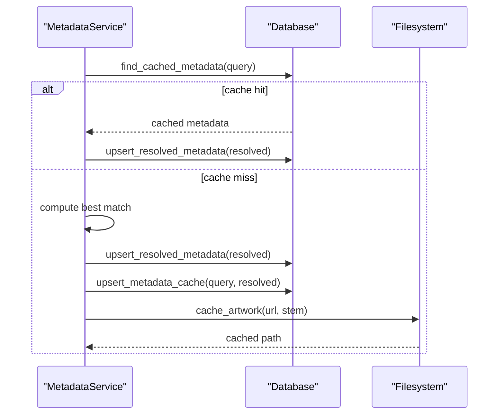
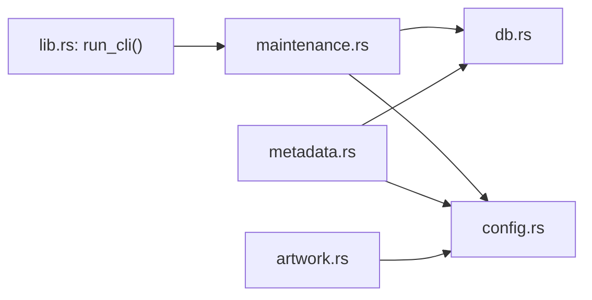

# Cache Management

<cite>
**Referenced Files in This Document**
- [lib.rs](file://src/lib.rs)
- [main.rs](file://src/main.rs)
- [config.rs](file://src/config.rs)
- [db.rs](file://src/db.rs)
- [metadata.rs](file://src/metadata.rs)
- [artwork.rs](file://src/artwork.rs)
- [maintenance.rs](file://src/maintenance.rs)
</cite>

## Table of Contents
1. [Introduction](#introduction)
2. [Project Structure](#project-structure)
3. [Core Components](#core-components)
4. [Architecture Overview](#architecture-overview)
5. [Detailed Component Analysis](#detailed-component-analysis)
6. [Dependency Analysis](#dependency-analysis)
7. [Performance Considerations](#performance-considerations)
8. [Troubleshooting Guide](#troubleshooting-guide)
9. [Conclusion](#conclusion)
10. [Appendices](#appendices)

## Introduction
This document explains cache management and cleanup operations in the project. It covers:
- Metadata cache clearing and invalidation
- Artwork cache invalidation and rendering
- Temporary file cleanup procedures
- Cache storage locations and directory structure
- Cache invalidation triggers and rebuilding processes
- Cache directory structure, file naming conventions, and expiration policies
- Manual cleanup, size optimization, and performance monitoring
- Corruption detection and recovery
- Maintenance scheduling and automated cleanup
- Troubleshooting, performance impact assessment, and storage optimization

## Project Structure
The cache system spans configuration, database, metadata enrichment, artwork rendering, and maintenance utilities. The CLI routes maintenance commands to dedicated handlers.

**Diagram sources**
- [lib.rs:24-38](file://src/lib.rs#L24-L38)
- [maintenance.rs:28-87](file://src/maintenance.rs#L28-L87)
- [db.rs:543-831](file://src/db.rs#L543-L831)
- [metadata.rs:323-368](file://src/metadata.rs#L323-L368)
- [artwork.rs:215-246](file://src/artwork.rs#L215-L246)
- [config.rs:35-64](file://src/config.rs#L35-L64)

**Section sources**
- [lib.rs:24-38](file://src/lib.rs#L24-L38)
- [config.rs:35-64](file://src/config.rs#L35-L64)

## Core Components
- AppPaths: Defines cache and data directories, including artwork cache location under the data directory.
- Database: Provides metadata cache tables and operations, including clearing and rebuilding metadata cache.
- MetadataService: Orchestrates metadata enrichment, cache insertion, and artwork caching.
- ArtworkController: Resolves artwork from companion files, cached files, or fallbacks; renders artwork.
- Maintenance: Implements manual cache cleanup actions and repair routines.

Key responsibilities:
- Metadata cache clearing via database operations
- Artwork cache invalidation by removing cached files
- Temporary file cleanup for downloads and managed content
- Cache rebuild triggered by enrichment and repair operations

**Section sources**
- [config.rs:10-17](file://src/config.rs#L10-L17)
- [db.rs:96-113](file://src/db.rs#L96-L113)
- [db.rs:761-766](file://src/db.rs#L761-L766)
- [metadata.rs:279-321](file://src/metadata.rs#L279-L321)
- [metadata.rs:349-368](file://src/metadata.rs#L349-L368)
- [artwork.rs:215-246](file://src/artwork.rs#L215-L246)
- [maintenance.rs:8-26](file://src/maintenance.rs#L8-L26)

## Architecture Overview
The cache lifecycle integrates metadata enrichment and artwork retrieval with persistent storage and filesystem caching.

**Diagram sources**
- [maintenance.rs:36-46](file://src/maintenance.rs#L36-L46)
- [db.rs:761-766](file://src/db.rs#L761-L766)
- [db.rs:587-623](file://src/db.rs#L587-L623)
- [db.rs:543-585](file://src/db.rs#L543-L585)
- [metadata.rs:279-321](file://src/metadata.rs#L279-L321)
- [metadata.rs:349-368](file://src/metadata.rs#L349-L368)

## Detailed Component Analysis

### Metadata Cache Management
- Storage: Two tables store metadata state and cache:
  - resolved_metadata: per-game resolved metadata
  - metadata_cache: keyed cache entries for fast lookup
- Keys: Composite keys include hash and title+platform combinations.
- Operations:
  - Upsert resolved metadata and cache entries after enrichment
  - Find cached metadata using multiple cache keys
  - Clear cache via maintenance or repair operations

**Diagram sources**
- [db.rs:96-113](file://src/db.rs#L96-L113)
- [db.rs:543-585](file://src/db.rs#L543-L585)
- [db.rs:587-623](file://src/db.rs#L587-L623)

**Section sources**
- [db.rs:96-113](file://src/db.rs#L96-L113)
- [db.rs:820-831](file://src/db.rs#L820-L831)
- [db.rs:543-585](file://src/db.rs#L543-L585)
- [db.rs:587-623](file://src/db.rs#L587-L623)
- [db.rs:761-766](file://src/db.rs#L761-L766)

### Artwork Cache Management
- Storage location: Under the data directory in an artwork subfolder.
- Naming convention: Based on sanitized game identifiers and original extension.
- Resolution order:
  - Cached artwork file if present
  - Companion artwork files alongside ROMs
  - Fallback rendering if none found
- Invalidation: Maintenance removes all artwork cache files.

**Diagram sources**
- [artwork.rs:215-246](file://src/artwork.rs#L215-L246)
- [metadata.rs:349-368](file://src/metadata.rs#L349-L368)

**Section sources**
- [artwork.rs:215-246](file://src/artwork.rs#L215-L246)
- [metadata.rs:349-368](file://src/metadata.rs#L349-L368)
- [config.rs:38-44](file://src/config.rs#L38-L44)

### Maintenance and Cleanup Procedures
- Clear metadata cache: Deletes resolved metadata and metadata cache rows.
- Clear artwork cache: Removes all files under the artwork cache directory.
- Reset downloads: Removes launcher-managed downloads and associated DB rows.
- Reset all: Removes database, downloads, and artwork cache.

**Diagram sources**
- [lib.rs:24-38](file://src/lib.rs#L24-L38)
- [maintenance.rs:28-46](file://src/maintenance.rs#L28-L46)
- [db.rs:761-766](file://src/db.rs#L761-L766)

**Section sources**
- [maintenance.rs:8-26](file://src/maintenance.rs#L8-L26)
- [maintenance.rs:28-87](file://src/maintenance.rs#L28-L87)
- [db.rs:761-766](file://src/db.rs#L761-L766)

### Cache Rebuilding Processes
- Metadata rebuild:
  - On enrichment, if cache hit, resolved metadata is upserted from cache
  - If miss, best match is computed, resolved metadata is upserted, and cache is upserted
- Artwork rebuild:
  - If artwork URL exists, artwork is fetched and written to cache with sanitized stem and original extension
- Repair rebuild:
  - Repair migrates state and ensures cache directories exist; subsequent enrichment repopulates caches

**Diagram sources**
- [metadata.rs:279-321](file://src/metadata.rs#L279-L321)
- [metadata.rs:349-368](file://src/metadata.rs#L349-L368)
- [db.rs:543-585](file://src/db.rs#L543-L585)
- [db.rs:587-623](file://src/db.rs#L587-L623)

**Section sources**
- [metadata.rs:279-321](file://src/metadata.rs#L279-L321)
- [metadata.rs:349-368](file://src/metadata.rs#L349-L368)
- [db.rs:543-585](file://src/db.rs#L543-L585)
- [db.rs:587-623](file://src/db.rs#L587-L623)

## Dependency Analysis
- CLI depends on maintenance module for cache operations
- Maintenance depends on Database and filesystem paths
- MetadataService depends on Database and filesystem paths for artwork caching
- ArtworkController depends on filesystem paths and image decoding

**Diagram sources**
- [lib.rs:24-38](file://src/lib.rs#L24-L38)
- [maintenance.rs:28-87](file://src/maintenance.rs#L28-L87)
- [db.rs:543-585](file://src/db.rs#L543-L585)
- [metadata.rs:349-368](file://src/metadata.rs#L349-L368)
- [artwork.rs:215-246](file://src/artwork.rs#L215-L246)
- [config.rs:35-64](file://src/config.rs#L35-L64)

**Section sources**
- [lib.rs:24-38](file://src/lib.rs#L24-L38)
- [maintenance.rs:28-87](file://src/maintenance.rs#L28-L87)
- [db.rs:543-585](file://src/db.rs#L543-L585)
- [metadata.rs:349-368](file://src/metadata.rs#L349-L368)
- [artwork.rs:215-246](file://src/artwork.rs#L215-L246)
- [config.rs:35-64](file://src/config.rs#L35-L64)

## Performance Considerations
- Metadata cache reduces network and computation overhead by storing resolved metadata keyed by hash and normalized title with platform hints.
- Artwork caching avoids repeated network fetches and disk scans for artwork assets.
- Indexes on metadata cache improve lookup performance.
- Repair operations normalize URLs and reset stale associations, preventing degraded performance from broken references.

[No sources needed since this section provides general guidance]

## Troubleshooting Guide
- Symptoms: Missing artwork or stale metadata
  - Actions: Run maintenance clear-metadata to clear caches, then trigger enrichment; verify artwork cache directory exists post-repair
- Artwork load errors:
  - Causes: Corrupted or inaccessible cached files
  - Actions: Remove artwork cache files; rely on rebuild on next enrichment
- Database inconsistencies:
  - Actions: Use maintenance repair-state to normalize URLs and reset assignments; review repair report counts
- Downloads cleanup:
  - Actions: Use reset-downloads to remove launcher-managed downloads and associated DB rows

**Section sources**
- [maintenance.rs:36-46](file://src/maintenance.rs#L36-L46)
- [maintenance.rs:28-35](file://src/maintenance.rs#L28-L35)
- [db.rs:129-267](file://src/db.rs#L129-L267)
- [artwork.rs:164-177](file://src/artwork.rs#L164-L177)

## Conclusion
The cache system combines a relational metadata cache with filesystem-based artwork caching. Maintenance actions provide robust manual cleanup and repair mechanisms, while enrichment and repair routines automatically rebuild caches. Proper directory structure, naming conventions, and indexing ensure efficient cache operations and straightforward maintenance.

[No sources needed since this section summarizes without analyzing specific files]

## Appendices

### Cache Storage Locations and Directory Structure
- Database: Stored at the data directory path
- Artwork cache: Under the data directory in an artwork subfolder
- Downloads: Managed under the downloads directory

**Section sources**
- [config.rs:38-44](file://src/config.rs#L38-L44)

### Cache Invalidation Triggers
- Manual: maintenance clear-metadata and reset-all
- Automatic: repair-state during startup; artwork cache invalidated by maintenance reset-all

**Section sources**
- [maintenance.rs:36-46](file://src/maintenance.rs#L36-L46)
- [maintenance.rs:63-84](file://src/maintenance.rs#L63-L84)
- [db.rs:129-267](file://src/db.rs#L129-L267)

### Cache Expiration Policies
- No explicit TTL is implemented in code; caches are invalidated by maintenance actions and rebuild on demand during enrichment.

[No sources needed since this section provides general guidance]

### Manual Cache Cleanup Procedures
- Clear metadata cache: maintenance clear-metadata
- Clear artwork cache: maintenance clear-metadata (removes artwork files)
- Reset downloads: maintenance reset-downloads
- Reset all: maintenance reset-all (database, downloads, artwork)

**Section sources**
- [lib.rs:24-38](file://src/lib.rs#L24-L38)
- [maintenance.rs:28-87](file://src/maintenance.rs#L28-L87)

### Cache Size Optimization
- Reduce cache size by running maintenance reset-all to remove all caches and downloads, then re-enrich content as needed.

[No sources needed since this section provides general guidance]

### Cache Performance Monitoring
- Monitor repair reports to track normalization and resets performed during maintenance.
- Observe UI rendering behavior for artwork load errors to detect cache corruption.

**Section sources**
- [maintenance.rs:90-100](file://src/maintenance.rs#L90-L100)
- [artwork.rs:164-177](file://src/artwork.rs#L164-L177)

### Cache Corruption Detection and Recovery
- Detection: Artwork load errors reported in UI; missing artwork indicates corrupted or missing cache files.
- Recovery: Remove artwork cache files; repair-state ensures cache directories exist; re-enrich to rebuild caches.

**Section sources**
- [artwork.rs:164-177](file://src/artwork.rs#L164-L177)
- [db.rs:129-267](file://src/db.rs#L129-L267)

### Maintenance Scheduling and Automated Cleanup
- Schedule periodic maintenance clear-metadata to refresh metadata and artwork caches.
- Use reset-all for full reset when encountering persistent cache issues.

[No sources needed since this section provides general guidance]