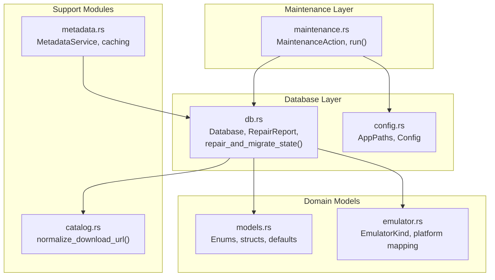
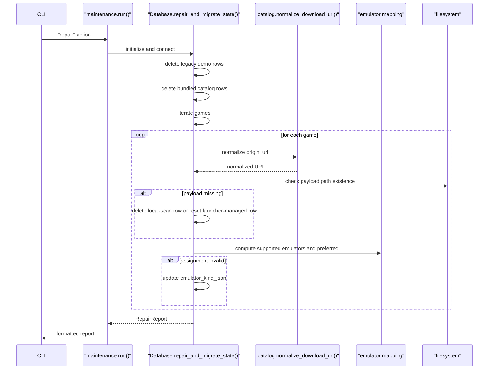
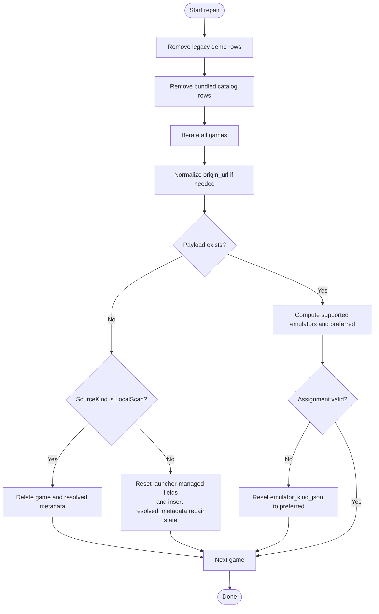
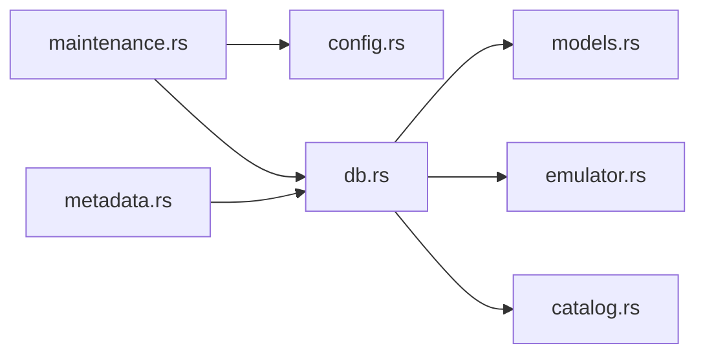

# Database Maintenance

<cite>
**Referenced Files in This Document**
- [maintenance.rs](file://src/maintenance.rs)
- [db.rs](file://src/db.rs)
- [models.rs](file://src/models.rs)
- [config.rs](file://src/config.rs)
- [catalog.rs](file://src/catalog.rs)
- [metadata.rs](file://src/metadata.rs)
- [emulator.rs](file://src/emulator.rs)
</cite>

## Table of Contents
1. [Introduction](#introduction)
2. [Project Structure](#project-structure)
3. [Core Components](#core-components)
4. [Architecture Overview](#architecture-overview)
5. [Detailed Component Analysis](#detailed-component-analysis)
6. [Dependency Analysis](#dependency-analysis)
7. [Performance Considerations](#performance-considerations)
8. [Troubleshooting Guide](#troubleshooting-guide)
9. [Conclusion](#conclusion)

## Introduction
This document describes the database maintenance subsystem responsible for repairing and migrating the application’s SQLite-backed library database. It covers the RepairReport structure and its metrics, the repair process for removing missing payloads, normalizing URLs, removing legacy demo rows, resetting broken downloads, and correcting emulator assignments. It also documents schema management, backup and recovery mechanisms, integrity verification, performance optimization, index maintenance, and health monitoring. Step-by-step procedures for manual repairs, migration scripts, and rollbacks are included, along with troubleshooting guidance for common database corruption issues.

## Project Structure
The database maintenance system spans several modules:
- Maintenance actions orchestrate operations and report outcomes.
- Database encapsulates schema initialization, migrations, and repair routines.
- Models define data structures and enums used across the system.
- Config manages filesystem paths and defaults.
- Catalog and metadata modules provide URL normalization and metadata enrichment.
- Emulator module supplies platform-to-emulator mapping and detection.

**Diagram sources**
- [maintenance.rs:1-101](file://src/maintenance.rs#L1-L101)
- [db.rs:18-267](file://src/db.rs#L18-L267)
- [config.rs:10-64](file://src/config.rs#L10-L64)
- [models.rs:8-369](file://src/models.rs#L8-L369)
- [catalog.rs:917-940](file://src/catalog.rs#L917-L940)
- [metadata.rs:237-369](file://src/metadata.rs#L237-L369)
- [emulator.rs:45-61](file://src/emulator.rs#L45-L61)

**Section sources**
- [maintenance.rs:1-101](file://src/maintenance.rs#L1-L101)
- [db.rs:18-267](file://src/db.rs#L18-L267)
- [config.rs:10-64](file://src/config.rs#L10-L64)
- [models.rs:8-369](file://src/models.rs#L8-L369)
- [catalog.rs:917-940](file://src/catalog.rs#L917-L940)
- [metadata.rs:237-369](file://src/metadata.rs#L237-L369)
- [emulator.rs:45-61](file://src/emulator.rs#L45-L61)

## Core Components
- MaintenanceAction: Enumerates maintenance operations (repair, clear metadata, reset downloads, reset all).
- Database: Encapsulates schema initialization, repair, and migration logic.
- RepairReport: Aggregates metrics from repair operations.
- AppPaths: Provides filesystem locations for database, downloads, and artwork.

Key responsibilities:
- RepairReport tracks counts for removed missing payloads, normalized URLs, removed legacy demo rows, removed bundled catalog rows, reset broken downloads, and reset emulator assignments.
- Database initializes schema, sets schema version, and runs repair-and-migrate logic.
- Maintenance orchestrator loads paths, constructs Database, executes action, and formats a human-readable report.

**Section sources**
- [maintenance.rs:8-26](file://src/maintenance.rs#L8-L26)
- [maintenance.rs:28-88](file://src/maintenance.rs#L28-L88)
- [db.rs:25-33](file://src/db.rs#L25-L33)
- [db.rs:119-127](file://src/db.rs#L119-L127)
- [db.rs:129-267](file://src/db.rs#L129-L267)
- [config.rs:10-44](file://src/config.rs#L10-L44)

## Architecture Overview
The maintenance flow integrates with the database layer to perform repairs and migrations atomically within a single connection transaction. The repair routine:
- Removes legacy demo rows and bundled catalog rows.
- Normalizes URLs using catalog normalization.
- Detects missing payloads and either deletes local-scan rows or resets launcher-managed rows.
- Resets emulator assignments to supported defaults for the platform.

**Diagram sources**
- [maintenance.rs:28-35](file://src/maintenance.rs#L28-L35)
- [db.rs:129-267](file://src/db.rs#L129-L267)
- [catalog.rs:917-940](file://src/catalog.rs#L917-L940)
- [emulator.rs:45-61](file://src/emulator.rs#L45-L61)

## Detailed Component Analysis

### RepairReport Metrics
The RepairReport aggregates counts for:
- removed_missing_payloads: Rows deleted or reset due to missing payloads.
- normalized_urls: Count of origin URLs normalized to HTTPS raw GitHub links.
- removed_legacy_demo_rows: Legacy demo catalog rows removed.
- removed_bundled_catalog_rows: Bundled catalog rows removed when both managed_path and rom_path are null.
- reset_broken_downloads: Launcher-managed rows whose payloads are missing; fields cleared and error messages set.
- reset_emulator_assignments: Rows whose emulator assignments were corrected to supported defaults.

These metrics are surfaced in the maintenance output for transparency.

**Section sources**
- [db.rs:25-33](file://src/db.rs#L25-L33)
- [maintenance.rs:90-100](file://src/maintenance.rs#L90-L100)

### Repair Process Details
- Legacy rows removal:
  - Removes rows where origin_label equals a legacy demo label.
  - Removes rows where source_kind is Catalog, origin_label matches a bundled catalog label, and both managed_path and rom_path are null.
- URL normalization:
  - Normalizes origin_url to HTTPS raw GitHub URLs when applicable.
- Payload validation:
  - For each game, checks payload path existence (managed_path or rom_path).
  - If missing and source_kind is LocalScan, deletes the row and associated resolved metadata.
  - Otherwise, clears payload-related fields, sets install_state to DownloadAvailable, and records an error message; inserts or updates resolved_metadata with a repair-needed state.
- Emulator assignment correction:
  - Computes supported emulators for the platform and determines the preferred emulator.
  - Resets emulator_kind_json to the preferred emulator if the current assignment is unsupported or differs from the preferred emulator.

**Diagram sources**
- [db.rs:129-267](file://src/db.rs#L129-L267)

**Section sources**
- [db.rs:129-267](file://src/db.rs#L129-L267)

### Schema Initialization and Migration
- Schema initialization creates tables and indexes if they do not exist, then sets the schema version.
- CURRENT_SCHEMA_VERSION is defined and stored in schema_meta.
- Indexes include:
  - idx_games_hash and idx_games_title on the games table.
  - idx_metadata_cache_hash and idx_metadata_cache_title on the metadata_cache table.

Schema version management ensures migration readiness and integrity checks.

**Section sources**
- [db.rs:48-117](file://src/db.rs#L48-L117)
- [db.rs:119-127](file://src/db.rs#L119-L127)

### Maintenance Actions
- Repair: Executes repair_and_migrate_state and formats a report summarizing metrics.
- ClearMetadata: Clears resolved_metadata and metadata_cache, and removes artwork cache files.
- ResetDownloads: Deletes launcher-managed rows whose paths reside under the downloads directory and removes downloaded files.
- ResetAll: Removes the database file, downloads directory contents, and artwork cache files.

**Section sources**
- [maintenance.rs:8-26](file://src/maintenance.rs#L8-L26)
- [maintenance.rs:28-88](file://src/maintenance.rs#L28-L88)

### URL Normalization
- normalize_download_url converts GitHub blob URLs to raw.githubusercontent.com URLs when scheme is https and host is github.com.
- Applied during catalog loading and during repair for origin_url normalization.

**Section sources**
- [catalog.rs:917-940](file://src/catalog.rs#L917-L940)
- [db.rs:185-194](file://src/db.rs#L185-L194)

### Emulator Assignment Correction
- default_emulator_for maps platforms to preferred emulators.
- emulators_for_platform lists supported emulators for a given platform.
- During repair, if the stored emulator_kind is unsupported or differs from the preferred emulator, it is reset.

**Section sources**
- [models.rs:353-369](file://src/models.rs#L353-L369)
- [emulator.rs:45-61](file://src/emulator.rs#L45-L61)
- [db.rs:242-260](file://src/db.rs#L242-L260)

### Metadata Caching and Integrity
- MetadataService enriches games with resolved metadata and caches results.
- Metadata cache keys include hash and title+platform combinations.
- Integrity is maintained by updating resolved_metadata and metadata_cache atomically.

**Section sources**
- [metadata.rs:237-369](file://src/metadata.rs#L237-L369)
- [db.rs:820-831](file://src/db.rs#L820-L831)

## Dependency Analysis
- maintenance.rs depends on config.rs for paths and db.rs for RepairReport and repair operations.
- db.rs depends on models.rs for enums and structs, emulator.rs for platform-to-emulator mapping, and catalog.rs for URL normalization.
- metadata.rs depends on db.rs for caching and resolved metadata storage.

**Diagram sources**
- [maintenance.rs:5-6](file://src/maintenance.rs#L5-L6)
- [db.rs:13-16](file://src/db.rs#L13-L16)
- [metadata.rs:9-11](file://src/metadata.rs#L9-L11)

**Section sources**
- [maintenance.rs:5-6](file://src/maintenance.rs#L5-L6)
- [db.rs:13-16](file://src/db.rs#L13-L16)
- [metadata.rs:9-11](file://src/metadata.rs#L9-L11)

## Performance Considerations
- Single-pass iteration over games: The repair routine iterates once over all games, minimizing repeated scans.
- Efficient URL normalization: normalize_download_url short-circuits for non-GitHub or non-HTTPS URLs.
- Atomic updates: Updates to games and resolved_metadata are performed within the same transaction to reduce overhead.
- Index usage: Hash and title indexes accelerate lookups for metadata and deduplication scenarios.
- Metadata caching: Reduces repeated network calls and computation by storing resolved metadata and cache entries.

[No sources needed since this section provides general guidance]

## Troubleshooting Guide

Common issues and resolutions:
- Missing payloads for launcher-managed downloads:
  - Symptom: Games show DownloadAvailable with an error indicating missing payload.
  - Resolution: Run maintenance reset-downloads to remove launcher-managed rows and downloaded files, then re-add sources.
  - Procedure: maintenance run reset-downloads
- Missing payloads for local scans:
  - Symptom: Games disappear after scanning if their files are moved or deleted.
  - Resolution: Run maintenance repair to delete rows with missing payloads.
  - Procedure: maintenance run repair
- Broken emulator assignments:
  - Symptom: Games show Unsupported or Missing Emulator despite having emulators installed.
  - Resolution: Run maintenance repair to reset emulator assignments to supported defaults.
  - Procedure: maintenance run repair
- Legacy demo or bundled catalog rows:
  - Symptom: Duplicate or outdated rows appear in the library.
  - Resolution: Run maintenance repair to remove legacy and bundled rows.
  - Procedure: maintenance run repair
- Corrupted metadata cache:
  - Symptom: Incorrect metadata or stale artwork.
  - Resolution: Clear metadata cache and re-enrich games.
  - Procedure: maintenance run clear-metadata
- Reset all:
  - Symptom: Persistent corruption or configuration drift.
  - Resolution: Reset database, downloads, and artwork cache.
  - Procedure: maintenance run reset-all

Backup and recovery:
- Backup: Copy the database file located at AppPaths.db_path before performing maintenance.
- Recovery: Restore the database file from backup if repair fails to fix issues.

Integrity verification:
- After repair, verify:
  - No rows with missing payloads remain for launcher-managed sources.
  - Emulator assignments match supported emulators for each platform.
  - URLs are normalized to HTTPS raw GitHub links where applicable.
  - Metadata cache entries are consistent with resolved metadata.

Rollback procedures:
- If a repair introduces regressions, restore from the pre-repair backup.
- For targeted fixes, selectively revert specific operations (e.g., re-add removed rows, restore previous emulator assignments).

**Section sources**
- [maintenance.rs:28-88](file://src/maintenance.rs#L28-L88)
- [db.rs:129-267](file://src/db.rs#L129-L267)
- [config.rs:35-44](file://src/config.rs#L35-L44)

## Conclusion
The database maintenance subsystem provides robust repair and migration capabilities, ensuring a healthy and performant library database. By leveraging RepairReport metrics, schema versioning, and targeted cleanup operations, it maintains data integrity and improves user experience. The documented procedures enable safe manual interventions, backups, and rollbacks, while performance optimizations and indexing support efficient operations.