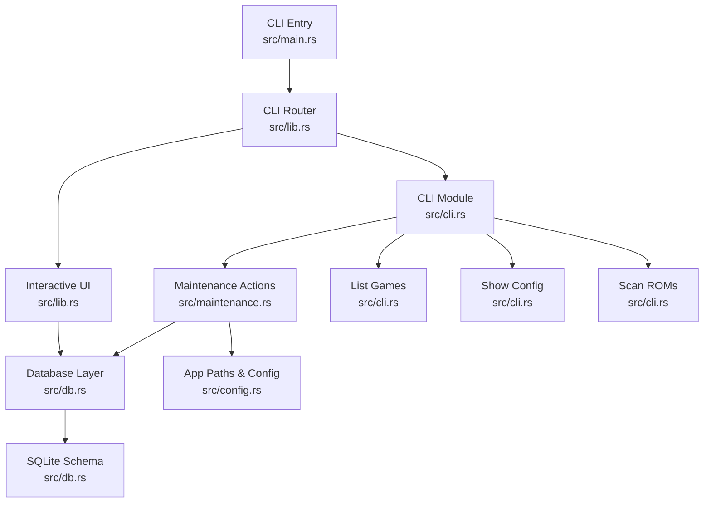
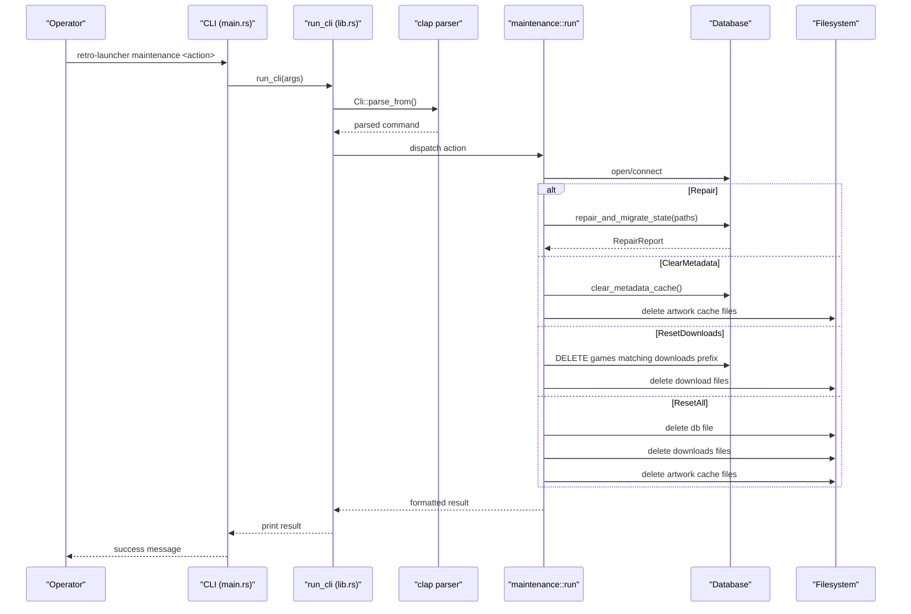
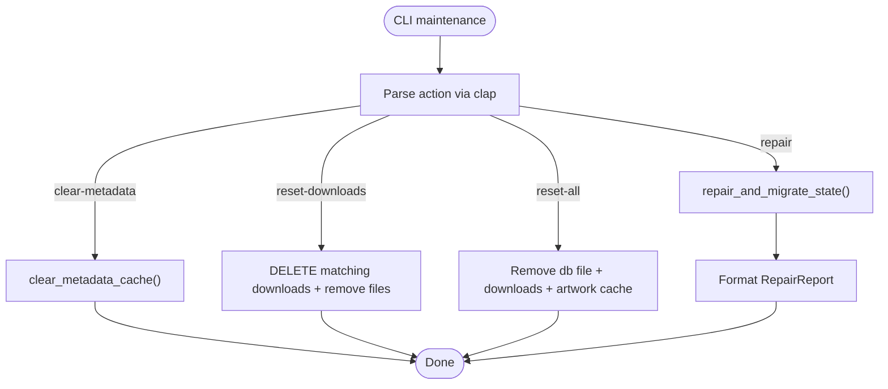
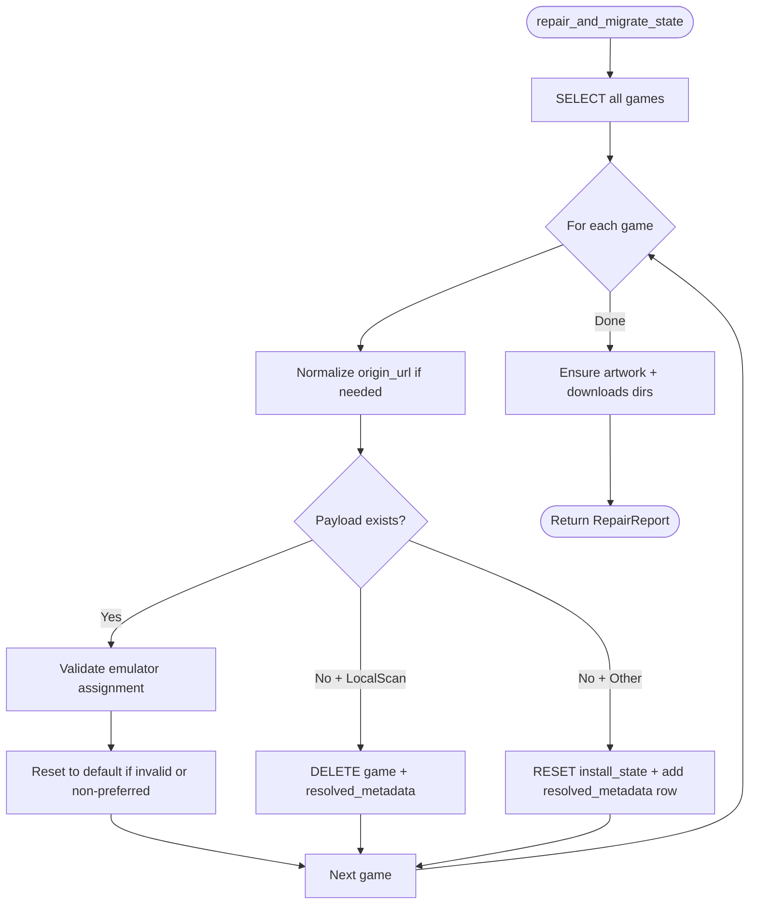
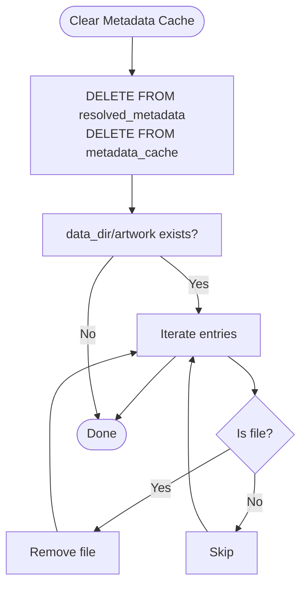
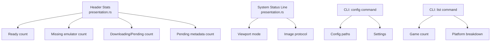
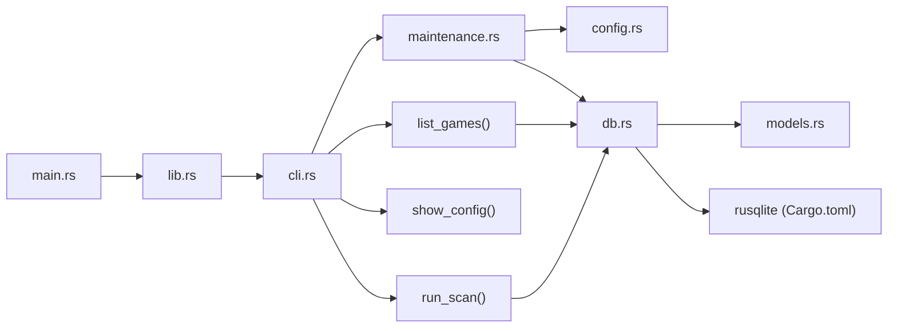

# Maintenance and Operations

<cite>
**Referenced Files in This Document**
- [lib.rs](file://src/lib.rs)
- [main.rs](file://src/main.rs)
- [cli.rs](file://src/cli.rs)
- [maintenance.rs](file://src/maintenance.rs)
- [db.rs](file://src/db.rs)
- [config.rs](file://src/config.rs)
- [models.rs](file://src/models.rs)
- [error.rs](file://src/error.rs)
- [Cargo.toml](file://Cargo.toml)
</cite>

## Table of Contents
1. [Introduction](#introduction)
2. [Project Structure](#project-structure)
3. [Core Components](#core-components)
4. [Architecture Overview](#architecture-overview)
5. [Detailed Component Analysis](#detailed-component-analysis)
6. [Dependency Analysis](#dependency-analysis)
7. [Performance Considerations](#performance-considerations)
8. [Troubleshooting Guide](#troubleshooting-guide)
9. [Conclusion](#conclusion)
10. [Appendices](#appendices)

## Introduction
This document describes system maintenance and operational procedures for the retro-launcher. It covers database repair and migration, cache management and cleanup, operational health monitoring, troubleshooting, performance optimization, preventive maintenance, backup and recovery, logs and diagnostics, maintenance commands, and operational best practices. The content is derived from the repository's CLI entry points, maintenance actions, database schema and repair logic, configuration model, and error handling.

## Project Structure
The application exposes a CLI that routes to either the interactive UI or the maintenance subsystem. Maintenance actions operate against the SQLite-backed library database and filesystem caches.



**Diagram sources**
- [main.rs:1-12](file://src/main.rs#L1-L12)
- [lib.rs:24-45](file://src/lib.rs#L24-L45)
- [cli.rs:9-69](file://src/cli.rs#L9-L69)
- [maintenance.rs:28-101](file://src/maintenance.rs#L28-L101)
- [db.rs:35-117](file://src/db.rs#L35-L117)
- [config.rs:34-64](file://src/config.rs#L34-L64)

**Section sources**
- [main.rs:1-12](file://src/main.rs#L1-L12)
- [lib.rs:24-45](file://src/lib.rs#L24-L45)
- [cli.rs:9-69](file://src/cli.rs#L9-L69)
- [config.rs:34-64](file://src/config.rs#L34-L64)

## Core Components
- CLI module: Parses commands using clap and dispatches to appropriate handlers. See [src/cli.rs:1-185](file://src/cli.rs#L1-L185).
- Maintenance subsystem: Executes repair, metadata cache clearing, downloads reset, and full reset operations.
- Database layer: Initializes schema, runs repair/migration, manages metadata cache, and exposes CRUD operations for game/library records.
- Configuration and paths: Resolves OS-appropriate directories for config, data, downloads, and the SQLite database.
- Error model: Provides structured error types and user/technical messages for diagnostics.

Key responsibilities:
- Cli module parses arguments and dispatches to maintenance or other handlers.
- MaintenanceAction enum defines available maintenance operations.
- Database::repair_and_migrate_state performs schema normalization, legacy cleanup, and emulator assignment resets.
- Database::clear_metadata_cache clears resolved metadata and metadata cache tables.
- App paths define locations for database and caches.

**Section sources**
- [cli.rs:1-185](file://src/cli.rs#L1-L185)
- [maintenance.rs:8-30](file://src/maintenance.rs#L8-L30)
- [maintenance.rs:28-101](file://src/maintenance.rs#L28-L101)
- [db.rs:25-33](file://src/db.rs#L25-L33)
- [db.rs:129-267](file://src/db.rs#L129-L267)
- [db.rs:761-766](file://src/db.rs#L761-L766)
- [config.rs:10-17](file://src/config.rs#L10-L17)
- [config.rs:34-64](file://src/config.rs#L34-L64)
- [error.rs:10-98](file://src/error.rs#L10-L98)

## Architecture Overview
The CLI workflow uses clap for argument parsing and dispatches to the appropriate handler. Maintenance operations load configuration and paths, open the database, and execute the requested operation. The database layer encapsulates schema initialization, repair/migration, and cache operations.



**Diagram sources**
- [main.rs:3-12](file://src/main.rs#L3-L12)
- [lib.rs:24-45](file://src/lib.rs#L24-L45)
- [cli.rs:9-69](file://src/cli.rs#L9-L69)
- [maintenance.rs:28-101](file://src/maintenance.rs#L28-L101)
- [db.rs:129-267](file://src/db.rs#L129-L267)
- [db.rs:761-766](file://src/db.rs#L761-L766)

**Section sources**
- [main.rs:3-12](file://src/main.rs#L3-L12)
- [lib.rs:24-45](file://src/lib.rs#L24-L45)
- [cli.rs:9-69](file://src/cli.rs#L9-L69)
- [maintenance.rs:28-101](file://src/maintenance.rs#L28-L101)
- [db.rs:129-267](file://src/db.rs#L129-L267)

## Detailed Component Analysis

### CLI Commands
The CLI provides several commands for library management:

#### List Command
```bash
retro-launcher list [OPTIONS]
```
- Lists all games in the library
- Supports filtering by platform (`--platform`, `-p`)
- Supports output formats: table (default), json (`--format`, `-f`)

#### Config Command
```bash
retro-launcher config
```
- Displays configuration paths and current settings
- Shows ROM roots, preferred emulators, and directory locations

#### Scan Command
```bash
retro-launcher scan
```
- Manually triggers ROM directory scanning
- Imports newly discovered games into the database

**Section sources**
- [cli.rs:32-43](file://src/cli.rs#L32-L43)
- [cli.rs:71-155](file://src/cli.rs#L71-L155)

### Maintenance Commands
Supported maintenance actions:
- repair: Repairs and migrates state by normalizing URLs, removing missing payloads, resetting broken downloads, and resetting emulator assignments.
- clear-metadata: Clears resolved metadata and metadata cache tables and removes artwork cache files.
- reset-downloads: Removes launcher-managed downloads and associated DB rows.
- reset-all: Deletes the database file, downloads directory contents, and artwork cache files.

Operational behavior:
- Loads configuration and resolves paths via Config::load_or_create.
- Opens the database at the resolved db_path.
- Executes the selected maintenance action and prints a formatted result.



**Diagram sources**
- [lib.rs:24-45](file://src/lib.rs#L24-L45)
- [cli.rs:45-59](file://src/cli.rs#L45-L59)
- [maintenance.rs:16-30](file://src/maintenance.rs#L16-L30)
- [maintenance.rs:28-101](file://src/maintenance.rs#L28-L101)
- [db.rs:129-267](file://src/db.rs#L129-L267)
- [db.rs:761-766](file://src/db.rs#L761-L766)

**Section sources**
- [lib.rs:24-45](file://src/lib.rs#L24-L45)
- [cli.rs:45-59](file://src/cli.rs#L45-L59)
- [maintenance.rs:8-30](file://src/maintenance.rs#L8-L30)
- [maintenance.rs:28-101](file://src/maintenance.rs#L28-L101)

### Database Repair and Migration
The repair routine performs:
- Normalization of origin URLs to a canonical form.
- Removal of rows with missing payloads for local scans.
- Reset of metadata and install state for missing payloads for non-local sources.
- Cleanup of legacy demo and bundled catalog rows.
- Reset of emulator assignments to defaults when incompatible or ambiguous.

It also ensures required directories exist for artwork and downloads.



**Diagram sources**
- [db.rs:129-267](file://src/db.rs#L129-L267)

**Section sources**
- [db.rs:25-33](file://src/db.rs#L25-L33)
- [db.rs:129-267](file://src/db.rs#L129-L267)

### Cache Management and Cleanup
- Metadata cache clearing: Removes all rows from resolved_metadata and metadata_cache tables.
- Artwork cache cleanup: Iterates the artwork directory under the data directory and deletes files.
- Downloads reset: Uses a prefix match on managed_path or rom_path to delete matching rows, then removes files in the downloads directory.



**Diagram sources**
- [db.rs:761-766](file://src/db.rs#L761-L766)
- [maintenance.rs:36-49](file://src/maintenance.rs#L36-L49)

**Section sources**
- [db.rs:761-766](file://src/db.rs#L761-L766)
- [maintenance.rs:36-49](file://src/maintenance.rs#L36-L49)

### Operational Health Monitoring
Health indicators surfaced by the UI and models:
- Library statistics: Counts of ready, missing emulator, downloading, and pending metadata items.
- System status line: Reports viewport mode and image protocol capability.
- Install state badges and status lines for individual items.
- CLI commands for quick status checks: `retro-launcher config`, `retro-launcher list`.

These provide operational visibility without requiring external monitoring tools.



**Diagram sources**
- [presentation.rs:42-81](file://src/presentation.rs#L42-L81)
- [presentation.rs:161-170](file://src/presentation.rs#L161-L170)
- [cli.rs:114-138](file://src/cli.rs#L114-L138)
- [cli.rs:71-112](file://src/cli.rs#L71-L112)

**Section sources**
- [presentation.rs:42-81](file://src/presentation.rs#L42-L81)
- [presentation.rs:161-170](file://src/presentation.rs#L161-L170)
- [models.rs:282-304](file://src/models.rs#L282-L304)
- [cli.rs:71-138](file://src/cli.rs#L71-L138)

### Backup and Recovery Procedures
Recommended procedure:
- Stop the application to avoid concurrent writes.
- Back up the database file located at the resolved db_path.
- Back up the downloads directory and the artwork cache directory under the data directory.
- To recover, restore the database and directories, then run the repair maintenance action to normalize state.

Note: The maintenance module does not include built-in backup or restore logic; operators should use standard OS-level backup tools.

Quick backup via CLI:
```bash
# Show paths
retro-launcher config

# Export game list
retro-launcher list --format json > library_backup.json
```

[No sources needed since this section provides general guidance]

### Log Management and Diagnostics
- Error model: Structured LauncherError with user-friendly and technical messages for logging and UI display.
- CLI exit behavior: Non-zero exit on failure to surface errors to automation.
- CLI output: Structured output via `--format json` for machine parsing.

Operators should capture CLI output for diagnostics and correlate with system logs as appropriate.

**Section sources**
- [error.rs:10-98](file://src/error.rs#L10-L98)
- [main.rs:3-12](file://src/main.rs#L3-L12)
- [cli.rs:71-112](file://src/cli.rs#L71-L112)

## Dependency Analysis
The maintenance subsystem depends on the CLI module, configuration resolution, and the database layer. The database layer depends on rusqlite and defines the schema and cache tables. The CLI router delegates to maintenance or other handlers.



**Diagram sources**
- [main.rs:1-12](file://src/main.rs#L1-L12)
- [lib.rs:24-45](file://src/lib.rs#L24-L45)
- [cli.rs:28-45](file://src/cli.rs#L28-L45)
- [maintenance.rs:28-30](file://src/maintenance.rs#L28-L30)
- [config.rs:34-64](file://src/config.rs#L34-L64)
- [db.rs:35-46](file://src/db.rs#L35-L46)
- [Cargo.toml:16](file://Cargo.toml#L16)

**Section sources**
- [lib.rs:24-45](file://src/lib.rs#L24-L45)
- [cli.rs:28-45](file://src/cli.rs#L28-L45)
- [maintenance.rs:28-30](file://src/maintenance.rs#L28-L30)
- [db.rs:35-46](file://src/db.rs#L35-L46)
- [Cargo.toml:16](file://Cargo.toml#L16)

## Performance Considerations
- Database schema includes indexes on frequently queried columns to optimize reads.
- Metadata cache tables store precomputed metadata keyed by normalized identifiers to reduce recomputation.
- Repair routine processes rows in batches and updates in-place to minimize overhead.
- UI sorting and filtering rely on client-side aggregation; keep datasets reasonable for responsive UI.
- CLI list command with JSON format is suitable for scripting and automation.

[No sources needed since this section provides general guidance]

## Troubleshooting Guide

Common issues and resolutions:
- Database corruption or inconsistent state
  - Run the repair maintenance action to normalize URLs, remove missing payloads, reset broken downloads, and reset emulator assignments.
  - After repair, restart the application to rebuild caches.

- Metadata cache problems
  - Clear metadata cache to force re-resolution of metadata for games.
  - Verify artwork cache directory contents and remove stale files if needed.

- Downloads not recognized
  - Reset downloads to remove launcher-managed entries and files, then rescan or re-add content.
  - Confirm managed download directory paths in configuration.

- Full reset when necessary
  - Use reset-all to remove the database, downloads, and artwork cache. Re-scan ROM roots and catalogs to rebuild the library.

- CLI command issues
  - Run `retro-launcher --help` to verify available commands and syntax.
  - Use `retro-launcher config` to verify paths and settings.
  - Check exit codes: 0 for success, 1 for errors.

Diagnostic tips:
- Capture CLI output for maintenance actions.
- Use `retro-launcher list --format json` for machine-readable output.
- Review error messages from the error model for user-friendly and technical details.
- Monitor UI stats for quick identification of categories needing attention (ready, missing emulator, downloading, pending metadata).

**Section sources**
- [maintenance.rs:28-101](file://src/maintenance.rs#L28-L101)
- [db.rs:129-267](file://src/db.rs#L129-L267)
- [db.rs:761-766](file://src/db.rs#L761-L766)
- [error.rs:10-98](file://src/error.rs#L10-L98)
- [presentation.rs:42-81](file://src/presentation.rs#L42-L81)
- [cli.rs:9-69](file://src/cli.rs#L9-L69)

## Conclusion
The retro-launcher provides a focused maintenance toolkit for database repair, cache management, and full system resets, backed by a robust CLI, configuration, and database layer. Operators can maintain system health through CLI-driven maintenance actions, monitor operational status via the UI or CLI commands, and apply preventive measures such as periodic repairs and cache clears. For backup and recovery, use standard OS-level tools to protect the database and cache directories.

[No sources needed since this section summarizes without analyzing specific files]

## Appendices

### CLI Commands Reference

#### General Commands
- `retro-launcher --help`: Show help information
- `retro-launcher --version`: Show version information
- `retro-launcher tui`: Launch interactive TUI (default)

#### Library Management
- `retro-launcher list`: List all games in table format
- `retro-launcher list --platform GBA`: Filter by platform
- `retro-launcher list --format json`: Output as JSON
- `retro-launcher config`: Show configuration paths and settings
- `retro-launcher scan`: Scan ROM directories for new games

#### Maintenance Commands
- `retro-launcher maintenance repair`
  - Purpose: Repair and migrate state; normalize URLs, remove missing payloads, reset broken downloads, reset emulator assignments.
  - Output: Formatted RepairReport summary.

- `retro-launcher maintenance clear-metadata`
  - Purpose: Clear resolved metadata and metadata cache tables; remove artwork cache files.

- `retro-launcher maintenance reset-downloads`
  - Purpose: Remove launcher-managed downloads and associated DB rows; delete download files.

- `retro-launcher maintenance reset-all`
  - Purpose: Delete database file, downloads directory contents, and artwork cache files.
  - Warning: Destructive operation - all data will be lost.

**Section sources**
- [lib.rs:24-45](file://src/lib.rs#L24-L45)
- [cli.rs:9-69](file://src/cli.rs#L9-L69)
- [maintenance.rs:16-30](file://src/maintenance.rs#L16-L30)
- [maintenance.rs:28-101](file://src/maintenance.rs#L28-L101)

### Preventive Maintenance Schedule
- Weekly: Run repair to normalize state and reset emulator assignments.
- Monthly: Clear metadata cache to refresh artwork and metadata.
- Quarterly: Reset downloads to clean up partial or stale downloads, then rescan.
- As needed: Use CLI list command to audit library contents.

[No sources needed since this section provides general guidance]

### Capacity Planning Notes
- Monitor disk usage of the downloads directory and artwork cache.
- Periodically prune large or unused caches to maintain performance.
- Track library growth and adjust scanning frequency accordingly.
- Use `retro-launcher list --format json | jq '. | length'` to count total games.

[No sources needed since this section provides general guidance]
