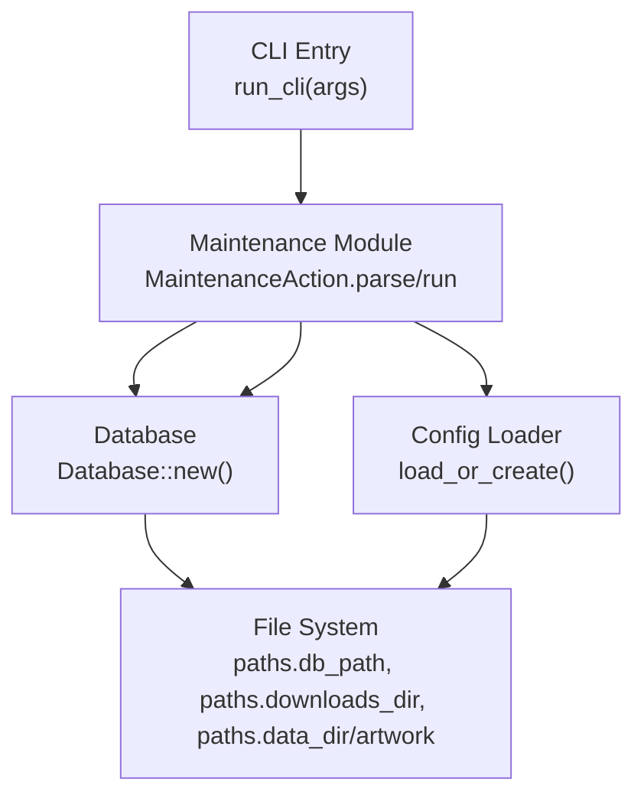
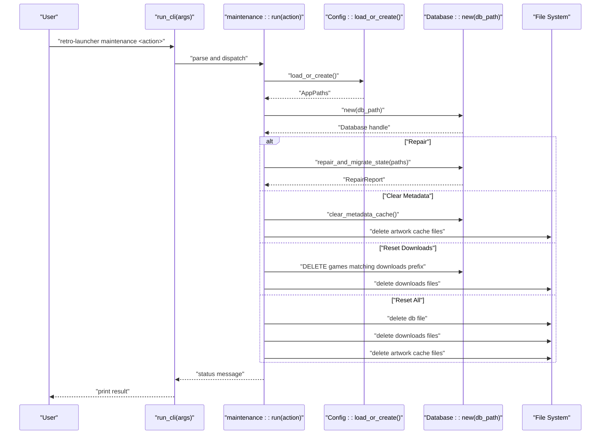
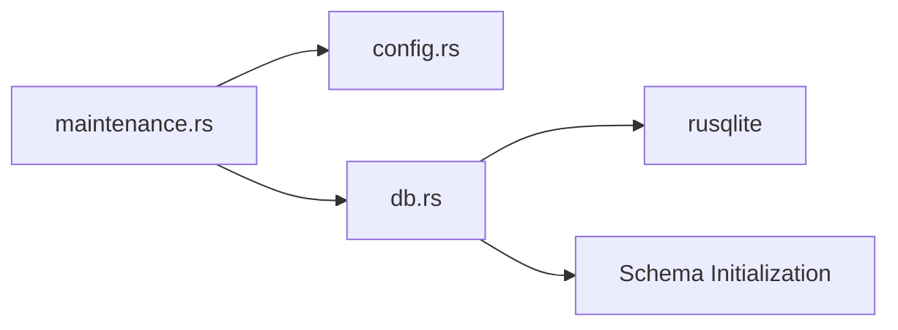

# System Reset Procedures

<cite>
**Referenced Files in This Document**
- [lib.rs](file://src/lib.rs)
- [maintenance.rs](file://src/maintenance.rs)
- [db.rs](file://src/db.rs)
- [config.rs](file://src/config.rs)
- [error.rs](file://src/error.rs)
- [Cargo.toml](file://Cargo.toml)
</cite>

## Table of Contents
1. [Introduction](#introduction)
2. [Project Structure](#project-structure)
3. [Core Components](#core-components)
4. [Architecture Overview](#architecture-overview)
5. [Detailed Component Analysis](#detailed-component-analysis)
6. [Dependency Analysis](#dependency-analysis)
7. [Performance Considerations](#performance-considerations)
8. [Troubleshooting Guide](#troubleshooting-guide)
9. [Conclusion](#conclusion)
10. [Appendices](#appendices)

## Introduction
This document describes the system reset and cleanup procedures implemented in the application. It explains the four reset levels: repair-only, clear-metadata, reset-downloads, and complete reset-all. For each level, it details the implications, safety considerations, and data preservation/deletion policies. It also provides step-by-step procedures for manual system resets, confirmation prompts, rollback procedures, file system cleanup operations, database truncation processes, and configuration restoration. Finally, it outlines safety guidelines, backup recommendations, recovery procedures, and common scenarios where system resets are necessary.

## Project Structure
The reset functionality is exposed via a dedicated maintenance command integrated into the CLI. The maintenance actions operate on the application’s runtime paths and database, and they rely on the configuration loader to resolve directories.

**Diagram sources**
- [lib.rs:24-38](file://src/lib.rs#L24-L38)
- [maintenance.rs:28-88](file://src/maintenance.rs#L28-L88)
- [config.rs:35-64](file://src/config.rs#L35-L64)
- [db.rs:35-46](file://src/db.rs#L35-L46)

**Section sources**
- [lib.rs:24-38](file://src/lib.rs#L24-L38)
- [maintenance.rs:28-88](file://src/maintenance.rs#L28-L88)
- [config.rs:35-64](file://src/config.rs#L35-L64)
- [db.rs:35-46](file://src/db.rs#L35-L46)

## Core Components
- MaintenanceAction: Defines the four reset levels and parses user input.
- run(): Executes the selected maintenance action against the configured paths and database.
- Database: Provides repair and migration routines, metadata cache operations, and schema initialization.
- Config: Resolves application paths and ensures directories exist.

Key responsibilities:
- Repair-only: Repairs and migrates state, normalizes URLs, removes legacy rows, resets broken downloads, and resets emulator assignments.
- Clear-metadata: Clears resolved metadata and metadata cache, and deletes artwork cache files.
- Reset-downloads: Removes launcher-managed downloads and associated database rows.
- Reset-all: Deletes the database file, clears downloads, and removes artwork cache files.

**Section sources**
- [maintenance.rs:8-26](file://src/maintenance.rs#L8-L26)
- [maintenance.rs:28-88](file://src/maintenance.rs#L28-L88)
- [db.rs:25-33](file://src/db.rs#L25-L33)
- [db.rs:129-267](file://src/db.rs#L129-L267)
- [config.rs:35-64](file://src/config.rs#L35-L64)

## Architecture Overview
The maintenance command integrates with the CLI and delegates to the maintenance module, which loads configuration and initializes the database. Actions operate on filesystem paths and SQLite tables.

**Diagram sources**
- [lib.rs:24-38](file://src/lib.rs#L24-L38)
- [maintenance.rs:28-88](file://src/maintenance.rs#L28-L88)
- [config.rs:35-64](file://src/config.rs#L35-L64)
- [db.rs:35-46](file://src/db.rs#L35-L46)

## Detailed Component Analysis

### MaintenanceAction and run()
- MaintenanceAction defines the four actions and parses user input.
- run() resolves paths, initializes the database, and executes the chosen action.

Implications and safety considerations:
- Repair-only performs targeted repairs and normalization without deleting persistent data.
- Clear-metadata removes cached metadata and artwork; does not touch user ROMs or downloads.
- Reset-downloads removes launcher-managed downloads and related rows; preserves non-launcher-managed files.
- Reset-all deletes the database and clears downloads and artwork caches; irreversible.

Data preservation and deletion policies:
- Repair-only: Preserves all user data; cleans up internal state inconsistencies.
- Clear-metadata: Preserves all library entries and downloads; removes only caches.
- Reset-downloads: Preserves non-launcher-managed files; removes only launcher-managed downloads and related rows.
- Reset-all: Completely resets the launcher state; requires re-scan and re-download.

Rollback procedures:
- Repair-only and Clear-metadata are safe to repeat; no permanent data loss.
- Reset-downloads can be reversed by rescanning and re-downloading.
- Reset-all requires restoring the database from backup or re-scanning and re-downloading everything.

**Section sources**
- [maintenance.rs:8-26](file://src/maintenance.rs#L8-L26)
- [maintenance.rs:28-88](file://src/maintenance.rs#L28-L88)

### Database Repair and Migration
The repair routine:
- Removes legacy demo rows and bundled catalog rows without payloads.
- Normalizes URLs in the games table.
- Detects missing payloads and either deletes local-scan entries or resets launcher-managed entries to a downloadable state.
- Resets emulator assignments to defaults when incompatible or non-preferred.

RepairReport fields:
- removed_missing_payloads
- normalized_urls
- removed_legacy_demo_rows
- removed_bundled_catalog_rows
- reset_broken_downloads
- reset_emulator_assignments

Safety considerations:
- Repair is idempotent; repeated runs are safe.
- Missing payloads for local scans are deleted; for launcher-managed entries, state is reset to downloadable.

**Section sources**
- [db.rs:25-33](file://src/db.rs#L25-L33)
- [db.rs:129-267](file://src/db.rs#L129-L267)
- [maintenance.rs:90-100](file://src/maintenance.rs#L90-L100)

### Metadata Cache Operations
- clear_metadata_cache() deletes resolved metadata and metadata cache tables.
- Artwork cache files under the artwork directory are deleted.

Safety considerations:
- These operations do not affect ROMs or downloads; only cached metadata and images are removed.

**Section sources**
- [db.rs:761-766](file://src/db.rs#L761-L766)
- [maintenance.rs:36-46](file://src/maintenance.rs#L36-L46)

### Downloads Reset
- Deletes database rows where managed_path or rom_path matches the downloads directory prefix.
- Deletes all files in the downloads directory.

Safety considerations:
- Only files under the configured downloads directory are affected.
- Non-launcher-managed files outside this directory are preserved.

**Section sources**
- [maintenance.rs:48-62](file://src/maintenance.rs#L48-L62)

### Complete Reset-all
- Deletes the database file.
- Deletes all files in the downloads directory.
- Deletes all files in the artwork cache directory.

Safety considerations:
- This is a destructive operation; backups are strongly recommended.
- After reset-all, the application must rescan ROM roots and re-download managed content.

**Section sources**
- [maintenance.rs:63-85](file://src/maintenance.rs#L63-L85)

### Configuration and Paths
- Config::load_or_create() resolves OS-appropriate directories and ensures they exist.
- AppPaths includes config_dir, data_dir, downloads_dir, db_path, and config_path.

Safety considerations:
- Paths are validated and created automatically; ensure the application has write permissions to these locations.

**Section sources**
- [config.rs:35-64](file://src/config.rs#L35-L64)
- [config.rs:10-17](file://src/config.rs#L10-L17)

## Dependency Analysis
The maintenance module depends on the configuration loader and database module. The database module depends on rusqlite and schema initialization.

**Diagram sources**
- [maintenance.rs:5-6](file://src/maintenance.rs#L5-L6)
- [db.rs:7](file://src/db.rs#L7)
- [Cargo.toml:16](file://Cargo.toml#L16)

**Section sources**
- [maintenance.rs:5-6](file://src/maintenance.rs#L5-L6)
- [db.rs:7](file://src/db.rs#L7)
- [Cargo.toml:16](file://Cargo.toml#L16)

## Performance Considerations
- Repair-only performs targeted SQL updates and deletions; performance depends on database size.
- Clear-metadata and Reset-downloads iterate over directories; performance depends on file counts.
- Reset-all deletes the database file and clears directories; performance depends on disk speed and directory sizes.
- The repair routine creates artwork and downloads directories to ensure they exist post-repair.

[No sources needed since this section provides general guidance]

## Troubleshooting Guide
Common issues and resolutions:
- Unknown maintenance action: The CLI reports usage and exits with an error.
- Database errors: The error module provides structured database error messages.
- Permission errors: Ensure the application has read/write access to the resolved directories.
- Repair output: The repair routine returns a formatted report indicating the number of changes made.

Recovery procedures:
- Repair-only and Clear-metadata can be repeated safely.
- Reset-downloads can be reversed by rescanning and re-downloading.
- Reset-all requires restoring the database from backup or re-scanning and re-downloading everything.

**Section sources**
- [lib.rs:32-36](file://src/lib.rs#L32-L36)
- [error.rs:32-38](file://src/error.rs#L32-L38)
- [maintenance.rs:90-100](file://src/maintenance.rs#L90-L100)

## Conclusion
The maintenance subsystem provides four distinct reset levels to address various system states and corruption scenarios. Repair-only and Clear-metadata are safe and reversible, while Reset-downloads and Reset-all are destructive and require backups. The procedures are designed to minimize risk and preserve user data where possible, with clear file system and database operations.

[No sources needed since this section summarizes without analyzing specific files]

## Appendices

### Step-by-Step Manual Reset Procedures
- Repair-only
  1. Run the maintenance command with the repair action.
  2. Review the formatted repair report printed to stdout.
  3. Re-scan ROM roots if necessary to rebuild metadata.
  4. No rollback is required; the operation is safe to repeat.

- Clear-metadata
  1. Run the maintenance command with the clear-metadata action.
  2. Verify that artwork cache files were removed.
  3. Re-scan ROM roots to rebuild metadata and artwork caches.
  4. No rollback is required; the operation is safe to repeat.

- Reset-downloads
  1. Run the maintenance command with the reset-downloads action.
  2. Confirm that launcher-managed downloads were removed.
  3. Re-scan ROM roots to re-discover and re-download managed content.
  4. No rollback is required; the operation is safe to repeat.

- Reset-all
  1. Back up the database file and downloads directory.
  2. Run the maintenance command with the reset-all action.
  3. Confirm that the database file, downloads, and artwork cache were cleared.
  4. Re-scan ROM roots to rebuild the library and re-download managed content.
  5. Restore from backup if needed.

[No sources needed since this section provides procedural guidance]

### Safety Guidelines and Backup Recommendations
- Always back up the database file and downloads directory before performing Reset-all.
- Use the repair action to fix minor inconsistencies before attempting destructive resets.
- Verify directory permissions and ensure sufficient disk space before proceeding.
- Test the repair action on a small dataset before applying to larger libraries.

[No sources needed since this section provides general guidance]

### Common Scenarios for System Resets
- Corrupted or missing launcher-managed downloads: Use Reset-downloads to remove broken entries and re-download.
- Persistent metadata or artwork cache issues: Use Clear-metadata to force a refresh.
- Severe database inconsistencies: Use Repair-only to normalize URLs and reset assignments.
- Complete system reinstallation or migration: Use Reset-all after backing up data, then restore from backup.

[No sources needed since this section provides general guidance]