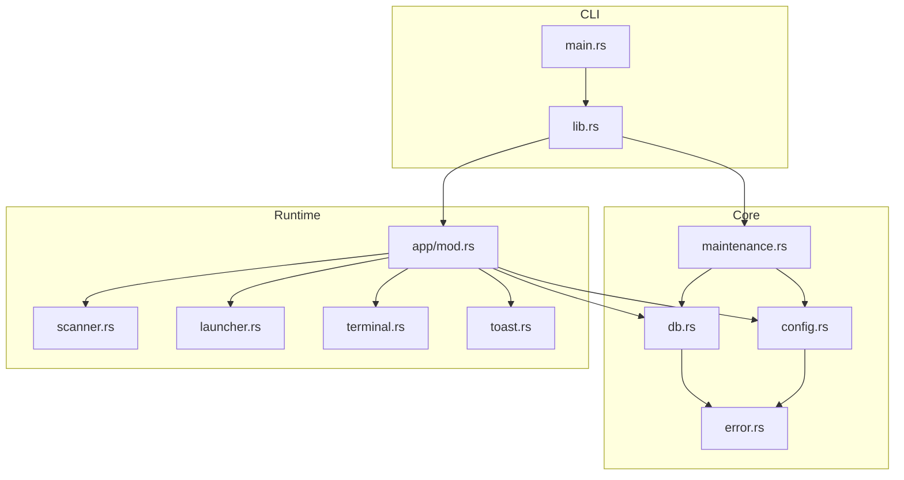
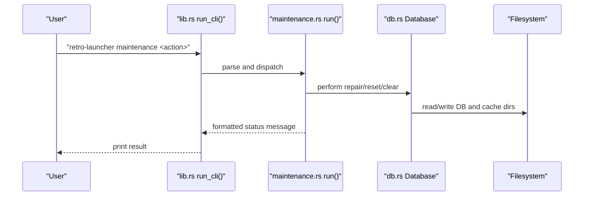
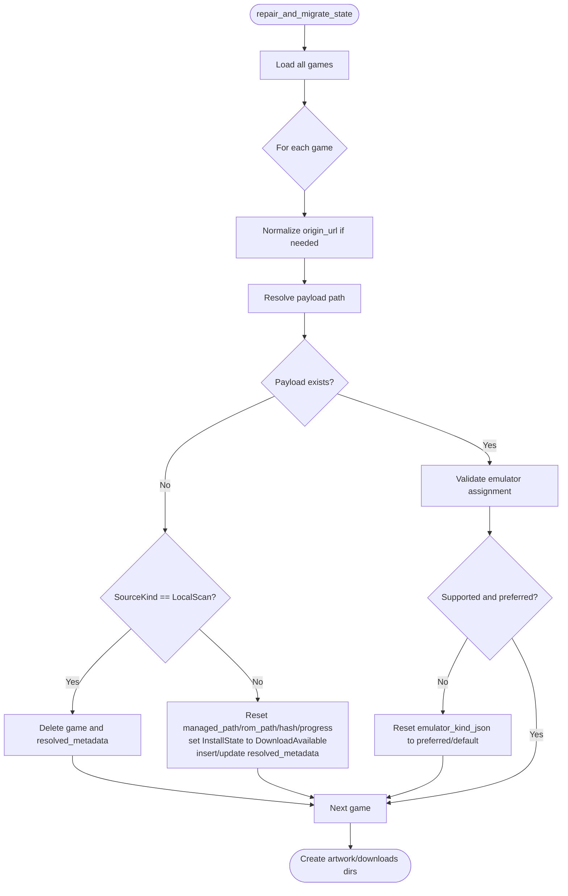
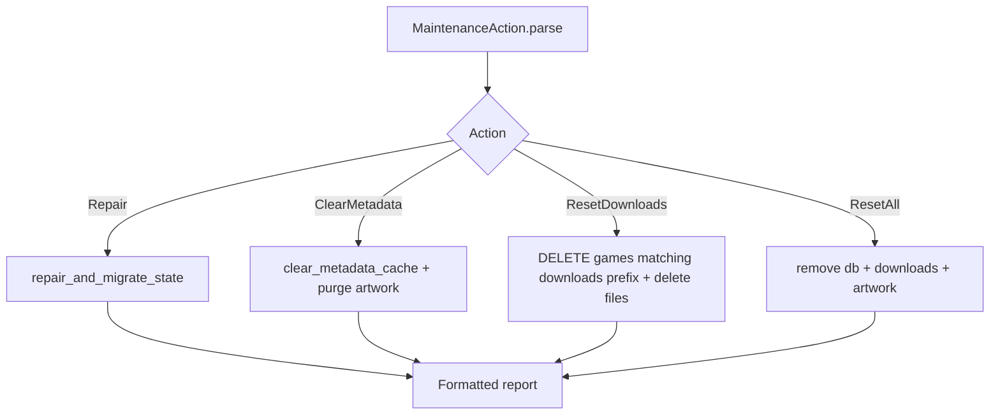
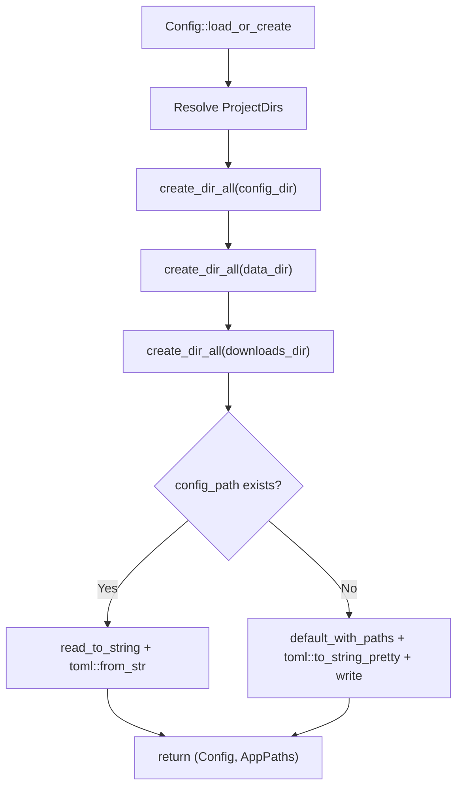
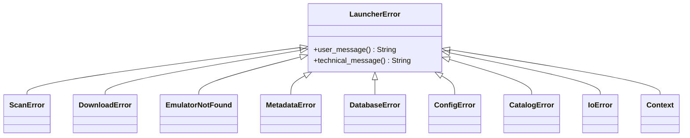
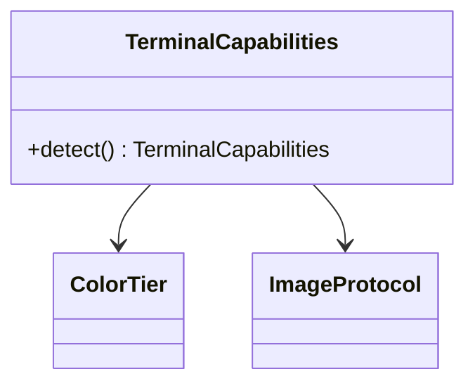
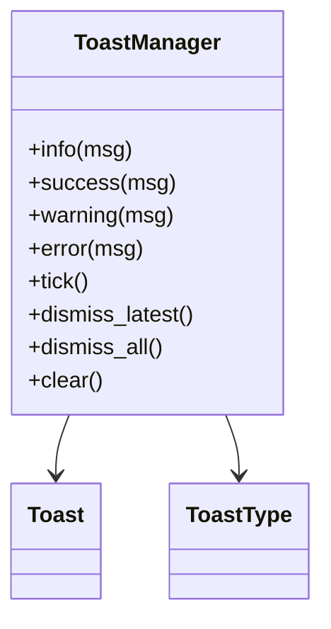
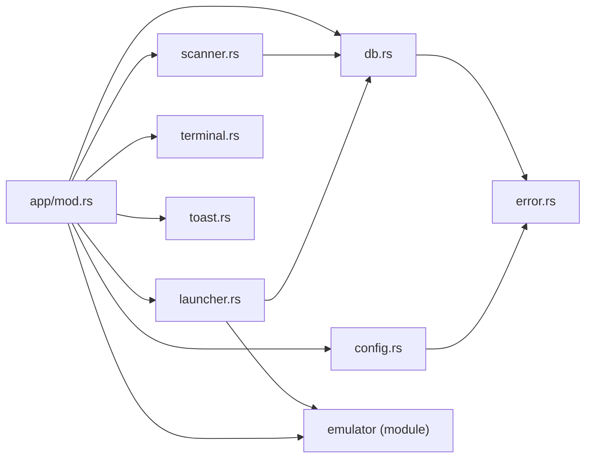

# Troubleshooting Guides

<cite>
**Referenced Files in This Document**
- [error.rs](file://src/error.rs)
- [maintenance.rs](file://src/maintenance.rs)
- [db.rs](file://src/db.rs)
- [config.rs](file://src/config.rs)
- [lib.rs](file://src/lib.rs)
- [main.rs](file://src/main.rs)
- [app/mod.rs](file://src/app/mod.rs)
- [scanner.rs](file://src/scanner.rs)
- [launcher.rs](file://src/launcher.rs)
- [terminal.rs](file://src/terminal.rs)
- [toast.rs](file://src/toast.rs)
- [Cargo.toml](file://Cargo.toml)
</cite>

## Table of Contents
1. [Introduction](#introduction)
2. [Project Structure](#project-structure)
3. [Core Components](#core-components)
4. [Architecture Overview](#architecture-overview)
5. [Detailed Component Analysis](#detailed-component-analysis)
6. [Dependency Analysis](#dependency-analysis)
7. [Performance Considerations](#performance-considerations)
8. [Troubleshooting Guide](#troubleshooting-guide)
9. [Conclusion](#conclusion)
10. [Appendices](#appendices)

## Introduction
This document provides comprehensive troubleshooting guides for maintenance and operational issues in the retro-launcher application. It focuses on diagnosing and resolving database corruption, cache problems, configuration errors, and performance-related concerns. It also covers logging and monitoring best practices, alert configuration, automated detection strategies, escalation procedures, and preventive maintenance.

## Project Structure
The application is organized around a TUI frontend, a SQLite-backed database, configuration management, and maintenance utilities. Key modules include:
- Error handling and user-facing messaging
- Database initialization, migration, and repair
- Configuration loading and defaults
- CLI entry points and maintenance actions
- Application orchestration and UI rendering
- ROM scanning and import pipeline
- Emulator launching and lifecycle
- Terminal capability detection and toast notifications

**Diagram sources**
- [main.rs:1-9](file://src/main.rs#L1-L9)
- [lib.rs:20-39](file://src/lib.rs#L20-L39)
- [app/mod.rs:125-170](file://src/app/mod.rs#L125-L170)
- [db.rs:35-46](file://src/db.rs#L35-L46)
- [config.rs:34-64](file://src/config.rs#L34-L64)
- [maintenance.rs:28-88](file://src/maintenance.rs#L28-L88)
- [scanner.rs:158-191](file://src/scanner.rs#L158-L191)
- [launcher.rs:9-27](file://src/launcher.rs#L9-L27)
- [terminal.rs:92-133](file://src/terminal.rs#L92-L133)
- [toast.rs:74-101](file://src/toast.rs#L74-L101)

**Section sources**
- [main.rs:1-9](file://src/main.rs#L1-L9)
- [lib.rs:20-39](file://src/lib.rs#L20-L39)
- [app/mod.rs:125-170](file://src/app/mod.rs#L125-L170)
- [db.rs:35-46](file://src/db.rs#L35-L46)
- [config.rs:34-64](file://src/config.rs#L34-L64)
- [maintenance.rs:28-88](file://src/maintenance.rs#L28-L88)
- [scanner.rs:158-191](file://src/scanner.rs#L158-L191)
- [launcher.rs:9-27](file://src/launcher.rs#L9-L27)
- [terminal.rs:92-133](file://src/terminal.rs#L92-L133)
- [toast.rs:74-101](file://src/toast.rs#L74-L101)

## Core Components
- Error model: Structured error types with user-friendly and technical messages for diagnostics and UI feedback.
- Database: Initializes schema, maintains metadata caches, and repairs/migrates state.
- Configuration: Loads or creates user configuration and app paths, with sensible defaults.
- Maintenance: Provides CLI-driven maintenance actions to repair state, clear caches, reset downloads, and reset all.
- Runtime app: Orchestrates startup jobs, UI rendering, worker threads, and user interactions.
- Scanner: Scans local ROM roots, imports files, and resolves ZIP archives.
- Launcher: Ensures emulator availability and launches games, recording launch metrics.

**Section sources**
- [error.rs:10-98](file://src/error.rs#L10-L98)
- [db.rs:25-267](file://src/db.rs#L25-L267)
- [config.rs:34-113](file://src/config.rs#L34-L113)
- [maintenance.rs:8-88](file://src/maintenance.rs#L8-L88)
- [app/mod.rs:125-170](file://src/app/mod.rs#L125-L170)
- [scanner.rs:158-265](file://src/scanner.rs#L158-L265)
- [launcher.rs:9-27](file://src/launcher.rs#L9-L27)

## Architecture Overview
The runtime initializes configuration and database, runs startup scans and metadata jobs, and renders a TUI. Maintenance actions operate independently via CLI to repair or reset state.

**Diagram sources**
- [lib.rs:24-38](file://src/lib.rs#L24-L38)
- [maintenance.rs:28-88](file://src/maintenance.rs#L28-L88)
- [db.rs:129-267](file://src/db.rs#L129-L267)

## Detailed Component Analysis

### Database Repair and Migration
The repair routine normalizes URLs, removes missing payloads, resets broken downloads, and resets emulator assignments. It also cleans legacy rows and ensures required directories exist.

**Diagram sources**
- [db.rs:129-267](file://src/db.rs#L129-L267)

**Section sources**
- [db.rs:25-33](file://src/db.rs#L25-L33)
- [db.rs:129-267](file://src/db.rs#L129-L267)

### Maintenance Actions
- Repair: Runs database repair and migration, reporting counts for normalization and resets.
- ClearMetadata: Clears resolved metadata and metadata cache, and purges artwork cache.
- ResetDownloads: Removes launcher-managed downloads and associated DB rows.
- ResetAll: Deletes database, downloads, and artwork cache.

**Diagram sources**
- [maintenance.rs:16-26](file://src/maintenance.rs#L16-L26)
- [maintenance.rs:28-88](file://src/maintenance.rs#L28-L88)
- [db.rs:761-766](file://src/db.rs#L761-L766)

**Section sources**
- [maintenance.rs:8-26](file://src/maintenance.rs#L8-L26)
- [maintenance.rs:28-88](file://src/maintenance.rs#L28-L88)
- [db.rs:761-766](file://src/db.rs#L761-L766)

### Configuration Loading and Defaults
Configuration loads or creates user-specific directories and TOML config, with defaults for ROM roots and preferred emulators. It ensures required directories exist.

**Diagram sources**
- [config.rs:34-64](file://src/config.rs#L34-L64)
- [config.rs:66-104](file://src/config.rs#L66-L104)

**Section sources**
- [config.rs:34-64](file://src/config.rs#L34-L64)
- [config.rs:66-104](file://src/config.rs#L66-L104)

### Error Model and Messaging
Structured error types provide user-friendly messages for UI and technical messages for logs. They cover scanning, downloads, emulators, metadata, database, configuration, catalog, I/O, and contextual failures.

**Diagram sources**
- [error.rs:10-98](file://src/error.rs#L10-L98)

**Section sources**
- [error.rs:10-98](file://src/error.rs#L10-L98)

### Terminal Capabilities and Toast Notifications
Terminal capabilities detect color and image protocols. Toast notifications manage transient UI messages with deduplication and animation.

**Diagram sources**
- [terminal.rs:92-133](file://src/terminal.rs#L92-L133)

**Diagram sources**
- [toast.rs:74-101](file://src/toast.rs#L74-L101)
- [toast.rs:140-158](file://src/toast.rs#L140-L158)
- [toast.rs:175-218](file://src/toast.rs#L175-L218)

**Section sources**
- [terminal.rs:92-133](file://src/terminal.rs#L92-L133)
- [toast.rs:74-101](file://src/toast.rs#L74-L101)
- [toast.rs:140-158](file://src/toast.rs#L140-L158)
- [toast.rs:175-218](file://src/toast.rs#L175-L218)

## Dependency Analysis
External dependencies include SQLite (rusqlite), networking (reqwest), serialization (serde), terminal UI (ratatui), and others. These influence error handling, network timeouts, and UI rendering.

**Diagram sources**
- [app/mod.rs:33-44](file://src/app/mod.rs#L33-L44)
- [db.rs:1-16](file://src/db.rs#L1-L16)
- [scanner.rs:10-13](file://src/scanner.rs#L10-L13)
- [launcher.rs:5-7](file://src/launcher.rs#L5-L7)

**Section sources**
- [Cargo.toml:6-24](file://Cargo.toml#L6-L24)
- [app/mod.rs:33-44](file://src/app/mod.rs#L33-L44)
- [db.rs:1-16](file://src/db.rs#L1-L16)
- [scanner.rs:10-13](file://src/scanner.rs#L10-L13)
- [launcher.rs:5-7](file://src/launcher.rs#L5-L7)

## Performance Considerations
- Database queries: The code uses JOIN queries to avoid N+1 patterns and sorts results efficiently.
- Indexes: Hash and title indexes improve lookup performance for metadata and games.
- I/O: ZIP extraction and file copying are performed with buffered reads/writes.
- UI rendering: Terminal capability detection influences image protocol usage to reduce overhead.

[No sources needed since this section provides general guidance]

## Troubleshooting Guide

### Diagnostic Procedures and Root Cause Identification
- Database corruption symptoms:
  - Inconsistent game lists, missing metadata, or inability to update records.
  - Repair reports indicate normalization of URLs, removal of missing payloads, and resets of downloads/emulators.
- Cache problems:
  - Missing artwork or stale metadata after updates.
  - Clearing metadata cache and artwork cache resolves temporary inconsistencies.
- Configuration errors:
  - Incorrect paths or missing directories.
  - Re-creating default configuration and ensuring directory creation resolves path issues.
- Network/download issues:
  - HTML payloads instead of ROMs, invalid content types, or timeouts.
  - Validation routines reject HTML content and enforce successful downloads.

**Section sources**
- [db.rs:129-267](file://src/db.rs#L129-L267)
- [db.rs:761-766](file://src/db.rs#L761-L766)
- [config.rs:34-64](file://src/config.rs#L34-L64)
- [app/mod.rs:623-686](file://src/app/mod.rs#L623-L686)

### Error Code Interpretation and Resolution Strategies
- DatabaseError:
  - Indicates failure during a database operation; suggests running maintenance repair.
- ConfigError:
  - Indicates configuration file issues; re-create default configuration.
- IoError:
  - Indicates filesystem or I/O issues; check permissions and disk space.
- DownloadError:
  - Indicates network or payload issues; verify connectivity and URL validity.
- EmulatorNotFound:
  - Indicates missing emulator; install the required emulator.
- MetadataError:
  - Indicates metadata resolution failure; clear metadata cache and retry.

**Section sources**
- [error.rs:32-58](file://src/error.rs#L32-L58)
- [error.rs:61-98](file://src/error.rs#L61-L98)

### Step-by-Step Resolution Procedures
- Database corruption:
  1. Run maintenance repair to normalize URLs, remove missing payloads, reset downloads, and reset emulator assignments.
  2. Verify repair report counts and re-run if necessary.
  3. If persistent, clear metadata cache and artwork cache.
- Cache problems:
  1. Clear metadata cache and artwork cache.
  2. Restart the application to rebuild caches.
- Configuration errors:
  1. Ensure configuration and data directories exist.
  2. Re-create default configuration if corrupted.
- Network/download issues:
  1. Validate URL and content type.
  2. Reject HTML payloads and retry.
  3. Check network connectivity and proxy settings.

**Section sources**
- [maintenance.rs:28-88](file://src/maintenance.rs#L28-L88)
- [db.rs:761-766](file://src/db.rs#L761-L766)
- [config.rs:34-64](file://src/config.rs#L34-L64)
- [app/mod.rs:623-686](file://src/app/mod.rs#L623-L686)

### Logging and Monitoring Best Practices
- Use technical messages for logs to capture full error details.
- Use user-friendly messages for UI feedback.
- Track repair report counts to monitor ongoing health.
- Implement periodic checks for database integrity and cache freshness.

**Section sources**
- [error.rs:94-98](file://src/error.rs#L94-L98)
- [app/mod.rs:162-167](file://src/app/mod.rs#L162-L167)

### Alert Configuration and Automated Detection
- Monitor repair report counts for anomalies (e.g., frequent resets).
- Alert on repeated DatabaseError or IoError occurrences.
- Schedule periodic maintenance actions (repair, clear-metadata) as part of automated tasks.

**Section sources**
- [maintenance.rs:90-100](file://src/maintenance.rs#L90-L100)
- [error.rs:32-58](file://src/error.rs#L32-L58)

### Escalation Procedures, Support Tickets, and Expert Intervention
- Capture technical messages and repair reports.
- Document steps taken and outcomes.
- Prepare support tickets with environment details, logs, and reproduction steps.

**Section sources**
- [error.rs:94-98](file://src/error.rs#L94-L98)
- [maintenance.rs:90-100](file://src/maintenance.rs#L90-L100)

### Preventive Measures, Maintenance Scheduling, and Health Monitoring
- Schedule regular maintenance repairs.
- Periodically clear metadata cache to prevent stale data.
- Monitor disk usage and clean downloads/artwork caches when space is low.
- Validate configuration and paths during upgrades.

**Section sources**
- [maintenance.rs:28-88](file://src/maintenance.rs#L28-L88)
- [db.rs:761-766](file://src/db.rs#L761-L766)

## Conclusion
This guide consolidates practical troubleshooting procedures for database corruption, cache problems, configuration errors, and performance issues. By leveraging structured error messages, maintenance actions, and health monitoring, operators can diagnose and resolve issues efficiently while maintaining system reliability.

[No sources needed since this section summarizes without analyzing specific files]

## Appendices

### CLI Maintenance Commands
- Repair state: retro-launcher maintenance repair
- Clear metadata cache: retro-launcher maintenance clear-metadata
- Reset downloads: retro-launcher maintenance reset-downloads
- Reset all: retro-launcher maintenance reset-all

**Section sources**
- [lib.rs:24-38](file://src/lib.rs#L24-L38)
- [maintenance.rs:16-26](file://src/maintenance.rs#L16-L26)