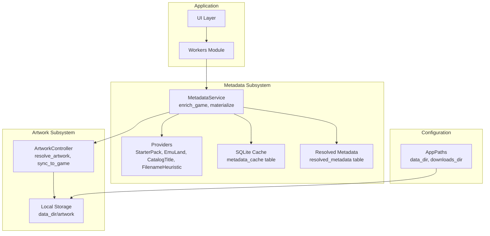
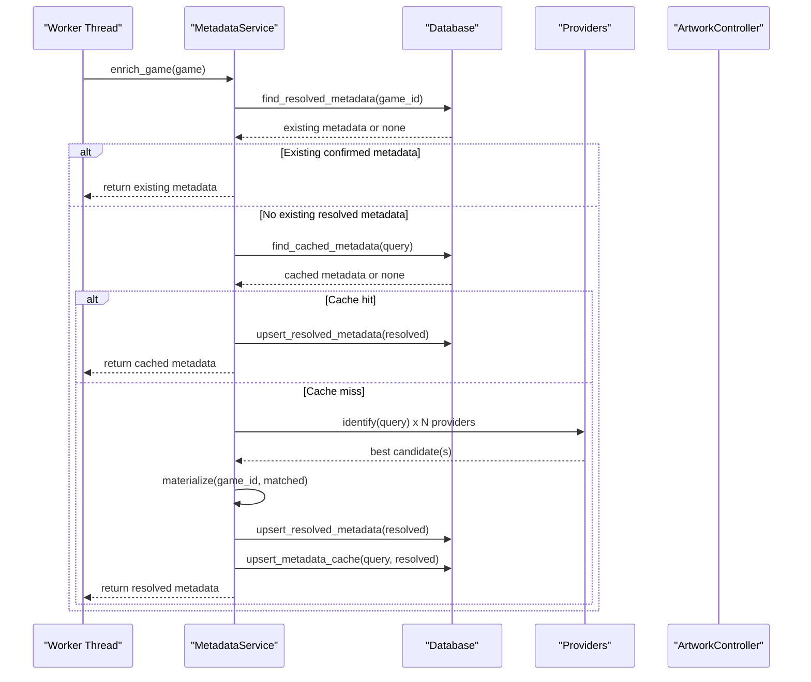
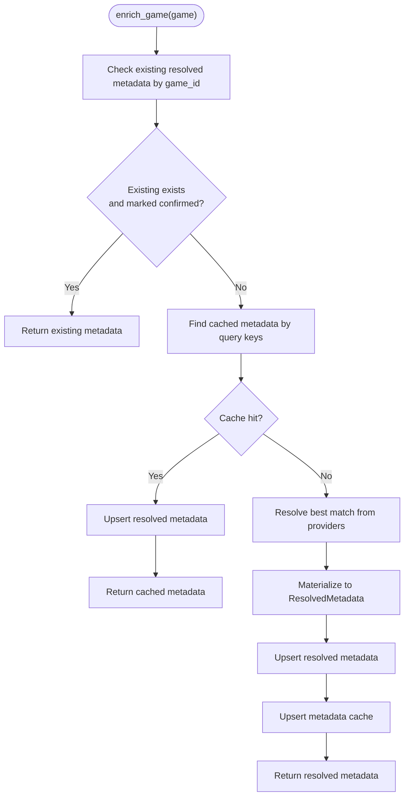
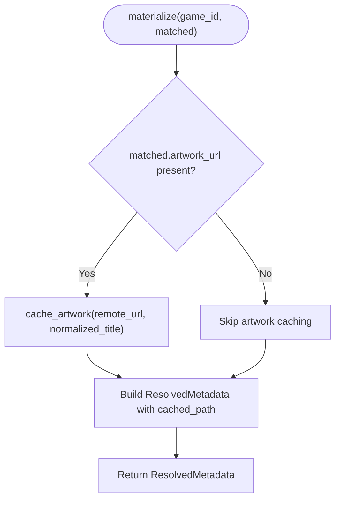
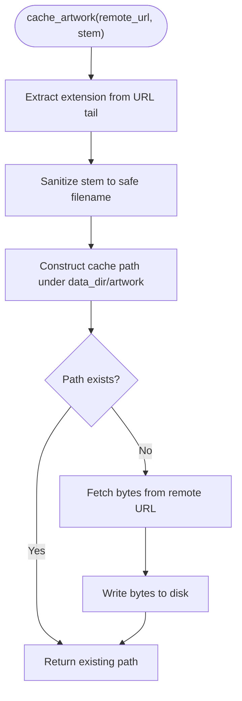
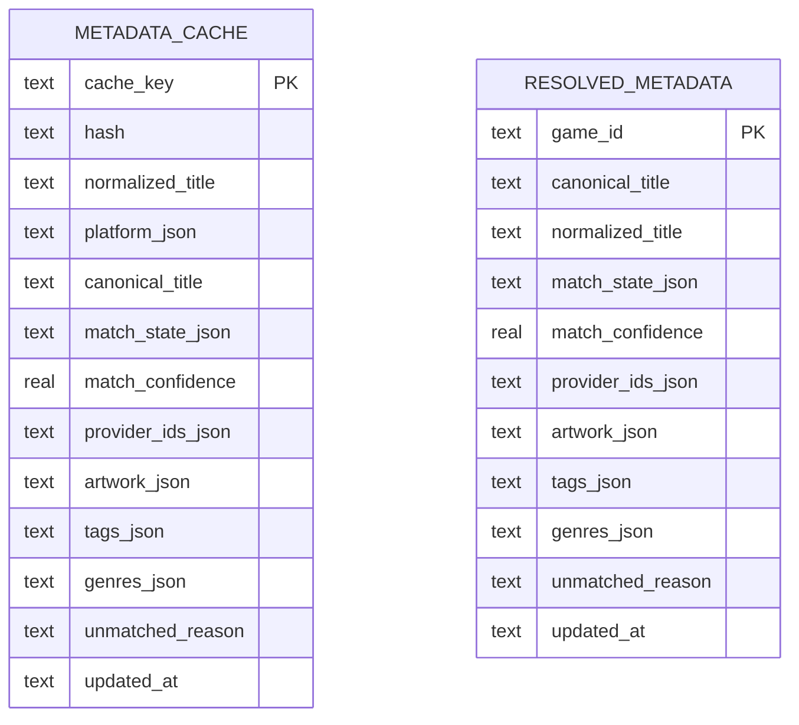
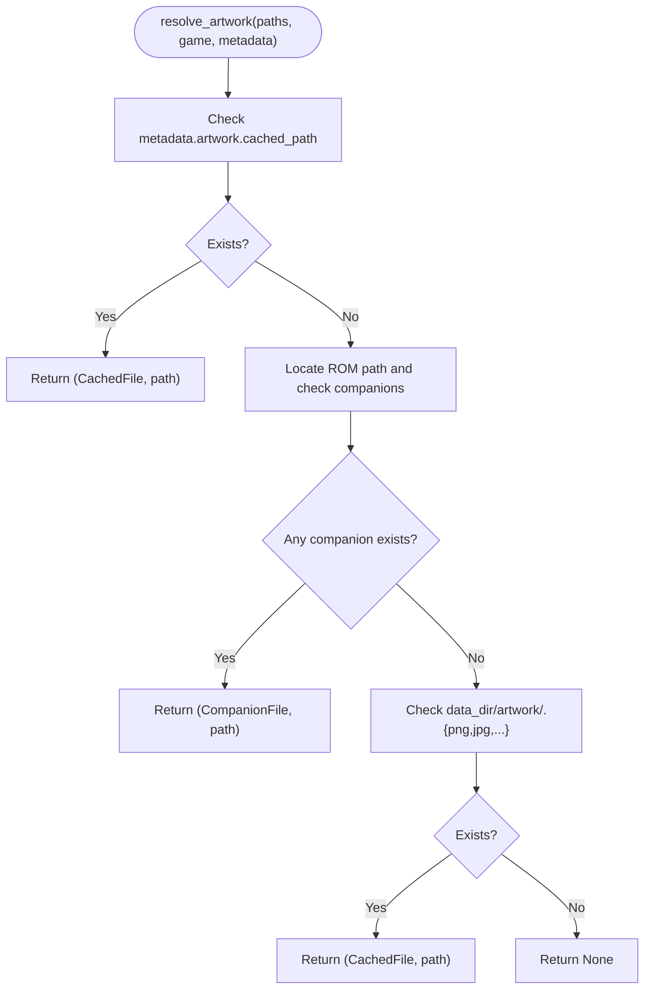
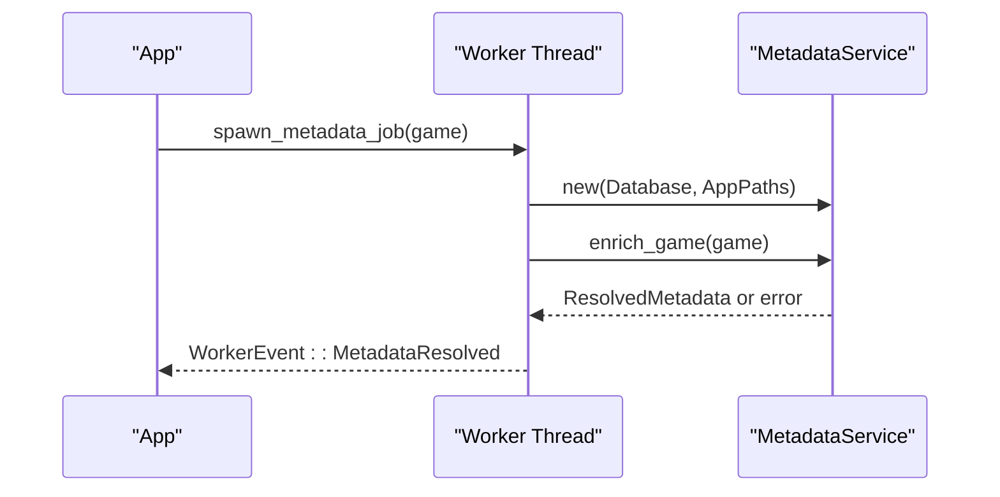
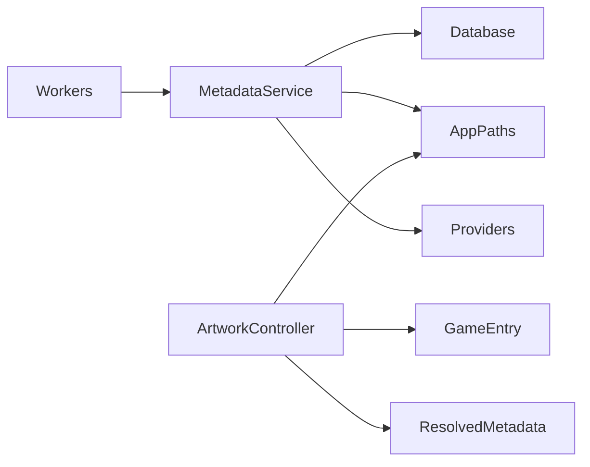

# Metadata Caching System

<cite>
**Referenced Files in This Document**
- [metadata.rs](file://src/metadata.rs)
- [db.rs](file://src/db.rs)
- [artwork.rs](file://src/artwork.rs)
- [config.rs](file://src/config.rs)
- [models.rs](file://src/models.rs)
- [workers.rs](file://src/app/workers.rs)
- [maintenance.rs](file://src/maintenance.rs)
</cite>

## Table of Contents
1. [Introduction](#introduction)
2. [Project Structure](#project-structure)
3. [Core Components](#core-components)
4. [Architecture Overview](#architecture-overview)
5. [Detailed Component Analysis](#detailed-component-analysis)
6. [Dependency Analysis](#dependency-analysis)
7. [Performance Considerations](#performance-considerations)
8. [Troubleshooting Guide](#troubleshooting-guide)
9. [Conclusion](#conclusion)

## Introduction
This document explains the metadata caching and resolution workflow in the application. It covers how metadata is looked up from cache, validated, and refreshed when needed; how artwork is fetched and stored locally; and how the system ensures consistency and performance. It also documents configuration options, storage locations, cache invalidation strategies, and troubleshooting guidance.

## Project Structure
The metadata caching system spans several modules:
- Metadata service orchestrates enrichment and cache operations
- Database layer persists resolved metadata and maintains a separate metadata cache table
- Artwork subsystem resolves and renders artwork from cached or companion files
- Configuration defines storage locations for data and artwork
- Workers coordinate background metadata resolution tasks
- Maintenance utilities provide cache clearing and repair operations

**Diagram sources**
- [metadata.rs:237-369](file://src/metadata.rs#L237-L369)
- [db.rs:96-113](file://src/db.rs#L96-L113)
- [artwork.rs:215-246](file://src/artwork.rs#L215-L246)
- [config.rs:10-17](file://src/config.rs#L10-L17)
- [workers.rs:33-57](file://src/app/workers.rs#L33-L57)

**Section sources**
- [metadata.rs:237-369](file://src/metadata.rs#L237-L369)
- [db.rs:96-113](file://src/db.rs#L96-L113)
- [artwork.rs:215-246](file://src/artwork.rs#L215-L246)
- [config.rs:10-17](file://src/config.rs#L10-L17)
- [workers.rs:33-57](file://src/app/workers.rs#L33-L57)

## Core Components
- MetadataService: Central coordinator for metadata enrichment, cache lookup, and materialization
- Database: Persistent storage for resolved metadata and metadata cache with indexing
- ArtworkController: Resolves artwork from cached files, companion files, or remote URLs
- AppPaths: Defines storage locations for data and artwork
- Workers: Spawns background tasks to enrich metadata for all games

Key responsibilities:
- Cache lookup in enrich_game using composite keys
- Materialization of provider matches into ResolvedMetadata with artwork caching
- Local artwork storage with extension handling and existence checks
- Cache invalidation via maintenance actions and explicit clearing

**Section sources**
- [metadata.rs:279-321](file://src/metadata.rs#L279-L321)
- [db.rs:587-623](file://src/db.rs#L587-L623)
- [artwork.rs:215-246](file://src/artwork.rs#L215-L246)
- [config.rs:10-17](file://src/config.rs#L10-L17)
- [workers.rs:33-57](file://src/app/workers.rs#L33-L57)

## Architecture Overview
The metadata workflow integrates providers, cache, and artwork subsystems:

**Diagram sources**
- [workers.rs:42-57](file://src/app/workers.rs#L42-L57)
- [metadata.rs:279-321](file://src/metadata.rs#L279-L321)
- [db.rs:587-623](file://src/db.rs#L587-L623)
- [db.rs:543-585](file://src/db.rs#L543-L585)

## Detailed Component Analysis

### MetadataService: Cache Lookup, Validation, and Invalidation
- enrich_game performs:
  - Early exit if user-confirmed metadata exists
  - Cache lookup using find_cached_metadata with composite keys
  - Upsert resolved metadata upon cache hit
  - Provider identification and merging when cache misses
  - Materialization and persistence of resolved metadata and cache
- Cache keys are generated per query to support hash and title+platform lookups
- Invalidation occurs via maintenance actions and explicit clearing

**Diagram sources**
- [metadata.rs:279-321](file://src/metadata.rs#L279-L321)
- [db.rs:587-623](file://src/db.rs#L587-L623)
- [db.rs:543-585](file://src/db.rs#L543-L585)

**Section sources**
- [metadata.rs:279-321](file://src/metadata.rs#L279-L321)
- [db.rs:587-623](file://src/db.rs#L587-L623)
- [db.rs:820-831](file://src/db.rs#L820-L831)

### materialize: Converting Provider Matches to ResolvedMetadata
- Creates ResolvedMetadata from MetadataMatch
- Optionally caches artwork via cache_artwork and sets cached_path
- Sets artwork source and updated timestamps

**Diagram sources**
- [metadata.rs:323-347](file://src/metadata.rs#L323-L347)
- [metadata.rs:349-368](file://src/metadata.rs#L349-L368)

**Section sources**
- [metadata.rs:323-347](file://src/metadata.rs#L323-L347)
- [metadata.rs:349-368](file://src/metadata.rs#L349-L368)

### cache_artwork: URL Processing, Extension Handling, and Local Storage
- Extracts file extension from URL tail; defaults to png if invalid
- Sanitizes title stem and constructs a stable filename
- Checks local cache existence; if absent, downloads and writes bytes
- Returns the path to the cached artwork

**Diagram sources**
- [metadata.rs:349-368](file://src/metadata.rs#L349-L368)
- [config.rs:10-17](file://src/config.rs#L10-L17)

**Section sources**
- [metadata.rs:349-368](file://src/metadata.rs#L349-L368)
- [config.rs:10-17](file://src/config.rs#L10-L17)

### Database Cache Keys and Storage
- Composite cache keys:
  - hash:<hash> when available
  - title:<platform>:<normalized_title>
- metadata_cache table stores serialized ResolvedMetadata fields
- resolved_metadata table stores final resolved metadata for UI and rendering
- Indexes on hash and normalized_title optimize lookups

**Diagram sources**
- [db.rs:96-113](file://src/db.rs#L96-L113)
- [db.rs:543-585](file://src/db.rs#L543-L585)
- [db.rs:587-623](file://src/db.rs#L587-L623)

**Section sources**
- [db.rs:820-831](file://src/db.rs#L820-L831)
- [db.rs:96-113](file://src/db.rs#L96-L113)
- [db.rs:543-585](file://src/db.rs#L543-L585)
- [db.rs:587-623](file://src/db.rs#L587-L623)

### Artwork Resolution and Rendering
- ArtworkController.resolve_artwork prioritizes:
  - Cached artwork from resolved metadata
  - Companion artwork files adjacent to ROMs
  - Fallback cache files under data_dir/artwork with sanitized stems
- Supports terminal rendering via image protocols when available

**Diagram sources**
- [artwork.rs:215-246](file://src/artwork.rs#L215-L246)
- [config.rs:10-17](file://src/config.rs#L10-L17)

**Section sources**
- [artwork.rs:215-246](file://src/artwork.rs#L215-L246)
- [config.rs:10-17](file://src/config.rs#L10-L17)

### Background Metadata Enrichment
- Workers spawn a metadata job per game during startup
- Each job constructs a MetadataService and calls enrich_game
- Results are sent back via WorkerEvent for UI updates

**Diagram sources**
- [workers.rs:33-57](file://src/app/workers.rs#L33-L57)
- [metadata.rs:279-321](file://src/metadata.rs#L279-L321)

**Section sources**
- [workers.rs:33-57](file://src/app/workers.rs#L33-L57)

## Dependency Analysis
- MetadataService depends on:
  - Database for cache and resolved metadata persistence
  - AppPaths for artwork storage location
  - Providers for candidate matching
- ArtworkController depends on:
  - AppPaths for data_dir/artwork
  - GameEntry and ResolvedMetadata for resolution logic
- Workers depend on MetadataService for enrichment tasks

**Diagram sources**
- [metadata.rs:237-369](file://src/metadata.rs#L237-L369)
- [artwork.rs:215-246](file://src/artwork.rs#L215-L246)
- [workers.rs:33-57](file://src/app/workers.rs#L33-L57)

**Section sources**
- [metadata.rs:237-369](file://src/metadata.rs#L237-L369)
- [artwork.rs:215-246](file://src/artwork.rs#L215-L246)
- [workers.rs:33-57](file://src/app/workers.rs#L33-L57)

## Performance Considerations
- Cache hit scenarios:
  - Resolved metadata by game_id avoids provider lookups
  - Cached metadata by hash/title keys avoid network requests
- Performance benefits:
  - Single-pass join loads games and metadata efficiently
  - Indexes on metadata_cache hash and normalized_title reduce lookup cost
- Storage optimization:
  - Local artwork caching reduces repeated network fetches
  - Sanitized filenames prevent filesystem issues and collisions
- Concurrency:
  - Background worker threads isolate blocking operations (network and IO)
  - SQLite transactions and upserts minimize contention

[No sources needed since this section provides general guidance]

## Troubleshooting Guide
Common cache-related issues and resolutions:
- Cache appears stale or incorrect
  - Trigger maintenance action to clear metadata cache and artwork cache
  - Re-run metadata enrichment to repopulate cache
- Artwork not displaying
  - Verify artwork exists in data_dir/artwork with sanitized filename
  - Confirm companion artwork files exist alongside ROMs
  - Check terminal image protocol support
- Provider matches not persisting
  - Ensure resolved metadata upsert succeeds after cache miss
  - Validate cache keys include both hash and title+platform
- Storage location misconfiguration
  - Confirm AppPaths.data_dir points to writable directory
  - Ensure data_dir/artwork exists and is accessible

Operational commands:
- Clear metadata cache and artwork cache
  - maintenance clear-metadata
- Repair state and reset broken downloads/emulators
  - maintenance repair

**Section sources**
- [maintenance.rs:28-47](file://src/maintenance.rs#L28-L47)
- [db.rs:761-766](file://src/db.rs#L761-L766)
- [artwork.rs:215-246](file://src/artwork.rs#L215-L246)

## Conclusion
The metadata caching system combines provider-driven enrichment with robust local caching and artwork storage. It optimizes performance through cache hits, composite keys, and background processing, while ensuring reliability via maintenance tools and graceful fallbacks. Proper configuration of storage locations and understanding of cache invalidation strategies help maintain a responsive and accurate metadata experience.