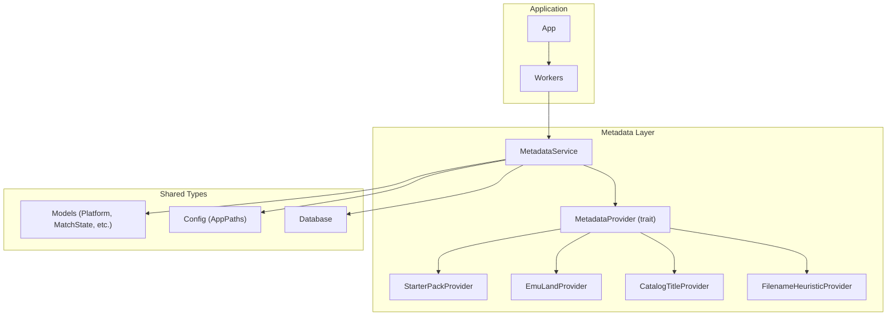
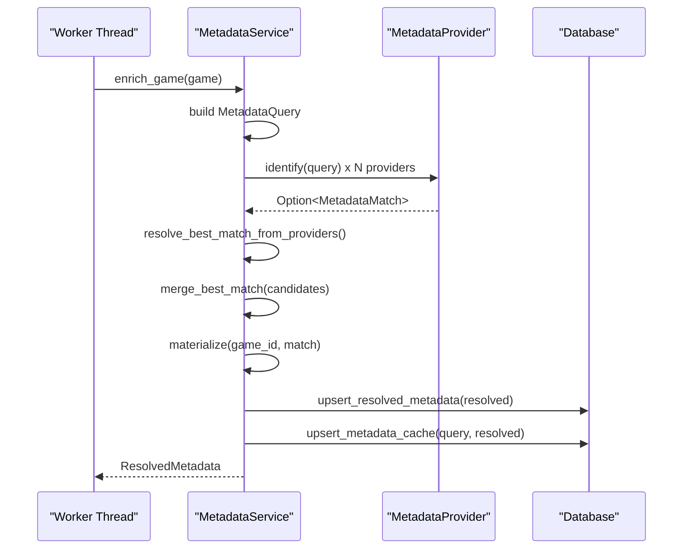
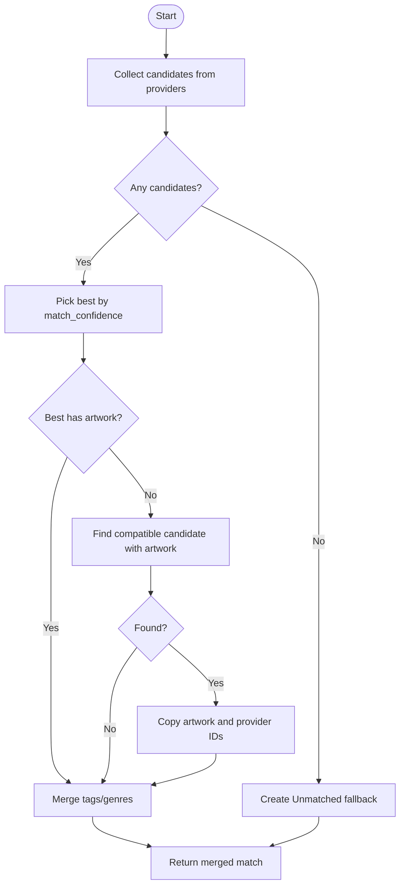
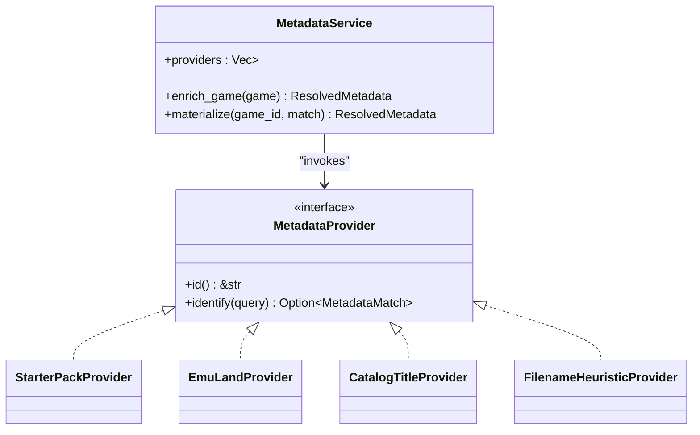

# Metadata Providers

<cite>
**Referenced Files in This Document**
- [metadata.rs](file://src/metadata.rs)
- [models.rs](file://src/models.rs)
- [config.rs](file://src/config.rs)
- [db.rs](file://src/db.rs)
- [lib.rs](file://src/lib.rs)
- [starter_metadata.json](file://support/starter_metadata.json)
- [workers.rs](file://src/app/workers.rs)
</cite>

## Table of Contents
1. [Introduction](#introduction)
2. [Project Structure](#project-structure)
3. [Core Components](#core-components)
4. [Architecture Overview](#architecture-overview)
5. [Detailed Component Analysis](#detailed-component-analysis)
6. [Dependency Analysis](#dependency-analysis)
7. [Performance Considerations](#performance-considerations)
8. [Troubleshooting Guide](#troubleshooting-guide)
9. [Conclusion](#conclusion)
10. [Appendices](#appendices)

## Introduction
This document explains the metadata provider system used to resolve canonical titles, artwork, tags, and genres for ROMs. It covers the MetadataProvider trait, built-in providers, the provider invocation pipeline, confidence scoring, merging logic, and how to build custom providers. It also documents configuration, error handling, and performance characteristics.

## Project Structure
The metadata subsystem lives primarily in the metadata module and integrates with models, configuration, and database layers. Providers are invoked from worker threads during library enrichment.

**Diagram sources**
- [metadata.rs:237-370](file://src/metadata.rs#L237-L370)
- [workers.rs:41-57](file://src/app/workers.rs#L41-L57)
- [models.rs:8-23](file://src/models.rs#L8-L23)
- [config.rs:10-17](file://src/config.rs#L10-L17)
- [db.rs:20-23](file://src/db.rs#L20-L23)

**Section sources**
- [metadata.rs:15-43](file://src/metadata.rs#L15-L43)
- [metadata.rs:237-370](file://src/metadata.rs#L237-L370)
- [workers.rs:41-57](file://src/app/workers.rs#L41-L57)

## Core Components
- MetadataProvider trait: Defines the contract for all providers.
- MetadataQuery: Input carrying game identity, normalized title, platform, and optional origin URL/hash.
- MetadataMatch: Output carrying canonical title, confidence, tags, genres, artwork URL, and match state.
- MetadataService: Orchestrates provider invocation, caching, and merging.
- Built-in providers:
  - StarterPackProvider: Local starter pack with aliases and curated metadata.
  - EmuLandProvider: Web scraping provider for Emu-Land.
  - CatalogTitleProvider: Uses origin URL-derived title when present.
  - FilenameHeuristicProvider: Normalizes filename to a canonical title fallback.

**Section sources**
- [metadata.rs:40-43](file://src/metadata.rs#L40-L43)
- [metadata.rs:15-36](file://src/metadata.rs#L15-L36)
- [metadata.rs:237-370](file://src/metadata.rs#L237-L370)
- [metadata.rs:55-145](file://src/metadata.rs#L55-L145)
- [metadata.rs:170-235](file://src/metadata.rs#L170-L235)
- [metadata.rs:147-168](file://src/metadata.rs#L147-L168)
- [metadata.rs:114-145](file://src/metadata.rs#L114-L145)

## Architecture Overview
Providers are registered in a vector inside MetadataService. On enrichment, each provider receives the same MetadataQuery and returns an optional MetadataMatch. The service selects the highest-confidence match, merges artwork URLs from compatible matches, and aggregates tags/genres. Results are materialized into ResolvedMetadata and persisted to the database.

**Diagram sources**
- [workers.rs:41-57](file://src/app/workers.rs#L41-L57)
- [metadata.rs:279-321](file://src/metadata.rs#L279-L321)
- [metadata.rs:371-408](file://src/metadata.rs#L371-L408)

## Detailed Component Analysis

### MetadataProvider Trait
- Purpose: Standardize provider behavior across implementations.
- Methods:
  - id(): Unique static identifier for the provider.
  - identify(query): Transform a MetadataQuery into an optional MetadataMatch.

Implementation pattern:
- Providers implement identify() to compute a MetadataMatch or None.
- Providers are boxed and stored in a vector for dynamic dispatch.

**Section sources**
- [metadata.rs:40-43](file://src/metadata.rs#L40-L43)

### MetadataService
- Responsibilities:
  - Build MetadataQuery from GameEntry.
  - Invoke providers and select the best match.
  - Merge artwork, tags, and genres from compatible candidates.
  - Materialize ResolvedMetadata and persist to DB.
  - Cache results to avoid repeated work.

Key behaviors:
- Provider registration order defines priority implicitly (first match wins at equal confidence).
- Merging logic:
  - Highest confidence wins.
  - If best lacks artwork, pick artwork from compatible candidates with higher confidence.
  - Merge tags/genres without duplicates (case-insensitive).
- Caching:
  - Reads/writes resolved metadata and metadata cache keyed by hash/title/platform.

**Section sources**
- [metadata.rs:237-370](file://src/metadata.rs#L237-L370)
- [metadata.rs:371-408](file://src/metadata.rs#L371-L408)
- [db.rs:543-623](file://src/db.rs#L543-L623)

### StarterPackProvider
- Data source: Embedded starter metadata JSON.
- Matching algorithm:
  - Filter entries by platform (or Unknown).
  - Compute confidence against normalized title using:
    - Exact match: high confidence.
    - Containment: medium-high confidence.
    - Token overlap (loose_token_match): medium confidence.
- Output: Canonical title, tags, genres, artwork URL from starter pack.

Edge cases:
- Unknown platform entries are considered for any platform.
- Aliases drive normalization and matching.

**Section sources**
- [metadata.rs:55-112](file://src/metadata.rs#L55-L112)
- [starter_metadata.json:1-89](file://support/starter_metadata.json#L1-L89)
- [metadata.rs:461-466](file://src/metadata.rs#L461-L466)

### EmuLandProvider
- Data source: Emu-Land website.
- Matching algorithm:
  - Search page: builds normalized search term and extracts a link to a ROM page.
  - Detail page: scrapes title, genres, developer/publisher/year, and artwork URL.
  - Confidence: starts at a baseline and is boosted to a minimum threshold.
- Platform filtering: uses platform hints to constrain search results.

Edge cases:
- Handles missing normalized title by falling back to raw title.
- Robustness: requests include referer and cookie headers; errors are contextualized.

**Section sources**
- [metadata.rs:170-235](file://src/metadata.rs#L170-L235)
- [metadata.rs:488-502](file://src/metadata.rs#L488-L502)
- [metadata.rs:504-547](file://src/metadata.rs#L504-L547)
- [metadata.rs:612-625](file://src/metadata.rs#L612-L625)

### CatalogTitleProvider
- Data source: Origin URL presence.
- Matching algorithm:
  - If origin_url is present, treat the raw title as canonical with low confidence.
  - Intended to preserve titles imported from catalogs.

Edge cases:
- Returns None when origin_url is absent.

**Section sources**
- [metadata.rs:147-168](file://src/metadata.rs#L147-L168)

### FilenameHeuristicProvider
- Data source: Filename-derived title.
- Matching algorithm:
  - Capitalizes words and returns a normalized title.
  - Marks match as Unmatched with low confidence and an unmatched reason.

Edge cases:
- Empty normalized title yields None.

**Section sources**
- [metadata.rs:114-145](file://src/metadata.rs#L114-L145)

### Provider Priority and Selection Logic
- Registration order determines priority implicitly:
  - Providers are invoked in order; the first provider to return a match becomes the candidate.
  - resolve_best_match_from_providers collects all candidates and then picks the highest confidence.
- Merging:
  - If best match lacks artwork but a compatible candidate has artwork, merge artwork and provider IDs.
  - Merge tags/genres from all candidates without duplicates.

**Diagram sources**
- [metadata.rs:371-408](file://src/metadata.rs#L371-L408)

**Section sources**
- [metadata.rs:270-276](file://src/metadata.rs#L270-L276)
- [metadata.rs:371-408](file://src/metadata.rs#L371-L408)

### Implementation Details and Confidence Scoring
- normalize_title: Removes extensions, parentheses/brackets, filters noise words, and normalizes spacing.
- loose_token_match: True if tokens of left are contained in right or vice versa.
- Confidence thresholds:
  - StarterPackProvider: Exact alias match, containment, token overlap.
  - EmuLandProvider: Starts at a baseline and is boosted to a minimum threshold.
  - CatalogTitleProvider: Low fixed confidence.
  - FilenameHeuristicProvider: Very low fixed confidence.

**Section sources**
- [metadata.rs:428-459](file://src/metadata.rs#L428-L459)
- [metadata.rs:461-466](file://src/metadata.rs#L461-L466)
- [metadata.rs:78-90](file://src/metadata.rs#L78-L90)
- [metadata.rs:228-234](file://src/metadata.rs#L228-L234)
- [metadata.rs:154-167](file://src/metadata.rs#L154-L167)
- [metadata.rs:121-144](file://src/metadata.rs#L121-L144)

### Provider-Specific Configuration Options
- EmuLandProvider:
  - HTTP client settings: user agent, referer, cookies.
  - Platform hint mapping for ROM pages.
- StarterPackProvider:
  - No runtime configuration; relies on embedded starter metadata.
- CatalogTitleProvider/FilenameHeuristicProvider:
  - No runtime configuration; deterministic behavior.

**Section sources**
- [metadata.rs:174-180](file://src/metadata.rs#L174-L180)
- [metadata.rs:612-625](file://src/metadata.rs#L612-L625)
- [starter_metadata.json:1-89](file://support/starter_metadata.json#L1-L89)

### Error Handling Strategies
- Contextual errors: HTTP requests wrap errors with provider-specific messages.
- Graceful fallbacks: If no provider matches, MetadataService creates an Unmatched fallback with a reason.
- Caching: Database cache avoids repeated expensive lookups.
- Validation: Download payload validation prevents HTML from being treated as ROMs (used elsewhere in the app).

**Section sources**
- [metadata.rs:182-205](file://src/metadata.rs#L182-L205)
- [metadata.rs:208-220](file://src/metadata.rs#L208-L220)
- [metadata.rs:305-315](file://src/metadata.rs#L305-L315)
- [workers.rs:166-235](file://src/app/workers.rs#L166-L235)

### Performance Characteristics
- Provider invocation is O(N) in number of providers.
- Merging is O(C) where C is number of candidates.
- Database caching reduces repeated work; cache keys include hash/title/platform.
- Network provider (EmuLandProvider) is the dominant cost driver.
- Normalization and token matching are linear in title length.

**Section sources**
- [metadata.rs:371-408](file://src/metadata.rs#L371-L408)
- [db.rs:543-623](file://src/db.rs#L543-L623)

## Dependency Analysis
- MetadataService depends on:
  - Database for caching and persisted metadata.
  - AppPaths for artwork caching paths.
  - Models for enums and match states.
- Providers depend on:
  - reqwest for network requests (EmuLandProvider).
  - Embedded JSON for starter metadata (StarterPackProvider).
  - Query normalization utilities.

**Diagram sources**
- [metadata.rs:237-276](file://src/metadata.rs#L237-L276)
- [metadata.rs:40-43](file://src/metadata.rs#L40-L43)
- [metadata.rs:55-145](file://src/metadata.rs#L55-L145)
- [metadata.rs:170-235](file://src/metadata.rs#L170-L235)
- [metadata.rs:147-168](file://src/metadata.rs#L147-L168)
- [metadata.rs:114-145](file://src/metadata.rs#L114-L145)

**Section sources**
- [metadata.rs:237-276](file://src/metadata.rs#L237-L276)
- [metadata.rs:40-43](file://src/metadata.rs#L40-L43)

## Performance Considerations
- Prefer fast providers first: StarterPackProvider and CatalogTitleProvider are deterministic and cheap.
- Network provider should be last or used conditionally to minimize latency.
- Normalize titles once per query to avoid repeated computation.
- Use caching to avoid repeated lookups for identical hashes/titles/platforms.
- Consider batching or limiting concurrent network requests if extending the system.

## Troubleshooting Guide
Common issues and resolutions:
- No metadata matched:
  - Verify normalized title is not empty; otherwise providers may return None.
  - Confirm platform is set correctly; StarterPackProvider filters by platform.
- Low confidence matches:
  - Improve starter metadata aliases for noisy filenames.
  - Adjust confidence thresholds if necessary.
- Network failures:
  - Emu-Land requests include headers; ensure connectivity and consider rate limiting.
- Artwork not fetched:
  - Merging requires compatible titles; ensure normalized titles match across providers.
- Database inconsistencies:
  - Clear metadata cache if stale data persists.

**Section sources**
- [metadata.rs:305-315](file://src/metadata.rs#L305-L315)
- [metadata.rs:389-403](file://src/metadata.rs#L389-L403)
- [db.rs:587-623](file://src/db.rs#L587-L623)

## Conclusion
The metadata provider system offers a flexible, extensible framework for resolving ROM metadata. Providers are easy to add, and the merging logic ensures robust results even when individual providers are partial. By leveraging caching and careful ordering, the system balances accuracy and performance.

## Appendices

### How to Create a Custom Provider
Steps:
1. Define a struct implementing MetadataProvider.
2. Implement id() to return a unique static identifier.
3. Implement identify(query) to compute a MetadataMatch or None.
4. Register the provider in MetadataService::new providers vector.
5. Optionally integrate with caching and error handling patterns shown in existing providers.

Patterns to follow:
- Use normalize_title for consistent comparisons.
- Return a MetadataMatch with appropriate match_state and match_confidence.
- Merge tags/genres using the existing merge helpers if combining with other providers.

**Section sources**
- [metadata.rs:40-43](file://src/metadata.rs#L40-L43)
- [metadata.rs:265-276](file://src/metadata.rs#L265-L276)

### Provider Selection Logic Summary
- Providers are invoked in order; the first to return a match is considered.
- resolve_best_match_from_providers collects all candidates and selects the highest confidence.
- If best lacks artwork, compatible candidates with artwork are merged in.
- Tags and genres are merged across all candidates.

**Section sources**
- [metadata.rs:270-276](file://src/metadata.rs#L270-L276)
- [metadata.rs:371-408](file://src/metadata.rs#L371-L408)