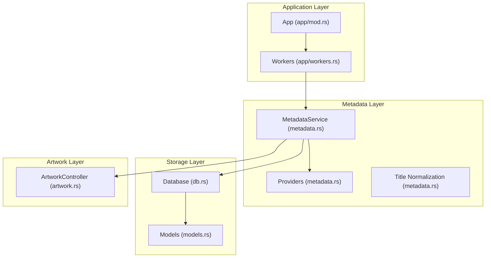
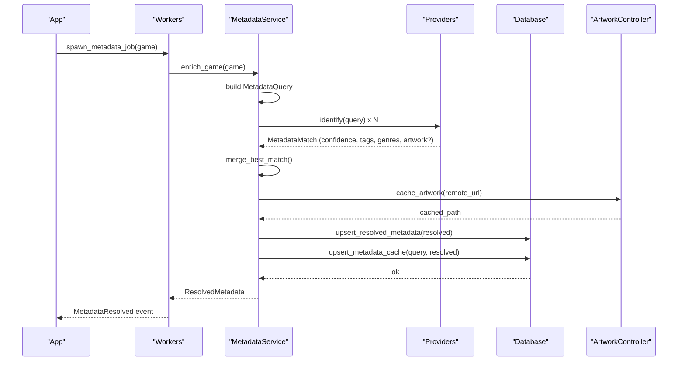
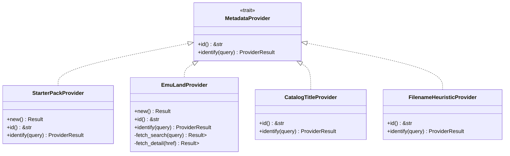
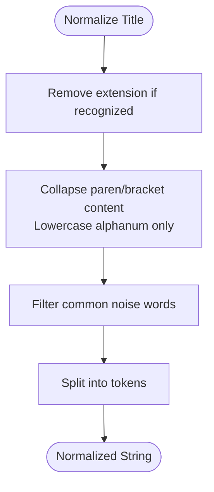
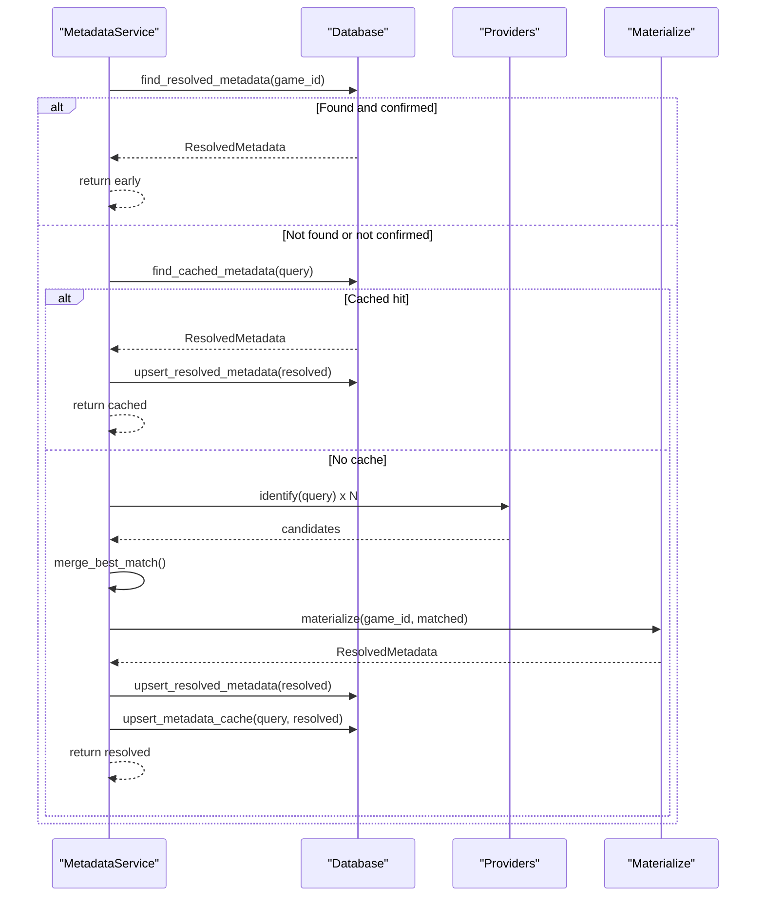
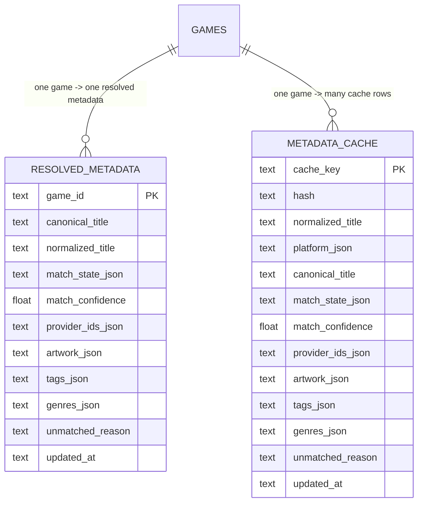
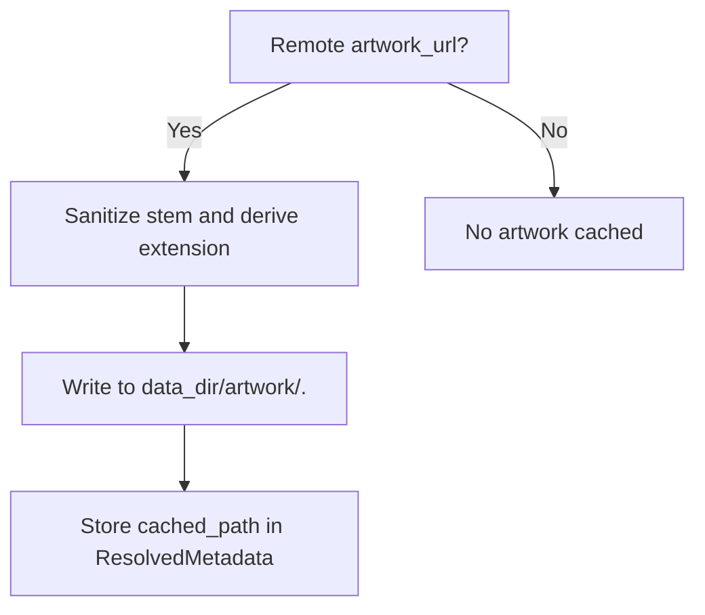
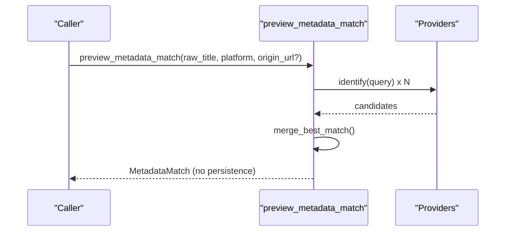
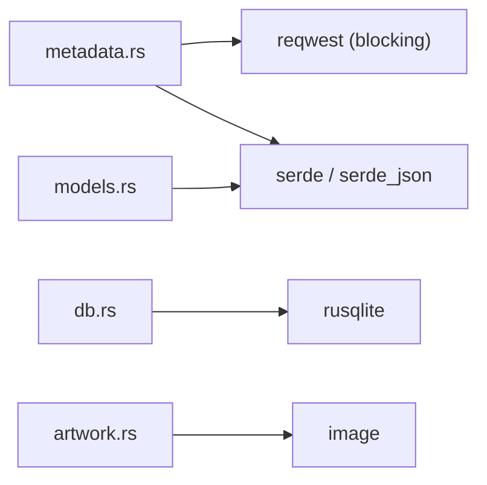

# Metadata Resolution Engine

<cite>
**Referenced Files in This Document**
- [metadata.rs](file://src/metadata.rs)
- [db.rs](file://src/db.rs)
- [models.rs](file://src/models.rs)
- [config.rs](file://src/config.rs)
- [artwork.rs](file://src/artwork.rs)
- [lib.rs](file://src/lib.rs)
- [app/mod.rs](file://src/app/mod.rs)
- [app/workers.rs](file://src/app/workers.rs)
- [Cargo.toml](file://Cargo.toml)
- [starter_metadata.json](file://support/starter_metadata.json)
</cite>

## Table of Contents
1. [Introduction](#introduction)
2. [Project Structure](#project-structure)
3. [Core Components](#core-components)
4. [Architecture Overview](#architecture-overview)
5. [Detailed Component Analysis](#detailed-component-analysis)
6. [Dependency Analysis](#dependency-analysis)
7. [Performance Considerations](#performance-considerations)
8. [Troubleshooting Guide](#troubleshooting-guide)
9. [Conclusion](#conclusion)
10. [Appendices](#appendices)

## Introduction
This document explains the metadata resolution engine that powers title normalization, provider-based matching, caching, and artwork integration. It covers the provider architecture, matching strategies, caching behavior, and integration with the database and artwork subsystems. It also provides configuration guidance, troubleshooting steps, and optimization tips for large libraries.

## Project Structure
The metadata engine is implemented primarily in the metadata module and integrates with the database, models, artwork, and application orchestration layers.

**Diagram sources**
- [app/mod.rs:125-170](file://src/app/mod.rs#L125-L170)
- [app/workers.rs:42-57](file://src/app/workers.rs#L42-L57)
- [metadata.rs:237-369](file://src/metadata.rs#L237-L369)
- [db.rs:35-117](file://src/db.rs#L35-L117)
- [artwork.rs:35-208](file://src/artwork.rs#L35-L208)

**Section sources**
- [lib.rs:10-22](file://src/lib.rs#L10-L22)
- [Cargo.toml:6-24](file://Cargo.toml#L6-L24)

## Core Components
- MetadataService orchestrates enrichment of GameEntry records by building a MetadataQuery, invoking providers, merging results, and persisting outcomes.
- Providers implement a common trait and return MetadataMatch results with confidence scores and optional artwork URLs.
- Title normalization transforms noisy filenames into stable comparison tokens.
- Caching persists resolved metadata and supports fast retrieval on subsequent runs.
- Artwork integration caches remote artwork locally and resolves artwork sources for UI rendering.

**Section sources**
- [metadata.rs:237-369](file://src/metadata.rs#L237-L369)
- [metadata.rs:40-43](file://src/metadata.rs#L40-L43)
- [metadata.rs:428-459](file://src/metadata.rs#L428-L459)
- [db.rs:543-623](file://src/db.rs#L543-L623)
- [artwork.rs:215-246](file://src/artwork.rs#L215-L246)

## Architecture Overview
The engine follows a pipeline:
- Build a MetadataQuery from a GameEntry.
- Invoke providers in order and collect candidates.
- Merge candidates into a single MetadataMatch using confidence and compatibility heuristics.
- Materialize ResolvedMetadata, optionally cache artwork, and persist to database.
- Resolve artwork for UI rendering.

**Diagram sources**
- [app/workers.rs:42-57](file://src/app/workers.rs#L42-L57)
- [metadata.rs:279-321](file://src/metadata.rs#L279-L321)
- [metadata.rs:371-408](file://src/metadata.rs#L371-L408)
- [metadata.rs:349-368](file://src/metadata.rs#L349-L368)
- [db.rs:510-585](file://src/db.rs#L510-L585)

## Detailed Component Analysis

### Provider Architecture
The engine defines a trait for pluggable metadata providers and ships with several built-in providers:
- StarterPackProvider: Matches against curated starter metadata with alias lists and platform filtering.
- EmuLandProvider: Performs web scraping of Emu-Land search and detail pages to extract metadata and artwork.
- CatalogTitleProvider: Treats the catalog-provided title as imported metadata.
- FilenameHeuristicProvider: Normalizes the raw filename as a fallback.

**Diagram sources**
- [metadata.rs:40-43](file://src/metadata.rs#L40-L43)
- [metadata.rs:55-112](file://src/metadata.rs#L55-L112)
- [metadata.rs:170-235](file://src/metadata.rs#L170-L235)
- [metadata.rs:147-168](file://src/metadata.rs#L147-L168)
- [metadata.rs:114-145](file://src/metadata.rs#L114-L145)

**Section sources**
- [metadata.rs:55-112](file://src/metadata.rs#L55-L112)
- [metadata.rs:170-235](file://src/metadata.rs#L170-L235)
- [metadata.rs:147-168](file://src/metadata.rs#L147-L168)
- [metadata.rs:114-145](file://src/metadata.rs#L114-L145)
- [starter_metadata.json:1-89](file://support/starter_metadata.json#L1-L89)

### Title Normalization and Matching Strategies
Normalization removes file extensions, discards content inside parentheses/brackets, converts to lowercase, splits on whitespace, and filters common noise words. Matching strategies:
- Exact alias match: high confidence.
- Containment match: moderate confidence.
- Loose token match: checks mutual token inclusion.
- Secondary artwork merging: when the best candidate lacks artwork, pick artwork from compatible titles among candidates.

**Diagram sources**
- [metadata.rs:428-459](file://src/metadata.rs#L428-L459)

**Section sources**
- [metadata.rs:428-459](file://src/metadata.rs#L428-L459)
- [metadata.rs:461-466](file://src/metadata.rs#L461-L466)
- [metadata.rs:384-408](file://src/metadata.rs#L384-L408)

### MetadataService and Enrichment Pipeline
MetadataService builds a MetadataQuery from a GameEntry, checks for existing user-confirmed metadata, consults cache, invokes providers, merges results, materializes artwork, and persists outcomes.

**Diagram sources**
- [metadata.rs:279-321](file://src/metadata.rs#L279-L321)
- [metadata.rs:371-408](file://src/metadata.rs#L371-L408)
- [metadata.rs:323-347](file://src/metadata.rs#L323-L347)
- [db.rs:587-623](file://src/db.rs#L587-L623)
- [db.rs:543-585](file://src/db.rs#L543-L585)

**Section sources**
- [metadata.rs:279-321](file://src/metadata.rs#L279-L321)
- [metadata.rs:323-347](file://src/metadata.rs#L323-L347)

### Caching Mechanism
Two caches are maintained:
- Resolved metadata cache: per-game resolved metadata persisted to the resolved_metadata table.
- Query cache: normalized queries mapped to resolved metadata in metadata_cache with composite keys derived from the query.

**Diagram sources**
- [db.rs:83-110](file://src/db.rs#L83-L110)
- [db.rs:543-585](file://src/db.rs#L543-L585)
- [db.rs:587-623](file://src/db.rs#L587-L623)

**Section sources**
- [db.rs:83-110](file://src/db.rs#L83-L110)
- [db.rs:543-585](file://src/db.rs#L543-L585)
- [db.rs:587-623](file://src/db.rs#L587-L623)

### Artwork Integration
Artwork is cached locally under the data directory’s artwork folder. The service downloads remote artwork when present and stores it with sanitized filenames. ArtworkController resolves artwork from cached files, companion files, or fallbacks.

**Diagram sources**
- [metadata.rs:349-368](file://src/metadata.rs#L349-L368)
- [artwork.rs:215-246](file://src/artwork.rs#L215-L246)

**Section sources**
- [metadata.rs:349-368](file://src/metadata.rs#L349-L368)
- [artwork.rs:215-246](file://src/artwork.rs#L215-L246)

### Preview and Configuration
Preview mode allows evaluating a title and platform without persisting results. Configuration includes ROM roots, download directories, and preferred emulators. Paths are resolved via AppPaths.

**Diagram sources**
- [metadata.rs:243-263](file://src/metadata.rs#L243-L263)
- [metadata.rs:371-408](file://src/metadata.rs#L371-L408)

**Section sources**
- [metadata.rs:243-263](file://src/metadata.rs#L243-L263)
- [config.rs:34-64](file://src/config.rs#L34-L64)

## Dependency Analysis
External dependencies relevant to metadata resolution:
- reqwest (blocking): HTTP requests for Emu-Land scraping and artwork fetching.
- serde/serde_json: serialization of models and cache payloads.
- rusqlite: SQLite-backed storage for games, resolved metadata, and cache.
- chrono: timestamps for updated_at fields.

**Diagram sources**
- [Cargo.toml:6-24](file://Cargo.toml#L6-L24)
- [metadata.rs:1-12](file://src/metadata.rs#L1-L12)
- [db.rs:1-17](file://src/db.rs#L1-L17)
- [artwork.rs:1-17](file://src/artwork.rs#L1-L17)

**Section sources**
- [Cargo.toml:6-24](file://Cargo.toml#L6-L24)

## Performance Considerations
- Provider invocation is linear in the number of providers; keep the provider list minimal and ordered by expected quality.
- Caching reduces repeated network calls and database writes; leverage cache hits by ensuring consistent query normalization.
- Merging candidates uses a single pass to select best match and secondary artwork; complexity is O(N) for N candidates.
- Database operations use batched creation of tables and indexes; ensure regular maintenance to keep indices effective.
- For large libraries, consider batching metadata enrichment and staggering network requests to avoid rate limiting.

[No sources needed since this section provides general guidance]

## Troubleshooting Guide
Common issues and resolutions:
- Incomplete metadata
  - Symptom: Unmatched or low-confidence results.
  - Actions: Verify normalized title accuracy, confirm provider order, and inspect starter metadata coverage for the platform.
  - References: [metadata.rs:428-459](file://src/metadata.rs#L428-L459), [metadata.rs:384-408](file://src/metadata.rs#L384-L408)

- Provider failures (network or parsing)
  - Symptom: Empty or partial metadata from a provider.
  - Actions: Retry enrichment, check network connectivity, and review Emu-Land scraping logic; consider adding delays or retries.
  - References: [metadata.rs:182-220](file://src/metadata.rs#L182-L220), [metadata.rs:504-547](file://src/metadata.rs#L504-L547)

- Cache corruption or stale data
  - Symptom: Outdated metadata or inconsistent artwork.
  - Actions: Clear metadata cache; use maintenance commands to reset or repair state if available; re-run enrichment.
  - References: [db.rs:761-766](file://src/db.rs#L761-L766), [db.rs:587-623](file://src/db.rs#L587-L623)

- Artwork not appearing
  - Symptom: Missing or failed artwork rendering.
  - Actions: Confirm artwork URL availability, verify cache write permissions, and check ArtworkController state.
  - References: [metadata.rs:349-368](file://src/metadata.rs#L349-L368), [artwork.rs:215-246](file://src/artwork.rs#L215-L246)

- Conflicts between providers
  - Symptom: Mixed tags/genres or conflicting artwork.
  - Actions: Review merge logic; ensure compatible titles are considered for artwork; adjust provider confidence thresholds if needed.
  - References: [metadata.rs:384-408](file://src/metadata.rs#L384-L408), [metadata.rs:415-426](file://src/metadata.rs#L415-L426)

**Section sources**
- [metadata.rs:182-220](file://src/metadata.rs#L182-L220)
- [metadata.rs:504-547](file://src/metadata.rs#L504-L547)
- [db.rs:761-766](file://src/db.rs#L761-L766)
- [db.rs:587-623](file://src/db.rs#L587-L623)
- [metadata.rs:349-368](file://src/metadata.rs#L349-L368)
- [artwork.rs:215-246](file://src/artwork.rs#L215-L246)
- [metadata.rs:384-408](file://src/metadata.rs#L384-L408)
- [metadata.rs:415-426](file://src/metadata.rs#L415-L426)

## Conclusion
The metadata resolution engine combines robust title normalization, a flexible provider model, intelligent merging, and persistent caching to deliver accurate metadata and artwork for games. By tuning provider order, leveraging cache, and monitoring for common failure modes, you can achieve reliable and scalable metadata enrichment across large libraries.

[No sources needed since this section summarizes without analyzing specific files]

## Appendices

### Configuration Options
- AppPaths: Paths for config, data, downloads, and database.
- Config: ROM roots, managed download directory, scan preferences, and preferred emulators.
- Maintenance: Commands to clear metadata cache and repair state.

**Section sources**
- [config.rs:10-64](file://src/config.rs#L10-L64)
- [db.rs:761-766](file://src/db.rs#L761-L766)

### Provider Priority and Matching Behavior
- Provider order determines precedence; earlier providers with higher confidence dominate.
- Matching uses normalized titles and token compatibility for artwork merging.
- CatalogTitleProvider and FilenameHeuristicProvider act as safety nets.

**Section sources**
- [metadata.rs:270-276](file://src/metadata.rs#L270-L276)
- [metadata.rs:384-408](file://src/metadata.rs#L384-L408)
- [metadata.rs:147-168](file://src/metadata.rs#L147-L168)
- [metadata.rs:114-145](file://src/metadata.rs#L114-L145)

### Integration Patterns
- Background enrichment: Workers spawn per-game metadata jobs during startup.
- UI integration: App loads games and metadata together, and synchronizes artwork display.

**Section sources**
- [app/workers.rs:33-57](file://src/app/workers.rs#L33-L57)
- [app/mod.rs:125-170](file://src/app/mod.rs#L125-L170)
- [app/mod.rs:331-347](file://src/app/mod.rs#L331-L347)