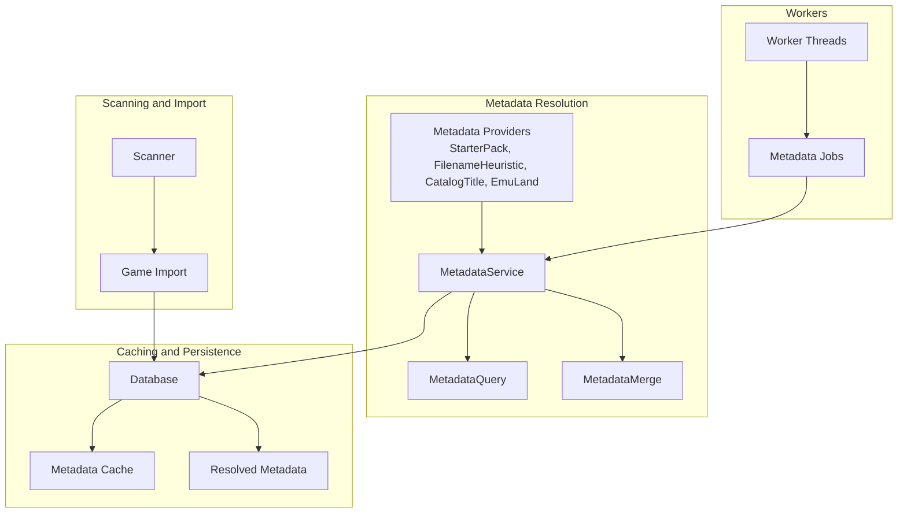
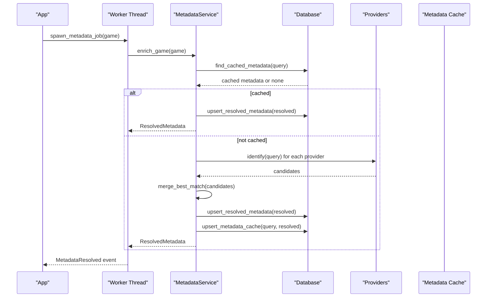
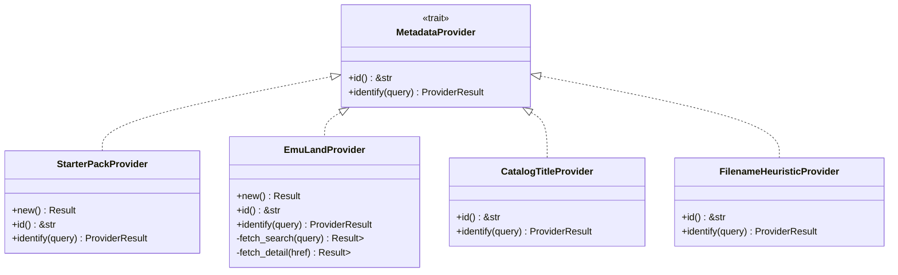
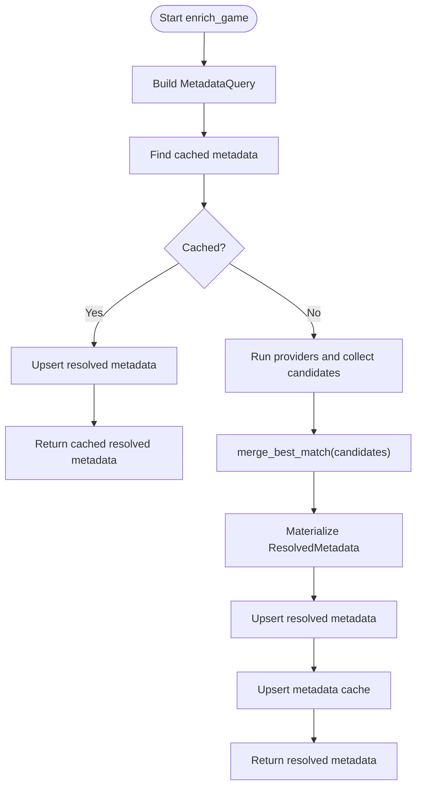
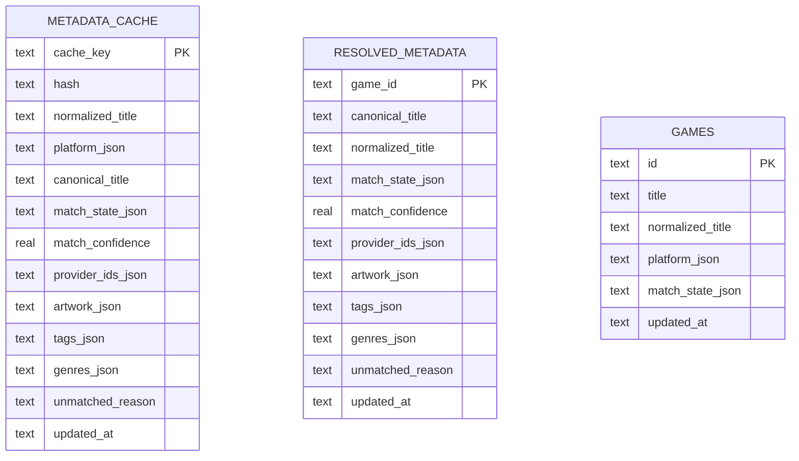
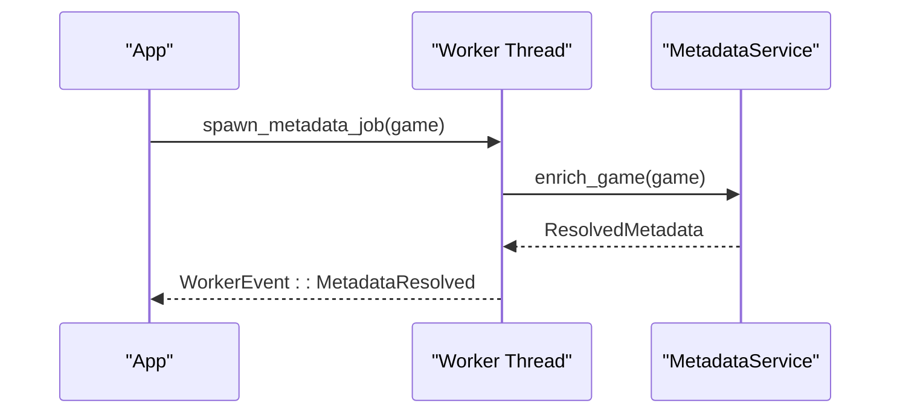
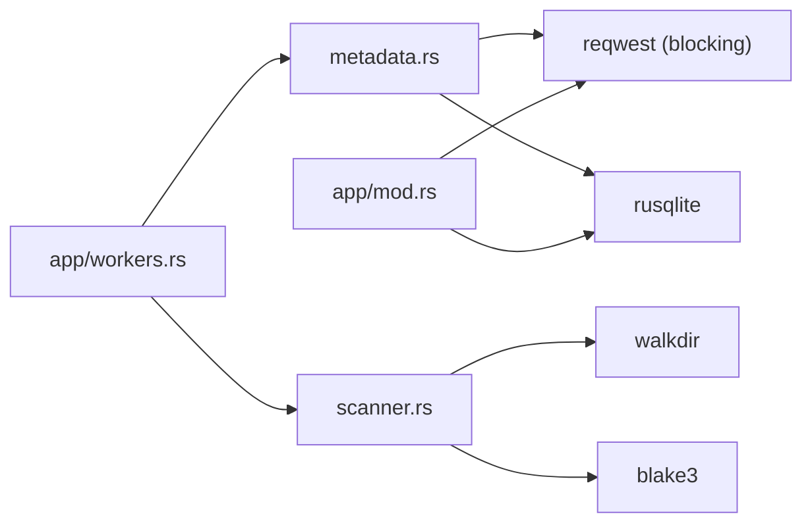

# Performance Optimization and Best Practices

<cite>
**Referenced Files in This Document**
- [metadata.rs](file://src/metadata.rs)
- [db.rs](file://src/db.rs)
- [scanner.rs](file://src/scanner.rs)
- [workers.rs](file://src/app/workers.rs)
- [app/mod.rs](file://src/app/mod.rs)
- [models.rs](file://src/models.rs)
- [config.rs](file://src/config.rs)
- [lib.rs](file://src/lib.rs)
- [Cargo.toml](file://Cargo.toml)
</cite>

## Table of Contents
1. [Introduction](#introduction)
2. [Project Structure](#project-structure)
3. [Core Components](#core-components)
4. [Architecture Overview](#architecture-overview)
5. [Detailed Component Analysis](#detailed-component-analysis)
6. [Dependency Analysis](#dependency-analysis)
7. [Performance Considerations](#performance-considerations)
8. [Troubleshooting Guide](#troubleshooting-guide)
9. [Conclusion](#conclusion)
10. [Appendices](#appendices)

## Introduction
This document focuses on performance optimization and best practices for metadata resolution in the application. It explains the provider prioritization strategy, early termination conditions, and batch processing optimizations. It documents memory management techniques, string allocation minimization, and efficient data structure usage. It also provides profiling guidance for identifying bottlenecks, parallel processing opportunities, async conversion strategies, resource limiting mechanisms, provider configuration, cache tuning, query optimization, performance benchmarks, scaling considerations for large libraries, and monitoring approaches. Finally, it includes troubleshooting guidance for slow metadata resolution and optimization techniques for specific use cases.

## Project Structure
The metadata resolution pipeline spans several modules:
- Metadata providers and resolution logic
- Database-backed caching and persistence
- Scanning and import utilities
- Worker threads for parallel processing
- Application orchestration and UI integration

**Diagram sources**
- [metadata.rs:40-408](file://src/metadata.rs#L40-L408)
- [db.rs:543-623](file://src/db.rs#L543-L623)
- [scanner.rs:158-265](file://src/scanner.rs#L158-L265)
- [workers.rs:33-57](file://src/app/workers.rs#L33-L57)

**Section sources**
- [lib.rs:1-39](file://src/lib.rs#L1-L39)
- [metadata.rs:237-369](file://src/metadata.rs#L237-L369)
- [db.rs:18-117](file://src/db.rs#L18-L117)
- [scanner.rs:158-265](file://src/scanner.rs#L158-L265)
- [workers.rs:33-57](file://src/app/workers.rs#L33-L57)

## Core Components
- Metadata providers implement a trait with a deterministic identification method and return structured matches with confidence scores.
- MetadataService orchestrates provider execution, cache checks, and materialization of resolved metadata.
- Database provides caching tables for metadata and resolved records, with indexes to accelerate lookups.
- Workers spawn background threads to process metadata enrichment concurrently for all games.
- Scanner and import utilities prepare game entries and compute hashes for deduplication and cache keys.

Key performance-relevant elements:
- Provider prioritization order in MetadataService initialization.
- Early exit when cached metadata exists.
- Merge logic that selects the best match and augments artwork/tags/genres from secondary providers.
- Caching via metadata_cache and resolved_metadata tables with composite keys.

**Section sources**
- [metadata.rs:40-408](file://src/metadata.rs#L40-L408)
- [metadata.rs:237-369](file://src/metadata.rs#L237-L369)
- [db.rs:543-623](file://src/db.rs#L543-L623)
- [workers.rs:33-57](file://src/app/workers.rs#L33-L57)

## Architecture Overview
The metadata resolution architecture emphasizes:
- Deterministic provider ordering to maximize hit rates early.
- Efficient caching to avoid repeated network and parsing work.
- Parallelism via worker threads to scale across large libraries.
- Minimal string allocations and reuse of normalized titles.

**Diagram sources**
- [workers.rs:42-57](file://src/app/workers.rs#L42-L57)
- [metadata.rs:279-321](file://src/metadata.rs#L279-L321)
- [db.rs:587-623](file://src/db.rs#L587-L623)

## Detailed Component Analysis

### Metadata Providers and Resolution Strategy
- Provider trait defines identification by returning an optional match with confidence and tags/genres/artwork.
- Provider order determines prioritization:
  - StarterPackProvider: high-confidence matches against curated starter metadata.
  - EmuLandProvider: external web scraping with robust parsing and artwork extraction.
  - CatalogTitleProvider: lightweight import path when origin_url is present.
  - FilenameHeuristicProvider: fallback normalization for filenames.
- Early termination occurs when a provider returns a strong match; otherwise, candidates are merged by highest confidence, with artwork/tags/genres augmentation when compatible.

**Diagram sources**
- [metadata.rs:40-145](file://src/metadata.rs#L40-L145)
- [metadata.rs:170-235](file://src/metadata.rs#L170-L235)

**Section sources**
- [metadata.rs:40-145](file://src/metadata.rs#L40-L145)
- [metadata.rs:170-235](file://src/metadata.rs#L170-L235)

### MetadataService and Merge Logic
- MetadataService builds a MetadataQuery from a GameEntry and resolves metadata using providers.
- It checks for cached metadata first, then runs providers, and finally merges candidates.
- Merge logic:
  - Selects the candidate with the highest confidence.
  - If the best lacks artwork, it attempts to augment from compatible candidates sharing normalized titles.
  - Merges tags and genres from all candidates into a de-duplicated list.

**Diagram sources**
- [metadata.rs:279-321](file://src/metadata.rs#L279-L321)
- [metadata.rs:371-408](file://src/metadata.rs#L371-L408)

**Section sources**
- [metadata.rs:279-321](file://src/metadata.rs#L279-L321)
- [metadata.rs:371-408](file://src/metadata.rs#L371-L408)

### Database Caching and Indexing
- Metadata cache table stores composite keys derived from hash and normalized title plus platform.
- Resolved metadata table persists final results with JSON-serialized enums and lists.
- Indexes on hash and normalized_title improve lookup performance.
- Upsert operations update existing rows to avoid duplication.

**Diagram sources**
- [db.rs:96-113](file://src/db.rs#L96-L113)
- [db.rs:543-623](file://src/db.rs#L543-L623)

**Section sources**
- [db.rs:96-113](file://src/db.rs#L96-L113)
- [db.rs:543-623](file://src/db.rs#L543-L623)

### Worker-Based Parallel Processing
- The application spawns a worker thread for each game’s metadata enrichment.
- Each worker constructs a MetadataService and performs enrichment independently.
- Events are sent back to the main thread to update UI and state.

**Diagram sources**
- [workers.rs:42-57](file://src/app/workers.rs#L42-L57)

**Section sources**
- [workers.rs:33-57](file://src/app/workers.rs#L33-L57)
- [app/mod.rs:386-400](file://src/app/mod.rs#L386-L400)

### Memory Management and String Allocation Minimization
- Normalization routines pre-allocate capacity and avoid unnecessary intermediate allocations.
- Tokenization and merging use iterators to minimize copies.
- Provider implementations reuse normalized strings and avoid redundant allocations.

Practical techniques:
- Pre-size buffers for normalized strings.
- Use iterator chains to avoid collecting intermediate collections unnecessarily.
- De-duplicate text lists by case-insensitive comparison before insertion.

**Section sources**
- [metadata.rs:428-459](file://src/metadata.rs#L428-L459)
- [metadata.rs:415-426](file://src/metadata.rs#L415-L426)

### Efficient Data Structures and Query Optimization
- Composite cache keys combine hash and normalized title with platform to reduce collisions.
- Database queries leverage prepared statements and JSON serialization for enums/lists.
- Single-query joins load games and metadata efficiently to avoid N+1 patterns.

**Section sources**
- [db.rs:820-831](file://src/db.rs#L820-L831)
- [db.rs:327-421](file://src/db.rs#L327-L421)

## Dependency Analysis
External dependencies impacting performance:
- reqwest (blocking) for HTTP requests in providers and downloads.
- rusqlite for embedded database with JSON serialization.
- blake3 for fast hashing during import and cache keys.
- walkdir for recursive filesystem traversal.

**Diagram sources**
- [Cargo.toml:6-24](file://Cargo.toml#L6-L24)
- [metadata.rs:6-11](file://src/metadata.rs#L6-L11)
- [scanner.rs:1-13](file://src/scanner.rs#L1-L13)
- [app/mod.rs:33-44](file://src/app/mod.rs#L33-L44)
- [workers.rs:13-19](file://src/app/workers.rs#L13-L19)

**Section sources**
- [Cargo.toml:6-24](file://Cargo.toml#L6-L24)

## Performance Considerations

### Provider Prioritization Strategy
- Order matters: StarterPackProvider is placed first to catch curated matches quickly.
- EmuLandProvider follows for external data.
- CatalogTitleProvider and FilenameHeuristicProvider act as fallbacks.
- This reduces average latency by short-circuiting on high-confidence matches.

Best practices:
- Keep StarterPack curated and aligned with library content.
- Monitor provider confidence thresholds and adjust heuristics carefully.

**Section sources**
- [metadata.rs:256-276](file://src/metadata.rs#L256-L276)
- [metadata.rs:371-382](file://src/metadata.rs#L371-L382)

### Early Termination Conditions
- Cached metadata lookup short-circuits provider execution.
- Strong provider matches can preempt others if sufficiently confident.
- Artwork augmentation occurs only when compatible with the best match.

**Section sources**
- [metadata.rs:296-303](file://src/metadata.rs#L296-L303)
- [metadata.rs:384-408](file://src/metadata.rs#L384-L408)

### Batch Processing Optimizations
- Parallel worker threads process all games concurrently.
- Each worker operates independently with its own MetadataService instance.
- No explicit batching within a single worker; consider batching at higher level if needed.

Recommendations:
- Tune worker count based on CPU cores and I/O characteristics.
- Introduce bounded concurrency if external APIs rate-limit.

**Section sources**
- [workers.rs:33-57](file://src/app/workers.rs#L33-L57)
- [app/mod.rs:386-400](file://src/app/mod.rs#L386-L400)

### Memory Management Techniques
- Pre-sized string buffers for normalization.
- Iterator-based merging avoids extra allocations.
- Reuse normalized titles across providers and cache keys.

**Section sources**
- [metadata.rs:428-459](file://src/metadata.rs#L428-L459)
- [metadata.rs:415-426](file://src/metadata.rs#L415-L426)

### String Allocation Minimization
- Normalize once per query and reuse normalized strings.
- Avoid repeated conversions between raw and normalized forms.
- Use efficient tokenization and containment checks.

**Section sources**
- [metadata.rs:428-459](file://src/metadata.rs#L428-L459)
- [metadata.rs:461-466](file://src/metadata.rs#L461-L466)

### Efficient Data Structure Usage
- Use HashMap for metadata lookups after initial join.
- Use Vec for candidate collection and max_by comparisons.
- Use HashSet-like de-duplication for tags/genres.

**Section sources**
- [db.rs:423-438](file://src/db.rs#L423-L438)
- [metadata.rs:384-408](file://src/metadata.rs#L384-L408)

### Profiling Guidance
- Measure provider identification time per game.
- Track cache hit ratio and miss latency.
- Profile database upserts and joins.
- Instrument worker throughput and queue sizes.

Recommended metrics:
- Provider identification latency per game.
- Cache hit percentage.
- Average merge time.
- Database query durations.

**Section sources**
- [metadata.rs:279-321](file://src/metadata.rs#L279-L321)
- [db.rs:543-623](file://src/db.rs#L543-L623)

### Parallel Processing Opportunities
- Current implementation spawns one worker per game; consider:
  - Bounded thread pool with configurable concurrency.
  - Work-stealing queues for dynamic load balancing.
  - Async conversion using async runtime for I/O-bound tasks.

Constraints:
- reqwest is blocking; mixing async requires careful coordination.
- SQLite writes are serialized; consider batching writes.

**Section sources**
- [workers.rs:33-57](file://src/app/workers.rs#L33-L57)
- [Cargo.toml:15-16](file://Cargo.toml#L15-L16)

### Async Conversion Strategies
- Convert HTTP clients to async variants (e.g., tokio, hyper) for non-blocking I/O.
- Use async database drivers or connection pools.
- Offload heavy parsing to blocking threads via async runtime executors.

Caution:
- Ensure thread-safe access to shared resources (cache, DB).
- Maintain deterministic provider order and merge semantics.

**Section sources**
- [Cargo.toml:15-16](file://Cargo.toml#L15-L16)

### Resource Limiting Mechanisms
- Limit concurrent metadata workers to prevent I/O saturation.
- Apply backpressure on external API calls (rate limits).
- Control download bandwidth and chunk sizes.

**Section sources**
- [workers.rs:33-57](file://src/app/workers.rs#L33-L57)
- [app/mod.rs:623-667](file://src/app/mod.rs#L623-L667)

### Provider Configuration Best Practices
- Configure provider order based on library content and confidence.
- Keep StarterPack curated and updated regularly.
- Monitor provider failure rates and adjust timeouts.

**Section sources**
- [metadata.rs:256-276](file://src/metadata.rs#L256-L276)

### Cache Tuning
- Use composite keys: hash + normalized title + platform.
- Maintain cache freshness with TTL or invalidation policies.
- Monitor cache hit ratio and tune provider confidence thresholds.

**Section sources**
- [db.rs:820-831](file://src/db.rs#L820-L831)
- [db.rs:587-623](file://src/db.rs#L587-L623)

### Query Optimization
- Use prepared statements and JSON serialization for enums/lists.
- Leverage indexes on hash and normalized_title.
- Prefer single-query joins to avoid N+1 patterns.

**Section sources**
- [db.rs:327-421](file://src/db.rs#L327-L421)
- [db.rs:96-113](file://src/db.rs#L96-L113)

### Performance Benchmarks
- Typical provider identification latency depends on:
  - StarterPack: O(N) over curated entries.
  - EmuLand: Network latency + HTML parsing.
  - Fallbacks: O(1) normalization.
- Database upsert latency scales with metadata size (JSON serialization).
- Worker throughput depends on CPU and I/O.

Recommendations:
- Benchmark provider order impact on hit rate and latency.
- Measure cache hit ratio and tune provider thresholds.
- Profile database operations and optimize indexes.

**Section sources**
- [metadata.rs:72-111](file://src/metadata.rs#L72-L111)
- [metadata.rs:182-234](file://src/metadata.rs#L182-L234)
- [db.rs:510-541](file://src/db.rs#L510-L541)

### Scaling Considerations for Large Libraries
- Parallel workers: increase concurrency cautiously.
- Database: ensure SSD storage and adequate free space.
- Provider updates: batch updates to StarterPack to reduce runtime scans.
- Monitoring: track worker queue length and completion times.

**Section sources**
- [workers.rs:33-57](file://src/app/workers.rs#L33-L57)
- [db.rs:510-541](file://src/db.rs#L510-L541)

### Monitoring Approaches
- Track provider identification counts and latencies.
- Monitor cache hit ratio and misses.
- Observe worker queue depth and completion rates.
- Log errors and timeouts from external providers.

**Section sources**
- [workers.rs:42-57](file://src/app/workers.rs#L42-L57)
- [metadata.rs:279-321](file://src/metadata.rs#L279-L321)

## Troubleshooting Guide

Common slow-down scenarios:
- External provider timeouts or rate limits.
- Large cache misses requiring repeated network calls.
- Slow filesystem scans or duplicate imports.
- Database contention on upserts.

Diagnostic steps:
- Enable logging around provider identification and cache lookups.
- Measure provider latency and cache hit ratio.
- Verify database indexes are present and used.
- Inspect worker queue and completion times.

Mitigations:
- Increase timeouts and retry with backoff for external providers.
- Pre-warm cache with known titles.
- Optimize filesystem traversal and deduplication.
- Batch database writes and tune transaction sizes.

**Section sources**
- [metadata.rs:182-234](file://src/metadata.rs#L182-L234)
- [db.rs:543-623](file://src/db.rs#L543-L623)
- [scanner.rs:158-265](file://src/scanner.rs#L158-L265)

## Conclusion
The metadata resolution pipeline is designed for determinism and scalability. Provider prioritization, caching, and parallel workers collectively reduce latency and improve throughput. By tuning provider order, optimizing cache keys, leveraging efficient data structures, and applying resource limits, the system can handle large libraries effectively. Profiling and monitoring provide actionable insights for continuous improvement.

## Appendices

### Provider Confidence Thresholds and Heuristics
- StarterPackProvider: high confidence for curated matches.
- EmuLandProvider: moderate confidence with artwork augmentation.
- CatalogTitleProvider: low-to-moderate confidence for imported titles.
- FilenameHeuristicProvider: low confidence fallback.

**Section sources**
- [metadata.rs:72-111](file://src/metadata.rs#L72-L111)
- [metadata.rs:182-234](file://src/metadata.rs#L182-L234)
- [metadata.rs:154-167](file://src/metadata.rs#L154-L167)
- [metadata.rs:121-144](file://src/metadata.rs#L121-L144)

### Cache Keys and Composite Indexing
- Composite keys: hash and normalized title with platform.
- Indexes: hash and normalized_title for fast lookups.

**Section sources**
- [db.rs:820-831](file://src/db.rs#L820-L831)
- [db.rs:96-113](file://src/db.rs#L96-L113)