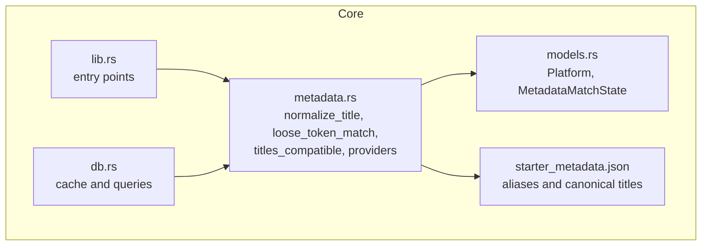
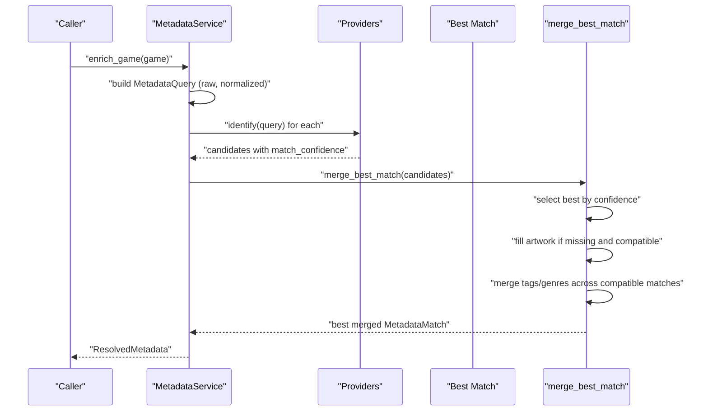
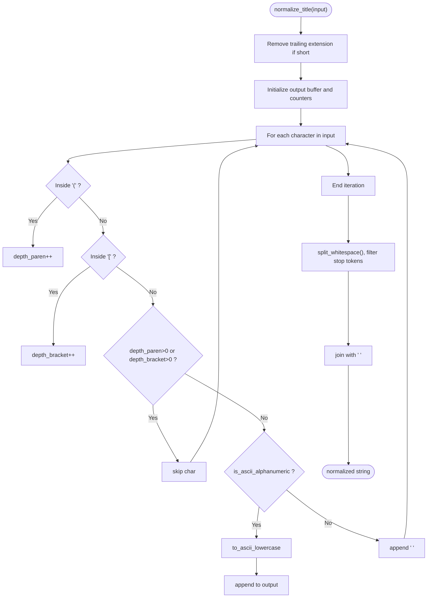
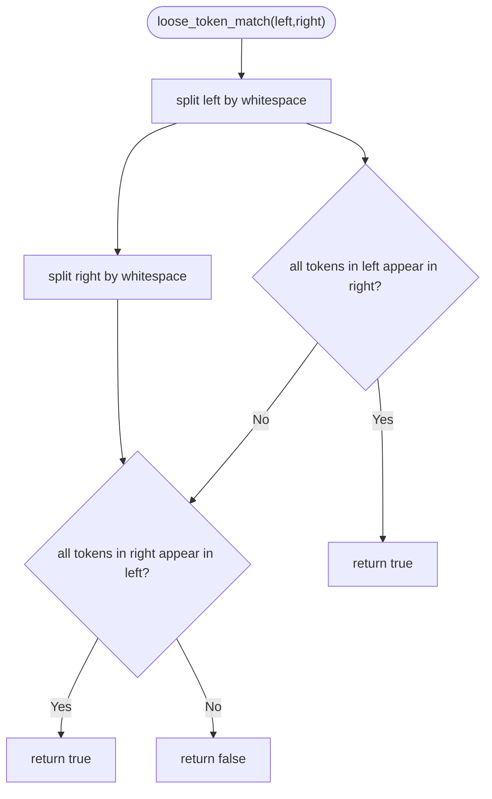
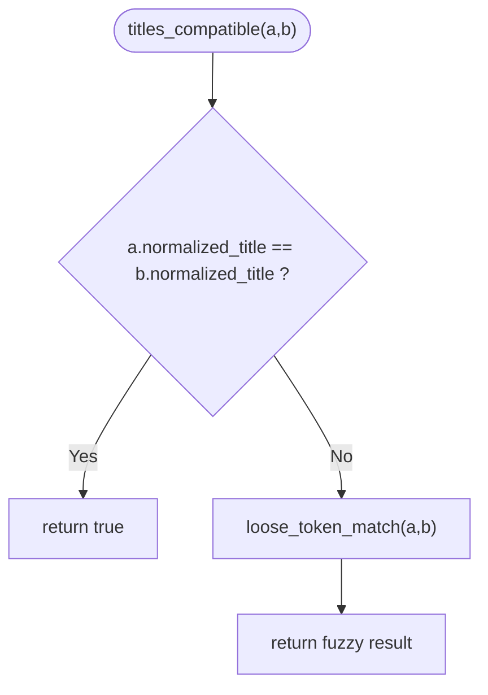
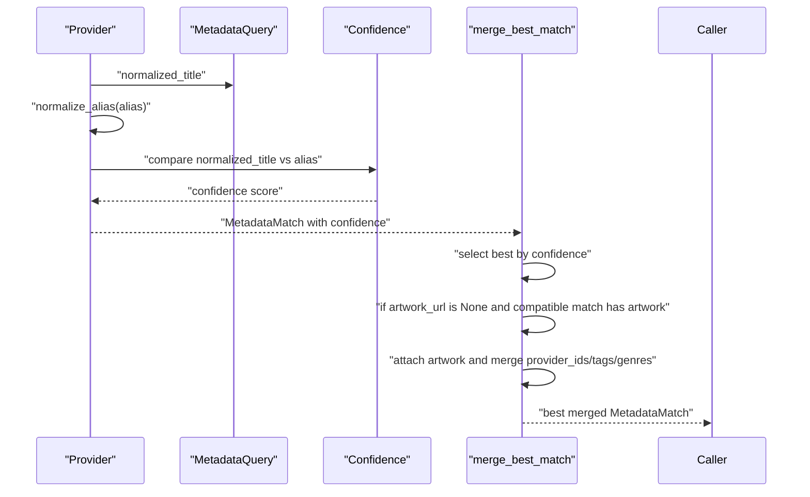
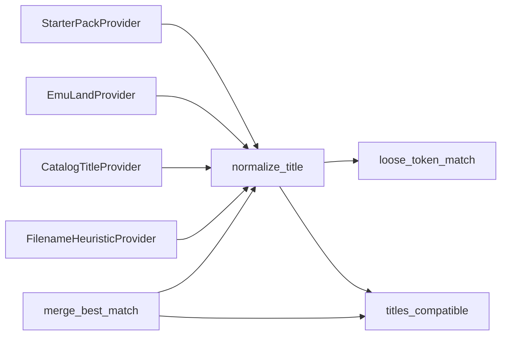

# Title Normalization and Matching

<cite>
**Referenced Files in This Document**
- [metadata.rs](file://src/metadata.rs)
- [models.rs](file://src/models.rs)
- [lib.rs](file://src/lib.rs)
- [db.rs](file://src/db.rs)
- [starter_metadata.json](file://support/starter_metadata.json)
</cite>

## Table of Contents
1. [Introduction](#introduction)
2. [Project Structure](#project-structure)
3. [Core Components](#core-components)
4. [Architecture Overview](#architecture-overview)
5. [Detailed Component Analysis](#detailed-component-analysis)
6. [Dependency Analysis](#dependency-analysis)
7. [Performance Considerations](#performance-considerations)
8. [Troubleshooting Guide](#troubleshooting-guide)
9. [Conclusion](#conclusion)
10. [Appendices](#appendices)

## Introduction
This document explains the title normalization and matching algorithms used to identify and enrich metadata for ROM filenames. It covers:
- The normalize_title pipeline: character filtering, bracket handling, extension removal, and token normalization
- The fuzzy matching algorithm loose_token_match
- Cross-provider compatibility checking via titles_compatible
- Confidence scoring and how different strategies contribute to match quality
- Edge cases and examples for normalization
- Troubleshooting and optimization guidance for large libraries

## Project Structure
The normalization and matching logic lives primarily in the metadata module, with supporting types in models.rs and usage in lib.rs and db.rs. Starter pack metadata is embedded in JSON for deterministic matching.

**Diagram sources**
- [metadata.rs:1-766](file://src/metadata.rs#L1-L766)
- [models.rs:1-415](file://src/models.rs#L1-L415)
- [lib.rs:1-39](file://src/lib.rs#L1-L39)
- [db.rs:880-974](file://src/db.rs#L880-L974)
- [starter_metadata.json:1-89](file://support/starter_metadata.json#L1-L89)

**Section sources**
- [metadata.rs:1-766](file://src/metadata.rs#L1-L766)
- [models.rs:1-415](file://src/models.rs#L1-L415)
- [lib.rs:1-39](file://src/lib.rs#L1-L39)
- [db.rs:880-974](file://src/db.rs#L880-L974)
- [starter_metadata.json:1-89](file://support/starter_metadata.json#L1-L89)

## Core Components
- normalize_title: Transforms noisy filenames into a canonical, lowercase, tokenized form by removing brackets, extensions, and stop tokens.
- loose_token_match: Performs fuzzy containment checks across token sets.
- titles_compatible: Determines if two normalized titles are compatible for merging artwork/tags/genres.
- Metadata providers: Use normalize_title and matching to resolve metadata and assign confidence scores.

Key responsibilities:
- Normalize titles consistently across providers and caches
- Provide robust fuzzy matching for real-world filenames
- Merge metadata from multiple providers while preserving highest confidence and compatible assets

**Section sources**
- [metadata.rs:428-466](file://src/metadata.rs#L428-L466)
- [metadata.rs:410-413](file://src/metadata.rs#L410-L413)

## Architecture Overview
The system builds a normalized query from a raw title, then:
- Providers compute confidence scores against normalized titles
- The best match is selected by highest confidence
- If the best lacks artwork, compatible matches may supply it
- Tags and genres are merged across compatible matches

**Diagram sources**
- [metadata.rs:279-321](file://src/metadata.rs#L279-L321)
- [metadata.rs:371-408](file://src/metadata.rs#L371-L408)

## Detailed Component Analysis

### normalize_title: Processing Pipeline
normalize_title performs the following steps:
1. Remove file extension if it appears to be a short extension (up to five characters)
2. Iterate characters:
   - Track nesting depth of parentheses and brackets
   - Skip characters inside parentheses/brackets
   - Keep alphanumeric ASCII characters, converting to lowercase
   - Replace non-alphanumeric characters with spaces
3. Split by whitespace, filter out stop tokens, and join back into a normalized token sequence

Stop tokens filtered include region/revision indicators and articles commonly present in filenames.

**Diagram sources**
- [metadata.rs:428-459](file://src/metadata.rs#L428-L459)

Examples of normalization transformations:
- Before: "Super Mario Bros. (USA) [!].nes"
  - After: "super mario bros"
- Before: "Street Fighter II Turbo (USA)"
  - After: "street fighter ii turbo"
- Before: "Super Contra II (Asia) (En) (Pirate)"
  - After: "super contra ii"

These examples are validated by tests and starter pack aliases.

**Section sources**
- [metadata.rs:428-459](file://src/metadata.rs#L428-L459)
- [metadata.rs:631-637](file://src/metadata.rs#L631-L637)
- [metadata.rs:640-652](file://src/metadata.rs#L640-L652)
- [metadata.rs:741-764](file://src/metadata.rs#L741-L764)
- [starter_metadata.json:1-89](file://support/starter_metadata.json#L1-L89)

### loose_token_match: Fuzzy Matching
loose_token_match determines if two normalized titles are fuzzily compatible by checking:
- Every token in the left title is present in the right title, OR
- Every token in the right title is present in the left title

This enables matching when titles differ by minor words or ordering.

**Diagram sources**
- [metadata.rs:461-466](file://src/metadata.rs#L461-L466)

### titles_compatible: Cross-Provider Compatibility
titles_compatible declares two matches compatible if:
- Their normalized titles are identical, OR
- loose_token_match returns true

This allows merging artwork and tags/genres from secondary matches when the best lacks certain fields.

**Diagram sources**
- [metadata.rs:410-413](file://src/metadata.rs#L410-L413)

### Confidence Scoring and Strategy Contributions
Providers compute confidence scores based on how closely normalized titles match:
- Exact equality: high confidence
- Containment (one contains the other): medium-high confidence
- Fuzzy token match: medium confidence

The best match is chosen by highest confidence. If the best lacks artwork, merge_best_match attempts to attach artwork from compatible matches with higher confidence, and merges tags/genres across compatible matches.

**Diagram sources**
- [metadata.rs:72-112](file://src/metadata.rs#L72-L112)
- [metadata.rs:384-408](file://src/metadata.rs#L384-L408)

**Section sources**
- [metadata.rs:72-112](file://src/metadata.rs#L72-L112)
- [metadata.rs:384-408](file://src/metadata.rs#L384-L408)

## Dependency Analysis
- normalize_title depends on:
  - Character classification and ASCII conversion
  - Bracket/parentheses depth tracking
  - Stop token filtering
- loose_token_match depends on:
  - Tokenization via split_whitespace
  - Containment checks across token sets
- titles_compatible depends on:
  - Exact equality and loose_token_match
- Providers depend on:
  - normalize_title for both query and aliases
  - titles_compatible for artwork/tag/genre merging

**Diagram sources**
- [metadata.rs:428-466](file://src/metadata.rs#L428-L466)
- [metadata.rs:410-413](file://src/metadata.rs#L410-L413)
- [metadata.rs:72-112](file://src/metadata.rs#L72-L112)
- [metadata.rs:384-408](file://src/metadata.rs#L384-L408)

**Section sources**
- [metadata.rs:428-466](file://src/metadata.rs#L428-L466)
- [metadata.rs:410-413](file://src/metadata.rs#L410-L413)
- [metadata.rs:72-112](file://src/metadata.rs#L72-L112)
- [metadata.rs:384-408](file://src/metadata.rs#L384-L408)

## Performance Considerations
- Pre-normalize titles once per query and reuse normalized_title across providers to avoid repeated computation.
- Use the starter pack provider first for fast exact/fuzzy matches against curated aliases.
- Cache resolved metadata keyed by normalized_title to avoid re-querying providers.
- Limit alias scanning to relevant platforms to reduce unnecessary comparisons.
- For large libraries, batch enrichment and leverage merge_best_match to minimize redundant network requests.

[No sources needed since this section provides general guidance]

## Troubleshooting Guide
Common issues and resolutions:
- Filenames with unusual punctuation or encoding:
  - Ensure normalize_title is applied to both query and aliases; verify stop tokens are appropriate for your dataset.
- Region/version suffixes causing mismatches:
  - Confirm that region/revision tokens are included in the stop token set; adjust if necessary.
- Fuzzy matches returning unexpected results:
  - Review loose_token_match behavior; consider adding stricter filters or exact-match fallbacks.
- Artwork not attached:
  - Verify titles_compatible conditions; ensure normalized titles are equivalent or token-compatible.
- Conflicts in tags/genres:
  - Understand merge_best_match deduplicates entries ignoring ASCII case; confirm uniqueness semantics meet expectations.

**Section sources**
- [metadata.rs:428-459](file://src/metadata.rs#L428-L459)
- [metadata.rs:461-466](file://src/metadata.rs#L461-L466)
- [metadata.rs:410-413](file://src/metadata.rs#L410-L413)
- [metadata.rs:384-408](file://src/metadata.rs#L384-L408)

## Conclusion
The normalization and matching pipeline provides robust, extensible metadata resolution:
- normalize_title standardizes titles across diverse filenames
- loose_token_match enables flexible fuzzy matching
- titles_compatible ensures compatible assets and attributes are merged
- Confidence scoring and provider orchestration yield high-quality results

[No sources needed since this section summarizes without analyzing specific files]

## Appendices

### Edge Cases and Examples
- Special characters and encoding:
  - normalize_title converts to ASCII lowercase and replaces non-alphanumeric characters with spaces; ensure downstream consumers handle remaining punctuation appropriately.
- Regional variations:
  - Region tokens like "usa", "world", "europe" are filtered; adjust stop tokens if your dataset uses different labels.
- Version differences:
  - Version tokens like "rev", "beta", "proto", "v1", "v2" are filtered; ensure this aligns with your intended matching behavior.
- Platform-specific nuances:
  - Provider selection considers platform; ensure platform detection is correct for accurate alias matching.

Validation examples:
- Normalization examples are covered in tests and starter metadata.
- Provider matching against curated aliases demonstrates cross-provider compatibility.

**Section sources**
- [metadata.rs:428-459](file://src/metadata.rs#L428-L459)
- [metadata.rs:631-637](file://src/metadata.rs#L631-L637)
- [metadata.rs:640-652](file://src/metadata.rs#L640-L652)
- [metadata.rs:741-764](file://src/metadata.rs#L741-L764)
- [starter_metadata.json:1-89](file://support/starter_metadata.json#L1-L89)