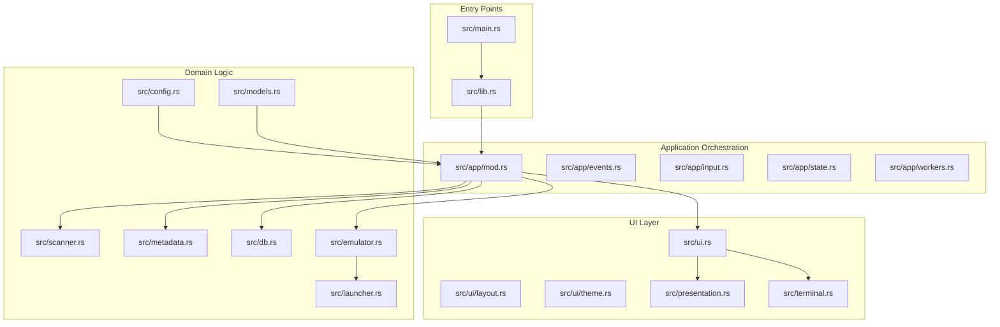
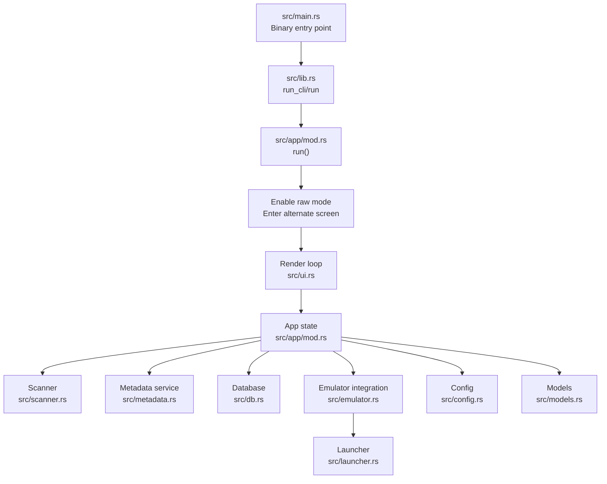
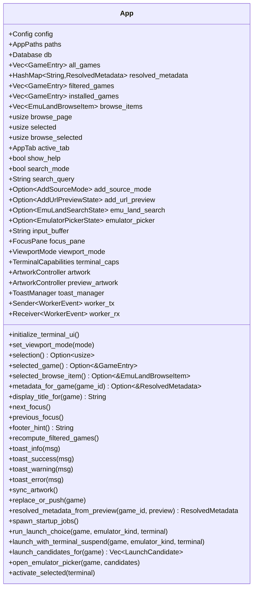
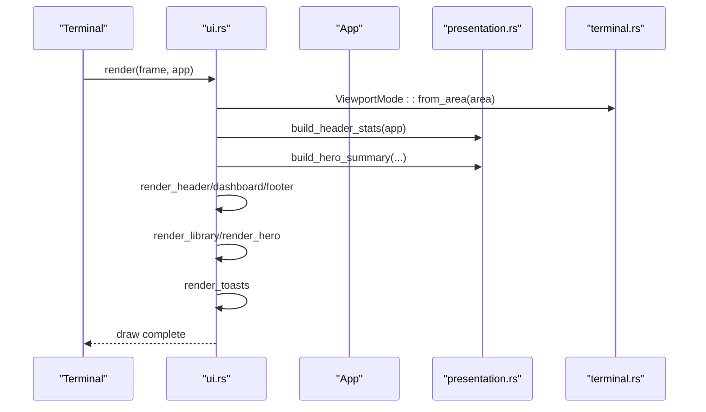
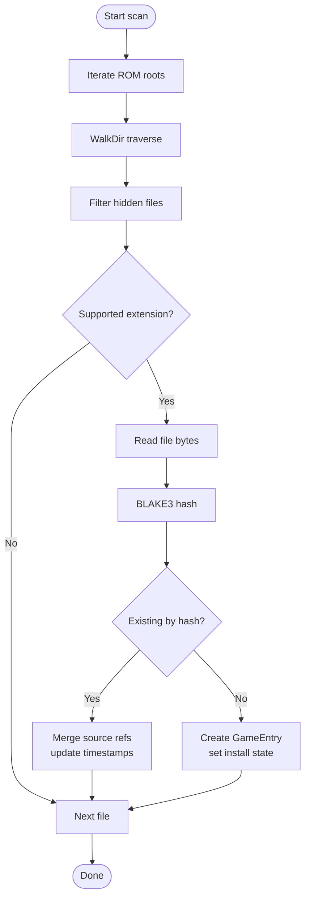
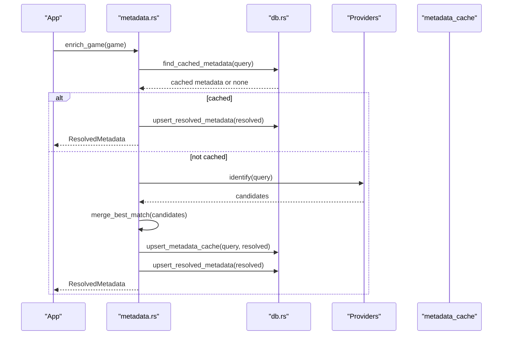
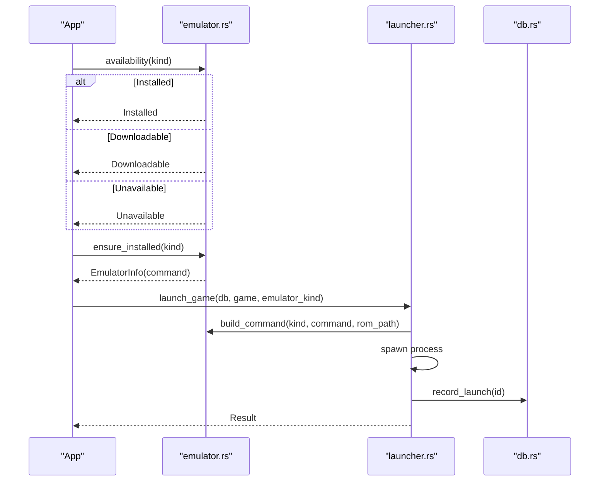
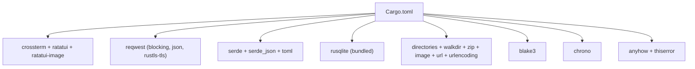

# Project Overview

<cite>
**Referenced Files in This Document**
- [Cargo.toml](file://Cargo.toml)
- [src/main.rs](file://src/main.rs)
- [src/lib.rs](file://src/lib.rs)
- [src/app/mod.rs](file://src/app/mod.rs)
- [src/ui.rs](file://src/ui.rs)
- [src/terminal.rs](file://src/terminal.rs)
- [src/presentation.rs](file://src/presentation.rs)
- [src/scanner.rs](file://src/scanner.rs)
- [src/metadata.rs](file://src/metadata.rs)
- [src/db.rs](file://src/db.rs)
- [src/emulator.rs](file://src/emulator.rs)
- [src/launcher.rs](file://src/launcher.rs)
- [src/config.rs](file://src/config.rs)
- [src/models.rs](file://src/models.rs)
- [support/starter_metadata.json](file://support/starter_metadata.json)
</cite>

## Table of Contents
1. [Introduction](#introduction)
2. [Project Structure](#project-structure)
3. [Core Components](#core-components)
4. [Architecture Overview](#architecture-overview)
5. [Detailed Component Analysis](#detailed-component-analysis)
6. [Dependency Analysis](#dependency-analysis)
7. [Performance Considerations](#performance-considerations)
8. [Troubleshooting Guide](#troubleshooting-guide)
9. [Conclusion](#conclusion)

## Introduction
Retro Launcher is a terminal-based game library manager for classic video games that combines CLI efficiency with modern TUI capabilities. It offers a hybrid desktop application experience: a fast, keyboard-driven terminal interface powered by Ratatui, backed by a local SQLite database and a robust metadata engine. Its core value proposition lies in streamlining the entire lifecycle of a retro game library—from discovery and scanning to metadata enrichment, artwork caching, and launching via emulators—without leaving the terminal.

Key benefits over traditional GUI ROM managers:
- Keyboard-first workflows and modal overlays for rapid navigation
- Intelligent metadata resolution with multiple providers and a starter pack
- Duplicate detection using BLAKE3 hashing for deduplication across sources
- Managed downloads and safe extraction from archives
- Emulator orchestration with automatic detection and installation hints
- Persistent, structured library state with runtime statistics and health checks

Target audience:
- Power users who prefer CLI ergonomics
- Retro collectors managing large libraries across multiple platforms
- Developers and sysadmins who want reproducible, portable solutions

Supported platforms (as implemented):
- Game Boy, Game Boy Color, Game Boy Advance
- Nintendo Entertainment System (NES)
- Super Nintendo Entertainment System (SNES)
- Sega Genesis/Mega Drive
- Sony PlayStation 1
- Nintendo DS
- Additional platforms present in the model set (e.g., N64, PS2, Wii, Xbox 360) are recognized for future or broader emulation scenarios

Unique features:
- BLAKE3-based duplicate detection during import
- Multi-provider metadata resolution (starter pack, Emu-Land scraping, filename heuristics)
- Safe ZIP extraction and filename normalization for downloads
- Terminal-aware artwork rendering with Iterm2/Kitty protocols

Position in the retro gaming ecosystem:
Retro Launcher sits between file system scanning and emulator launching, filling the gap between raw ROM management and interactive frontends. It integrates with popular emulators and curated catalogs to provide a unified, searchable, and launchable library.

**Section sources**
- [src/app/mod.rs:56–71:56-71](file://src/app/mod.rs#L56-L71)
- [src/models.rs:8–23:8-23](file://src/models.rs#L8-L23)
- [src/models.rs:62–76:62-76](file://src/models.rs#L62-L76)
- [src/scanner.rs:15–18:15-18](file://src/scanner.rs#L15-L18)
- [src/metadata.rs:13–13:13-13](file://src/metadata.rs#L13-L13)

## Project Structure
The project follows a layered, module-based structure:
- Entry points: binary and library entry for CLI and TUI
- Application orchestration: App state, event handling, worker coordination
- UI: TUI rendering with panels, overlays, and responsive layouts
- Domain logic: scanning, metadata enrichment, database operations, emulator integration
- Configuration and models: platform taxonomy, install states, and preferences

**Diagram sources**
- [src/main.rs:1-9](file://src/main.rs#L1-L9)
- [src/lib.rs:1-39](file://src/lib.rs#L1-L39)
- [src/app/mod.rs:1-123](file://src/app/mod.rs#L1-L123)
- [src/ui.rs:1-68](file://src/ui.rs#L1-L68)
- [src/presentation.rs:1-31](file://src/presentation.rs#L1-L31)
- [src/terminal.rs:1-59](file://src/terminal.rs#L1-L59)
- [src/scanner.rs:1-358](file://src/scanner.rs#L1-L358)
- [src/metadata.rs:1-766](file://src/metadata.rs#L1-L766)
- [src/db.rs:1-974](file://src/db.rs#L1-L974)
- [src/emulator.rs:1-182](file://src/emulator.rs#L1-L182)
- [src/launcher.rs:1-32](file://src/launcher.rs#L1-L32)
- [src/config.rs:1-114](file://src/config.rs#L1-L114)
- [src/models.rs:1-415](file://src/models.rs#L1-L415)

**Section sources**
- [src/main.rs:1-9](file://src/main.rs#L1-L9)
- [src/lib.rs:1-39](file://src/lib.rs#L1-L39)
- [src/app/mod.rs:1-123](file://src/app/mod.rs#L1-L123)
- [src/ui.rs:1-68](file://src/ui.rs#L1-L68)
- [src/terminal.rs:1-59](file://src/terminal.rs#L1-L59)
- [src/presentation.rs:1-31](file://src/presentation.rs#L1-L31)
- [src/scanner.rs:1-358](file://src/scanner.rs#L1-L358)
- [src/metadata.rs:1-766](file://src/metadata.rs#L1-L766)
- [src/db.rs:1-974](file://src/db.rs#L1-L974)
- [src/emulator.rs:1-182](file://src/emulator.rs#L1-L182)
- [src/launcher.rs:1-32](file://src/launcher.rs#L1-L32)
- [src/config.rs:1-114](file://src/config.rs#L1-L114)
- [src/models.rs:1-415](file://src/models.rs#L1-L415)

## Core Components
- Application orchestration (App): central state machine coordinating UI, scanning, metadata, and downloads; manages worker threads and terminal lifecycle
- Terminal UI (TUI): responsive layout with library, artwork, and summary panes; overlays for search, picker, and help
- Scanner: filesystem traversal with BLAKE3 hashing for duplicates; ZIP-safe extraction and filename normalization
- Metadata service: multi-provider matching (starter pack, Emu-Land, filename heuristics); cache and artwork retrieval
- Database: schema migration, repair, and queries; maintains games, resolved metadata, and caches
- Emulator integration: detection, installation hints, and launch orchestration
- Configuration: per-user paths, preferences, and defaults

**Section sources**
- [src/app/mod.rs:94–170:94-170](file://src/app/mod.rs#L94-L170)
- [src/ui.rs:23–68:23-68](file://src/ui.rs#L23-L68)
- [src/terminal.rs:5–36:5-36](file://src/terminal.rs#L5-L36)
- [src/scanner.rs:158–265:158-265](file://src/scanner.rs#L158-L265)
- [src/metadata.rs:237–369:237-369](file://src/metadata.rs#L237-L369)
- [src/db.rs:35–117:35-117](file://src/db.rs#L35-L117)
- [src/emulator.rs:83–127:83-127](file://src/emulator.rs#L83-L127)
- [src/config.rs:26–113:26-113](file://src/config.rs#L26-L113)

## Architecture Overview
Retro Launcher is a hybrid desktop application: a TUI frontend backed by a CLI core. The App orchestrates startup tasks, initializes the terminal, and renders the UI. Background workers handle scanning and metadata enrichment. The database persists state and caches. The metadata service integrates external providers and local starter pack. The launcher coordinates emulator detection and invocation.

**Diagram sources**
- [src/main.rs:1-9](file://src/main.rs#L1-L9)
- [src/lib.rs:20-38](file://src/lib.rs#L20-L38)
- [src/app/mod.rs:553-573](file://src/app/mod.rs#L553-L573)
- [src/ui.rs:23-68](file://src/ui.rs#L23-L68)
- [src/scanner.rs:158-191](file://src/scanner.rs#L158-L191)
- [src/metadata.rs:265-277](file://src/metadata.rs#L265-L277)
- [src/db.rs:35-46](file://src/db.rs#L35-L46)
- [src/emulator.rs:102-127](file://src/emulator.rs#L102-L127)
- [src/launcher.rs:9-27](file://src/launcher.rs#L9-L27)
- [src/config.rs:34-64](file://src/config.rs#L34-L64)
- [src/models.rs:1-415](file://src/models.rs#L1-L415)

## Detailed Component Analysis

### Application Orchestration (App)
The App struct holds configuration, paths, database connection, and UI state. It initializes terminal capabilities, artwork controllers, and worker channels. It computes filtered views, manages focus panes, and drives the main render loop. Startup jobs include scanning ROM roots, browsing, and metadata enrichment.

**Diagram sources**
- [src/app/mod.rs:94–170:94-170](file://src/app/mod.rs#L94-L170)
- [src/app/mod.rs:260-292](file://src/app/mod.rs#L260-L292)
- [src/app/mod.rs:314-347](file://src/app/mod.rs#L314-L347)
- [src/app/mod.rs:362-384](file://src/app/mod.rs#L362-L384)
- [src/app/mod.rs:386-400](file://src/app/mod.rs#L386-L400)
- [src/app/mod.rs:402-432](file://src/app/mod.rs#L402-L432)
- [src/app/mod.rs:434-449](file://src/app/mod.rs#L434-L449)
- [src/app/mod.rs:451-465](file://src/app/mod.rs#L451-L465)
- [src/app/mod.rs:467-491](file://src/app/mod.rs#L467-L491)
- [src/app/mod.rs:493-550](file://src/app/mod.rs#L493-L550)

**Section sources**
- [src/app/mod.rs:94–170:94-170](file://src/app/mod.rs#L94-L170)
- [src/app/mod.rs:260-292](file://src/app/mod.rs#L260-L292)
- [src/app/mod.rs:314-347](file://src/app/mod.rs#L314-L347)
- [src/app/mod.rs:362-384](file://src/app/mod.rs#L362-L384)
- [src/app/mod.rs:386-400](file://src/app/mod.rs#L386-L400)
- [src/app/mod.rs:402-432](file://src/app/mod.rs#L402-L432)
- [src/app/mod.rs:434-449](file://src/app/mod.rs#L434-L449)
- [src/app/mod.rs:451-465](file://src/app/mod.rs#L451-L465)
- [src/app/mod.rs:467-491](file://src/app/mod.rs#L467-L491)
- [src/app/mod.rs:493-550](file://src/app/mod.rs#L493-L550)

### Terminal UI and Rendering
The UI module renders a responsive layout with three main areas: header, dashboard, and footer. The dashboard splits into library and hero panes. Overlays appear for search, adding sources, emulator picker, and help. The terminal module detects capabilities (colors, image protocol) and adapts layout.

**Diagram sources**
- [src/ui.rs:23-68](file://src/ui.rs#L23-L68)
- [src/ui.rs:178-190](file://src/ui.rs#L178-L190)
- [src/ui.rs:192-274](file://src/ui.rs#L192-L274)
- [src/ui.rs:276-292](file://src/ui.rs#L276-L292)
- [src/ui.rs:294-337](file://src/ui.rs#L294-L337)
- [src/ui.rs:339-464](file://src/ui.rs#L339-L464)
- [src/ui.rs:466-561](file://src/ui.rs#L466-L561)
- [src/ui.rs:563-575](file://src/ui.rs#L563-L575)
- [src/ui.rs:577-600](file://src/ui.rs#L577-L600)
- [src/ui.rs:602-689](file://src/ui.rs#L602-L689)
- [src/ui.rs:691-761](file://src/ui.rs#L691-L761)
- [src/ui.rs:763-800](file://src/ui.rs#L763-L800)
- [src/presentation.rs:34-98](file://src/presentation.rs#L34-L98)
- [src/presentation.rs:172-268](file://src/presentation.rs#L172-L268)
- [src/terminal.rs:45-59](file://src/terminal.rs#L45-L59)
- [src/terminal.rs:92-132](file://src/terminal.rs#L92-L132)

**Section sources**
- [src/ui.rs:23-68](file://src/ui.rs#L23-L68)
- [src/ui.rs:178-274](file://src/ui.rs#L178-L274)
- [src/ui.rs:276-337](file://src/ui.rs#L276-L337)
- [src/ui.rs:339-464](file://src/ui.rs#L339-L464)
- [src/ui.rs:466-561](file://src/ui.rs#L466-L561)
- [src/ui.rs:563-575](file://src/ui.rs#L563-L575)
- [src/ui.rs:577-600](file://src/ui.rs#L577-L600)
- [src/ui.rs:602-689](file://src/ui.rs#L602-L689)
- [src/ui.rs:691-761](file://src/ui.rs#L691-L761)
- [src/ui.rs:763-800](file://src/ui.rs#L763-L800)
- [src/presentation.rs:34-98](file://src/presentation.rs#L34-L98)
- [src/presentation.rs:172-268](file://src/presentation.rs#L172-L268)
- [src/terminal.rs:45-59](file://src/terminal.rs#L45-L59)
- [src/terminal.rs:92-132](file://src/terminal.rs#L92-L132)

### Scanning and Duplicate Detection
The scanner traverses configured ROM roots, detects supported extensions, computes BLAKE3 hashes, and imports or updates entries. Duplicates are resolved by hash, merging source references and updating timestamps. ZIP archives are safely extracted, and filenames are normalized.

**Diagram sources**
- [src/scanner.rs:158-191](file://src/scanner.rs#L158-L191)
- [src/scanner.rs:193-265](file://src/scanner.rs#L193-L265)
- [src/scanner.rs:200-219](file://src/scanner.rs#L200-L219)
- [src/scanner.rs:203-217](file://src/scanner.rs#L203-L217)
- [src/scanner.rs:225-225](file://src/scanner.rs#L225-L225)

**Section sources**
- [src/scanner.rs:158-191](file://src/scanner.rs#L158-L191)
- [src/scanner.rs:193-265](file://src/scanner.rs#L193-L265)
- [src/scanner.rs:200-219](file://src/scanner.rs#L200-L219)
- [src/scanner.rs:203-217](file://src/scanner.rs#L203-L217)
- [src/scanner.rs:225-225](file://src/scanner.rs#L225-L225)

### Metadata Resolution and Artwork
The metadata service resolves titles using a starter pack, Emu-Land scraping, and filename heuristics. It merges provider results, caches outcomes, and retrieves artwork. The resolver normalizes titles and sanitizes stems for cache paths.

**Diagram sources**
- [src/metadata.rs:265-321](file://src/metadata.rs#L265-L321)
- [src/metadata.rs:371-382](file://src/metadata.rs#L371-L382)
- [src/metadata.rs:384-408](file://src/metadata.rs#L384-L408)
- [src/metadata.rs:428-459](file://src/metadata.rs#L428-L459)
- [src/metadata.rs:468-473](file://src/metadata.rs#L468-L473)
- [src/metadata.rs:488-502](file://src/metadata.rs#L488-L502)
- [src/metadata.rs:504-547](file://src/metadata.rs#L504-L547)
- [src/db.rs:587-623](file://src/db.rs#L587-L623)
- [src/db.rs:510-541](file://src/db.rs#L510-L541)
- [src/db.rs:543-585](file://src/db.rs#L543-L585)

**Section sources**
- [src/metadata.rs:265-321](file://src/metadata.rs#L265-L321)
- [src/metadata.rs:371-408](file://src/metadata.rs#L371-L408)
- [src/metadata.rs:428-459](file://src/metadata.rs#L428-L459)
- [src/metadata.rs:488-547](file://src/metadata.rs#L488-L547)
- [src/db.rs:510-541](file://src/db.rs#L510-L541)
- [src/db.rs:543-585](file://src/db.rs#L543-L585)
- [src/db.rs:587-623](file://src/db.rs#L587-L623)

### Emulator Integration and Launch
The emulator module detects installed emulators, enumerates candidates per platform, and builds launch commands. If an emulator is missing, it can install via package manager on supported hosts. The launcher executes the chosen emulator with the ROM path and records play events.

**Diagram sources**
- [src/emulator.rs:83-100](file://src/emulator.rs#L83-L100)
- [src/emulator.rs:102-127](file://src/emulator.rs#L102-L127)
- [src/emulator.rs:129-151](file://src/emulator.rs#L129-L151)
- [src/launcher.rs:9-27](file://src/launcher.rs#L9-L27)
- [src/db.rs:739-746](file://src/db.rs#L739-L746)

**Section sources**
- [src/emulator.rs:83-100](file://src/emulator.rs#L83-L100)
- [src/emulator.rs:102-127](file://src/emulator.rs#L102-L127)
- [src/emulator.rs:129-151](file://src/emulator.rs#L129-L151)
- [src/launcher.rs:9-27](file://src/launcher.rs#L9-L27)
- [src/db.rs:739-746](file://src/db.rs#L739-L746)

### Configuration and Paths
The configuration module loads or creates user-specific paths and defaults. It defines ROM roots, managed download directory, and preferred emulators per platform. Defaults include emulators aligned with supported platforms.

**Section sources**
- [src/config.rs:34-64](file://src/config.rs#L34-L64)
- [src/config.rs:66-104](file://src/config.rs#L66-L104)
- [src/config.rs:106-113](file://src/config.rs#L106-L113)

### Supported Platforms and Models
Platforms are modeled with display names, short labels, generations, and default vibes. Extensions map to platforms for import. Default emulators are assigned per platform.

**Section sources**
- [src/models.rs:8-23](file://src/models.rs#L8-L23)
- [src/models.rs:25-106](file://src/models.rs#L25-L106)
- [src/models.rs:62-76](file://src/models.rs#L62-L76)
- [src/models.rs:353-369](file://src/models.rs#L353-L369)

## Dependency Analysis
External dependencies include:
- Terminal and UI: crossterm, ratatui, ratatui-image
- Networking: reqwest (blocking, JSON, rustls-tls)
- Serialization: serde, serde_json, toml
- Storage: rusqlite (bundled)
- Utilities: directories, walkdir, zip, image, url, urlencoding, anyhow, thiserror
- Hashing: blake3
- Time: chrono

**Diagram sources**
- [Cargo.toml:6-24](file://Cargo.toml#L6-L24)

**Section sources**
- [Cargo.toml:6-24](file://Cargo.toml#L6-L24)

## Performance Considerations
- BLAKE3 hashing ensures fast duplicate detection during import
- Single-query JOIN-based loading of games and metadata reduces N+1 overhead
- ZIP extraction avoids misnaming by preferring archive basenames and safe collision handling
- Terminal rendering adapts to viewport size to balance content density and readability
- Worker threads decouple scanning and metadata enrichment from the UI loop

[No sources needed since this section provides general guidance]

## Troubleshooting Guide
Common issues and remedies:
- HTML/text payloads detected during download: the fetch routine validates content-type and rejects HTML responses
- Missing emulators: the emulator module reports unavailability and suggests installation; RetroArch is conditionally unavailable on specific platforms
- Broken downloads or missing payloads: the database repair migrates legacy rows, resets broken downloads, and normalizes URLs
- Terminal rendering problems: viewport thresholds and capability detection inform layout and image protocol selection

**Section sources**
- [src/app/mod.rs:623-686](file://src/app/mod.rs#L623-L686)
- [src/emulator.rs:83-100](file://src/emulator.rs#L83-L100)
- [src/db.rs:129-267](file://src/db.rs#L129-L267)
- [src/terminal.rs:45-59](file://src/terminal.rs#L45-L59)
- [src/terminal.rs:92-132](file://src/terminal.rs#L92-L132)

## Conclusion
Retro Launcher delivers a powerful, keyboard-centric experience for managing classic game libraries. By combining a modern TUI with robust scanning, metadata resolution, and emulator orchestration, it streamlines the entire lifecycle of a retro collection. Its use of BLAKE3 hashing, multi-provider metadata, and safe archive handling makes it reliable for large, diverse libraries. The hybrid architecture positions it as a practical bridge between CLI efficiency and contemporary UX.

[No sources needed since this section summarizes without analyzing specific files]