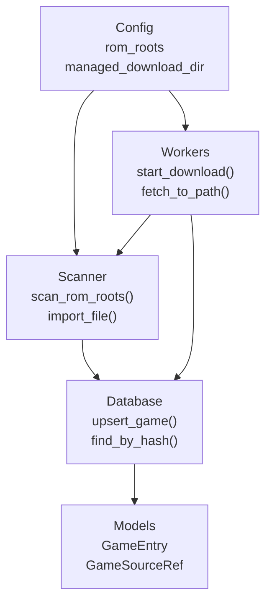
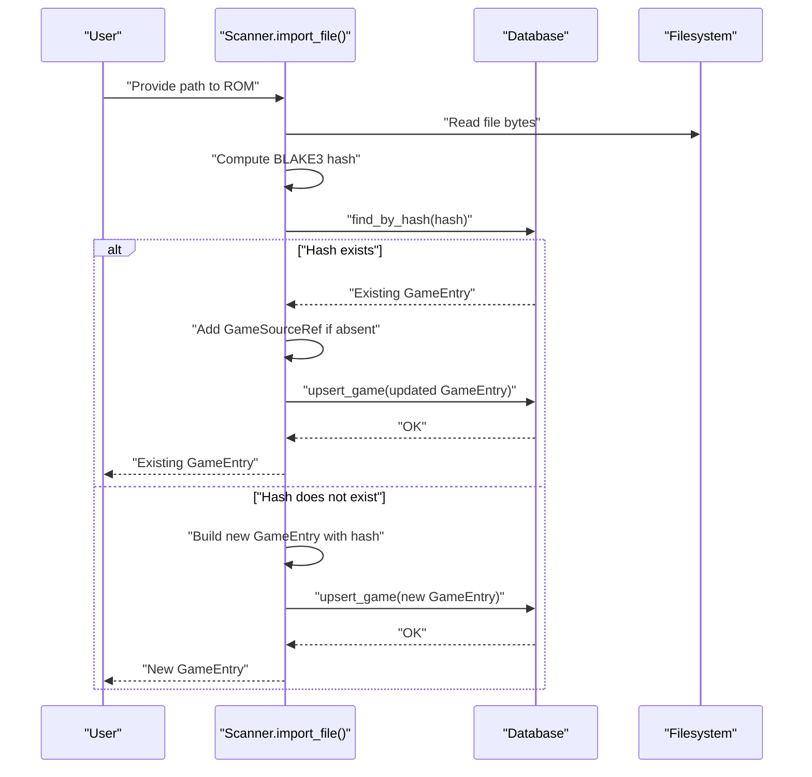
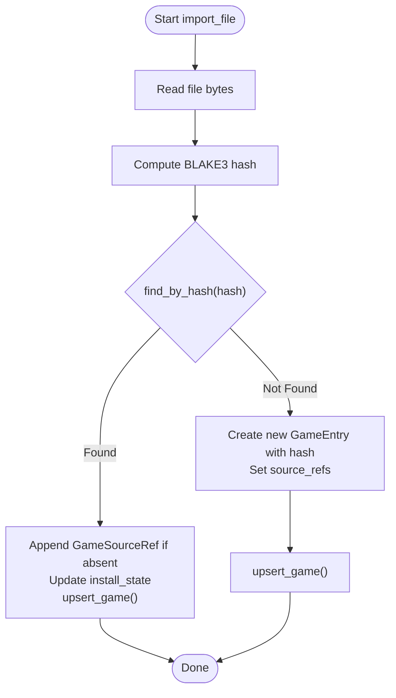
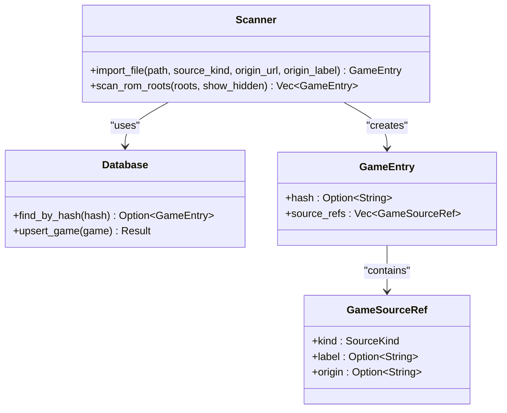
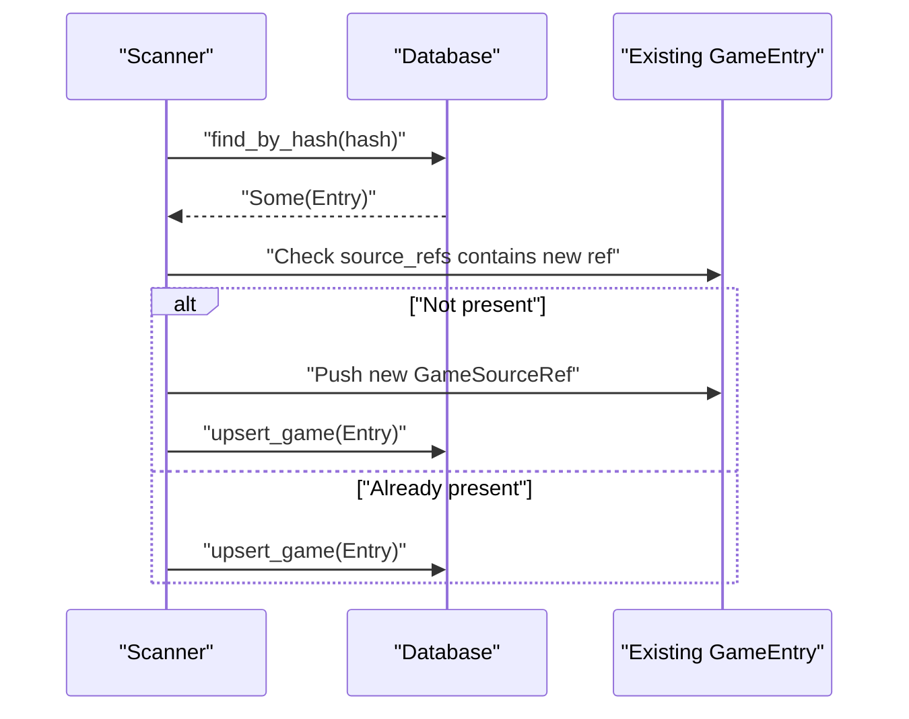
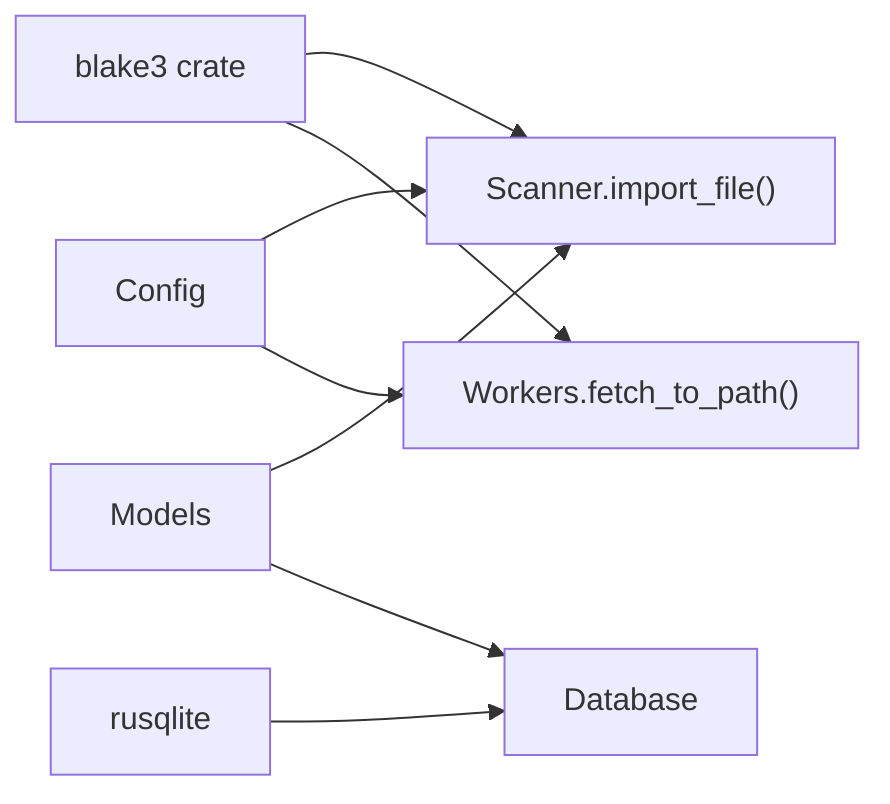

# Duplicate Detection and Hashing

<cite>
**Referenced Files in This Document**
- [Cargo.toml](file://Cargo.toml)
- [src/main.rs](file://src/main.rs)
- [src/config.rs](file://src/config.rs)
- [src/models.rs](file://src/models.rs)
- [src/db.rs](file://src/db.rs)
- [src/scanner.rs](file://src/scanner.rs)
- [src/app/workers.rs](file://src/app/workers.rs)
</cite>

## Table of Contents
1. [Introduction](#introduction)
2. [Project Structure](#project-structure)
3. [Core Components](#core-components)
4. [Architecture Overview](#architecture-overview)
5. [Detailed Component Analysis](#detailed-component-analysis)
6. [Dependency Analysis](#dependency-analysis)
7. [Performance Considerations](#performance-considerations)
8. [Troubleshooting Guide](#troubleshooting-guide)
9. [Conclusion](#conclusion)
10. [Appendices](#appendices)

## Introduction
This document explains the duplicate detection and BLAKE3 hashing system used to identify and merge identical ROMs across multiple sources and platforms. It covers how file content is hashed, how duplicates are detected and merged, and how source references are tracked. It also documents the import_file function, the relationship between hashes and game identification, performance implications, and configuration options for hash verification and duplicate resolution strategies.

## Project Structure
The hashing and duplicate detection pipeline spans several modules:
- Scanner: discovers ROMs, computes BLAKE3 hashes, and imports entries into the database.
- Database: persists GameEntry records, maintains uniqueness constraints, and provides lookup by hash.
- Workers: orchestrates downloads, validates payloads, verifies checksums, and merges duplicates.
- Models: defines GameEntry, GameSourceRef, and enums used across hashing and duplicate logic.
- Config: provides runtime configuration for ROM roots and scanning behavior.

**Diagram sources**
- [src/scanner.rs:158-265](file://src/scanner.rs#L158-L265)
- [src/db.rs:625-732](file://src/db.rs#L625-L732)
- [src/app/workers.rs:60-162](file://src/app/workers.rs#L60-L162)
- [src/models.rs:248-280](file://src/models.rs#L248-L280)
- [src/config.rs:26-32](file://src/config.rs#L26-L32)

**Section sources**
- [src/main.rs:1-9](file://src/main.rs#L1-L9)
- [src/config.rs:26-32](file://src/config.rs#L26-L32)

## Core Components
- BLAKE3 hashing: Used to compute a unique digest for each ROM’s content.
- Duplicate detection: Compares incoming hashes against stored entries and merges sources.
- Source reference tracking: Records origin and provenance for each entry.
- Import pipeline: Reads file bytes, computes hash, checks for duplicates, and upserts records.

Key implementation references:
- Hash computation and duplicate lookup: [src/scanner.rs:193-265](file://src/scanner.rs#L193-L265), [src/db.rs:719-732](file://src/db.rs#L719-L732)
- Source reference management: [src/models.rs:248-253](file://src/models.rs#L248-L253), [src/scanner.rs:204-211](file://src/scanner.rs#L204-L211)
- Database schema and uniqueness: [src/db.rs:52-76](file://src/db.rs#L52-L76)

**Section sources**
- [src/scanner.rs:193-265](file://src/scanner.rs#L193-L265)
- [src/db.rs:52-76](file://src/db.rs#L52-L76)
- [src/models.rs:248-253](file://src/models.rs#L248-L253)

## Architecture Overview
The system follows a deterministic pipeline:
- Discovery: scan ROM roots and filter supported extensions.
- Hashing: compute BLAKE3 digest of file bytes.
- Lookup: query database for existing entry with matching hash.
- Merge or insert:
  - If found, append a new source reference and update install state.
  - If not found, create a new GameEntry with hash and source references.
- Persistence: upsert into SQLite with unique hash constraint.

**Diagram sources**
- [src/scanner.rs:193-265](file://src/scanner.rs#L193-L265)
- [src/db.rs:719-732](file://src/db.rs#L719-L732)
- [src/db.rs:625-689](file://src/db.rs#L625-L689)

## Detailed Component Analysis

### Hash-Based Duplicate Detection Algorithm
- Hash computation: The entire file content is read and hashed with BLAKE3. The resulting digest is stored as a hex string in the GameEntry and indexed in the database.
- Duplicate detection: On import, the system queries the database for an existing GameEntry with the same hash. If found, the entry is reused and updated.
- Merge behavior: A new GameSourceRef is appended only if not already present, preserving provenance across multiple sources.

**Diagram sources**
- [src/scanner.rs:193-265](file://src/scanner.rs#L193-L265)
- [src/db.rs:719-732](file://src/db.rs#L719-L732)
- [src/db.rs:625-689](file://src/db.rs#L625-L689)

**Section sources**
- [src/scanner.rs:193-265](file://src/scanner.rs#L193-L265)
- [src/db.rs:719-732](file://src/db.rs#L719-L732)

### File Content Hashing Using BLAKE3
- Library: The project depends on the BLAKE3 crate for fast, secure hashing.
- Implementation: The scanner reads the entire file into memory, computes the digest, and stores it as a lowercase hex string.
- Indexing: The database schema enforces a unique constraint on the hash column, enabling O(log n) lookup via index.

**Diagram sources**
- [src/scanner.rs:193-265](file://src/scanner.rs#L193-L265)
- [src/db.rs:719-732](file://src/db.rs#L719-L732)
- [src/models.rs:248-280](file://src/models.rs#L248-L280)

**Section sources**
- [Cargo.toml:8-8](file://Cargo.toml#L8-L8)
- [src/scanner.rs:200-201](file://src/scanner.rs#L200-L201)
- [src/db.rs:65-65](file://src/db.rs#L65-L65)

### Collision Handling Strategies
- Database-level uniqueness: The hash column is unique, preventing accidental duplicates at rest.
- Source reference deduplication: When merging, the system checks whether the source reference already exists before appending.
- Post-import install state resolution: The system updates install state based on platform defaults, ensuring consistent behavior regardless of merge order.

Practical implications:
- Even if two files differ slightly (e.g., headers or padding), they will not collide unless their content is identical.
- If a file is re-scanned from another root, the existing entry is reused and the source reference is appended.

**Section sources**
- [src/db.rs:65-65](file://src/db.rs#L65-L65)
- [src/scanner.rs:209-211](file://src/scanner.rs#L209-L211)
- [src/scanner.rs:267-273](file://src/scanner.rs#L267-L273)

### The import_file Function
Responsibilities:
- Read file bytes and compute BLAKE3 hash.
- Attempt to find an existing entry by hash.
- Merge source references and update install state if found.
- Otherwise, construct a new GameEntry with platform inference from extension and upsert.

Behavior highlights:
- Platform inference: Platform is derived from the file extension.
- Source reference creation: A new GameSourceRef is created and stored with the initial import.
- Install state: Determined by platform default emulator availability.

**Section sources**
- [src/scanner.rs:193-265](file://src/scanner.rs#L193-L265)

### Source Reference Management for Existing Entries
- Purpose: Track where each ROM came from (local scan, catalog, user-provided URL) and preserve provenance.
- Mechanism: Each GameEntry contains a vector of GameSourceRef. On duplicate detection, the system ensures the new source reference is not duplicated before appending.

**Diagram sources**
- [src/scanner.rs:203-211](file://src/scanner.rs#L203-L211)
- [src/db.rs:625-689](file://src/db.rs#L625-L689)

**Section sources**
- [src/models.rs:248-253](file://src/models.rs#L248-L253)
- [src/scanner.rs:204-211](file://src/scanner.rs#L204-L211)

### Relationship Between Hash Values and Game Identification
- Hash-to-game identity: The hash uniquely identifies the content. Two entries with the same hash represent the same ROM content.
- Platform and metadata: Platform is inferred from extension; title and metadata are separate from hashing. This allows the same content to be associated with different platforms if needed, but hashing still anchors content identity.
- Install state: Derived from platform defaults, independent of hashing.

**Section sources**
- [src/scanner.rs:221-225](file://src/scanner.rs#L221-L225)
- [src/scanner.rs:267-273](file://src/scanner.rs#L267-L273)

### Concrete Examples
- Hash calculation: The scanner reads the entire file and computes a BLAKE3 digest, storing it as a hex string in the GameEntry.
- Duplicate entry merging: When importing a known hash, the system appends a new GameSourceRef and updates install state.
- Source tracking across roots: Scanning multiple ROM roots will reuse existing entries and append new source references for each root.

References:
- Hash computation and storage: [src/scanner.rs:200-201](file://src/scanner.rs#L200-L201)
- Duplicate lookup and merge: [src/scanner.rs:203-219](file://src/scanner.rs#L203-L219)
- Database upsert: [src/db.rs:625-689](file://src/db.rs#L625-L689)

**Section sources**
- [src/scanner.rs:193-265](file://src/scanner.rs#L193-L265)
- [src/db.rs:625-689](file://src/db.rs#L625-L689)

### Performance Implications of Hashing Large Files
- Memory usage: Entire file content is loaded into memory during hashing. For large ROMs, this increases peak memory usage proportional to file size.
- CPU cost: BLAKE3 is fast and designed for throughput; hashing large files remains efficient compared to slower hash algorithms.
- I/O cost: Reading large files sequentially is bounded by disk bandwidth; hashing is typically CPU-bound.
- Recommendations:
  - Consider streaming hashing for extremely large files if memory becomes a bottleneck.
  - Batch imports to amortize overhead across many files.
  - Use SSDs for faster I/O during scans.

[No sources needed since this section provides general guidance]

### Memory Optimization Techniques
- Current approach: Full-file read before hashing.
- Potential improvements:
  - Stream BLAKE3 hashing to avoid loading entire file into memory.
  - Hash in chunks and compare chunk hashes to quickly reject non-matches.
  - Defer metadata extraction until after duplicate resolution to reduce intermediate allocations.

[No sources needed since this section provides general guidance]

### Common Issues and Resolutions
- Hash collisions: Extremely unlikely with BLAKE3; the database enforces uniqueness on hash. If observed, investigate corruption or tampering.
- Partial file matches: Hashing compares entire content; partial matches are not supported. Use full-file hashing to ensure correctness.
- Identical ROMs across platforms: Hashing is content-based; platform differences do not affect duplicate detection. Titles and metadata are separate from hashing.
- Download verification: During downloads, the system optionally verifies the checksum against the expected value before importing.

References:
- Download checksum verification: [src/app/workers.rs:87-92](file://src/app/workers.rs#L87-L92)
- Payload validation: [src/app/workers.rs:217-235](file://src/app/workers.rs#L217-L235)

**Section sources**
- [src/app/workers.rs:87-92](file://src/app/workers.rs#L87-L92)
- [src/app/workers.rs:217-235](file://src/app/workers.rs#L217-L235)

### Configuration Options for Hash Verification and Duplicate Resolution
- ROM roots: Define directories to scan for ROMs. Duplicates are resolved globally across roots.
- Managed download directory: Controls where downloaded ROMs are staged and later imported.
- Scan on startup: Enables automatic scanning of ROM roots at launch.
- Show hidden files: Controls whether hidden files are included in scans.

References:
- Configuration structure: [src/config.rs:26-32](file://src/config.rs#L26-L32)
- Defaults and paths: [src/config.rs:66-104](file://src/config.rs#L66-L104)

**Section sources**
- [src/config.rs:26-32](file://src/config.rs#L26-L32)
- [src/config.rs:66-104](file://src/config.rs#L66-L104)

## Dependency Analysis
- BLAKE3 crate: Provides hashing primitives used in scanner and workers.
- SQLite (rusqlite): Stores GameEntry records with a unique hash index for fast duplicate detection.
- Platform and model types: Define platform inference and GameEntry structure used throughout hashing and duplicate logic.

**Diagram sources**
- [Cargo.toml:8-8](file://Cargo.toml#L8-L8)
- [src/scanner.rs:193-265](file://src/scanner.rs#L193-L265)
- [src/app/workers.rs:87-92](file://src/app/workers.rs#L87-L92)
- [src/db.rs:52-76](file://src/db.rs#L52-L76)
- [src/models.rs:248-280](file://src/models.rs#L248-L280)
- [src/config.rs:26-32](file://src/config.rs#L26-L32)

**Section sources**
- [Cargo.toml:6-24](file://Cargo.toml#L6-L24)
- [src/db.rs:52-76](file://src/db.rs#L52-L76)

## Performance Considerations
- Hashing cost: BLAKE3 is highly optimized; hashing large files is efficient. Consider streaming hashing for very large ROMs to reduce memory pressure.
- I/O bottlenecks: Scanning many large files benefits from fast storage. Parallelization across roots is possible but must respect database concurrency.
- Index utilization: The unique hash index ensures fast duplicate lookups; keep the database compact to maintain index performance.

[No sources needed since this section provides general guidance]

## Troubleshooting Guide
- Duplicate not detected: Verify the file is readable and not corrupted. Confirm the hash is computed and stored.
- Source reference not appended: Ensure the source reference differs from existing ones (kind, label, origin).
- Download checksum mismatch: The system validates the downloaded payload against the expected checksum before importing.
- HTML payload detected: The system inspects the beginning of the downloaded file to reject HTML content.

**Section sources**
- [src/app/workers.rs:87-92](file://src/app/workers.rs#L87-L92)
- [src/app/workers.rs:217-235](file://src/app/workers.rs#L217-L235)

## Conclusion
The system uses BLAKE3 to deterministically identify identical ROM content, enabling robust duplicate detection and merging across multiple sources and roots. Source references preserve provenance, while database constraints ensure uniqueness. Configuration controls scanning behavior and download staging. While hashing entire files is straightforward and efficient, future enhancements could include streaming hashing and improved duplicate resolution strategies for edge cases.

## Appendices
- Example references:
  - Hash computation: [src/scanner.rs:200-201](file://src/scanner.rs#L200-L201)
  - Duplicate lookup: [src/db.rs:719-732](file://src/db.rs#L719-L732)
  - Source reference append: [src/scanner.rs:209-211](file://src/scanner.rs#L209-L211)
  - Download checksum verification: [src/app/workers.rs:87-92](file://src/app/workers.rs#L87-L92)