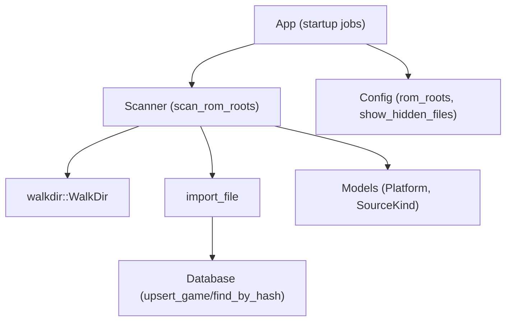
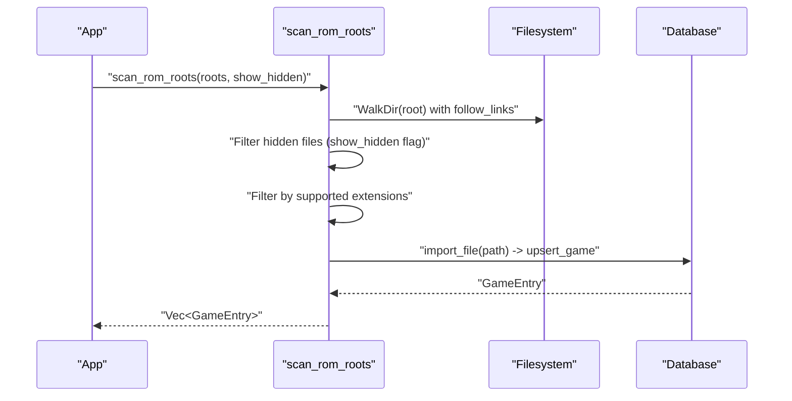
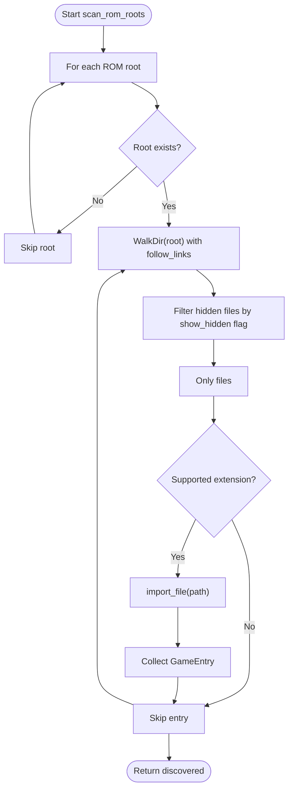
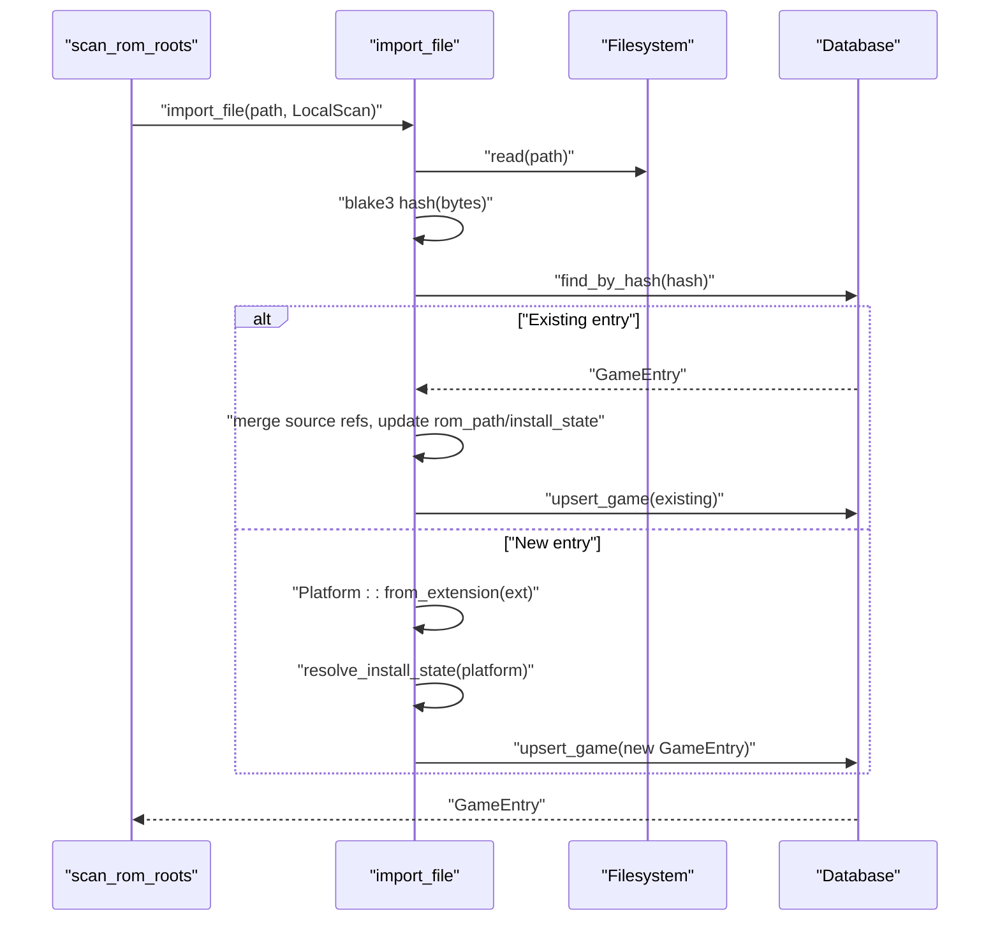
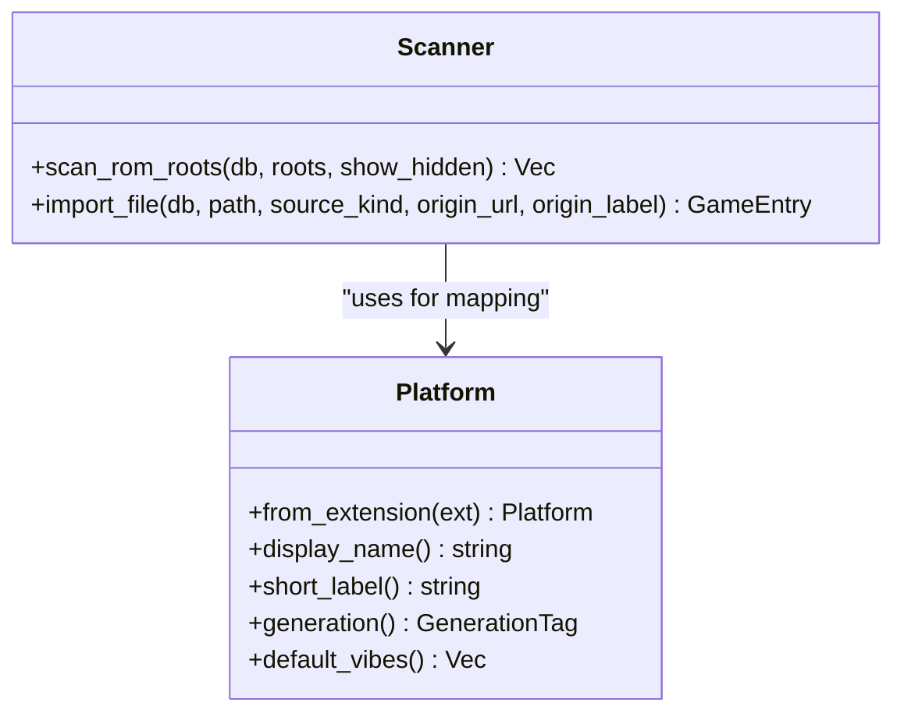
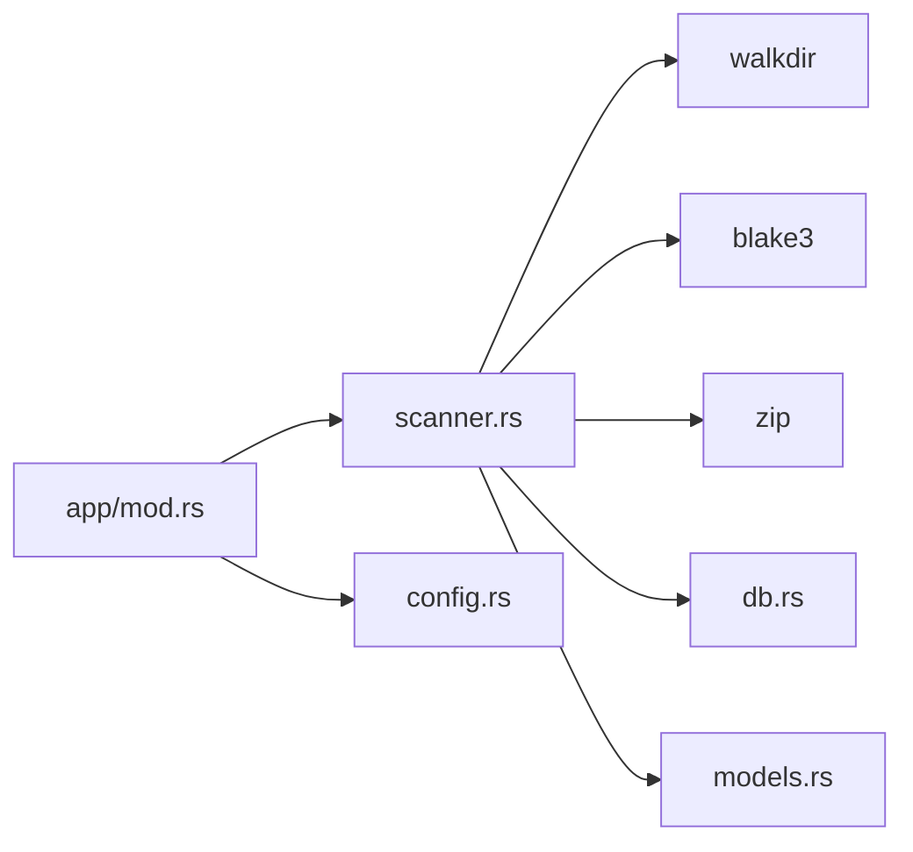

# File Discovery and Scanning

<cite>
**Referenced Files in This Document**
- [scanner.rs](file://src/scanner.rs)
- [models.rs](file://src/models.rs)
- [config.rs](file://src/config.rs)
- [db.rs](file://src/db.rs)
- [mod.rs](file://src/app/mod.rs)
- [Cargo.toml](file://Cargo.toml)
</cite>

## Table of Contents
1. [Introduction](#introduction)
2. [Project Structure](#project-structure)
3. [Core Components](#core-components)
4. [Architecture Overview](#architecture-overview)
5. [Detailed Component Analysis](#detailed-component-analysis)
6. [Dependency Analysis](#dependency-analysis)
7. [Performance Considerations](#performance-considerations)
8. [Troubleshooting Guide](#troubleshooting-guide)
9. [Conclusion](#conclusion)

## Introduction
This document explains the file discovery and scanning subsystem responsible for recursively traversing ROM roots, filtering hidden files, detecting supported ROM formats, and importing discovered files into the library. It covers the scan_roots function, directory traversal strategies, file filtering mechanisms, configuration options, platform detection, and practical guidance for performance and reliability.

## Project Structure
The scanning subsystem is centered around a dedicated module that integrates with configuration, models, and the database layer. The application orchestrates scanning during startup and delegates the heavy lifting to the scanner module.

**Diagram sources**
- [mod.rs:386-400](file://src/app/mod.rs#L386-L400)
- [scanner.rs:158-191](file://src/scanner.rs#L158-L191)
- [config.rs:26-32](file://src/config.rs#L26-L32)
- [models.rs:8-23](file://src/models.rs#L8-L23)
- [db.rs:625-689](file://src/db.rs#L625-L689)

**Section sources**
- [mod.rs:386-400](file://src/app/mod.rs#L386-L400)
- [scanner.rs:158-191](file://src/scanner.rs#L158-L191)
- [config.rs:26-32](file://src/config.rs#L26-L32)
- [models.rs:8-23](file://src/models.rs#L8-L23)
- [db.rs:625-689](file://src/db.rs#L625-L689)

## Core Components
- scan_rom_roots: Orchestrates scanning across multiple ROM roots, applies hidden-file filtering, and filters by supported extensions.
- import_file: Reads file bytes, computes a content hash, resolves platform from extension, and upserts a GameEntry into the database.
- Platform mapping: Converts file extensions to platform categories used for install-state resolution and emulator assignment.
- Configuration: Provides ROM roots and visibility preferences for hidden files.

Key responsibilities:
- Recursive directory traversal using walkdir.
- Hidden file filtering controlled by configuration.
- Supported ROM format detection via extension whitelist.
- Deduplication by content hash and merging of source references.
- Platform detection and install-state determination.

**Section sources**
- [scanner.rs:158-191](file://src/scanner.rs#L158-L191)
- [scanner.rs:193-265](file://src/scanner.rs#L193-L265)
- [models.rs:62-76](file://src/models.rs#L62-L76)
- [config.rs:26-32](file://src/config.rs#L26-L32)

## Architecture Overview
The scanning pipeline starts from the application’s startup routine, which reads configuration and spawns a worker thread to execute scan_rom_roots. The scanner traverses each root, filters entries, validates extensions, and imports files into the database.

**Diagram sources**
- [mod.rs:386-400](file://src/app/mod.rs#L386-L400)
- [scanner.rs:158-191](file://src/scanner.rs#L158-L191)
- [scanner.rs:193-265](file://src/scanner.rs#L193-L265)
- [db.rs:625-689](file://src/db.rs#L625-L689)

## Detailed Component Analysis

### scan_rom_roots: Multi-root Directory Traversal and Filtering
- Iterates over each configured ROM root.
- Skips non-existent roots.
- Uses walkdir to traverse recursively, following symbolic links.
- Filters entries by:
  - Hidden file visibility controlled by show_hidden flag.
  - File type (only files).
  - Supported ROM extensions whitelist.
- Imports each matching file via import_file and collects results.

**Diagram sources**
- [scanner.rs:158-191](file://src/scanner.rs#L158-L191)

**Section sources**
- [scanner.rs:158-191](file://src/scanner.rs#L158-L191)

### import_file: Content Hashing, Platform Detection, and Database Upsert
- Reads file bytes and computes a content hash.
- Checks database for existing entry by hash; if present, merges source references and updates metadata.
- If new, determines platform from file extension, sets install-state based on default emulator availability, and upserts a new GameEntry.

**Diagram sources**
- [scanner.rs:193-265](file://src/scanner.rs#L193-L265)
- [db.rs:625-689](file://src/db.rs#L625-L689)
- [models.rs:62-76](file://src/models.rs#L62-L76)

**Section sources**
- [scanner.rs:193-265](file://src/scanner.rs#L193-L265)
- [db.rs:625-689](file://src/db.rs#L625-L689)
- [models.rs:62-76](file://src/models.rs#L62-L76)

### Supported ROM Formats and Platform Mapping
- Supported extensions are defined as a constant list and used to filter discovered files.
- Platform mapping converts lowercased extensions to a Platform variant, enabling install-state resolution and default emulator assignment.

**Diagram sources**
- [models.rs:62-76](file://src/models.rs#L62-L76)
- [scanner.rs:158-191](file://src/scanner.rs#L158-L191)
- [scanner.rs:193-265](file://src/scanner.rs#L193-L265)

**Section sources**
- [scanner.rs:15-18](file://src/scanner.rs#L15-L18)
- [models.rs:62-76](file://src/models.rs#L62-L76)

### Configuration Options for Scanning
- rom_roots: List of directories to scan for ROMs.
- show_hidden_files: Controls whether hidden files are included in scans.
- scan_on_startup: Whether to trigger scanning automatically on startup.

These options are loaded from the user’s configuration directory and influence the scanning behavior at runtime.

**Section sources**
- [config.rs:26-32](file://src/config.rs#L26-L32)
- [config.rs:66-104](file://src/config.rs#L66-L104)
- [mod.rs:386-400](file://src/app/mod.rs#L386-L400)

## Dependency Analysis
The scanner depends on:
- walkdir for recursive directory traversal.
- blake3 for fast content hashing.
- zip for resolving downloaded archives.
- Database for persistence and deduplication.
- Models for platform mapping and install-state resolution.

**Diagram sources**
- [Cargo.toml:6-24](file://Cargo.toml#L6-L24)
- [scanner.rs:1-13](file://src/scanner.rs#L1-L13)
- [db.rs:1-16](file://src/db.rs#L1-L16)
- [models.rs:1-16](file://src/models.rs#L1-L16)
- [mod.rs:386-400](file://src/app/mod.rs#L386-L400)
- [config.rs:1-16](file://src/config.rs#L1-L16)

**Section sources**
- [Cargo.toml:6-24](file://Cargo.toml#L6-L24)
- [scanner.rs:1-13](file://src/scanner.rs#L1-L13)
- [db.rs:1-16](file://src/db.rs#L1-L16)
- [models.rs:1-16](file://src/models.rs#L1-L16)
- [mod.rs:386-400](file://src/app/mod.rs#L386-L400)
- [config.rs:1-16](file://src/config.rs#L1-L16)

## Performance Considerations
- Traversal breadth: walkdir follows symbolic links by default. On systems with deep symlink graphs, consider disabling link following if necessary to reduce traversal overhead.
- Hidden file filtering: Enabling show_hidden reduces filtering cost; disabling it avoids extra checks.
- Extension filtering: The constant whitelist avoids expensive MIME detection and focuses on known ROM formats.
- Deduplication cost: Hashing and database lookups are O(1) average-case with indexing; ensure the database remains healthy to keep lookups fast.
- Large directory handling: For very large libraries, consider:
  - Scanning only recently modified files by augmenting the scanner to accept a cutoff timestamp.
  - Parallelizing across roots with bounded concurrency to balance IO and CPU.
  - Precomputing hashes for known-good files and skipping re-reads.
  - Using filesystem-level hints (e.g., inode change times) to avoid rescanning unchanged subtrees.

[No sources needed since this section provides general guidance]

## Troubleshooting Guide
Common issues and mitigations:
- Permission errors:
  - Symptom: WalkDir iteration skips inaccessible directories or files.
  - Mitigation: Ensure the user account has read permissions on ROM roots. Run with elevated privileges only if necessary and limit scope.
- Corrupted directories:
  - Symptom: Scanning stalls or panics on unreadable entries.
  - Mitigation: The scanner filters out non-files and continues; if a root is corrupted, move or fix it. Consider adding pre-flight checks for root existence and readability.
- Performance bottlenecks:
  - Symptom: Scans take long on large libraries.
  - Mitigation: Reduce the number of roots, disable hidden file inclusion, or split roots into smaller subtrees. Monitor database health and rebuild indices if needed.
- Symbolic links:
  - Behavior: The scanner follows links by default. If this causes loops or excessive traversal, adjust filesystem structure or disable link following in future enhancements.
- Duplicate entries:
  - Behavior: Existing entries by hash are merged with new source references. Verify that the database is intact to prevent orphaned rows.

**Section sources**
- [scanner.rs:168-172](file://src/scanner.rs#L168-L172)
- [scanner.rs:164-167](file://src/scanner.rs#L164-L167)
- [db.rs:625-689](file://src/db.rs#L625-L689)

## Conclusion
The file discovery and scanning subsystem provides a robust, configurable mechanism to ingest ROMs from multiple roots, filter by visibility and format, detect platforms, and persist results efficiently. By leveraging walkdir, content hashing, and a compact extension whitelist, it balances simplicity and performance. Configuration options allow tailoring behavior to user environments, while the database ensures deduplication and metadata consistency.