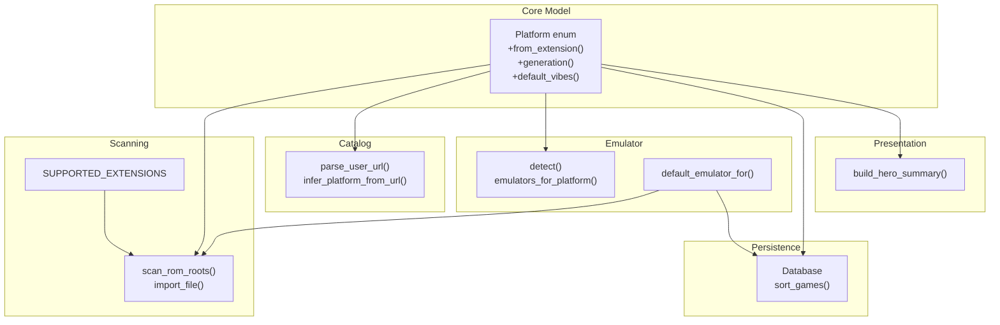
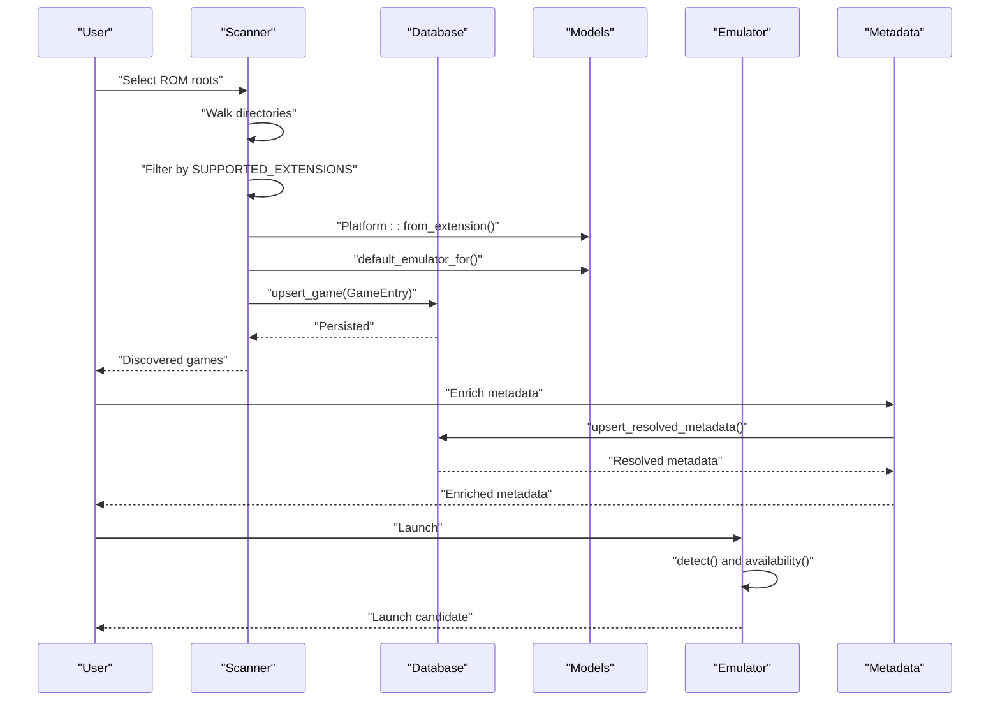
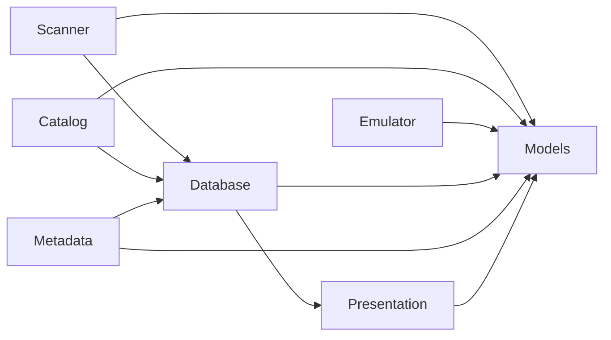

# Platform Recognition and Filtering

<cite>
**Referenced Files in This Document**
- [lib.rs](file://src/lib.rs)
- [scanner.rs](file://src/scanner.rs)
- [emulator.rs](file://src/emulator.rs)
- [config.rs](file://src/config.rs)
- [catalog.rs](file://src/catalog.rs)
- [db.rs](file://src/db.rs)
- [metadata.rs](file://src/metadata.rs)
- [presentation.rs](file://src/presentation.rs)
- [main.rs](file://src/main.rs)
- [Cargo.toml](file://Cargo.toml)
</cite>

## Table of Contents
1. [Introduction](#introduction)
2. [Project Structure](#project-structure)
3. [Core Components](#core-components)
4. [Architecture Overview](#architecture-overview)
5. [Detailed Component Analysis](#detailed-component-analysis)
6. [Dependency Analysis](#dependency-analysis)
7. [Performance Considerations](#performance-considerations)
8. [Troubleshooting Guide](#troubleshooting-guide)
9. [Conclusion](#conclusion)

## Introduction
This document explains how the platform recognition and file filtering system works across the codebase. It covers:
- Supported file extensions mapping to game platforms
- Platform detection from file extensions
- Generation classification and vibe tag assignment
- Platform-specific filtering logic during scanning and catalog ingestion
- Relationship between platform recognition and emulator availability
- Sorting and presentation of games by generation and install state
- Configuration options for supported formats and platform-specific behaviors
- Edge cases such as case-insensitive matching, renamed files, and multi-format archives

## Project Structure
The platform recognition pipeline spans several modules:
- Platform model and mapping: defined in the models module
- File scanning and filtering: implemented in the scanner module
- Emulator detection and mapping: implemented in the emulator module
- Catalog ingestion and URL-based platform inference: implemented in the catalog module
- Metadata enrichment and presentation: implemented in metadata and presentation modules
- Persistence and sorting: implemented in the db module
- CLI entry point: implemented in main.rs

**Diagram sources**
- [lib.rs:8-106](file://src/lib.rs#L8-106)
- [scanner.rs:15-191](file://src/scanner.rs#L15-L191)
- [catalog.rs:96-428](file://src/catalog.rs#L96-L428)
- [emulator.rs:45-108](file://src/emulator.rs#L45-L108)
- [db.rs:371-385](file://src/db.rs#L371-L385)
- [presentation.rs:172-268](file://src/presentation.rs#L172-L268)

**Section sources**
- [lib.rs:8-106](file://src/lib.rs#L8-106)
- [scanner.rs:15-191](file://src/scanner.rs#L15-L191)
- [catalog.rs:96-428](file://src/catalog.rs#L96-L428)
- [emulator.rs:45-108](file://src/emulator.rs#L45-L108)
- [db.rs:371-385](file://src/db.rs#L371-L385)
- [presentation.rs:172-268](file://src/presentation.rs#L172-L268)

## Core Components
- Platform enum and mapping: Defines supported platforms and maps file extensions to platforms. Also provides generation classification and default vibe tags.
- Scanner: Filters files by supported extensions and assigns platform and install state.
- Catalog: Infers platform from URLs and filenames, including handling of multi-format archives.
- Emulator: Detects available emulators and maps platforms to emulators.
- Database: Persists games, sorts by install state, and maintains metadata.
- Presentation: Renders platform, generation, and vibe tags for display.

Key constants and functions:
- SUPPORTED_EXTENSIONS: List of supported file extensions used during local scanning.
- Platform::from_extension(): Case-insensitive mapping from extension to platform.
- Platform::generation(): Assigns generation tag based on platform.
- Platform::default_vibes(): Provides default vibe tags per platform.
- default_emulator_for(): Maps platform to a default emulator.
- emulators_for_platform(): Lists available emulators for a given platform.
- scan_rom_roots(): Scans directories and filters by SUPPORTED_EXTENSIONS.
- import_file(): Imports a file, computes hash, and creates a GameEntry.
- infer_platform_from_url(): Infers platform from URL path and filename.

**Section sources**
- [lib.rs:8-106](file://src/lib.rs#L8-106)
- [scanner.rs:15-191](file://src/scanner.rs#L15-L191)
- [catalog.rs:96-428](file://src/catalog.rs#L96-L428)
- [emulator.rs:45-108](file://src/emulator.rs#L45-L108)
- [db.rs:371-385](file://src/db.rs#L371-L385)

## Architecture Overview
The platform recognition and filtering system integrates scanning, catalog ingestion, and metadata enrichment:

**Diagram sources**
- [scanner.rs:158-265](file://src/scanner.rs#L158-L265)
- [lib.rs:353-369](file://src/lib.rs#L353-L369)
- [db.rs:625-689](file://src/db.rs#L625-L689)
- [metadata.rs:279-321](file://src/metadata.rs#L279-L321)
- [emulator.rs:27-108](file://src/emulator.rs#L27-L108)

## Detailed Component Analysis

### Platform Mapping and Classification
- Supported platforms and mapping:
  - Extensions mapped to platforms include Game Boy family, PlayStation family, Nintendo DS, NES, SNES, N64, Sega Genesis, and PS2 ISO variants.
  - Unknown extensions map to Unknown platform.
- Generation classification:
  - Gen X: NES, Genesis, SNES
  - Millennials: Game Boy, Game Boy Color, Game Boy Advance, PS1, PS2, N64
  - Gen Z: Nintendo DS, Wii, Xbox 360
- Vibe tags:
  - Default vibe tags are assigned per platform (e.g., tactile for handhelds, social/co-op for console-heavy platforms).
- Case-insensitive extension matching:
  - Platform::from_extension() converts extension to lowercase before matching.

Examples of platform detection:
- GBA files map to Game Boy Advance
- CUE/BIN/ISO/CHD/M3U map to PlayStation 1
- NDS maps to Nintendo DS
- SM64/Z64/V64/N64 map to Nintendo 64
- ISO.PS2 maps to PlayStation 2

Edge cases:
- Unknown extensions map to Unknown; install state becomes Unsupported.
- Generation and vibe tags still apply to Unknown (Unknown defaults to Millennials).

**Section sources**
- [lib.rs:62-106](file://src/lib.rs#L62-L106)

### File Extension Filtering and Scanning
- SUPPORTED_EXTENSIONS constant defines the whitelist of supported extensions used during local scanning.
- scan_rom_roots():
  - Walks directories recursively, filters hidden files if disabled, and checks each file’s extension against SUPPORTED_EXTENSIONS.
  - Calls import_file() for each supported file.
- import_file():
  - Reads file bytes, computes Blake3 hash, and checks database for existing entry by hash.
  - If not found, constructs GameEntry with:
    - Platform derived from extension via Platform::from_extension()
    - Generation from platform.generation()
    - Vibe tags from platform.default_vibes()
    - Install state determined by default_emulator_for(platform)
    - Emulator kind from default_emulator_for(platform)
  - Upserts into database.

Case-insensitive matching:
- Extension comparison is performed after converting to lowercase.

Multi-format archives:
- ZIP extraction logic is handled separately for .nes files; however, SUPPORTED_EXTENSIONS is used to filter initial set of files scanned.

**Section sources**
- [scanner.rs:15-191](file://src/scanner.rs#L15-L191)
- [scanner.rs:193-265](file://src/scanner.rs#L193-L265)
- [lib.rs:353-369](file://src/lib.rs#L353-L369)

### URL-Based Platform Inference and Catalog Handling
- parse_user_url():
  - Parses user-provided URL with optional platform hint (e.g., gb, gbc, gba, nes, ps1, cue, chd).
  - If no hint, infers platform from URL path and filename.
- infer_platform_from_url():
  - First attempts to infer from filename extension using Platform::from_extension().
  - Falls back to URL path parsing for known platform routes (e.g., /consoles/dendy/, /consoles/super_nintendo/, etc.).
- Multi-format archives:
  - When downloading from emu-land, the system resolves the final URL and selects a specific file variant if present.
  - The filename resolution logic ensures correct extraction and naming.

Edge cases:
- Ambiguous hints or missing hints are handled gracefully; unknown results map to Unknown platform.
- If multiple .nes files are present in a ZIP, the system requires a catalog filename to disambiguate.

**Section sources**
- [catalog.rs:96-140](file://src/catalog.rs#L96-L140)
- [catalog.rs:394-428](file://src/catalog.rs#L394-L428)
- [catalog.rs:142-275](file://src/catalog.rs#L142-L275)

### Emulator Availability and Platform Mapping
- default_emulator_for():
  - Maps platform to a default emulator:
    - Game Boy family → mGBA
    - PlayStation 1 → Mednafen
    - NES → FCEUX or RetroArch
    - SNES, Genesis, N64, Nintendo DS, PlayStation 2, Wii, Xbox 360 → RetroArch
    - Unknown → None
- emulators_for_platform():
  - Lists available emulators for a given platform (used for candidate selection).
- detect():
  - Checks PATH and common locations for emulator executables.
- availability():
  - Determines whether an emulator is Installed, Downloadable, or Unavailable.
  - Special handling for macOS Apple Silicon and RetroArch.

Integration:
- During import and scanning, default_emulator_for(platform) sets install_state to Ready or Unsupported.
- Presentation and launch logic rely on emulator availability.

**Section sources**
- [lib.rs:353-369](file://src/lib.rs#L353-L369)
- [emulator.rs:45-108](file://src/emulator.rs#L45-L108)
- [emulator.rs:102-151](file://src/emulator.rs#L102-L151)

### Generation-Based Sorting and Presentation
- Generation classification:
  - Platform::generation() assigns Gen X, Millennials, or Gen Z.
- Sorting:
  - sort_games() orders by install_state.sort_bucket() first, then alphabetically by title.
  - Install state buckets:
    - Ready, MissingEmulator
    - Unsupported, Error
    - DownloadAvailable, Downloading, DownloadedNeedsImport
- Presentation:
  - build_hero_summary() displays platform, generation, and vibe tags.
  - Vibe tags can come from metadata genres if available, otherwise default platform vibes.

**Section sources**
- [lib.rs:78-90](file://src/lib.rs#L78-L90)
- [lib.rs:371-385](file://src/lib.rs#L371-L385)
- [db.rs:371-385](file://src/db.rs#L371-L385)
- [presentation.rs:172-268](file://src/presentation.rs#L172-L268)

### Configuration Options and Platform-Specific Behaviors
- Config:
  - Preferred emulators per platform are stored in preferred_emulators.
  - ROM roots and download directories are configurable.
- Behavior:
  - Preferred emulators influence user choices but do not override default_emulator_for() during import.
  - The system respects user preferences when multiple emulators are available for a platform.

**Section sources**
- [config.rs:19-113](file://src/config.rs#L19-L113)

## Dependency Analysis
The platform recognition system depends on:
- Models for platform enums, mapping, generation, and vibe tags
- Scanner for filtering and importing files
- Catalog for URL-based platform inference
- Emulator for availability and mapping
- Database for persistence and sorting
- Metadata for enrichment and presentation

**Diagram sources**
- [lib.rs:8-106](file://src/lib.rs#L8-106)
- [scanner.rs:15-191](file://src/scanner.rs#L15-L191)
- [catalog.rs:96-428](file://src/catalog.rs#L96-L428)
- [emulator.rs:45-108](file://src/emulator.rs#L45-L108)
- [db.rs:371-385](file://src/db.rs#L371-L385)
- [metadata.rs:279-321](file://src/metadata.rs#L279-L321)
- [presentation.rs:172-268](file://src/presentation.rs#L172-L268)

**Section sources**
- [lib.rs:8-106](file://src/lib.rs#L8-106)
- [scanner.rs:15-191](file://src/scanner.rs#L15-L191)
- [catalog.rs:96-428](file://src/catalog.rs#L96-L428)
- [emulator.rs:45-108](file://src/emulator.rs#L45-L108)
- [db.rs:371-385](file://src/db.rs#L371-L385)
- [metadata.rs:279-321](file://src/metadata.rs#L279-L321)
- [presentation.rs:172-268](file://src/presentation.rs#L172-L268)

## Performance Considerations
- Scanning:
  - Using SUPPORTED_EXTENSIONS reduces filesystem traversal overhead by filtering early.
  - Case-insensitive comparisons are O(1) per extension after conversion.
- Import:
  - Hash computation is linear in file size; consider streaming for very large archives.
- Metadata enrichment:
  - Provider chain and caching reduce repeated network calls.
- Sorting:
  - sort_games() uses a stable ordering by install state bucket and title.

[No sources needed since this section provides general guidance]

## Troubleshooting Guide
Common issues and resolutions:
- Unrecognized file extensions:
  - Files with unsupported extensions are ignored during scanning. Add to SUPPORTED_EXTENSIONS if needed.
- Ambiguous file types in archives:
  - When multiple .nes files are present in a ZIP, provide a catalog filename to disambiguate.
- Renamed files:
  - Platform detection relies on extension; rename files to correct extensions or use catalog entries with explicit platform hints.
- Multi-format archives:
  - Ensure the archive contains the expected ROM format; extraction logic targets specific extensions.
- Emulator availability:
  - If install_state is Unsupported, configure default_emulator_for() or install the required emulator.
- Hidden files:
  - Adjust show_hidden flag to include/exclude hidden files during scanning.

**Section sources**
- [scanner.rs:15-191](file://src/scanner.rs#L15-L191)
- [scanner.rs:119-141](file://src/scanner.rs#L119-L141)
- [lib.rs:353-369](file://src/lib.rs#L353-L369)
- [emulator.rs:83-108](file://src/emulator.rs#L83-L108)

## Conclusion
The platform recognition and filtering system combines:
- A robust extension-to-platform mapping with case-insensitive matching
- Local scanning with a supported-extension whitelist
- URL-based inference for catalog sources
- Emulator availability mapping and install-state determination
- Generation and vibe-tag assignment for presentation and sorting
- Configuration-driven preferences for platform-specific behaviors

Together, these components provide a reliable foundation for discovering, organizing, and launching ROMs across multiple platforms.