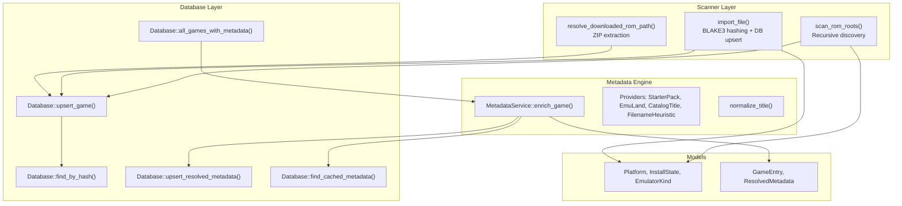
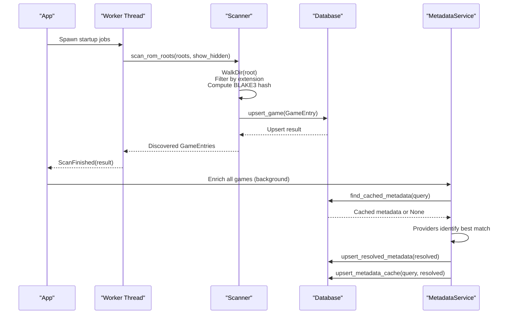
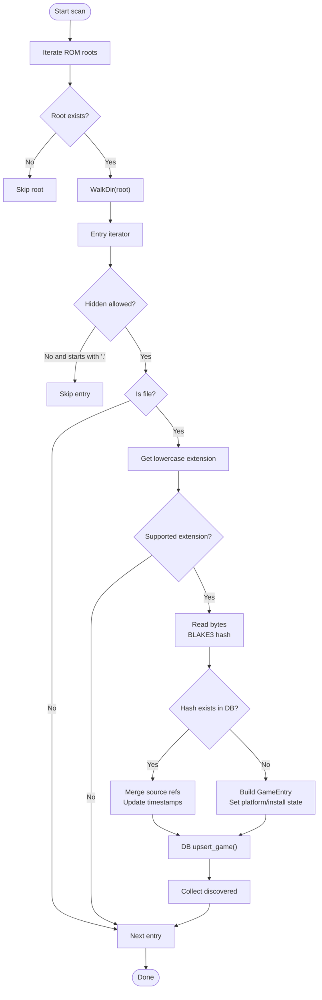
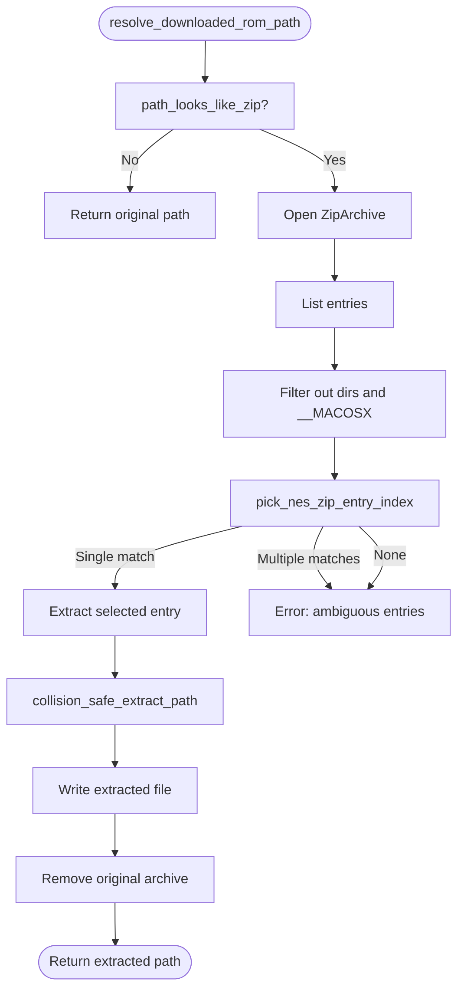
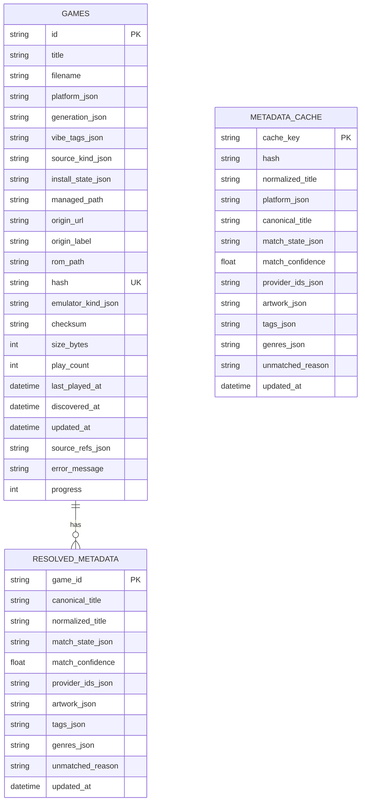
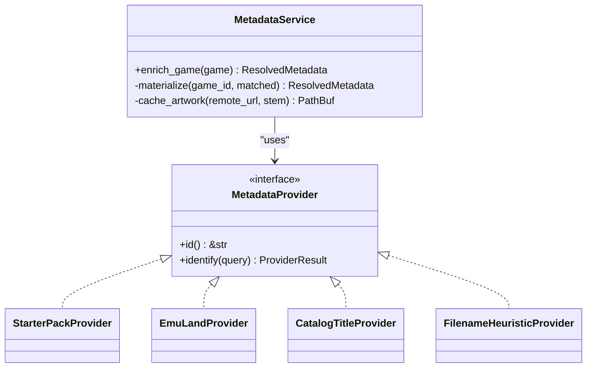
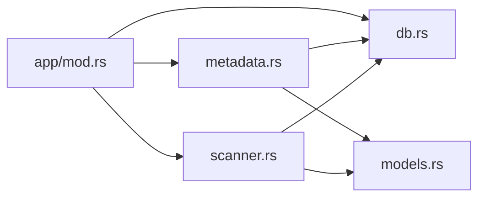

# ROM Management System

<cite>
**Referenced Files in This Document**
- [scanner.rs](file://src/scanner.rs)
- [db.rs](file://src/db.rs)
- [metadata.rs](file://src/metadata.rs)
- [models.rs](file://src/models.rs)
- [config.rs](file://src/config.rs)
- [app/mod.rs](file://src/app/mod.rs)
- [main.rs](file://src/main.rs)
</cite>

## Table of Contents
1. [Introduction](#introduction)
2. [Project Structure](#project-structure)
3. [Core Components](#core-components)
4. [Architecture Overview](#architecture-overview)
5. [Detailed Component Analysis](#detailed-component-analysis)
6. [Dependency Analysis](#dependency-analysis)
7. [Performance Considerations](#performance-considerations)
8. [Troubleshooting Guide](#troubleshooting-guide)
9. [Conclusion](#conclusion)
10. [Appendices](#appendices)

## Introduction
This document describes the ROM management subsystem responsible for discovering, importing, and organizing ROM assets into a persistent library. It covers the scanner architecture, recursive file discovery, ZIP archive extraction, duplicate detection via BLAKE3 hashing, platform-specific file filtering, and integration with the database layer and metadata resolution engine. It also provides configuration options, performance optimization techniques, and troubleshooting guidance for common issues such as corrupted files, unsupported formats, and performance bottlenecks.

## Project Structure
The ROM management system spans several modules:
- Scanner: discovers ROMs, filters by supported extensions, and imports them into the database.
- Database: persists GameEntry records, resolved metadata, and metadata cache.
- Metadata: resolves canonical titles, artwork, and tags from multiple providers.
- Models: shared types for platforms, install states, and game entries.
- Config: application configuration including ROM roots, hidden file visibility, and preferences.
- App orchestration: integrates scanning, metadata enrichment, and UI updates.

**Diagram sources**
- [scanner.rs:158-191](file://src/scanner.rs#L158-L191)
- [scanner.rs:193-265](file://src/scanner.rs#L193-L265)
- [scanner.rs:52-108](file://src/scanner.rs#L52-L108)
- [db.rs:625-689](file://src/db.rs#L625-L689)
- [db.rs:719-732](file://src/db.rs#L719-L732)
- [db.rs:329-421](file://src/db.rs#L329-L421)
- [db.rs:510-541](file://src/db.rs#L510-L541)
- [db.rs:587-623](file://src/db.rs#L587-L623)
- [metadata.rs:237-321](file://src/metadata.rs#L237-L321)
- [metadata.rs:428-459](file://src/metadata.rs#L428-L459)
- [models.rs:8-106](file://src/models.rs#L8-L106)
- [models.rs:256-280](file://src/models.rs#L256-L280)

**Section sources**
- [scanner.rs:158-191](file://src/scanner.rs#L158-L191)
- [db.rs:625-689](file://src/db.rs#L625-L689)
- [metadata.rs:237-321](file://src/metadata.rs#L237-L321)
- [models.rs:8-106](file://src/models.rs#L8-L106)

## Core Components
- Scanner: Recursively traverses configured ROM roots, filters by supported extensions, computes BLAKE3 hashes, and upserts GameEntry records into the database. It also handles ZIP extraction for downloaded archives.
- Database: Provides CRUD operations for GameEntry and resolved metadata, maintains indices for fast lookups, and exposes a single-pass join query to load games with metadata efficiently.
- Metadata Engine: Normalizes titles, merges provider results, caches metadata, and materializes artwork into local storage.
- Models: Defines platform mappings, install states, and core data structures used across the system.
- Config: Supplies ROM roots, hidden file visibility, and preferred emulators.

**Section sources**
- [scanner.rs:158-191](file://src/scanner.rs#L158-L191)
- [scanner.rs:193-265](file://src/scanner.rs#L193-L265)
- [db.rs:625-689](file://src/db.rs#L625-L689)
- [metadata.rs:237-321](file://src/metadata.rs#L237-L321)
- [models.rs:8-106](file://src/models.rs#L8-L106)
- [config.rs:26-32](file://src/config.rs#L26-L32)

## Architecture Overview
The ROM management subsystem orchestrates scanning, hashing, deduplication, and metadata enrichment. The scanner runs in a background worker thread during startup, emitting status updates and scan completion events. The database layer ensures idempotent upserts and efficient joins. The metadata service resolves canonical titles and artwork, caching results for reuse.

**Diagram sources**
- [app/mod.rs:386-400](file://src/app/mod.rs#L386-L400)
- [scanner.rs:158-191](file://src/scanner.rs#L158-L191)
- [scanner.rs:193-265](file://src/scanner.rs#L193-L265)
- [db.rs:625-689](file://src/db.rs#L625-L689)
- [db.rs:587-623](file://src/db.rs#L587-L623)
- [metadata.rs:279-321](file://src/metadata.rs#L279-L321)

## Detailed Component Analysis

### Scanner Architecture and Recursive Discovery
The scanner performs a breadth-first recursive traversal of configured ROM roots using a directory walker. It filters out non-files and applies a whitelist of supported extensions. For each discovered file, it computes a BLAKE3 hash and either updates an existing record’s source references or inserts a new GameEntry. Hidden files can be included or excluded based on configuration.

Key behaviors:
- Directory traversal: follows symbolic links and respects hidden-file filtering.
- Extension filtering: only supported extensions are processed.
- Duplicate detection: uses BLAKE3 hash to detect duplicates and merge source references.
- Import pipeline: constructs GameEntry fields, sets install state based on platform and emulator availability, and persists to the database.

**Diagram sources**
- [scanner.rs:158-191](file://src/scanner.rs#L158-L191)
- [scanner.rs:193-265](file://src/scanner.rs#L193-L265)
- [scanner.rs:275-280](file://src/scanner.rs#L275-L280)

**Section sources**
- [scanner.rs:158-191](file://src/scanner.rs#L158-L191)
- [scanner.rs:193-265](file://src/scanner.rs#L193-L265)
- [scanner.rs:275-280](file://src/scanner.rs#L275-L280)

### ZIP Archive Extraction Capabilities
When a downloaded file is detected as a ZIP archive, the system extracts a single ROM entry (e.g., .nes) into the download root and removes the original archive. It selects the entry based on the catalog filename when present, otherwise falls back to a single entry or fails with a descriptive error if multiple candidates exist.

Extraction logic:
- Detect ZIP by extension or by file signature.
- Enumerate entries, skipping directories and macOS-specific metadata.
- Select target entry by matching catalog filename or falling back to a single entry.
- Extract to a safe output path, avoiding collisions by renaming when necessary.
- Remove the original archive upon successful extraction.

**Diagram sources**
- [scanner.rs:36-49](file://src/scanner.rs#L36-L49)
- [scanner.rs:52-108](file://src/scanner.rs#L52-L108)
- [scanner.rs:110-117](file://src/scanner.rs#L110-L117)
- [scanner.rs:119-141](file://src/scanner.rs#L119-L141)
- [scanner.rs:143-156](file://src/scanner.rs#L143-L156)

**Section sources**
- [scanner.rs:36-49](file://src/scanner.rs#L36-L49)
- [scanner.rs:52-108](file://src/scanner.rs#L52-L108)
- [scanner.rs:110-117](file://src/scanner.rs#L110-L117)
- [scanner.rs:119-141](file://src/scanner.rs#L119-L141)
- [scanner.rs:143-156](file://src/scanner.rs#L143-L156)

### Duplicate Detection Using BLAKE3 Hashing
Duplicate detection relies on computing a BLAKE3 hash over the entire file content. On import, the scanner checks the database for an existing record with the same hash. If found, it merges source references and updates timestamps; otherwise, it creates a new GameEntry. This approach ensures robust identification of identical ROMs regardless of filename or location.

Implementation highlights:
- Hash computed from file bytes.
- Unique constraint on hash column in the database.
- Upsert semantics preserve existing metadata while adding new source references.

**Section sources**
- [scanner.rs:200-201](file://src/scanner.rs#L200-L201)
- [scanner.rs:203-219](file://src/scanner.rs#L203-L219)
- [db.rs:625-689](file://src/db.rs#L625-L689)
- [db.rs:719-732](file://src/db.rs#L719-L732)

### Platform-Specific File Filtering and Directory Traversal Strategies
The scanner filters files by supported extensions mapped to platforms. It traverses directories recursively, optionally including hidden files. Platform inference is derived from file extensions, enabling correct install-state assignment and emulator selection.

Key points:
- Supported extensions list defines accepted ROM formats.
- Hidden file filtering toggled by configuration.
- Platform mapping determines default emulators and install state.

**Section sources**
- [scanner.rs:15-18](file://src/scanner.rs#L15-L18)
- [scanner.rs:178-185](file://src/scanner.rs#L178-L185)
- [scanner.rs:225](file://src/scanner.rs#L225)
- [models.rs:62-76](file://src/models.rs#L62-L76)
- [models.rs:353-369](file://src/models.rs#L353-L369)

### Database Layer for Persistent Storage
The database layer provides:
- Schema initialization with tables for games, resolved metadata, and metadata cache.
- Indexes for efficient lookups by hash and title.
- Single-pass join query to load games with resolved metadata in one go.
- Upsert operations for idempotent persistence of GameEntry and resolved metadata.
- Repair and migration utilities to normalize URLs, reset broken downloads, and reconcile emulator assignments.

**Diagram sources**
- [db.rs:52-117](file://src/db.rs#L52-L117)
- [db.rs:329-421](file://src/db.rs#L329-L421)
- [db.rs:543-585](file://src/db.rs#L543-L585)

**Section sources**
- [db.rs:52-117](file://src/db.rs#L52-L117)
- [db.rs:329-421](file://src/db.rs#L329-L421)
- [db.rs:543-585](file://src/db.rs#L543-L585)
- [db.rs:625-689](file://src/db.rs#L625-L689)
- [db.rs:719-732](file://src/db.rs#L719-L732)

### Metadata Resolution Engine
The metadata engine normalizes titles, merges provider results, and caches outcomes. It supports:
- Starter pack provider for curated classics.
- EmuLand provider for online scraping.
- Catalog title provider for imported entries.
- Filename heuristic provider for fallback normalization.

It merges tags and genres across providers, selects artwork from compatible candidates, and writes resolved metadata to the database with cache keys for hash and normalized title.

**Diagram sources**
- [metadata.rs:237-321](file://src/metadata.rs#L237-L321)
- [metadata.rs:40-43](file://src/metadata.rs#L40-L43)
- [metadata.rs:55-112](file://src/metadata.rs#L55-L112)
- [metadata.rs:170-235](file://src/metadata.rs#L170-L235)
- [metadata.rs:147-168](file://src/metadata.rs#L147-L168)
- [metadata.rs:114-145](file://src/metadata.rs#L114-L145)

**Section sources**
- [metadata.rs:237-321](file://src/metadata.rs#L237-L321)
- [metadata.rs:40-43](file://src/metadata.rs#L40-L43)
- [metadata.rs:55-112](file://src/metadata.rs#L55-L112)
- [metadata.rs:170-235](file://src/metadata.rs#L170-L235)
- [metadata.rs:147-168](file://src/metadata.rs#L147-L168)
- [metadata.rs:114-145](file://src/metadata.rs#L114-L145)

### Integration with Application Orchestration
The application spawns the scanner on startup, listens for scan completion events, and triggers metadata enrichment. It also manages artwork caching and UI updates.

**Section sources**
- [app/mod.rs:386-400](file://src/app/mod.rs#L386-L400)
- [app/mod.rs:126-170](file://src/app/mod.rs#L126-L170)
- [app/mod.rs:329-347](file://src/app/mod.rs#L329-L347)

## Dependency Analysis
The scanner depends on the database for persistence and on models for platform mapping. The metadata service depends on the database for cache and resolved metadata, and on models for types. The application orchestrates scanning and metadata enrichment.

**Diagram sources**
- [scanner.rs:10-13](file://src/scanner.rs#L10-L13)
- [db.rs:9-16](file://src/db.rs#L9-L16)
- [metadata.rs:9-11](file://src/metadata.rs#L9-L11)
- [app/mod.rs:33-44](file://src/app/mod.rs#L33-L44)

**Section sources**
- [scanner.rs:10-13](file://src/scanner.rs#L10-L13)
- [db.rs:9-16](file://src/db.rs#L9-L16)
- [metadata.rs:9-11](file://src/metadata.rs#L9-L11)
- [app/mod.rs:33-44](file://src/app/mod.rs#L33-L44)

## Performance Considerations
- Hashing cost: BLAKE3 hashing is fast and suitable for large libraries; consider batching reads to reduce syscall overhead.
- Database writes: Upserts are idempotent and minimize duplicate writes; ensure indexes are present for hash and title lookups.
- Metadata caching: Single-pass join reduces N+1 queries; cache keys include hash and normalized title to accelerate lookups.
- Scanning: Limit recursion depth by restricting ROM roots to relevant directories; avoid scanning network mounts unnecessarily.
- ZIP extraction: Stream extraction avoids loading entire archives into memory; handle collisions gracefully to prevent overwrites.
- UI responsiveness: Run scanning and metadata enrichment in background threads; update UI incrementally.

[No sources needed since this section provides general guidance]

## Troubleshooting Guide
Common issues and resolutions:
- Corrupted or invalid payloads: The download pipeline validates payloads and rejects HTML/text responses. If a download appears to succeed but is invalid, verify the URL and content type.
- Unsupported formats: Only supported extensions are imported; verify the file extension and platform mapping.
- Duplicate ROMs: BLAKE3 hashing prevents duplicates; if a ROM is reported as duplicate, confirm the hash matches an existing entry.
- ZIP extraction errors: Ensure the archive contains a single ROM entry or provide a catalog filename to disambiguate. Avoid extracting archives with malicious paths.
- Performance bottlenecks: Reduce the number of ROM roots, exclude hidden files, and limit concurrent background tasks.

**Section sources**
- [app/mod.rs:669-686](file://src/app/mod.rs#L669-L686)
- [scanner.rs:119-141](file://src/scanner.rs#L119-L141)
- [scanner.rs:143-156](file://src/scanner.rs#L143-L156)

## Conclusion
The ROM management subsystem combines a robust scanner with efficient hashing and deduplication, a relational database with optimized queries, and a flexible metadata resolution engine. Together, these components provide a scalable foundation for managing large ROM libraries, resolving metadata, and maintaining a responsive user experience.

[No sources needed since this section summarizes without analyzing specific files]

## Appendices

### Configuration Options
- ROM roots: Directories scanned for ROMs.
- Managed download directory: Location for downloaded and extracted ROMs.
- Scan on startup: Whether to automatically scan ROM roots at application start.
- Show hidden files: Toggle inclusion of hidden files during scanning.
- Preferred emulators: Platform-specific emulator preferences.

**Section sources**
- [config.rs:26-32](file://src/config.rs#L26-L32)
- [config.rs:66-104](file://src/config.rs#L66-L104)

### Example Scanner Configuration
- Configure ROM roots and hidden file visibility in the application configuration.
- Trigger a manual scan via the application UI or by invoking the scanner from the CLI entry point.

**Section sources**
- [config.rs:26-32](file://src/config.rs#L26-L32)
- [main.rs:3-8](file://src/main.rs#L3-L8)