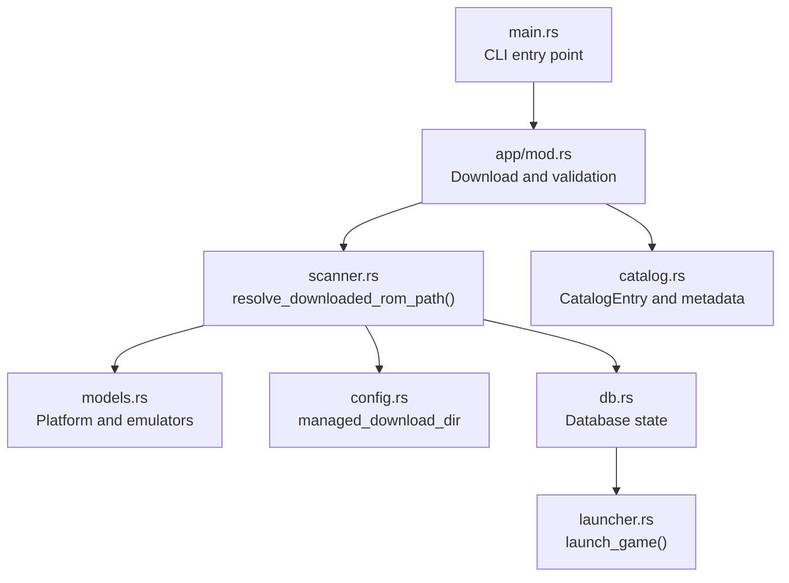
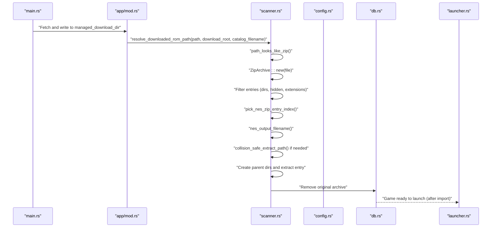
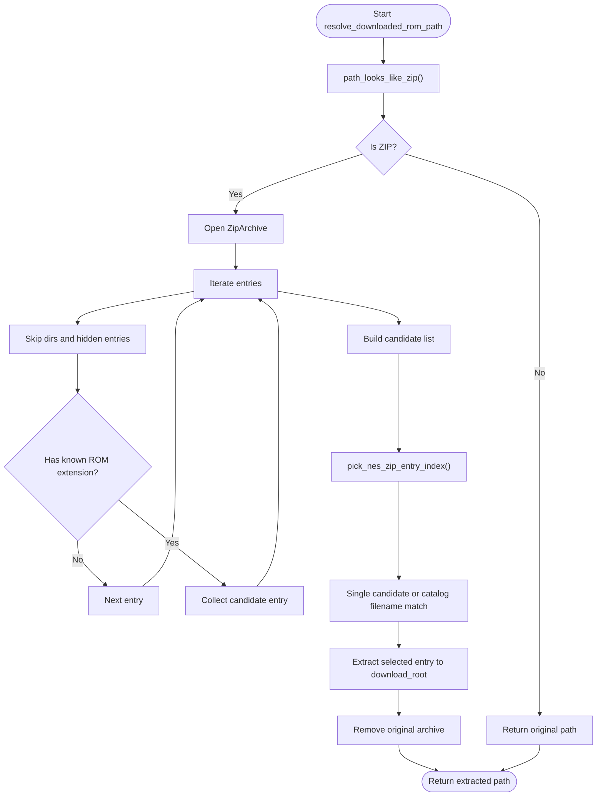
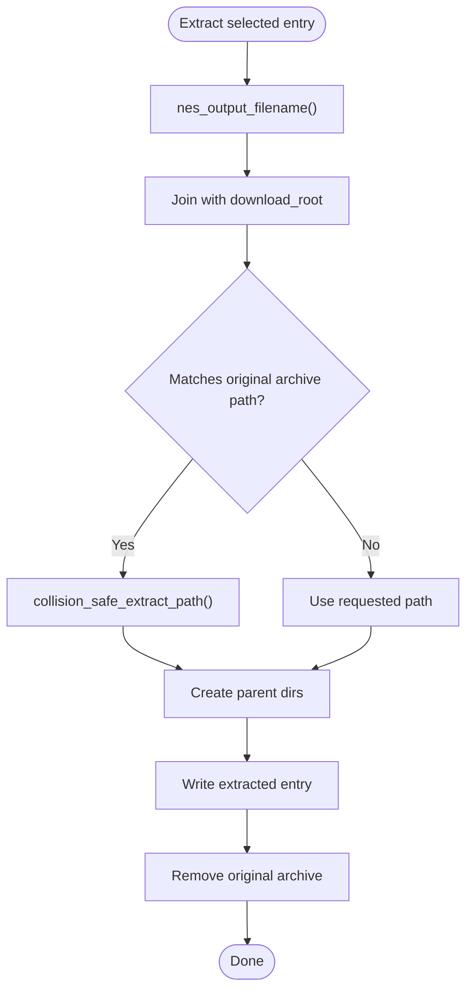
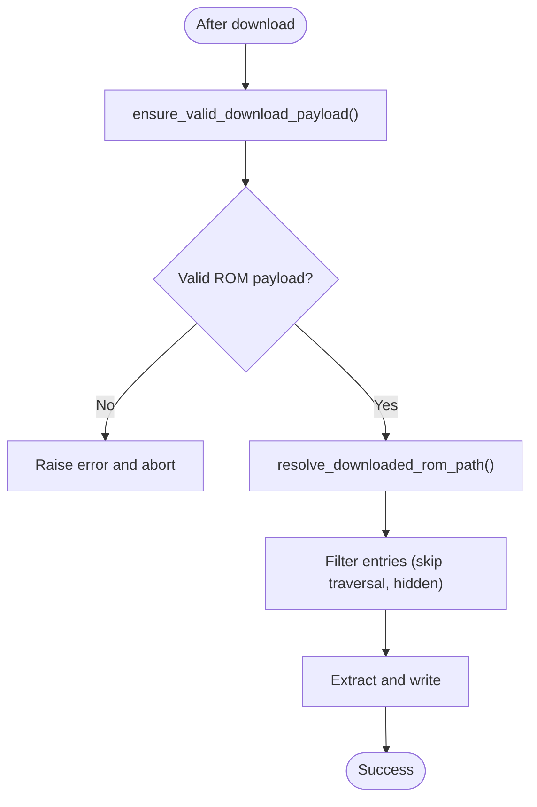
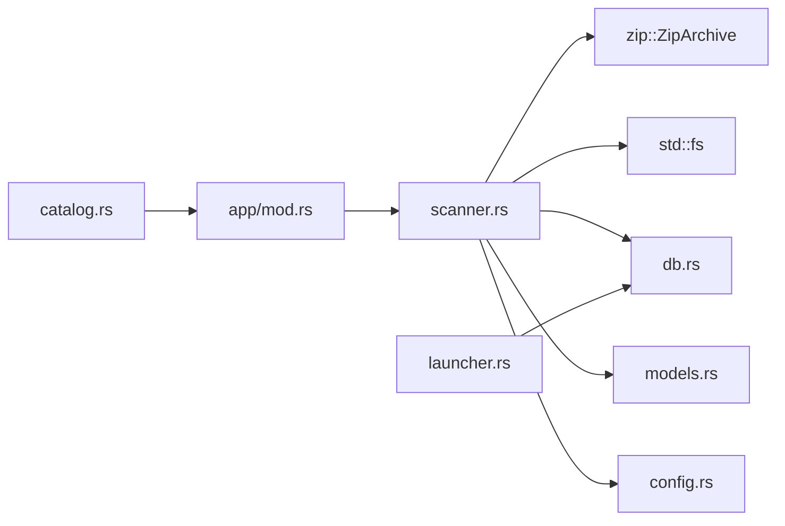

# ZIP Archive Extraction

<cite>
**Referenced Files in This Document**
- [scanner.rs](file://src/scanner.rs)
- [app/mod.rs](file://src/app/mod.rs)
- [models.rs](file://src/models.rs)
- [config.rs](file://src/config.rs)
- [db.rs](file://src/db.rs)
- [launcher.rs](file://src/launcher.rs)
- [catalog.rs](file://src/catalog.rs)
- [main.rs](file://src/main.rs)
</cite>

## Table of Contents
1. [Introduction](#introduction)
2. [Project Structure](#project-structure)
3. [Core Components](#core-components)
4. [Architecture Overview](#architecture-overview)
5. [Detailed Component Analysis](#detailed-component-analysis)
6. [Dependency Analysis](#dependency-analysis)
7. [Performance Considerations](#performance-considerations)
8. [Troubleshooting Guide](#troubleshooting-guide)
9. [Conclusion](#conclusion)

## Introduction
This document explains how the application detects, validates, and safely extracts ROM bundles contained inside ZIP archives. It focuses on the resolve_downloaded_rom_path function, ZIP archive detection via file signature, safe extraction mechanisms, archive parsing, file filtering, collision-safe extraction, and security safeguards against path traversal and malformed archives. It also covers configuration options related to archive handling and extraction safety, and outlines practical examples for nested archives and specific ROM types.

## Project Structure
The ROM bundle extraction pipeline spans several modules:
- scanner.rs: ZIP detection, archive parsing, entry filtering, selection logic, and extraction
- app/mod.rs: Payload validation to reject HTML/text responses masquerading as ROMs
- models.rs: Platform and emulator mappings used to determine install readiness
- config.rs: Managed download directory and preferences
- db.rs: Database-backed game lifecycle and metadata
- launcher.rs: Emulator launching after successful extraction
- catalog.rs: Catalog entry creation and metadata resolution for downloads
- main.rs: Application entry point

**Diagram sources**
- [main.rs:1-9](file://src/main.rs#L1-L9)
- [app/mod.rs:669-720](file://src/app/mod.rs#L669-L720)
- [scanner.rs:51-156](file://src/scanner.rs#L51-L156)
- [models.rs:353-369](file://src/models.rs#L353-L369)
- [config.rs:26-32](file://src/config.rs#L26-L32)
- [db.rs:625-689](file://src/db.rs#L625-L689)
- [launcher.rs:9-27](file://src/launcher.rs#L9-L27)
- [catalog.rs:75-94](file://src/catalog.rs#L75-L94)

**Section sources**
- [main.rs:1-9](file://src/main.rs#L1-L9)
- [app/mod.rs:669-720](file://src/app/mod.rs#L669-L720)
- [scanner.rs:51-156](file://src/scanner.rs#L51-L156)
- [models.rs:353-369](file://src/models.rs#L353-L369)
- [config.rs:26-32](file://src/config.rs#L26-L32)
- [db.rs:625-689](file://src/db.rs#L625-L689)
- [launcher.rs:9-27](file://src/launcher.rs#L9-L27)
- [catalog.rs:75-94](file://src/catalog.rs#L75-L94)

## Core Components
- ZIP detection: path_looks_like_zip checks extension or reads initial bytes to confirm a ZIP signature
- Archive parsing: ZipArchive iteration filters out directories and hidden entries, collects matching ROM entries
- Entry selection: pick_nes_zip_entry_index chooses a single entry based on catalog filename or resolves ambiguity
- Safe extraction: nes_output_filename determines the output filename; collision_safe_extract_path avoids overwriting the original archive
- Post-extraction cleanup: the original archive is removed after successful extraction

Key behaviors:
- Hidden macOS metadata and parent-directory traversal attempts are ignored
- Only entries with recognized extensions are considered
- If multiple matching entries exist, a catalog filename must be provided to disambiguate
- Extraction creates parent directories as needed and writes to the managed download directory

**Section sources**
- [scanner.rs:36-48](file://src/scanner.rs#L36-L48)
- [scanner.rs:65-82](file://src/scanner.rs#L65-L82)
- [scanner.rs:119-141](file://src/scanner.rs#L119-L141)
- [scanner.rs:143-156](file://src/scanner.rs#L143-L156)
- [scanner.rs:110-117](file://src/scanner.rs#L110-L117)

## Architecture Overview
The extraction flow integrates with the download pipeline and database state machine. After a download completes, the system validates the payload, detects ZIP archives, selects and extracts the appropriate ROM entry, and updates the database accordingly.

**Diagram sources**
- [main.rs:3-8](file://src/main.rs#L3-L8)
- [app/mod.rs:669-720](file://src/app/mod.rs#L669-L720)
- [scanner.rs:52-108](file://src/scanner.rs#L52-L108)
- [config.rs:28](file://src/config.rs#L28)
- [db.rs:625-689](file://src/db.rs#L625-L689)
- [launcher.rs:9-27](file://src/launcher.rs#L9-L27)

## Detailed Component Analysis

### ZIP Detection and Archive Parsing
- ZIP detection uses two strategies:
  - Extension check for .zip
  - Signature check by reading the first four bytes and comparing to the ZIP header
- Archive parsing:
  - Iterates entries and skips directories and hidden macOS metadata
  - Filters entries by extension and collects candidates
- Entry selection:
  - If catalog filename’s leaf matches an entry name, that entry is chosen
  - If only one candidate exists, it is selected automatically
  - If multiple candidates exist without a matching leaf, an error is raised requiring disambiguation

**Diagram sources**
- [scanner.rs:52-108](file://src/scanner.rs#L52-L108)
- [scanner.rs:65-82](file://src/scanner.rs#L65-L82)
- [scanner.rs:119-141](file://src/scanner.rs#L119-L141)

**Section sources**
- [scanner.rs:36-48](file://src/scanner.rs#L36-L48)
- [scanner.rs:65-82](file://src/scanner.rs#L65-L82)
- [scanner.rs:119-141](file://src/scanner.rs#L119-L141)

### Safe Extraction and Collision Prevention
- Output filename determination:
  - If the catalog filename ends with the ROM extension, use that filename
  - Otherwise, use the entry’s filename
- Collision-safe extraction:
  - If the requested output path equals the original archive path, rename to avoid overwriting by appending a suffix
- Directory creation:
  - Ensures parent directories exist before writing

**Diagram sources**
- [scanner.rs:92-104](file://src/scanner.rs#L92-L104)
- [scanner.rs:110-117](file://src/scanner.rs#L110-L117)
- [scanner.rs:143-156](file://src/scanner.rs#L143-L156)

**Section sources**
- [scanner.rs:92-104](file://src/scanner.rs#L92-L104)
- [scanner.rs:110-117](file://src/scanner.rs#L110-L117)
- [scanner.rs:143-156](file://src/scanner.rs#L143-L156)

### Security Considerations
- Path traversal prevention:
  - Skips entries containing parent-directory tokens
  - Ignores macOS-specific hidden metadata prefixes
- Malformed archive handling:
  - Uses robust entry iteration and per-entry validation
  - Errors are surfaced with contextual messages
- Payload validation:
  - Rejects HTML/text responses that resemble downloads
  - Prevents accidental import of non-ROM content

**Diagram sources**
- [app/mod.rs:669-686](file://src/app/mod.rs#L669-L686)
- [scanner.rs:71-74](file://src/scanner.rs#L71-L74)

**Section sources**
- [app/mod.rs:669-686](file://src/app/mod.rs#L669-L686)
- [scanner.rs:71-74](file://src/scanner.rs#L71-L74)

### Configuration Options for Archive Handling
- Managed download directory:
  - The application stores downloaded ROMs and extracted files under a managed directory
- Preferred emulators:
  - Determines whether a platform has a default emulator, affecting install readiness
- Supported extensions:
  - Scanning and filtering rely on a curated list of supported ROM extensions

Practical implications:
- Extraction targets the managed download directory
- Install readiness depends on emulator availability for the detected platform

**Section sources**
- [config.rs:26-32](file://src/config.rs#L26-L32)
- [models.rs:353-369](file://src/models.rs#L353-L369)
- [scanner.rs:15-18](file://src/scanner.rs#L15-L18)

### Examples and Workflows

#### Example 1: Extracting a single NES ROM from a ZIP bundle
- Scenario: A ZIP contains one .nes file
- Behavior: The function extracts the .nes file into the managed download directory and removes the archive

**Section sources**
- [scanner.rs:319-333](file://src/scanner.rs#L319-L333)

#### Example 2: Handling a ZIP whose path collides with the catalog filename
- Scenario: The archive filename matches the catalog filename; extraction avoids overwriting by renaming
- Behavior: The output path is suffixed to prevent collision

**Section sources**
- [scanner.rs:335-356](file://src/scanner.rs#L335-L356)

#### Example 3: Disambiguating multiple ROM entries in a ZIP
- Scenario: The ZIP contains multiple .nes files
- Behavior: If no catalog filename is provided, the function raises an error instructing to specify a filename that matches one of the entries

**Section sources**
- [scanner.rs:133-140](file://src/scanner.rs#L133-L140)

#### Example 4: Nested archives and multi-ROM bundles
- Current behavior: The function extracts a single ROM entry from a ZIP
- Nested archives: Not handled by this function; nested archives would require additional logic to recursively detect and extract

[No sources needed since this section describes current limitations and future considerations]

## Dependency Analysis
The extraction pipeline depends on:
- zip crate for archive parsing
- std::fs for file operations
- Database state for post-extraction updates
- Emulator detection for launch readiness

**Diagram sources**
- [scanner.rs:1-156](file://src/scanner.rs#L1-L156)
- [app/mod.rs:669-720](file://src/app/mod.rs#L669-L720)
- [db.rs:625-689](file://src/db.rs#L625-L689)
- [launcher.rs:9-27](file://src/launcher.rs#L9-L27)
- [catalog.rs:75-94](file://src/catalog.rs#L75-L94)

**Section sources**
- [scanner.rs:1-156](file://src/scanner.rs#L1-L156)
- [app/mod.rs:669-720](file://src/app/mod.rs#L669-L720)
- [db.rs:625-689](file://src/db.rs#L625-L689)
- [launcher.rs:9-27](file://src/launcher.rs#L9-L27)
- [catalog.rs:75-94](file://src/catalog.rs#L75-L94)

## Performance Considerations
- Single-pass archive scanning: The function opens the archive twice to collect candidates and then to extract the selected entry; this is acceptable for typical bundle sizes
- Minimal allocations: Candidate collection uses indices and filenames to reduce memory overhead
- Early filtering: Hidden entries and non-ROM extensions are skipped during iteration

[No sources needed since this section provides general guidance]

## Troubleshooting Guide
Common issues and resolutions:
- ZIP signature mismatch:
  - Verify the file is a valid ZIP; the function relies on both extension and signature checks
- No matching ROM entries:
  - Ensure the ZIP contains at least one entry with a supported ROM extension
  - If multiple entries exist, pass a catalog filename that matches one of the entries by name
- Path traversal attempts:
  - Entries with parent-directory tokens or hidden macOS metadata are ignored; ensure the ZIP does not rely on these patterns
- HTML/text payload:
  - The system rejects HTML/text responses; verify the download endpoint returns binary ROM content
- Extraction conflicts:
  - If the archive path matches the catalog filename, the function renames the output to avoid overwriting

**Section sources**
- [scanner.rs:71-74](file://src/scanner.rs#L71-L74)
- [scanner.rs:133-140](file://src/scanner.rs#L133-L140)
- [app/mod.rs:676-686](file://src/app/mod.rs#L676-L686)

## Conclusion
The ZIP archive extraction mechanism provides a robust, secure, and predictable way to handle ROM bundles. By combining signature-based detection, strict entry filtering, and collision-safe extraction, it minimizes risk and ensures reliable outcomes. While the current implementation targets a single ROM per ZIP, the modular design allows future enhancements for nested archives and multi-ROM bundles.