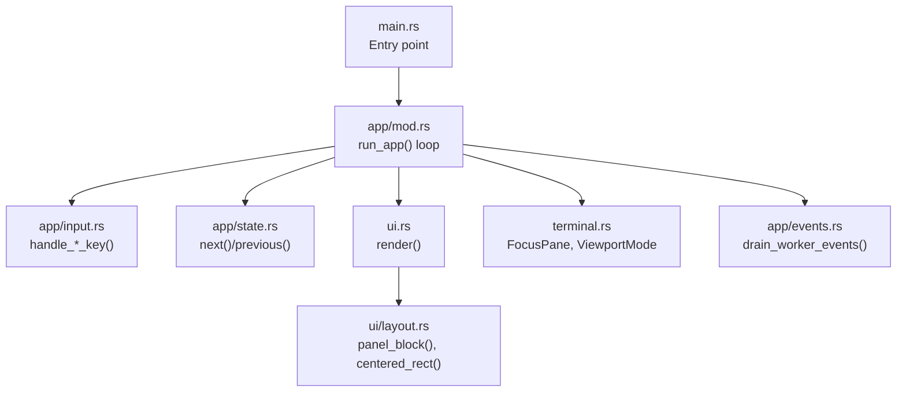
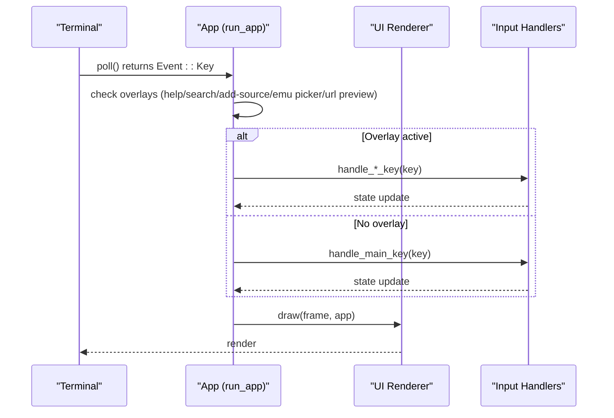
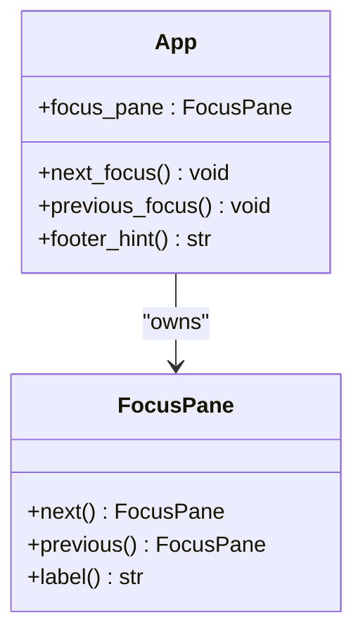
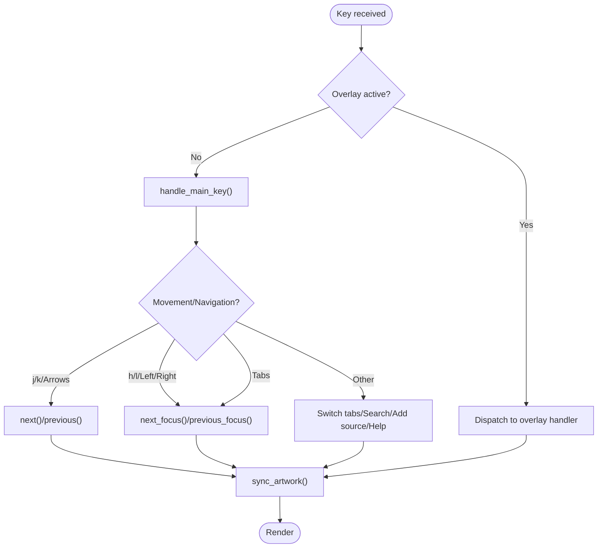
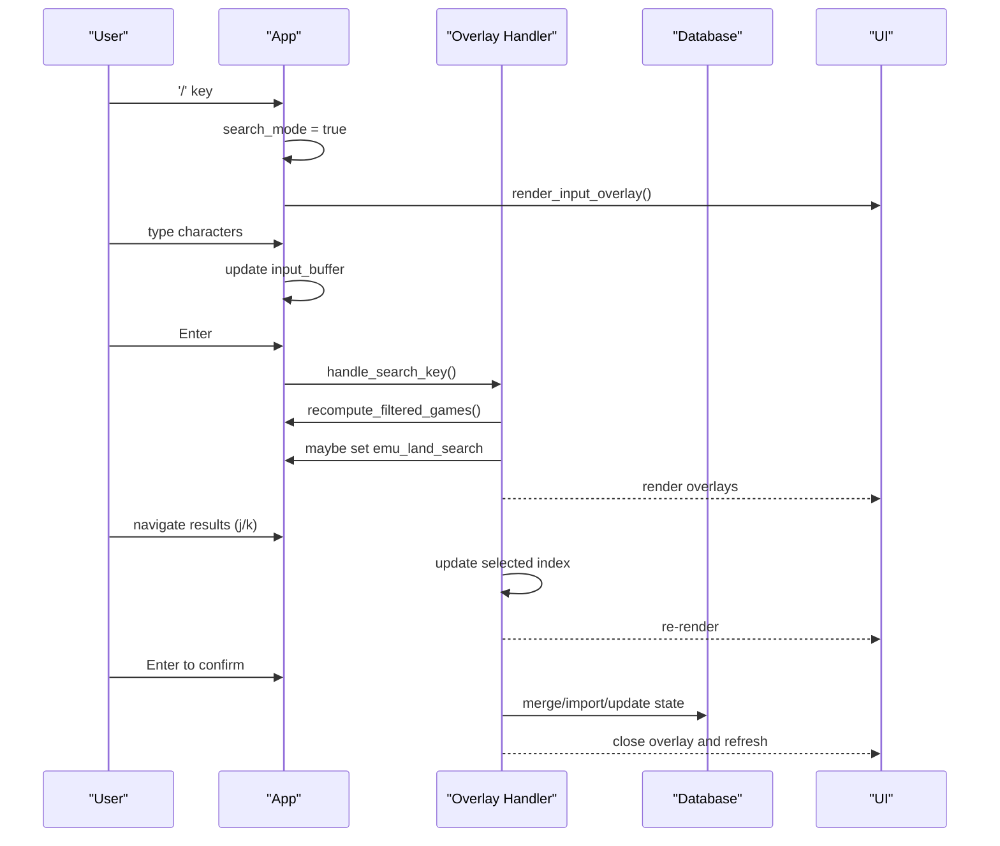
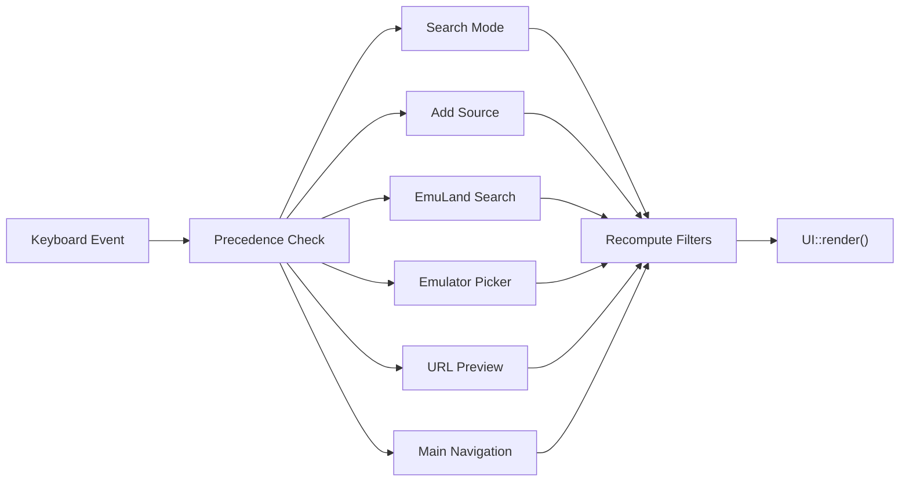
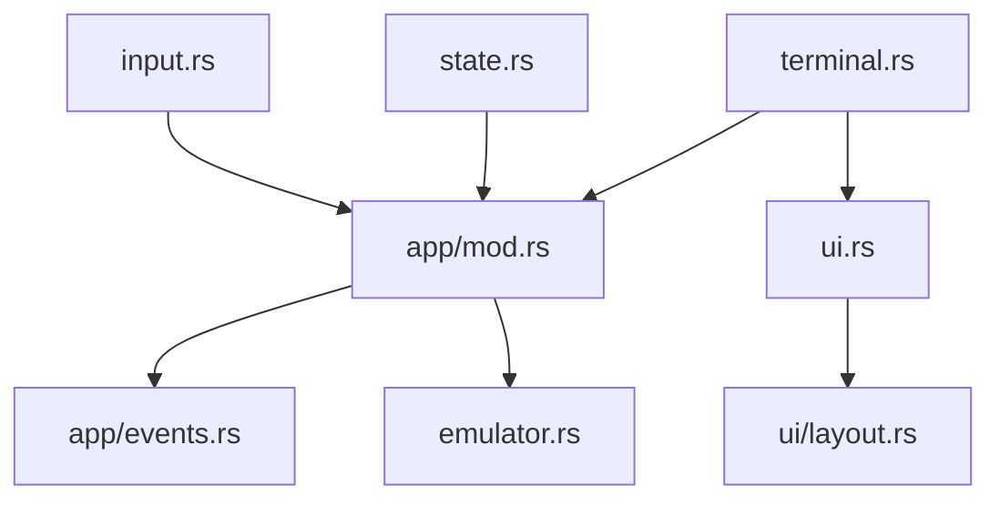

# Input Handling and Navigation

<cite>
**Referenced Files in This Document**
- [input.rs](file://src/app/input.rs)
- [state.rs](file://src/app/state.rs)
- [mod.rs](file://src/app/mod.rs)
- [terminal.rs](file://src/terminal.rs)
- [ui.rs](file://src/ui.rs)
- [layout.rs](file://src/ui/layout.rs)
- [events.rs](file://src/app/events.rs)
- [main.rs](file://src/main.rs)
</cite>

## Table of Contents
1. [Introduction](#introduction)
2. [Project Structure](#project-structure)
3. [Core Components](#core-components)
4. [Architecture Overview](#architecture-overview)
5. [Detailed Component Analysis](#detailed-component-analysis)
6. [Dependency Analysis](#dependency-analysis)
7. [Performance Considerations](#performance-considerations)
8. [Troubleshooting Guide](#troubleshooting-guide)
9. [Conclusion](#conclusion)

## Introduction
This document explains the input handling and navigation system that powers keyboard-driven interactions across the terminal UI. It covers:
- The FocusPane system for managing focus across Library, Artwork, and Summary panes
- Keyboard event processing and navigation patterns (j/k arrows, h/l movement, Tab cycling)
- The input overlay system for search, URL entry, and emulator selection
- How input state is managed and delegated to appropriate handlers
- Integration with the application’s state machine and rendering pipeline
- Accessibility and cross-platform input compatibility considerations

## Project Structure
The input handling system is primarily implemented in the application module and integrated with the terminal and UI layers:
- Application orchestration and state: [mod.rs](file://src/app/mod.rs)
- Keyboard event handling and overlays: [input.rs](file://src/app/input.rs)
- Selection and navigation state transitions: [state.rs](file://src/app/state.rs)
- Focus pane model and terminal capability detection: [terminal.rs](file://src/terminal.rs)
- Rendering and overlay composition: [ui.rs](file://src/ui.rs), [layout.rs](file://src/ui/layout.rs)
- Worker event integration: [events.rs](file://src/app/events.rs)
- Entry point: [main.rs](file://src/main.rs)

**Diagram sources**
- [main.rs:1-9](file://src/main.rs#L1-L9)
- [mod.rs:553-621](file://src/app/mod.rs#L553-L621)
- [input.rs:14-347](file://src/app/input.rs#L14-L347)
- [state.rs:8-84](file://src/app/state.rs#L8-L84)
- [ui.rs:23-68](file://src/ui.rs#L23-L68)
- [layout.rs:12-109](file://src/ui/layout.rs#L12-L109)
- [terminal.rs:5-161](file://src/terminal.rs#L5-L161)
- [events.rs:24-98](file://src/app/events.rs#L24-L98)

**Section sources**
- [main.rs:1-9](file://src/main.rs#L1-L9)
- [mod.rs:553-621](file://src/app/mod.rs#L553-L621)

## Core Components
- FocusPane: An enum that cycles focus among Library, Artwork, and Summary panes. It supports next/previous transitions and labels for UI hints.
- App state machine: Central orchestrator for tabs, selection indices, overlays, and input buffers. Delegates keyboard events to specialized handlers.
- Keyboard handlers: Mode-specific handlers for main navigation, search, add-source wizard, EmuLand search overlay, emulator picker, and URL preview.
- Rendering integration: Overlays and focus indicators are rendered conditionally based on active modes and focus pane.

Key responsibilities:
- FocusPane: [terminal.rs:5-36](file://src/terminal.rs#L5-L36)
- App focus cycling: [mod.rs:221-227](file://src/app/mod.rs#L221-L227)
- Main key handling: [input.rs:16-58](file://src/app/input.rs#L16-L58)
- Overlay handlers: [input.rs:61-345](file://src/app/input.rs#L61-L345)
- State transitions: [state.rs:9-82](file://src/app/state.rs#L9-L82)

**Section sources**
- [terminal.rs:5-36](file://src/terminal.rs#L5-L36)
- [mod.rs:221-227](file://src/app/mod.rs#L221-L227)
- [input.rs:16-58](file://src/app/input.rs#L16-L58)
- [input.rs:61-345](file://src/app/input.rs#L61-L345)
- [state.rs:9-82](file://src/app/state.rs#L9-L82)

## Architecture Overview
The input system operates in a tight loop:
- Poll for keyboard events
- Dispatch to overlay handlers if active
- Otherwise dispatch to main handler
- Apply state changes and re-render

**Diagram sources**
- [mod.rs:575-621](file://src/app/mod.rs#L575-L621)
- [input.rs:16-58](file://src/app/input.rs#L16-L58)
- [ui.rs:23-68](file://src/ui.rs#L23-L68)

## Detailed Component Analysis

### FocusPane System
FocusPane defines three UI zones and their cyclic navigation:
- Library: primary list of games
- Artwork: hero artwork and preview area
- Summary: metadata and status summary

Focus transitions:
- next(): Library → Artwork → Summary → Library
- previous(): Library ← Artwork ← Summary ← Library
- Labels for hints and borders

Integration with rendering:
- Header and panels apply focus-aware borders and styles
- Footer hints change depending on focus pane and active overlays

**Diagram sources**
- [terminal.rs:5-36](file://src/terminal.rs#L5-L36)
- [mod.rs:221-258](file://src/app/mod.rs#L221-L258)

**Section sources**
- [terminal.rs:5-36](file://src/terminal.rs#L5-L36)
- [mod.rs:221-258](file://src/app/mod.rs#L221-L258)

### Keyboard Event Processing and Navigation Patterns
Main navigation keys:
- j/k or Down/Up: move selection within the active tab
- h/l or Left/Right: cycle focus panes
- Tab / BackTab: cycle focus panes
- 1/2/3: switch tabs (Library/Installed/Browse)
- p/n: browse pagination (Browse tab)
- / : enter search mode
- a : open add-source wizard
- x : dismiss latest toast
- Enter : activate selected item or confirm overlay actions
- ? : toggle help

Selection and paging logic:
- next()/previous() adjust indices per active tab and clamp bounds
- browse_next_page()/browse_prev_page() manage pagination and refresh jobs

**Diagram sources**
- [mod.rs:575-621](file://src/app/mod.rs#L575-L621)
- [input.rs:16-58](file://src/app/input.rs#L16-L58)
- [state.rs:9-82](file://src/app/state.rs#L9-L82)

**Section sources**
- [input.rs:16-58](file://src/app/input.rs#L16-L58)
- [state.rs:9-82](file://src/app/state.rs#L9-L82)
- [mod.rs:575-621](file://src/app/mod.rs#L575-L621)

### Input Overlay System
The system supports several modal overlays with dedicated handlers and rendering:

- Search overlay
  - Behavior: Toggle on '/', edit input buffer, commit on Enter, cancel on Esc
  - Effects: Updates search query, recomputes filtered games, triggers EmuLand search fallback when empty
  - Rendering: [ui.rs:691-761](file://src/ui.rs#L691-L761)

- Add Source wizard
  - Modes: Choose, URL, EmuLand search, Manifest
  - Behavior: Stepwise transitions, input validation, preview and merge actions
  - Rendering: [ui.rs:691-761](file://src/ui.rs#L691-L761)

- EmuLand search overlay
  - Behavior: Navigate results with j/k, preview selected result, confirm to preview URL
  - Effects: Synchronizes preview artwork, opens URL preview overlay
  - Rendering: [ui.rs:763-864](file://src/ui.rs#L763-L864)

- Emulator picker overlay
  - Behavior: Choose emulator candidate, launch or install based on availability
  - Effects: Suspends terminal, launches emulator, resumes UI
  - Rendering: [ui.rs:602-699](file://src/ui.rs#L602-L699)

- URL preview overlay
  - Behavior: Confirm or discard URL preview; merges catalog entry and metadata
  - Effects: Updates database, refreshes lists, shows notifications
  - Rendering: [ui.rs:866-950](file://src/ui.rs#L866-L950)

**Diagram sources**
- [input.rs:61-102](file://src/app/input.rs#L61-L102)
- [input.rs:105-210](file://src/app/input.rs#L105-L210)
- [input.rs:213-256](file://src/app/input.rs#L213-L256)
- [input.rs:259-295](file://src/app/input.rs#L259-L295)
- [input.rs:298-345](file://src/app/input.rs#L298-L345)
- [ui.rs:691-761](file://src/ui.rs#L691-L761)
- [ui.rs:763-864](file://src/ui.rs#L763-L864)
- [ui.rs:866-950](file://src/ui.rs#L866-L950)

**Section sources**
- [input.rs:61-345](file://src/app/input.rs#L61-L345)
- [ui.rs:691-761](file://src/ui.rs#L691-L761)
- [ui.rs:763-864](file://src/ui.rs#L763-L864)
- [ui.rs:866-950](file://src/ui.rs#L866-L950)

### Integration with the Application State Machine
- Event loop: [mod.rs:575-621](file://src/app/mod.rs#L575-L621)
- Overlay precedence: search → add-source → emu-land search → emulator picker → URL preview
- State updates: selection indices, tab switching, overlay flags, input buffers
- Rendering: [ui.rs:23-68](file://src/ui.rs#L23-L68)
- Worker events: [events.rs:24-98](file://src/app/events.rs#L24-L98)

**Diagram sources**
- [mod.rs:575-621](file://src/app/mod.rs#L575-L621)
- [input.rs:61-345](file://src/app/input.rs#L61-L345)
- [ui.rs:23-68](file://src/ui.rs#L23-L68)

**Section sources**
- [mod.rs:575-621](file://src/app/mod.rs#L575-L621)
- [input.rs:61-345](file://src/app/input.rs#L61-L345)
- [ui.rs:23-68](file://src/ui.rs#L23-L68)
- [events.rs:24-98](file://src/app/events.rs#L24-L98)

## Dependency Analysis
- Input handlers depend on App state and external services (catalog, launcher)
- FocusPane influences UI rendering and footer hints
- Overlays share common rendering utilities (panel blocks, centering)
- Terminal capabilities influence theme and image protocols

**Diagram sources**
- [input.rs:14-347](file://src/app/input.rs#L14-L347)
- [state.rs:8-84](file://src/app/state.rs#L8-L84)
- [terminal.rs:5-161](file://src/terminal.rs#L5-L161)
- [ui.rs:23-68](file://src/ui.rs#L23-L68)
- [layout.rs:12-109](file://src/ui/layout.rs#L12-L109)
- [events.rs:24-98](file://src/app/events.rs#L24-L98)

**Section sources**
- [input.rs:14-347](file://src/app/input.rs#L14-L347)
- [state.rs:8-84](file://src/app/state.rs#L8-L84)
- [terminal.rs:5-161](file://src/terminal.rs#L5-L161)
- [ui.rs:23-68](file://src/ui.rs#L23-L68)
- [layout.rs:12-109](file://src/ui/layout.rs#L12-L109)
- [events.rs:24-98](file://src/app/events.rs#L24-L98)

## Performance Considerations
- Event polling interval: The loop polls with a fixed tick rate, balancing responsiveness and CPU usage.
- Overlay rendering: Overlays are rendered conditionally; keep overlay logic efficient to avoid unnecessary redraws.
- Artwork synchronization: Frequent artwork sync occurs on selection changes; cache and minimize redundant loads.
- Worker integration: Background tasks update state; ensure minimal blocking in UI thread.

[No sources needed since this section provides general guidance]

## Troubleshooting Guide
Common issues and resolutions:
- Keys not responding
  - Verify overlay precedence: if an overlay is active, main keys are ignored until the overlay is closed.
  - Check modifiers: the loop ignores certain combinations (e.g., Ctrl+C) to exit cleanly.
- Focus not changing
  - Ensure focus pane is toggled via h/l or Tab; verify footer hints reflect the expected pane.
- Search not filtering
  - Confirm search_mode is enabled and input_buffer is populated; after Enter, recompute filtered games and toast feedback indicates results.
- Emulator picker not launching
  - Availability checks determine whether to install or launch; ensure emulator is available or downloadable.
- URL preview merge fails
  - Validate URL format and network connectivity; errors are surfaced via toasts.

**Section sources**
- [mod.rs:575-621](file://src/app/mod.rs#L575-L621)
- [input.rs:61-102](file://src/app/input.rs#L61-L102)
- [input.rs:259-295](file://src/app/input.rs#L259-L295)
- [mod.rs:402-432](file://src/app/mod.rs#L402-L432)

## Conclusion
The input handling system combines a clear FocusPane model, robust overlay handlers, and a responsive event loop to deliver efficient keyboard navigation. By delegating to mode-specific handlers and integrating tightly with the state machine and renderer, it ensures predictable behavior across Library, Artwork, and Summary panes, while supporting advanced workflows like search, URL ingestion, and emulator selection.