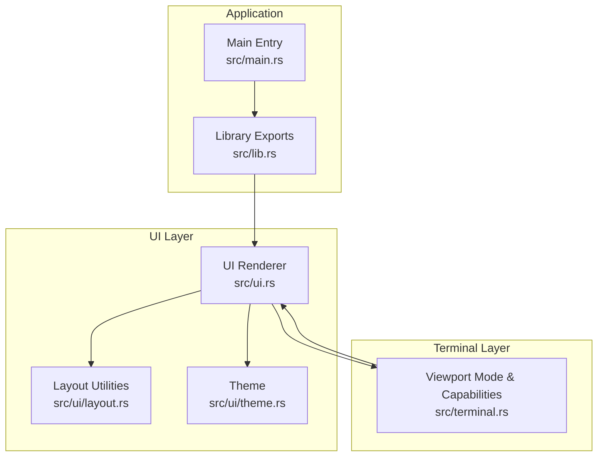
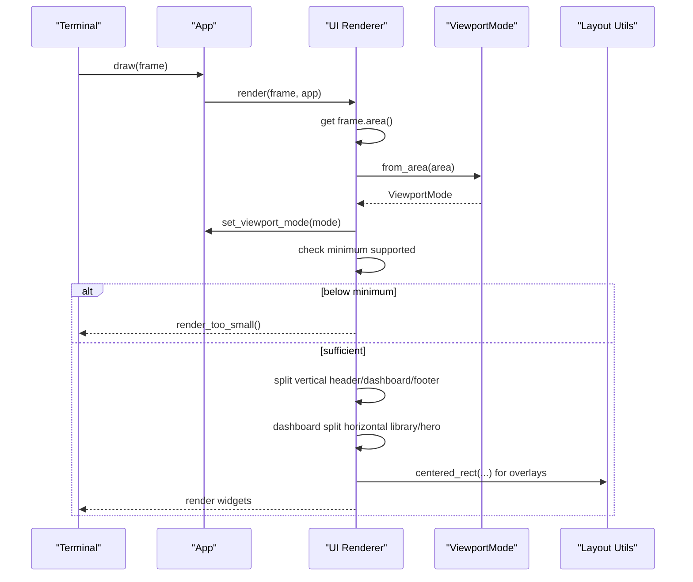
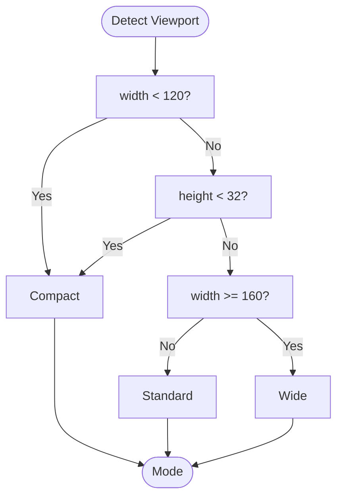
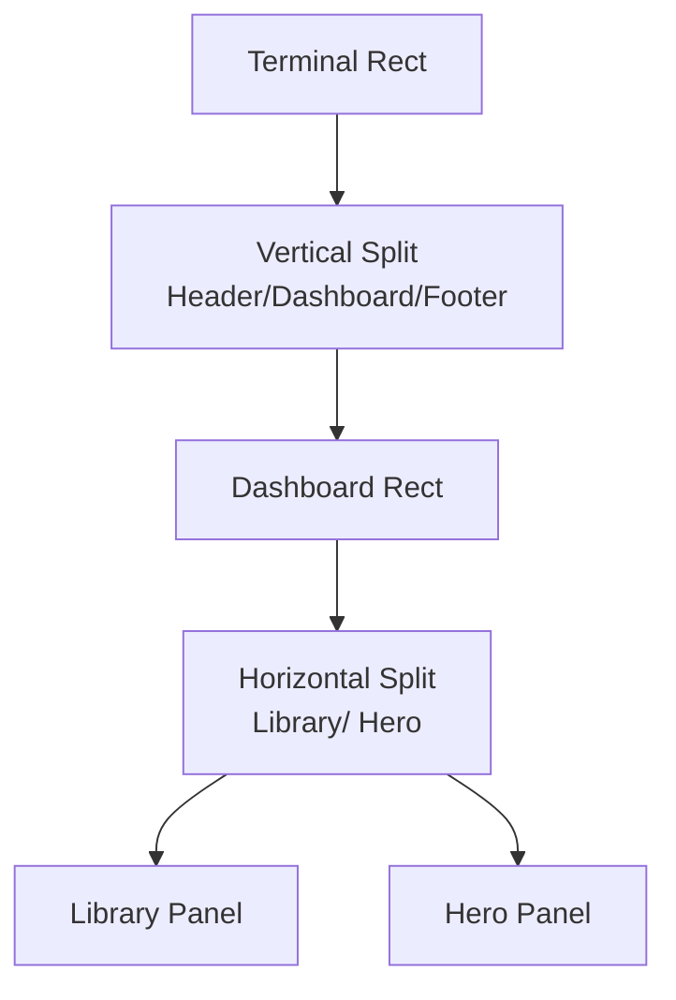
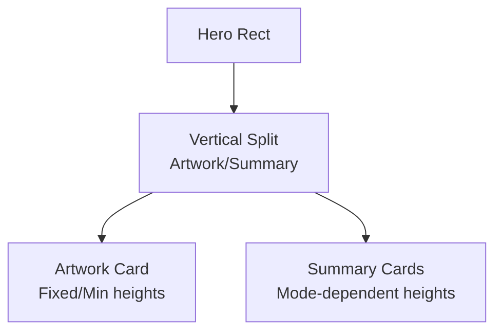
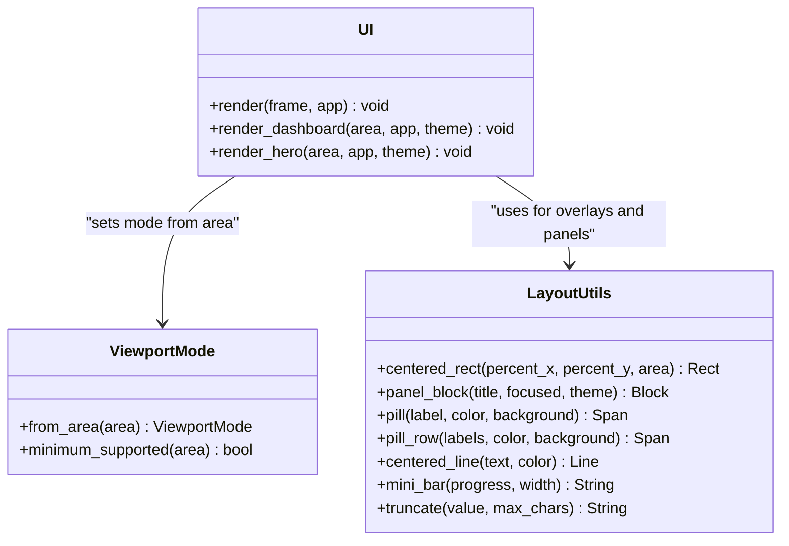
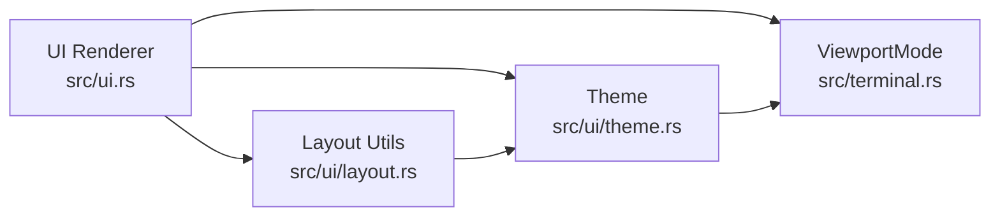

# Layout Management System

<cite>
**Referenced Files in This Document**
- [layout.rs](file://src/ui/layout.rs)
- [ui.rs](file://src/ui.rs)
- [terminal.rs](file://src/terminal.rs)
- [theme.rs](file://src/ui/theme.rs)
- [lib.rs](file://src/lib.rs)
- [main.rs](file://src/main.rs)
</cite>

## Table of Contents
1. [Introduction](#introduction)
2. [Project Structure](#project-structure)
3. [Core Components](#core-components)
4. [Architecture Overview](#architecture-overview)
5. [Detailed Component Analysis](#detailed-component-analysis)
6. [Dependency Analysis](#dependency-analysis)
7. [Performance Considerations](#performance-considerations)
8. [Troubleshooting Guide](#troubleshooting-guide)
9. [Conclusion](#conclusion)

## Introduction
This document describes the constraint-based layout management system for a responsive terminal UI built with Ratatui. It explains how the system detects viewport modes, applies responsive design patterns across compact, standard, and wide layouts, and uses utility functions for centering rectangles, creating panels, and building responsive grid layouts. The documentation covers constraint combinations, percentage-based layouts, minimum size calculations, and how layout components adapt to different terminal sizes and resolutions.

## Project Structure
The layout system is primarily implemented in the UI module with supporting components in terminal capability detection and theming. The key files are:
- Layout utilities and constants: [layout.rs](file://src/ui/layout.rs)
- Main UI renderer and responsive layout orchestration: [ui.rs](file://src/ui.rs)
- Viewport mode detection and terminal capability detection: [terminal.rs](file://src/terminal.rs)
- Theme definitions and color schemes: [theme.rs](file://src/ui/theme.rs)
- Application entry points: [lib.rs](file://src/lib.rs), [main.rs](file://src/main.rs)

**Diagram sources**
- [ui.rs:23-68](file://src/ui.rs#L23-L68)
- [layout.rs:12-17](file://src/ui/layout.rs#L12-L17)
- [terminal.rs:38-59](file://src/terminal.rs#L38-L59)
- [theme.rs:12-26](file://src/ui/theme.rs#L12-L26)
- [main.rs:3-8](file://src/main.rs#L3-L8)
- [lib.rs:14-22](file://src/lib.rs#L14-L22)

**Section sources**
- [ui.rs:1-800](file://src/ui.rs#L1-L800)
- [layout.rs:1-109](file://src/ui/layout.rs#L1-L109)
- [terminal.rs:1-161](file://src/terminal.rs#L1-L161)
- [theme.rs:1-122](file://src/ui/theme.rs#L1-L122)
- [lib.rs:1-39](file://src/lib.rs#L1-L39)
- [main.rs:1-9](file://src/main.rs#L1-L9)

## Core Components
- ViewportMode: Enumerates Compact, Standard, and Wide modes and provides threshold-based detection from terminal dimensions.
- Layout constants: Define header/footer heights, minimum dashboard height, and minimum terminal dimensions.
- Centered rectangle utility: Generates overlay areas using percentage-based constraints.
- Panel creation utility: Builds styled blocks with borders and focus-aware titles.
- Responsive grid builders: Apply mode-specific constraints for library-hero and hero-summary layouts.

Key responsibilities:
- Detect viewport mode from terminal Rect and enforce minimum supported dimensions.
- Provide layout constants and utilities for consistent spacing and overlays.
- Drive responsive layout decisions across major UI regions (header, dashboard, footer) and overlays.

**Section sources**
- [terminal.rs:38-59](file://src/terminal.rs#L38-L59)
- [layout.rs:12-17](file://src/ui/layout.rs#L12-L17)
- [layout.rs:19-43](file://src/ui/layout.rs#L19-L43)
- [layout.rs:45-61](file://src/ui/layout.rs#L45-L61)

## Architecture Overview
The layout engine orchestrates a vertical stack of header, dashboard, and footer. Within the dashboard, the system splits horizontally into library and hero regions, applying mode-specific percentages. The UI renderer sets the viewport mode based on the current terminal area and enforces minimum supported dimensions before rendering.

**Diagram sources**
- [ui.rs:23-68](file://src/ui.rs#L23-L68)
- [terminal.rs:45-58](file://src/terminal.rs#L45-L58)
- [layout.rs:19-43](file://src/ui/layout.rs#L19-L43)

## Detailed Component Analysis

### Viewport Mode Detection
ViewportMode determines layout behavior based on terminal dimensions:
- Compact: width < 120 OR height < 32
- Standard: otherwise
- Wide: width >= 160

Minimum supported terminal size is enforced at 80x24.

**Diagram sources**
- [terminal.rs:45-58](file://src/terminal.rs#L45-L58)

**Section sources**
- [terminal.rs:38-59](file://src/terminal.rs#L38-L59)

### Constraint-Based Layout Engine
The UI renderer constructs a vertical layout with fixed header/footer heights and a minimum dashboard height. The dashboard is split horizontally into library and hero regions with mode-specific percentages.

- Vertical constraints:
  - Header: fixed length
  - Dashboard: minimum height
  - Footer: fixed length

- Horizontal dashboard split:
  - Compact: ~46%/~54%
  - Standard: ~42%/~58%
  - Wide: ~38%/~62%

**Diagram sources**
- [ui.rs:33-44](file://src/ui.rs#L33-L44)
- [ui.rs:178-190](file://src/ui.rs#L178-L190)

**Section sources**
- [ui.rs:33-44](file://src/ui.rs#L33-L44)
- [ui.rs:178-190](file://src/ui.rs#L178-L190)

### Responsive Grid Builders
Within the hero region, the system builds a vertical grid with mode-dependent row heights:
- Compact: shorter hero rows
- Standard: medium hero rows
- Wide: taller hero rows

Additionally, the summary card layout adjusts row heights based on viewport mode to accommodate more content in wide mode.

**Diagram sources**
- [ui.rs:276-292](file://src/ui.rs#L276-L292)
- [ui.rs:339-464](file://src/ui.rs#L339-L464)

**Section sources**
- [ui.rs:276-292](file://src/ui.rs#L276-L292)
- [ui.rs:339-464](file://src/ui.rs#L339-L464)

### Utility Functions for Centering Rectangles and Panels
- centered_rect(percent_x, percent_y, area): Creates a centered overlay by nesting two layouts (vertical then horizontal) using percentage constraints.
- panel_block(title, focused, theme): Builds a styled block with title, borders, and focus-aware styling.
- pill(label, color, background) and pill_row(labels, color, background): Create styled tag-like spans for badges.
- centered_line(text, color): Centers a line for display.
- mini_bar(progress, width): Renders a simple progress indicator.
- truncate(value, max_chars): Truncates text safely to a maximum number of characters.

These utilities are used extensively for overlays and card content.

**Section sources**
- [layout.rs:19-43](file://src/ui/layout.rs#L19-L43)
- [layout.rs:45-61](file://src/ui/layout.rs#L45-L61)
- [layout.rs:63-87](file://src/ui/layout.rs#L63-L87)
- [layout.rs:89-93](file://src/ui/layout.rs#L89-L93)
- [layout.rs:95-103](file://src/ui/layout.rs#L95-L103)
- [layout.rs:105-108](file://src/ui/layout.rs#L105-L108)

### Overlay Rendering and Percentage-Based Layouts
Overlays are rendered using centered_rect and percentage-based constraints:
- Help overlay: centered at 72% width and 70% height
- Input overlay: centered at 72% width and 34% height
- Emu-Land search overlay: centered at 82% width and 60% height
- URL preview overlay: centered at 72% width and 52% height
- Emulator picker overlay: centered at 64% width and 46% height

The URL preview overlay demonstrates a two-column layout with percentage constraints for artwork and details.

**Section sources**
- [ui.rs:46-64](file://src/ui.rs#L46-L64)
- [ui.rs:866-1025](file://src/ui.rs#L866-L1025)

### Minimum Size Calculations and Thresholds
The system enforces minimum terminal dimensions:
- Minimum width: 80
- Minimum height: 24

If the terminal is smaller than these thresholds, a friendly message is rendered instructing the user to resize.

**Section sources**
- [layout.rs:16-17](file://src/ui/layout.rs#L16-L17)
- [ui.rs:28-31](file://src/ui.rs#L28-L31)
- [ui.rs:1027-1044](file://src/ui.rs#L1027-L1044)

### Relationship Between Layout Components and Terminal Dimensions
- The UI renderer obtains the terminal area and sets the viewport mode accordingly.
- The viewport mode drives percentage-based horizontal splits for the library/hero region.
- The hero region’s row heights adjust based on viewport mode to optimize content density.
- Overlays use centered_rect to position themselves relative to the terminal area.

**Diagram sources**
- [terminal.rs:45-58](file://src/terminal.rs#L45-L58)
- [layout.rs:19-108](file://src/ui/layout.rs#L19-L108)
- [ui.rs:23-68](file://src/ui.rs#L23-L68)

## Dependency Analysis
- UI renderer depends on:
  - Layout constants and utilities for sizing and overlays
  - ViewportMode for responsive behavior
  - Theme for styling
- Layout utilities depend on:
  - Ratatui layout primitives (Constraint, Direction, Layout, Rect)
  - Theme for styling
- Terminal module provides:
  - ViewportMode thresholds and minimum supported dimensions
  - Terminal capability detection (used by theme)

**Diagram sources**
- [ui.rs:17-18](file://src/ui.rs#L17-L18)
- [layout.rs:5-10](file://src/ui/layout.rs#L5-L10)
- [theme.rs:8-9](file://src/ui/theme.rs#L8-L9)
- [terminal.rs:3-4](file://src/terminal.rs#L3-L4)

**Section sources**
- [ui.rs:17-18](file://src/ui.rs#L17-L18)
- [layout.rs:5-10](file://src/ui/layout.rs#L5-L10)
- [theme.rs:8-9](file://src/ui/theme.rs#L8-L9)
- [terminal.rs:3-4](file://src/terminal.rs#L3-L4)

## Performance Considerations
- Percentage-based layouts minimize recomputation when resizing; the system relies on Ratatui’s layout splitting to compute child areas efficiently.
- Centered overlays reuse the same percentage-split technique, avoiding complex arithmetic.
- Minimum dimension checks short-circuit rendering early for very small terminals, preventing unnecessary widget construction.
- Mode-specific constraints reduce branching complexity by selecting pre-defined arrays of constraints.

[No sources needed since this section provides general guidance]

## Troubleshooting Guide
Common issues and remedies:
- Terminal too small: The renderer displays a centered message with minimum dimensions and stops rendering further content. Resize the terminal to meet the minimum supported size.
- Overlays not centered: Verify the percent_x and percent_y values passed to centered_rect and ensure the overlay area is derived from the current frame area.
- Incorrect mode behavior: Confirm the terminal dimensions meet the thresholds for Compact, Standard, or Wide modes. Adjust thresholds if necessary.

**Section sources**
- [ui.rs:28-31](file://src/ui.rs#L28-L31)
- [ui.rs:1027-1044](file://src/ui.rs#L1027-L1044)
- [terminal.rs:45-58](file://src/terminal.rs#L45-L58)

## Conclusion
The layout management system uses a constraint-based approach with Ratatui to deliver a responsive terminal UI. ViewportMode detection enables three distinct layout modes, while layout constants and utilities ensure consistent spacing and overlay placement. The system balances readability and performance by leveraging Ratatui’s layout splitting and short-circuiting for small terminals. The documented patterns and utilities provide a foundation for extending responsive behavior across additional UI regions and overlays.