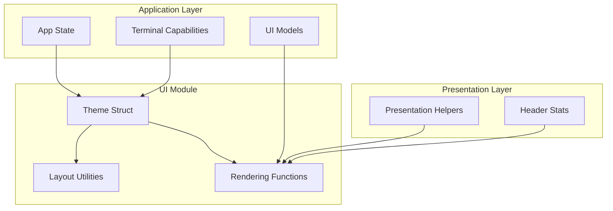
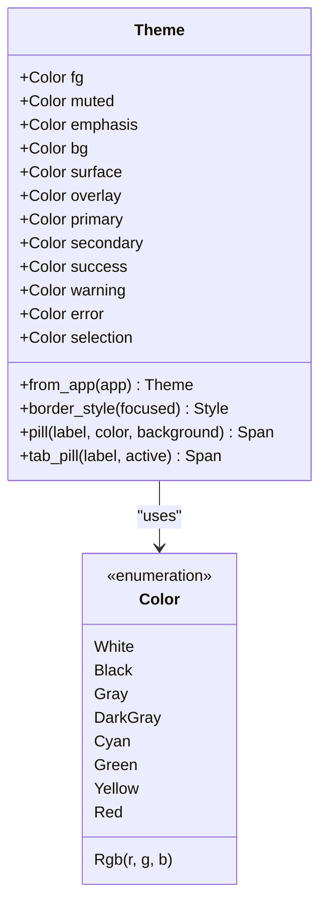
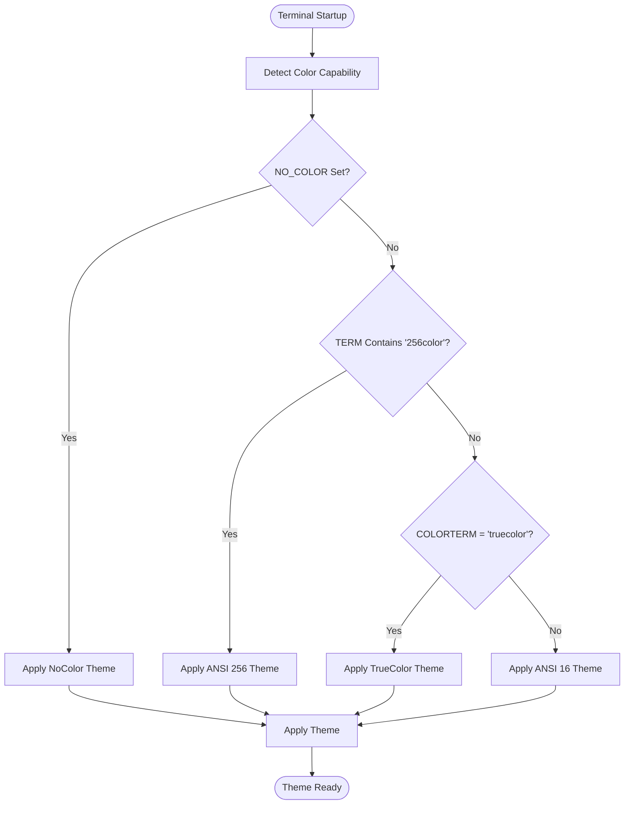
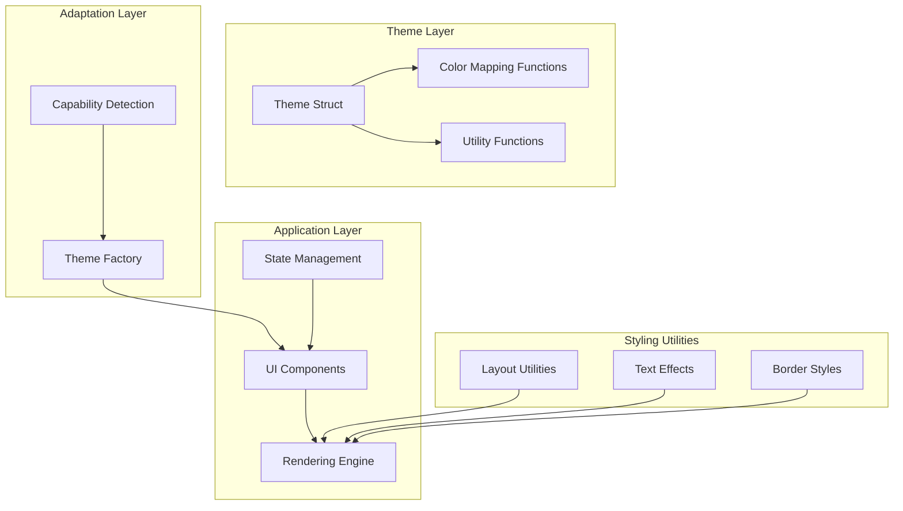
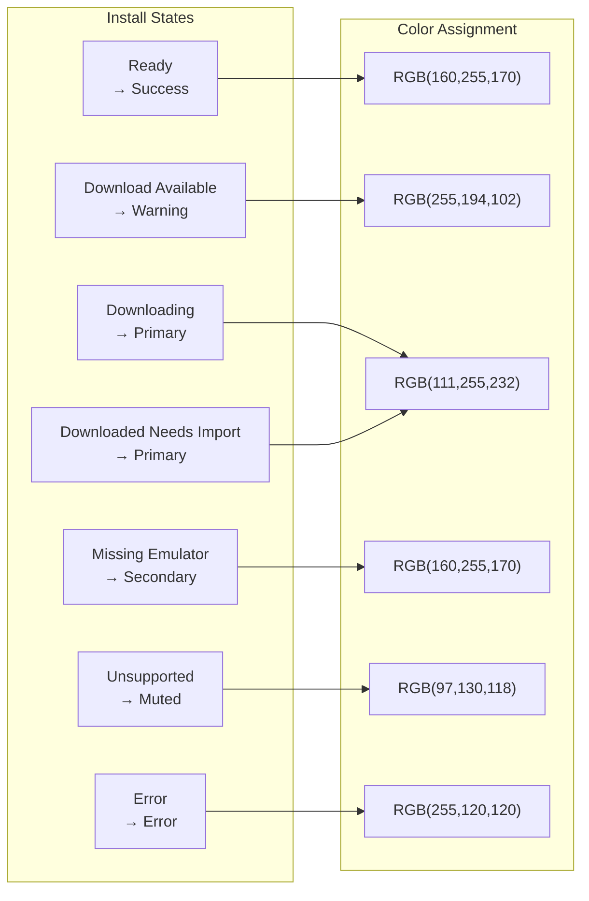
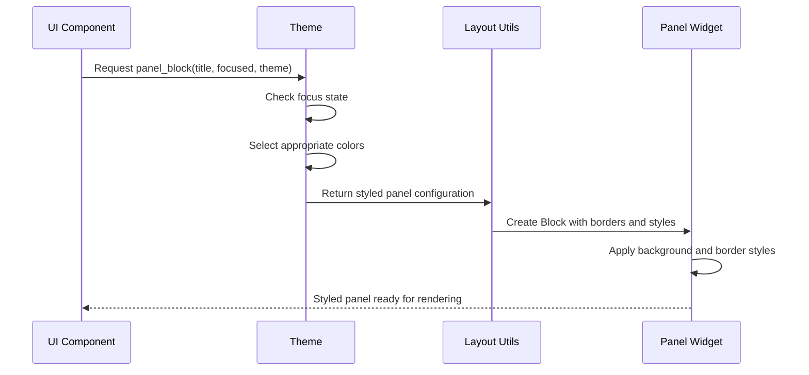
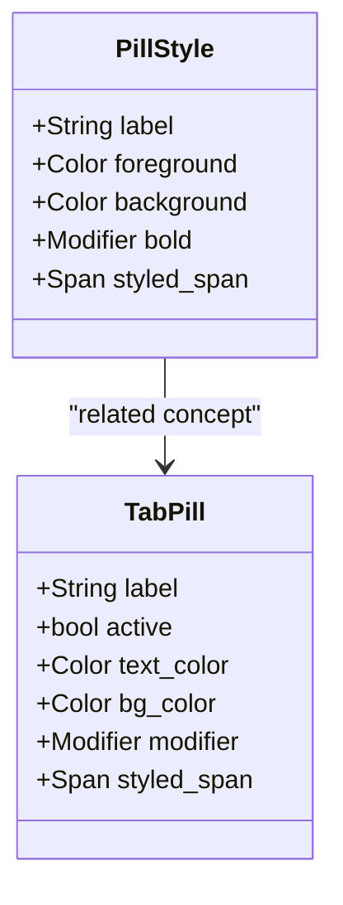
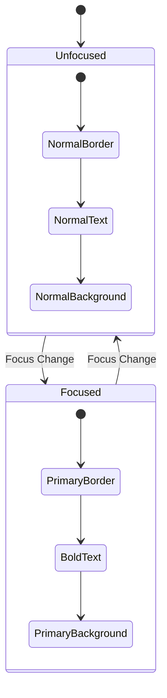
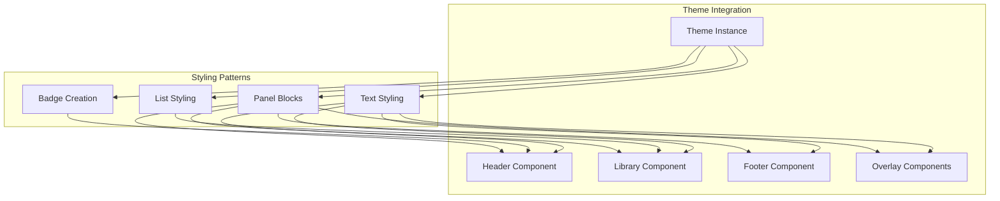
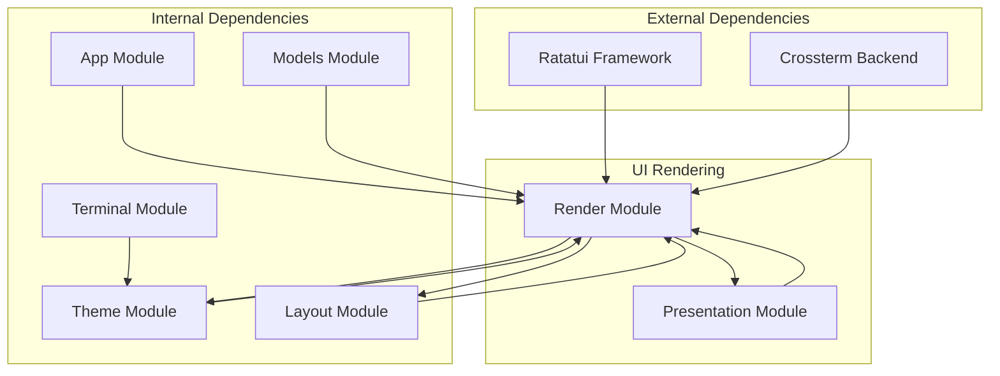

# Theme and Styling System

<cite>
**Referenced Files in This Document**
- [theme.rs](file://src/ui/theme.rs)
- [ui.rs](file://src/ui.rs)
- [layout.rs](file://src/ui/layout.rs)
- [terminal.rs](file://src/terminal.rs)
- [models.rs](file://src/models.rs)
- [presentation.rs](file://src/presentation.rs)
- [app/mod.rs](file://src/app/mod.rs)
</cite>

## Table of Contents
1. [Introduction](#introduction)
2. [Project Structure](#project-structure)
3. [Core Components](#core-components)
4. [Architecture Overview](#architecture-overview)
5. [Detailed Component Analysis](#detailed-component-analysis)
6. [Dependency Analysis](#dependency-analysis)
7. [Performance Considerations](#performance-considerations)
8. [Troubleshooting Guide](#troubleshooting-guide)
9. [Conclusion](#conclusion)

## Introduction

The theme and styling system provides a consistent visual design framework for the terminal interface, ensuring harmonious color schemes and typography across all UI components. This system adapts to different terminal capabilities while maintaining visual coherence through carefully curated color palettes and styling patterns.

The system centers around a comprehensive Theme struct that defines color relationships and provides utility functions for consistent styling across panels, lists, badges, and interactive elements. It supports multiple terminal capability tiers (NoColor, ANSI 16/256, TrueColor) and includes sophisticated color mapping for semantic states and interactive feedback.

## Project Structure

The theme system is organized across several key modules:

**Diagram sources**
- [theme.rs:1-122](file://src/ui/theme.rs#L1-L122)
- [ui.rs:1-1127](file://src/ui.rs#L1-L1127)
- [layout.rs:1-109](file://src/ui/layout.rs#L1-L109)

**Section sources**
- [theme.rs:1-122](file://src/ui/theme.rs#L1-L122)
- [ui.rs:1-1127](file://src/ui.rs#L1-L1127)
- [layout.rs:1-109](file://src/ui/layout.rs#L1-L109)

## Core Components

### Theme Struct Definition

The Theme struct serves as the central color authority, defining all visual elements used throughout the interface:

**Diagram sources**
- [theme.rs:12-26](file://src/ui/theme.rs#L12-L26)

The theme defines seven core color categories:

- **Primary Palette**: `primary`, `secondary`, `success`, `warning`, `error` - Semantic colors for different UI states and actions
- **Surface Palette**: `bg`, `surface`, `overlay`, `selection` - Background and container colors
- **Text Palette**: `fg`, `muted`, `emphasis` - Text color variations for different importance levels

**Section sources**
- [theme.rs:12-26](file://src/ui/theme.rs#L12-L26)

### Terminal Capability Detection

The system automatically adapts to different terminal environments through capability detection:

**Diagram sources**
- [terminal.rs:62-133](file://src/terminal.rs#L62-L133)

**Section sources**
- [terminal.rs:62-133](file://src/terminal.rs#L62-L133)

## Architecture Overview

The theme system follows a layered architecture that separates concerns between color definition, capability adaptation, and UI application:

**Diagram sources**
- [theme.rs:28-107](file://src/ui/theme.rs#L28-L107)
- [ui.rs:23-68](file://src/ui.rs#L23-L68)
- [layout.rs:45-109](file://src/ui/layout.rs#L45-L109)

The architecture ensures that themes are computed once per render cycle and applied consistently across all UI components, while still adapting to the terminal's capabilities.

**Section sources**
- [theme.rs:28-107](file://src/ui/theme.rs#L28-L107)
- [ui.rs:23-68](file://src/ui.rs#L23-L68)
- [layout.rs:45-109](file://src/ui/layout.rs#L45-L109)

## Detailed Component Analysis

### Theme Color Palette

The theme system implements a sophisticated color palette designed for both readability and visual harmony:

#### Color Tier Adaptations

| Color Tier | fg | muted | emphasis | bg | surface | overlay | primary | secondary | success | warning | error | selection |
|------------|----|-------|----------|----|---------|---------|---------|-----------|---------|---------|-------|-----------|
| **NoColor** | White | Gray | White | Black | Black | Black | White | Gray | White | White | White | White |
| **ANSI 16/256** | White | DarkGray | White | Black | Black | DarkGray | Cyan | Green | Green | Yellow | Red | Cyan |
| **TrueColor** | RGB(208,230,223) | RGB(97,130,118) | RGB(233,247,241) | RGB(5,13,10) | RGB(11,24,19) | RGB(17,33,27) | RGB(111,255,232) | RGB(160,255,170) | RGB(160,255,170) | RGB(255,194,102) | RGB(255,120,120) | RGB(15,70,76) |

#### Semantic Color Mapping

The system provides intelligent color mapping for different UI states:

**Diagram sources**
- [theme.rs:109-121](file://src/ui/theme.rs#L109-L121)
- [models.rs:193-246](file://src/models.rs#L193-L246)

**Section sources**
- [theme.rs:109-121](file://src/ui/theme.rs#L109-L121)
- [models.rs:193-246](file://src/models.rs#L193-L246)

### Styling Utilities

The system provides comprehensive styling utilities for consistent UI element creation:

#### Border and Panel Styling

Panel blocks adapt their appearance based on focus state and terminal capabilities:

**Diagram sources**
- [layout.rs:45-61](file://src/ui/layout.rs#L45-L61)
- [ui.rs:70-137](file://src/ui.rs#L70-L137)

#### Text Effects and Emphasis

The system implements sophisticated text styling patterns:

| Effect Type | Implementation | Usage Example |
|-------------|----------------|---------------|
| **Bold Emphasis** | `Modifier::BOLD` | Active tabs, emphasized text |
| **Reversed Selection** | `Modifier::REVERSED` | Selected list items |
| **Background Highlighting** | `Style::default().bg(color)` | Selection states, badges |
| **Foreground Coloring** | `Style::default().fg(color)` | Text content, status indicators |

#### Badge and Tag System

Pill-style badges provide consistent visual indicators:

**Diagram sources**
- [theme.rs:82-106](file://src/ui/theme.rs#L82-L106)

**Section sources**
- [layout.rs:45-109](file://src/ui/layout.rs#L45-L109)
- [theme.rs:82-106](file://src/ui/theme.rs#L82-L106)

### Theme Application Patterns

The theme system follows consistent application patterns across the interface:

#### Conditional Styling Based on Focus

Focus states trigger visual changes that guide user attention:

**Diagram sources**
- [theme.rs:77-80](file://src/ui/theme.rs#L77-L80)
- [layout.rs:45-61](file://src/ui/layout.rs#L45-L61)

#### Dynamic Color Selection

Colors adapt based on content context and user interactions:

| Context | Color Selection Logic | Example Usage |
|---------|----------------------|---------------|
| **List Items** | Status-based mapping | Install state colors |
| **Tabs** | Active/inactive states | Tab highlighting |
| **Badges** | Semantic meaning | Platform, genre tags |
| **Toasts** | Toast type | Info, success, warning, error |

**Section sources**
- [ui.rs:139-176](file://src/ui.rs#L139-L176)
- [ui.rs:266-274](file://src/ui.rs#L266-L274)

### Relationship Between Themes and UI Components

The theme system integrates deeply with UI components through consistent styling patterns:

**Diagram sources**
- [ui.rs:70-575](file://src/ui.rs#L70-L575)
- [layout.rs:45-109](file://src/ui/layout.rs#L45-L109)

**Section sources**
- [ui.rs:70-575](file://src/ui.rs#L70-L575)
- [layout.rs:45-109](file://src/ui/layout.rs#L45-L109)

## Dependency Analysis

The theme system maintains clean dependencies while providing comprehensive functionality:

**Diagram sources**
- [ui.rs:1-21](file://src/ui.rs#L1-L21)
- [theme.rs:6](file://src/ui/theme.rs#L6)
- [terminal.rs:1-161](file://src/terminal.rs#L1-L161)

The dependency graph reveals a well-structured system where external frameworks provide the rendering foundation, while internal modules handle specific concerns like theme management, layout calculations, and application state.

**Section sources**
- [ui.rs:1-21](file://src/ui.rs#L1-L21)
- [theme.rs:6](file://src/ui/theme.rs#L6)
- [terminal.rs:1-161](file://src/terminal.rs#L1-L161)

## Performance Considerations

The theme system is designed for optimal performance through several key strategies:

### Theme Computation Efficiency

- **Single Computation Per Render**: Themes are computed once per render cycle and reused across all components
- **Minimal Memory Allocation**: Theme instances are small, copyable structures that avoid heap allocation overhead
- **Lazy Evaluation**: Color mapping functions compute results on-demand rather than storing pre-computed arrays

### Rendering Optimization

- **Consistent Style Objects**: Reused style objects minimize rendering overhead
- **Efficient Color Mapping**: Direct mapping functions avoid complex branching during rendering
- **Batched Updates**: Related UI updates benefit from shared theme instances

### Terminal Capability Optimization

- **Static Detection**: Terminal capabilities are detected once and cached
- **Adaptive Rendering**: Different color tiers avoid unnecessary computations
- **Fallback Compatibility**: No-color mode ensures graceful degradation without performance penalties

## Troubleshooting Guide

### Common Theme Issues

**Issue**: Colors appear incorrect in certain terminals
- **Cause**: Terminal capability detection mismatch
- **Solution**: Verify NO_COLOR environment variable and terminal settings
- **Prevention**: Test across different terminal environments during development

**Issue**: Theme appears inconsistent across components
- **Cause**: Multiple theme instances or stale theme references
- **Solution**: Ensure single theme instance per render cycle
- **Prevention**: Centralize theme creation in render functions

**Issue**: Performance degradation with complex themes
- **Cause**: Excessive style recomputation or memory allocation
- **Solution**: Profile rendering performance and optimize theme usage
- **Prevention**: Monitor render cycle performance metrics

### Debugging Theme Problems

1. **Verify Terminal Capability Detection**
   - Check environment variables affecting color tier detection
   - Confirm terminal supports expected color depth

2. **Validate Theme Application**
   - Ensure theme is passed consistently to all UI components
   - Verify color mapping functions receive correct parameters

3. **Monitor Performance Impact**
   - Track render cycle duration with theme enabled/disabled
   - Profile memory allocation patterns during theme operations

**Section sources**
- [terminal.rs:92-133](file://src/terminal.rs#L92-L133)
- [ui.rs:23-68](file://src/ui.rs#L23-L68)

## Conclusion

The theme and styling system provides a robust foundation for consistent visual design across the terminal interface. Through careful color palette design, adaptive terminal capability detection, and comprehensive styling utilities, the system ensures both visual coherence and performance efficiency.

The modular architecture enables easy customization while maintaining strict separation of concerns. The color mapping system provides semantic consistency, while the utility functions ensure uniform styling across all UI components.

Key strengths of the system include:
- **Adaptive Color Support**: Automatic adaptation to different terminal capabilities
- **Semantic Color Mapping**: Intelligent color assignment based on content context
- **Performance Optimization**: Efficient theme computation and reuse patterns
- **Maintainable Architecture**: Clean separation of concerns across modules

This system serves as an excellent foundation for building complex terminal applications while maintaining visual consistency and user experience quality across diverse terminal environments.