# UI Component Rendering

<cite>
**Referenced Files in This Document**
- [ui.rs](file://src/ui.rs)
- [layout.rs](file://src/ui/layout.rs)
- [theme.rs](file://src/ui/theme.rs)
- [app/mod.rs](file://src/app/mod.rs)
- [app/state.rs](file://src/app/state.rs)
- [app/input.rs](file://src/app/input.rs)
- [app/events.rs](file://src/app/events.rs)
- [presentation.rs](file://src/presentation.rs)
- [artwork.rs](file://src/artwork.rs)
- [models.rs](file://src/models.rs)
- [toast.rs](file://src/toast.rs)
</cite>

## Table of Contents
1. [Introduction](#introduction)
2. [Project Structure](#project-structure)
3. [Core Components](#core-components)
4. [Architecture Overview](#architecture-overview)
5. [Detailed Component Analysis](#detailed-component-analysis)
6. [Dependency Analysis](#dependency-analysis)
7. [Performance Considerations](#performance-considerations)
8. [Troubleshooting Guide](#troubleshooting-guide)
9. [Conclusion](#conclusion)

## Introduction
This document explains the terminal UI component rendering system built with Ratatui. It covers the main render function and how it orchestrates header, dashboard, and footer components. It documents component composition patterns for library lists, hero displays, artwork panels, and summary cards. It also details the stateful rendering approach using Ratatui widgets, state management for interactive elements, and dynamic content updates. Examples include custom widget creation, layout integration, and performance optimization techniques. Finally, it describes the overlay system for help, input dialogs, and emulator pickers, including z-index management and modal behavior.

## Project Structure
The UI rendering system is organized around a central render function that splits the terminal area into three regions: header, dashboard, and footer. The dashboard is further divided into two panes: library and hero. Overlays are rendered conditionally on top of the base layout and are cleared before drawing to ensure proper z-order.

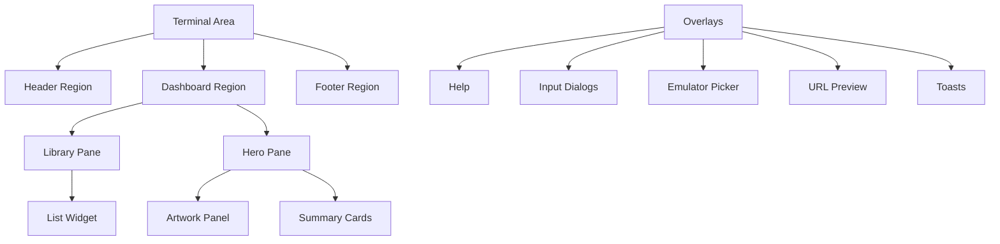

**Diagram sources**
- [ui.rs:23-68](file://src/ui.rs#L23-L68)
- [ui.rs:178-190](file://src/ui.rs#L178-L190)
- [ui.rs:276-292](file://src/ui.rs#L276-L292)

**Section sources**
- [ui.rs:23-68](file://src/ui.rs#L23-L68)
- [ui.rs:178-190](file://src/ui.rs#L178-L190)
- [ui.rs:276-292](file://src/ui.rs#L276-L292)

## Core Components
- Main render orchestration: The render function computes viewport mode, applies theme, splits the screen into header, dashboard, and footer, and conditionally renders overlays. It ensures toasts are drawn last to remain on top.
- Header: Displays title, tabs, contextual stats, and system status. Stats are built from presentation helpers and styled according to semantic meaning.
- Dashboard: Horizontal split between library and hero panes, with widths depending on viewport mode.
- Library pane: Renders a scrollable list of items with selection highlighting and metadata badges.
- Hero pane: Vertical split between artwork and summary cards, with content varying by active tab.
- Artwork panel: Renders artwork via a controller that selects between companion files, cached files, or text fallbacks.
- Summary cards: Displays title, platform/generation, badges, runtime stats, and technical details, adapting to viewport width.
- Footer: Shows contextual hints and status, styled with borders and background.
- Overlays: Help dialog, input overlays (search, add source, Emu-Land search), emulator picker, and URL preview.
- Toasts: Non-blocking notifications with slide-in/slide-out animations and deduplication.

**Section sources**
- [ui.rs:23-68](file://src/ui.rs#L23-L68)
- [ui.rs:70-137](file://src/ui.rs#L70-L137)
- [ui.rs:178-190](file://src/ui.rs#L178-L190)
- [ui.rs:192-274](file://src/ui.rs#L192-L274)
- [ui.rs:276-292](file://src/ui.rs#L276-L292)
- [ui.rs:294-337](file://src/ui.rs#L294-L337)
- [ui.rs:339-464](file://src/ui.rs#L339-L464)
- [ui.rs:466-561](file://src/ui.rs#L466-L561)
- [ui.rs:563-575](file://src/ui.rs#L563-L575)
- [ui.rs:577-600](file://src/ui.rs#L577-L600)
- [ui.rs:602-689](file://src/ui.rs#L602-L689)
- [ui.rs:691-761](file://src/ui.rs#L691-L761)
- [ui.rs:763-864](file://src/ui.rs#L763-L864)
- [ui.rs:866-1025](file://src/ui.rs#L866-L1025)
- [ui.rs:1027-1127](file://src/ui.rs#L1027-L1127)
- [layout.rs:12-61](file://src/ui/layout.rs#L12-L61)
- [theme.rs:11-107](file://src/ui/theme.rs#L11-L107)
- [presentation.rs:5-31](file://src/presentation.rs#L5-L31)
- [artwork.rs:18-208](file://src/artwork.rs#L18-L208)
- [toast.rs:35-82](file://src/toast.rs#L35-L82)

## Architecture Overview
The rendering pipeline integrates state from the application model with presentation helpers and UI utilities. The render function delegates to specialized renderers for each region and overlay. State transitions (navigation, overlays, downloads) update the model, which drives subsequent renders.

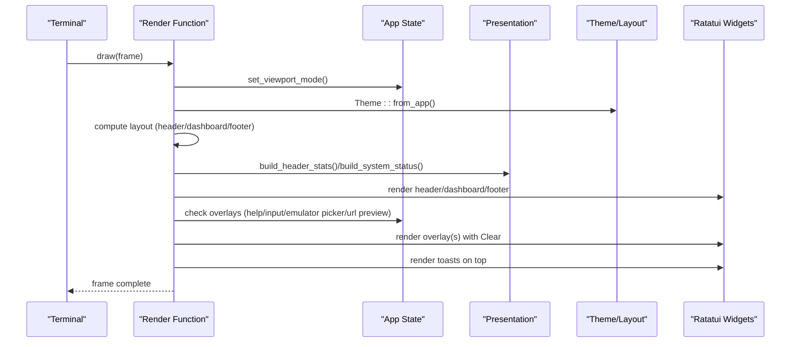

**Diagram sources**
- [ui.rs:23-68](file://src/ui.rs#L23-L68)
- [ui.rs:70-137](file://src/ui.rs#L70-L137)
- [ui.rs:178-190](file://src/ui.rs#L178-L190)
- [ui.rs:577-600](file://src/ui.rs#L577-L600)
- [ui.rs:602-689](file://src/ui.rs#L602-L689)
- [ui.rs:691-761](file://src/ui.rs#L691-L761)
- [ui.rs:866-1025](file://src/ui.rs#L866-L1025)
- [ui.rs:1027-1127](file://src/ui.rs#L1027-L1127)
- [presentation.rs:34-170](file://src/presentation.rs#L34-L170)
- [theme.rs:28-75](file://src/ui/theme.rs#L28-L75)
- [layout.rs:19-43](file://src/ui/layout.rs#L19-L43)

## Detailed Component Analysis

### Main Render Orchestration
- Computes viewport mode from terminal area and sets it on the app.
- Builds theme from terminal capabilities.
- Validates minimum terminal size and renders a friendly message if too small.
- Splits the area into header, dashboard, and footer using fixed and min constraints.
- Renders overlays conditionally: help, input dialogs, Emu-Land search, URL preview, emulator picker.
- Renders toasts last to ensure they appear on top.

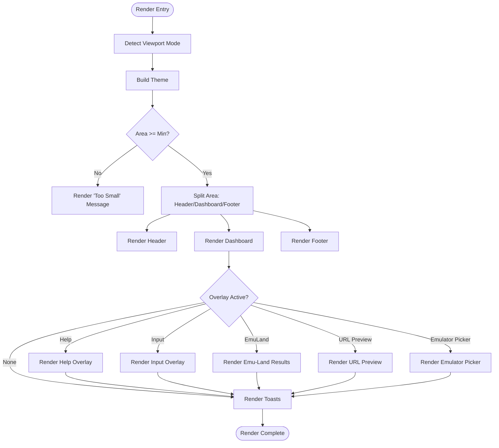

**Diagram sources**
- [ui.rs:23-68](file://src/ui.rs#L23-L68)
- [ui.rs:1027-1044](file://src/ui.rs#L1027-L1044)
- [ui.rs:46-67](file://src/ui.rs#L46-L67)

**Section sources**
- [ui.rs:23-68](file://src/ui.rs#L23-L68)
- [ui.rs:1027-1044](file://src/ui.rs#L1027-L1044)

### Header Component
- Uses a three-row vertical layout inside a bordered block.
- Row 0: Title and tabs with focus-aware styling.
- Row 1: Contextual stats computed from presentation helpers.
- Row 2: Right-aligned system status with muted colors.

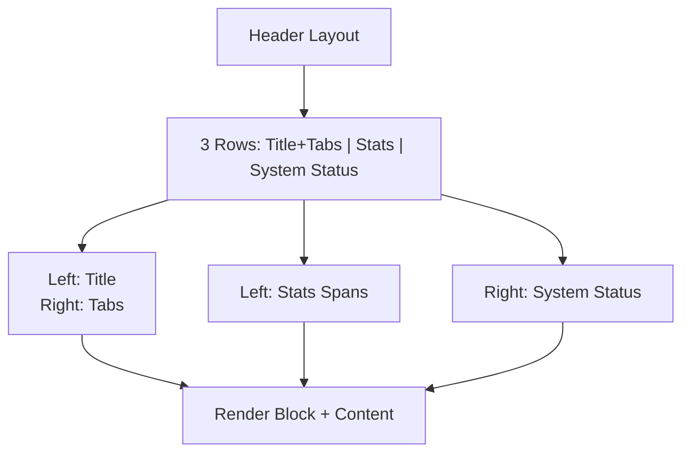

**Diagram sources**
- [ui.rs:70-137](file://src/ui.rs#L70-L137)
- [presentation.rs:34-170](file://src/presentation.rs#L34-L170)
- [theme.rs:110-121](file://src/ui/theme.rs#L110-L121)

**Section sources**
- [ui.rs:70-137](file://src/ui.rs#L70-L137)
- [presentation.rs:34-170](file://src/presentation.rs#L34-L170)

### Dashboard Composition
- Horizontal split between library and hero panes.
- Widths vary by viewport mode to balance content density.

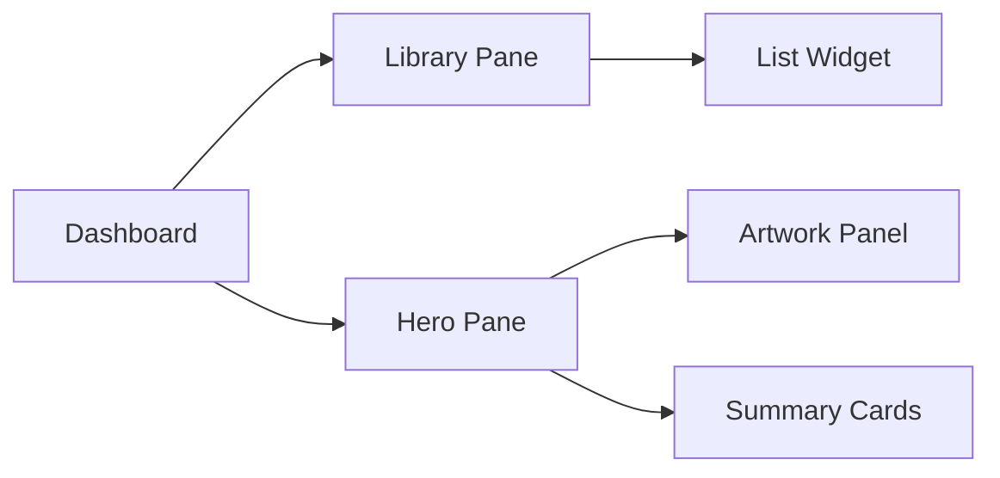

**Diagram sources**
- [ui.rs:178-190](file://src/ui.rs#L178-L190)
- [ui.rs:192-274](file://src/ui.rs#L192-L274)
- [ui.rs:276-292](file://src/ui.rs#L276-L292)
- [ui.rs:294-337](file://src/ui.rs#L294-L337)
- [ui.rs:339-464](file://src/ui.rs#L339-L464)

**Section sources**
- [ui.rs:178-190](file://src/ui.rs#L178-L190)
- [ui.rs:192-274](file://src/ui.rs#L192-L274)
- [ui.rs:276-292](file://src/ui.rs#L276-L292)

### Library List Component
- Computes item count per active tab and builds a list of items with metadata badges.
- Uses a stateful list with selection highlighting and truncation for long titles.
- Syncs artwork when selection changes.

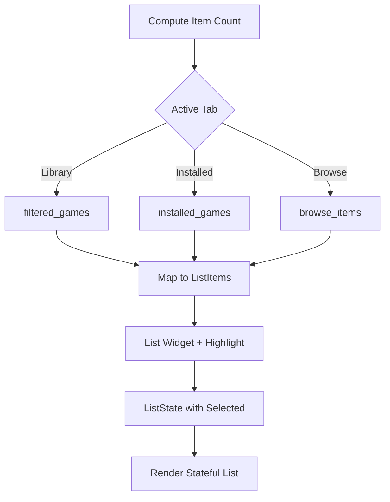

**Diagram sources**
- [ui.rs:192-274](file://src/ui.rs#L192-L274)
- [app/mod.rs:183-192](file://src/app/mod.rs#L183-L192)
- [app/state.rs:8-84](file://src/app/state.rs#L8-L84)

**Section sources**
- [ui.rs:192-274](file://src/ui.rs#L192-L274)
- [app/mod.rs:183-192](file://src/app/mod.rs#L183-L192)
- [app/state.rs:8-84](file://src/app/state.rs#L8-L84)

### Hero Display and Summary Cards
- Hero pane splits vertically into artwork and summary areas.
- Summary cards adapt to viewport width and focus state:
  - Top card: title, platform, generation, badges, vibe/play lines.
  - Middle card: runtime stats (art source, load progress, state).
  - Bottom card: technical/file state details, optional hash.
- Browse summary mirrors the layout with browse-specific metadata.

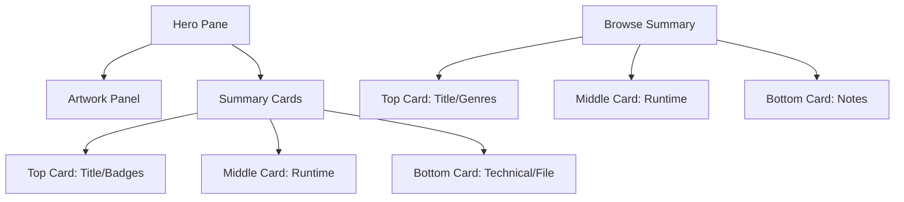

**Diagram sources**
- [ui.rs:276-292](file://src/ui.rs#L276-L292)
- [ui.rs:294-337](file://src/ui.rs#L294-L337)
- [ui.rs:339-464](file://src/ui.rs#L339-L464)
- [ui.rs:466-561](file://src/ui.rs#L466-L561)

**Section sources**
- [ui.rs:276-292](file://src/ui.rs#L276-L292)
- [ui.rs:339-464](file://src/ui.rs#L339-L464)
- [ui.rs:466-561](file://src/ui.rs#L466-L561)

### Artwork Panel
- Uses an artwork controller to select between companion file, cached file, or text fallback.
- Renders via a stateful image protocol when supported; otherwise falls back to centered lines.
- Provides source labels and path labels for diagnostics.

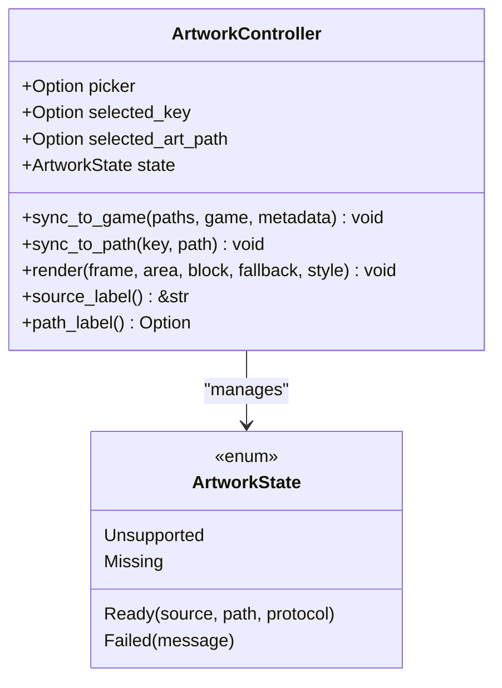

**Diagram sources**
- [artwork.rs:18-208](file://src/artwork.rs#L18-L208)

**Section sources**
- [ui.rs:294-337](file://src/ui.rs#L294-L337)
- [artwork.rs:18-208](file://src/artwork.rs#L18-L208)

### Summary Builder
- Produces structured hero summaries from game metadata and focus state.
- Adapts content width and includes optional hash based on viewport and focus.

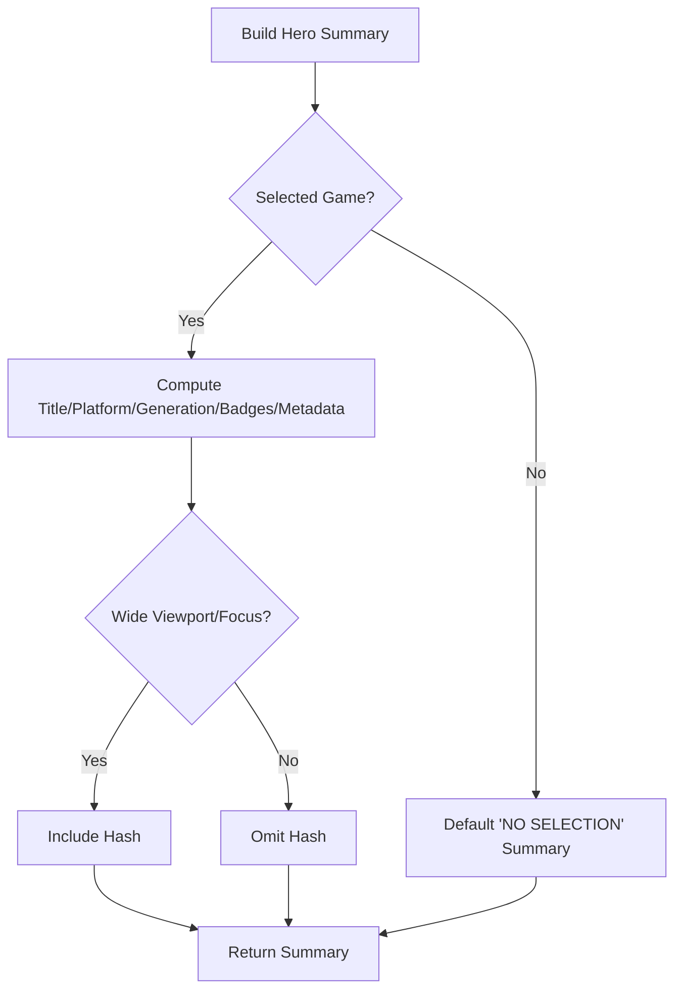

**Diagram sources**
- [presentation.rs:172-269](file://src/presentation.rs#L172-L269)

**Section sources**
- [presentation.rs:172-269](file://src/presentation.rs#L172-L269)

### Footer Component
- Displays contextual footer hints and status with bordered block styling.

**Section sources**
- [ui.rs:563-575](file://src/ui.rs#L563-L575)

### Overlay System
- Help overlay: Full-screen help text with panel block and clear background.
- Input overlays: Search, add-source wizard (choose/url/emu-land/manifest), and Emu-Land search.
- Emulator picker: Stateful list with availability badges and notes.
- URL preview: Two-column layout with artwork preview and metadata/action rows.
- Z-index management: Overlays are drawn after base regions and before toasts. Each overlay is cleared before rendering to avoid artifacts.

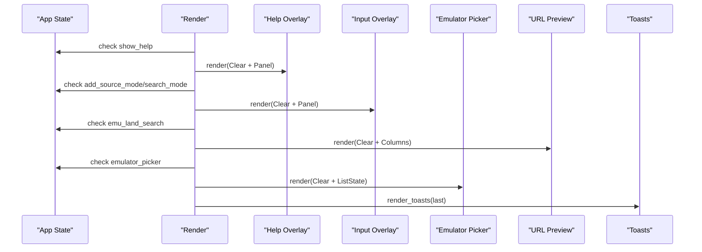

**Diagram sources**
- [ui.rs:46-67](file://src/ui.rs#L46-L67)
- [ui.rs:577-600](file://src/ui.rs#L577-L600)
- [ui.rs:691-761](file://src/ui.rs#L691-L761)
- [ui.rs:763-864](file://src/ui.rs#L763-L864)
- [ui.rs:866-1025](file://src/ui.rs#L866-L1025)
- [ui.rs:602-689](file://src/ui.rs#L602-L689)
- [ui.rs:1046-1127](file://src/ui.rs#L1046-L1127)

**Section sources**
- [ui.rs:46-67](file://src/ui.rs#L46-L67)
- [ui.rs:577-600](file://src/ui.rs#L577-L600)
- [ui.rs:691-761](file://src/ui.rs#L691-L761)
- [ui.rs:763-864](file://src/ui.rs#L763-L864)
- [ui.rs:866-1025](file://src/ui.rs#L866-L1025)
- [ui.rs:602-689](file://src/ui.rs#L602-L689)
- [ui.rs:1046-1127](file://src/ui.rs#L1046-L1127)

### Stateful Rendering and Interactive Elements
- Stateful widgets:
  - List widgets with ListState for selection and highlight styles.
  - Stateful image rendering for artwork.
- State transitions:
  - Navigation moves selection across library, installed, and browse lists.
  - Focus cycling moves between library, artwork, and summary panes.
  - Modal overlays push and pop state, updating artwork previews where applicable.
- Dynamic updates:
  - Worker events update game states, trigger recomputation, and refresh artwork.
  - Toast manager animates and deduplicates notifications.

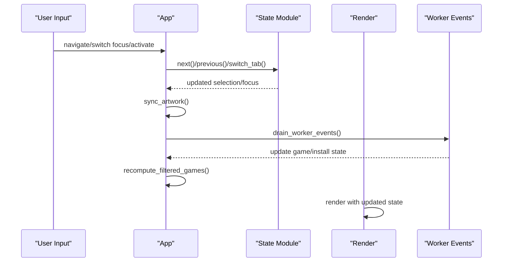

**Diagram sources**
- [app/input.rs:14-58](file://src/app/input.rs#L14-L58)
- [app/state.rs:8-84](file://src/app/state.rs#L8-L84)
- [app/mod.rs:221-227](file://src/app/mod.rs#L221-L227)
- [app/mod.rs:331-347](file://src/app/mod.rs#L331-L347)
- [app/events.rs:24-98](file://src/app/events.rs#L24-L98)
- [ui.rs:23-68](file://src/ui.rs#L23-L68)

**Section sources**
- [app/input.rs:14-58](file://src/app/input.rs#L14-L58)
- [app/state.rs:8-84](file://src/app/state.rs#L8-L84)
- [app/mod.rs:221-227](file://src/app/mod.rs#L221-L227)
- [app/mod.rs:331-347](file://src/app/mod.rs#L331-L347)
- [app/events.rs:24-98](file://src/app/events.rs#L24-L98)
- [ui.rs:23-68](file://src/ui.rs#L23-L68)

### Custom Widget Creation and Layout Integration
- Panel blocks: Reusable bordered containers with focus-aware titles and borders.
- Pills and pill rows: Styled badges for tags and metadata.
- Mini progress bars: Compact visual indicators for load progress.
- Centered lines: Utility for centered text alignment.
- Layout helpers: Constants for header/footer heights and minimum sizes.

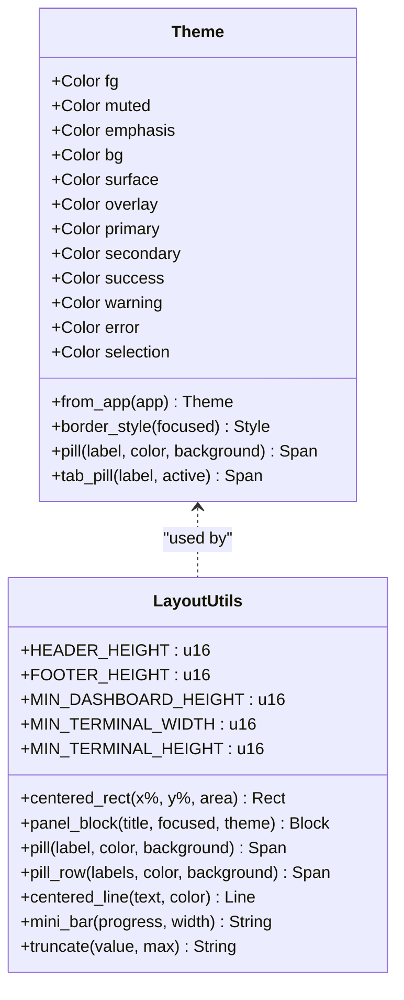

**Diagram sources**
- [theme.rs:11-107](file://src/ui/theme.rs#L11-L107)
- [layout.rs:12-109](file://src/ui/layout.rs#L12-L109)

**Section sources**
- [theme.rs:11-107](file://src/ui/theme.rs#L11-L107)
- [layout.rs:12-109](file://src/ui/layout.rs#L12-L109)

### Performance Considerations
- Efficient layout computation: Fixed and min constraints minimize recalculation overhead.
- Minimal redraws: Overlays are cleared before rendering to prevent artifacts; toasts are batch-rendered.
- Conditional rendering: Overlays are only drawn when active, reducing unnecessary widget updates.
- State synchronization: Artwork syncing is scoped to selection changes and browse previews to avoid redundant work.
- Worker-driven updates: Background jobs update state, deferring heavy work off the main render loop.

[No sources needed since this section provides general guidance]

### Troubleshooting Guide
- Terminal too small: A centered message with minimum size requirements is displayed when the terminal is below thresholds.
- Overlay conflicts: Overlays are cleared before rendering; ensure only one overlay flag is active at a time.
- Artwork rendering issues: The artwork controller falls back to text lines when unsupported or missing; check source labels for diagnostics.
- Toast visibility: To hide the latest toast, use the dedicated key binding; the manager enforces max visible count and removes fully dismissed toasts.

**Section sources**
- [ui.rs:1027-1044](file://src/ui.rs#L1027-L1044)
- [ui.rs:577-600](file://src/ui.rs#L577-L600)
- [ui.rs:691-761](file://src/ui.rs#L691-L761)
- [ui.rs:866-1025](file://src/ui.rs#L866-L1025)
- [artwork.rs:146-178](file://src/artwork.rs#L146-L178)
- [app/mod.rs:294-312](file://src/app/mod.rs#L294-L312)

## Dependency Analysis
The UI module depends on:
- App state for selections, tabs, overlays, and artwork controllers.
- Presentation helpers for building header stats and hero summaries.
- Theme and layout utilities for consistent styling and sizing.
- Toast manager for non-intrusive notifications.

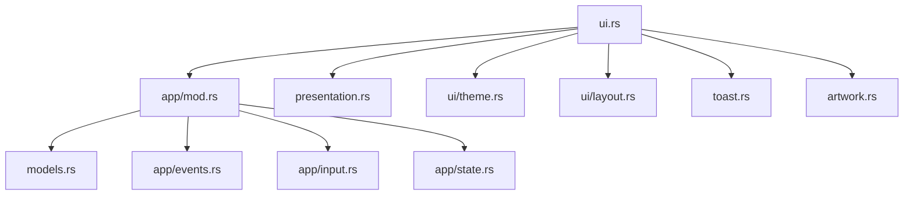

**Diagram sources**
- [ui.rs:12-18](file://src/ui.rs#L12-L18)
- [app/mod.rs:37-44](file://src/app/mod.rs#L37-L44)
- [presentation.rs:1-4](file://src/presentation.rs#L1-L4)
- [models.rs:1-6](file://src/models.rs#L1-L6)
- [toast.rs:1-3](file://src/toast.rs#L1-L3)

**Section sources**
- [ui.rs:12-18](file://src/ui.rs#L12-L18)
- [app/mod.rs:37-44](file://src/app/mod.rs#L37-L44)

## Performance Considerations
- Prefer minimal widget allocations per frame; reuse blocks and spans where possible.
- Use stateful widgets only when selection or state changes; avoid recreating ListState unnecessarily.
- Defer heavy computations to worker threads; update UI via events to keep frames responsive.
- Limit overlay rendering to active states to reduce draw calls.

[No sources needed since this section provides general guidance]

## Conclusion
The UI rendering system composes a responsive terminal interface using Ratatui widgets, stateful components, and a clean overlay model. It balances readability and interactivity through consistent theming, layout utilities, and state synchronization. The modular design enables easy extension of components and overlays while maintaining performance and clarity.