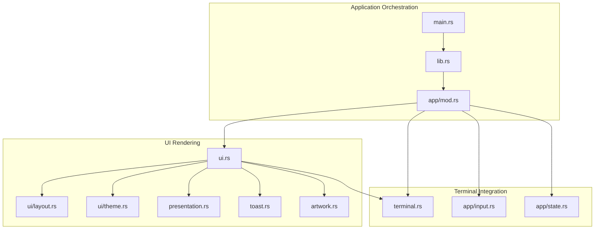
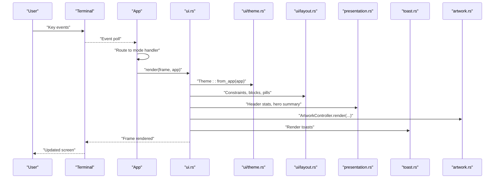
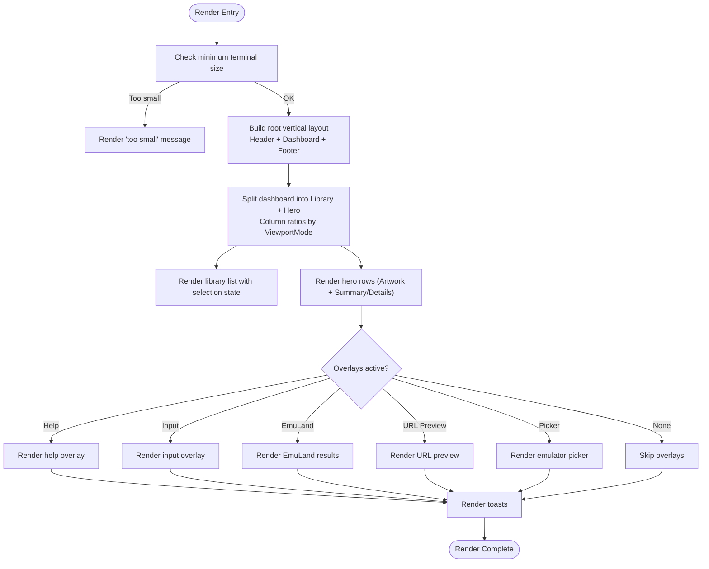
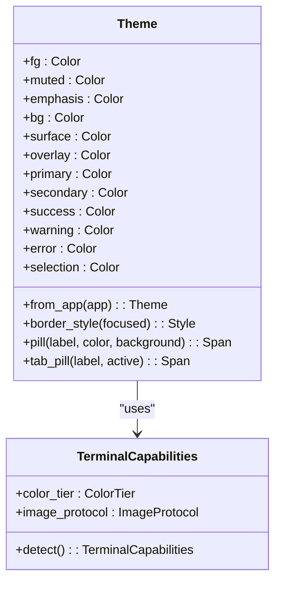
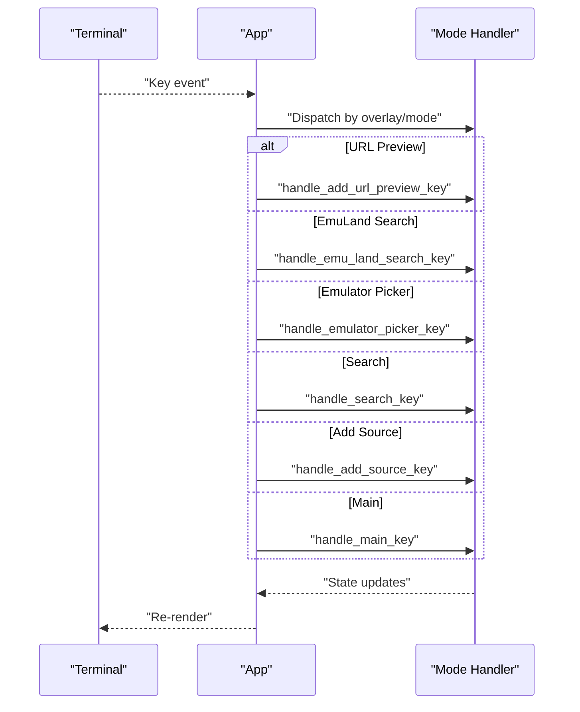
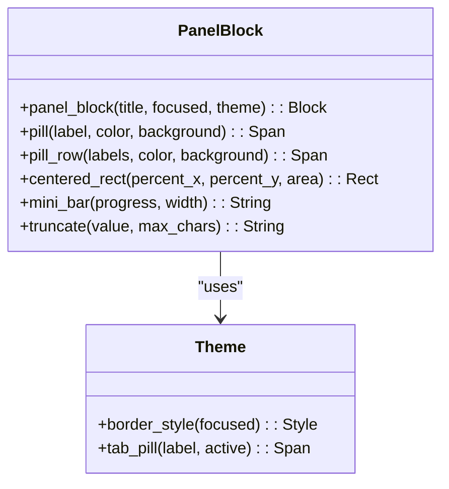
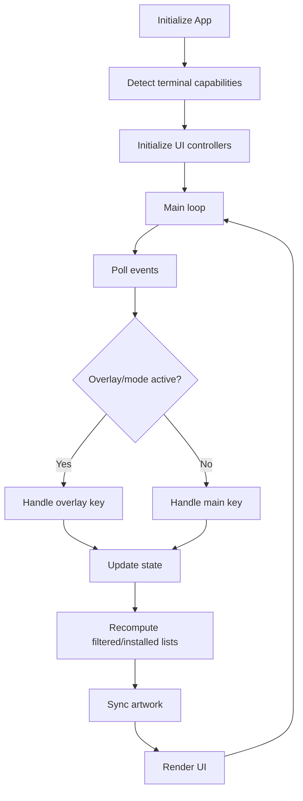
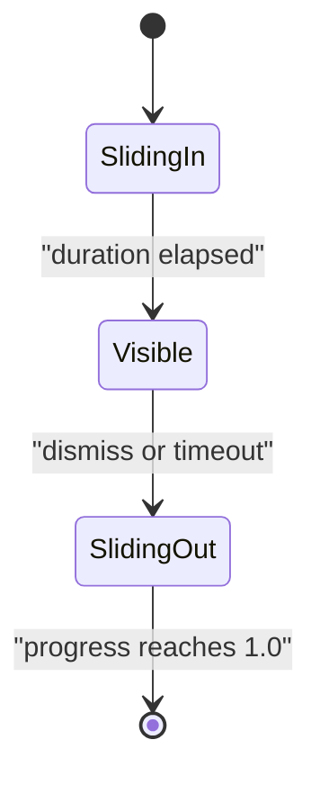
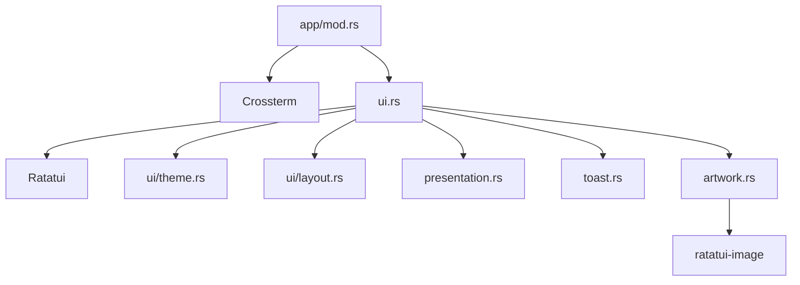

# User Interface System

<cite>
**Referenced Files in This Document**
- [lib.rs](file://src/lib.rs)
- [main.rs](file://src/main.rs)
- [app/mod.rs](file://src/app/mod.rs)
- [app/input.rs](file://src/app/input.rs)
- [app/state.rs](file://src/app/state.rs)
- [terminal.rs](file://src/terminal.rs)
- [ui.rs](file://src/ui.rs)
- [ui/layout.rs](file://src/ui/layout.rs)
- [ui/theme.rs](file://src/ui/theme.rs)
- [toast.rs](file://src/toast.rs)
- [presentation.rs](file://src/presentation.rs)
- [artwork.rs](file://src/artwork.rs)
- [Cargo.toml](file://Cargo.toml)
</cite>

## Table of Contents
1. [Introduction](#introduction)
2. [Project Structure](#project-structure)
3. [Core Components](#core-components)
4. [Architecture Overview](#architecture-overview)
5. [Detailed Component Analysis](#detailed-component-analysis)
6. [Dependency Analysis](#dependency-analysis)
7. [Performance Considerations](#performance-considerations)
8. [Troubleshooting Guide](#troubleshooting-guide)
9. [Conclusion](#conclusion)
10. [Appendices](#appendices)

## Introduction
This document describes the terminal UI system built with Ratatui. It covers responsive layout management, theme system, input handling, component composition, state management, rendering optimization, keyboard navigation, visual feedback, accessibility considerations, cross-platform compatibility, terminal capability detection, and performance optimization. It also provides guidelines for extending the UI with custom components and integrating with the application’s event system.

## Project Structure
The UI system is organized around a central rendering pipeline, a theme subsystem, a layout toolkit, and a state-driven input handler. Supporting modules provide terminal capability detection, toast notifications, artwork rendering, and presentation helpers.

**Diagram sources**
- [main.rs:1-9](file://src/main.rs#L1-L9)
- [lib.rs:1-39](file://src/lib.rs#L1-L39)
- [app/mod.rs:1-800](file://src/app/mod.rs#L1-L800)
- [ui.rs:1-800](file://src/ui.rs#L1-L800)
- [ui/layout.rs:1-109](file://src/ui/layout.rs#L1-L109)
- [ui/theme.rs:1-122](file://src/ui/theme.rs#L1-L122)
- [presentation.rs:1-269](file://src/presentation.rs#L1-L269)
- [toast.rs:1-319](file://src/toast.rs#L1-L319)
- [artwork.rs:1-323](file://src/artwork.rs#L1-L323)
- [terminal.rs:1-161](file://src/terminal.rs#L1-L161)
- [app/input.rs:1-347](file://src/app/input.rs#L1-L347)
- [app/state.rs:1-84](file://src/app/state.rs#L1-L84)

**Section sources**
- [lib.rs:1-39](file://src/lib.rs#L1-L39)
- [main.rs:1-9](file://src/main.rs#L1-L9)
- [Cargo.toml:1-28](file://Cargo.toml#L1-L28)

## Core Components
- Central renderer: orchestrates layout, widgets, overlays, and toasts.
- Theme system: adapts colors to terminal capability tiers.
- Layout utilities: constraints, panels, pills, progress bars, truncation.
- Presentation helpers: header stats, hero summaries, system status.
- Input handler: keyboard routing across modes and overlays.
- State manager: selection, paging, focus cycling, filtering.
- Terminal integration: viewport detection, focus panes, capability detection.
- Toast notifications: animated, deduplicated, queue-limited.
- Artwork controller: protocol-aware image rendering with fallbacks.

**Section sources**
- [ui.rs:23-68](file://src/ui.rs#L23-L68)
- [ui/theme.rs:12-107](file://src/ui/theme.rs#L12-L107)
- [ui/layout.rs:12-109](file://src/ui/layout.rs#L12-L109)
- [presentation.rs:5-170](file://src/presentation.rs#L5-L170)
- [app/input.rs:14-347](file://src/app/input.rs#L14-L347)
- [app/state.rs:8-84](file://src/app/state.rs#L8-L84)
- [terminal.rs:5-133](file://src/terminal.rs#L5-L133)
- [toast.rs:75-246](file://src/toast.rs#L75-L246)
- [artwork.rs:35-208](file://src/artwork.rs#L35-L208)

## Architecture Overview
The UI architecture follows a layered design:
- Application orchestrates terminal lifecycle, event polling, and rendering.
- UI module renders the main dashboard, overlays, and toasts.
- Layout and theme modules encapsulate rendering primitives and color adaptation.
- Presentation helpers compute contextual content for headers and hero panels.
- Artwork controller integrates terminal image protocols with fallback rendering.
- Toast manager provides animated notifications with queue limits.

**Diagram sources**
- [app/mod.rs:553-621](file://src/app/mod.rs#L553-L621)
- [ui.rs:23-68](file://src/ui.rs#L23-L68)
- [ui/theme.rs:28-75](file://src/ui/theme.rs#L28-L75)
- [ui/layout.rs:19-109](file://src/ui/layout.rs#L19-L109)
- [presentation.rs:34-170](file://src/presentation.rs#L34-L170)
- [toast.rs:160-178](file://src/toast.rs#L160-L178)
- [artwork.rs:146-178](file://src/artwork.rs#L146-L178)

## Detailed Component Analysis

### Responsive Layout Management
- Root layout splits the terminal into header, dashboard, and footer using fixed and min constraints.
- Dashboard is split horizontally into library and hero areas, with column ratios varying by viewport mode.
- Hero area stacks artwork and summary/detail panels, with heights adapting to viewport mode.
- Overlay rendering uses centered rectangles sized by percentages of the terminal area.
- Minimum terminal dimensions are enforced; otherwise a “too small” message is shown.

**Diagram sources**
- [ui.rs:23-68](file://src/ui.rs#L23-L68)
- [ui.rs:178-190](file://src/ui.rs#L178-L190)
- [ui.rs:276-292](file://src/ui.rs#L276-L292)
- [ui.rs:46-67](file://src/ui.rs#L46-L67)
- [ui/layout.rs:19-43](file://src/ui/layout.rs#L19-L43)
- [terminal.rs:45-59](file://src/terminal.rs#L45-L59)

**Section sources**
- [ui.rs:33-44](file://src/ui.rs#L33-L44)
- [ui.rs:178-190](file://src/ui.rs#L178-L190)
- [ui.rs:276-292](file://src/ui.rs#L276-L292)
- [ui/layout.rs:12-17](file://src/ui/layout.rs#L12-L17)
- [terminal.rs:45-59](file://src/terminal.rs#L45-L59)

### Theme System
- Theme adapts to terminal capability tier: NoColor, ANSI 16/256, TrueColor.
- Provides semantic colors for foreground, muted, emphasis, backgrounds, surfaces, overlays, and status colors.
- Border styles and pill/tab styling adapt to focus state.
- Status color mapping for install states is centralized.

**Diagram sources**
- [ui/theme.rs:12-107](file://src/ui/theme.rs#L12-L107)
- [terminal.rs:87-133](file://src/terminal.rs#L87-L133)

**Section sources**
- [ui/theme.rs:28-75](file://src/ui/theme.rs#L28-L75)
- [ui/theme.rs:77-107](file://src/ui/theme.rs#L77-L107)
- [terminal.rs:87-133](file://src/terminal.rs#L87-L133)

### Input Handling Mechanisms
- Keyboard routing prioritizes overlays and modes in order: URL preview, EmuLand search, emulator picker, search, add-source, then main navigation.
- Main keys include tab switching, focus cycling, browsing, paging in browse tab, search toggle, add source, enter activation, and quit.
- Search mode supports typing, backspace, commit, and cancel.
- Add-source modes support numeric choices and input handling with preview and import flows.
- EmuLand search overlay supports selection and preview.
- Emulator picker supports selection and launch/install.
- URL preview supports selection and confirm/discard.

**Diagram sources**
- [app/mod.rs:575-621](file://src/app/mod.rs#L575-L621)
- [app/input.rs:14-347](file://src/app/input.rs#L14-L347)

**Section sources**
- [app/input.rs:14-58](file://src/app/input.rs#L14-L58)
- [app/input.rs:60-102](file://src/app/input.rs#L60-L102)
- [app/input.rs:104-210](file://src/app/input.rs#L104-L210)
- [app/input.rs:212-256](file://src/app/input.rs#L212-L256)
- [app/input.rs:258-295](file://src/app/input.rs#L258-L295)
- [app/input.rs:297-345](file://src/app/input.rs#L297-L345)

### Component Composition Patterns
- Panels: reusable block builders with focus-aware borders and titles.
- Pills and badges: styled spans for tags and status indicators.
- Lists: stateful lists with selection highlighting and dynamic item rendering.
- Paragraphs: multi-line text with alignment and wrapping.
- Overlays: centered popups with clear background and block framing.
- Artwork: protocol-aware rendering with fallback text blocks.

**Diagram sources**
- [ui/layout.rs:45-109](file://src/ui/layout.rs#L45-L109)
- [ui/theme.rs:77-106](file://src/ui/theme.rs#L77-L106)

**Section sources**
- [ui/layout.rs:45-109](file://src/ui/layout.rs#L45-L109)
- [ui.rs:70-137](file://src/ui.rs#L70-L137)
- [ui.rs:192-274](file://src/ui.rs#L192-L274)
- [ui.rs:294-337](file://src/ui.rs#L294-L337)
- [ui.rs:339-464](file://src/ui.rs#L339-L464)
- [ui.rs:466-561](file://src/ui.rs#L466-L561)
- [ui.rs:563-575](file://src/ui.rs#L563-L575)
- [ui.rs:577-600](file://src/ui.rs#L577-L600)
- [ui.rs:602-689](file://src/ui.rs#L602-L689)
- [ui.rs:691-761](file://src/ui.rs#L691-L761)
- [ui.rs:763-808](file://src/ui.rs#L763-L808)

### State Management for UI Elements
- Selection: maintains indices per tab and computes selection safely.
- Paging: browse pagination with job spawning and selection reset.
- Focus panes: cycle forward/backward among library, artwork, summary.
- Filtering: recomputes filtered and installed lists based on search query.
- Footer hints: contextual hints update based on active overlays and focus pane.
- Artwork synchronization: switches between browse previews, metadata, and local companion files.

**Diagram sources**
- [app/mod.rs:125-177](file://src/app/mod.rs#L125-L177)
- [app/mod.rs:221-227](file://src/app/mod.rs#L221-L227)
- [app/mod.rs:260-292](file://src/app/mod.rs#L260-L292)
- [app/state.rs:8-84](file://src/app/state.rs#L8-L84)
- [app/mod.rs:331-347](file://src/app/mod.rs#L331-L347)

**Section sources**
- [app/mod.rs:179-192](file://src/app/mod.rs#L179-L192)
- [app/mod.rs:194-209](file://src/app/mod.rs#L194-L209)
- [app/mod.rs:221-227](file://src/app/mod.rs#L221-L227)
- [app/mod.rs:260-292](file://src/app/mod.rs#L260-L292)
- [app/state.rs:8-84](file://src/app/state.rs#L8-L84)

### Rendering Optimization Techniques
- Minimal redraws: overlays are cleared before drawing to prevent artifacts.
- Conditional rendering: only draw overlays and toasts when active.
- Efficient list rendering: stateful list with highlight style and selection index.
- Layout reuse: shared layout constants and helper functions reduce repeated computation.
- Early exits: minimum terminal size checks prevent unnecessary rendering.

**Section sources**
- [ui.rs:577-600](file://src/ui.rs#L577-L600)
- [ui.rs:691-761](file://src/ui.rs#L691-L761)
- [ui.rs:763-808](file://src/ui.rs#L763-L808)
- [ui.rs:266-273](file://src/ui.rs#L266-L273)
- [ui/layout.rs:12-17](file://src/ui/layout.rs#L12-L17)

### Usage Examples and Customization
- UI customization:
  - Modify theme colors by adjusting the Theme::from_app mapping for each terminal capability tier.
  - Adjust layout constants (header/footer heights, minimum dashboard height) to fit terminal constraints.
  - Extend panel_block to add icons or additional styling.
- Layout configuration:
  - Change column ratios in the dashboard by editing the horizontal constraints in the dashboard renderer.
  - Tune hero panel heights by adjusting vertical constraints in the hero renderer.
- Theme modifications:
  - Override status_color mapping for install states to change color semantics.
  - Customize pill/tab styling by updating Theme::pill and Theme::tab_pill.

[No sources needed since this section provides general guidance]

### Keyboard Navigation Patterns and Visual Feedback
- Navigation:
  - j/k or arrow keys move selection; Tab/Shift+Tab cycles focus panes; h/l moves focus left/right.
  - p/n pages through browse entries when in Browse tab.
- Search:
  - / enters search mode; typing updates input buffer; Enter commits; Esc cancels.
- Overlays:
  - Help overlay toggles with ?; overlays close with Esc.
  - URL preview supports Enter to confirm or d/Esc to discard.
  - EmuLand search supports j/k to select results; Enter to preview.
  - Emulator picker supports j/k to select emulator; Enter to launch/install.
- Visual feedback:
  - Toast notifications appear with icons and colors; animations slide in/out.
  - Focus panes highlight panel borders and titles.
  - Status colors reflect install state and metadata match confidence.

**Section sources**
- [app/input.rs:16-58](file://src/app/input.rs#L16-L58)
- [app/input.rs:60-102](file://src/app/input.rs#L60-L102)
- [app/input.rs:212-256](file://src/app/input.rs#L212-L256)
- [app/input.rs:258-295](file://src/app/input.rs#L258-L295)
- [app/input.rs:297-345](file://src/app/input.rs#L297-L345)
- [toast.rs:12-22](file://src/toast.rs#L12-L22)
- [ui/theme.rs:77-80](file://src/ui/theme.rs#L77-L80)
- [ui/theme.rs:109-121](file://src/ui/theme.rs#L109-L121)

### Accessibility Considerations
- Contrast: Theme adapts to terminal capability tiers; ensure sufficient contrast in NoColor mode.
- Focus indication: FocusPane highlights panel borders and titles for orientation.
- Text wrapping: Paragraph widgets wrap long lines to improve readability.
- Terminal capability detection: Falls back to text-only rendering when images are unsupported.

**Section sources**
- [ui/theme.rs:28-75](file://src/ui/theme.rs#L28-L75)
- [ui/theme.rs:77-80](file://src/ui/theme.rs#L77-L80)
- [ui.rs:401-403](file://src/ui.rs#L401-L403)
- [terminal.rs:87-133](file://src/terminal.rs#L87-L133)
- [artwork.rs:146-178](file://src/artwork.rs#L146-L178)

### Component States, Animations, and Transitions
- Toast states:
  - SlidingIn: progress from 0 to 1 over animation duration.
  - Visible: remains until default duration elapses.
  - SlidingOut: progress from 0 to 1 over shortened duration.
- Transition logic:
  - Deduplication prevents identical toasts from stacking.
  - Max visible limit enforces dismissal of oldest toasts when exceeding capacity.
  - Dismiss latest and dismiss all provide user control.

**Diagram sources**
- [toast.rs:24-33](file://src/toast.rs#L24-L33)
- [toast.rs:175-218](file://src/toast.rs#L175-L218)

**Section sources**
- [toast.rs:74-246](file://src/toast.rs#L74-L246)

### Cross-Platform Compatibility and Terminal Capability Detection
- Color tier detection:
  - NO_COLOR disables color; COLORTERM truecolor/24bit forces TrueColor; TERM 256color forces ANSI256; otherwise ANSI16.
- Image protocol detection:
  - iTerm2, Kitty, Ghostty detected; others fall back to unsupported.
- Artwork rendering:
  - Uses ratatui-image with terminal-specific protocols; falls back to text blocks when unsupported.

**Section sources**
- [terminal.rs:92-133](file://src/terminal.rs#L92-L133)
- [artwork.rs:52-63](file://src/artwork.rs#L52-L63)
- [artwork.rs:210-213](file://src/artwork.rs#L210-L213)

### Performance Optimization
- Rendering:
  - Clear overlays before drawing to minimize artifacts.
  - Use stateful widgets (ListState) to avoid re-rendering unchanged selections.
  - Compute layout once per frame and reuse constraints.
- Input:
  - Short polling interval reduces latency while keeping CPU usage low.
- Artwork:
  - Protocol selection occurs only when artwork is present; otherwise fallback is immediate.
- State:
  - Recompute filtered lists only when search query or selection changes.

**Section sources**
- [ui.rs:577-600](file://src/ui.rs#L577-L600)
- [ui.rs:266-273](file://src/ui.rs#L266-L273)
- [app/mod.rs:46](file://src/app/mod.rs#L46)
- [artwork.rs:146-178](file://src/artwork.rs#L146-L178)

### Guidelines for Extending the UI
- Adding a new overlay:
  - Define a state variant in App and a render function in ui.rs.
  - Add a key handler in app/input.rs with mode-specific behavior.
  - Integrate overlay rendering in the main render function with centered_rect.
- Creating a new panel:
  - Use panel_block for consistent borders and focus styling.
  - Compose with layout helpers (mini_bar, pill, pill_row) for consistent visuals.
- Integrating with the event system:
  - Dispatch to the appropriate mode handler based on active overlays.
  - Update App state and trigger recomputation of filtered lists or artwork sync.
- Theming:
  - Extend Theme with new semantic colors and update status_color mapping as needed.
  - Ensure fallbacks for NoColor mode remain readable.

[No sources needed since this section provides general guidance]

## Dependency Analysis
The UI system depends on Ratatui for rendering, Crossterm for terminal I/O, and ratatui-image for protocol-aware image rendering. The application orchestrates rendering and input handling, while UI modules encapsulate rendering logic.

**Diagram sources**
- [Cargo.toml:6-24](file://Cargo.toml#L6-L24)
- [app/mod.rs:26-44](file://src/app/mod.rs#L26-L44)
- [ui.rs:6-18](file://src/ui.rs#L6-L18)
- [artwork.rs:12-12](file://src/artwork.rs#L12-L12)

**Section sources**
- [Cargo.toml:6-24](file://Cargo.toml#L6-L24)
- [app/mod.rs:26-44](file://src/app/mod.rs#L26-L44)

## Performance Considerations
- Use minimal redraws by clearing overlays before drawing.
- Prefer stateful widgets to avoid unnecessary re-renders.
- Keep layout computations constant-time by caching constraints.
- Limit toast queue size to reduce rendering overhead.
- Defer heavy operations (artwork loading) to background threads and update state accordingly.

[No sources needed since this section provides general guidance]

## Troubleshooting Guide
- Terminal too small:
  - The UI checks minimum width and height; resize the terminal to meet the thresholds.
- Images not displaying:
  - Verify terminal image protocol support; fallback to text blocks is automatic.
- Overlays stuck open:
  - Ensure Esc is pressed to close overlays; confirm state transitions in key handlers.
- Toasts not appearing:
  - Check ToastManager defaults and ensure toasts are not being deduplicated or dismissed too quickly.

**Section sources**
- [ui/layout.rs:12-17](file://src/ui/layout.rs#L12-L17)
- [terminal.rs:111-126](file://src/terminal.rs#L111-L126)
- [app/input.rs:58-58](file://src/app/input.rs#L58-L58)
- [toast.rs:104-138](file://src/toast.rs#L104-L138)

## Conclusion
The UI system combines a robust rendering pipeline, adaptive theming, responsive layouts, and efficient state management to deliver a polished terminal experience. Its modular design enables easy extension and customization while maintaining performance and accessibility across diverse terminal environments.

[No sources needed since this section summarizes without analyzing specific files]

## Appendices

### Keyboard Controls Reference
- Navigation: j/k or arrows to move selection; Tab/Shift+Tab to cycle focus panes; h/l to move focus left/right.
- Browse: p/n to navigate pages in Browse tab.
- Search: / to enter search mode; Enter to commit; Esc to cancel.
- Add source: a to open add-source menu; 1/2/3 to choose URL, EmuLand search, or manifest import.
- Overlays: Enter to activate; Esc to close; j/k to navigate in overlays.
- Quit: q or Esc to exit overlays and quit when appropriate.

**Section sources**
- [ui.rs:577-600](file://src/ui.rs#L577-L600)
- [app/input.rs:16-58](file://src/app/input.rs#L16-L58)
- [app/input.rs:60-102](file://src/app/input.rs#L60-L102)
- [app/input.rs:104-210](file://src/app/input.rs#L104-L210)
- [app/input.rs:212-256](file://src/app/input.rs#L212-L256)
- [app/input.rs:258-295](file://src/app/input.rs#L258-L295)
- [app/input.rs:297-345](file://src/app/input.rs#L297-L345)